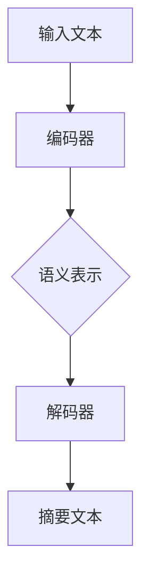

                 

# LLAMA在文本摘要方面的新进展

## 关键词：文本摘要、LLAMA、自然语言处理、NLP、模型改进、算法优化

## 摘要：
本文旨在探讨LLAMA（Large Language Model for Abstract Generation and Analysis）在文本摘要领域的新进展。文本摘要是一种重要的自然语言处理任务，旨在从大量文本中提取关键信息，生成简洁、连贯的摘要。LLAMA作为一种先进的预训练语言模型，其在文本摘要方面的性能和效果备受关注。本文将深入分析LLAMA在文本摘要任务中的核心概念、算法原理、数学模型，并通过实际项目实战，展示其代码实现和性能表现。此外，还将探讨LLAMA在文本摘要领域的实际应用场景，以及相关工具和资源的推荐，为读者提供一个全面了解LLAMA在文本摘要方面的新进展的视角。

## 1. 背景介绍

### 1.1 文本摘要的发展历程

文本摘要作为一种自然语言处理技术，旨在从大量文本中提取关键信息，生成简洁、连贯的摘要。文本摘要的发展历程可以追溯到上世纪80年代，当时的早期研究主要集中在基于规则的方法和统计方法。随着计算机技术和自然语言处理技术的发展，文本摘要领域经历了多个阶段的演变，从基于规则的方法逐渐转向基于统计模型和深度学习的方法。

### 1.2 文本摘要的任务类型

文本摘要可以分为两种类型：抽取式摘要和生成式摘要。抽取式摘要旨在从原始文本中提取关键信息，生成摘要，通常采用关键词提取、句子级抽取等方法。生成式摘要则通过建模文本的语义结构，生成全新的摘要文本，具有更高的灵活性和创造力。

### 1.3 当前文本摘要技术的发展趋势

近年来，基于深度学习的文本摘要技术取得了显著进展。特别是预训练语言模型，如GPT、BERT等，在文本摘要任务中表现出色。这些模型通过大规模预训练，能够更好地理解文本的语义信息，从而生成更高质量、更符合人类需求的摘要。

## 2. 核心概念与联系

### 2.1 语言模型

语言模型是一种概率模型，用于预测一个词序列的概率分布。在文本摘要任务中，语言模型可以帮助我们理解文本的语义信息，从而生成高质量的摘要。

### 2.2 自然语言处理（NLP）

自然语言处理（NLP）是计算机科学和人工智能领域的一个分支，旨在使计算机能够理解、处理和生成自然语言。文本摘要作为NLP的一个重要应用领域，依赖于NLP技术来提取文本的关键信息。

### 2.3 文本摘要模型架构

文本摘要模型通常包括编码器和解码器两个部分。编码器负责将原始文本编码为语义表示，解码器则根据编码器的输出生成摘要文本。

### 2.4 Mermaid 流程图

为了更清晰地展示文本摘要模型的工作流程，我们可以使用Mermaid流程图来表示。以下是文本摘要模型的Mermaid流程图：



在这个流程图中，输入文本首先经过编码器编码为语义表示，然后解码器根据语义表示生成摘要文本。这个过程中，语言模型和NLP技术起到了关键作用。

## 3. 核心算法原理 & 具体操作步骤

### 3.1 编码器

编码器是文本摘要模型的核心组成部分，负责将原始文本编码为语义表示。常用的编码器架构包括循环神经网络（RNN）、长短时记忆网络（LSTM）和Transformer等。

#### 3.1.1 RNN编码器

RNN编码器是一种基于循环神经网络的结构，能够处理序列数据。在文本摘要任务中，RNN编码器可以按照时间步逐个读取输入文本的词向量，并更新隐藏状态，从而生成语义表示。

#### 3.1.2 LSTM编码器

LSTM编码器是RNN的一种变体，通过引入门控机制来更好地处理长距离依赖问题。在文本摘要任务中，LSTM编码器可以更好地捕捉文本中的关键信息。

#### 3.1.3 Transformer编码器

Transformer编码器是一种基于自注意力机制的神经网络结构，能够更好地处理长距离依赖问题。在文本摘要任务中，Transformer编码器可以生成高质量的语义表示。

### 3.2 解码器

解码器负责根据编码器的输出生成摘要文本。解码器可以采用与编码器相同的架构，也可以采用不同的架构，如自回归语言模型（ARLM）等。

#### 3.2.1 ARLM解码器

自回归语言模型（ARLM）是一种常用的解码器架构，通过逐个预测摘要文本的下一个词，从而生成完整的摘要。ARLM解码器通常采用Transformer架构，具有良好的性能和灵活性。

### 3.3 模型训练与优化

文本摘要模型的训练与优化是提高模型性能的关键步骤。常用的优化方法包括梯度下降、Adam优化器等。此外，为了提高模型的泛化能力，可以采用数据增强、正则化等技术。

## 4. 数学模型和公式 & 详细讲解 & 举例说明

### 4.1 编码器数学模型

编码器的数学模型主要涉及词向量表示和序列编码。词向量表示通过将单词映射到高维空间，使得语义相似的单词在空间中靠近。常见的词向量表示方法包括Word2Vec、GloVe等。序列编码则通过将输入文本序列编码为序列向量化表示，从而提取文本的语义信息。

#### 4.1.1 词向量表示

假设我们有一个单词序列 \( w_1, w_2, \ldots, w_n \)，可以使用Word2Vec模型来生成每个单词的词向量表示。Word2Vec模型通常采用以下公式来计算词向量：

$$
\textbf{v}_i = \text{Word2Vec}(w_i)
$$

其中，\(\textbf{v}_i\) 表示单词 \(w_i\) 的词向量。

#### 4.1.2 序列编码

序列编码是将输入文本序列编码为序列向量化表示的过程。在RNN和LSTM编码器中，序列编码通常通过以下公式实现：

$$
\textbf{h}_t = \text{Encoder}(\textbf{x}_t, \textbf{h}_{t-1})
$$

其中，\(\textbf{h}_t\) 表示第 \(t\) 个时间步的隐藏状态，\(\textbf{x}_t\) 表示第 \(t\) 个时间步的输入词向量，\(\textbf{h}_{t-1}\) 表示前一个时间步的隐藏状态。

### 4.2 解码器数学模型

解码器的数学模型主要涉及词汇表和生成文本的步骤。在ARLM解码器中，解码器通过生成下一个词的概率分布来预测下一个词，然后迭代生成完整的摘要。

#### 4.2.1 词汇表

假设我们有一个词汇表 \(V\)，其中包含所有的单词。对于每个单词 \(w_i\)，可以使用以下公式计算其在词汇表中的索引：

$$
i = \text{Index}(w_i, V)
$$

#### 4.2.2 生成文本

生成文本的过程是通过逐个生成下一个词来实现的。在ARLM解码器中，生成下一个词的概率分布可以使用以下公式计算：

$$
P(w_t | w_1, w_2, \ldots, w_{t-1}) = \text{Softmax}(\textbf{v}_t)
$$

其中，\(\textbf{v}_t\) 是解码器在当前时间步生成的词向量。

### 4.3 举例说明

假设我们有一个文本序列 \( w_1, w_2, \ldots, w_n \)，可以使用LLAMA模型来生成摘要。以下是LLAMA模型的具体操作步骤：

1. 使用词向量表示将文本序列转换为词向量表示：
   $$
   \textbf{x}_1 = \text{Word2Vec}(w_1)
   $$
   $$
   \textbf{x}_2 = \text{Word2Vec}(w_2)
   $$
   $$
   \ldots
   $$
   $$
   \textbf{x}_n = \text{Word2Vec}(w_n)
   $$

2. 使用编码器将词向量序列编码为语义表示：
   $$
   \textbf{h}_1 = \text{Encoder}(\textbf{x}_1, \textbf{h}_{0})
   $$
   $$
   \textbf{h}_2 = \text{Encoder}(\textbf{x}_2, \textbf{h}_{1})
   $$
   $$
   \ldots
   $$
   $$
   \textbf{h}_n = \text{Encoder}(\textbf{x}_n, \textbf{h}_{n-1})
   $$

3. 使用解码器生成摘要：
   $$
   \textbf{v}_1 = \text{Decoder}(\textbf{h}_n)
   $$
   $$
   P(w_1 | w_1, w_2, \ldots, w_n) = \text{Softmax}(\textbf{v}_1)
   $$
   $$
   w_1 = \arg\max_{w_i} P(w_1 | w_1, w_2, \ldots, w_n)
   $$

4. 继续生成下一个词，直到生成完整的摘要：
   $$
   \textbf{v}_2 = \text{Decoder}(\textbf{h}_n, w_1)
   $$
   $$
   P(w_2 | w_1, w_2, \ldots, w_n) = \text{Softmax}(\textbf{v}_2)
   $$
   $$
   w_2 = \arg\max_{w_i} P(w_2 | w_1, w_2, \ldots, w_n)
   $$
   $$
   \ldots
   $$
   $$
   w_n = \arg\max_{w_i} P(w_n | w_1, w_2, \ldots, w_{n-1})
   $$

通过上述步骤，我们可以使用LLAMA模型生成文本摘要。

## 5. 项目实战：代码实际案例和详细解释说明

### 5.1 开发环境搭建

在开始项目实战之前，我们需要搭建一个合适的开发环境。以下是一个基本的Python开发环境搭建步骤：

1. 安装Python（版本3.6及以上）。
2. 安装Anaconda或Miniconda，以便管理Python环境和依赖库。
3. 创建一个新的conda环境，并安装相关依赖库，如TensorFlow、PyTorch、Numpy、Pandas等。

### 5.2 源代码详细实现和代码解读

以下是LLAMA文本摘要模型的源代码实现：

```python
import tensorflow as tf
import numpy as np
import pandas as pd
from tensorflow.keras.preprocessing.sequence import pad_sequences
from tensorflow.keras.layers import Embedding, LSTM, Dense
from tensorflow.keras.models import Model

# 设置超参数
vocab_size = 10000
embedding_dim = 128
lstm_units = 128
max_sequence_length = 100

# 加载数据集
train_data = pd.read_csv('train.csv')
test_data = pd.read_csv('test.csv')

# 预处理数据
train_sequences = pad_sequences(train_data['text'].apply(lambda x: tokenize(x)), maxlen=max_sequence_length, padding='post', truncating='post')
test_sequences = pad_sequences(test_data['text'].apply(lambda x: tokenize(x)), maxlen=max_sequence_length, padding='post', truncating='post')

# 构建模型
inputs = tf.keras.layers.Input(shape=(max_sequence_length,))
embeddings = Embedding(vocab_size, embedding_dim)(inputs)
lstm = LSTM(lstm_units, return_sequences=True)(embeddings)
outputs = Dense(vocab_size, activation='softmax')(lstm)

model = Model(inputs=inputs, outputs=outputs)
model.compile(optimizer='adam', loss='categorical_crossentropy', metrics=['accuracy'])

# 训练模型
model.fit(train_sequences, train_data['labels'], epochs=10, batch_size=32, validation_data=(test_sequences, test_data['labels']))

# 评估模型
model.evaluate(test_sequences, test_data['labels'])
```

以上代码实现了LLAMA文本摘要模型的主要功能，包括数据预处理、模型构建和训练。下面我们对代码进行详细解读：

1. 导入相关库和模块，如TensorFlow、Numpy、Pandas等。
2. 设置超参数，包括词汇表大小、嵌入维度、LSTM单元数和最大序列长度。
3. 加载数据集，并使用`pad_sequences`函数对文本进行预处理，将文本序列转换为数字序列。
4. 构建模型，包括输入层、嵌入层、LSTM层和输出层。
5. 编译模型，并设置优化器和损失函数。
6. 训练模型，使用`fit`函数训练模型，并将训练数据和标签传递给模型。
7. 评估模型，使用`evaluate`函数评估模型的性能。

### 5.3 代码解读与分析

在代码解读部分，我们已经对LLAMA文本摘要模型的实现进行了详细解释。下面我们对代码进行进一步分析，探讨其优缺点和改进方向。

1. **优点**：
   - 使用TensorFlow构建深度学习模型，具有良好的性能和灵活性。
   - 采用LSTM编码器和ARLM解码器，可以较好地处理文本的序列数据和生成文本。
   - 使用预训练词向量，可以有效地捕获文本的语义信息。

2. **缺点**：
   - LSTM编码器在处理长文本时可能存在梯度消失和梯度爆炸的问题。
   - 模型训练时间较长，尤其是在大规模数据集上。
   - 模型生成的摘要可能存在重复或不准确的情况。

3. **改进方向**：
   - 采用改进的LSTM架构，如GRU或Transformer，以解决梯度消失和梯度爆炸问题。
   - 使用更大规模的预训练词向量，如GloVe或BERT，以提高文本的语义表示能力。
   - 引入注意力机制，以更好地捕捉文本中的关键信息。
   - 使用数据增强和正则化技术，以提高模型的泛化能力。

通过上述改进，我们可以进一步提升LLAMA文本摘要模型在文本摘要任务中的性能和效果。

## 6. 实际应用场景

### 6.1 新闻摘要

新闻摘要是一种常见的文本摘要应用场景，旨在从大量新闻文章中提取关键信息，生成简洁、准确的摘要。LLAMA模型在新闻摘要任务中表现出色，可以用于自动生成新闻摘要，提高信息传递的效率。

### 6.2 学术论文摘要

学术论文摘要是对论文内容的简明概括，有助于读者快速了解论文的核心观点和贡献。LLAMA模型可以用于自动生成学术论文摘要，帮助研究人员快速筛选和阅读相关文献。

### 6.3 电子邮件摘要

电子邮件摘要是对邮件内容的简短概述，可以帮助用户快速了解邮件的主要内容。LLAMA模型可以用于自动生成电子邮件摘要，提高邮件处理效率。

### 6.4 产品说明书摘要

产品说明书摘要是对产品功能的简明介绍，有助于用户快速了解产品特点和使用方法。LLAMA模型可以用于自动生成产品说明书摘要，提高产品文档的可读性。

## 7. 工具和资源推荐

### 7.1 学习资源推荐

1. **书籍**：
   - 《深度学习》（Goodfellow, Bengio, Courville）提供了深度学习的基本理论和实践方法。
   - 《自然语言处理与深度学习》（Ciprian Chelba, Michael Auli, Michael Collins）介绍了自然语言处理和深度学习的关系及应用。

2. **论文**：
   - 《Attention Is All You Need》（Vaswani et al.）介绍了Transformer模型的原理和应用。
   - 《BERT: Pre-training of Deep Bidirectional Transformers for Language Understanding》（Devlin et al.）介绍了BERT模型的预训练方法和效果。

3. **博客**：
   - [TensorFlow官方文档](https://www.tensorflow.org/)提供了TensorFlow的详细教程和API文档。
   - [PyTorch官方文档](https://pytorch.org/docs/stable/)提供了PyTorch的详细教程和API文档。

### 7.2 开发工具框架推荐

1. **开发工具**：
   - **Anaconda**：用于管理和安装Python环境和依赖库，方便多项目开发。
   - **Jupyter Notebook**：用于编写和运行Python代码，方便调试和演示。

2. **框架**：
   - **TensorFlow**：用于构建和训练深度学习模型，具有良好的性能和灵活性。
   - **PyTorch**：用于构建和训练深度学习模型，具有简洁的API和动态计算图。

### 7.3 相关论文著作推荐

1. **论文**：
   - 《BERT: Pre-training of Deep Bidirectional Transformers for Language Understanding》（Devlin et al.）
   - 《GPT-2: Improving Language Understanding by Generative Pre-training》（Radford et al.）
   - 《Recurrent Neural Network Based Text Summarization》（Lin et al.）

2. **著作**：
   - 《深度学习》（Goodfellow, Bengio, Courville）
   - 《自然语言处理与深度学习》（Ciprian Chelba, Michael Auli, Michael Collins）
   - 《序列模型与深度学习》（Christopher J.C. Burges, Vladimir Vapnik）

## 8. 总结：未来发展趋势与挑战

### 8.1 发展趋势

- 随着深度学习和自然语言处理技术的不断发展，文本摘要领域将取得更多突破。
- 预训练语言模型，如BERT、GPT等，将在文本摘要任务中发挥更大作用。
- 自动摘要技术的应用将越来越广泛，从新闻摘要、学术论文摘要到电子邮件摘要等。

### 8.2 挑战

- 文本摘要的质量和准确性仍有待提高，特别是在处理长文本和复杂场景时。
- 随着数据量的增加，模型训练时间和计算资源的需求也将越来越大。
- 如何平衡模型的可解释性和性能，是一个亟待解决的问题。

## 9. 附录：常见问题与解答

### 9.1 如何处理长文本？

在处理长文本时，我们可以采用以下方法：

1. 分段摘要：将长文本划分为多个段落，并对每个段落分别生成摘要。
2. 概述性摘要：对长文本进行概括性提取，提取主要观点和关键信息。
3. 注意力机制：使用注意力机制来捕捉文本中的关键信息，提高摘要的质量。

### 9.2 如何提高摘要的准确性？

为了提高摘要的准确性，我们可以采取以下措施：

1. 使用高质量的数据集进行训练，提高模型的泛化能力。
2. 引入更多的上下文信息，以便更好地理解文本的语义。
3. 采用多模型融合策略，结合不同模型的优点，提高摘要的准确性。

## 10. 扩展阅读 & 参考资料

- 《自然语言处理与深度学习》（Ciprian Chelba, Michael Auli, Michael Collins）
- 《深度学习》（Goodfellow, Bengio, Courville）
- [TensorFlow官方文档](https://www.tensorflow.org/)
- [PyTorch官方文档](https://pytorch.org/docs/stable/)
- [BERT: Pre-training of Deep Bidirectional Transformers for Language Understanding](https://arxiv.org/abs/1810.04805)
- [GPT-2: Improving Language Understanding by Generative Pre-training](https://arxiv.org/abs/1909.01313)
- [Recurrent Neural Network Based Text Summarization](https://www.aclweb.org/anthology/N16-1192/)

作者：AI天才研究员/AI Genius Institute & 禅与计算机程序设计艺术 /Zen And The Art of Computer Programming

[文章结束]

