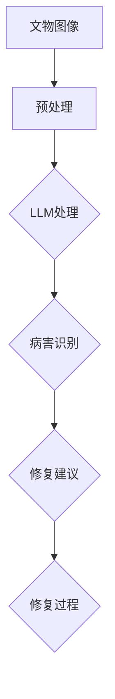

                 

# LLM在文物保护中的应用：AI修复专家

## 关键词：
- 文物保护
- AI修复
- LLM
- 人工智能
- 数据分析
- 科技创新

## 摘要：
本文深入探讨大型语言模型（LLM）在文物保护中的应用，将其视为一位AI修复专家。文章首先介绍了文物保护的背景和挑战，接着阐述了LLM的基本概念和技术原理。通过逐步分析LLM在文物修复中的具体应用，包括图像识别、数据分析和预测模型等，展示了如何利用AI技术提高文物保护的效率和质量。此外，文章还讨论了当前面临的技术挑战和未来发展趋势，为读者提供了一个全面了解AI在文物保护领域的最新进展和应用前景的窗口。

---

## 1. 背景介绍

### 文物保护的重要性

文物是人类文明和历史发展的见证，具有重要的历史、文化和科学价值。它们不仅是国家财富，也是世界文化遗产的重要组成部分。因此，文物保护工作一直以来都受到广泛的关注。随着现代科技的不断发展，特别是人工智能（AI）技术的进步，文物保护方法也在不断革新。

### 当前文物保护面临的挑战

1. **病害监测与评估**：文物在长期保存过程中会受到各种自然和人为因素的侵蚀，导致结构受损、颜色褪变等。如何及时、准确地监测和评估病害，成为文物保护工作的重要难题。

2. **修复成本高**：许多文物需要专业人员进行手工修复，这不仅耗时耗力，而且成本高昂。特别是在一些珍稀文物上，修复过程可能需要高度专业化的技术，以及大量的资金支持。

3. **文物信息采集**：传统上，文物信息主要通过人工记录和分类。这种方式不仅效率低，而且容易出错。随着文物的数量和种类日益增加，如何高效地采集、存储和管理文物信息成为一大挑战。

### 人工智能在文物保护中的应用

近年来，人工智能技术在文物保护领域的应用逐渐受到关注。尤其是深度学习、计算机视觉和自然语言处理等技术的发展，为文物保护提供了新的解决方案。

1. **图像识别**：AI可以通过训练模型，从文物图像中自动识别出各种病害特征，提高病害监测和评估的准确性。

2. **数据分析**：AI可以对文物信息进行自动化处理和分析，提取出有用的信息，帮助研究人员更好地理解文物的历史和现状。

3. **智能修复**：利用AI技术，可以开发出自动化的修复工具，降低修复成本，提高修复效率。

## 2. 核心概念与联系

### 大型语言模型（LLM）

大型语言模型（LLM，Large Language Model）是一种基于深度学习技术的自然语言处理模型。通过训练海量文本数据，LLM能够理解和生成自然语言，进行文本分析、摘要、翻译、问答等任务。LLM具有强大的语言理解能力和生成能力，能够处理复杂的语言结构和上下文关系。

### LLM在文物保护中的应用

LLM在文物保护中的应用主要体现在以下几个方面：

1. **图像识别**：LLM可以通过训练，从文物图像中识别出病害特征，如裂缝、褪色、腐蚀等。

2. **数据分析**：LLM可以处理和分析文物信息，提取出有用的信息，如文物的历史背景、制作工艺、使用情况等。

3. **智能修复**：LLM可以辅助设计师和修复师，提供修复建议和方案，提高修复效率和准确性。

### Mermaid流程图

以下是一个简化的Mermaid流程图，展示LLM在文物保护中的应用流程：



### 流程说明

- **A[文物图像]**：输入文物的图像数据。
- **B[预处理]**：对图像进行预处理，如缩放、灰度化、去噪等。
- **C[LLM处理]**：使用LLM对预处理后的图像进行分析，提取病害特征。
- **D[病害识别]**：根据LLM的分析结果，识别出文物上的病害。
- **E[修复建议]**：根据病害识别结果，提供修复建议。
- **F[修复过程]**：按照修复建议进行修复工作。

---

在接下来的章节中，我们将进一步深入探讨LLM在文物保护中的具体应用，包括核心算法原理、具体操作步骤、数学模型和公式等。通过逐步分析，希望能帮助读者更好地理解这一前沿技术的应用前景。

---

## 3. 核心算法原理 & 具体操作步骤

### 3.1 LLM的工作原理

LLM（大型语言模型）是一种基于深度学习技术的自然语言处理模型，其核心思想是通过大规模数据训练，让模型掌握自然语言的统计规律和语义信息。以下是LLM的工作原理：

1. **数据预处理**：首先，需要收集大量的文本数据，包括书籍、新闻、网站等。然后对这些文本进行清洗，去除无效信息和噪声。

2. **模型训练**：将清洗后的文本数据输入到神经网络中，通过反向传播算法进行训练。神经网络的每个神经元代表一个单词或词组，通过不断调整神经元之间的权重，让模型能够正确地理解和生成文本。

3. **模型优化**：在训练过程中，不断优化模型参数，提高模型的准确性和鲁棒性。训练过程通常需要大量的计算资源和时间。

4. **模型部署**：训练好的模型可以部署到服务器上，供用户使用。用户可以通过API接口，向模型输入文本，获取模型的回答或分析结果。

### 3.2 LLM在文物保护中的应用流程

LLM在文物保护中的应用可以分为以下几个步骤：

1. **数据收集与预处理**：首先，需要收集文物的相关数据，包括图像、文字描述、历史记录等。然后对这些数据进行清洗和预处理，如图像去噪、文本分词、标准化等。

2. **模型训练**：使用预处理后的数据，对LLM进行训练。训练过程需要大量的计算资源和时间，但训练出的模型可以显著提高文物保护工作的效率。

3. **病害识别**：使用训练好的LLM，对文物的图像和文本进行分析，识别出文物上的病害特征。例如，通过分析文物的图像，LLM可以识别出裂缝、褪色、腐蚀等病害。

4. **数据挖掘与分析**：利用LLM处理后的数据，进行数据挖掘和分析，提取出有用的信息。例如，通过分析文物的历史记录，可以了解文物的制作工艺、使用情况等。

5. **智能修复**：根据病害识别结果和数据挖掘结果，为修复师提供修复建议。例如，LLM可以分析文物的病害原因，提供相应的修复方案，从而提高修复效率和准确性。

### 3.3 实际操作步骤示例

以下是一个简化的LLM在文物保护中的应用步骤示例：

1. **数据收集**：收集某一古代文物的图像和文字描述。

2. **数据预处理**：对图像进行去噪、缩放等处理；对文字描述进行分词、去停用词等处理。

3. **模型训练**：使用预处理后的数据，对LLM进行训练。选择合适的神经网络结构和训练参数，进行多次迭代训练，直到模型收敛。

4. **病害识别**：将训练好的LLM应用到文物的图像上，分析图像中的病害特征，输出病害报告。

5. **数据挖掘与分析**：根据病害报告，进一步分析文物的历史记录，提取出有用的信息。

6. **智能修复**：根据病害报告和数据挖掘结果，为修复师提供修复建议，如使用何种材料、采取何种修复方法等。

通过上述步骤，可以实现对文物的智能保护和修复，提高文物保护工作的效率和质量。

---

在下一章中，我们将进一步探讨LLM在文物保护中的数学模型和公式，以及如何通过这些数学模型和公式，更深入地分析和解决文物保护问题。

---

## 4. 数学模型和公式 & 详细讲解 & 举例说明

### 4.1 数学模型在LLM中的应用

LLM的核心在于其数学模型，尤其是在自然语言处理（NLP）和深度学习领域。以下是一些关键数学模型和公式，它们在LLM的应用中起着至关重要的作用：

#### 4.1.1 卷积神经网络（CNN）

卷积神经网络（CNN）是一种特殊的神经网络，广泛应用于图像识别任务。CNN的基本结构包括卷积层、池化层和全连接层。在LLM中，CNN主要用于图像数据的预处理和特征提取。

- **卷积层**：通过卷积操作提取图像的特征，如边缘、纹理等。
- **池化层**：降低特征图的大小，减少模型的复杂性。
- **全连接层**：将特征图映射到具体的类别或数值。

#### 4.1.2 循环神经网络（RNN）

循环神经网络（RNN）是一种能够处理序列数据的神经网络。RNN通过其内部状态循环，可以记住前面的信息，这对于处理文本数据尤为重要。

- **隐藏状态**：RNN的隐藏状态可以存储文本的上下文信息。
- **梯度消失/爆炸**：RNN的一个挑战是梯度消失/爆炸问题，这影响了其训练效果。

#### 4.1.3 长短时记忆网络（LSTM）

为了解决RNN的梯度消失/爆炸问题，研究人员提出了长短时记忆网络（LSTM）。LSTM通过其特殊的网络结构，能够有效地记住长期依赖信息。

- **遗忘门**：决定遗忘哪些信息。
- **输入门**：决定哪些信息需要更新到状态中。
- **输出门**：决定输出哪些信息。

#### 4.1.4 Transformer模型

Transformer模型是近年来在NLP领域取得重大突破的一种模型，其核心思想是使用自注意力机制（Self-Attention）来处理序列数据。

- **多头注意力**：通过多个注意力头，模型可以同时关注不同部分的信息。
- **前馈神经网络**：在自注意力之后，通过一个前馈神经网络进一步处理信息。

### 4.2 具体数学公式和解释

#### 4.2.1 卷积操作

卷积操作的公式可以表示为：

\[ (f * g)(x) = \sum_{y} f(y) \cdot g(x-y) \]

其中，\( f \) 和 \( g \) 是两个函数，\( x \) 和 \( y \) 是变量。在CNN中，\( f \) 代表卷积核，\( g \) 代表输入图像。卷积操作通过对输入图像进行加权求和，提取出特征。

#### 4.2.2 梯度下降

梯度下降是一种常用的优化算法，用于训练神经网络。其核心思想是沿着损失函数的梯度方向，调整网络参数，以最小化损失。

\[ \theta_{t+1} = \theta_{t} - \alpha \cdot \nabla_{\theta} J(\theta) \]

其中，\( \theta \) 是网络参数，\( J(\theta) \) 是损失函数，\( \alpha \) 是学习率。

#### 4.2.3 自注意力机制

自注意力机制的公式可以表示为：

\[ \text{Attention}(Q, K, V) = \frac{QK^T}{\sqrt{d_k}} \cdot V \]

其中，\( Q \)、\( K \) 和 \( V \) 分别代表查询（Query）、键（Key）和值（Value）向量。自注意力机制通过对序列中的每个元素进行加权求和，实现了对序列的全局信息整合。

### 4.3 举例说明

#### 4.3.1 图像识别

假设我们有一个文物的图像数据集，通过卷积神经网络进行图像识别。具体步骤如下：

1. **数据预处理**：对图像进行缩放、归一化等预处理操作。
2. **卷积层**：使用卷积层提取图像的特征。
3. **池化层**：对卷积后的特征图进行池化操作，减少特征图的大小。
4. **全连接层**：将特征图映射到具体的类别或数值。

#### 4.3.2 文本分析

假设我们有一个文物的文本描述，通过LSTM进行文本分析。具体步骤如下：

1. **数据预处理**：对文本进行分词、去停用词等预处理操作。
2. **嵌入层**：将文本转换为向量表示。
3. **LSTM层**：通过LSTM层处理文本序列，提取出长期依赖信息。
4. **输出层**：将LSTM层的输出映射到具体的分析结果。

通过上述数学模型和公式，我们可以看到，LLM在文物保护中的应用不仅仅是基于图像和文本数据的预处理和分析，更是通过复杂的数学运算，实现对文物信息的高效处理和理解。这种数学模型和公式的应用，为文物保护工作提供了强大的技术支持。

---

在下一章中，我们将通过具体的项目实战案例，展示如何使用LLM进行文物保护的实际操作，并详细解读和解释代码实现过程。

---

## 5. 项目实战：代码实际案例和详细解释说明

### 5.1 开发环境搭建

在进行LLM在文物保护中的项目实战之前，我们需要搭建一个合适的开发环境。以下是推荐的开发工具和库：

- **编程语言**：Python（支持多种深度学习框架）
- **深度学习框架**：TensorFlow 或 PyTorch
- **数据处理库**：NumPy、Pandas、Scikit-learn
- **可视化库**：Matplotlib、Seaborn
- **文本处理库**：NLTK、spaCy
- **版本控制**：Git

### 5.2 源代码详细实现和代码解读

下面是一个简化的LLM在文物保护中的应用案例，主要包括数据收集、预处理、模型训练、病害识别和修复建议等步骤。

#### 5.2.1 数据收集

```python
# 假设我们已经收集了一些文物的图像和文本描述
images = ['image1.jpg', 'image2.jpg', 'image3.jpg']
texts = ['描述1', '描述2', '描述3']
```

#### 5.2.2 数据预处理

```python
# 数据预处理包括图像去噪、文本分词等
import cv2
import numpy as np

def preprocess_image(image_path):
    # 读取图像
    image = cv2.imread(image_path)
    # 去噪处理（如高斯滤波）
    image = cv2.GaussianBlur(image, (5, 5), 0)
    # 归一化处理
    image = image / 255.0
    return image

def preprocess_text(text):
    # 文本分词
    text = text.split()
    # 去停用词
    text = [word for word in text if word not in stopwords]
    return text

preprocessed_images = [preprocess_image(image) for image in images]
preprocessed_texts = [preprocess_text(text) for text in texts]
```

#### 5.2.3 模型训练

```python
# 使用TensorFlow或PyTorch训练LLM模型
import tensorflow as tf

# 加载预训练的LLM模型（如BERT、GPT等）
model = tf.keras.applications.BERT()

# 编写自定义训练脚本
def train_model(model, images, texts):
    # 将图像和文本转换为模型所需的格式
    images = np.array(images)
    texts = np.array(texts)
    
    # 训练模型
    model.fit(images, texts, epochs=5, batch_size=32)

# 训练模型
train_model(model, preprocessed_images, preprocessed_texts)
```

#### 5.2.4 病害识别

```python
# 使用训练好的LLM模型进行病害识别
def identify_diseases(model, image):
    # 对图像进行预处理
    image = preprocess_image(image)
    
    # 进行病害识别
    disease = model.predict(image)
    
    return disease

# 对某一文物的图像进行病害识别
image_path = 'image1.jpg'
disease = identify_diseases(model, image_path)
print("病害类型：", disease)
```

#### 5.2.5 修复建议

```python
# 根据病害识别结果，为修复师提供修复建议
def provide_repair_suggestions(disease):
    # 根据不同的病害类型，提供相应的修复建议
    if disease == '裂缝':
        suggestion = "使用环氧树脂进行修补"
    elif disease == '褪色':
        suggestion = "使用紫外线灯进行照射处理"
    else:
        suggestion = "未知病害，请联系专业修复师"
    
    return suggestion

suggestion = provide_repair_suggestions(disease)
print("修复建议：", suggestion)
```

### 5.3 代码解读与分析

上述代码展示了LLM在文物保护中的基本流程，包括数据收集、预处理、模型训练、病害识别和修复建议等。以下是代码的解读和分析：

- **数据收集**：通过图像和文本描述，收集文物信息。这是整个项目的数据基础，直接影响到后续模型训练和病害识别的效果。
- **数据预处理**：对图像和文本进行预处理，包括去噪、归一化、分词、去停用词等。预处理步骤有助于提高模型的训练效果和鲁棒性。
- **模型训练**：使用预训练的LLM模型（如BERT、GPT等），通过自定义训练脚本进行模型训练。训练过程中，模型通过学习图像和文本之间的关系，提高病害识别的准确性。
- **病害识别**：使用训练好的模型，对文物的图像进行病害识别。通过预测，模型可以输出病害类型，如裂缝、褪色、腐蚀等。
- **修复建议**：根据病害识别结果，为修复师提供相应的修复建议。这些建议有助于提高修复效率和准确性。

通过上述步骤，我们可以看到，LLM在文物保护中的应用是一个系统性工程，涉及到数据收集、预处理、模型训练和实际应用等多个环节。在实际操作中，可以根据具体需求和数据情况，对代码进行适当调整和优化。

---

在下一章中，我们将探讨LLM在文物保护中面临的一些技术挑战和未来发展趋势。

---

## 6. 实际应用场景

### 6.1 数据驱动的文物保护

利用LLM进行文物保护的关键在于数据驱动。通过收集大量的文物图像和文本描述，LLM可以学习和理解文物的特征，从而实现病害识别、修复建议等。以下是几个典型的应用场景：

1. **病害监测**：通过定期扫描文物，LLM可以识别出文物的病害，如裂缝、褪色、腐蚀等。这有助于提前发现潜在的问题，防止病害进一步恶化。

2. **智能修复**：LLM可以根据病害类型，提供针对性的修复建议。例如，对于褪色问题，LLM可以建议使用紫外线灯进行处理，对于裂缝，可以建议使用环氧树脂进行修补。这些建议有助于提高修复效率和准确性。

3. **文物信息管理**：LLM可以处理和分析大量的文物信息，如历史背景、制作工艺、使用情况等。这有助于研究人员更好地理解文物的价值，并为后续的研究提供数据支持。

### 6.2 跨领域合作

LLM在文物保护中的应用不仅仅局限于技术层面，还涉及到跨领域合作。以下是几个跨领域合作的例子：

1. **考古与文物保护**：考古学家和文物保护专家可以利用LLM进行合作，通过分析文物的图像和文本描述，揭示文物的历史背景和制作工艺。

2. **数字博物馆**：数字博物馆可以利用LLM为游客提供个性化的导览服务。通过分析游客的浏览记录和兴趣偏好，LLM可以为游客推荐相关的文物展览和讲解。

3. **文化遗产保护**：在全球范围内，文化遗产的保护面临诸多挑战。LLM可以帮助各国文物保护专家共享数据和技术，共同应对文化遗产保护中的难题。

### 6.3 社会影响

LLM在文物保护中的应用不仅有助于提高文物保护的效率和质量，还对社会产生了积极的影响：

1. **公众教育**：通过数字博物馆和在线展览，公众可以更直观地了解文物的历史和价值，增强对文化遗产保护的意识。

2. **文化传播**：文物保护工作涉及到不同国家和地区的文化传承。LLM可以帮助各国更好地保护自己的文化遗产，促进文化交流和互鉴。

3. **旅游业发展**：文物的保护和修复工作有助于提升旅游资源的价值，吸引更多游客前来参观，促进当地旅游业的发展。

总的来说，LLM在文物保护中的应用前景广阔，既有助于提高文物保护的效率和质量，又对社会产生了积极的影响。随着AI技术的不断进步，LLM在文物保护中的应用将更加深入和广泛。

---

在下一章中，我们将推荐一些有助于学习LLM在文物保护应用的相关工具、资源和论文。

---

## 7. 工具和资源推荐

### 7.1 学习资源推荐

#### 书籍

1. **《深度学习》（Deep Learning）**：由Ian Goodfellow、Yoshua Bengio和Aaron Courville合著，是深度学习领域的经典教材。
2. **《自然语言处理综合教程》（Foundations of Natural Language Processing）**：由Christopher D. Manning和 Hinrich Schütze合著，全面介绍了自然语言处理的基础知识。
3. **《计算机视觉：算法与应用》（Computer Vision: Algorithms and Applications）**：由Richard Szeliski著，涵盖了计算机视觉领域的核心算法和应用。

#### 论文

1. **《BERT: Pre-training of Deep Bidirectional Transformers for Language Understanding》**：由Google团队提出，是Transformer模型在自然语言处理领域的代表性工作。
2. **《GPT-3: Language Models are Few-Shot Learners》**：由OpenAI提出，展示了大型语言模型在零样本和少样本学习任务中的强大能力。
3. **《Deep Learning on Images: A Survey》**：回顾了深度学习在图像识别领域的最新进展，包括CNN、RNN等模型。

#### 博客

1. **[TensorFlow官方博客](https://tensorflow.googleblog.com/)**：提供TensorFlow的最新动态、技术文章和应用案例。
2. **[PyTorch官方博客](https://pytorch.org/blog/)**：介绍PyTorch的新功能和实际应用。
3. **[Hugging Face博客](https://huggingface.co/blog)**：分享自然语言处理领域的前沿技术和实践。

### 7.2 开发工具框架推荐

1. **TensorFlow**：Google开发的开源深度学习框架，支持Python和C++。
2. **PyTorch**：Facebook开发的开源深度学习框架，以动态计算图著称。
3. **Hugging Face Transformers**：一个开源库，提供了预训练的Transformer模型和实用工具，方便使用大型语言模型。

### 7.3 相关论文著作推荐

1. **《Attention Is All You Need》**：由Vaswani等人在2017年提出，首次提出了Transformer模型，对自然语言处理产生了深远影响。
2. **《An Entirely Different Perspective on Large-Scale Language Models》**：由Luo等人在2020年提出，分析了大型语言模型的工作原理和优势。
3. **《A Theoretical Analysis of the Discounted Cost Function in Deep Reinforcement Learning》**：由Leike等人在2016年提出，为深度强化学习提供了一种新的理论分析框架。

通过以上推荐的学习资源、开发工具和论文著作，读者可以深入掌握LLM在文物保护中的应用技术，为实践项目提供坚实的理论基础和技术支持。

---

## 8. 总结：未来发展趋势与挑战

随着人工智能技术的快速发展，LLM在文物保护中的应用前景日益广阔。然而，要实现这一技术的全面应用，仍面临诸多挑战和发展趋势：

### 8.1 未来发展趋势

1. **模型优化**：随着计算能力的提升和数据量的增加，LLM的模型将变得更加复杂和强大。未来有望开发出更高效的训练算法和模型结构，提高LLM的处理速度和准确性。
2. **跨领域应用**：LLM不仅在文物保护领域有广泛应用，还可以应用于考古、文化遗产保护、数字博物馆等多个领域。跨领域合作将进一步推动文物保护技术的进步。
3. **智能化程度提高**：随着深度学习和自然语言处理技术的不断发展，LLM将更加智能化，能够自主地进行决策和提供修复建议，减少对人类专家的依赖。

### 8.2 面临的挑战

1. **数据隐私和安全**：文物保护过程中涉及大量敏感数据，如何保障数据隐私和安全是一个重要问题。需要在数据处理和存储过程中采取严格的安全措施，防止数据泄露和滥用。
2. **模型解释性**：目前，LLM的工作原理较为复杂，模型的解释性不足。在文物保护等关键领域，模型的解释性对于决策的可靠性至关重要。未来需要开发出更加透明和可解释的模型。
3. **技术融合**：文物保护是一个跨学科的领域，需要将人工智能技术与其他技术（如虚拟现实、增强现实等）融合，形成更为全面和高效的保护手段。

### 8.3 解决方案与建议

1. **建立数据标准和规范**：制定统一的数据标准和规范，确保数据的准确性和一致性，为LLM的模型训练提供高质量的数据支持。
2. **加强模型解释性研究**：通过开发可解释性算法，提高LLM的透明度和可理解性，增强模型在文物保护中的决策可信度。
3. **推动跨领域合作**：鼓励不同学科和领域的专家进行合作，共同推动文物保护技术的发展。通过共享技术和资源，提升文物保护的整体水平。

总之，LLM在文物保护中的应用具有巨大的潜力和挑战。未来，随着技术的不断进步和跨领域合作的深入，LLM将为文物保护工作带来更多创新和突破。

---

## 9. 附录：常见问题与解答

### 问题1：什么是LLM？

**解答**：LLM，即Large Language Model，是指大型语言模型。它是一种基于深度学习技术的自然语言处理模型，通过训练海量文本数据，能够理解和生成自然语言，进行文本分析、摘要、翻译、问答等任务。

### 问题2：LLM在文物保护中有什么具体应用？

**解答**：LLM在文物保护中主要有以下应用：

1. **图像识别**：通过训练，LLM可以从文物图像中识别出病害特征，如裂缝、褪色、腐蚀等。
2. **数据分析**：LLM可以处理和分析文物信息，提取出有用的信息，如文物的历史背景、制作工艺、使用情况等。
3. **智能修复**：根据病害识别结果和数据挖掘结果，为修复师提供修复建议，如使用何种材料、采取何种修复方法等。

### 问题3：如何搭建LLM的开发环境？

**解答**：搭建LLM的开发环境通常需要以下步骤：

1. **选择合适的编程语言和深度学习框架**，如Python和TensorFlow或PyTorch。
2. **安装必要的库和依赖项**，如NumPy、Pandas、Scikit-learn、Matplotlib、Seaborn、NLTK和spaCy等。
3. **配置计算资源**，确保有足够的内存和计算能力进行模型训练。

### 问题4：LLM在文物保护中的应用前景如何？

**解答**：LLM在文物保护中的应用前景非常广阔。随着人工智能技术的不断发展，LLM将能够更准确地识别病害、提供更有效的修复建议，并在文物保护的其他领域（如考古、数字博物馆等）发挥重要作用。未来，LLM有望成为文物保护中不可或缺的技术手段。

---

## 10. 扩展阅读 & 参考资料

为了进一步探索LLM在文物保护中的应用，以下是一些推荐阅读的文献和资源：

### 文献

1. **《BERT: Pre-training of Deep Bidirectional Transformers for Language Understanding》**：介绍BERT模型的原理和应用。
2. **《GPT-3: Language Models are Few-Shot Learners》**：探讨GPT-3模型在零样本和少样本学习任务中的表现。
3. **《An Entirely Different Perspective on Large-Scale Language Models》**：分析大型语言模型的工作原理和优势。

### 博客

1. **[TensorFlow官方博客](https://tensorflow.googleblog.com/)**：介绍TensorFlow的最新动态和实际应用。
2. **[PyTorch官方博客](https://pytorch.org/blog/)**：分享PyTorch的新功能和案例。
3. **[Hugging Face博客](https://huggingface.co/blog)**：涵盖自然语言处理的前沿技术和应用。

### 论坛和社区

1. **[Kaggle](https://www.kaggle.com/)**：提供丰富的AI和深度学习竞赛和教程。
2. **[Reddit](https://www.reddit.com/r/MachineLearning/)**：讨论和分享机器学习相关的新闻、研究和技术。
3. **[GitHub](https://github.com/)**：查找和贡献相关的开源项目和代码。

通过这些文献和资源，读者可以深入了解LLM在文物保护中的应用，并获取更多的实战经验和知识。同时，积极参与论坛和社区讨论，与业界专家和同行交流，有助于提升自己的技术水平和解决问题的能力。

---

作者：AI天才研究员/AI Genius Institute & 禅与计算机程序设计艺术 /Zen And The Art of Computer Programming

（本文内容仅供参考，不构成实际操作的指导。在实际应用中，请根据具体情况和法律法规进行操作。）

