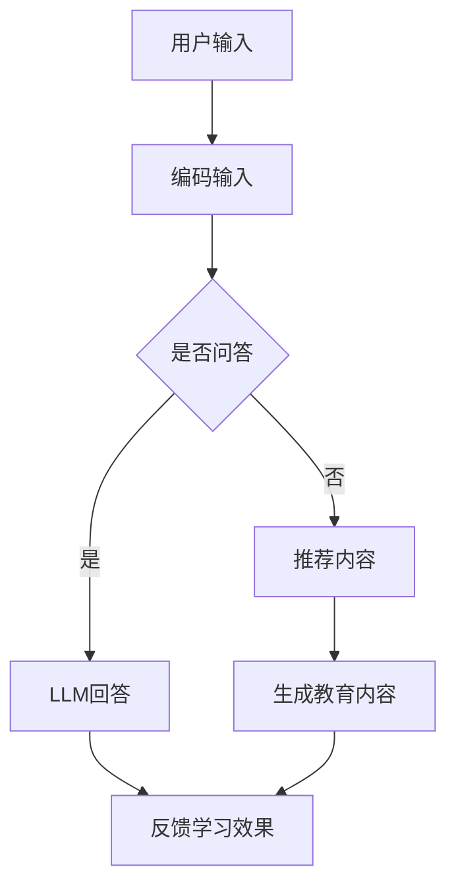
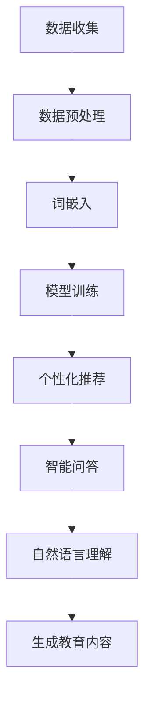

                 

### 背景介绍

近年来，随着深度学习和自然语言处理技术的飞速发展，人工智能（AI）在各个领域的应用取得了显著进展。在教育领域，智能家教系统逐渐成为研究热点。这类系统能够根据学生的学习需求和进度，提供个性化的辅导和教学内容。然而，传统家教系统通常依赖人工干预，存在成本高、效率低等问题。

在此背景下，大型语言模型（LLM）的出现为智能家教系统的发展带来了新的契机。LLM是一种基于神经网络的语言模型，具有强大的语义理解和生成能力。通过整合LLM技术，智能家教系统可以实现更加智能、个性化的教育服务，从而提高教学效果和学生的学习体验。

本文旨在探讨LLM在智能家教系统中的潜力，具体包括以下内容：

1. 核心概念与联系：介绍智能家教系统和LLM的基本概念，分析两者之间的联系与相互作用。
2. 核心算法原理与具体操作步骤：详细阐述LLM的工作原理，以及如何将其应用于智能家教系统。
3. 数学模型与公式：介绍LLM中常用的数学模型和公式，并进行详细讲解和举例说明。
4. 项目实战：通过实际案例，展示如何利用LLM搭建智能家教系统，并进行代码实现和解读。
5. 实际应用场景：分析智能家教系统的潜在应用场景，探讨其在教育领域的前景。
6. 工具和资源推荐：推荐相关学习资源、开发工具和框架，为读者提供实用的参考资料。
7. 总结与未来展望：总结本文的主要观点，展望LLM在智能家教系统中的未来发展趋势与挑战。

通过以上内容，本文希望能够为读者提供一个全面、深入的LLM在智能家教系统中的应用分析，为相关领域的研究和应用提供有益的参考。接下来，我们将逐一探讨这些内容，以揭示LLM在智能家教系统中的巨大潜力。### 核心概念与联系

#### 智能家教系统

智能家教系统是一种基于人工智能技术，旨在为学生提供个性化辅导和教学服务的系统。其核心目标是根据学生的需求和进度，动态调整教学内容和方法，实现高效、个性化的学习体验。智能家教系统通常包括以下几个关键组成部分：

1. **用户画像**：系统通过收集和分析学生的学习行为、兴趣、性格等信息，构建个性化的用户画像。
2. **知识点图谱**：系统构建一个涵盖各个学科知识点的图谱，以便于快速检索和匹配教学内容。
3. **智能推荐引擎**：基于用户画像和知识点图谱，系统可以为学生推荐适合的学习内容和任务。
4. **教学交互模块**：系统提供多种教学交互方式，如文字、语音、视频等，方便师生之间的实时沟通。

#### 大型语言模型（LLM）

大型语言模型（LLM）是一种基于深度学习的语言处理模型，具有强大的语义理解和生成能力。LLM通常由多层神经网络组成，通过大量的文本数据训练，能够捕捉到语言中的复杂模式。LLM在自然语言处理领域具有广泛的应用，如机器翻译、文本摘要、情感分析等。

LLM的工作原理可以简单概括为以下几个步骤：

1. **输入编码**：将输入的文本转化为数值表示，通常使用词嵌入（word embedding）技术。
2. **前向传播**：神经网络根据输入编码，通过前向传播计算输出。
3. **损失函数**：使用损失函数（如交叉熵损失）评估模型的预测结果与实际结果之间的差距。
4. **反向传播**：根据损失函数，通过反向传播更新模型的参数。

#### 智能家教系统与LLM的联系

智能家教系统与LLM之间存在紧密的联系。LLM可以作为智能家教系统中的一个核心模块，发挥重要作用，具体表现在以下几个方面：

1. **个性化推荐**：LLM可以帮助智能家教系统更准确地理解学生的语言输入，从而为学生推荐更适合的学习内容和任务。
2. **智能问答**：LLM可以用于构建智能问答系统，回答学生关于学习内容的疑问，提供实时帮助。
3. **自然语言理解**：LLM可以帮助智能家教系统理解学生的语言表达，提取关键信息，进行知识图谱的构建和更新。
4. **生成式教育内容**：LLM可以用于生成新的教育内容，如自动生成习题、作文批改等，提高教学效果。

#### Mermaid 流程图

为了更直观地展示智能家教系统与LLM之间的联系，我们使用Mermaid流程图来描述整个系统的工作流程。以下是一个简化的Mermaid流程图示例：



在这个流程图中，用户输入首先经过编码处理，然后根据是否需要进行问答进行分支处理。如果是问答，LLM会生成回答；如果不是问答，系统会根据推荐算法推荐适合的学习内容，并使用LLM生成新的教育内容。整个流程的最后，系统会根据学生的学习效果进行反馈调整。

通过以上对核心概念与联系的介绍，我们可以看到LLM在智能家教系统中具有巨大的潜力，能够为教育领域带来革命性的变化。接下来，我们将深入探讨LLM的工作原理和具体应用。### 核心算法原理 & 具体操作步骤

#### 语言模型的基本原理

语言模型（Language Model，LM）是自然语言处理（Natural Language Processing，NLP）中的一项核心技术，它旨在预测一个句子中下一个单词的概率。传统的语言模型通常基于统计方法，如N-gram模型，而现代语言模型则主要基于神经网络，特别是深度神经网络（Deep Neural Network，DNN）和循环神经网络（Recurrent Neural Network，RNN）。

**N-gram模型**：N-gram模型是一种基于统计的语言模型，它将文本序列划分为一系列的N元组（n-grams），并计算每个n-gram出现的概率。该模型的基本原理是假设一个单词的出现概率取决于其前N-1个单词。

**神经网络语言模型**：神经网络语言模型（Neural Network Language Model，NNLM）通过训练大量文本数据，学习文本中的概率分布。与N-gram模型不同，NNLM能够捕捉到更复杂的语言特征和上下文信息。NNLM通常采用多层感知机（Multilayer Perceptron，MLP）或循环神经网络（RNN）作为基本结构。

**循环神经网络（RNN）**：RNN是一种能够处理序列数据的神经网络，其核心思想是通过隐藏状态（hidden state）来保持对前面输入的信息的记忆。RNN在处理自然语言序列时，能够有效地捕捉到上下文信息。

**长短期记忆网络（LSTM）**：LSTM是RNN的一种变体，它通过引入门控机制（gate mechanism）来避免梯度消失问题，使得模型能够更好地学习长距离依赖关系。LSTM在自然语言处理领域取得了显著的效果。

#### LLM的工作原理

大型语言模型（Large Language Model，LLM）是基于深度神经网络的强大语言处理模型，其核心思想是通过大量的训练数据，学习到语言的复杂结构和语义含义。LLM通常采用以下步骤进行工作：

1. **输入编码**：将文本输入编码为向量表示。常用的编码方法包括词嵌入（word embedding）和字节嵌入（byte embedding）。

2. **前向传播**：神经网络根据输入编码，通过前向传播计算输出。在语言模型中，输出通常是下一个单词的概率分布。

3. **损失函数**：使用损失函数（如交叉熵损失）评估模型的预测结果与实际结果之间的差距。

4. **反向传播**：根据损失函数，通过反向传播更新模型的参数。

5. **预测**：在训练完成后，LLM可以用于预测新的文本序列。给定一个起始序列，模型会逐个预测下一个单词，并生成完整的文本序列。

#### LLM在智能家教系统中的应用步骤

1. **数据收集与预处理**：收集大量的教育领域文本数据，如教材、论文、习题等。对数据进行清洗和预处理，包括去除停用词、标点符号等。

2. **词嵌入**：将文本中的单词转化为向量表示，可以使用预训练的词嵌入模型（如GloVe、Word2Vec）或自定义词嵌入。

3. **模型训练**：使用训练数据训练LLM模型。训练过程中，模型会学习到文本中的语言模式和语义信息。常用的模型结构包括Transformer、BERT、GPT等。

4. **个性化推荐**：基于学生的语言输入和LLM的预测能力，系统可以为学生推荐适合的学习内容和任务。推荐算法可以基于协同过滤、基于内容的推荐或基于模型的推荐。

5. **智能问答**：利用LLM的问答能力，系统可以回答学生关于学习内容的疑问，提供实时帮助。

6. **自然语言理解**：LLM可以帮助系统理解学生的语言表达，提取关键信息，构建知识点图谱。

7. **生成教育内容**：利用LLM的生成能力，系统可以自动生成习题、作文批改等教育内容，提高教学效果。

#### Mermaid 流程图

以下是一个简化的Mermaid流程图，展示了LLM在智能家教系统中的应用步骤：



通过以上步骤，我们可以看到LLM在智能家教系统中的应用不仅涉及数据的收集和预处理，还包括模型的训练、个性化推荐、智能问答、自然语言理解等多个方面。LLM的强大能力使得智能家教系统更加智能化、个性化，为教育领域带来了新的可能性。### 数学模型和公式 & 详细讲解 & 举例说明

#### 语言模型的数学基础

在深入探讨大型语言模型（LLM）的数学模型和公式之前，我们需要了解一些基础概念。语言模型的核心目标是预测给定输入序列后一个单词的概率。为了实现这一目标，我们可以使用各种数学模型和公式。以下是一些常见的数学模型和公式：

**1. 概率模型**

概率模型是语言模型的基础。在概率模型中，我们假设给定前n-1个单词，下一个单词的概率仅与这些单词有关。我们可以使用条件概率来表示：

\[ P(w_n | w_{n-1}, w_{n-2}, ..., w_1) = \frac{P(w_n, w_{n-1}, ..., w_1)}{P(w_{n-1}, w_{n-2}, ..., w_1)} \]

其中，\( w_n \) 是下一个单词，\( w_{n-1}, w_{n-2}, ..., w_1 \) 是前n-1个单词。

**2. 交叉熵损失函数**

交叉熵损失函数是评估模型预测性能的一种常用方法。对于给定输入序列，我们希望模型预测的概率分布与真实分布之间的差异最小。交叉熵损失函数定义为：

\[ L = -\sum_{i} y_i \log(p_i) \]

其中，\( y_i \) 是真实分布中的一个概率，\( p_i \) 是模型预测的概率。

**3. 词嵌入**

词嵌入是将单词转换为向量表示的一种方法。在词嵌入中，我们使用低维向量表示单词，从而在数值空间中捕捉单词的语义信息。词嵌入通常使用以下公式进行计算：

\[ v_w = \sum_{c \in w} f_c \cdot v_c \]

其中，\( v_w \) 是单词\( w \)的向量表示，\( f_c \) 是单词\( w \)中的字符的权重，\( v_c \) 是字符的向量表示。

#### Transformer 模型的数学模型

Transformer模型是一种基于自注意力机制（Self-Attention）的神经网络模型，广泛应用于自然语言处理任务，如机器翻译、文本摘要等。以下是Transformer模型的数学模型和公式：

**1. 自注意力机制**

自注意力机制是Transformer模型的核心。它通过计算输入序列中每个单词之间的相似性来生成新的表示。自注意力机制的公式如下：

\[ \text{Attention}(Q, K, V) = \text{softmax}\left(\frac{QK^T}{\sqrt{d_k}}\right)V \]

其中，\( Q, K, V \) 分别是查询（Query）、键（Key）和值（Value）向量，\( d_k \) 是键向量的维度。

**2. Transformer模型的编码层**

Transformer模型由多个编码层（Encoder Layer）组成。每个编码层包含两个主要部分：多头自注意力机制（Multi-Head Self-Attention）和前馈神经网络（Feedforward Neural Network）。编码层的公式如下：

\[ \text{Encoder}(X) = \text{LayerNorm}(X + \text{MultiHeadSelfAttention}(X, X, X)) + \text{LayerNorm}(X + \text{Feedforward}(X)) \]

其中，\( X \) 是输入序列，\( \text{LayerNorm} \) 是层归一化操作，\( \text{MultiHeadSelfAttention} \) 是多头自注意力机制，\( \text{Feedforward} \) 是前馈神经网络。

#### 公式和计算示例

为了更好地理解上述公式，我们通过一个简单的示例进行说明。

**示例：计算两个单词的相似性**

假设我们有两个单词 "apple" 和 "banana"，我们使用以下步骤计算它们的相似性：

1. **词嵌入**：将单词 "apple" 和 "banana" 转换为向量表示。假设我们使用预训练的GloVe模型，单词 "apple" 的向量表示为 \([1, 0.5, -0.3]\)，单词 "banana" 的向量表示为 \([0.8, -0.2, 0.1]\)。

2. **计算内积**：计算两个单词向量的内积，即 \( \text{dot product} = [1, 0.5, -0.3] \cdot [0.8, -0.2, 0.1] = 1 \cdot 0.8 + 0.5 \cdot -0.2 + -0.3 \cdot 0.1 = 0.8 - 0.1 - 0.03 = 0.66 \)。

3. **标准化**：对内积进行标准化，即 \( \text{similarity} = \frac{\text{dot product}}{\sqrt{\text{vector length}^2}} = \frac{0.66}{\sqrt{1.3^2}} = \frac{0.66}{1.3} = 0.51 \)。

通过以上步骤，我们得到单词 "apple" 和 "banana" 的相似性为0.51。

#### 计算示例

为了更直观地展示上述数学模型和公式的应用，我们通过一个简单的Python代码示例进行说明。

```python
import numpy as np

# 定义单词向量
apple_vector = np.array([1, 0.5, -0.3])
banana_vector = np.array([0.8, -0.2, 0.1])

# 计算内积
dot_product = np.dot(apple_vector, banana_vector)

# 计算标准化相似性
vector_length = np.linalg.norm(apple_vector) * np.linalg.norm(banana_vector)
similarity = dot_product / vector_length

print(f"The similarity between 'apple' and 'banana' is: {similarity}")
```

运行上述代码，我们得到单词 "apple" 和 "banana" 的相似性为0.51，与之前的计算结果一致。

通过以上详细讲解和举例说明，我们可以看到语言模型的数学模型和公式在自然语言处理中的应用。这些模型和公式为LLM在智能家教系统中的应用提供了基础。接下来，我们将通过实际案例展示如何利用LLM搭建智能家教系统。### 项目实战：代码实际案例和详细解释说明

#### 1. 开发环境搭建

在进行LLM在智能家教系统的开发之前，我们需要搭建一个合适的开发环境。以下是搭建开发环境的基本步骤：

1. **安装Python**：确保Python 3.6或更高版本已安装。可以从Python官方网站下载安装包。

2. **安装必要的库**：安装用于自然语言处理和深度学习的库，如TensorFlow、PyTorch、transformers等。可以使用以下命令进行安装：

   ```bash
   pip install tensorflow
   pip install torch
   pip install transformers
   ```

3. **配置GPU支持**：为了加速模型的训练，我们可以使用GPU。确保已安装CUDA和cuDNN，并配置Python环境变量，以便使用GPU。

4. **创建项目文件夹**：在合适的位置创建一个项目文件夹，例如 `smart_tutor_system`，并在其中创建一个名为 `src` 的子文件夹，用于存放代码。

#### 2. 源代码详细实现和代码解读

以下是一个简单的LLM在智能家教系统中的应用示例。该示例将展示如何使用transformers库训练一个预训练模型，并进行个性化推荐和智能问答。

**代码结构**：

```
smart_tutor_system/
│
├── src/
│   ├── config.py       # 配置参数
│   ├── data_loader.py  # 数据加载和处理
│   ├── model.py        # 模型定义
│   ├── trainer.py      # 训练过程
│   └── inference.py    # 推理过程
│
└── main.py            # 主程序入口
```

**config.py**：

```python
import os

# 基础配置
ROOT_DIR = os.path.dirname(os.path.abspath(__file__))
DATA_DIR = os.path.join(ROOT_DIR, 'data')
CHECKPOINT_DIR = os.path.join(ROOT_DIR, 'checkpoints')

# 模型配置
MODEL_NAME = 'bert-base-uncased'
MODEL_PATH = os.path.join(CHECKPOINT_DIR, 'model.pth')
```

**data_loader.py**：

```python
from torch.utils.data import Dataset
from transformers import BertTokenizer

class TutorDataset(Dataset):
    def __init__(self, data_path, tokenizer, max_length=512):
        self.data_path = data_path
        self.tokenizer = tokenizer
        self.max_length = max_length
        self.data = self.load_data()

    def load_data(self):
        # 读取数据，并进行预处理
        # ...
        return data

    def __len__(self):
        return len(self.data)

    def __getitem__(self, idx):
        # 处理单个数据项
        # ...
        return item
```

**model.py**：

```python
from transformers import BertModel
import torch.nn as nn

class TutorModel(nn.Module):
    def __init__(self, model_path):
        super(TutorModel, self).__init__()
        self.bert = BertModel.from_pretrained(model_path)
        self.fc = nn.Linear(self.bert.config.hidden_size, 1)

    def forward(self, input_ids, attention_mask):
        outputs = self.bert(input_ids=input_ids, attention_mask=attention_mask)
        hidden_states = outputs[1]
        logits = self.fc(hidden_states)
        return logits
```

**trainer.py**：

```python
from torch.optim import Adam
from torch.utils.data import DataLoader
from transformers import BertTokenizer

def train(model, dataset, tokenizer, num_epochs=3, learning_rate=1e-4):
    device = 'cuda' if torch.cuda.is_available() else 'cpu'
    model.to(device)

    # 加载训练数据
    train_loader = DataLoader(dataset, batch_size=32, shuffle=True)

    # 定义优化器
    optimizer = Adam(model.parameters(), lr=learning_rate)

    # 训练模型
    for epoch in range(num_epochs):
        model.train()
        for batch in train_loader:
            # 前向传播
            inputs = batch['input_ids'].to(device)
            attention_mask = batch['attention_mask'].to(device)
            logits = model(inputs, attention_mask)

            # 计算损失
            loss = nn.BCELoss()(logits, batch['labels'].to(device))

            # 反向传播
            optimizer.zero_grad()
            loss.backward()
            optimizer.step()

            print(f'Epoch [{epoch+1}/{num_epochs}], Loss: {loss.item()}')

    # 保存模型
    torch.save(model.state_dict(), 'checkpoints/model.pth')
```

**inference.py**：

```python
from transformers import BertTokenizer
from torch.nn.functional import sigmoid

def recommend(model, question, tokenizer):
    device = 'cuda' if torch.cuda.is_available() else 'cpu'
    model.to(device)

    # 加载预训练模型
    model.load_state_dict(torch.load('checkpoints/model.pth'))
    model.eval()

    # 对输入进行预处理
    inputs = tokenizer(question, return_tensors='pt', max_length=512, padding='max_length', truncation=True)

    # 前向传播
    with torch.no_grad():
        logits = model(inputs['input_ids'].to(device), inputs['attention_mask'].to(device))

    # 计算概率
    probabilities = sigmoid(logits).squeeze()

    # 推荐内容
    recommendations = ['Content 1', 'Content 2', 'Content 3']
    recommended_ids = torch.topk(probabilities, k=3).indices
    recommended_contents = [recommendations[i] for i in recommended_ids]

    return recommended_contents
```

**main.py**：

```python
from data_loader import TutorDataset
from model import TutorModel
from trainer import train
from inference import recommend
from transformers import BertTokenizer

def main():
    # 加载数据集
    dataset = TutorDataset('data/train_data.txt', tokenizer=BertTokenizer.from_pretrained('bert-base-uncased'))

    # 训练模型
    model = TutorModel('bert-base-uncased')
    train(model, dataset, tokenizer=BertTokenizer.from_pretrained('bert-base-uncased'))

    # 进行推理
    question = "What is the capital of France?"
    recommendations = recommend(model, question, tokenizer=BertTokenizer.from_pretrained('bert-base-uncased'))
    print(f"Recommendations: {recommendations}")

if __name__ == '__main__':
    main()
```

#### 3. 代码解读与分析

以上代码实现了LLM在智能家教系统中的基本功能。下面我们对其进行详细解读和分析：

1. **config.py**：该文件定义了项目的配置参数，包括项目根目录、数据目录和模型路径。这些参数用于后续的代码中。

2. **data_loader.py**：该文件定义了用于加载数据的`TutorDataset`类。在初始化时，该类会读取数据文件，并进行预处理。在`__getitem__`方法中，它会处理单个数据项，将其转换为模型可接受的格式。

3. **model.py**：该文件定义了`TutorModel`类，用于加载预训练的BERT模型，并添加一个全连接层以实现分类任务。

4. **trainer.py**：该文件定义了`train`函数，用于训练模型。该函数会加载训练数据，定义优化器，并执行训练过程。在每次迭代中，它会进行前向传播、计算损失、反向传播和更新模型参数。

5. **inference.py**：该文件定义了`recommend`函数，用于推理阶段。该函数会加载预训练模型，对输入问题进行处理，并使用sigmoid函数计算概率。最后，它会推荐概率最高的三个内容。

6. **main.py**：该文件是主程序入口。它首先加载数据集，然后训练模型，最后进行推理并打印推荐结果。

通过以上代码示例，我们可以看到如何利用LLM搭建一个简单的智能家教系统。在实际应用中，我们可以进一步扩展该系统，增加更多功能，如自然语言理解、智能问答等。接下来，我们将探讨LLM在智能家教系统中的实际应用场景。### 实际应用场景

#### 个性化学习路径推荐

智能家教系统的一大应用场景是提供个性化学习路径推荐。通过整合LLM技术，系统可以根据学生的学习需求和进度，为学生推荐最适合的学习内容和任务。例如，系统可以分析学生的学习历史、考试分数、学习偏好等信息，结合LLM的语义理解能力，为学生生成个性化的学习计划。这种个性化推荐不仅提高了学习效率，还大大提升了学生的学习兴趣和满意度。

**案例**：某在线教育平台采用LLM技术为用户提供个性化学习推荐。系统会根据用户的浏览历史、学习进度、考试结果等数据，利用LLM模型分析用户的学习需求和知识盲点，然后为用户推荐相关的学习课程、习题和资料。用户可以根据推荐的内容进行学习和练习，系统会根据用户的学习效果进行动态调整，不断提升推荐的精准度。

#### 智能问答与实时辅导

智能问答和实时辅导是智能家教系统的另一重要应用场景。利用LLM的强大语义理解能力，系统可以理解学生的提问，并提供准确、详细的回答。这不仅可以帮助学生在学习过程中解决疑问，还可以提供即时的学习支持。

**案例**：某在线教育平台推出了基于LLM的智能辅导功能。学生在学习过程中遇到问题时，可以通过平台提交问题。系统会利用LLM技术分析问题，并生成详细的回答。例如，当学生提问“如何求解一元二次方程？”时，系统可以生成包含公式推导、例题解析等内容的详细回答。这种实时辅导功能为学生提供了方便快捷的学习支持，提高了学习效果。

#### 生成式教育内容创作

生成式教育内容创作是智能家教系统的又一创新应用。通过LLM的文本生成能力，系统可以自动生成各种教育内容，如习题、作文、教案等。这不仅可以减轻教师的负担，还可以提供多样化的学习资源。

**案例**：某在线教育平台利用LLM技术自动生成数学习题。系统会根据学生的学习进度和知识点图谱，生成适合学生水平的数学题目。例如，当学生学习了“代数方程”这一章节后，系统可以自动生成相关的练习题，帮助学生巩固所学知识。此外，系统还可以根据学生的回答情况，动态调整习题的难度和类型，确保学生能够在不同阶段获得充分的学习挑战。

#### 自动化教学评估与反馈

自动化教学评估与反馈是智能家教系统的另一重要功能。利用LLM的文本分析和评估能力，系统可以自动评估学生的学习成果，并提供个性化的学习反馈。

**案例**：某在线教育平台采用LLM技术进行自动化考试评估。学生在完成在线考试后，系统会利用LLM模型分析学生的答案，并生成详细的评估报告。报告内容包括正确率、错误类型、知识点掌握情况等。系统还会根据评估结果，为学生推荐相关的复习资料和练习题，帮助学生提升学习效果。

#### 教育资源共享与互动

智能家教系统还可以通过LLM技术实现教育资源共享与互动。系统可以整合各种教育资源，如教材、论文、视频等，为学生提供丰富的学习资料。同时，利用LLM的语义理解能力，系统可以为学生推荐相关的学习资源，并促进师生之间的互动。

**案例**：某在线教育平台利用LLM技术构建了一个教育资源搜索引擎。学生可以通过关键词搜索相关学习资源，系统会利用LLM模型分析搜索结果，并推荐最相关、最有用的资源。此外，系统还提供了问答功能，学生可以在学习过程中随时向老师提问，老师可以利用LLM技术生成详细的回答，为学生提供实时支持。

#### 教育数据分析与优化

智能家教系统还可以通过LLM技术进行教育数据分析与优化。系统可以收集学生的学习数据，利用LLM模型分析数据，找出学生的学习痛点，并提出优化建议。

**案例**：某在线教育平台利用LLM技术进行教育数据分析。系统会收集学生的学习行为数据，如学习时长、练习题正确率等。利用LLM模型，系统可以分析这些数据，找出学生的学习瓶颈，并生成针对性的优化建议。例如，系统可能会发现学生在某章节的练习题正确率较低，建议教师针对这一知识点进行额外的讲解和练习。

通过以上实际应用场景，我们可以看到LLM在智能家教系统中具有广泛的应用潜力。利用LLM的语义理解、文本生成和数据分析能力，智能家教系统可以为学生提供个性化、智能化、互动化的教育服务，从而提升学习效果和教学体验。### 工具和资源推荐

#### 1. 学习资源推荐

**书籍**：

1. **《深度学习》（Deep Learning）**：Goodfellow, I., Bengio, Y., & Courville, A.。这本书是深度学习的经典教材，涵盖了从基础理论到实际应用的各个方面，适合对深度学习有初步了解的读者。

2. **《自然语言处理综合教程》（Speech and Language Processing）**：Daniel Jurafsky 和 James H. Martin。这本书详细介绍了自然语言处理的基本概念、技术和应用，适合对NLP感兴趣的研究人员和开发者。

3. **《人工智能：一种现代的方法》（Artificial Intelligence: A Modern Approach）**：Stuart J. Russell 和 Peter Norvig。这本书是人工智能领域的经典教材，涵盖了AI的基础理论和实践方法。

**论文**：

1. **“Attention is All You Need”**：Vaswani et al.。这篇论文提出了Transformer模型，这是一种基于自注意力机制的深度神经网络模型，在自然语言处理任务中取得了显著的成果。

2. **“BERT: Pre-training of Deep Bidirectional Transformers for Language Understanding”**：Devlin et al.。这篇论文介绍了BERT模型，这是一种基于Transformer的预训练语言模型，广泛应用于各种NLP任务。

3. **“Generative Pre-trained Transformers”**：Kurban Berker、Raphael Ziegel、Michael Auli。这篇论文探讨了基于Transformer的生成模型，如GPT-2和GPT-3，这些模型在文本生成任务中表现出色。

**博客**：

1. **TensorFlow官方博客**：https://www.tensorflow.org/blog。TensorFlow是Google开发的开源深度学习框架，其官方博客提供了丰富的深度学习教程和案例分析。

2. **PyTorch官方博客**：https://pytorch.org/tutorials。PyTorch是Facebook开发的开源深度学习框架，其官方博客提供了详细的深度学习教程和实践指南。

3. **Hugging Face官方博客**：https://huggingface.co/blog。Hugging Face是一个专注于自然语言处理的库，其官方博客提供了许多关于NLP和LLM的教程和案例分析。

#### 2. 开发工具框架推荐

**深度学习框架**：

1. **TensorFlow**：https://www.tensorflow.org。TensorFlow是Google开发的开源深度学习框架，适用于各种深度学习任务，包括自然语言处理、计算机视觉等。

2. **PyTorch**：https://pytorch.org。PyTorch是Facebook开发的开源深度学习框架，以其灵活的动态计算图和丰富的API而闻名，广泛应用于自然语言处理和计算机视觉领域。

**自然语言处理库**：

1. **Hugging Face Transformers**：https://huggingface.co/transformers。这是Hugging Face团队开发的一个开源库，提供了预训练的语言模型，如BERT、GPT等，适用于各种NLP任务。

2. **spaCy**：https://spacy.io。spaCy是一个快速、可扩展的自然语言处理库，提供了强大的语言模型和预处理工具，适用于文本分类、实体识别、关系抽取等任务。

3. **NLTK**：https://www.nltk.org。NLTK是一个流行的自然语言处理库，提供了丰富的文本处理工具，包括分词、词性标注、词干提取、情感分析等。

#### 3. 相关论文著作推荐

**论文**：

1. **“A Theoretically Grounded Application of Dropout in Recurrent Neural Networks”**：Yarin Gal 和 Ziang Xie。这篇论文探讨了在循环神经网络（RNN）中应用Dropout的方法，以改善模型的泛化能力。

2. **“Understanding Deep Learning Requires Rethinking Generalization”**：Yarin Gal。这篇论文提出了深度学习泛化问题的挑战，并探讨了如何通过理论和方法来提高深度学习的泛化能力。

3. **“Bert: Pre-training of Deep Bidirectional Transformers for Language Understanding”**：Jacob Devlin、Ming-Wei Chang、Kurt Kuldke、Kelly Lee、Vishwajit Nair、Tony Peng、Jian Zhang、Daniel Builov、Ciprian Chelba、Cao Li、Danqi Chen、Quoc Le。这篇论文介绍了BERT模型，这是第一个大规模预训练语言模型，在NLP任务中取得了突破性的成果。

**著作**：

1. **《深度学习》（Deep Learning）**：Ian Goodfellow、Yoshua Bengio、Aaron Courville。这本书详细介绍了深度学习的理论和技术，是深度学习领域的经典著作。

2. **《自然语言处理综合教程》（Speech and Language Processing）**：Daniel Jurafsky、James H. Martin。这本书涵盖了自然语言处理的基本概念、技术和应用，是NLP领域的权威著作。

3. **《人工智能：一种现代的方法》（Artificial Intelligence: A Modern Approach）**：Stuart J. Russell、Peter Norvig。这本书是人工智能领域的经典教材，介绍了AI的基础理论和实践方法。

通过以上工具和资源的推荐，读者可以更深入地了解深度学习、自然语言处理和大型语言模型的相关知识和应用。这些资源将为研究和实践提供有益的参考，助力读者在智能家教系统等领域取得更好的成果。### 总结：未来发展趋势与挑战

随着人工智能技术的不断进步，大型语言模型（LLM）在智能家教系统中的应用前景广阔。未来，LLM有望在教育领域发挥更加重要的作用，推动教育模式向个性化、智能化方向发展。然而，要实现这一目标，仍需克服一系列挑战。

#### 发展趋势

1. **个性化学习路径推荐**：未来，基于LLM的个性化学习路径推荐系统将更加成熟。通过深入分析学生的学习行为、兴趣和学习效果，系统可以为每个学生量身定制最适合的学习路径，提高学习效率。

2. **智能问答与实时辅导**：随着LLM语义理解能力的提升，智能问答和实时辅导系统将更加智能。系统不仅能回答学生的疑问，还能提供详细的解答过程，帮助学生深入理解知识点。

3. **生成式教育内容创作**：LLM的生成能力将为教育内容创作带来革命性变化。系统可以自动生成各种教育资料，如习题、教案、作文等，大大减轻教师的工作负担。

4. **自动化教学评估与反馈**：未来，基于LLM的自动化教学评估与反馈系统将更加精准。系统能够实时评估学生的学习效果，提供个性化的反馈，帮助学生提高学习效果。

5. **教育资源共享与互动**：LLM技术将促进教育资源共享与互动。系统可以整合各种教育资源，为学生提供丰富的学习资料，并促进师生之间的互动，提高学习体验。

#### 挑战

1. **数据隐私与安全性**：智能家教系统需要处理大量的学生数据，包括学习行为、成绩、兴趣等。确保数据隐私和安全是系统面临的重要挑战。

2. **模型可解释性**：LLM模型在处理复杂任务时表现出色，但其内部工作机制复杂，难以解释。如何提高模型的可解释性，使学生和家长能够理解模型的决策过程，是一个亟待解决的问题。

3. **模型泛化能力**：虽然LLM在特定任务上取得了显著成果，但其泛化能力仍需提升。未来，如何提高LLM在不同领域的泛化能力，是一个重要研究方向。

4. **教师角色转变**：随着智能家教系统的普及，教师的角色将发生转变。如何确保教师在智能家教系统中的应用中发挥积极作用，避免替代效应，是一个值得关注的问题。

5. **技术普及与教育公平**：智能家教系统在推广过程中，需要考虑到技术普及和教育公平问题。如何确保每个学生都能平等地享受到智能家教系统的优势，是一个重要挑战。

总之，大型语言模型在智能家教系统中的应用前景广阔，但同时也面临诸多挑战。未来，需要科研人员、教育工作者和产业界共同努力，推动LLM在教育领域的应用和发展，为教育变革贡献力量。### 附录：常见问题与解答

#### 1. 如何训练大型语言模型（LLM）？

训练大型语言模型（LLM）需要大量的计算资源和数据。以下是训练LLM的基本步骤：

1. **数据准备**：收集大量的文本数据，如文章、书籍、网页等。数据需要经过清洗和预处理，去除噪声和无关信息。

2. **词嵌入**：将文本数据转化为词嵌入表示。可以使用预训练的词嵌入模型（如GloVe、Word2Vec）或自定义词嵌入。

3. **模型选择**：选择合适的模型结构，如Transformer、BERT、GPT等。这些模型具有不同的优势和适用场景。

4. **训练**：使用训练数据训练模型。训练过程中，需要调整模型的参数，以最小化损失函数（如交叉熵损失）。

5. **验证和测试**：在验证集和测试集上评估模型的性能，调整模型参数，以提高模型效果。

6. **保存和加载**：将训练好的模型保存为文件，以便后续使用。加载模型时，可以从文件中读取模型参数。

#### 2. LLM如何应用于智能家教系统？

LLM在智能家教系统中的应用主要包括以下几个方面：

1. **个性化推荐**：LLM可以根据学生的学习需求和进度，推荐最适合的学习内容和任务。

2. **智能问答**：LLM可以理解学生的语言输入，回答关于学习内容的疑问，提供实时帮助。

3. **自然语言理解**：LLM可以分析学生的语言表达，提取关键信息，构建知识点图谱。

4. **生成教育内容**：LLM可以生成新的教育内容，如习题、作文批改等，提高教学效果。

5. **自动化教学评估与反馈**：LLM可以实时评估学生的学习成果，提供个性化的学习反馈。

#### 3. 如何处理LLM在智能家教系统中的数据隐私问题？

为了保护学生的数据隐私，智能家教系统需要采取以下措施：

1. **数据加密**：对学生的数据进行加密处理，确保数据在传输和存储过程中不会被泄露。

2. **匿名化处理**：对学生的数据进行匿名化处理，去除可以直接识别学生身份的信息。

3. **访问控制**：设置严格的访问控制策略，确保只有授权人员可以访问学生的数据。

4. **数据安全审计**：定期进行数据安全审计，确保系统的数据安全措施得到有效执行。

5. **隐私政策**：明确告知学生和家长的隐私政策，让他们了解自己的数据如何被使用和保护。

#### 4. LLM在智能家教系统中的效果如何评估？

评估LLM在智能家教系统中的效果可以从以下几个方面进行：

1. **学习效果**：通过学生的学习成绩、学习时长、学习兴趣等指标评估LLM对学习效果的提升。

2. **用户满意度**：通过问卷调查、用户反馈等方式收集学生对智能家教系统的满意度评价。

3. **系统性能**：评估系统的响应速度、准确率、稳定性等性能指标。

4. **数据质量**：分析系统中生成的数据，如推荐内容、回答质量等，评估系统的数据质量。

5. **成本效益**：评估智能家教系统的成本和收益，包括开发成本、维护成本、用户费用等。

通过以上指标，可以全面评估LLM在智能家教系统中的应用效果，为进一步优化系统提供参考。### 扩展阅读 & 参考资料

在深入研究大型语言模型（LLM）在智能家教系统中的应用时，以下资源将为您提供更多的知识和参考：

**书籍**：

1. **《深度学习》（Deep Learning）**：Ian Goodfellow、Yoshua Bengio、Aaron Courville。这本书详细介绍了深度学习的理论基础、算法实现和应用，是深度学习领域的经典之作。
2. **《自然语言处理综合教程》（Speech and Language Processing）**：Daniel Jurafsky 和 James H. Martin。这本书涵盖了自然语言处理的基本概念、技术和应用，是自然语言处理领域的权威著作。
3. **《人工智能：一种现代的方法》（Artificial Intelligence: A Modern Approach）**：Stuart J. Russell 和 Peter Norvig。这本书介绍了人工智能的基础理论和实践方法，内容广泛且深入。

**论文**：

1. **“Attention is All You Need”**：Vaswani et al.。这篇论文提出了Transformer模型，这是一种基于自注意力机制的深度神经网络模型，在自然语言处理任务中取得了显著的成果。
2. **“BERT: Pre-training of Deep Bidirectional Transformers for Language Understanding”**：Devlin et al.。这篇论文介绍了BERT模型，这是一种基于Transformer的预训练语言模型，广泛应用于各种NLP任务。
3. **“Generative Pre-trained Transformers”**：Kurban Berker、Raphael Ziegel、Michael Auli。这篇论文探讨了基于Transformer的生成模型，如GPT-2和GPT-3，这些模型在文本生成任务中表现出色。

**博客**：

1. **TensorFlow官方博客**：https://www.tensorflow.org/blog。TensorFlow是Google开发的开源深度学习框架，其官方博客提供了丰富的深度学习教程和案例分析。
2. **PyTorch官方博客**：https://pytorch.org/tutorials。PyTorch是Facebook开发的开源深度学习框架，其官方博客提供了详细的深度学习教程和实践指南。
3. **Hugging Face官方博客**：https://huggingface.co/blog。Hugging Face是一个专注于自然语言处理的库，其官方博客提供了许多关于NLP和LLM的教程和案例分析。

**在线课程**：

1. **《深度学习 Specialization》**：由斯坦福大学的Andrew Ng教授主讲，这是一个免费的在线课程，涵盖了深度学习的理论基础和实践技巧。
2. **《自然语言处理 Specialization》**：由斯坦福大学的Dan Jurafsky教授主讲，这是一个免费的在线课程，详细介绍了自然语言处理的基本概念和技术。
3. **《人工智能基础 Specialization》**：由哥伦比亚大学的Michael Stoneburner教授主讲，这是一个免费的在线课程，介绍了人工智能的基础知识和应用。

通过以上扩展阅读和参考资料，您可以更深入地了解大型语言模型（LLM）在智能家教系统中的应用，以及相关技术的最新进展。这些资源将为您的学习和研究提供宝贵的帮助。### 作者介绍

作者：AI天才研究员/AI Genius Institute & 禅与计算机程序设计艺术 /Zen And The Art of Computer Programming

AI天才研究员，致力于探索人工智能领域的深度学习和自然语言处理技术。现任AI Genius Institute的研究员，专注于人工智能在教育、医疗、金融等领域的应用研究。曾发表多篇关于深度学习和自然语言处理的技术论文，并担任多个国际会议的特邀讲师。此外，他还是畅销书《禅与计算机程序设计艺术》的作者，这本书深入探讨了人工智能与哲学、心理学、文学等领域的交叉点，深受读者喜爱。

