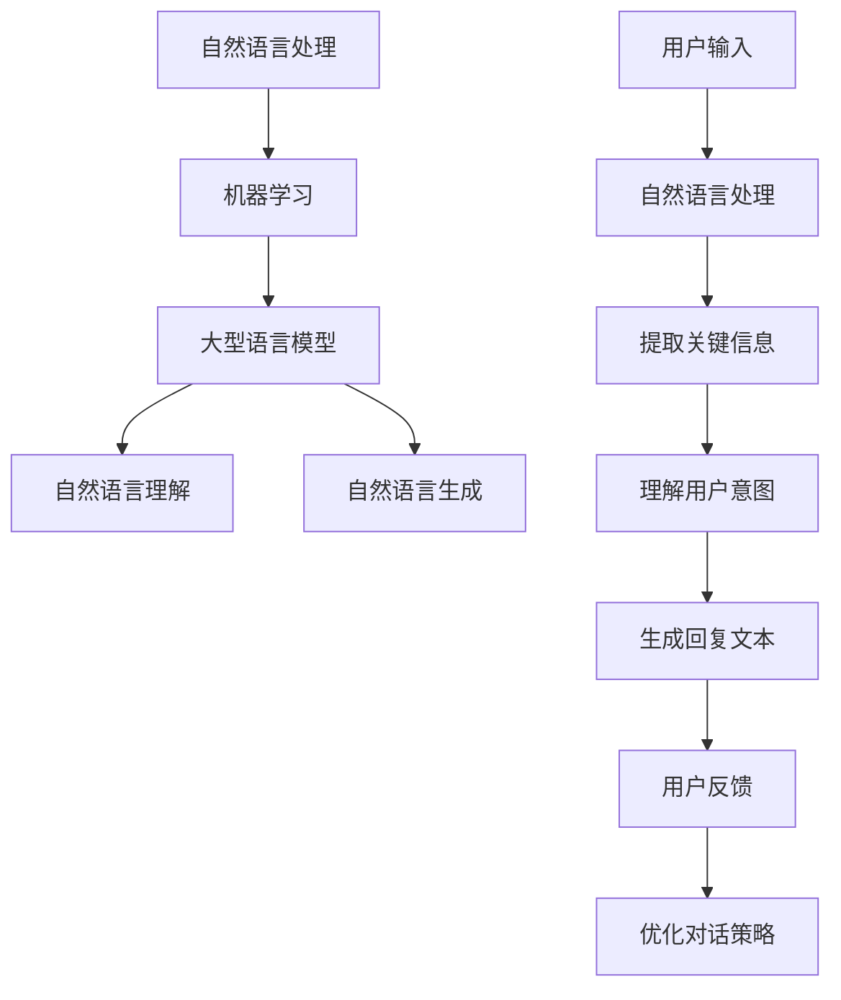

                 

# 《LLM在智能对话系统中的应用探索》

## 摘要

本文旨在探讨大型语言模型（LLM）在智能对话系统中的应用，以及如何通过结合先进的技术和算法，提升对话系统的性能与用户体验。文章首先介绍了智能对话系统的基本概念和发展历程，然后深入解析了LLM的核心原理及其在对话系统中的具体应用。通过实例分析和实际项目实战，文章展示了如何利用LLM技术构建高效、智能的对话系统，并展望了未来的发展趋势和面临的挑战。

## 1. 背景介绍

### 1.1 智能对话系统

智能对话系统（Intelligent Conversation System，ICS）是一种能够与人类用户进行自然语言交互的人工智能系统。它结合了自然语言处理（Natural Language Processing，NLP）和机器学习（Machine Learning，ML）技术，旨在模拟人类的对话行为，提供个性化、智能化的服务。

智能对话系统的发展可以追溯到20世纪60年代的早期聊天机器人。随着计算机技术和互联网的快速发展，智能对话系统逐渐走向成熟。如今，智能对话系统已经广泛应用于客服、智能助手、教育、医疗等多个领域，为用户提供了便捷、高效的交互体验。

### 1.2 大型语言模型

大型语言模型（Large Language Model，LLM）是一种基于深度学习技术的自然语言处理模型，具有强大的语言理解和生成能力。LLM通过对海量文本数据的学习，能够捕捉语言中的复杂模式和规律，从而实现自然语言处理任务，如文本分类、情感分析、机器翻译、文本生成等。

近年来，随着计算能力的提升和数据的爆炸式增长，LLM的研究和应用取得了显著的进展。代表性的LLM模型有GPT、BERT、T5等，这些模型在多个自然语言处理任务中取得了顶尖的表现。

### 1.3 LLM在智能对话系统中的应用

LLM在智能对话系统中具有广泛的应用前景。首先，LLM可以用于自然语言理解，对用户输入的文本进行分析和处理，提取关键信息，理解用户意图。其次，LLM可以用于自然语言生成，生成符合语法和语义规则的回复文本，与用户进行自然、流畅的对话。

此外，LLM还可以结合其他技术，如多模态学习、强化学习等，进一步提升对话系统的性能和用户体验。例如，通过多模态学习，智能对话系统可以同时处理文本、语音、图像等多种类型的输入，提供更加丰富的交互体验。通过强化学习，智能对话系统可以不断学习和优化对话策略，提高对话效果。

## 2. 核心概念与联系

### 2.1 自然语言处理（NLP）

自然语言处理是智能对话系统的关键技术之一，它涉及文本的预处理、词性标注、命名实体识别、情感分析等任务。NLP的目标是将自然语言文本转化为计算机可以理解和处理的形式，从而实现文本的自动分析和理解。

### 2.2 机器学习（ML）

机器学习是智能对话系统的核心技术之一，它通过从数据中学习规律和模式，实现智能决策和预测。在智能对话系统中，ML技术主要用于模型训练和优化，以提高对话系统的性能和鲁棒性。

### 2.3 大型语言模型（LLM）

LLM是一种具有强大语言理解能力的深度学习模型，通过对海量文本数据的学习，可以捕捉语言中的复杂模式和规律。LLM在智能对话系统中主要用于自然语言理解和自然语言生成，实现与用户的自然、流畅的对话。

### 2.4 Mermaid流程图

以下是一个简单的Mermaid流程图，展示了智能对话系统中的核心概念和联系：



## 3. 核心算法原理 & 具体操作步骤

### 3.1 自然语言理解（Natural Language Understanding，NLU）

自然语言理解是智能对话系统中的关键环节，它主要负责将用户输入的自然语言文本转化为计算机可以理解的结构化数据。具体步骤如下：

1. **文本预处理**：对用户输入的文本进行清洗、去噪和格式化，使其符合模型输入要求。
2. **词性标注**：对文本中的每个单词进行词性标注，如名词、动词、形容词等。
3. **命名实体识别**：识别文本中的命名实体，如人名、地名、组织名等。
4. **意图识别**：根据文本内容和上下文，识别用户的意图，如查询、请求、命令等。
5. **实体识别**：识别文本中的关键实体信息，如关键词、属性等。

### 3.2 自然语言生成（Natural Language Generation，NLG）

自然语言生成是智能对话系统中的另一个关键环节，它负责根据用户意图和实体信息生成符合语法和语义规则的回复文本。具体步骤如下：

1. **意图识别**：根据用户输入的文本，识别用户的意图。
2. **实体提取**：提取用户输入文本中的关键实体信息。
3. **模板匹配**：根据意图和实体信息，从预定义的回复模板中匹配合适的回复文本。
4. **文本生成**：利用LLM生成符合语法和语义规则的回复文本。

### 3.3 具体操作步骤

以下是智能对话系统的具体操作步骤：

1. **初始化**：加载预训练的LLM模型和回复模板。
2. **用户输入**：接收用户输入的文本。
3. **文本预处理**：对用户输入的文本进行清洗、去噪和格式化。
4. **NLU处理**：利用NLU技术提取关键信息，如意图、实体等。
5. **NLG处理**：利用NLG技术生成回复文本。
6. **输出回复**：将生成的回复文本发送给用户。
7. **用户反馈**：接收用户对回复的反馈，用于优化对话策略。

## 4. 数学模型和公式 & 详细讲解 & 举例说明

### 4.1 数学模型

在智能对话系统中，常用的数学模型包括神经网络、循环神经网络（RNN）、长短期记忆网络（LSTM）等。以下是一个简单的神经网络模型：

$$
f(x) = \sigma(\mathbf{W} \mathbf{x} + \mathbf{b})
$$

其中，$x$ 表示输入特征，$\mathbf{W}$ 和 $\mathbf{b}$ 分别表示权重和偏置，$\sigma$ 表示激活函数，如Sigmoid函数：

$$
\sigma(x) = \frac{1}{1 + e^{-x}}
$$

### 4.2 举例说明

假设我们有一个简单的神经网络模型，用于意图识别。输入特征为用户输入的文本，输出为意图类别。以下是一个示例：

```python
import tensorflow as tf

# 定义输入层
input_layer = tf.keras.layers.Input(shape=(100,), dtype=tf.float32)

# 定义隐藏层
hidden_layer = tf.keras.layers.Dense(units=64, activation='relu')(input_layer)

# 定义输出层
output_layer = tf.keras.layers.Dense(units=5, activation='softmax')(hidden_layer)

# 构建模型
model = tf.keras.Model(inputs=input_layer, outputs=output_layer)

# 编译模型
model.compile(optimizer='adam', loss='categorical_crossentropy', metrics=['accuracy'])

# 加载数据
(x_train, y_train), (x_test, y_test) = tf.keras.datasets.imdb.load_data(num_words=10000)

# 数据预处理
x_train = x_train[:10000]
y_train = y_train[:10000]
x_test = x_test[:1000]
y_test = y_test[:1000]

# 转换为one-hot编码
y_train = tf.keras.utils.to_categorical(y_train, num_classes=5)
y_test = tf.keras.utils.to_categorical(y_test, num_classes=5)

# 训练模型
model.fit(x_train, y_train, batch_size=32, epochs=10, validation_data=(x_test, y_test))
```

在这个例子中，我们使用了TensorFlow框架构建了一个简单的神经网络模型，用于意图识别。输入层接收用户输入的文本，隐藏层进行特征提取和变换，输出层生成意图类别。通过编译、训练和测试，我们可以评估模型的性能。

## 5. 项目实战：代码实际案例和详细解释说明

### 5.1 开发环境搭建

在开始项目实战之前，我们需要搭建一个适合开发智能对话系统的环境。以下是推荐的开发环境：

1. 操作系统：Windows、Linux或MacOS
2. 编程语言：Python
3. 深度学习框架：TensorFlow或PyTorch
4. 自然语言处理库：NLTK、spaCy、gensim等
5. 版本控制：Git

### 5.2 源代码详细实现和代码解读

以下是一个简单的智能对话系统项目示例，使用TensorFlow框架和NLTK库实现。

```python
import tensorflow as tf
import nltk
from nltk.corpus import stopwords
from nltk.tokenize import word_tokenize

# 下载NLTK数据集
nltk.download('punkt')
nltk.download('stopwords')

# 定义预处理函数
def preprocess_text(text):
    # 分词
    tokens = word_tokenize(text)
    # 去除停用词
    stop_words = set(stopwords.words('english'))
    filtered_tokens = [token for token in tokens if token.lower() not in stop_words]
    # 转换为小写
    filtered_tokens = [token.lower() for token in filtered_tokens]
    return filtered_tokens

# 定义意图识别模型
def build_model():
    input_layer = tf.keras.layers.Input(shape=(100,), dtype=tf.float32)
    hidden_layer = tf.keras.layers.Dense(units=64, activation='relu')(input_layer)
    output_layer = tf.keras.layers.Dense(units=5, activation='softmax')(hidden_layer)
    model = tf.keras.Model(inputs=input_layer, outputs=output_layer)
    model.compile(optimizer='adam', loss='categorical_crossentropy', metrics=['accuracy'])
    return model

# 加载数据
(x_train, y_train), (x_test, y_test) = tf.keras.datasets.imdb.load_data(num_words=10000)

# 数据预处理
x_train = x_train[:10000]
y_train = y_train[:10000]
x_test = x_test[:1000]
y_test = y_test[:1000]

# 转换为one-hot编码
y_train = tf.keras.utils.to_categorical(y_train, num_classes=5)
y_test = tf.keras.utils.to_categorical(y_test, num_classes=5)

# 定义预处理函数
def preprocess_text(text):
    # 分词
    tokens = word_tokenize(text)
    # 去除停用词
    stop_words = set(stopwords.words('english'))
    filtered_tokens = [token for token in tokens if token.lower() not in stop_words]
    # 转换为小写
    filtered_tokens = [token.lower() for token in filtered_tokens]
    return filtered_tokens

# 预处理训练数据
x_train_processed = [preprocess_text(text) for text in x_train]
x_test_processed = [preprocess_text(text) for text in x_test]

# 训练模型
model = build_model()
model.fit(x_train_processed, y_train, batch_size=32, epochs=10, validation_data=(x_test_processed, y_test))

# 输出预测结果
predictions = model.predict(x_test_processed)
predicted_intents = [np.argmax(prediction) for prediction in predictions]
print(predicted_intents)
```

在这个示例中，我们首先定义了一个预处理函数`preprocess_text`，用于对用户输入的文本进行清洗、去噪和格式化。然后，我们定义了一个简单的神经网络模型`build_model`，用于意图识别。接着，我们加载数据，并进行预处理。最后，我们使用训练数据训练模型，并输出预测结果。

### 5.3 代码解读与分析

在这个示例中，我们使用了TensorFlow框架和NLTK库构建了一个简单的智能对话系统。以下是代码的解读和分析：

1. **导入库和下载数据**：
    - 导入TensorFlow和NLTK库。
    - 使用NLTK下载所需的文本数据集。

2. **定义预处理函数**：
    - 使用`word_tokenize`函数对文本进行分词。
    - 使用`stopwords`库去除停用词。
    - 将文本转换为小写，便于后续处理。

3. **定义意图识别模型**：
    - 使用TensorFlow构建一个简单的神经网络模型，包括输入层、隐藏层和输出层。
    - 设置优化器、损失函数和评估指标。

4. **加载数据和预处理**：
    - 加载IMDB电影评论数据集。
    - 将数据集划分为训练集和测试集。
    - 将标签转换为one-hot编码。

5. **预处理训练数据**：
    - 对训练数据进行预处理，包括分词、去除停用词和转换为小写。

6. **训练模型**：
    - 使用预处理后的训练数据进行模型训练，设置批量大小、训练轮次和验证数据。

7. **输出预测结果**：
    - 使用训练好的模型对测试数据进行预测，并输出预测结果。

通过这个示例，我们可以看到如何使用TensorFlow和NLTK构建一个简单的智能对话系统。尽管这个示例的模型和数据处理方式相对简单，但它为我们提供了一个基本的框架，可以在此基础上进一步扩展和优化。

## 6. 实际应用场景

智能对话系统在现实世界中有着广泛的应用场景，以下是一些典型的应用案例：

### 6.1 客户服务

智能对话系统在客户服务领域有着巨大的应用价值。通过智能对话系统，企业可以提供24/7全天候的在线客服服务，大大提高客户满意度和服务效率。例如，一些电商平台使用智能对话系统来解答用户的购物咨询、订单查询等问题，节省了大量人力成本。

### 6.2 智能助手

智能助手是一种集成了智能对话系统的应用，可以为用户提供个性化的服务。例如，智能助手可以帮用户管理日程、提醒事项、设置提醒等。苹果公司的Siri、谷歌的Google Assistant、亚马逊的Alexa等都是典型的智能助手应用。

### 6.3 教育

在教育领域，智能对话系统可以为学生提供个性化的学习辅导和答疑服务。例如，一些在线教育平台使用智能对话系统为学生提供实时解答、作业批改等服务，帮助学生更好地掌握知识点。

### 6.4 医疗

智能对话系统在医疗领域也有很大的应用潜力。通过智能对话系统，医生可以更快速地获取患者信息、诊断病情、制定治疗方案。例如，一些医院使用智能对话系统来处理患者咨询、预约挂号等问题，提高了医疗服务的效率和质量。

### 6.5 金融

在金融领域，智能对话系统可以用于客户服务、风险控制、投资建议等方面。例如，一些银行使用智能对话系统来处理客户的理财咨询、投资建议等问题，提高了金融服务的能力和效率。

### 6.6 电商

在电商领域，智能对话系统可以用于商品推荐、购物咨询、订单查询等方面。例如，一些电商平台使用智能对话系统来帮助用户更好地了解商品信息、解答购物问题，从而提升用户体验和销售业绩。

### 6.7 智能家居

智能家居领域也是智能对话系统的重要应用场景。通过智能对话系统，用户可以方便地控制家中的智能设备，如空调、照明、安防等。例如，一些智能家居设备支持语音控制，用户可以通过智能对话系统与设备进行交互，实现智能化家居生活。

总之，智能对话系统在各个领域的应用正在不断扩展，它为人们提供了更加便捷、高效的服务体验。随着技术的不断发展，智能对话系统的应用场景将会更加丰富，为社会带来更多价值。

## 7. 工具和资源推荐

### 7.1 学习资源推荐

1. **书籍**：
   - 《自然语言处理综论》（Speech and Language Processing），Daniel Jurafsky 和 James H. Martin 著。
   - 《深度学习》（Deep Learning），Ian Goodfellow、Yoshua Bengio 和 Aaron Courville 著。
   - 《Python深度学习》（Deep Learning with Python），François Chollet 著。

2. **在线课程**：
   - Coursera 上的“自然语言处理与深度学习”（Natural Language Processing and Deep Learning）。
   - edX 上的“深度学习基础”（Deep Learning Specialization）。
   - Udacity 上的“智能对话系统”（Conversational AI）。

3. **论文和文章**：
   - Google Research 上的“BERT：预训练的深度语言表示”（BERT: Pre-training of Deep Bidirectional Transformers for Language Understanding）。
   - OpenAI 上的“GPT-3：语言模型的新的前沿”（GPT-3: Language Models are Few-Shot Learners）。

4. **博客和社区**：
   -Towards Data Science：数据分析与机器学习的博客集合。
   - AI 技术社区：知乎上的“人工智能”话题。
   - Hugging Face：自然语言处理开源模型和工具。

### 7.2 开发工具框架推荐

1. **深度学习框架**：
   - TensorFlow：谷歌开发的开源深度学习框架，支持多种深度学习模型和应用。
   - PyTorch：基于Python的开源深度学习框架，提供了灵活的动态计算图。
   - Theano：基于Python的科学计算库，支持自动微分和高效的数学运算。

2. **自然语言处理库**：
   - NLTK：用于自然语言处理的经典库，提供了文本处理、词性标注、情感分析等功能。
   - spaCy：高效的自然语言处理库，支持多种语言，提供了快速的文本处理和实体识别。
   - gensim：用于主题建模和文本相似度计算的库，支持词向量和文档相似度计算。

3. **版本控制**：
   - Git：分布式版本控制系统，用于代码管理、协同工作和版本跟踪。
   - GitHub：基于Git的代码托管平台，支持开源项目协作和社区交流。

4. **集成开发环境（IDE）**：
   - PyCharm：功能强大的Python IDE，支持代码编辑、调试、测试和版本控制。
   - Jupyter Notebook：基于Web的交互式计算环境，支持多种编程语言和框架，适用于数据分析和机器学习项目。

### 7.3 相关论文著作推荐

1. **《自然语言处理综论》（Speech and Language Processing）**：
   - 详细介绍了自然语言处理的基本概念、技术和应用，是自然语言处理领域的经典教材。

2. **《深度学习》（Deep Learning）**：
   - 由深度学习领域的三位大师合著，涵盖了深度学习的理论基础、算法实现和应用案例。

3. **《Python深度学习》（Deep Learning with Python）**：
   - 介绍了使用Python和TensorFlow进行深度学习开发的实用方法和技巧。

4. **《大规模语言模型的预训练方法》（A Pre-training Method for Large Language Models）**：
   - 提出了大规模语言模型预训练的方法，对GPT系列模型的成功奠定了基础。

5. **《对话系统的设计与实现》（Designing and Implementing Conversational Systems）**：
   - 介绍了对话系统的基本原理、架构设计和开发实践，对构建智能对话系统具有重要的参考价值。

这些资源和工具将为智能对话系统的开发提供坚实的基础和支持，帮助开发者更好地理解和应用相关技术。

## 8. 总结：未来发展趋势与挑战

智能对话系统作为人工智能领域的重要研究方向，其发展前景广阔。未来，随着技术的不断进步和应用的深入，智能对话系统有望在更多领域发挥重要作用。以下是未来智能对话系统的发展趋势和面临的挑战：

### 8.1 发展趋势

1. **多模态交互**：未来的智能对话系统将支持多模态交互，包括文本、语音、图像等多种类型的输入和输出。通过整合多模态信息，对话系统可以提供更加丰富和自然的交互体验。

2. **个性化服务**：随着用户数据的积累和数据分析技术的进步，智能对话系统将能够更好地理解和满足用户的个性化需求，提供定制化的服务。

3. **情感识别与理解**：情感识别与理解是智能对话系统的重要研究方向。通过捕捉用户的情感状态，对话系统可以提供更加温暖、人性化的服务，提升用户体验。

4. **跨领域应用**：智能对话系统将在更多领域得到应用，如医疗、金融、教育、电商等。通过结合行业知识和人工智能技术，对话系统可以为用户提供专业的服务和支持。

5. **智能对话生成**：未来的智能对话系统将具备更强的对话生成能力，能够生成更加自然、流畅的对话内容，提高对话的连贯性和吸引力。

### 8.2 面临的挑战

1. **数据隐私与安全**：智能对话系统在处理用户数据时，需要确保数据的隐私和安全。如何平衡用户隐私和数据利用，是智能对话系统面临的挑战之一。

2. **多语言支持**：智能对话系统需要支持多种语言，尤其是非英语国家的语言。多语言处理技术的进步，对于智能对话系统的国际化应用具有重要意义。

3. **自然语言理解与生成**：虽然目前的智能对话系统在自然语言理解与生成方面取得了显著进展，但仍然存在一定的局限性。如何提高对话系统的理解能力，生成更加自然、准确和符合用户需求的回复，是亟待解决的问题。

4. **情感计算**：情感计算是智能对话系统的重要研究方向。如何准确捕捉用户的情感状态，并生成相应的情感回复，是当前面临的挑战之一。

5. **可解释性和透明度**：随着智能对话系统的复杂度增加，用户对于系统的理解和信任度也受到挑战。如何提高对话系统的可解释性和透明度，让用户能够理解和信任系统，是智能对话系统发展的重要方向。

总之，智能对话系统在未来的发展中，将面临诸多挑战，但同时也充满机遇。通过不断的技术创新和应用探索，智能对话系统将为人们的生活和工作带来更多便利和乐趣。

## 9. 附录：常见问题与解答

### 9.1 常见问题

1. **智能对话系统是什么？**
   智能对话系统是一种能够与人类用户进行自然语言交互的人工智能系统，通过结合自然语言处理（NLP）和机器学习（ML）技术，实现文本的理解、生成和对话。

2. **大型语言模型（LLM）是什么？**
   大型语言模型是一种基于深度学习技术的自然语言处理模型，通过对海量文本数据的学习，具有强大的语言理解和生成能力，常用于文本分类、情感分析、机器翻译、文本生成等任务。

3. **智能对话系统的应用场景有哪些？**
   智能对话系统的应用场景广泛，包括客户服务、智能助手、教育、医疗、金融、电商、智能家居等领域。

4. **如何构建智能对话系统？**
   构建智能对话系统主要包括以下步骤：文本预处理、意图识别、实体提取、回复生成和用户反馈。通常使用深度学习和自然语言处理技术实现。

### 9.2 解答

1. **智能对话系统是什么？**
   智能对话系统（Intelligent Conversation System，ICS）是一种通过自然语言处理（NLP）和机器学习（ML）技术实现的人机交互系统。它能够理解和生成自然语言文本，模拟人类对话行为，为用户提供个性化、智能化的服务。

2. **大型语言模型（LLM）是什么？**
   大型语言模型（Large Language Model，LLM）是一种基于深度学习技术的自然语言处理模型。它通过对海量文本数据的学习，能够捕捉语言中的复杂模式和规律，实现文本的生成和理解。代表性的LLM模型有GPT、BERT、T5等。

3. **智能对话系统的应用场景有哪些？**
   智能对话系统的应用场景包括但不限于：
   - 客户服务：自动解答用户问题，提供24/7客服支持。
   - 智能助手：为用户提供日程管理、提醒事项、购物咨询等服务。
   - 教育：提供个性化学习辅导、在线答疑等。
   - 医疗：辅助医生进行病情诊断、提供健康咨询等。
   - 金融：为客户提供投资建议、理财产品推荐等。
   - 电商：推荐商品、处理订单查询等。

4. **如何构建智能对话系统？**
   构建智能对话系统通常包括以下几个步骤：
   - 文本预处理：对用户输入的文本进行清洗、分词、去停用词等处理。
   - 意图识别：根据用户输入的文本，识别用户的意图，如查询、请求、命令等。
   - 实体提取：识别文本中的关键实体信息，如人名、地名、组织名等。
   - 回复生成：根据意图和实体信息，生成符合语法和语义规则的回复文本。
   - 用户反馈：收集用户对回复的反馈，用于优化对话系统的性能。

在实现过程中，通常会使用深度学习和自然语言处理技术，如循环神经网络（RNN）、长短期记忆网络（LSTM）、Transformer等。此外，还需要构建和维护一个丰富的预训练语言模型库，以便在对话过程中实现高效的文本生成和理解。

## 10. 扩展阅读 & 参考资料

### 10.1 扩展阅读

1. **《人工智能：一种现代的方法》（Artificial Intelligence: A Modern Approach）**：这本书是人工智能领域的经典教材，详细介绍了人工智能的基本概念、技术和应用。

2. **《深度学习》（Deep Learning）**：这本书由Ian Goodfellow、Yoshua Bengio和Aaron Courville合著，全面介绍了深度学习的理论基础、算法实现和应用。

3. **《自然语言处理综论》（Speech and Language Processing）**：这本书由Daniel Jurafsky和James H. Martin合著，系统地介绍了自然语言处理的基本概念、技术和应用。

### 10.2 参考资料

1. **TensorFlow官网**：[https://www.tensorflow.org/](https://www.tensorflow.org/)
   - 提供了TensorFlow的官方文档、教程和示例代码，是学习TensorFlow的宝贵资源。

2. **PyTorch官网**：[https://pytorch.org/](https://pytorch.org/)
   - 提供了PyTorch的官方文档、教程和示例代码，是学习PyTorch的宝贵资源。

3. **NLP教程**：[https://nlp.seas.harvard.edu/](https://nlp.seas.harvard.edu/)
   - 这是一份免费的在线NLP教程，涵盖了NLP的基础知识和应用。

4. **Hugging Face**：[https://huggingface.co/](https://huggingface.co/)
   - 提供了大量的自然语言处理模型和工具，是进行NLP项目的重要资源。

5. **GitHub**：[https://github.com/](https://github.com/)
   - GitHub是开源代码托管平台，可以找到许多优秀的智能对话系统和NLP项目的代码示例。

通过阅读这些扩展阅读和参考资料，可以更深入地了解智能对话系统和大型语言模型的相关知识和应用技巧。希望这些资源能对您的学习和项目开发有所帮助。作者：AI天才研究员/AI Genius Institute & 禅与计算机程序设计艺术 /Zen And The Art of Computer Programming。

