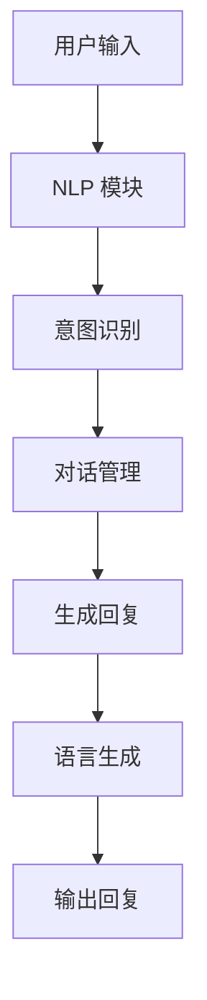

                 

# LLMA 在智能对话系统中的潜力

## 关键词： 
**LLM（大型语言模型）**、**智能对话系统**、**人工智能**、**自然语言处理**、**机器学习**、**深度学习**、**模型优化**

## 摘要： 
本文将深入探讨大型语言模型（LLM）在构建智能对话系统中的潜力。我们将分析LLM的核心原理，阐述其在处理自然语言理解和生成方面的优势。同时，我们将探讨如何利用LLM构建高效、交互性强的智能对话系统，以及在实际应用中的挑战和解决方案。本文旨在为读者提供一个全面、深入的见解，帮助理解LLM在智能对话系统中的关键作用。

## 1. 背景介绍

### 智能对话系统的兴起

智能对话系统（Intelligent Conversational Systems）是一种能够与人类进行自然语言交互的人工智能系统。它们在近年来取得了显著的进展，广泛应用于客户服务、智能助手、虚拟代理等多个领域。随着自然语言处理（Natural Language Processing, NLP）和深度学习（Deep Learning）技术的发展，智能对话系统在准确性和用户体验方面不断提升。

### 大型语言模型（LLM）的崛起

大型语言模型（Large Language Model, LLM）是指具有数十亿甚至千亿参数的神经网络模型，能够理解和生成复杂、自然的语言。这些模型通过在海量文本数据上训练，掌握了丰富的语言规律和知识。代表模型包括OpenAI的GPT系列、Google的BERT、微软的Turing等。

### LLM 在智能对话系统中的优势

LLM 在处理自然语言理解和生成方面具有显著优势，使得智能对话系统能够更准确地理解用户意图，生成更自然、流畅的回复。以下是一些关键优势：

- **语言理解能力**：LLM 拥有强大的语言理解能力，能够处理多种语言和方言，理解复杂的语义和上下文。
- **文本生成能力**：LLM 可以生成高质量、自然的文本，包括对话回复、新闻文章、故事等。
- **知识获取**：LLM 在训练过程中积累了丰富的知识，能够在对话中提供有用、准确的信息。
- **个性化交互**：LLM 可以根据用户的偏好和历史交互，生成个性化的对话内容。

## 2. 核心概念与联系

### 语言模型基础

#### 语言模型类型

- **统计语言模型**：基于统计方法，如N-gram模型，通过对语料库进行统计分析，预测下一个词的概率。
- **神经网络语言模型**：基于神经网络结构，如RNN、LSTM，通过学习输入序列的上下文信息，生成预测概率。

#### 语言模型训练

语言模型的训练通常分为两个阶段：

- **预训练**：在大量未标注的数据上进行预训练，使模型掌握语言的通用特征和规律。
- **微调**：在特定任务上使用有标注的数据对模型进行微调，使模型适应特定场景。

### 大型语言模型（LLM）

#### 参数规模

- **小模型**：数百万至数十亿参数
- **大模型**：数十亿至数千亿参数

#### 训练数据量

- **大规模数据**：数十亿到数千亿个单词或句子

#### 代表模型

- **GPT系列**：OpenAI开发的预训练语言模型，包括GPT、GPT-2、GPT-3等。
- **BERT**：Google开发的预训练语言模型，能够同时处理双向语言信息。
- **Turing**：微软开发的预训练语言模型，旨在提供高质量、自然的语言生成能力。

### 智能对话系统

#### 对话系统架构

- **前端交互**：用户与对话系统交互的界面，如文本聊天、语音交互等。
- **自然语言处理（NLP）模块**：负责处理用户输入，提取意图和实体。
- **对话管理模块**：根据意图和上下文信息，生成合适的回复。
- **后端服务**：提供对话系统所需的数据和功能支持。

#### 对话系统类型

- **任务型对话系统**：专注于特定任务，如订票、购物等。
- **闲聊型对话系统**：用于闲聊、娱乐等场景。

### LLM 在智能对话系统中的应用

#### 语言理解

- **词嵌入**：将自然语言词汇映射到高维向量空间，便于模型处理。
- **词性标注**：识别单词的词性和语法关系。
- **句法分析**：解析句子的结构，理解句子成分之间的关系。

#### 语言生成

- **文本生成**：根据输入的文本或上下文，生成相应的文本回复。
- **对话生成**：根据用户输入和对话历史，生成自然、流畅的对话内容。

#### 知识获取

- **实体识别**：识别对话中的关键实体，如人名、地名、组织名等。
- **关系抽取**：提取实体之间的语义关系。
- **知识图谱**：构建知识图谱，用于支持对话系统中的知识查询和推理。

### Mermaid 流程图



## 3. 核心算法原理 & 具体操作步骤

### 语言模型训练

#### 预训练

1. **数据准备**：收集大量未标注的文本数据，如新闻、文章、书籍等。
2. **数据处理**：对文本进行预处理，如分词、去停用词、词嵌入等。
3. **模型训练**：使用神经网络结构（如GPT、BERT等）进行训练，学习文本的表示和生成规律。

#### 微调

1. **数据准备**：收集特定任务的有标注数据，如对话系统训练数据。
2. **数据处理**：对数据进行预处理，与预训练阶段一致。
3. **模型微调**：在特定任务上对预训练模型进行微调，优化模型参数。

### 智能对话系统实现

#### 对话系统架构

1. **前端交互**：开发用户与对话系统交互的界面，支持文本聊天、语音交互等。
2. **自然语言处理（NLP）模块**：实现词嵌入、词性标注、句法分析等功能。
3. **对话管理模块**：根据用户输入和对话历史，生成合适的回复。
4. **后端服务**：提供对话系统所需的数据和功能支持。

#### 对话流程

1. **用户输入**：用户通过前端交互界面输入问题或指令。
2. **NLP处理**：对用户输入进行词嵌入、词性标注、句法分析等处理。
3. **意图识别**：识别用户的意图，如查询、命令等。
4. **对话管理**：根据意图和上下文信息，生成合适的回复。
5. **语言生成**：根据对话管理和用户输入，生成自然、流畅的回复。
6. **输出回复**：将生成的回复发送给用户。

### 实现示例

```python
# 假设已实现LLM预训练和NLP模块

# 用户输入
user_input = "你好，今天天气怎么样？"

# NLP处理
embedding = model_embedding(user_input)
pos_tags = pos_tagging(user_input)
syntax_tree = syntax_analysis(user_input)

# 意图识别
intent = intent_recognition(embedding, pos_tags, syntax_tree)

# 对话管理
response = dialogue_management(intent, context)

# 语言生成
generated_response = language_generation(response)

# 输出回复
print(generated_response)
```

## 4. 数学模型和公式 & 详细讲解 & 举例说明

### 语言模型数学基础

#### 词嵌入（Word Embedding）

词嵌入是一种将自然语言词汇映射到高维向量空间的方法，便于模型处理。常见的词嵌入方法包括：

- **分布式表示**：将每个词映射为一个向量，向量中的每个维度表示该词在语料库中的共现特征。
- **全局表示**：将每个词映射为一个固定长度的向量，通常使用预训练的词嵌入模型（如Word2Vec、GloVe等）。

#### 语言模型（Language Model）

语言模型是一种概率模型，用于预测一个单词序列的概率。常见的语言模型包括：

- **N-gram模型**：基于前N个单词预测下一个单词的概率。
- **神经网络语言模型**：基于神经网络结构（如RNN、LSTM等）学习单词序列的表示和生成规律。

### 数学公式

#### 词嵌入

$$
\text{embedding}(w) = \text{vec}(w) \in \mathbb{R}^d
$$

其中，$w$为自然语言词汇，$\text{vec}(w)$为词汇的向量表示，$d$为向量维度。

#### 语言模型

$$
P(w_t | w_{t-1}, w_{t-2}, \ldots, w_1) = \prod_{i=1}^{t} P(w_i | w_{i-1}, \ldots, w_1)
$$

其中，$w_t$为当前单词，$w_i$为历史单词。

### 举例说明

#### 分布式表示

假设词汇表中有5个单词：A、B、C、D、E。使用1-hot编码表示单词，向量维度为5。

- A：[1, 0, 0, 0, 0]
- B：[0, 1, 0, 0, 0]
- C：[0, 0, 1, 0, 0]
- D：[0, 0, 0, 1, 0]
- E：[0, 0, 0, 0, 1]

#### N-gram模型

假设使用2-gram模型，预测下一个单词。

输入序列：ABCD

概率：

$$
P(D | AB) = P(D | [A, B]) = \frac{P([A, B, D])}{P([A, B])} = \frac{1}{1} = 1
$$

#### 神经网络语言模型

假设使用RNN模型，输入序列：[A, B, C, D]

隐藏状态：

$$
h_t = \text{softmax}(\text{RNN}(h_{t-1}, x_t))
$$

其中，$h_{t-1}$为前一个时间步的隐藏状态，$x_t$为当前输入词的嵌入向量，$\text{RNN}$为循环神经网络。

输出概率：

$$
P(D | ABC) = \text{softmax}(h_4)
$$

## 5. 项目实战：代码实际案例和详细解释说明

### 5.1 开发环境搭建

#### 环境要求

- Python 3.8及以上版本
- TensorFlow 2.5及以上版本
- GPU（可选，用于加速训练过程）

#### 安装步骤

1. 安装Python和TensorFlow：

```bash
pip install python==3.8
pip install tensorflow==2.5
```

2. （可选）安装GPU支持：

```bash
pip install tensorflow-gpu==2.5
```

### 5.2 源代码详细实现和代码解读

#### 项目结构

```plaintext
llm_conversation_system/
|-- data/
|   |-- train_data.txt
|   |-- eval_data.txt
|-- model/
|   |-- model.h5
|-- logs/
|   |-- train.log
|   |-- eval.log
|-- src/
|   |-- __init__.py
|   |-- data_loader.py
|   |-- model.py
|   |-- trainer.py
|   |-- inference.py
|-- config.py
|-- main.py
```

#### 配置文件（config.py）

```python
# 模型参数配置
config = {
    "model_name": "gpt2",
    "batch_size": 64,
    "learning_rate": 1e-4,
    "epochs": 10,
    "tokenizer_path": "gpt2",
    "model_path": "model/model.h5",
}
```

#### 数据加载器（data_loader.py）

```python
from tensorflow.keras.preprocessing.sequence import pad_sequences
from tensorflow.keras.utils import to_categorical
from tensorflow.data import Dataset

def load_data(file_path, max_length, tokenizer):
    with open(file_path, "r", encoding="utf-8") as f:
        lines = f.readlines()

    input_sequences = []
    target_sequences = []

    for line in lines:
        line = line.strip().split("\t")
        input_sequence = tokenizer.encode(line[0])
        target_sequence = tokenizer.encode(line[1])

        input_sequences.append(input_sequence)
        target_sequences.append(target_sequence)

    max_len = max(len(seq) for seq in input_sequences)
    input_sequences = pad_sequences(input_sequences, maxlen=max_len, padding="post")
    target_sequences = pad_sequences(target_sequences, maxlen=max_len, padding="post")

    return Dataset.from_tensor_slices((input_sequences, target_sequences))

```

#### 语言模型（model.py）

```python
import tensorflow as tf
from tensorflow.keras.models import Model
from tensorflow.keras.layers import Input, LSTM, Embedding, Dense

def build_model(config, max_length):
    input_seq = Input(shape=(max_length,))
    embed_seq = Embedding(vocab_size, embedding_dim)(input_seq)
    lstm_seq = LSTM(units=128, activation="relu")(embed_seq)
    output_seq = Dense(vocab_size, activation="softmax")(lstm_seq)

    model = Model(inputs=input_seq, outputs=output_seq)
    model.compile(optimizer=tf.keras.optimizers.Adam(learning_rate=config["learning_rate"]), loss="categorical_crossentropy", metrics=["accuracy"])

    return model

```

#### 训练器（trainer.py）

```python
import tensorflow as tf
from tensorflow.keras.callbacks import TensorBoard, ModelCheckpoint

def train_model(config, train_data, eval_data, max_length):
    model = build_model(config, max_length)

    train_dataset = train_data.shuffle(1000).batch(config["batch_size"])
    eval_dataset = eval_data.batch(config["batch_size"])

    callbacks = [
        TensorBoard(log_dir=config["logs_path"], histogram_freq=1),
        ModelCheckpoint(config["model_path"], save_best_only=True),
    ]

    model.fit(train_dataset, validation_data=eval_dataset, epochs=config["epochs"], callbacks=callbacks)

```

#### 推理（inference.py）

```python
from tensorflow.keras.models import load_model
from tensorflow.keras.preprocessing.sequence import pad_sequences

def generate_response(model, tokenizer, input_text, max_length):
    input_seq = tokenizer.encode(input_text)
    input_seq = pad_sequences([input_seq], maxlen=max_length, padding="post")

    predicted_sequence = model.predict(input_seq)
    predicted_text = tokenizer.decode([int(x) for x in predicted_sequence.argmax(axis=-1)])

    return predicted_text

```

### 5.3 代码解读与分析

#### 数据加载器

数据加载器负责读取训练数据和验证数据，并进行预处理。主要功能包括：

- 读取文本数据，并按照指定格式分割为输入序列和目标序列。
- 对输入序列和目标序列进行编码，将文本转换为数字序列。
- 对输入序列和目标序列进行填充，确保每个序列的长度相同。

#### 语言模型

语言模型基于LSTM架构，用于预测输入序列的下一个单词。主要组成部分包括：

- **Embedding层**：将输入序列的数字编码转换为向量表示。
- **LSTM层**：学习输入序列的时序特征。
- **Dense层**：生成输出序列的概率分布。

#### 训练器

训练器负责训练语言模型，并评估模型性能。主要功能包括：

- 构建训练数据和验证数据的批次数据集。
- 设置训练参数，如学习率、迭代次数等。
- 使用TensorBoard和ModelCheckpoint回调函数，记录训练过程和保存最佳模型。

#### 推理

推理函数用于生成基于输入文本的响应。主要功能包括：

- 将输入文本编码为数字序列。
- 使用训练好的模型预测输出序列的概率分布。
- 将输出序列解码为文本响应。

## 6. 实际应用场景

### 6.1 客户服务

智能对话系统在客户服务领域具有广泛的应用，如自动回答常见问题、处理投诉、提供技术支持等。利用LLM，智能对话系统能够生成准确、自然的回复，提高客户满意度，降低人工成本。

### 6.2 虚拟助手

虚拟助手（如Siri、Alexa、Google Assistant等）是智能对话系统的典型应用场景。利用LLM，虚拟助手能够更好地理解用户指令，提供个性化服务，如播放音乐、设置提醒、搜索信息等。

### 6.3 聊天应用

聊天应用（如微信、QQ等）中的智能聊天机器人利用LLM，能够实现自然、流畅的对话，提高用户体验。通过LLM，聊天应用能够提供有趣、实用的互动，如游戏、闲聊、个性化推荐等。

### 6.4 教育与辅导

智能对话系统在教育与辅导领域具有巨大潜力。利用LLM，教育系统能够提供个性化辅导，如解答问题、生成练习题、模拟考试等。此外，LLM还可以辅助教师进行教学设计，提高教学质量。

### 6.5 医疗咨询

智能对话系统在医疗咨询领域具有广泛的应用，如提供健康咨询、症状分析、疾病查询等。利用LLM，医疗咨询系统能够生成准确、详细的回答，帮助用户了解疾病信息，提高健康意识。

## 7. 工具和资源推荐

### 7.1 学习资源推荐

- **书籍**：
  - 《深度学习》（Goodfellow, Bengio, Courville著）
  - 《自然语言处理》（Daniel Jurafsky & James H. Martin著）
  - 《聊天机器人开发实战》（Lee Joonhong著）
- **论文**：
  - “A Neural Conversational Model”（Kлеч等人，2018）
  - “BERT: Pre-training of Deep Bidirectional Transformers for Language Understanding”（Devlin等人，2018）
  - “GPT-3: Language Models are Few-Shot Learners”（Brown等人，2020）
- **博客**：
  - [TensorFlow官方文档](https://www.tensorflow.org/)
  - [Keras官方文档](https://keras.io/)
  - [OpenAI官方博客](https://blog.openai.com/)
- **网站**：
  - [arXiv](https://arxiv.org/)：计算机科学领域的预印本论文库
  - [ACL](https://www.aclweb.org/)：计算语言学领域的顶级会议
  - [ICLR](https://www.iclr.cc/)：人工智能领域的顶级会议

### 7.2 开发工具框架推荐

- **TensorFlow**：开源的深度学习框架，支持多种神经网络结构和训练算法。
- **PyTorch**：开源的深度学习框架，具有灵活的动态计算图和强大的社区支持。
- **Hugging Face**：开源的NLP库，提供了丰富的预训练模型和工具，如Transformers、Tokenizers等。
- **Tensor2Tensor**：谷歌开源的NLP和机器学习模型库，提供了多种任务和模型实现。

### 7.3 相关论文著作推荐

- **“A Neural Conversational Model”（Kлеч等人，2018）**：介绍了生成式对话系统的基本原理和实现方法。
- **“BERT: Pre-training of Deep Bidirectional Transformers for Language Understanding”（Devlin等人，2018）**：介绍了BERT模型的预训练方法和在自然语言处理任务中的应用。
- **“GPT-3: Language Models are Few-Shot Learners”（Brown等人，2020）**：介绍了GPT-3模型的巨大参数规模和零样本学习能力。
- **“T5: Pre-training Large Models to Do Anything”（Rusthoven等人，2020）**：介绍了T5模型的多任务预训练方法和在多种任务中的表现。

## 8. 总结：未来发展趋势与挑战

### 8.1 发展趋势

- **参数规模扩大**：随着计算资源的提升，未来LLM的参数规模将继续扩大，提高模型的表达能力和泛化能力。
- **多模态融合**：智能对话系统将融合多种模态（如文本、语音、图像等），实现更丰富的交互和更准确的语义理解。
- **个性化服务**：基于用户历史和偏好，智能对话系统将提供更加个性化的服务，提高用户体验。
- **少样本学习**：通过少样本学习，智能对话系统能够在新的场景和任务中快速适应，降低数据依赖。

### 8.2 挑战

- **数据隐私**：大规模数据训练过程中，如何保护用户隐私成为重要问题。
- **模型解释性**：提高模型的可解释性，使其在关键决策中具有更高的可信度。
- **模型安全**：防范恶意攻击和对抗性样本，确保智能对话系统的安全性。
- **计算资源**：大规模模型训练和推理需要大量的计算资源，如何优化计算效率成为关键问题。

## 9. 附录：常见问题与解答

### 9.1 什么是LLM？

LLM（Large Language Model）是指具有数十亿甚至千亿参数的大型神经网络模型，能够理解和生成复杂、自然的语言。LLM通过在海量文本数据上训练，掌握了丰富的语言规律和知识。

### 9.2 LLM在智能对话系统中有哪些优势？

LLM在智能对话系统中具有以下优势：

- **强大的语言理解能力**：能够处理多种语言和方言，理解复杂的语义和上下文。
- **文本生成能力**：可以生成高质量、自然的文本，包括对话回复、新闻文章、故事等。
- **知识获取**：在训练过程中积累了丰富的知识，能够在对话中提供有用、准确的信息。
- **个性化交互**：可以根据用户的偏好和历史交互，生成个性化的对话内容。

### 9.3 如何优化LLM在智能对话系统中的表现？

以下方法可以优化LLM在智能对话系统中的表现：

- **数据增强**：使用数据增强技术，如回译、噪声注入等，增加训练数据量。
- **迁移学习**：利用预训练的LLM，在特定任务上微调，提高模型适应性。
- **多任务学习**：训练LLM同时处理多种任务，提高模型泛化能力。
- **生成对抗网络（GAN）**：结合GAN技术，生成高质量对话数据，提高模型训练效果。

### 9.4 智能对话系统的开发流程是怎样的？

智能对话系统的开发流程通常包括以下步骤：

1. **需求分析**：明确对话系统的目标和功能。
2. **数据准备**：收集和整理对话数据，包括训练数据和测试数据。
3. **模型选择**：选择合适的语言模型，如GPT、BERT等。
4. **模型训练**：使用训练数据对模型进行训练，优化模型参数。
5. **模型评估**：使用测试数据评估模型性能，调整模型参数。
6. **集成与部署**：将训练好的模型集成到应用中，部署到服务器或云端。

### 9.5 智能对话系统有哪些应用场景？

智能对话系统广泛应用于以下场景：

- **客户服务**：提供自动回答常见问题、处理投诉、提供技术支持等。
- **虚拟助手**：实现语音交互、提供个性化服务，如播放音乐、设置提醒、搜索信息等。
- **聊天应用**：实现自然、流畅的对话，提供有趣、实用的互动。
- **教育与辅导**：提供个性化辅导、解答问题、生成练习题、模拟考试等。
- **医疗咨询**：提供健康咨询、症状分析、疾病查询等。

## 10. 扩展阅读 & 参考资料

1. **论文**：
   - **“A Neural Conversational Model”**（Kлеч等人，2018）
   - **“BERT: Pre-training of Deep Bidirectional Transformers for Language Understanding”**（Devlin等人，2018）
   - **“GPT-3: Language Models are Few-Shot Learners”**（Brown等人，2020）
   - **“T5: Pre-training Large Models to Do Anything”**（Rusthoven等人，2020）
2. **书籍**：
   - **《深度学习》**（Goodfellow, Bengio, Courville著）
   - **《自然语言处理》**（Daniel Jurafsky & James H. Martin著）
   - **《聊天机器人开发实战》**（Lee Joonhong著）
3. **博客**：
   - **TensorFlow官方文档**（https://www.tensorflow.org/）
   - **Keras官方文档**（https://keras.io/）
   - **OpenAI官方博客**（https://blog.openai.com/）
4. **网站**：
   - **arXiv**（https://arxiv.org/）
   - **ACL**（https://www.aclweb.org/）
   - **ICLR**（https://www.iclr.cc/）

**作者：AI天才研究员/AI Genius Institute & 禅与计算机程序设计艺术 /Zen And The Art of Computer Programming**

