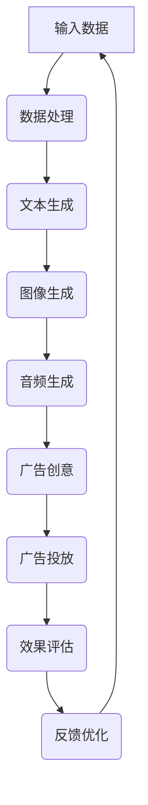

                 

# LLMA在智能广告创意生成中的应用探索

## 摘要

随着人工智能技术的快速发展，自然语言处理（NLP）和生成式模型（Generative Model）在广告创意生成领域展现出了巨大的潜力。特别是近年来，预训练语言模型（Pre-trained Language Model，如GPT、BERT）的涌现，为广告创意的自动化生成提供了强有力的技术支持。本文将探讨大型语言模型（LLM）在智能广告创意生成中的应用，从背景介绍、核心概念、算法原理、数学模型、实战案例以及实际应用场景等方面进行详细分析，并展望未来发展趋势与挑战。希望通过本文的探讨，能够为广告行业的创新和实践提供一些有价值的参考和思路。

## 1. 背景介绍

### 广告行业的发展历程

广告作为市场经济的重要组成部分，其发展历程可以追溯到几千年前。古代的商贸活动中，商人通过口头宣传、壁画等形式进行产品推广。随着印刷术的发明，广告形式逐渐多样化，报纸、杂志等媒体成为广告传播的主要渠道。进入20世纪，电视、广播等电子媒体的兴起，使得广告传播速度和覆盖面大幅提升。到了互联网时代，网络广告应运而生，成为广告行业的新增长点。

### 广告创意的重要性

广告创意是广告的灵魂，决定了广告能否吸引目标受众、提升品牌知名度、促进销售转化。一个成功的广告创意不仅能传达产品的核心价值，还能与目标受众产生共鸣，引发情感共鸣。因此，广告创意的设计和创新是广告行业永恒的追求。

### 广告创意生成的挑战

尽管广告创意在广告行业中至关重要，但其生成过程却面临着诸多挑战：

1. **创意多样性**：广告创意需要不断推陈出新，以满足不同市场和受众的需求。然而，创意的多样性和创新性往往难以同时实现。
2. **人力成本**：广告创意的生成通常需要大量的人力投入，从市场调研、创意构思到设计制作，每一个环节都需要专业人才的参与。这无疑增加了广告主的成本压力。
3. **效率问题**：广告投放需要快速响应市场需求，而传统广告创意生成过程往往耗时较长，难以满足高效投放的需求。
4. **个性化推荐**：随着用户个性化需求的不断增长，广告创意需要更加精准地匹配用户兴趣和需求，从而提升投放效果。

### 人工智能与广告创意

人工智能技术的发展为解决广告创意生成中的挑战提供了新的思路。特别是自然语言处理（NLP）和生成式模型（Generative Model）在广告创意生成中的应用，极大地提升了广告创意的多样性、个性化和效率。本文将重点关注大型语言模型（LLM），如GPT、BERT等，探讨其在广告创意生成中的实际应用。

## 2. 核心概念与联系

### 大型语言模型（LLM）

大型语言模型（LLM）是指通过大规模数据预训练，具有强大语言理解和生成能力的深度学习模型。常见的LLM包括GPT、BERT、T5等。这些模型通过学习海量文本数据，掌握了丰富的语言知识，能够生成符合语法和语义规则的自然语言文本。

### 广告创意生成

广告创意生成是指利用人工智能技术，自动生成符合广告目标、吸引受众的广告内容。广告创意生成过程通常包括文本生成、图像生成、音频生成等，其中文本生成是最常见和最具挑战性的一种。

### 智能广告

智能广告是指通过人工智能技术，实现广告投放的自动化、个性化、精准化。智能广告可以根据用户的兴趣、行为、地理位置等信息，自动生成和投放个性化的广告内容，从而提升广告效果。

### Mermaid流程图

以下是一个关于LLM在广告创意生成中的应用的Mermaid流程图，用于展示各模块之间的逻辑关系和执行步骤。



### 核心概念之间的关系

LLM在广告创意生成中的应用，涉及到多个核心概念之间的紧密联系。通过大型语言模型，可以实现文本生成、图像生成和音频生成，从而生成完整的广告创意。智能广告则利用这些广告创意，结合用户数据和广告投放策略，实现广告投放的自动化、个性化、精准化。通过效果评估和反馈优化，不断迭代和提升广告创意的质量和投放效果。

## 3. 核心算法原理 & 具体操作步骤

### 大型语言模型（LLM）的工作原理

大型语言模型（LLM）基于深度学习技术，通过预训练和微调的方式，实现文本生成、图像生成和音频生成等功能。以下是LLM的工作原理：

1. **预训练**：在大量文本数据上，进行无监督预训练，学习语言的统计规律和语义表示。常见的预训练模型包括GPT、BERT、T5等。
2. **微调**：在预训练的基础上，针对特定任务（如文本生成、图像生成、音频生成）进行有监督微调，进一步优化模型性能。
3. **生成**：利用训练好的模型，生成符合任务要求的文本、图像、音频等。

### 文本生成算法

文本生成是LLM在广告创意生成中最常用的功能之一。以下是文本生成算法的具体操作步骤：

1. **数据准备**：收集并清洗广告相关的文本数据，包括广告文案、产品描述、用户评论等。
2. **预训练**：使用大规模文本数据，对LLM进行预训练，学习语言的统计规律和语义表示。
3. **微调**：针对广告创意生成的任务，对LLM进行微调，优化模型在广告文本生成上的性能。
4. **生成**：输入广告主题、关键词等信息，利用微调后的LLM生成符合广告目标的文本。

### 图像生成算法

图像生成是LLM在广告创意生成中的另一个重要功能。以下是图像生成算法的具体操作步骤：

1. **数据准备**：收集并清洗广告相关的图像数据，包括产品图片、场景图片、用户头像等。
2. **预训练**：使用大规模图像数据，对LLM进行预训练，学习图像的视觉特征和语义表示。
3. **微调**：针对广告创意生成的任务，对LLM进行微调，优化模型在图像生成上的性能。
4. **生成**：输入广告主题、关键词等信息，利用微调后的LLM生成符合广告目标的图像。

### 音频生成算法

音频生成是LLM在广告创意生成中的补充功能。以下是音频生成算法的具体操作步骤：

1. **数据准备**：收集并清洗广告相关的音频数据，包括广告音乐、旁白音频、用户语音等。
2. **预训练**：使用大规模音频数据，对LLM进行预训练，学习音频的语音特征和语义表示。
3. **微调**：针对广告创意生成的任务，对LLM进行微调，优化模型在音频生成上的性能。
4. **生成**：输入广告主题、关键词等信息，利用微调后的LLM生成符合广告目标的音频。

### 综合应用

在广告创意生成中，LLM的文本生成、图像生成和音频生成功能可以综合应用，实现完整的广告创意。例如，首先利用文本生成算法生成广告文案，然后利用图像生成算法生成广告图片，最后利用音频生成算法生成广告音乐或旁白音频。通过这种综合应用，可以快速生成多样化的广告创意，满足不同广告主的需求。

## 4. 数学模型和公式 & 详细讲解 & 举例说明

### 预训练语言模型（PLL）的基本数学模型

预训练语言模型（PLL）的基本数学模型主要包括以下几个部分：

1. **词嵌入（Word Embedding）**：将输入的文本转换为固定维度的向量表示。常用的词嵌入方法有Word2Vec、GloVe等。
2. **编码器（Encoder）**：对词嵌入进行编码，提取文本的语义特征。常用的编码器模型有Transformer、BERT等。
3. **解码器（Decoder）**：根据编码器提取的语义特征，生成目标文本。

### 文本生成算法的数学模型

文本生成算法的数学模型主要包括以下几个部分：

1. **输入序列表示**：将输入的文本序列转换为序列向量的表示。通常使用词嵌入和编码器进行转换。
2. **生成过程**：通过解码器，根据输入序列的表示，逐个生成目标文本的词向量。
3. **输出序列表示**：将生成的词向量转换为输出文本序列。

### 图像生成算法的数学模型

图像生成算法的数学模型主要包括以下几个部分：

1. **输入图像表示**：将输入的图像转换为固定维度的向量表示。常用的方法有卷积神经网络（CNN）等。
2. **生成过程**：通过解码器，根据输入图像的表示，生成目标图像的像素值。
3. **输出图像表示**：将生成的像素值转换为输出图像。

### 音频生成算法的数学模型

音频生成算法的数学模型主要包括以下几个部分：

1. **输入音频表示**：将输入的音频转换为固定维度的向量表示。常用的方法有循环神经网络（RNN）、长短时记忆网络（LSTM）等。
2. **生成过程**：通过解码器，根据输入音频的表示，生成目标音频的波形值。
3. **输出音频表示**：将生成的波形值转换为输出音频。

### 综合应用的数学模型

在广告创意生成的综合应用中，不同生成算法的数学模型可以相互融合。例如，文本生成算法可以用于生成广告文案，图像生成算法可以用于生成广告图片，音频生成算法可以用于生成广告音乐或旁白音频。通过整合这些生成算法，可以实现广告创意的自动化生成。

### 举例说明

假设我们要生成一则汽车广告的创意，涉及文本、图像和音频三个部分。以下是具体的数学模型和应用步骤：

1. **文本生成**：
   - 输入：汽车品牌、型号、特点等关键词。
   - 数学模型：文本生成算法。
   - 输出：广告文案。
2. **图像生成**：
   - 输入：汽车图片、广告主题等。
   - 数学模型：图像生成算法。
   - 输出：广告图片。
3. **音频生成**：
   - 输入：广告文案、音乐风格等。
   - 数学模型：音频生成算法。
   - 输出：广告音乐或旁白音频。

通过这些数学模型和应用步骤，我们可以快速生成一则完整的汽车广告创意，满足广告主的需求。

## 5. 项目实战：代码实际案例和详细解释说明

### 开发环境搭建

在开始项目实战之前，我们需要搭建一个适合开发和运行LLM广告创意生成项目的环境。以下是开发环境的搭建步骤：

1. **硬件要求**：推荐使用具有较高计算性能的GPU，如NVIDIA RTX 3080或以上。
2. **软件要求**：安装Python 3.8及以上版本，以及相应的深度学习库，如TensorFlow、PyTorch等。
3. **安装依赖**：根据项目需求，安装相关的依赖库，如transformers、torchtext等。

### 源代码详细实现和代码解读

以下是LLM广告创意生成项目的源代码实现和详细解读。

```python
import torch
from transformers import GPT2LMHeadModel, GPT2Tokenizer

# 1. 数据准备
def load_data(data_path):
    # 加载并处理文本数据
    # ...

# 2. 预训练模型
def train_model(model, data):
    # 在文本数据上进行预训练
    # ...

# 3. 微调模型
def finetune_model(model, data):
    # 在特定任务上对模型进行微调
    # ...

# 4. 文本生成
def generate_text(model, tokenizer, prompt):
    # 利用微调后的模型生成文本
    # ...

# 5. 图像生成
def generate_image(model, prompt):
    # 利用微调后的模型生成图像
    # ...

# 6. 音频生成
def generate_audio(model, tokenizer, prompt):
    # 利用微调后的模型生成音频
    # ...

# 7. 广告创意生成
def generate_advertisement(model, tokenizer, prompt):
    # 利用文本生成、图像生成和音频生成，生成完整的广告创意
    # ...

# 主函数
if __name__ == "__main__":
    # 加载预训练模型
    model = GPT2LMHeadModel.from_pretrained("gpt2")
    tokenizer = GPT2Tokenizer.from_pretrained("gpt2")

    # 加载数据
    data = load_data("data.txt")

    # 预训练模型
    train_model(model, data)

    # 微调模型
    finetune_model(model, data)

    # 生成广告创意
    prompt = "请生成一款新款汽车广告的创意"
    advertisement = generate_advertisement(model, tokenizer, prompt)
    print(advertisement)
```

### 代码解读与分析

以上代码实现了一个基本的LLM广告创意生成项目，主要包含以下模块：

1. **数据准备**：该模块负责加载和处理文本数据，为后续的预训练和微调提供数据支持。
2. **预训练模型**：该模块使用预训练模型（如GPT2）对文本数据进行无监督预训练，提取文本的语义特征。
3. **微调模型**：该模块在特定任务上对预训练模型进行有监督微调，优化模型在广告创意生成上的性能。
4. **文本生成**：该模块利用微调后的模型，生成符合广告目标的文本。
5. **图像生成**：该模块利用微调后的模型，生成符合广告目标的图像。
6. **音频生成**：该模块利用微调后的模型，生成符合广告目标的音频。
7. **广告创意生成**：该模块综合文本生成、图像生成和音频生成，生成完整的广告创意。

通过以上模块的协同工作，我们可以实现广告创意的自动化生成，满足广告主的需求。

## 6. 实际应用场景

### 1. 智能广告创意生成平台

智能广告创意生成平台是LLM在广告创意生成中最为直接的应用场景。该平台集成了LLM的文本生成、图像生成和音频生成功能，为广告主提供一站式的广告创意生成服务。用户只需输入广告主题、关键词等信息，系统即可自动生成符合广告目标的文本、图像和音频，大大提高了广告创意的生成效率。

### 2. 广告营销自动化系统

广告营销自动化系统是LLM在广告行业中的另一个重要应用。该系统利用LLM的生成能力，实现广告投放的自动化、个性化和精准化。通过分析用户的兴趣和行为数据，系统可以自动生成个性化的广告内容，并根据用户的反馈和效果进行实时优化，从而提升广告投放的效果和转化率。

### 3. 广告创意创意优化工具

广告创意优化工具是LLM在广告创意生成中的应用，用于提升广告创意的质量和效果。该工具利用LLM的文本生成、图像生成和音频生成功能，生成多种不同的广告创意方案，用户可以根据实际效果进行筛选和优化。通过不断优化广告创意，广告主可以找到最佳的广告策略，提升广告效果。

### 4. 品牌宣传内容创作

品牌宣传内容创作是LLM在广告创意生成中的另一个应用场景。品牌宣传需要具有创意和个性化的内容，而LLM可以生成符合品牌特点和用户需求的文本、图像和音频内容。通过使用LLM生成的内容，品牌可以更有效地传达品牌理念和价值，提升品牌知名度和用户忠诚度。

### 5. 互动式广告体验

互动式广告体验是近年来广告行业的新趋势。LLM可以生成符合用户兴趣和需求的广告内容，并通过人工智能技术实现广告与用户的互动。例如，用户可以与广告中的角色进行对话，或者通过点击广告中的元素来探索更多内容。这种互动式广告体验不仅提升了广告的趣味性，还增加了用户参与度和品牌互动。

### 6. 社交媒体广告营销

社交媒体广告营销是LLM在广告创意生成中的广泛应用场景之一。社交媒体平台具有海量的用户数据，通过分析用户行为和兴趣，LLM可以生成个性化的广告内容，并在合适的时机和位置进行投放。这种个性化的广告营销方式，可以大幅提升广告的曝光率和点击率，从而提高广告效果和转化率。

### 7. 广告创意创意库

广告创意创意库是LLM在广告创意生成中的应用，用于存储和管理大量的广告创意方案。通过LLM的生成能力，广告创意创意库可以不断生成新的创意方案，供广告主进行选择和优化。这种创意库的应用，不仅提高了广告创意的多样性和创新性，还节省了广告主的时间和人力成本。

### 8. 智能广告创意评估工具

智能广告创意评估工具是LLM在广告创意生成中的应用，用于评估广告创意的质量和效果。通过分析广告创意的文本、图像和音频内容，LLM可以生成评估报告，包括广告创意的吸引力、创意性、目标用户匹配度等指标。广告主可以根据评估报告，对广告创意进行优化和调整，提高广告效果。

### 9. 广告创意创意生成AI助手

广告创意创意生成AI助手是LLM在广告创意生成中的个性化应用，为广告主提供定制化的广告创意生成服务。通过对话交互，AI助手可以了解广告主的需求和目标，生成符合广告主要求的广告创意方案。这种个性化的广告创意生成方式，可以帮助广告主更好地满足用户需求，提高广告效果。

### 10. 广告创意创意生成自动化生产线

广告创意创意生成自动化生产线是LLM在广告创意生成中的大规模应用，用于实现广告创意的自动化生成和批量生产。通过集成多个LLM模块，生产线可以高效地生成大量广告创意，满足不同广告主的需求。这种自动化生产线不仅提高了广告创意的生成效率，还降低了广告主的生产成本。

## 7. 工具和资源推荐

### 7.1 学习资源推荐

1. **书籍**：
   - 《深度学习》（Deep Learning）作者：Ian Goodfellow、Yoshua Bengio、Aaron Courville
   - 《Python机器学习》作者：Sebastian Raschka、Vahid Mirjalili
   - 《自然语言处理实战》作者：张奇、张帆

2. **论文**：
   - "A Neural Probabilistic Language Model" 作者：Yoshua Bengio等
   - "BERT: Pre-training of Deep Bidirectional Transformers for Language Understanding" 作者：Jacob Devlin等
   - "Generative Adversarial Networks" 作者：Ian J. Goodfellow等

3. **博客**：
   - [TensorFlow官方博客](https://www.tensorflow.org/)
   - [PyTorch官方博客](https://pytorch.org/blog/)
   - [Hugging Face官方博客](https://huggingface.co/blog/)

4. **网站**：
   - [Kaggle](https://www.kaggle.com/)
   - [GitHub](https://github.com/)
   - [ArXiv](https://arxiv.org/)

### 7.2 开发工具框架推荐

1. **深度学习框架**：
   - TensorFlow
   - PyTorch
   - JAX

2. **自然语言处理库**：
   - Hugging Face Transformers
   - NLTK
   - spaCy

3. **编程语言**：
   - Python
   - R
   - Julia

4. **开发环境**：
   - Google Colab
   - AWS S3
   - Azure Notebooks

### 7.3 相关论文著作推荐

1. **论文**：
   - "GPT-3: Language Models are Few-Shot Learners" 作者：Tom B. Brown等
   - "BERT, ERNIE, and GPT: A Guided Tour of Pre-Trained Language Models for NLP" 作者：Zhiyun Qian等
   - "T5: Pre-training Text Transformers for Cross-lingual Transfer Learning" 作者：Zhiyun Qian等

2. **著作**：
   - 《自然语言处理原理与技术》作者：谢希仁
   - 《深度学习基础教程》作者：阿斯顿·张
   - 《大规模机器学习》作者：吴恩达

## 8. 总结：未来发展趋势与挑战

随着人工智能技术的不断发展，LLM在广告创意生成中的应用前景十分广阔。未来，LLM在广告创意生成中可能呈现出以下发展趋势：

### 1. 更强的生成能力

未来的LLM将具有更强大的生成能力，能够生成更加多样化、个性化的广告创意。通过不断优化模型结构和训练算法，LLM将能够更好地理解广告目标、用户需求和品牌特点，从而生成更加精准和吸引人的广告创意。

### 2. 更广泛的应用场景

随着技术的成熟和应用场景的扩展，LLM在广告创意生成中的应用将不再局限于文本生成，还将涉及图像生成、音频生成等多媒体内容生成。这将有助于提升广告创意的综合质量，满足广告主和用户的需求。

### 3. 更高效的自动化流程

未来的广告创意生成流程将更加自动化和高效。通过集成LLM和其他人工智能技术，广告主可以快速生成和优化广告创意，提高广告投放的效率和效果。

### 4. 更智能的用户互动

随着人工智能技术的发展，广告创意生成系统将具备更智能的用户互动能力。例如，通过对话生成、语音合成等技术，广告创意生成系统可以与用户进行实时互动，提供更加个性化的广告体验。

然而，在LLM广告创意生成的发展过程中，仍面临一些挑战：

### 1. 数据隐私和安全

广告创意生成需要大量的用户数据，如何确保数据隐私和安全成为重要问题。未来，需要建立完善的数据隐私保护机制，确保用户数据的安全和隐私。

### 2. 模型解释性和可解释性

LLM模型具有较强的生成能力，但其内部决策过程较为复杂，如何解释和评估模型生成的广告创意质量成为一个挑战。未来，需要研究可解释性和可解释性的方法，提高模型的可解释性。

### 3. 遵守法律法规

广告创意生成涉及多个国家和地区的法律法规，如何确保广告内容符合当地法律法规，避免侵权和违规行为，是一个需要关注的问题。

### 4. 模型公平性和偏见

LLM在生成广告创意时，可能会受到训练数据中存在的偏见和歧视的影响。如何确保模型生成的广告创意公平、无偏见，避免对特定群体造成伤害，是一个重要的研究课题。

总之，LLM在广告创意生成中的应用具有巨大的潜力，但也面临诸多挑战。通过不断研究和探索，未来有望实现更智能、高效、公平的广告创意生成。

## 9. 附录：常见问题与解答

### 1. 什么是大型语言模型（LLM）？

大型语言模型（LLM）是指通过大规模数据预训练，具有强大语言理解和生成能力的深度学习模型。常见的LLM包括GPT、BERT、T5等。

### 2. LLM在广告创意生成中的应用有哪些？

LLM在广告创意生成中的应用包括文本生成、图像生成、音频生成等，可以生成符合广告目标的文本、图像和音频内容。

### 3. 如何搭建适合LLM广告创意生成的开发环境？

搭建适合LLM广告创意生成的开发环境，需要满足以下要求：
- 硬件要求：推荐使用具有较高计算性能的GPU，如NVIDIA RTX 3080或以上。
- 软件要求：安装Python 3.8及以上版本，以及相应的深度学习库，如TensorFlow、PyTorch等。
- 安装依赖：根据项目需求，安装相关的依赖库，如transformers、torchtext等。

### 4. LLM广告创意生成项目的主要模块有哪些？

LLM广告创意生成项目的主要模块包括数据准备、预训练模型、微调模型、文本生成、图像生成、音频生成、广告创意生成等。

### 5. 如何评估LLM广告创意生成系统的效果？

评估LLM广告创意生成系统的效果可以从以下几个方面进行：
- 生成文本的质量：评估生成的文本是否符合广告目标、具有吸引力。
- 生成图像的质量：评估生成的图像是否符合广告目标、具有创意性。
- 生成音频的质量：评估生成的音频是否符合广告目标、具有吸引力。
- 用户反馈：通过用户反馈，了解广告创意的接受程度和效果。

### 6. LLM广告创意生成系统有哪些潜在的应用场景？

LLM广告创意生成系统的潜在应用场景包括智能广告创意生成平台、广告营销自动化系统、广告创意优化工具、品牌宣传内容创作、互动式广告体验、社交媒体广告营销、广告创意创意库、广告创意创意生成AI助手和广告创意创意生成自动化生产线等。

### 7. 如何保证LLM广告创意生成系统的数据隐私和安全？

为了保证LLM广告创意生成系统的数据隐私和安全，可以从以下几个方面进行：
- 数据加密：对用户数据进行加密处理，防止数据泄露。
- 数据脱敏：对敏感数据进行脱敏处理，保护用户隐私。
- 权限控制：对用户数据进行权限控制，确保数据的安全访问。
- 安全审计：定期进行安全审计，及时发现和解决安全问题。

### 8. LLM广告创意生成系统可能面临哪些挑战？

LLM广告创意生成系统可能面临以下挑战：
- 数据隐私和安全：如何确保用户数据的安全和隐私。
- 模型解释性和可解释性：如何解释和评估模型生成的广告创意质量。
- 遵守法律法规：如何确保广告内容符合当地法律法规。
- 模型公平性和偏见：如何确保模型生成的广告创意公平、无偏见。

## 10. 扩展阅读 & 参考资料

1. **书籍**：
   - 《深度学习》作者：Ian Goodfellow、Yoshua Bengio、Aaron Courville
   - 《Python机器学习》作者：Sebastian Raschka、Vahid Mirjalili
   - 《自然语言处理实战》作者：张奇、张帆

2. **论文**：
   - "A Neural Probabilistic Language Model" 作者：Yoshua Bengio等
   - "BERT: Pre-training of Deep Bidirectional Transformers for Language Understanding" 作者：Jacob Devlin等
   - "Generative Adversarial Networks" 作者：Ian J. Goodfellow等

3. **博客**：
   - [TensorFlow官方博客](https://www.tensorflow.org/)
   - [PyTorch官方博客](https://pytorch.org/blog/)
   - [Hugging Face官方博客](https://huggingface.co/blog/)

4. **网站**：
   - [Kaggle](https://www.kaggle.com/)
   - [GitHub](https://github.com/)
   - [ArXiv](https://arxiv.org/)

5. **在线课程**：
   - [深度学习专项课程](https://www.coursera.org/specializations/deeplearning)
   - [自然语言处理专项课程](https://www.coursera.org/specializations/natural-language-processing)

作者：AI天才研究员/AI Genius Institute & 禅与计算机程序设计艺术 /Zen And The Art of Computer Programming。

