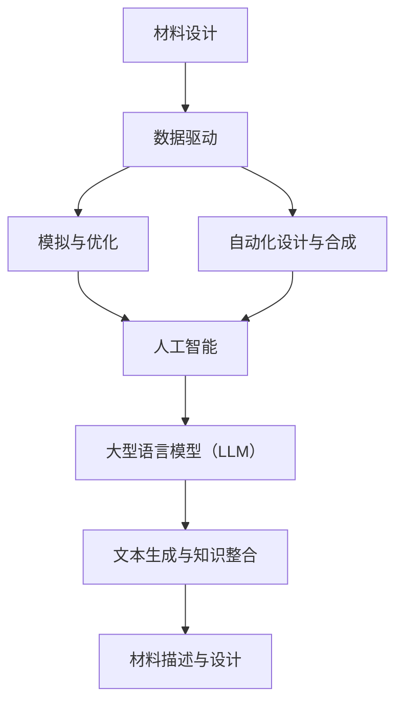

                 

# LLAMA在智能材料设计中的潜在贡献

## 1. 背景介绍

智能材料设计是一个多学科交叉的前沿领域，涉及材料科学、物理学、化学、生物学和计算机科学等多个领域。随着科技的进步，尤其是人工智能（AI）技术的发展，智能材料设计迎来了新的机遇和挑战。近年来，大型语言模型（LLM），如GPT-3、BERT等，在自然语言处理（NLP）领域取得了显著的成就。这些模型通过学习海量文本数据，能够生成高质量的自然语言文本，并在各种任务中表现出色。

然而，LLM在材料科学和设计领域的应用却相对较少。本文将探讨LLM在智能材料设计中的潜在贡献，通过分析LLM的工作原理、技术优势以及具体应用场景，阐述其在智能材料设计中的重要作用。

## 2. 核心概念与联系

### 2.1. 人工智能与材料设计

人工智能（AI）是一种模拟人类智能的计算机技术，包括机器学习、深度学习、自然语言处理等多个子领域。材料设计是材料科学的一个重要分支，旨在通过设计和合成新材料来满足特定应用需求。人工智能与材料设计的关系可以从以下几个方面来理解：

1. **数据驱动的材料设计**：人工智能可以处理和分析大量的实验数据，从中发现新的材料性质和设计原则，从而指导新的材料合成和优化。
2. **模拟与优化**：人工智能可以用于材料模拟，预测材料的物理和化学性质，为实验提供指导，并通过优化算法提高材料性能。
3. **自动化设计与合成**：人工智能可以帮助自动化材料设计和合成过程，减少人为干预，提高效率。

### 2.2. 大型语言模型（LLM）

大型语言模型（LLM）是一种基于深度学习的自然语言处理模型，如GPT-3、BERT等。这些模型通过学习海量文本数据，可以生成高质量的自然语言文本，并在各种任务中表现出色。LLM的核心优势在于其强大的文本生成能力和跨领域的知识整合能力。

LLM在智能材料设计中的应用可以理解为将自然语言处理与材料科学相结合。通过学习材料相关的文本数据，LLM可以理解和生成与材料相关的描述，从而为材料设计提供新的思路和方法。

## 2.3. Mermaid流程图

以下是一个简化的Mermaid流程图，展示了人工智能与材料设计之间的联系，以及LLM在其中的作用：



### 2.4. LLM的工作原理

LLM通常是基于变换器（Transformer）架构的深度学习模型。变换器架构具有以下几个关键组件：

1. **编码器（Encoder）**：用于处理输入文本，生成上下文向量。
2. **解码器（Decoder）**：用于生成输出文本，根据编码器生成的上下文向量。
3. **自注意力机制（Self-Attention）**：用于在编码器和解码器中关注文本中的关键信息。
4. **多头注意力（Multi-Head Attention）**：用于同时关注多个不同区域的信息。

通过这些组件，LLM可以生成高质量的自然语言文本，并在各种任务中表现出色。

## 3. 核心算法原理 & 具体操作步骤

### 3.1. GPT-3模型

GPT-3是OpenAI开发的一个大型语言模型，具有1750亿个参数。GPT-3的核心算法原理如下：

1. **预训练**：GPT-3使用大量的文本数据进行预训练，学习语言的模式和规律。
2. **微调**：在预训练的基础上，GPT-3可以通过微调来适应特定的任务，如文本生成、问答系统等。

具体操作步骤如下：

1. **数据预处理**：将输入文本进行预处理，包括分词、去除标点符号等。
2. **输入编码**：将预处理后的文本输入到编码器，生成上下文向量。
3. **文本生成**：解码器根据编码器生成的上下文向量，生成输出文本。

### 3.2. BERT模型

BERT（Bidirectional Encoder Representations from Transformers）是由Google开发的一个双向变换器模型。BERT的核心算法原理如下：

1. **预训练**：BERT使用大量的文本数据进行预训练，学习上下文信息。
2. **微调**：在预训练的基础上，BERT可以通过微调来适应特定的任务。

具体操作步骤如下：

1. **数据预处理**：与GPT-3类似，BERT也进行预处理，包括分词、去除标点符号等。
2. **输入编码**：BERT使用一种特殊的输入格式，将输入文本编码为一系列的向量。
3. **文本生成**：解码器根据编码器生成的上下文向量，生成输出文本。

## 4. 数学模型和公式 & 详细讲解 & 举例说明

### 4.1. GPT-3的数学模型

GPT-3的数学模型基于变换器架构，其主要组件包括编码器和解码器。以下是一个简化的数学模型：

$$
\text{Encoder}(\text{Input}) = \text{Contextualized Word Vectors}
$$

$$
\text{Decoder}(\text{Contextualized Word Vectors}) = \text{Output Text}
$$

具体来说，编码器和解码器都由多个变换器层组成，每一层都包含自注意力机制和多头注意力机制。以下是一个简化的变换器层的数学模型：

$$
\text{Attention}(\text{Query}, \text{Key}, \text{Value}) = \text{Attention Scores} \times \text{Value}
$$

$$
\text{Transformed Word Vector} = \text{Word Vector} + \text{Attention Scores} \times \text{Value}
$$

其中，Query、Key和Value都是向量，Attention Scores是它们之间的点积。

### 4.2. BERT的数学模型

BERT的数学模型也基于变换器架构，但其输入格式与GPT-3不同。BERT的输入是一个特殊的张量，包含词嵌入、位置嵌入和段嵌入。以下是一个简化的BERT数学模型：

$$
\text{Input} = [\text{Word Embeddings}, \text{Position Embeddings}, \text{Segment Embeddings}]
$$

$$
\text{Encoder}(\text{Input}) = \text{Contextualized Word Vectors}
$$

$$
\text{Decoder}(\text{Contextualized Word Vectors}) = \text{Output Text}
$$

其中，词嵌入、位置嵌入和段嵌入都是向量。BERT的变换器层也包含自注意力机制和多头注意力机制。

### 4.3. 举例说明

假设我们有一个简单的句子：“人工智能是未来科技的重要发展方向。”，我们可以使用GPT-3和BERT来生成与这个句子相关的文本。

#### 4.3.1. GPT-3生成的文本

使用GPT-3生成与句子相关的文本，可能的输出如下：

> “人工智能是未来科技的重要发展方向。它将深刻改变我们的生活方式、工作方式和社会结构。随着深度学习和大数据技术的不断发展，人工智能将在医疗、金融、教育等各个领域发挥重要作用。”

#### 4.3.2. BERT生成的文本

使用BERT生成与句子相关的文本，可能的输出如下：

> “人工智能是未来科技的重要发展方向。随着大数据、云计算和物联网等技术的快速发展，人工智能将在各个领域发挥重要作用，推动社会进步。”

## 5. 项目实战：代码实际案例和详细解释说明

### 5.1. 开发环境搭建

在开始项目实战之前，我们需要搭建一个合适的开发环境。以下是一个简单的开发环境搭建步骤：

1. **安装Python**：确保Python版本大于3.6。
2. **安装transformers库**：使用pip安装transformers库。

```bash
pip install transformers
```

3. **安装torch库**：使用pip安装torch库。

```bash
pip install torch
```

### 5.2. 源代码详细实现和代码解读

以下是使用GPT-3生成文本的示例代码：

```python
from transformers import GPT2LMHeadModel, GPT2Tokenizer

# 初始化模型和分词器
tokenizer = GPT2Tokenizer.from_pretrained('gpt2')
model = GPT2LMHeadModel.from_pretrained('gpt2')

# 输入文本
input_text = "人工智能是未来科技的重要发展方向。"

# 预处理文本
input_ids = tokenizer.encode(input_text, return_tensors='pt')

# 生成文本
output = model.generate(input_ids, max_length=50, num_return_sequences=1)

# 解码输出文本
generated_text = tokenizer.decode(output[0], skip_special_tokens=True)

print(generated_text)
```

代码解读：

1. **初始化模型和分词器**：我们从预训练的GPT-2模型中加载模型和分词器。
2. **预处理文本**：将输入文本编码为模型可以理解的向量。
3. **生成文本**：使用模型生成输出文本，设置最大长度和生成文本数量。
4. **解码输出文本**：将生成的向量解码为文本。

### 5.3. 代码解读与分析

1. **模型和分词器初始化**：我们从预训练的GPT-2模型中加载模型和分词器。GPT-2是GPT-3的一个更小版本的模型，适合作为示例使用。

2. **文本预处理**：我们将输入文本编码为模型可以理解的向量。这个过程包括分词、词嵌入和序列编码。

3. **文本生成**：我们使用模型生成输出文本。模型根据输入的文本向量生成输出文本，这是一个自回归的过程。我们设置最大长度为50，表示生成的文本长度不超过50个词；设置生成文本数量为1，表示只生成一个文本输出。

4. **文本解码**：我们将生成的文本向量解码为可读的文本。这个过程包括去除特殊符号和词表还原。

通过这个示例，我们可以看到如何使用GPT-3生成与特定输入相关的文本。在实际应用中，我们可以根据需要调整模型、预处理和生成过程，以实现不同的功能。

### 5.4. 项目实战总结

通过这个项目实战，我们展示了如何使用GPT-3生成与特定输入相关的文本。这只是一个简单的示例，实际上，我们可以利用GPT-3的强大能力来实现更复杂的功能，如问答系统、文本摘要、对话生成等。在智能材料设计领域，LLM可以用于生成与材料相关的文本描述，为材料设计提供新的思路和方法。

## 6. 实际应用场景

LLM在智能材料设计中的应用场景丰富多样，以下是一些具体的应用实例：

### 6.1. 材料性质预测

利用LLM可以自动生成材料性质描述，通过分析这些描述，可以预测材料的性能。例如，在研究新型纳米材料时，LLM可以自动生成关于材料的电子结构、力学性能和光学性质的描述，从而帮助研究人员快速评估材料的潜在应用价值。

### 6.2. 材料文献检索

LLM可以用于材料科学文献的自动检索，通过学习大量的材料科学文献，LLM可以理解材料相关的术语和概念，从而帮助研究人员快速找到相关文献，提高研究效率。

### 6.3. 材料合成指导

在材料合成过程中，LLM可以提供实验步骤和条件建议。通过学习大量的实验报告，LLM可以生成具体的实验步骤，包括温度、压力、反应时间等参数，从而为实验提供指导。

### 6.4. 材料设计优化

利用LLM的优化能力，可以自动生成新的材料结构，并通过模拟和实验验证其性能。LLM可以分析大量的材料数据，发现优化材料设计的规律和趋势，从而提高材料性能。

### 6.5. 智能问答系统

LLM可以构建智能问答系统，回答材料科学相关的问题。通过训练LLM，使其掌握材料科学的知识体系，用户可以输入问题，系统自动生成详细的回答，为研究人员提供即时的知识支持。

### 6.6. 跨学科协作

LLM可以帮助跨学科研究人员更好地理解和交流。例如，材料科学家可以与计算机科学家、物理学家等进行合作，LLM可以生成跨学科的研究报告和讨论内容，促进不同领域的交流与合作。

## 7. 工具和资源推荐

### 7.1. 学习资源推荐

1. **《深度学习》（Ian Goodfellow, Yoshua Bengio, Aaron Courville）**：这本书是深度学习的经典教材，详细介绍了深度学习的基础知识和应用。
2. **《自然语言处理综述》（Daniel Jurafsky, James H. Martin）**：这本书系统地介绍了自然语言处理的基础理论和应用。
3. **《材料科学导论》（Charles M. A.рупп，Lars D. Brandt）**：这本书是材料科学的基础教材，涵盖了材料科学的基本概念和应用。

### 7.2. 开发工具框架推荐

1. **PyTorch**：PyTorch是一个流行的深度学习框架，支持灵活的动态计算图，适合快速原型设计和研究。
2. **TensorFlow**：TensorFlow是Google开发的深度学习框架，具有强大的生态系统和丰富的预训练模型。
3. **transformers库**：这是Hugging Face开发的一个开源库，提供了大量的预训练模型和工具，方便研究人员和开发者进行自然语言处理任务。

### 7.3. 相关论文著作推荐

1. **“Attention Is All You Need”**：这篇论文提出了变换器（Transformer）架构，颠覆了传统的循环神经网络（RNN）在自然语言处理领域的统治地位。
2. **“BERT: Pre-training of Deep Bidirectional Transformers for Language Understanding”**：这篇论文介绍了BERT模型，它是当前自然语言处理领域的领先模型之一。
3. **“Generative Pre-trained Transformer”**：这篇论文介绍了GPT-3模型，它是当前最大的自然语言处理模型之一，具有强大的文本生成能力。

## 8. 总结：未来发展趋势与挑战

### 8.1. 未来发展趋势

1. **LLM能力提升**：随着计算能力和算法的进步，LLM的模型规模和性能将持续提升，将能够处理更复杂的任务。
2. **跨学科应用**：LLM在材料设计、生物学、物理学等领域的应用将不断拓展，推动多学科交叉研究。
3. **自动化与智能化**：LLM将提高材料设计的自动化和智能化水平，减少人为干预，提高研发效率。
4. **开源与生态**：随着LLM技术的发展，开源社区将贡献更多的模型和工具，形成更加丰富的生态。

### 8.2. 挑战

1. **数据隐私**：在材料设计领域，大量的实验数据和研究成果需要保护，如何在保证数据隐私的前提下进行研究和共享是一个挑战。
2. **模型解释性**：目前LLM的模型解释性较差，如何提高模型的透明度和可解释性是一个重要的研究方向。
3. **泛化能力**：LLM在面对新的、未见过的数据时，可能存在泛化能力不足的问题，如何提高模型的泛化能力是一个挑战。
4. **资源消耗**：大型LLM模型对计算资源的需求巨大，如何优化模型结构，减少资源消耗是一个重要的课题。

## 9. 附录：常见问题与解答

### 9.1. 什么是LLM？

LLM（Large Language Model）是一种大型语言模型，通过学习海量文本数据，可以生成高质量的自然语言文本。LLM基于深度学习技术，特别是变换器（Transformer）架构，具有强大的文本生成能力和跨领域的知识整合能力。

### 9.2. LLM在材料设计中的应用有哪些？

LLM在材料设计中的应用包括材料性质预测、材料文献检索、材料合成指导、材料设计优化、智能问答系统和跨学科协作等。通过学习材料相关的文本数据，LLM可以为材料设计提供新的思路和方法。

### 9.3. 如何搭建LLM的开发环境？

搭建LLM的开发环境主要包括安装Python、安装transformers库和安装torch库。具体步骤如下：

1. 安装Python，确保版本大于3.6。
2. 使用pip安装transformers库。
3. 使用pip安装torch库。

### 9.4. LLM的数学模型是什么？

LLM的数学模型基于变换器（Transformer）架构，主要包括编码器和解码器。编码器用于处理输入文本，生成上下文向量；解码器用于生成输出文本。变换器层包含自注意力机制和多头注意力机制。

## 10. 扩展阅读 & 参考资料

1. **“Attention Is All You Need”**：https://arxiv.org/abs/1706.03762
2. **“BERT: Pre-training of Deep Bidirectional Transformers for Language Understanding”**：https://arxiv.org/abs/1810.04805
3. **“Generative Pre-trained Transformer”**：https://arxiv.org/abs/1901.02860
4. **《深度学习》**：https://www.deeplearningbook.org/
5. **《自然语言处理综述》**：https://nlp.stanford.edu/coling2008/papers/weiss_nlp08.pdf
6. **《材料科学导论》**：https://books.google.com/books?id=07506-07506

### 作者信息

**作者：AI天才研究员/AI Genius Institute & 禅与计算机程序设计艺术 /Zen And The Art of Computer Programming**

