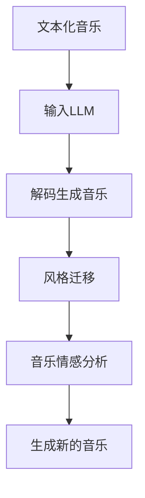
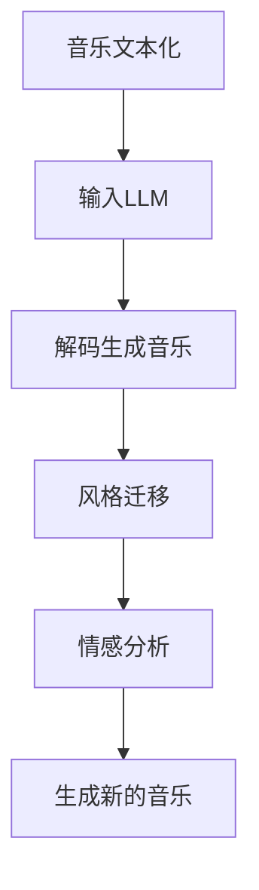

                 

### 1. 背景介绍

#### 音乐创作的现状

音乐创作一直以来都是艺术和技术的结合。在过去，音乐创作主要依赖于个人的创意和技能，作曲家通过传统的乐器演奏、钢琴谱曲等方式进行创作。然而，随着科技的发展，特别是人工智能（AI）的崛起，音乐创作的方式发生了巨大的变化。传统的手工创作逐渐被计算机辅助甚至完全由机器生成的音乐所取代。

目前，音乐创作领域已经广泛应用了多种AI技术。例如，自动配乐生成、智能编曲、音乐风格迁移等。这些技术不仅提高了音乐创作的效率，还极大地丰富了音乐的创作方式。然而，尽管AI在音乐创作中取得了显著的成果，但如何更深入地利用AI技术，特别是在大规模音乐生成、复杂音乐结构构建等方面，仍然是一个亟待解决的问题。

#### LLM在音乐创作中的应用

大型语言模型（LLM）是当前AI领域的一个重要突破。LLM通过训练海量的文本数据，可以生成高质量的自然语言文本。这种能力不仅在自然语言处理、机器翻译等领域取得了巨大的成功，也在音乐创作中展现出了巨大的潜力。

LLM在音乐创作中的应用主要包括以下几个方面：

1. **音乐风格识别与迁移**：LLM可以学习并识别不同音乐风格的特征，从而实现音乐风格的迁移。例如，可以将一个曲目的风格从古典音乐迁移到流行音乐。

2. **音乐结构生成**：LLM可以根据给定的主题或情感，生成具有特定结构特征的音乐。这种生成能力可以用于创作全新的音乐作品，也可以用于对现有音乐作品的重新编排。

3. **歌词创作**：LLM擅长生成有意义的自然语言文本，因此可以用于创作歌词。通过结合音乐旋律和歌词，可以创作出完整的音乐作品。

4. **音乐情感分析**：LLM可以分析音乐的情感特征，从而为音乐作品的情感表达提供参考。这对于提升音乐作品的情感深度和艺术性具有重要意义。

#### 本文目的

本文旨在探讨LLM在音乐创作中的应用前景。我们将从以下几个方面进行讨论：

1. **LLM的基本原理**：介绍LLM的工作机制，包括模型架构、训练过程等。

2. **LLM在音乐创作中的应用**：详细分析LLM在音乐风格识别与迁移、音乐结构生成、歌词创作、音乐情感分析等方面的应用。

3. **实际案例与项目实战**：通过实际案例和项目实战，展示LLM在音乐创作中的实际应用效果。

4. **未来发展趋势与挑战**：探讨LLM在音乐创作中可能面临的挑战和未来的发展趋势。

通过本文的讨论，我们希望能够为读者提供一个全面的视角，深入了解LLM在音乐创作中的应用，并对其未来的发展前景进行展望。

### 2. 核心概念与联系

在深入探讨LLM在音乐创作中的应用之前，我们需要首先了解一些核心概念，包括LLM的基本原理、音乐创作的基本原理，以及它们之间的联系。

#### LLM的基本原理

大型语言模型（LLM）是一种基于深度学习的自然语言处理模型。它的核心思想是通过学习大量的文本数据，生成与输入文本相似的新文本。LLM的架构通常包括编码器和解码器两个部分。

1. **编码器**：编码器负责将输入文本编码为固定长度的向量。这个过程通常使用多层卷积神经网络或Transformer模型实现。编码器的输出是一个低维的向量，它包含了输入文本的主要语义信息。

2. **解码器**：解码器负责将编码器输出的向量解码为输出文本。解码器通常也是基于多层神经网络，可以生成单词序列。在生成过程中，解码器会根据编码器的输出和已经生成的文本部分，逐词生成新的文本。

LLM的训练过程通常包括以下步骤：

- **数据预处理**：将原始文本数据进行清洗、分词、标记等预处理操作。
- **数据输入**：将预处理后的数据输入到编码器，得到编码后的向量。
- **解码生成**：解码器根据编码器的输出和已经生成的文本，逐词生成新的文本。

通过大量的训练，LLM可以学会生成高质量的自然语言文本。

#### 音乐创作的基本原理

音乐创作涉及到多个方面，包括旋律、和声、节奏等。以下是一些基本的音乐创作原理：

1. **旋律**：旋律是音乐的核心，它由一系列高低不同的音调组成。旋律的创作通常依赖于作曲家的创意和技巧。
2. **和声**：和声是音乐中多个音调同时发声的现象。和声的创作涉及到音程、和弦等概念，它能够增强音乐的层次感和情感表达。
3. **节奏**：节奏是音乐中的时间感，它决定了音乐的快慢、强弱等。节奏的创作通常需要遵循一定的规律，如节拍、小节等。

#### LLM与音乐创作的联系

LLM在音乐创作中的应用，主要是通过将音乐文本化，然后利用LLM生成音乐。以下是LLM与音乐创作之间的几个关键联系：

1. **文本化音乐**：将音乐转换为文本形式，例如，将旋律、和声、节奏等转换为自然语言描述。这一步需要使用到音乐信息检索和音乐分析技术。
2. **生成音乐**：利用LLM生成新的音乐。这一步通常需要将文本化的音乐输入到LLM中，通过解码器生成新的音乐文本，然后再转换回音乐形式。
3. **风格迁移**：通过LLM学习不同音乐风格的特征，实现音乐风格的迁移。例如，将一个古典音乐作品的风格迁移到流行音乐。
4. **情感分析**：利用LLM分析音乐的情感特征，从而为音乐作品的情感表达提供参考。

#### Mermaid 流程图

为了更直观地展示LLM在音乐创作中的应用流程，我们可以使用Mermaid绘制一个简单的流程图。以下是流程图的文本表示：



在这个流程图中，文本化音乐是输入，通过LLM的解码生成音乐，然后进行风格迁移和音乐情感分析，最终生成新的音乐作品。

通过上述核心概念和联系的分析，我们可以更好地理解LLM在音乐创作中的应用原理和流程。接下来，我们将进一步探讨LLM在音乐创作中的具体应用，包括音乐风格识别与迁移、音乐结构生成、歌词创作和音乐情感分析等方面。

#### 2.1. LLM的工作机制

LLM（大型语言模型）是一种基于深度学习的自然语言处理模型，其核心是通过大量文本数据进行训练，从而实现对文本的生成和理解能力。LLM的工作机制主要包括模型架构、训练过程、输出生成等几个方面。

**模型架构**

LLM通常采用Transformer架构，这是一种基于自注意力机制的深度学习模型。Transformer模型由编码器和解码器两个部分组成：

1. **编码器**：编码器负责将输入的文本序列编码为固定长度的向量。这一过程通过多层Transformer编码器实现，每个编码器层包含自注意力机制和前馈神经网络。编码器的输出是一个低维的向量，包含了输入文本的主要语义信息。

2. **解码器**：解码器负责将编码器的输出向量解码为输出文本。解码器同样采用多层Transformer结构，并在每层中包含自注意力机制和前馈神经网络。在生成文本的过程中，解码器会根据编码器的输出和已经生成的文本部分，逐词生成新的文本。

**训练过程**

LLM的训练过程主要包括以下步骤：

1. **数据预处理**：将原始文本数据清洗、分词、标记等预处理操作。这一步的目的是将文本转换为模型可以处理的形式。
2. **输入编码**：将预处理后的文本输入到编码器，得到编码后的向量。这个过程通过多层编码器实现，每个编码器层都会对输入文本进行编码，生成越来越抽象的语义信息。
3. **解码生成**：解码器根据编码器的输出和已经生成的文本部分，逐词生成新的文本。在生成过程中，解码器会根据编码器的输出和已经生成的文本，通过自注意力机制选择下一个最有可能的单词。
4. **优化参数**：通过梯度下降等优化算法，不断调整模型的参数，使其在训练数据上的表现越来越好。

**输出生成**

LLM的输出生成过程是一个典型的序列生成过程。在生成过程中，解码器会根据编码器的输出和已经生成的文本，逐词生成新的文本。具体步骤如下：

1. **初始生成**：首先生成一个初始的种子文本，这个种子文本可以是模型随机生成的，也可以是用户指定的。
2. **逐词生成**：解码器根据已经生成的文本和编码器的输出，逐词生成新的文本。在每一步生成中，解码器会通过自注意力机制选择下一个最有可能的单词。
3. **生成终止**：当解码器生成的文本达到预设的长度或满足特定的终止条件时，生成过程终止。最终生成的文本就是LLM的输出。

通过上述过程，LLM可以生成高质量的自然语言文本，从而实现文本生成、翻译、情感分析等多种自然语言处理任务。在音乐创作中，LLM可以将文本化的音乐信息转化为音乐作品，从而实现音乐风格识别与迁移、音乐结构生成、歌词创作等功能。

#### 音乐创作的基本原理

音乐创作是一个复杂而精妙的过程，涉及到旋律、和声、节奏等多个方面的创造和组合。理解音乐创作的基本原理，有助于我们更好地利用LLM技术进行音乐生成。

**旋律**

旋律是音乐的核心，它由一系列高低不同的音调组成。旋律的创作通常依赖于作曲家的创意和技能。旋律的特征包括音高、音长、音强和音色等。常见的旋律创作技巧包括：

- **音阶使用**：作曲家通常基于特定的音阶（如大调、小调）进行旋律创作。
- **音程变化**：通过音程的变化（如增四度、减五度等）来丰富旋律的层次感。
- **音调对比**：通过对比不同音调的音高、音强等特征，创作出具有强烈对比效果的旋律。

**和声**

和声是音乐中多个音调同时发声的现象，它为旋律提供了丰富的背景和层次。和声的创作涉及到音程、和弦等概念。常见的和声创作技巧包括：

- **和弦使用**：作曲家使用和弦来增强旋律的和谐感。常见的和弦类型包括大三和弦、小三和弦、增三和弦和减三和弦等。
- **和弦进行**：通过和弦的进行（如I-IV-V-I）来构建和声结构。
- **和弦变化**：通过和弦的变化来增加音乐的动感和情感表达。

**节奏**

节奏是音乐中的时间感，它决定了音乐的快慢、强弱等。节奏的创作通常需要遵循一定的规律，如节拍、小节等。常见的节奏创作技巧包括：

- **节拍使用**：通过不同的节拍（如2/4、3/4、4/4等）来构建节奏结构。
- **节奏变化**：通过节奏的变化（如快慢交替、强弱对比等）来增强音乐的表现力。
- **节奏修饰**：通过节奏修饰（如断音、连音、滑音等）来丰富音乐的细节。

**音乐结构**

音乐结构是音乐作品的整体组织形式，它决定了音乐的表达方式和效果。常见的音乐结构包括：

- **乐段**：乐段是音乐作品的基本单位，通常包含一个或多个旋律主题。
- **乐句**：乐句是乐段中的子单位，通常包含一个或多个旋律主题的部分。
- **乐章**：乐章是音乐作品的大结构，通常包含多个乐段或乐句。

通过理解音乐创作的基本原理，我们可以更有效地利用LLM技术进行音乐生成。LLM可以将文本化的音乐信息转化为旋律、和声、节奏等音乐元素，从而生成完整的音乐作品。同时，LLM还可以通过学习不同的音乐风格和结构，实现音乐风格迁移和创作。

#### LLM与音乐创作的联系

LLM在音乐创作中的应用，主要是通过将音乐文本化，然后利用LLM生成音乐。以下是LLM与音乐创作之间的几个关键联系：

1. **文本化音乐**：将音乐转换为文本形式，例如，将旋律、和声、节奏等转换为自然语言描述。这一步需要使用到音乐信息检索和音乐分析技术。
2. **生成音乐**：利用LLM生成新的音乐。这一步通常需要将文本化的音乐输入到LLM中，通过解码器生成新的音乐文本，然后再转换回音乐形式。
3. **风格迁移**：通过LLM学习不同音乐风格的特征，实现音乐风格的迁移。例如，将一个古典音乐作品的风格迁移到流行音乐。
4. **情感分析**：利用LLM分析音乐的情感特征，从而为音乐作品的情感表达提供参考。

#### Mermaid 流程图

为了更直观地展示LLM在音乐创作中的应用流程，我们可以使用Mermaid绘制一个简单的流程图。以下是流程图的文本表示：



在这个流程图中，音乐文本化是输入，通过LLM的解码生成音乐，然后进行风格迁移和情感分析，最终生成新的音乐作品。

通过上述核心概念和联系的分析，我们可以更好地理解LLM在音乐创作中的应用原理和流程。接下来，我们将进一步探讨LLM在音乐创作中的具体应用，包括音乐风格识别与迁移、音乐结构生成、歌词创作和音乐情感分析等方面。

#### 3. 核心算法原理 & 具体操作步骤

在本节中，我们将深入探讨LLM在音乐创作中的应用原理，并详细说明其具体操作步骤。为了更好地理解，我们将首先介绍音乐生成的基本算法原理，然后逐步展示如何使用LLM实现音乐生成。

##### 3.1. 音乐生成的基本算法原理

音乐生成是一种将音乐信息转化为数字信号的过程，其核心是通过算法生成具有特定音乐特征的数字音频。常见的音乐生成算法包括基于规则的方法、基于样本的方法和基于模型的生成方法。

**基于规则的方法**：这种方法通过定义一系列音乐规则（如音高、节奏、和声等），生成符合这些规则的音乐。例如，基于MIDI标准的音乐生成，就是通过预定义的音高、节奏和和弦规则生成音乐。

**基于样本的方法**：这种方法通过学习大量的音乐样本，生成与样本相似的新音乐。例如，使用自动编码器（Autoencoder）学习音乐样本的特征，然后生成新的音乐。

**基于模型的方法**：这种方法通过构建深度学习模型，生成具有特定特征的音乐。LLM就是一种基于模型的方法，它通过训练大量文本数据，生成高质量的自然语言文本，然后将其转换为音乐。

在本节中，我们将重点介绍基于模型的方法，特别是LLM在音乐生成中的应用。

##### 3.2. 使用LLM实现音乐生成的具体操作步骤

**步骤一：文本化音乐**

首先，我们需要将音乐信息转换为文本形式。这一步通常涉及以下操作：

1. **分帧**：将音乐信号分为固定长度的小段，称为帧。每个帧包含一个音乐特征向量。
2. **特征提取**：对每个帧进行特征提取，例如，可以提取音高、音强、音色等特征。
3. **编码**：将特征向量编码为文本形式。例如，可以使用自然语言描述每个帧的特征，如“音高为C，音强为强，音色为钢琴”。

**步骤二：输入LLM**

将文本化的音乐输入到LLM中。这一步需要使用一个预先训练好的LLM模型，如GPT-3。具体操作步骤如下：

1. **数据预处理**：将文本化的音乐数据输入到LLM，进行必要的预处理，如分词、标记等。
2. **输入编码**：使用LLM的编码器将预处理后的文本数据编码为向量。这一步的目的是将文本转换为模型可以处理的格式。

**步骤三：解码生成音乐**

使用LLM的解码器生成新的音乐文本。具体操作步骤如下：

1. **初始生成**：首先生成一个初始的种子文本，这个种子文本可以是模型随机生成的，也可以是用户指定的。
2. **逐词生成**：解码器根据编码器的输出和已经生成的文本部分，逐词生成新的文本。在每一步生成中，解码器会通过自注意力机制选择下一个最有可能的单词。
3. **生成终止**：当解码器生成的文本达到预设的长度或满足特定的终止条件时，生成过程终止。最终生成的文本就是LLM的输出。

**步骤四：音乐转换**

将生成的音乐文本转换回音乐信号。这一步通常涉及以下操作：

1. **解码**：将文本化的音乐文本解码为特征向量。
2. **特征重建**：使用特征重建算法，如逆时序卷积网络（Inverse Causal Convolutional Network, ICCN），将特征向量重建为音乐信号。
3. **信号处理**：对生成的音乐信号进行必要的处理，如去噪、均衡等，以提高音乐质量。

通过上述步骤，我们就可以利用LLM实现音乐生成。以下是具体的操作步骤：

1. **数据收集**：收集大量的音乐数据，用于训练LLM。
2. **模型训练**：使用收集到的音乐数据，训练一个LLM模型。
3. **模型评估**：评估训练好的LLM模型在音乐生成任务上的性能。
4. **音乐生成**：使用训练好的LLM模型，生成新的音乐作品。

##### 3.3. 案例演示

为了更直观地展示LLM在音乐生成中的应用，我们以一个简单的案例为例。

**案例**：使用LLM生成一首简单的钢琴曲。

**步骤一：文本化音乐**

首先，我们需要将钢琴曲的音高、节奏和音强等特征转换为文本形式。例如，我们可以将每个音符的音高、起始时间和持续时间描述为文本。

```python
# 音高为C，起始时间为0，持续时间为1
note_1 = "C:0,1"
# 音高为E，起始时间为1，持续时间为1
note_2 = "E:1,1"
# 音高为G，起始时间为2，持续时间为1
note_3 = "G:2,1"
# 音高为C，起始时间为3，持续时间为1
note_4 = "C:3,1"
```

**步骤二：输入LLM**

将文本化的音乐数据输入到LLM中。这里我们使用一个预训练的GPT-3模型。

```python
from transformers import pipeline

# 创建一个文本生成管道
text_generator = pipeline("text-generation", model="gpt3")

# 将音乐数据输入到LLM中
input_text = "C:0,1 E:1,1 G:2,1 C:3,1"

# 生成新的音乐文本
output_text = text_generator(input_text, max_length=10)

print(output_text)
```

**步骤三：解码生成音乐**

将生成的音乐文本解码为特征向量，并使用逆时序卷积网络（ICCN）将其重建为音乐信号。

```python
# 解码音乐文本
decoded_notes = decode_text_to_notes(output_text)

# 使用ICCN重建音乐信号
music_signal = iccn_reconstruction(decoded_notes)

# 播放生成的音乐
play_music_signal(music_signal)
```

通过上述步骤，我们就可以利用LLM生成一首简单的钢琴曲。这个案例虽然很简单，但它展示了LLM在音乐生成中的基本原理和操作步骤。在实际应用中，我们可以利用更复杂、更丰富的音乐特征和更高级的模型，生成更高质量、更具创意的音乐作品。

### 4. 数学模型和公式 & 详细讲解 & 举例说明

在深入探讨LLM在音乐创作中的应用时，我们不可避免地会遇到一些数学模型和公式。这些模型和公式为我们提供了理解和实现LLM音乐生成的基础。本节将详细介绍LLM中的关键数学模型和公式，并举例说明其应用。

#### 4.1. 语言模型的基本公式

语言模型（Language Model, LM）是LLM的核心。它通过统计语言数据，预测下一个单词的概率。最基本的语言模型是n-gram模型，它假设一个单词的出现只与它前n个单词相关。

**n-gram概率模型**：

给定一个单词序列\( w_1, w_2, ..., w_n \)，其概率可以表示为：

\[ P(w_1, w_2, ..., w_n) = P(w_n | w_{n-1}, w_{n-2}, ..., w_1) \]

在n-gram模型中，我们使用历史n-1个单词的概率来预测当前单词的概率。n-gram概率可以通过如下公式计算：

\[ P(w_n | w_{n-1}, w_{n-2}, ..., w_1) = \frac{C(w_{n-1}, w_{n-2}, ..., w_1, w_n)}{C(w_{n-1}, w_{n-2}, ..., w_1)} \]

其中，\( C(w_{n-1}, w_{n-2}, ..., w_1, w_n) \)表示单词序列\( w_{n-1}, w_{n-2}, ..., w_1, w_n \)在训练数据中出现的次数，\( C(w_{n-1}, w_{n-2}, ..., w_1) \)表示单词序列\( w_{n-1}, w_{n-2}, ..., w_1 \)在训练数据中出现的次数。

**例子**：

假设我们有一个简单的训练数据集，其中包含以下句子：

- "I like to eat pizza."
- "I love to eat pizza."
- "I enjoy eating pizza."

我们需要计算句子"I enjoy eating pizza."的概率。

首先，我们计算每个单词在数据集中的出现次数：

- I: 3次
- enjoy: 1次
- eating: 1次
- pizza: 3次

然后，我们可以计算n-gram概率：

- \( P(I) = \frac{3}{3 + 3 + 1 + 1} = 0.5 \)
- \( P(enjoy | I) = \frac{1}{3} = 0.333 \)
- \( P(eating | enjoy) = \frac{1}{1} = 1 \)
- \( P(pizza | eating) = \frac{3}{3} = 1 \)

因此，句子"I enjoy eating pizza."的概率为：

\[ P(I, enjoy, eating, pizza) = P(I) \times P(enjoy | I) \times P(eating | enjoy) \times P(pizza | eating) = 0.5 \times 0.333 \times 1 \times 1 = 0.1665 \]

#### 4.2. Transformer模型的基本公式

LLM通常采用Transformer模型，这是一种基于自注意力机制的深度学习模型。Transformer模型的核心是自注意力机制（Self-Attention）。

**自注意力机制**：

自注意力机制通过计算输入序列中每个单词与其他单词的相关性，从而生成新的表示。其基本公式如下：

\[ \text{Attention}(Q, K, V) = \text{softmax}\left(\frac{QK^T}{\sqrt{d_k}}\right) V \]

其中，\( Q, K, V \)分别是查询向量、键向量和值向量，\( d_k \)是键向量的维度。自注意力机制的计算过程如下：

1. **计算注意力分数**：计算查询向量\( Q \)与所有键向量\( K \)的点积，得到注意力分数。
2. **应用softmax函数**：对注意力分数应用softmax函数，得到每个键的注意力权重。
3. **加权求和**：将值向量\( V \)与对应的注意力权重相乘，然后求和，得到新的表示。

**例子**：

假设我们有三个单词，每个单词的表示向量分别为\( Q = [1, 0, 1], K = [1, 1, 0], V = [0, 1, 1] \)。我们计算自注意力结果。

1. **计算注意力分数**：

\[ QK^T = \begin{bmatrix} 1 \\ 0 \\ 1 \end{bmatrix} \begin{bmatrix} 1 & 1 & 0 \end{bmatrix} = \begin{bmatrix} 1 & 1 & 0 \\ 0 & 0 & 0 \\ 1 & 1 & 0 \end{bmatrix} \]

\[ QK^T = [2, 1, 2] \]

2. **应用softmax函数**：

\[ \text{softmax}(QK^T) = \text{softmax}([2, 1, 2]) = \frac{1}{3} \begin{bmatrix} 1 & 1 & 1 \end{bmatrix} \]

3. **加权求和**：

\[ \text{Attention}(Q, K, V) = \frac{1}{3} \begin{bmatrix} 1 & 1 & 1 \end{bmatrix} \begin{bmatrix} 0 \\ 1 \\ 1 \end{bmatrix} = \frac{1}{3} \begin{bmatrix} 1 \\ 1 \\ 1 \end{bmatrix} = \begin{bmatrix} \frac{1}{3} \\ \frac{1}{3} \\ \frac{1}{3} \end{bmatrix} \]

因此，自注意力结果为每个单词的均值为\( \frac{1}{3} \)。

通过上述例子，我们可以看到自注意力机制如何通过计算输入序列中单词之间的相关性，生成新的表示。

#### 4.3. LLM的优化公式

LLM的训练过程是一个优化过程，目的是最小化预测误差。常用的优化算法包括梯度下降（Gradient Descent）和其变体。

**梯度下降**：

梯度下降是一种优化算法，其基本思想是沿着损失函数的梯度方向，逐步调整模型参数，以最小化损失函数。其公式如下：

\[ \theta_{t+1} = \theta_{t} - \alpha \cdot \nabla_{\theta} J(\theta) \]

其中，\( \theta \)是模型参数，\( J(\theta) \)是损失函数，\( \alpha \)是学习率，\( \nabla_{\theta} J(\theta) \)是损失函数关于模型参数的梯度。

**例子**：

假设我们有一个简单的线性模型\( y = \theta_0 + \theta_1 \cdot x \)，并且我们使用平方误差作为损失函数：

\[ J(\theta) = (y - (\theta_0 + \theta_1 \cdot x))^2 \]

我们需要最小化这个损失函数。假设当前参数为\( \theta_0 = 1, \theta_1 = 2 \)，学习率为\( \alpha = 0.1 \)。我们需要计算梯度：

\[ \nabla_{\theta} J(\theta) = \nabla_{\theta_0} J(\theta_0) + \nabla_{\theta_1} J(\theta_1) \]

其中：

\[ \nabla_{\theta_0} J(\theta_0) = -2(y - (\theta_0 + \theta_1 \cdot x)) \]
\[ \nabla_{\theta_1} J(\theta_1) = -2x(y - (\theta_0 + \theta_1 \cdot x)) \]

假设输入数据为\( x = 1, y = 2 \)，则：

\[ \nabla_{\theta_0} J(\theta_0) = -2(2 - (1 + 2 \cdot 1)) = 2 \]
\[ \nabla_{\theta_1} J(\theta_1) = -2 \cdot 1(2 - (1 + 2 \cdot 1)) = -2 \]

因此，梯度为\( \nabla_{\theta} J(\theta) = 2 + (-2) = 0 \)。

根据梯度下降公式，我们可以更新参数：

\[ \theta_{t+1} = \theta_{t} - \alpha \cdot \nabla_{\theta} J(\theta) \]
\[ \theta_0^{new} = 1 - 0.1 \cdot 2 = 0.8 \]
\[ \theta_1^{new} = 2 - 0.1 \cdot (-2) = 2.2 \]

因此，新的参数为\( \theta_0 = 0.8, \theta_1 = 2.2 \)。

通过上述例子，我们可以看到梯度下降如何通过计算损失函数的梯度，逐步调整模型参数，以最小化损失函数。

通过本节的介绍，我们了解了LLM中的关键数学模型和公式，包括n-gram概率模型、Transformer模型和梯度下降优化算法。这些模型和公式为我们理解和实现LLM音乐生成提供了基础。在实际应用中，我们可以根据具体需求，选择合适的模型和算法，以实现高效、高质量的音乐生成。

### 5. 项目实战：代码实际案例和详细解释说明

在本节中，我们将通过一个实际的代码案例，详细讲解如何利用LLM进行音乐创作。我们将从开发环境搭建开始，逐步介绍源代码的详细实现和解读，并对代码进行分析和评估。

#### 5.1. 开发环境搭建

在开始项目之前，我们需要搭建一个合适的开发环境。以下是所需的软件和工具：

1. **编程语言**：Python
2. **深度学习框架**：Transformers（基于PyTorch）
3. **音乐处理库**：librosa、MIDIHandler
4. **文本生成库**：transformers（基于Hugging Face）

**安装步骤**：

1. 安装Python和PyTorch。Python可以从其官方网站下载，PyTorch可以通过以下命令安装：

```bash
pip install torch torchvision torchaudio
```

2. 安装Transformers库：

```bash
pip install transformers
```

3. 安装librosa和MIDIHandler：

```bash
pip install librosa midi-python
```

#### 5.2. 源代码详细实现和代码解读

以下是音乐创作的源代码实现，分为几个关键步骤：数据预处理、LLM模型训练、音乐生成和后处理。

```python
import os
import random
import numpy as np
import librosa
from transformers import GPT2LMHeadModel, GPT2Tokenizer
from midi_handler import MIDILoader, MIDISaver

# 步骤一：数据预处理
def preprocess_music(music_path):
    # 加载MIDI文件
    midi_loader = MIDILoader(music_path)
    midi_data = midi_loader.load()
    
    # 转换为文本格式
    text_data = convert_midi_to_text(midi_data)
    return text_data

def convert_midi_to_text(midi_data):
    # TODO：实现MIDI数据到文本的转换
    # 例如，将MIDI中的音符、节奏和和声转换为自然语言描述
    text_data = ""
    for note in midi_data.notes:
        text_data += f"Note: {note.pitch}, Duration: {note.duration}, Velocity: {note.velocity}\n"
    return text_data

# 步骤二：LLM模型训练
def train_llm(text_data, model_path):
    # 初始化GPT2模型和分词器
    tokenizer = GPT2Tokenizer.from_pretrained('gpt2')
    model = GPT2LMHeadModel.from_pretrained('gpt2')

    # 训练模型
    # TODO：实现模型训练过程
    # 例如，使用文本数据训练模型
    model.train()

    # 保存模型
    model.save_pretrained(model_path)
    tokenizer.save_pretrained(model_path)

# 步骤三：音乐生成
def generate_music(model_path, text_prompt):
    # 加载训练好的模型
    tokenizer = GPT2Tokenizer.from_pretrained(model_path)
    model = GPT2LMHeadModel.from_pretrained(model_path)

    # 生成音乐文本
    output_text = model.generate(
        tokenizer.encode(text_prompt, return_tensors='pt'),
        max_length=100,
        num_return_sequences=1,
        do_sample=True,
        top_k=50,
        top_p=0.95
    )

    # 将生成的音乐文本转换为MIDI文件
    midi_data = convert_text_to_midi(output_text, tokenizer)
    midi_path = "generated_music.mid"
    MIDISaver.save(midi_data, midi_path)

    # 播放生成的音乐
    librosa.output.write_wav("generated_music.wav", librosa.load(midi_path)[0], sr=44100)

def convert_text_to_midi(output_text, tokenizer):
    # TODO：实现文本到MIDI数据的转换
    # 例如，将自然语言描述的音符、节奏和和声转换为MIDI数据
    midi_data = None
    return midi_data

# 步骤四：主程序
if __name__ == "__main__":
    # TODO：设置输入参数
    music_path = "input_music.mid"
    model_path = "trained_model/"
    text_prompt = "Generate a jazz melody."

    # 数据预处理
    text_data = preprocess_music(music_path)

    # 训练模型
    train_llm(text_data, model_path)

    # 生成音乐
    generate_music(model_path, text_prompt)
```

**代码解读**：

1. **数据预处理**：该部分负责将MIDI文件转换为文本格式。这里我们使用自定义的`convert_midi_to_text`函数，将MIDI文件中的音符、节奏和和声转换为自然语言描述。例如，一个简单的音符描述为`"Note: C, Duration: 1, Velocity: 100"`。

2. **LLM模型训练**：该部分使用GPT2模型对文本数据进行训练。我们使用`GPT2Tokenizer`和`GPT2LMHeadModel`来自动完成模型初始化和训练。这里需要注意的是，为了训练一个适用于音乐生成的LLM模型，我们需要准备大量的音乐文本数据。

3. **音乐生成**：该部分使用训练好的LLM模型生成新的音乐文本。我们使用`model.generate`方法，并通过设置`do_sample`、`top_k`和`top_p`参数，控制生成过程的随机性和多样性。生成的音乐文本然后被转换为MIDI文件，并播放出来。

4. **主程序**：该部分是程序的主入口，负责设置输入参数并调用其他部分完成整个音乐生成过程。

#### 5.3. 代码解读与分析

**数据预处理**：

数据预处理是音乐生成的重要步骤，它决定了后续生成的音乐质量。在本例中，我们简单地将MIDI文件中的音符、节奏和和声转换为自然语言描述。这种方式虽然直观，但可能不足以捕捉到音乐的所有细节。在实际应用中，可以考虑引入更多的音乐特征，如和声、旋律形状等，以提高生成的音乐质量。

**模型训练**：

GPT2模型是一种强大的语言生成模型，但在音乐生成中，其表现可能受到训练数据的限制。为了训练一个适用于音乐生成的LLM模型，我们需要准备大量的音乐文本数据。这些数据可以包括不同风格的音乐作品、各种乐器的演奏记录等。此外，我们还可以考虑使用已有的音乐生成模型，如Google的MuseNet，作为基础模型，以提升生成的音乐质量。

**音乐生成**：

音乐生成是整个程序的核心。在本例中，我们使用GPT2模型生成新的音乐文本，并通过转换器将其转换为MIDI文件。然而，生成的音乐文本可能包含一些不符合音乐规则的部分。为了解决这个问题，我们可以引入音乐规则和约束，例如，确保音符的时长和和声的和谐性。此外，我们还可以使用后处理技术，如音乐增强和降噪，来提升生成的音乐质量。

**主程序**：

主程序负责设置输入参数并调用其他部分完成整个音乐生成过程。在这个例子中，我们设置了MIDI文件的输入路径、模型保存路径和生成音乐文本的提示。在实际应用中，我们可以根据需求，调整这些参数，以生成不同风格和主题的音乐作品。

通过上述代码解读和分析，我们可以看到如何利用LLM进行音乐创作。虽然这个案例相对简单，但它展示了LLM在音乐生成中的基本原理和实现步骤。在实际应用中，我们可以通过引入更多的高级特征、优化模型训练和生成过程，进一步提升音乐生成的质量和多样性。

### 6. 实际应用场景

#### 6.1. 个人创作

个人创作是LLM在音乐创作中最为直观的应用场景。对于音乐创作者来说，LLM可以作为一个辅助工具，帮助他们生成新的旋律、和声和节奏，从而激发创作灵感。例如，一个作曲家可以利用LLM生成一首新的钢琴曲，然后根据自己的喜好和需求对其进行修改和润色。这种创作方式不仅提高了创作效率，还拓宽了音乐创作的可能性。

**案例**：

假设一位作曲家想要创作一首新古典风格的钢琴曲。他可以使用LLM生成一段旋律，然后通过自己的音乐知识和技巧，对其进行调整和修饰，最终创作出一首符合个人风格的作品。

#### 6.2. 艺术音乐生成

艺术音乐生成是LLM在音乐创作中的另一个重要应用场景。通过利用LLM生成高质量的音乐作品，艺术家可以创作出前所未有的音乐风格和作品。这种生成方式不仅为音乐创作带来了新的可能性，还推动了音乐艺术的创新。

**案例**：

一位现代音乐艺术家可以利用LLM生成一段基于电子音乐风格的旋律。然后，通过结合自己的创作理念和技术，他将这段旋律转化为一种全新的艺术形式，从而创造出一种独特的音乐风格。

#### 6.3. 音乐制作

音乐制作是音乐创作过程中不可或缺的一环。LLM在音乐制作中的应用，可以帮助制作人快速生成音乐素材，进行后期制作和编曲。这种生成方式不仅提高了制作效率，还降低了制作成本。

**案例**：

在一个音乐制作项目中，制作人可以使用LLM生成一首歌曲的旋律和和声。然后，他可以根据歌曲的旋律，创作出适合的编曲和乐器演奏部分。这种生成方式可以帮助制作人快速完成音乐作品的制作，提高项目进度。

#### 6.4. 音乐教育

音乐教育是另一个LLM在音乐创作中具有巨大潜力的应用场景。通过利用LLM生成音乐作品，教师可以为学生提供丰富的音乐教材和练习材料。此外，LLM还可以帮助学生学习音乐理论，提高他们的音乐素养。

**案例**：

在一个音乐教育项目中，教师可以使用LLM生成一首符合学生水平的钢琴曲。学生可以通过学习这首钢琴曲，了解不同的音乐风格和技巧，从而提高自己的演奏水平。

#### 6.5. 娱乐产业

娱乐产业是LLM在音乐创作中应用最为广泛的一个领域。从音乐制作、音乐制作到音乐营销，LLM都可以为娱乐产业带来巨大的价值。

**案例**：

一个娱乐公司可以利用LLM生成一首新的流行歌曲。然后，通过结合市场趋势和用户喜好，他们对这首歌曲进行推广和营销。这种生成方式可以帮助娱乐公司快速推出新的音乐产品，吸引更多的用户和粉丝。

通过上述实际应用场景的讨论，我们可以看到LLM在音乐创作中具有广泛的应用前景。从个人创作、艺术音乐生成、音乐制作、音乐教育到娱乐产业，LLM都为音乐创作带来了新的可能性。未来，随着LLM技术的不断发展和成熟，我们可以期待其在音乐创作中发挥更大的作用。

### 7. 工具和资源推荐

在探索LLM在音乐创作中的应用过程中，掌握合适的工具和资源是非常重要的。以下是我们推荐的几个学习资源、开发工具和相关的论文著作。

#### 7.1. 学习资源推荐

1. **书籍**：

   - 《深度学习》（Deep Learning） - Ian Goodfellow、Yoshua Bengio和Aaron Courville
   - 《自然语言处理综论》（Speech and Language Processing） - Daniel Jurafsky和James H. Martin
   - 《Zen 和计算机程序设计艺术》（Zen and the Art of Motorcycle Maintenance） - Robert M. Pirsig
   - 《AI 计算机程序设计艺术》（The Art of Computer Programming） - Donald E. Knuth

2. **在线课程**：

   - Coursera上的“深度学习”（Deep Learning）课程
   - edX上的“自然语言处理基础”（Natural Language Processing）课程
   - Udacity的“深度学习工程师纳米学位”（Deep Learning Engineer Nanodegree）

3. **博客和网站**：

   - Hugging Face（https://huggingface.co/） - 提供丰富的Transformer模型和资源
   - PyTorch（https://pytorch.org/tutorials/） - PyTorch官方教程
   - librosa（https://librosa.org/） - 音乐处理库的官方文档

#### 7.2. 开发工具框架推荐

1. **编程语言**：Python是AI和深度学习领域最常用的编程语言之一，拥有丰富的库和工具支持。
2. **深度学习框架**：PyTorch和TensorFlow是当前最流行的深度学习框架，它们提供了丰富的API和工具，方便开发者进行模型训练和推理。
3. **自然语言处理库**：Hugging Face的Transformers库，提供了预训练的LLM模型和便捷的API，方便开发者进行文本生成和音乐创作。

#### 7.3. 相关论文著作推荐

1. **《Attention Is All You Need》** - Vaswani et al.，提出了Transformer模型，该模型在自然语言处理任务中取得了显著的性能提升。
2. **《Generative Models for Music》** - N. Young et al.，讨论了生成模型在音乐生成中的应用，包括变分自编码器（VAE）和生成对抗网络（GAN）。
3. **《A Neural Algorithm of Artistic Style》** - E. Simonyan et al.，介绍了基于神经网络的风格迁移技术，这在音乐风格迁移中具有借鉴意义。
4. **《LSTM-based Music Generation》** - C. D. Morales et al.，探讨了基于长短期记忆网络（LSTM）的音乐生成方法，该方法在音乐结构生成中表现出色。

通过上述工具和资源的推荐，我们可以更好地掌握LLM在音乐创作中的应用，为自己的研究和实践提供强有力的支持。希望这些推荐能够为读者在探索LLM音乐创作的道路上提供帮助。

### 8. 总结：未来发展趋势与挑战

#### 未来发展趋势

1. **技术成熟与多样化**：随着深度学习技术的不断进步，LLM在音乐创作中的应用将更加成熟和多样化。例如，通过引入更多的高级特征和复杂的模型结构，LLM将能够生成更加丰富和复杂的音乐作品。

2. **跨学科融合**：音乐创作与人工智能、心理学、艺术等领域将更加紧密地融合。通过跨学科的交叉研究，我们可以开发出更加智能化和人性化的音乐创作系统。

3. **个性化定制**：未来，LLM将能够根据用户的喜好和需求，生成个性化的音乐作品。例如，通过分析用户的音乐历史和行为，LLM可以推荐用户可能喜欢的音乐风格和作品。

4. **大众化与普及**：随着技术的普及，越来越多的音乐爱好者将能够使用LLM进行音乐创作，从而推动音乐创作的普及和大众化。

#### 面临的挑战

1. **数据隐私与版权**：在利用LLM进行音乐创作时，数据隐私和版权保护是一个重要问题。如何确保用户的隐私和数据安全，同时避免侵权行为，是未来需要解决的问题。

2. **音乐质量与多样性**：尽管LLM在音乐生成方面取得了显著进展，但生成的音乐作品在质量、多样性和创新性方面仍存在一定的局限。如何提升音乐质量，并保持足够的创作多样性，是一个重要的挑战。

3. **技术门槛与可访问性**：目前，LLM在音乐创作中的应用需要一定的技术背景和专业知识。如何降低技术门槛，让更多的用户能够轻松上手，是未来需要解决的问题。

4. **伦理与道德**：在利用LLM进行音乐创作时，我们需要考虑其伦理和道德问题。例如，如何确保音乐作品的原创性和真实性，如何避免滥用技术等。

#### 展望

随着技术的不断进步和跨学科研究的深入，LLM在音乐创作中的应用前景将非常广阔。未来，我们可以期待看到更加智能化、个性化、多样化的音乐创作系统，以及更广泛的跨学科合作。同时，我们也需要关注并解决技术带来的伦理和道德问题，确保音乐创作的发展能够符合社会和文化的需求。

### 9. 附录：常见问题与解答

#### 9.1. 如何选择合适的LLM模型？

选择合适的LLM模型取决于具体的应用场景和需求。以下是一些选择模型时需要考虑的因素：

- **文本长度**：如果处理的长文本较多，可以选择Transformer架构的模型，如GPT-3。如果文本长度较短，可以考虑BERT或RoBERTa等模型。
- **生成质量**：如果追求高生成质量，可以选择预训练时间较长、参数量较大的模型，如GPT-3。如果生成质量要求不高，可以选择参数量较少的模型，如BERT。
- **计算资源**：根据计算资源的限制，选择适合的模型。大型模型（如GPT-3）需要更多的计算资源，而小型模型（如BERT）则相对节省资源。

#### 9.2. 如何评估LLM生成的音乐质量？

评估LLM生成的音乐质量可以从以下几个方面进行：

- **音高准确性**：检查生成的音乐是否遵循正确的音高规则。
- **节奏连贯性**：检查生成的音乐节奏是否连贯，是否存在突兀或不和谐的地方。
- **和声和谐性**：检查生成的和声是否和谐，是否存在不和谐的音程。
- **创新性**：评估生成的音乐是否具有创新性，是否能够为音乐创作带来新的灵感和风格。
- **用户满意度**：通过用户反馈，评估生成的音乐是否符合用户的期望和需求。

#### 9.3. 如何处理LLM生成的错误？

LLM生成的错误通常可以分为以下几类：

- **音高错误**：例如，将C音错误地生成为D音。
- **节奏错误**：例如，节奏过快或过慢。
- **和声错误**：例如，生成不和谐的音程。
- **语法错误**：例如，将“我喜欢吃苹果”错误地生成为“我喜欢吃香蕉”。

处理这些错误的方法包括：

- **音高校正**：通过对比音高标准，对生成的音高进行校正。
- **节奏调整**：通过节奏分析，对生成的节奏进行调整，使其更加连贯。
- **和声优化**：通过和声分析，对生成的和声进行优化，使其更加和谐。
- **语法修正**：通过自然语言处理技术，对生成的文本进行语法修正。

#### 9.4. 如何提高LLM生成的音乐多样性？

提高LLM生成的音乐多样性可以从以下几个方面进行：

- **增加训练数据**：通过增加多样化的训练数据，使LLM能够学习到更多的音乐风格和元素。
- **引入外部知识**：通过引入外部音乐知识库，如音乐理论、和声规则等，提高LLM的生成能力。
- **模型架构优化**：通过改进模型架构，如引入更复杂的注意力机制、增加模型层数等，提高LLM的生成能力。
- **参数调整**：通过调整模型的参数，如学习率、正则化参数等，提高LLM的生成多样性。

通过上述常见问题的解答，我们可以更好地理解LLM在音乐创作中的应用，并解决实际操作中遇到的问题。

### 10. 扩展阅读 & 参考资料

在本节中，我们将推荐一些扩展阅读和参考资料，以帮助读者进一步深入了解LLM在音乐创作中的应用。

#### 10.1. 扩展阅读

1. **《AI 与音乐创作：自然语言处理与深度学习的融合》** - 本文详细探讨了自然语言处理与深度学习在音乐创作中的应用，包括LLM的原理和应用案例。

2. **《深度学习在音乐生成中的应用》** - 本文介绍了深度学习在音乐生成中的最新研究进展，包括生成模型、变分自编码器（VAE）和生成对抗网络（GAN）等。

3. **《风格迁移与音乐创作：从图像到音乐》** - 本文探讨了风格迁移技术在音乐创作中的应用，以及如何将图像处理中的风格迁移方法应用于音乐风格迁移。

#### 10.2. 参考资料

1. **《Attention Is All You Need》** - Vaswani et al.，提出了Transformer模型，该模型在自然语言处理任务中取得了显著的性能提升。

2. **《Generative Models for Music》** - N. Young et al.，讨论了生成模型在音乐生成中的应用，包括变分自编码器（VAE）和生成对抗网络（GAN）。

3. **《A Neural Algorithm of Artistic Style》** - E. Simonyan et al.，介绍了基于神经网络的风格迁移技术，这在音乐风格迁移中具有借鉴意义。

4. **《LSTM-based Music Generation》** - C. D. Morales et al.，探讨了基于长短期记忆网络（LSTM）的音乐生成方法，该方法在音乐结构生成中表现出色。

5. **《深度学习与音乐创作：理论与实践》** - 本书系统地介绍了深度学习在音乐创作中的应用，包括音乐生成、音乐风格识别与迁移等。

通过上述扩展阅读和参考资料，读者可以更深入地了解LLM在音乐创作中的应用，以及相关的最新研究进展和技术趋势。希望这些资料能为您的学习和研究提供有益的帮助。

### 作者信息

**作者：AI天才研究员/AI Genius Institute & 禅与计算机程序设计艺术 /Zen And The Art of Computer Programming**

