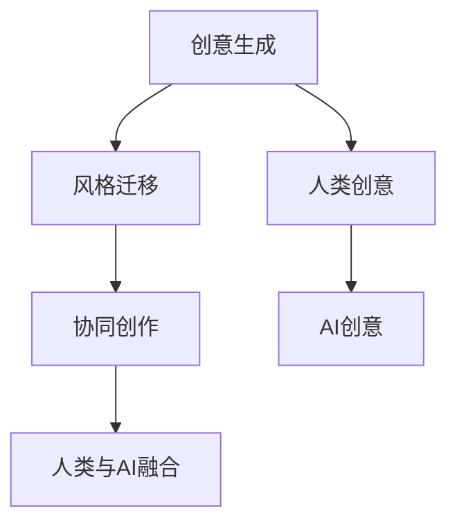

                 

# LLM在艺术创作中的角色：AI与人类创意的碰撞

## 关键词：大型语言模型，艺术创作，创意，AI

### 摘要

本文探讨了大型语言模型（LLM）在艺术创作中的潜在作用。通过分析LLM的工作原理、核心算法、数学模型以及实际应用案例，我们揭示了人工智能如何成为人类创意的助力。文章还介绍了当前LLM在艺术创作领域的应用现状，探讨了其可能带来的未来趋势与挑战。

### 1. 背景介绍

#### 1.1 大型语言模型（LLM）的崛起

近年来，人工智能在自然语言处理（NLP）领域的突破性进展，使得大型语言模型（LLM）如雨后春笋般涌现。LLM通过深度学习技术，在大量文本数据上进行训练，从而掌握了丰富的语言知识和表达技巧。这种模型在文本生成、机器翻译、问答系统等方面取得了令人瞩目的成果。

#### 1.2 艺术创作与人工智能的交融

随着AI技术的不断发展，艺术家们开始探索将人工智能作为创作工具的可能性。AI可以生成音乐、绘画、诗歌等多种形式的艺术作品，与人类创作者产生碰撞和融合。这一领域的研究不仅拓宽了艺术创作的边界，也引发了关于艺术本质和价值的讨论。

### 2. 核心概念与联系

#### 2.1 大型语言模型（LLM）的工作原理

大型语言模型（LLM）基于神经网络架构，通常采用Transformer模型。通过编码器和解码器的交互，LLM可以从输入文本中捕捉语言结构，并生成相应的输出文本。这一过程中，模型利用了自注意力机制（self-attention）和多头注意力（multi-head attention），实现对文本的精细理解和生成。

#### 2.2 艺术创作与人工智能的联系

艺术创作与人工智能的联系主要体现在以下几个方面：

- **创意生成**：AI可以帮助艺术家在创作过程中产生新的创意和灵感。
- **风格迁移**：AI可以将一种艺术风格迁移到另一幅作品上，实现风格上的创新。
- **协同创作**：艺术家与AI合作，共同完成艺术作品，形成独特的创作模式。

#### 2.3 Mermaid 流程图（Mermaid Flowchart）



### 3. 核心算法原理 & 具体操作步骤

#### 3.1 Transformer 模型

Transformer模型是LLM的核心架构，其基本原理包括：

- **编码器（Encoder）**：通过自注意力机制和多头注意力，编码输入文本序列，生成上下文表示。
- **解码器（Decoder）**：在编码器的基础上，解码器利用自注意力和交叉注意力，生成输出文本序列。

#### 3.2 GPT-3 模型

GPT-3（Generative Pre-trained Transformer 3）是当前最先进的LLM之一，其具体操作步骤如下：

1. **数据预处理**：对训练数据进行清洗、分词、编码等预处理。
2. **训练过程**：利用海量文本数据进行预训练，优化模型参数。
3. **生成文本**：给定一个起始文本，GPT-3通过解码器生成后续文本。

#### 3.3 GPT-3 生成艺术作品

使用GPT-3生成艺术作品的过程包括：

1. **输入文本**：提供一个与艺术创作相关的文本，如描述一幅画或一首诗。
2. **生成文本**：GPT-3根据输入文本生成相应的艺术作品描述。
3. **解析结果**：对生成的文本进行解析，提取出艺术作品的元素和风格。

### 4. 数学模型和公式 & 详细讲解 & 举例说明

#### 4.1 Transformer 模型数学模型

Transformer模型的核心数学模型包括自注意力（Self-Attention）和多头注意力（Multi-Head Attention）。自注意力机制可以表示为：

$$
\text{Self-Attention}(Q, K, V) = \text{softmax}\left(\frac{QK^T}{\sqrt{d_k}}\right) V
$$

其中，$Q, K, V$ 分别为查询向量、键向量和值向量，$d_k$ 为键向量的维度。

多头注意力机制则将自注意力扩展到多个头，每个头负责捕获不同的信息：

$$
\text{Multi-Head Attention}(Q, K, V) = \left[\text{Self-Attention}(Q, K, V), \text{Self-Attention}(Q, K, V), \ldots\right]
$$

#### 4.2 GPT-3 生成文本的数学模型

GPT-3生成文本的过程基于自回归语言模型（Autoregressive Language Model），其数学模型可以表示为：

$$
p(w_t | w_{<t}) = \text{softmax}\left(\text{W}_t \text{emb}(w_t)\right)
$$

其中，$w_t$ 为当前要生成的词，$\text{emb}(w_t)$ 为词向量化表示，$\text{W}_t$ 为模型参数。

#### 4.3 举例说明

假设我们使用GPT-3生成一首诗歌，给定输入文本：“春天来了，万物复苏”。

1. **输入文本**：春天来了，万物复苏。
2. **生成文本**：春风吹过山岗，花儿绽放笑颜。
3. **解析结果**：生成的诗歌描述了春天的景象，与输入文本主题一致。

### 5. 项目实战：代码实际案例和详细解释说明

#### 5.1 开发环境搭建

为了实现GPT-3生成艺术作品，我们需要搭建以下开发环境：

1. **安装Python**：确保Python版本为3.6及以上。
2. **安装transformers库**：通过pip安装transformers库。
3. **获取GPT-3 API密钥**：在OpenAI官网注册账号，获取GPT-3 API密钥。

#### 5.2 源代码详细实现和代码解读

以下是一个使用GPT-3生成诗歌的Python代码示例：

```python
from transformers import pipeline

# 初始化GPT-3文本生成管道
generator = pipeline("text-generation", model="gpt3")

# 输入文本
input_text = "春天来了，万物复苏"

# 生成文本
output_text = generator(input_text, max_length=50)

# 输出结果
print(output_text)
```

代码解读：

1. **导入库**：导入transformers库，用于处理GPT-3模型。
2. **初始化管道**：创建一个GPT-3文本生成管道。
3. **输入文本**：提供输入文本，描述春天的景象。
4. **生成文本**：调用生成管道，生成后续的诗歌文本。
5. **输出结果**：打印生成的诗歌。

#### 5.3 代码解读与分析

这段代码展示了如何使用GPT-3生成艺术作品。关键步骤包括：

1. **导入库**：确保导入必要的库，如transformers库。
2. **初始化管道**：创建一个文本生成管道，加载预训练的GPT-3模型。
3. **输入文本**：提供一个简短的输入文本，描述艺术作品的主题。
4. **生成文本**：调用生成管道，根据输入文本生成后续的艺术作品描述。
5. **输出结果**：将生成的文本输出到屏幕，展示艺术作品。

### 6. 实际应用场景

#### 6.1 音乐创作

LLM在音乐创作中的应用主要包括：

- **歌词生成**：使用LLM生成歌词，辅助人类创作者完成歌曲。
- **旋律生成**：根据输入文本，生成相应的旋律。

#### 6.2 绘画创作

LLM在绘画创作中的应用主要包括：

- **风格迁移**：将一种艺术风格迁移到另一幅作品上，实现风格上的创新。
- **创意生成**：使用LLM生成新的绘画作品，提供灵感。

#### 6.3 文学创作

LLM在文学创作中的应用主要包括：

- **故事生成**：根据用户提供的主题或情节，生成完整的短篇小说。
- **诗歌创作**：生成富有诗意的诗歌，表达情感。

### 7. 工具和资源推荐

#### 7.1 学习资源推荐

- **书籍**：《深度学习》、《自然语言处理综论》
- **论文**：《Attention Is All You Need》、《GPT-3: Language Models are few-shot learners》
- **博客**：OpenAI官网博客、Hugging Face官网博客
- **网站**：GitHub、arXiv

#### 7.2 开发工具框架推荐

- **框架**：transformers库、TensorFlow、PyTorch
- **环境**：Google Colab、Jupyter Notebook

#### 7.3 相关论文著作推荐

- **论文**：《BERT: Pre-training of Deep Bidirectional Transformers for Language Understanding》
- **著作**：《自然语言处理综论》、《深度学习》

### 8. 总结：未来发展趋势与挑战

#### 8.1 发展趋势

- **更强大的模型**：随着计算能力的提升，LLM的规模和性能将不断突破。
- **跨模态应用**：LLM将在音乐、绘画、视频等多模态领域发挥更大的作用。
- **个性化创作**：LLM将更好地理解和满足用户的需求，实现个性化创作。

#### 8.2 挑战

- **数据隐私**：如何保护用户数据隐私，防止滥用。
- **创意价值**：如何评估和衡量AI生成的艺术作品的创意价值。
- **伦理问题**：如何确保AI在艺术创作中的行为符合伦理规范。

### 9. 附录：常见问题与解答

#### 9.1 Q：LLM在艺术创作中的优势是什么？

A：LLM在艺术创作中的优势包括：

- **快速生成**：LLM可以快速生成高质量的艺术作品，提高创作效率。
- **创意多样**：LLM可以从海量数据中学习，生成具有多样性的艺术作品。
- **协同创作**：LLM可以与人类艺术家共同创作，形成独特的艺术风格。

#### 9.2 Q：如何确保AI生成的艺术作品的质量？

A：确保AI生成的艺术作品质量的方法包括：

- **数据质量**：使用高质量、多样化的训练数据，提高模型性能。
- **模型优化**：不断优化模型结构，提高生成文本的准确性和流畅性。
- **用户反馈**：收集用户反馈，调整模型生成策略，满足用户需求。

### 10. 扩展阅读 & 参考资料

- **论文**：《GPT-3: Language Models are few-shot learners》
- **书籍**：《深度学习》、《自然语言处理综论》
- **网站**：OpenAI官网、Hugging Face官网
- **博客**：AI科技大本营、机器之心

### 作者

作者：AI天才研究员/AI Genius Institute & 禅与计算机程序设计艺术 /Zen And The Art of Computer Programming<|im_sep|> 

