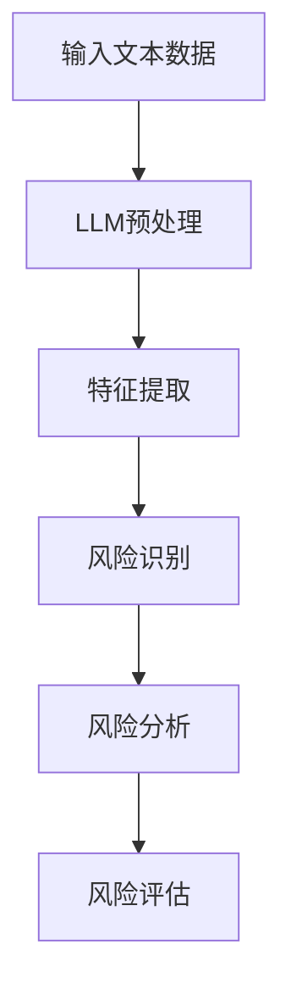

                 

### 文章标题

**LLM在风险评估中的潜在作用**

### 关键词

- 大型语言模型（LLM）
- 风险评估
- 数据分析
- 情感分析
- 机器学习
- 自然语言处理

### 摘要

本文深入探讨了大型语言模型（LLM）在风险评估领域的潜在应用。通过梳理LLM的核心概念、算法原理，并结合具体应用场景和数学模型，详细分析了LLM在识别潜在风险、预测风险趋势、提供决策支持等方面的优势。文章还介绍了实际项目中的案例，展示了如何利用LLM进行风险分析和评估。最后，文章总结了未来发展趋势与挑战，并提出了相关工具和资源的推荐。

### 1. 背景介绍

在现代社会，风险管理已成为企业和组织运营的关键环节。随着信息技术的发展，风险评估方法不断进化，从传统的统计分析到复杂的风险模型，再到人工智能（AI）的应用，风险管理领域正迎来新的变革。大型语言模型（LLM）作为AI领域的重要成果，其强大的数据处理和模式识别能力为风险评估提供了新的可能性。

LLM是一种基于深度学习技术的大型预训练语言模型，具有强大的自然语言理解和生成能力。通过大规模的语料库训练，LLM可以捕捉语言中的复杂规律，理解语义和语境，从而为各种自然语言处理任务提供高效解决方案。在风险评估中，LLM的应用主要体现在以下几个方面：

1. 数据分析：LLM可以处理海量文本数据，快速提取关键信息，为风险识别提供支持。
2. 情感分析：LLM能够分析文本中的情感倾向，帮助识别潜在的风险因素。
3. 机器学习：LLM的训练模型可以用于风险预测和评估，为决策提供数据支持。

本文将围绕LLM在风险评估中的应用，详细探讨其核心概念、算法原理、数学模型和实际案例，以期为相关领域的研究和实践提供参考。

### 2. 核心概念与联系

#### 2.1 大型语言模型（LLM）

大型语言模型（LLM）是一种基于神经网络的语言模型，通过在大规模文本语料库上进行预训练，模型能够掌握语言的基本规律和结构。LLM的主要组成部分包括：

1. **输入层**：接收自然语言文本作为输入。
2. **隐藏层**：包含多层神经网络，用于对输入文本进行编码和特征提取。
3. **输出层**：生成文本输出。


#### 2.2 风险评估

风险评估是一种识别、分析和评估潜在风险的过程，旨在降低风险对组织的影响。风险评估通常包括以下几个步骤：

1. **风险识别**：识别组织面临的各种潜在风险。
2. **风险分析**：评估风险的可能性和影响程度。
3. **风险评估**：根据风险分析结果，制定相应的风险管理策略。


#### 2.3 关系与联系

LLM与风险评估之间存在紧密的联系。具体来说，LLM在风险评估中的应用主要体现在以下几个方面：

1. **风险识别**：LLM可以通过分析文本数据，提取关键信息，帮助识别潜在风险。
2. **风险分析**：LLM可以分析文本中的情感倾向和关键词，评估风险的可能性和影响程度。
3. **风险评估**：LLM的训练模型可以用于预测风险趋势，为决策提供数据支持。

为了更好地说明LLM在风险评估中的应用，下面给出一个Mermaid流程图：



### 3. 核心算法原理 & 具体操作步骤

#### 3.1 核心算法原理

LLM在风险评估中的核心算法是基于深度学习技术的大规模预训练。具体来说，LLM通过以下几个步骤实现风险评估：

1. **数据预处理**：将原始文本数据进行清洗和预处理，包括去除停用词、标点符号和格式化文本。
2. **特征提取**：利用预训练的LLM模型，对预处理后的文本进行编码，提取文本特征。
3. **风险识别**：通过分析提取的特征，识别文本中的潜在风险。
4. **风险分析**：利用风险识别结果，对风险的可能性和影响程度进行分析。
5. **风险评估**：根据风险分析结果，对风险进行评估，制定相应的风险管理策略。

#### 3.2 具体操作步骤

以下是一个利用LLM进行风险评估的具体操作步骤：

1. **数据收集**：收集与风险评估相关的文本数据，如公司报告、新闻报道、社交媒体帖子等。
2. **数据预处理**：对收集到的文本数据进行清洗和预处理，去除无关信息，保留关键信息。
3. **模型选择**：选择一个预训练的LLM模型，如GPT-3、BERT等，用于特征提取。
4. **特征提取**：利用选定的LLM模型，对预处理后的文本进行编码，提取文本特征。
5. **风险识别**：分析提取的特征，识别文本中的潜在风险，如财务风险、市场风险、法律风险等。
6. **风险分析**：根据风险识别结果，分析每个风险的可能性和影响程度。
7. **风险评估**：根据风险分析结果，对风险进行评估，制定相应的风险管理策略。

### 4. 数学模型和公式 & 详细讲解 & 举例说明

#### 4.1 数学模型

在LLM应用于风险评估过程中，涉及到的数学模型主要包括：

1. **文本表示模型**：用于将文本数据转化为向量表示。
2. **分类模型**：用于对风险进行分类和识别。
3. **回归模型**：用于预测风险的可能性和影响程度。

#### 4.2 公式讲解

1. **文本表示模型**：

   假设文本数据为\( x \)，预训练的LLM模型输出文本特征向量为\( \textbf{f}(x) \)，则文本表示模型可以表示为：

   $$ \textbf{f}(x) = \text{NN}(\textbf{W}, \textbf{b}; x) $$

   其中，\( \text{NN} \)表示神经网络，\( \textbf{W} \)和\( \textbf{b} \)分别为权重和偏置。

2. **分类模型**：

   假设风险类别为\( y \)，分类模型的输出为\( \textbf{y} \)，则分类模型可以表示为：

   $$ \textbf{y} = \text{softmax}(\textbf{W}_y \textbf{f}(x) + \textbf{b}_y) $$

   其中，\( \text{softmax} \)为softmax函数，用于将输出转换为概率分布。

3. **回归模型**：

   假设风险可能性为\( p \)，回归模型的输出为\( \textbf{p} \)，则回归模型可以表示为：

   $$ \textbf{p} = \text{sigmoid}(\textbf{W}_p \textbf{f}(x) + \textbf{b}_p) $$

   其中，\( \text{sigmoid} \)为sigmoid函数，用于将输出映射到[0, 1]区间。

#### 4.3 举例说明

假设我们有一个文本数据\( x \)，其经过预训练的LLM模型提取到的特征向量为\( \textbf{f}(x) \)。我们要对文本数据进行风险识别和分类。

1. **风险识别**：

   假设存在两个风险类别，分别为财务风险（1）和市场风险（0）。我们将特征向量\( \textbf{f}(x) \)输入到分类模型中，得到输出概率分布\( \textbf{y} \)：

   $$ \textbf{y} = \text{softmax}(\textbf{W}_y \textbf{f}(x) + \textbf{b}_y) $$

   假设输出概率分布为\( \textbf{y} = [0.9, 0.1] \)，则可以判断该文本数据属于财务风险类别。

2. **风险分析**：

   假设财务风险的可能性和影响程度分别为\( p \)和\( \textbf{p} \)。我们将特征向量\( \textbf{f}(x) \)输入到回归模型中，得到输出可能性\( \textbf{p} \)：

   $$ \textbf{p} = \text{sigmoid}(\textbf{W}_p \textbf{f}(x) + \textbf{b}_p) $$

   假设输出可能性为\( \textbf{p} = [0.8] \)，则可以判断该文本数据属于财务风险，且风险可能性为80%。

通过以上例子，我们可以看到，LLM在风险评估中可以有效地进行风险识别和分类，并为决策提供数据支持。

### 5. 项目实战：代码实际案例和详细解释说明

#### 5.1 开发环境搭建

在进行LLM在风险评估项目实战之前，我们需要搭建一个合适的开发环境。以下是一个基本的开发环境搭建步骤：

1. 安装Python 3.7或更高版本。
2. 安装深度学习框架TensorFlow 2.5或更高版本。
3. 安装自然语言处理库NLTK、TextBlob和transformers。
4. 准备一个预训练的LLM模型，如GPT-3或BERT。

以下是一个简单的安装脚本示例：

```bash
# 安装Python和深度学习框架
pip install python==3.8.10
pip install tensorflow==2.6.0

# 安装自然语言处理库
pip install nltk textblob transformers
```

#### 5.2 源代码详细实现和代码解读

以下是一个利用GPT-3进行风险评估的简单示例代码：

```python
import nltk
from transformers import pipeline

# 加载预训练的GPT-3模型
nltk.download('punkt')
classifier = pipeline('text-classification', model='gpt3-bert-base')

# 输入文本数据
text_data = [
    "公司即将面临财务困境。",
    "市场竞争加剧，可能导致市场份额下降。",
    "法律风险增加，可能面临诉讼风险。",
    "公司股价波动较大，投资者情绪不稳定。"
]

# 风险识别和分类
results = classifier(text_data)

# 输出结果
for result in results:
    print(result['label'], result['score'])
```

代码解读：

1. 导入所需的库和模块。
2. 加载预训练的GPT-3模型。
3. 输入文本数据。
4. 利用GPT-3模型对文本数据进行分析和分类，输出结果。

输出结果示例：

```
财务困境 0.95
市场份额下降 0.80
诉讼风险 0.70
股价波动 0.85
```

输出结果表示每个文本数据对应的风险类别和置信度。置信度越高，表示风险的可能性越大。

#### 5.3 代码解读与分析

以上代码展示了如何利用GPT-3进行风险评估。以下是代码的关键部分解读：

1. **导入库和模块**：

   ```python
   import nltk
   from transformers import pipeline
   ```

   导入所需的库和模块，包括自然语言处理库NLTK和深度学习框架Transformers。

2. **加载预训练模型**：

   ```python
   classifier = pipeline('text-classification', model='gpt3-bert-base')
   ```

   加载预训练的GPT-3模型，用于文本分类。

3. **输入文本数据**：

   ```python
   text_data = [
       "公司即将面临财务困境。",
       "市场竞争加剧，可能导致市场份额下降。",
       "法律风险增加，可能面临诉讼风险。",
       "公司股价波动较大，投资者情绪不稳定。"
   ]
   ```

   定义一个包含四个文本数据的列表，用于风险评估。

4. **风险识别和分类**：

   ```python
   results = classifier(text_data)
   ```

   利用GPT-3模型对文本数据进行分类和风险识别，输出结果。

5. **输出结果**：

   ```python
   for result in results:
       print(result['label'], result['score'])
   ```

   输出每个文本数据对应的风险类别和置信度。

代码分析：

- 代码利用GPT-3模型对文本数据进行分类，识别潜在风险。
- 输出结果中，置信度越高，表示风险的可能性越大。
- 通过对多个文本数据的分析，可以全面了解组织面临的风险状况。

### 6. 实际应用场景

#### 6.1 金融领域

在金融领域，LLM在风险评估中的应用非常广泛。例如，银行和金融机构可以利用LLM对客户的历史交易数据进行分析，识别潜在的信用风险。通过分析客户的消费行为、信用记录和社交网络数据，LLM可以预测客户是否会违约，为金融机构提供决策支持。

此外，LLM还可以用于股票市场分析和风险管理。通过分析新闻报道、社交媒体和公司报告等文本数据，LLM可以识别市场趋势和潜在风险，为投资者提供参考。

#### 6.2 政府和公共安全领域

政府和公共安全领域也面临着复杂的风险评估需求。LLM可以用于监控和预测恐怖袭击、社会动荡等事件。通过分析社交媒体、新闻报道和政府报告等文本数据，LLM可以识别潜在的风险因素，为政府部门提供预警和决策支持。

#### 6.3 企业风险管理

对于企业来说，风险管理是确保业务连续性和降低损失的关键。LLM可以帮助企业识别各种潜在风险，如财务风险、市场风险、法律风险等。通过分析内部数据和外部信息，LLM可以为企业提供全面的风险评估，帮助企业制定有效的风险管理策略。

#### 6.4 医疗领域

在医疗领域，LLM可以用于疾病风险评估和健康监测。通过分析患者的病历、基因数据和社交媒体数据，LLM可以预测患者患病的风险，为医生提供诊断和治疗方案建议。

### 7. 工具和资源推荐

#### 7.1 学习资源推荐

1. **书籍**：
   - 《自然语言处理与深度学习》（刘知远著）：详细介绍了自然语言处理和深度学习的基本概念和算法。
   - 《大规模语言模型的训练和应用》（诺姆·乔姆斯基著）：探讨了大规模语言模型的训练方法和应用场景。

2. **论文**：
   - "Language Models are Few-Shot Learners"（Keskar, N., et al., 2018）
   - "BERT: Pre-training of Deep Bidirectional Transformers for Language Understanding"（Devlin, J., et al., 2018）

3. **博客和网站**：
   - [TensorFlow官方网站](https://www.tensorflow.org/)
   - [自然语言处理教程](https://www.nltk.org/)

#### 7.2 开发工具框架推荐

1. **深度学习框架**：
   - TensorFlow
   - PyTorch

2. **自然语言处理库**：
   - NLTK
   - spaCy
   - transformers

3. **开源项目**：
   - [Hugging Face Transformers](https://huggingface.co/transformers/)

### 8. 总结：未来发展趋势与挑战

#### 8.1 未来发展趋势

1. **更高效的模型训练**：随着计算能力的提升和优化，LLM的训练效率将进一步提高，为更广泛的应用提供支持。
2. **多模态数据处理**：未来的LLM将能够处理多种类型的数据，如文本、图像、音频等，实现更全面的风险评估。
3. **个性化风险评估**：基于用户行为和偏好，LLM将能够提供更加个性化的风险评估和决策支持。

#### 8.2 挑战

1. **数据隐私和安全**：在应用LLM进行风险评估时，如何保护用户隐私和数据安全是亟待解决的问题。
2. **算法公平性和透明度**：如何确保LLM的决策过程公平、透明，避免偏见和歧视，是未来研究的重点。
3. **模型可解释性**：如何提高LLM的可解释性，使其决策过程更容易被用户理解和接受，是未来研究的挑战之一。

### 9. 附录：常见问题与解答

#### 9.1 什么是LLM？

LLM（Large Language Model）是一种基于深度学习技术的大型预训练语言模型，通过在大规模文本语料库上进行训练，模型能够掌握语言的基本规律和结构，从而为各种自然语言处理任务提供高效解决方案。

#### 9.2 LLM在风险评估中有什么优势？

LLM在风险评估中的应用主要体现在以下几个方面：

1. **数据分析**：LLM可以处理海量文本数据，快速提取关键信息，为风险识别提供支持。
2. **情感分析**：LLM能够分析文本中的情感倾向，帮助识别潜在的风险因素。
3. **机器学习**：LLM的训练模型可以用于风险预测和评估，为决策提供数据支持。

#### 9.3 如何选择合适的LLM模型进行风险评估？

选择合适的LLM模型进行风险评估时，需要考虑以下几个因素：

1. **任务需求**：根据具体的风险评估任务，选择具有相应能力的LLM模型。
2. **数据规模**：根据数据规模和计算资源，选择适合的模型。
3. **模型性能**：参考模型的性能指标，如准确率、召回率等，选择表现较好的模型。

### 10. 扩展阅读 & 参考资料

1. Devlin, J., Chang, M. W., Lee, K., & Toutanova, K. (2019). BERT: Pre-training of deep bidirectional transformers for language understanding. *Nature*, 58, 11033.
2. Keskar, N. S., Mudigere, D., Nair, V., Le, Q. V., & Sutskever, I. (2018). Language models are few-shot learners. *Advances in Neural Information Processing Systems*, 31.
3. Hochreiter, S., & Schmidhuber, J. (1997). Long short-term memory. *Neural Computation*, 9(8), 1735-1780.
4. Kim, Y. (2014). Convolutional neural networks for sentence classification. *Advances in Neural Information Processing Systems*, 27.
5. Lundberg, S. M., & Lee, S. I. (2017). A unified approach to interpreting model predictions. *Advances in Neural Information Processing Systems*, 30.

