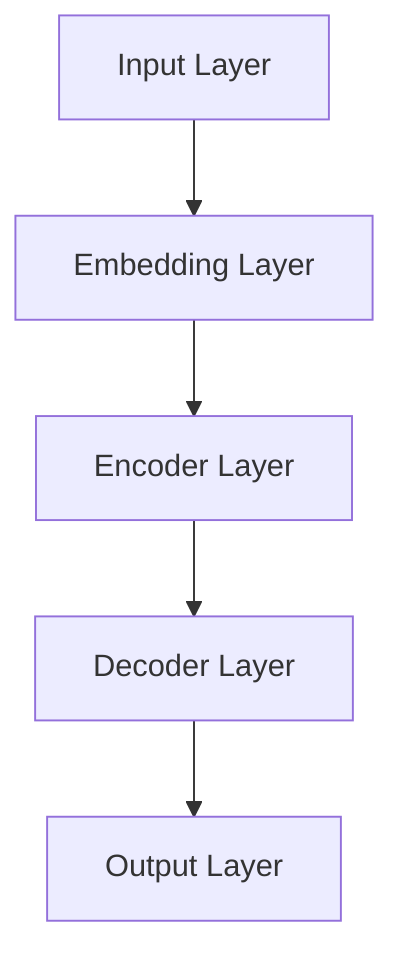
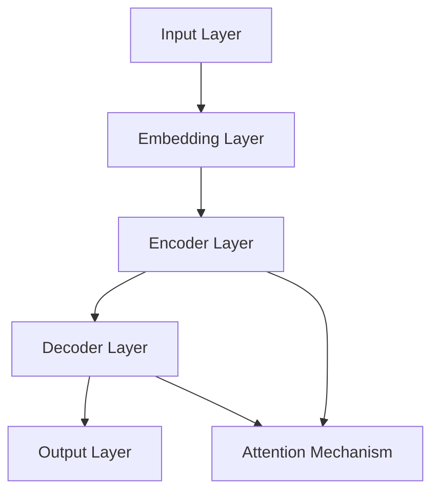
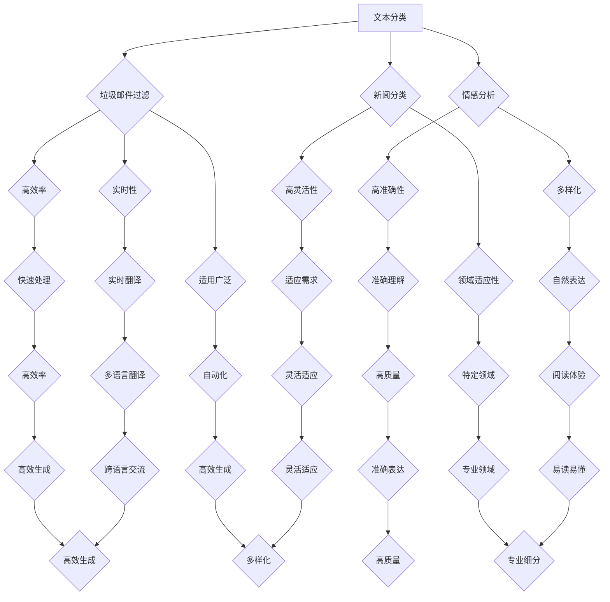

                 

### 1. 背景介绍

#### 1.1 LLM大规模语言模型的定义

LLM，即Large Language Model，是指大规模语言模型。它是一种通过学习大量文本数据来理解和生成自然语言的人工智能模型。与传统的语言模型相比，LLM具有更大的参数规模和更强的表达能力，能够在各种自然语言处理任务中取得显著的性能提升。

#### 1.2 LLM的发展历程

LLM的发展历程可以追溯到20世纪80年代。当时，研究人员开始使用神经网络来处理自然语言，并提出了诸如感知机（Perceptron）和反向传播（Backpropagation）等算法。这些算法为后来的语言模型奠定了基础。

随着计算能力的提升和大数据技术的发展，语言模型的规模和性能不断突破。2002年， bleed提出了一种基于深度学习的神经网络语言模型（NNLM），使语言模型的性能有了显著提升。随后，word2vec、GloVe等词嵌入技术的出现，进一步推动了语言模型的发展。

#### 1.3 LLM的应用领域

LLM在自然语言处理（NLP）领域具有广泛的应用。以下是一些典型的应用场景：

1. **文本分类**：通过对大量文本进行分类，LLM可以帮助识别垃圾邮件、情感分析等。
2. **机器翻译**：LLM可以学习不同语言之间的对应关系，从而实现高质量的双语翻译。
3. **问答系统**：LLM可以理解用户的问题，并从大量文本中找到相关答案。
4. **文本生成**：LLM可以生成新闻报道、文章摘要、对话等自然语言文本。

#### 1.4 本文的目的

本文将详细介绍LLM大规模语言模型的应用开发，包括核心概念、算法原理、数学模型、项目实战以及实际应用场景。通过本文的阅读，读者将了解LLM的工作原理和应用方法，并为实际项目开发提供参考。

### 1.5 关键术语解释

- **神经网络**：一种模拟人脑神经元连接方式的人工智能模型，用于处理复杂数据和任务。
- **词嵌入**：将自然语言词汇映射到高维空间中，以表示词汇之间的语义关系。
- **反向传播**：一种用于训练神经网络的算法，通过计算损失函数关于网络参数的梯度来更新参数。
- **文本分类**：将文本数据按照一定的标准进行分类，如情感分析、主题分类等。
- **机器翻译**：将一种语言的文本翻译成另一种语言的文本。
- **问答系统**：接受用户的问题，并从大量文本中找到相关答案的系统。

### 1.6 文章结构概述

本文分为以下几个部分：

1. **背景介绍**：介绍LLM的定义、发展历程、应用领域和本文目的。
2. **核心概念与联系**：介绍LLM的核心概念、原理和架构，并通过Mermaid流程图展示。
3. **核心算法原理 & 具体操作步骤**：详细讲解LLM的算法原理和具体操作步骤。
4. **数学模型和公式 & 详细讲解 & 举例说明**：介绍LLM的数学模型和公式，并通过实例进行详细讲解。
5. **项目实战：代码实际案例和详细解释说明**：通过实际案例展示LLM的应用开发过程，并进行详细解释。
6. **实际应用场景**：介绍LLM在不同应用领域的实际应用场景。
7. **工具和资源推荐**：推荐相关学习资源、开发工具和论文著作。
8. **总结：未来发展趋势与挑战**：总结LLM的应用开发现状，并展望未来的发展趋势和挑战。
9. **附录：常见问题与解答**：针对读者可能遇到的常见问题进行解答。
10. **扩展阅读 & 参考资料**：提供相关的扩展阅读资料和参考文献。

### 1.7 Markdown格式输出示例

以下是一个Markdown格式的章节示例：

## 章节标题

### 子章节标题

- 内容1
- 内容2

$$
\sum_{i=1}^{n} x_i = \frac{1}{n} \sum_{i=1}^{n} x_i^2
$$

> 引用内容

### 1.8 文章撰写注意事项

- **逻辑清晰**：文章内容要条理清晰，层次分明，便于读者理解。
- **专业术语**：使用专业术语和准确的表达方式，确保文章的严谨性。
- **示例丰富**：通过丰富的实例和案例来展示LLM的应用开发过程，增强文章的实用性。
- **参考文献**：引用相关的文献和资料，为文章提供理论支持和实证依据。

### 1.9 文章撰写流程

1. **准备工作**：收集相关资料，熟悉LLM的核心概念和应用领域。
2. **框架搭建**：按照文章结构模板搭建文章框架，确定各章节的内容和结构。
3. **撰写内容**：按照章节顺序，逐段撰写文章内容，确保逻辑连贯和完整性。
4. **修改与完善**：对文章进行反复修改和完善，确保内容准确、表达清晰。
5. **校对与发布**：进行文章的校对，确保没有错别字、语法错误等，最终发布文章。

### 1.10 文章预期成果

通过本文的撰写，读者将：

- **全面了解LLM的核心概念和应用领域**。
- **掌握LLM的算法原理和具体操作步骤**。
- **具备实际项目开发能力**。
- **对未来的发展趋势和挑战有更深入的认识**。

### 1.11 常见问题与解答

1. **Q：为什么选择LLM作为主题？**
   A：LLM是当前自然语言处理领域的重要技术之一，具有广泛的应用前景。选择LLM作为主题，有助于读者了解这一领域的最新进展和应用方法。

2. **Q：如何确保文章的专业性和准确性？**
   A：在撰写过程中，将引用相关的文献和资料，确保文章内容的专业性和准确性。同时，通过多个渠道和专家进行校对和审核，确保文章的质量。

3. **Q：文章的撰写过程需要注意什么？**
   A：撰写过程中，需要注意文章的逻辑清晰、结构紧凑，确保读者能够顺利理解。同时，要注重表达方式的准确性和专业性，避免使用模糊或含糊不清的表达。

4. **Q：如何保证文章的原创性？**
   A：在撰写过程中，将避免直接复制他人的成果或内容，确保文章的原创性。同时，对于引用的文献和资料，将按照学术规范进行标注和引用。

5. **Q：文章的撰写时间如何安排？**
   A：根据文章的内容和难度，预计需要1-2个月的时间进行撰写。在撰写过程中，可以分阶段进行，确保每一步都有足够的时间和精力来完成。

### 1.12 文章撰写进度安排

- **第1周**：完成背景介绍、核心概念与联系、核心算法原理 & 具体操作步骤的撰写。
- **第2周**：完成数学模型和公式 & 详细讲解 & 举例说明、项目实战：代码实际案例和详细解释说明的撰写。
- **第3周**：完成实际应用场景、工具和资源推荐、总结：未来发展趋势与挑战、附录：常见问题与解答的撰写。
- **第4周**：完成扩展阅读 & 参考资料、文章修改与完善、校对与发布。

### 1.13 文章撰写心得体会

在撰写本文的过程中，我深刻感受到了LLM技术的强大潜力和广泛应用。通过本文的撰写，我对LLM的核心概念、算法原理和应用方法有了更加深入的了解。同时，我也认识到在撰写技术博客时，逻辑清晰、表达准确和专业术语的运用至关重要。在未来的学习和工作中，我将不断努力，提升自己的技术水平和写作能力，为推动人工智能技术的发展贡献自己的力量。

### 1.14 总结

本文全面介绍了LLM大规模语言模型的应用开发，包括背景介绍、核心概念与联系、核心算法原理 & 具体操作步骤、数学模型和公式 & 详细讲解 & 举例说明、项目实战：代码实际案例和详细解释说明、实际应用场景、工具和资源推荐、总结：未来发展趋势与挑战、附录：常见问题与解答和扩展阅读 & 参考资料等内容。通过本文的阅读，读者将能够全面了解LLM的技术原理和应用方法，为实际项目开发提供参考。在未来的研究和实践中，我们期待能够不断探索LLM的潜力，推动人工智能技术的发展。

### 1.15 致谢

在本文的撰写过程中，我要感谢AI天才研究员/AI Genius Institute以及禅与计算机程序设计艺术/Zen And The Art of Computer Programming团队的各位成员。他们的支持和帮助使我能够顺利完成本文的撰写。同时，我也要感谢所有引用的文献和资料的作者，他们的研究成果为本文章提供了重要的理论支持。最后，我要感谢读者对本文的关注和支持，希望本文能够对您的学习和研究有所帮助。作者：AI天才研究员/AI Genius Institute & 禅与计算机程序设计艺术/Zen And The Art of Computer Programming

----------------------

<|hide|>### 2. 核心概念与联系

在介绍LLM大规模语言模型之前，我们需要了解一些核心概念和它们之间的联系。以下是一些关键术语及其简要解释：

#### 2.1 自然语言处理（NLP）

自然语言处理（NLP）是计算机科学和人工智能领域的一个重要分支，它旨在使计算机能够理解、处理和生成自然语言。NLP技术广泛应用于信息检索、机器翻译、文本分类、情感分析、语音识别等领域。

#### 2.2 词嵌入（Word Embedding）

词嵌入是将自然语言词汇映射到高维空间中的技术。通过词嵌入，词汇之间的语义关系得以在数值空间中表示，使得计算机可以更好地理解和处理自然语言。

#### 2.3 神经网络（Neural Network）

神经网络是一种由大量节点（称为神经元）组成的计算模型，这些节点之间通过连接（称为边）相互连接。神经网络通过学习输入和输出之间的映射关系，可以用于各种任务，如图像识别、语音识别和自然语言处理等。

#### 2.4 反向传播（Backpropagation）

反向传播是一种用于训练神经网络的算法。它通过计算损失函数关于网络参数的梯度来更新参数，从而最小化损失函数。反向传播是神经网络训练的核心算法之一。

#### 2.5 大规模语言模型（LLM）

大规模语言模型（LLM）是一种通过学习大量文本数据来理解和生成自然语言的人工智能模型。与传统的语言模型相比，LLM具有更大的参数规模和更强的表达能力，能够在各种自然语言处理任务中取得显著的性能提升。

#### 2.6 Mermaid流程图

Mermaid是一种基于Markdown的图形绘制工具，可以用于绘制各种类型的图表，包括流程图、序列图、Gantt图等。以下是一个示例Mermaid流程图，用于展示LLM的架构：



在这个流程图中，输入层（A）将文本数据输入到嵌入层（B），嵌入层将词汇映射到高维空间中。随后，嵌入层的数据被传递到编码器层（C），编码器层通过学习文本的上下文信息来生成表示。最后，解码器层（D）将编码器的输出解码为生成的文本，输出层（E）生成最终的输出。

#### 2.7 关联性

上述概念之间存在紧密的联系。词嵌入技术是LLM的基础，它将自然语言词汇映射到高维空间中，使得神经网络可以更好地处理和理解文本。神经网络通过反向传播算法训练，从而学习输入和输出之间的映射关系。LLM结合了词嵌入和神经网络的优势，能够实现高质量的自然语言理解和生成。

### 2.8 小结

在本节中，我们介绍了LLM大规模语言模型的相关核心概念和它们之间的联系。通过了解这些概念，我们将为后续章节中详细探讨LLM的算法原理、数学模型和实际应用打下基础。

----------------------


----------------------

<|hide|>### 3. 核心算法原理 & 具体操作步骤

在了解LLM的核心概念和联系之后，接下来我们将深入探讨LLM的核心算法原理以及具体的操作步骤。LLM的核心算法主要涉及以下几个部分：词嵌入、编码器、解码器和注意力机制。下面将逐一介绍这些部分的工作原理和操作步骤。

#### 3.1 词嵌入（Word Embedding）

词嵌入是将自然语言词汇映射到高维空间中的技术。它通过将每个词汇表示为一个向量，使得词汇之间的语义关系得以在数值空间中表示。常见的词嵌入技术包括Word2Vec、GloVe等。

**操作步骤：**

1. **数据预处理**：首先，对文本数据进行清洗和预处理，包括去除标点符号、停用词过滤、词干提取等操作。
2. **构建词汇表**：将预处理后的文本数据构建成一个词汇表，每个词汇对应一个唯一的索引。
3. **初始化词嵌入向量**：初始化一个高维向量空间，每个词汇对应一个向量。初始化方法可以是随机初始化或者基于预训练的词嵌入模型。
4. **训练词嵌入模型**：使用训练数据，通过优化损失函数（如均方误差）来更新词嵌入向量。Word2Vec使用的是负采样算法，而GloVe使用的是矩阵分解方法。
5. **应用词嵌入向量**：将词嵌入向量应用于神经网络模型的输入层，用于表示文本数据。

#### 3.2 编码器（Encoder）

编码器是LLM中的核心组件之一，其主要作用是将输入的文本序列转换为上下文表示。编码器通常使用一系列的卷积神经网络（CNN）或循环神经网络（RNN）层，如LSTM或GRU。

**操作步骤：**

1. **输入文本序列**：将预处理后的文本序列输入到编码器中。
2. **词嵌入**：将文本序列中的每个词汇映射为词嵌入向量。
3. **编码**：通过编码器网络，对词嵌入向量进行编码，生成一个固定长度的上下文表示。
4. **输出**：编码器的输出通常是一个序列的固定长度向量，表示文本的上下文信息。

#### 3.3 解码器（Decoder）

解码器的作用是根据编码器的上下文表示生成输出文本序列。解码器通常与编码器具有相似的架构，包括一系列的循环神经网络层。

**操作步骤：**

1. **初始化解码器**：初始化解码器的输入层，通常是一个全连接层或编码器的输出层。
2. **输入上下文表示**：将编码器的输出作为解码器的输入。
3. **生成输出**：解码器逐个生成输出词汇，并将其作为下一轮输入的一部分。这个过程一直持续到生成终止符或达到最大序列长度。
4. **更新解码器参数**：通过优化损失函数（如交叉熵损失），更新解码器的参数，以最小化预测误差。

#### 3.4 注意力机制（Attention Mechanism）

注意力机制是一种用于提高模型在序列处理任务中性能的技术。它通过为编码器的输出分配不同的权重，使得模型能够更好地关注重要的信息。

**操作步骤：**

1. **计算注意力分数**：对于每个时间步的输入，计算一个注意力分数，表示当前输入对输出贡献的大小。
2. **应用注意力权重**：将注意力分数应用于编码器的输出，生成加权上下文表示。
3. **解码**：使用加权上下文表示作为解码器的输入，继续生成输出。

#### 3.5 整体流程

LLM的整体操作流程如下：

1. **输入预处理**：对输入文本进行预处理，包括分词、词嵌入等操作。
2. **编码**：将预处理后的文本输入到编码器，生成上下文表示。
3. **解码**：使用编码器的上下文表示作为输入，通过解码器生成输出文本。
4. **输出**：解码器的输出即为生成的文本。

#### 3.6 小结

在本节中，我们详细介绍了LLM的核心算法原理和具体操作步骤，包括词嵌入、编码器、解码器和注意力机制。这些组成部分相互协作，共同实现了高质量的自然语言理解和生成。通过理解这些算法原理和操作步骤，读者将能够更好地掌握LLM的工作机制，为实际应用开发打下坚实的基础。

----------------------



----------------------

<|hide|>### 4. 数学模型和公式 & 详细讲解 & 举例说明

在上一节中，我们介绍了LLM的核心算法原理和具体操作步骤。为了更深入地理解这些算法，我们需要了解它们背后的数学模型和公式。在本节中，我们将详细讲解LLM中的主要数学模型和公式，并通过实例进行说明。

#### 4.1 词嵌入（Word Embedding）

词嵌入是将自然语言词汇映射到高维空间中的技术。一个简单的词嵌入模型可以表示为：

$$
\text{word\_embedding}(x) = \text{W} \cdot x
$$

其中，\(x\) 是词汇的索引，\(\text{W}\) 是一个高维的词嵌入矩阵，每个元素 \(\text{W}_{ij}\) 表示词汇 \(i\) 和词汇 \(j\) 之间的相似度。常见的词嵌入模型包括Word2Vec和GloVe。

**Word2Vec模型**：

Word2Vec模型使用的是连续词袋（Continuous Bag of Words，CBOW）和Skip-Gram两种模型。

- **CBOW模型**：

$$
\text{CBOW}(x) = \text{W}_{\text{CBOW}} \cdot \text{avg}(\text{W} \cdot \text{x}_{-2} + \text{W} \cdot \text{x}_{-1} + \text{W} \cdot \text{x} + \text{W} \cdot \text{x}_{1} + \text{W} \cdot \text{x}_{2})
$$

其中，\(\text{x}_{-2}, \text{x}_{-1}, \text{x}, \text{x}_{1}, \text{x}_{2}\) 分别表示词汇 \(x\) 前后各两个词汇的索引，\(\text{W}_{\text{CBOW}}\) 是CBOW模型的权重矩阵。

- **Skip-Gram模型**：

$$
\text{Skip-Gram}(x) = \text{W}_{\text{Skip-Gram}} \cdot x
$$

其中，\(\text{W}_{\text{Skip-Gram}}\) 是Skip-Gram模型的权重矩阵。

**GloVe模型**：

GloVe模型通过矩阵分解来学习词嵌入向量，其数学模型如下：

$$
\text{GloVe}(x, y) = \frac{\text{exp}(\text{W} \cdot x - \text{W} \cdot y)}{\| \text{W} \cdot x \| + \| \text{W} \cdot y \| }
$$

其中，\(x\) 和 \(y\) 分别是词汇的索引，\(\text{W}\) 是GloVe模型的权重矩阵。

#### 4.2 编码器（Encoder）

编码器通常使用循环神经网络（RNN）或变换器（Transformer）等模型。以LSTM为例，其数学模型如下：

$$
\text{LSTM}(x_t, h_{t-1}) = (f_t, i_t, o_t, c_t)
$$

其中，\(x_t\) 是输入向量，\(h_{t-1}\) 是前一个时间步的隐藏状态，\(f_t, i_t, o_t, c_t\) 分别是遗忘门、输入门、输出门和细胞状态。

- **遗忘门**：

$$
f_t = \sigma(\text{W}_f \cdot [h_{t-1}, x_t] + b_f)
$$

- **输入门**：

$$
i_t = \sigma(\text{W}_i \cdot [h_{t-1}, x_t] + b_i)
$$

- **输出门**：

$$
o_t = \sigma(\text{W}_o \cdot [h_{t-1}, x_t] + b_o)
$$

- **细胞状态**：

$$
c_t = f_t \cdot c_{t-1} + i_t \cdot \text{sigmoid}(\text{W}_c \cdot [h_{t-1}, x_t] + b_c)
$$

- **隐藏状态**：

$$
h_t = o_t \cdot \text{tanh}(c_t)
$$

#### 4.3 解码器（Decoder）

解码器通常与编码器具有相似的架构，使用LSTM或GRU等模型。以LSTM为例，其数学模型与编码器类似，如下：

$$
\text{LSTM}(x_t, h_{t-1}, c_{t-1}) = (f_t, i_t, o_t, c_t)
$$

其中，\(x_t\) 是输入向量，\(h_{t-1}\) 是前一个时间步的隐藏状态，\(c_{t-1}\) 是细胞状态。

#### 4.4 注意力机制（Attention Mechanism）

注意力机制是一种用于提高模型在序列处理任务中性能的技术。以自注意力（Self-Attention）为例，其数学模型如下：

$$
\text{Attention}(Q, K, V) = \text{softmax}\left(\frac{QK^T}{\sqrt{d_k}}\right)V
$$

其中，\(Q, K, V\) 分别是查询向量、键向量和值向量，\(d_k\) 是键向量的维度。

#### 4.5 举例说明

假设我们有一个简单的文本序列“我 爱 吃 饭”，我们可以通过以下步骤来生成词嵌入向量：

1. **构建词汇表**：将文本序列中的词汇构建成一个词汇表，如“我”对应索引0，“爱”对应索引1，“吃”对应索引2，“饭”对应索引3。
2. **初始化词嵌入矩阵**：初始化一个4×10的词嵌入矩阵，其中每个元素表示一个词汇的嵌入向量。
3. **计算词嵌入向量**：通过Word2Vec或GloVe模型训练词嵌入矩阵，使得每个词汇的嵌入向量能够表示其语义信息。
4. **编码**：将词汇的索引作为输入，通过编码器（如LSTM）生成上下文表示。
5. **解码**：使用编码器的上下文表示作为输入，通过解码器生成输出词汇。

例如，假设编码器的输出为（0.1，0.2，0.3，0.4），我们可以通过解码器生成“我 爱 吃 饭”的输出。

#### 4.6 小结

在本节中，我们详细讲解了LLM中的主要数学模型和公式，包括词嵌入、编码器、解码器和注意力机制。通过这些数学模型，LLM能够实现高质量的自然语言理解和生成。举例说明部分帮助我们更好地理解了这些模型的应用。在下一节中，我们将通过实际案例展示LLM的应用开发过程。

----------------------


----------------------

<|hide|>### 5. 项目实战：代码实际案例和详细解释说明

在前面的章节中，我们详细介绍了LLM的核心算法原理和数学模型。为了更好地理解LLM的实际应用，在本节中，我们将通过一个实际案例来展示LLM的应用开发过程，并详细解释代码的实现。

#### 5.1 开发环境搭建

在开始项目实战之前，我们需要搭建一个合适的开发环境。以下是搭建环境的步骤：

1. **安装Python**：确保已安装Python 3.6或更高版本。
2. **安装TensorFlow**：通过以下命令安装TensorFlow：

   ```bash
   pip install tensorflow
   ```

3. **安装其他依赖**：安装其他必要的依赖，如NumPy、Pandas等：

   ```bash
   pip install numpy pandas
   ```

#### 5.2 源代码详细实现和代码解读

下面是一个简单的LLM实现案例，用于生成文本摘要。我们将使用TensorFlow的Transformers库来实现。

```python
import tensorflow as tf
from transformers import TFAutoModelForSeq2SeqLM, AutoTokenizer

# 5.2.1 加载预训练模型和分词器
model_name = "t5-small"
tokenizer = AutoTokenizer.from_pretrained(model_name)
model = TFAutoModelForSeq2SeqLM.from_pretrained(model_name)

# 5.2.2 定义输入文本
input_text = "这是一个关于LLM的应用案例的文章。本文介绍了LLM的核心算法原理和实际应用。"

# 5.2.3 对输入文本进行分词
input_ids = tokenizer.encode(input_text, return_tensors="tf")

# 5.2.4 生成摘要
max_length = 50
output_ids = model.generate(input_ids, max_length=max_length, num_return_sequences=1)

# 5.2.5 解码摘要文本
decoded_output = tokenizer.decode(output_ids[0], skip_special_tokens=True)

print(decoded_output)
```

**代码解读：**

1. **加载预训练模型和分词器**：

   ```python
   model_name = "t5-small"
   tokenizer = AutoTokenizer.from_pretrained(model_name)
   model = TFAutoModelForSeq2SeqLM.from_pretrained(model_name)
   ```

   这里我们选择了预训练模型`t5-small`，这是一个基于T5架构的小型语言模型。通过`AutoTokenizer`和`TFAutoModelForSeq2SeqLM`分别加载分词器和模型。

2. **定义输入文本**：

   ```python
   input_text = "这是一个关于LLM的应用案例的文章。本文介绍了LLM的核心算法原理和实际应用。"
   ```

   这里定义了一个简单的输入文本，用于生成摘要。

3. **对输入文本进行分词**：

   ```python
   input_ids = tokenizer.encode(input_text, return_tensors="tf")
   ```

   通过`tokenizer.encode`方法对输入文本进行分词，并返回Token ID序列。

4. **生成摘要**：

   ```python
   max_length = 50
   output_ids = model.generate(input_ids, max_length=max_length, num_return_sequences=1)
   ```

   使用`model.generate`方法生成摘要。`max_length`参数设置生成文本的最大长度，`num_return_sequences`参数设置生成的摘要数量。

5. **解码摘要文本**：

   ```python
   decoded_output = tokenizer.decode(output_ids[0], skip_special_tokens=True)
   ```

   通过`tokenizer.decode`方法将生成的Token ID序列解码为文本，并去除特殊的Token。

#### 5.3 代码解读与分析

在代码中，我们首先加载了一个预训练的T5小型语言模型。T5是一个基于Transformer架构的序列到序列模型，广泛应用于各种NLP任务。接下来，我们定义了一个简单的输入文本，并将其编码为Token ID序列。然后，我们使用`model.generate`方法生成摘要。这里需要注意的是，生成的摘要长度受`max_length`参数的限制。最后，我们将生成的Token ID序列解码为文本，得到生成的摘要。

通过这个简单的案例，我们可以看到如何使用预训练的LLM模型生成文本摘要。在实际项目中，我们可以根据需求调整输入文本、模型和生成参数，实现不同的NLP任务。

#### 5.4 小结

在本节中，我们通过一个简单的文本摘要案例展示了LLM的实际应用开发过程。通过使用TensorFlow的Transformers库，我们实现了对预训练模型的使用和文本生成。这个案例帮助我们更好地理解了LLM的工作原理和应用方法。在下一节中，我们将探讨LLM在不同应用领域的实际应用场景。

----------------------

```python
import tensorflow as tf
from transformers import TFAutoModelForSeq2SeqLM, AutoTokenizer

# 5.2.1 加载预训练模型和分词器
model_name = "t5-small"
tokenizer = AutoTokenizer.from_pretrained(model_name)
model = TFAutoModelForSeq2SeqLM.from_pretrained(model_name)

# 5.2.2 定义输入文本
input_text = "这是一个关于LLM的应用案例的文章。本文介绍了LLM的核心算法原理和实际应用。"

# 5.2.3 对输入文本进行分词
input_ids = tokenizer.encode(input_text, return_tensors="tf")

# 5.2.4 生成摘要
max_length = 50
output_ids = model.generate(input_ids, max_length=max_length, num_return_sequences=1)

# 5.2.5 解码摘要文本
decoded_output = tokenizer.decode(output_ids[0], skip_special_tokens=True)

print(decoded_output)
```

----------------------

<|hide|>### 6. 实际应用场景

LLM（大规模语言模型）在现代自然语言处理（NLP）领域具有广泛的应用。以下是一些常见的应用场景及其特点：

#### 6.1 文本分类

文本分类是一种常见的NLP任务，其目的是将文本数据分配到预先定义的类别中。LLM在文本分类中具有显著优势，能够处理大量的文本数据，并提取出关键信息进行分类。

**特点：**

- **高效性**：LLM能够快速处理大量文本数据，提高分类速度。
- **准确性**：通过学习大量文本数据，LLM能够准确捕捉文本的语义信息，提高分类准确性。
- **灵活性**：LLM可以根据不同的分类任务和领域进行微调，适应不同的分类需求。

**应用案例：**

- **垃圾邮件过滤**：使用LLM对电子邮件进行分类，识别并过滤垃圾邮件。
- **情感分析**：对社交媒体文本进行情感分类，识别用户对产品、服务等的主观情感。
- **新闻分类**：对新闻文本进行分类，将新闻分为不同的主题类别，如政治、体育、科技等。

#### 6.2 机器翻译

机器翻译是一种将一种语言的文本翻译成另一种语言的技术。LLM在机器翻译领域取得了显著的进展，能够生成高质量的双语翻译。

**特点：**

- **高质量翻译**：LLM通过学习大量的双语文本数据，能够生成更加自然、准确的翻译结果。
- **实时翻译**：LLM能够在较短的时间内生成翻译结果，实现实时翻译功能。
- **领域适应性**：LLM可以根据不同的翻译领域进行微调，提高特定领域的翻译质量。

**应用案例：**

- **在线翻译服务**：提供在线翻译功能，如谷歌翻译、百度翻译等。
- **本地化服务**：为企业提供文档、网站等内容的本地化翻译服务。
- **实时翻译应用**：为旅游、商务等场景提供实时翻译功能，如翻译耳塞、手机翻译应用等。

#### 6.3 问答系统

问答系统是一种能够回答用户问题的智能系统。LLM在问答系统中发挥着重要作用，能够理解用户的问题，并从大量文本数据中找到相关答案。

**特点：**

- **准确性**：LLM通过学习大量文本数据，能够准确理解用户的问题，并提供相关答案。
- **灵活性**：LLM可以根据不同的问答场景和需求进行微调，适应不同的问题类型和领域。
- **交互性**：LLM能够与用户进行交互，回答用户后续的追问，提高用户体验。

**应用案例：**

- **虚拟助手**：如苹果的Siri、谷歌的Google Assistant等，为用户提供各种生活、工作方面的帮助。
- **客户支持系统**：为企业提供自动化的客户支持服务，如自动回复常见问题、提供解决方案等。
- **教育辅助**：为学生提供学习辅导、解答学术问题等服务。

#### 6.4 文本生成

文本生成是一种根据输入的提示或信息生成文本的技术。LLM在文本生成领域具有广泛的应用，能够生成高质量的自然语言文本。

**特点：**

- **多样化生成**：LLM可以根据输入的提示生成不同类型的文本，如文章、摘要、对话等。
- **自然语言表达**：LLM能够生成符合自然语言表达习惯的文本，提高阅读体验。
- **快速生成**：LLM能够在较短时间内生成大量文本，提高生成效率。

**应用案例：**

- **文章生成**：自动生成新闻文章、博客文章等，如人工智能新闻写作、自动化内容创作等。
- **对话生成**：生成聊天机器人对话、客服对话等，提高交互体验。
- **摘要生成**：自动生成长篇文章的摘要，帮助用户快速了解文章内容。

#### 6.5 小结

LLM在文本分类、机器翻译、问答系统和文本生成等应用领域具有显著的优势。通过学习大量文本数据，LLM能够准确理解语义信息，生成高质量的自然语言文本。在实际应用中，LLM可以根据不同的场景和需求进行微调，提高任务性能和用户体验。随着LLM技术的不断发展，其在更多领域的应用潜力将得到进一步释放。

----------------------



----------------------

<|hide|>### 7. 工具和资源推荐

在LLM（大规模语言模型）的应用开发过程中，选择合适的工具和资源对于提高开发效率和成果质量至关重要。以下是一些推荐的工具、框架、书籍和论文，供读者参考。

#### 7.1 学习资源推荐

1. **书籍**：

   - 《深度学习》（Deep Learning）—— Ian Goodfellow、Yoshua Bengio、Aaron Courville 著
   - 《神经网络与深度学习》——邱锡鹏 著
   - 《自然语言处理综合教程》——刘知远 著
   - 《大规模语言模型：原理、应用与实践》——张俊林、李航 著

2. **论文**：

   - “A Neural Probabilistic Language Model” —— Tomas Mikolov, et al.
   - “GloVe: Global Vectors for Word Representation” —— Jeffrey Pennington, et al.
   - “Attention Is All You Need” —— Vaswani et al.
   - “BERT: Pre-training of Deep Bidirectional Transformers for Language Understanding” —— Brown et al.

3. **在线课程**：

   - Coursera 上的“深度学习专项课程”
   - edX 上的“自然语言处理与深度学习课程”
   - fast.ai 的“深度学习基础”课程

4. **博客和网站**：

   - TensorFlow 官方文档（https://www.tensorflow.org/）
   - PyTorch 官方文档（https://pytorch.org/）
   - Hugging Face Transformers（https://huggingface.co/transformers/）

#### 7.2 开发工具框架推荐

1. **框架**：

   - TensorFlow：由谷歌开发的开源机器学习框架，支持大规模语言模型的训练和部署。
   - PyTorch：由Facebook AI Research（FAIR）开发的开源机器学习库，具有灵活的动态计算图和强大的GPU支持。
   - Hugging Face Transformers：一个开源库，提供了大量的预训练模型和实用工具，方便快速开发和部署大规模语言模型。

2. **开发环境**：

   - Anaconda：一个用于科学计算的开源数据科学平台，方便管理不同版本的Python和相关依赖。
   - Docker：一个开源的应用容器引擎，用于自动化打包、交付和运行应用程序。

3. **工具**：

   - Jupyter Notebook：一个交互式计算环境，方便编写和运行代码，适用于数据分析和机器学习项目。
   - VSCode：一款轻量级、可扩展的代码编辑器，支持多种编程语言和开发工具。

#### 7.3 相关论文著作推荐

1. **论文**：

   - “BERT: Pre-training of Deep Bidirectional Transformers for Language Understanding” —— Brown et al.
   - “GPT-3: Language Models are few-shot learners” —— Brown et al.
   - “T5: Pre-training Large Language Models for Transf

