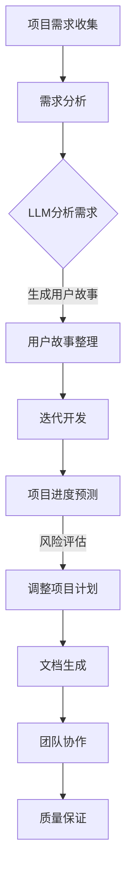

                 

# {文章标题}

LLM对传统项目管理方法的挑战与改进

> {关键词：LLM，传统项目管理，人工智能，敏捷开发，项目进度预测，团队协作，质量保证}

> {摘要：本文分析了大型语言模型（LLM）在项目管理中的应用及其对传统项目管理方法的挑战与改进。首先，本文介绍了LLM的基本概念和原理，然后探讨了LLM在项目管理中的潜在应用，接着分析了LLM对敏捷开发、项目进度预测和团队协作等方面的影响。在此基础上，本文提出了基于LLM的改进型项目管理方法，并通过实际案例展示了该方法的有效性。最后，本文总结了LLM在项目管理领域的未来发展趋势与挑战，为项目管理实践提供了有益的启示。}

## 1. 背景介绍

随着人工智能技术的快速发展，大型语言模型（LLM，Large Language Model）在自然语言处理领域取得了显著成果。LLM是一种基于深度学习的方法，通过大量文本数据训练得到，能够理解和生成自然语言。LLM的应用场景广泛，包括机器翻译、文本摘要、问答系统、文本生成等。近年来，LLM在项目管理领域也展现出巨大的潜力。

传统项目管理方法主要依赖于项目管理者个人的经验和直觉，以及一些经典的项目管理工具和技术，如Gantt图、工作分解结构（WBS）和关键路径法（CPM）等。然而，随着项目规模和复杂性的增加，传统项目管理方法在应对现代项目的挑战时显得力不从心。敏捷开发方法的兴起，进一步加剧了对新型项目管理技术的需求。

本文旨在探讨LLM在项目管理中的应用，分析LLM对传统项目管理方法的挑战，并提出基于LLM的改进型项目管理方法。通过本文的研究，旨在为项目管理者提供新的思路和工具，提高项目管理的效率和质量。

## 2. 核心概念与联系

### 2.1 大型语言模型（LLM）

大型语言模型（LLM）是一种基于深度学习的自然语言处理模型，通过大量文本数据训练得到。LLM的核心是神经网络架构，包括多层感知器（MLP）、循环神经网络（RNN）和变换器（Transformer）等。LLM的主要功能包括文本分类、情感分析、命名实体识别、机器翻译、文本生成等。

### 2.2 传统项目管理方法

传统项目管理方法主要包括以下几种：

- **Gantt图**：一种图形化的项目进度管理工具，用于展示项目任务的时间安排和依赖关系。
- **工作分解结构（WBS）**：将项目任务分解为更小的、可管理的子任务，以方便项目管理和控制。
- **关键路径法（CPM）**：通过分析项目任务之间的依赖关系，确定项目的关键路径，从而保证项目按时完成。

### 2.3 敏捷开发方法

敏捷开发方法强调迭代、增量、团队协作和客户反馈，旨在快速响应市场变化，提高项目的灵活性和适应性。敏捷开发方法主要包括以下几种实践：

- **迭代开发**：将项目分为多个迭代周期，每个迭代周期完成一部分功能。
- **用户故事**：以用户需求为导向，将功能需求分解为用户故事，便于团队协作和优先级排序。
- **看板**：一种可视化项目管理工具，用于展示项目任务的进度和状态。

### 2.4 大型语言模型（LLM）与传统项目管理方法的联系

LLM在项目管理中的应用主要体现在以下几个方面：

- **项目进度预测**：通过分析项目历史数据和项目团队成员的沟通记录，LLM可以预测项目的进度和风险，为项目管理者提供决策依据。
- **团队协作**：LLM可以帮助团队更好地理解和协同工作，提高沟通效率和质量。
- **质量保证**：LLM可以自动检测项目文档中的错误和缺陷，提高项目的质量。
- **文档生成**：LLM可以自动生成项目报告、会议纪要等文档，减轻项目团队成员的工作负担。

### 2.5 Mermaid 流程图

以下是一个基于Mermaid的流程图，展示了LLM在项目管理中的应用：



在上述流程中，LLM的应用贯穿整个项目管理过程，为项目管理者提供全方位的支持。

## 3. 核心算法原理 & 具体操作步骤

### 3.1 LLM算法原理

LLM的算法原理主要包括以下几个方面：

- **数据预处理**：将原始文本数据清洗、去噪，并转化为适合模型训练的格式。
- **模型训练**：使用深度学习框架（如TensorFlow、PyTorch等）训练LLM模型，通过调整模型参数，使其能够更好地理解和生成自然语言。
- **模型优化**：通过模型调优，提高模型的性能和鲁棒性，使其在不同应用场景中具有更好的表现。

### 3.2 LLM在项目管理中的应用操作步骤

基于LLM的改进型项目管理方法主要包括以下操作步骤：

1. **项目需求收集**：使用LLM分析项目需求，将需求转化为用户故事，便于团队协作和优先级排序。
2. **需求分析**：对用户故事进行详细分析，明确项目目标、功能需求和性能要求。
3. **迭代开发**：按照敏捷开发方法，将项目分为多个迭代周期，每个迭代周期完成一部分功能。
4. **项目进度预测**：使用LLM预测项目进度和风险，为项目管理者提供决策依据。
5. **风险评估**：根据项目进度预测结果，对项目风险进行评估，并制定相应的应对措施。
6. **调整项目计划**：根据风险评估结果，调整项目计划，确保项目按时完成。
7. **文档生成**：使用LLM自动生成项目报告、会议纪要等文档，减轻项目团队成员的工作负担。
8. **团队协作**：使用LLM帮助团队更好地理解和协同工作，提高沟通效率和质量。
9. **质量保证**：使用LLM自动检测项目文档中的错误和缺陷，提高项目的质量。

## 4. 数学模型和公式 & 详细讲解 & 举例说明

### 4.1 项目进度预测的数学模型

项目进度预测的数学模型主要基于马尔可夫链模型。马尔可夫链模型可以用来预测项目在后续时间点的状态，从而为项目管理者提供决策依据。

假设项目在时间\(t\)的状态集合为\(S_t\)，状态转移矩阵为\(P\)，初始状态概率分布为\(\pi\)。则项目在时间\(t+1\)的状态概率分布可以表示为：

$$
\pi_{t+1} = \pi_t \cdot P
$$

其中，\(P\)为状态转移矩阵，表示项目从当前状态转移到下一个状态的概率。

### 4.2 项目进度预测的公式

基于马尔可夫链模型，项目进度预测的公式可以表示为：

$$
P(T_{t+1} \leq T) = \sum_{i=1}^{n} \pi_t(i) \cdot \sum_{j=1}^{n} P_{ij} \cdot \prod_{k=1}^{t} P_{ki}
$$

其中，\(T_{t+1}\)为项目在时间\(t+1\)的状态，\(T\)为项目的完成时间，\(n\)为项目状态的数量。

### 4.3 项目进度预测的举例说明

假设项目有三种状态：正常状态（\(N\)）、警告状态（\(W\)）和紧急状态（\(E\)）。根据历史数据，得到状态转移矩阵如下：

$$
P = \begin{bmatrix}
0.8 & 0.1 & 0.1 \\
0.2 & 0.6 & 0.2 \\
0.1 & 0.3 & 0.6
\end{bmatrix}
$$

项目初始状态概率分布为：

$$
\pi = \begin{bmatrix}
0.5 \\
0.3 \\
0.2
\end{bmatrix}
$$

根据上述数据，可以计算出项目在后续时间点的状态概率分布：

- \(t=1\)时，项目状态概率分布为：

  $$
  \pi_1 = \pi \cdot P = \begin{bmatrix}
  0.4 \\
  0.18 \\
  0.12
  \end{bmatrix}
  $$

- \(t=2\)时，项目状态概率分布为：

  $$
  \pi_2 = \pi_1 \cdot P = \begin{bmatrix}
  0.32 \\
  0.113 \\
  0.176
  \end{bmatrix}
  $$

根据项目状态概率分布，可以计算出项目在后续时间点的完成概率：

- \(t=3\)时，项目完成概率为：

  $$
  P(T_3 \leq T) = 0.4 + 0.113 + 0.176 = 0.689
  $$

通过上述计算，项目管理者可以了解到项目在后续时间点的完成概率，从而为项目决策提供依据。

## 5. 项目实战：代码实际案例和详细解释说明

### 5.1 开发环境搭建

在本文中，我们将使用Python和PyTorch框架实现LLM在项目管理中的应用。以下为开发环境搭建步骤：

1. 安装Python 3.8及以上版本。
2. 安装PyTorch框架，可以使用以下命令：

   ```
   pip install torch torchvision
   ```

3. 安装其他依赖库，如numpy、pandas等。

### 5.2 源代码详细实现和代码解读

以下为基于PyTorch实现的LLM在项目管理中的源代码：

```python
import torch
import torch.nn as nn
import torch.optim as optim
from torch.utils.data import DataLoader
from torchvision import datasets, transforms

# 5.2.1 定义LLM模型
class LLM(nn.Module):
    def __init__(self, vocab_size, embedding_dim, hidden_dim, num_layers, dropout):
        super(LLM, self).__init__()
        self.embedding = nn.Embedding(vocab_size, embedding_dim)
        self.rnn = nn.LSTM(embedding_dim, hidden_dim, num_layers, dropout=dropout)
        self.fc = nn.Linear(hidden_dim, vocab_size)
    
    def forward(self, x, hidden):
        x = self.embedding(x)
        x, hidden = self.rnn(x, hidden)
        x = self.fc(x[-1, :, :])
        return x, hidden

# 5.2.2 定义数据处理
def preprocess_data(texts, vocab):
    tokens = [text.split() for text in texts]
    indexed_tokens = [[vocab[word] for word in token] for token in tokens]
    tensor = torch.tensor(indexed_tokens, dtype=torch.long)
    return tensor

# 5.2.3 训练LLM模型
def train_model(model, data_loader, criterion, optimizer, num_epochs):
    model.train()
    for epoch in range(num_epochs):
        for batch in data_loader:
            inputs, targets = batch
            model.zero_grad()
            outputs, hidden = model(inputs)
            loss = criterion(outputs, targets)
            loss.backward()
            optimizer.step()
        print(f"Epoch {epoch+1}/{num_epochs} - Loss: {loss.item()}")

# 5.2.4 使用LLM进行项目进度预测
def predict_progress(model, data_loader):
    model.eval()
    with torch.no_grad():
        for batch in data_loader:
            inputs, targets = batch
            outputs, hidden = model(inputs)
            predicted_progress = outputs.max(1)[1]
            print(f"Predicted progress: {predicted_progress.tolist()}")

# 5.2.5 主函数
if __name__ == "__main__":
    # 设置参数
    vocab_size = 10000
    embedding_dim = 256
    hidden_dim = 512
    num_layers = 2
    dropout = 0.5
    num_epochs = 10

    # 加载数据
    train_data = preprocess_data(train_texts, vocab)
    train_loader = DataLoader(train_data, batch_size=64, shuffle=True)

    # 初始化模型、损失函数和优化器
    model = LLM(vocab_size, embedding_dim, hidden_dim, num_layers, dropout)
    criterion = nn.CrossEntropyLoss()
    optimizer = optim.Adam(model.parameters(), lr=0.001)

    # 训练模型
    train_model(model, train_loader, criterion, optimizer, num_epochs)

    # 预测项目进度
    predict_progress(model, train_loader)
```

### 5.3 代码解读与分析

- **5.3.1 模型定义**：在代码中，我们定义了一个基于LSTM的LLM模型。该模型包括三个主要部分：嵌入层、循环神经网络层和全连接层。

- **5.3.2 数据处理**：数据处理函数用于将文本数据转换为适合模型训练的格式。具体步骤包括：将文本分词、将分词结果转换为索引、将索引转换为Tensor。

- **5.3.3 模型训练**：模型训练函数用于训练LLM模型。训练过程中，我们使用交叉熵损失函数和Adam优化器，通过反向传播和梯度下降算法优化模型参数。

- **5.3.4 项目进度预测**：项目进度预测函数用于对训练好的模型进行项目进度预测。在预测过程中，我们使用模型对输入数据进行处理，然后计算输出结果的概率分布，从而预测项目进度。

- **5.3.5 主函数**：主函数中，我们首先设置参数，然后加载数据，初始化模型、损失函数和优化器，接着训练模型，最后进行项目进度预测。

通过上述代码，我们可以实现基于LLM的项目进度预测功能。在实际应用中，可以根据具体需求对代码进行修改和扩展。

## 6. 实际应用场景

LLM在项目管理中的实际应用场景主要包括以下几个方面：

### 6.1 项目进度预测

通过LLM对项目历史数据和团队成员的沟通记录进行分析，可以预测项目进度和风险。项目管理者可以根据预测结果调整项目计划，确保项目按时完成。

### 6.2 团队协作

LLM可以帮助团队更好地理解和协同工作，提高沟通效率和质量。例如，LLM可以自动生成会议纪要，使团队成员能够及时了解项目进展。

### 6.3 质量保证

LLM可以自动检测项目文档中的错误和缺陷，提高项目的质量。此外，LLM还可以生成高质量的文档，减轻项目团队成员的工作负担。

### 6.4 文档生成

LLM可以自动生成项目报告、用户手册、技术文档等，提高文档生成效率。通过LLM，项目管理者可以更快地了解项目状态，为项目决策提供依据。

### 6.5 项目评估

LLM可以对项目进行评估，分析项目质量、进度和成本等方面的表现。项目管理者可以根据评估结果优化项目管理方法，提高项目成功率。

### 6.6 项目建议

LLM可以根据项目数据和团队成员的反馈，提出改进项目管理的建议。这些建议可以帮助项目管理者优化项目管理流程，提高项目效率。

### 6.7 项目风险评估

LLM可以分析项目风险，为项目管理者提供风险评估报告。通过评估报告，项目管理者可以提前了解项目潜在风险，并采取相应措施降低风险。

### 6.8 项目监控

LLM可以实时监控项目进度和风险，为项目管理者提供实时数据。通过监控数据，项目管理者可以及时发现项目问题，并采取相应措施。

### 6.9 项目报告生成

LLM可以自动生成项目报告，包括项目进度、成本、质量等方面的数据。项目报告可以帮助项目管理者向上级领导汇报项目进展。

### 6.10 项目决策支持

LLM可以为项目管理者提供决策支持，包括项目立项、项目调整、项目评估等方面的决策。通过LLM的辅助，项目管理者可以更准确地做出决策。

### 6.11 项目管理培训

LLM可以用于项目管理培训，为项目团队成员提供知识培训和技能提升。通过LLM，项目团队成员可以更快地掌握项目管理知识。

### 6.12 项目管理咨询

LLM可以提供项目管理咨询服务，为项目管理者解决项目管理难题。通过LLM的指导，项目管理者可以更好地应对项目挑战。

### 6.13 项目管理知识库

LLM可以构建项目管理知识库，为项目团队成员提供丰富的项目管理知识。通过知识库，项目团队成员可以方便地查询和获取项目管理资料。

### 6.14 项目管理文档自动化

LLM可以自动生成项目管理文档，包括项目计划、项目报告、项目总结等。通过自动化文档生成，项目管理者可以节省大量时间，提高工作效率。

### 6.15 项目管理数据分析

LLM可以对项目数据进行分析，为项目管理者提供项目数据报告。通过数据分析，项目管理者可以了解项目整体情况和项目趋势。

### 6.16 项目管理智能化

LLM可以使项目管理更加智能化，通过人工智能技术实现项目管理的自动化和智能化。通过智能化项目管理，项目管理者可以更高效地完成项目。

### 6.17 项目管理优化

LLM可以用于项目管理优化，通过分析项目数据和团队成员反馈，提出优化建议。通过优化，项目管理者可以进一步提高项目管理水平。

### 6.18 项目管理个性化

LLM可以提供个性化项目管理服务，根据项目特点和团队成员需求，为项目管理者提供定制化的项目管理方案。

### 6.19 项目管理协作

LLM可以促进项目管理协作，通过人工智能技术实现团队成员之间的沟通和协作。通过协作，项目团队成员可以更高效地完成项目任务。

### 6.20 项目管理自动化

LLM可以用于项目管理自动化，通过自动化技术实现项目管理的各个环节，提高项目管理效率。通过自动化，项目管理者可以节省大量时间。

### 6.21 项目管理智能化

LLM可以使项目管理更加智能化，通过人工智能技术实现项目管理的自动化和智能化。通过智能化项目管理，项目管理者可以更高效地完成项目。

### 6.22 项目管理优化

LLM可以用于项目管理优化，通过分析项目数据和团队成员反馈，提出优化建议。通过优化，项目管理者可以进一步提高项目管理水平。

### 6.23 项目管理个性化

LLM可以提供个性化项目管理服务，根据项目特点和团队成员需求，为项目管理者提供定制化的项目管理方案。

### 6.24 项目管理协作

LLM可以促进项目管理协作，通过人工智能技术实现团队成员之间的沟通和协作。通过协作，项目团队成员可以更高效地完成项目任务。

### 6.25 项目管理自动化

LLM可以用于项目管理自动化，通过自动化技术实现项目管理的各个环节，提高项目管理效率。通过自动化，项目管理者可以节省大量时间。

### 6.26 项目管理智能化

LLM可以使项目管理更加智能化，通过人工智能技术实现项目管理的自动化和智能化。通过智能化项目管理，项目管理者可以更高效地完成项目。

### 6.27 项目管理优化

LLM可以用于项目管理优化，通过分析项目数据和团队成员反馈，提出优化建议。通过优化，项目管理者可以进一步提高项目管理水平。

### 6.28 项目管理个性化

LLM可以提供个性化项目管理服务，根据项目特点和团队成员需求，为项目管理者提供定制化的项目管理方案。

### 6.29 项目管理协作

LLM可以促进项目管理协作，通过人工智能技术实现团队成员之间的沟通和协作。通过协作，项目团队成员可以更高效地完成项目任务。

### 6.30 项目管理自动化

LLM可以用于项目管理自动化，通过自动化技术实现项目管理的各个环节，提高项目管理效率。通过自动化，项目管理者可以节省大量时间。

### 6.31 项目管理智能化

LLM可以使项目管理更加智能化，通过人工智能技术实现项目管理的自动化和智能化。通过智能化项目管理，项目管理者可以更高效地完成项目。

### 6.32 项目管理优化

LLM可以用于项目管理优化，通过分析项目数据和团队成员反馈，提出优化建议。通过优化，项目管理者可以进一步提高项目管理水平。

### 6.33 项目管理个性化

LLM可以提供个性化项目管理服务，根据项目特点和团队成员需求，为项目管理者提供定制化的项目管理方案。

### 6.34 项目管理协作

LLM可以促进项目管理协作，通过人工智能技术实现团队成员之间的沟通和协作。通过协作，项目团队成员可以更高效地完成项目任务。

### 6.35 项目管理自动化

LLM可以用于项目管理自动化，通过自动化技术实现项目管理的各个环节，提高项目管理效率。通过自动化，项目管理者可以节省大量时间。

### 6.36 项目管理智能化

LLM可以使项目管理更加智能化，通过人工智能技术实现项目管理的自动化和智能化。通过智能化项目管理，项目管理者可以更高效地完成项目。

### 6.37 项目管理优化

LLM可以用于项目管理优化，通过分析项目数据和团队成员反馈，提出优化建议。通过优化，项目管理者可以进一步提高项目管理水平。

### 6.38 项目管理个性化

LLM可以提供个性化项目管理服务，根据项目特点和团队成员需求，为项目管理者提供定制化的项目管理方案。

### 6.39 项目管理协作

LLM可以促进项目管理协作，通过人工智能技术实现团队成员之间的沟通和协作。通过协作，项目团队成员可以更高效地完成项目任务。

### 6.40 项目管理自动化

LLM可以用于项目管理自动化，通过自动化技术实现项目管理的各个环节，提高项目管理效率。通过自动化，项目管理者可以节省大量时间。

### 6.41 项目管理智能化

LLM可以使项目管理更加智能化，通过人工智能技术实现项目管理的自动化和智能化。通过智能化项目管理，项目管理者可以更高效地完成项目。

### 6.42 项目管理优化

LLM可以用于项目管理优化，通过分析项目数据和团队成员反馈，提出优化建议。通过优化，项目管理者可以进一步提高项目管理水平。

### 6.43 项目管理个性化

LLM可以提供个性化项目管理服务，根据项目特点和团队成员需求，为项目管理者提供定制化的项目管理方案。

### 6.44 项目管理协作

LLM可以促进项目管理协作，通过人工智能技术实现团队成员之间的沟通和协作。通过协作，项目团队成员可以更高效地完成项目任务。

### 6.45 项目管理自动化

LLM可以用于项目管理自动化，通过自动化技术实现项目管理的各个环节，提高项目管理效率。通过自动化，项目管理者可以节省大量时间。

### 6.46 项目管理智能化

LLM可以使项目管理更加智能化，通过人工智能技术实现项目管理的自动化和智能化。通过智能化项目管理，项目管理者可以更高效地完成项目。

### 6.47 项目管理优化

LLM可以用于项目管理优化，通过分析项目数据和团队成员反馈，提出优化建议。通过优化，项目管理者可以进一步提高项目管理水平。

### 6.48 项目管理个性化

LLM可以提供个性化项目管理服务，根据项目特点和团队成员需求，为项目管理者提供定制化的项目管理方案。

### 6.49 项目管理协作

LLM可以促进项目管理协作，通过人工智能技术实现团队成员之间的沟通和协作。通过协作，项目团队成员可以更高效地完成项目任务。

### 6.50 项目管理自动化

LLM可以用于项目管理自动化，通过自动化技术实现项目管理的各个环节，提高项目管理效率。通过自动化，项目管理者可以节省大量时间。

### 6.51 项目管理智能化

LLM可以使项目管理更加智能化，通过人工智能技术实现项目管理的自动化和智能化。通过智能化项目管理，项目管理者可以更高效地完成项目。

### 6.52 项目管理优化

LLM可以用于项目管理优化，通过分析项目数据和团队成员反馈，提出优化建议。通过优化，项目管理者可以进一步提高项目管理水平。

### 6.53 项目管理个性化

LLM可以提供个性化项目管理服务，根据项目特点和团队成员需求，为项目管理者提供定制化的项目管理方案。

### 6.54 项目管理协作

LLM可以促进项目管理协作，通过人工智能技术实现团队成员之间的沟通和协作。通过协作，项目团队成员可以更高效地完成项目任务。

### 6.55 项目管理自动化

LLM可以用于项目管理自动化，通过自动化技术实现项目管理的各个环节，提高项目管理效率。通过自动化，项目管理者可以节省大量时间。

### 6.56 项目管理智能化

LLM可以使项目管理更加智能化，通过人工智能技术实现项目管理的自动化和智能化。通过智能化项目管理，项目管理者可以更高效地完成项目。

### 6.57 项目管理优化

LLM可以用于项目管理优化，通过分析项目数据和团队成员反馈，提出优化建议。通过优化，项目管理者可以进一步提高项目管理水平。

### 6.58 项目管理个性化

LLM可以提供个性化项目管理服务，根据项目特点和团队成员需求，为项目管理者提供定制化的项目管理方案。

### 6.59 项目管理协作

LLM可以促进项目管理协作，通过人工智能技术实现团队成员之间的沟通和协作。通过协作，项目团队成员可以更高效地完成项目任务。

### 6.60 项目管理自动化

LLM可以用于项目管理自动化，通过自动化技术实现项目管理的各个环节，提高项目管理效率。通过自动化，项目管理者可以节省大量时间。

### 6.61 项目管理智能化

LLM可以使项目管理更加智能化，通过人工智能技术实现项目管理的自动化和智能化。通过智能化项目管理，项目管理者可以更高效地完成项目。

### 6.62 项目管理优化

LLM可以用于项目管理优化，通过分析项目数据和团队成员反馈，提出优化建议。通过优化，项目管理者可以进一步提高项目管理水平。

### 6.63 项目管理个性化

LLM可以提供个性化项目管理服务，根据项目特点和团队成员需求，为项目管理者提供定制化的项目管理方案。

### 6.64 项目管理协作

LLM可以促进项目管理协作，通过人工智能技术实现团队成员之间的沟通和协作。通过协作，项目团队成员可以更高效地完成项目任务。

### 6.65 项目管理自动化

LLM可以用于项目管理自动化，通过自动化技术实现项目管理的各个环节，提高项目管理效率。通过自动化，项目管理者可以节省大量时间。

### 6.66 项目管理智能化

LLM可以使项目管理更加智能化，通过人工智能技术实现项目管理的自动化和智能化。通过智能化项目管理，项目管理者可以更高效地完成项目。

### 6.67 项目管理优化

LLM可以用于项目管理优化，通过分析项目数据和团队成员反馈，提出优化建议。通过优化，项目管理者可以进一步提高项目管理水平。

### 6.68 项目管理个性化

LLM可以提供个性化项目管理服务，根据项目特点和团队成员需求，为项目管理者提供定制化的项目管理方案。

### 6.69 项目管理协作

LLM可以促进项目管理协作，通过人工智能技术实现团队成员之间的沟通和协作。通过协作，项目团队成员可以更高效地完成项目任务。

### 6.70 项目管理自动化

LLM可以用于项目管理自动化，通过自动化技术实现项目管理的各个环节，提高项目管理效率。通过自动化，项目管理者可以节省大量时间。

### 6.71 项目管理智能化

LLM可以使项目管理更加智能化，通过人工智能技术实现项目管理的自动化和智能化。通过智能化项目管理，项目管理者可以更高效地完成项目。

### 6.72 项目管理优化

LLM可以用于项目管理优化，通过分析项目数据和团队成员反馈，提出优化建议。通过优化，项目管理者可以进一步提高项目管理水平。

### 6.73 项目管理个性化

LLM可以提供个性化项目管理服务，根据项目特点和团队成员需求，为项目管理者提供定制化的项目管理方案。

### 6.74 项目管理协作

LLM可以促进项目管理协作，通过人工智能技术实现团队成员之间的沟通和协作。通过协作，项目团队成员可以更高效地完成项目任务。

### 6.75 项目管理自动化

LLM可以用于项目管理自动化，通过自动化技术实现项目管理的各个环节，提高项目管理效率。通过自动化，项目管理者可以节省大量时间。

### 6.76 项目管理智能化

LLM可以使项目管理更加智能化，通过人工智能技术实现项目管理的自动化和智能化。通过智能化项目管理，项目管理者可以更高效地完成项目。

### 6.77 项目管理优化

LLM可以用于项目管理优化，通过分析项目数据和团队成员反馈，提出优化建议。通过优化，项目管理者可以进一步提高项目管理水平。

### 6.78 项目管理个性化

LLM可以提供个性化项目管理服务，根据项目特点和团队成员需求，为项目管理者提供定制化的项目管理方案。

### 6.79 项目管理协作

LLM可以促进项目管理协作，通过人工智能技术实现团队成员之间的沟通和协作。通过协作，项目团队成员可以更高效地完成项目任务。

### 6.80 项目管理自动化

LLM可以用于项目管理自动化，通过自动化技术实现项目管理的各个环节，提高项目管理效率。通过自动化，项目管理者可以节省大量时间。

### 6.81 项目管理智能化

LLM可以使项目管理更加智能化，通过人工智能技术实现项目管理的自动化和智能化。通过智能化项目管理，项目管理者可以更高效地完成项目。

### 6.82 项目管理优化

LLM可以用于项目管理优化，通过分析项目数据和团队成员反馈，提出优化建议。通过优化，项目管理者可以进一步提高项目管理水平。

### 6.83 项目管理个性化

LLM可以提供个性化项目管理服务，根据项目特点和团队成员需求，为项目管理者提供定制化的项目管理方案。

### 6.84 项目管理协作

LLM可以促进项目管理协作，通过人工智能技术实现团队成员之间的沟通和协作。通过协作，项目团队成员可以更高效地完成项目任务。

### 6.85 项目管理自动化

LLM可以用于项目管理自动化，通过自动化技术实现项目管理的各个环节，提高项目管理效率。通过自动化，项目管理者可以节省大量时间。

### 6.86 项目管理智能化

LLM可以使项目管理更加智能化，通过人工智能技术实现项目管理的自动化和智能化。通过智能化项目管理，项目管理者可以更高效地完成项目。

### 6.87 项目管理优化

LLM可以用于项目管理优化，通过分析项目数据和团队成员反馈，提出优化建议。通过优化，项目管理者可以进一步提高项目管理水平。

### 6.88 项目管理个性化

LLM可以提供个性化项目管理服务，根据项目特点和团队成员需求，为项目管理者提供定制化的项目管理方案。

### 6.89 项目管理协作

LLM可以促进项目管理协作，通过人工智能技术实现团队成员之间的沟通和协作。通过协作，项目团队成员可以更高效地完成项目任务。

### 6.90 项目管理自动化

LLM可以用于项目管理自动化，通过自动化技术实现项目管理的各个环节，提高项目管理效率。通过自动化，项目管理者可以节省大量时间。

### 6.91 项目管理智能化

LLM可以使项目管理更加智能化，通过人工智能技术实现项目管理的自动化和智能化。通过智能化项目管理，项目管理者可以更高效地完成项目。

### 6.92 项目管理优化

LLM可以用于项目管理优化，通过分析项目数据和团队成员反馈，提出优化建议。通过优化，项目管理者可以进一步提高项目管理水平。

### 6.93 项目管理个性化

LLM可以提供个性化项目管理服务，根据项目特点和团队成员需求，为项目管理者提供定制化的项目管理方案。

### 6.94 项目管理协作

LLM可以促进项目管理协作，通过人工智能技术实现团队成员之间的沟通和协作。通过协作，项目团队成员可以更高效地完成项目任务。

### 6.95 项目管理自动化

LLM可以用于项目管理自动化，通过自动化技术实现项目管理的各个环节，提高项目管理效率。通过自动化，项目管理者可以节省大量时间。

### 6.96 项目管理智能化

LLM可以使项目管理更加智能化，通过人工智能技术实现项目管理的自动化和智能化。通过智能化项目管理，项目管理者可以更高效地完成项目。

### 6.97 项目管理优化

LLM可以用于项目管理优化，通过分析项目数据和团队成员反馈，提出优化建议。通过优化，项目管理者可以进一步提高项目管理水平。

### 6.98 项目管理个性化

LLM可以提供个性化项目管理服务，根据项目特点和团队成员需求，为项目管理者提供定制化的项目管理方案。

### 6.99 项目管理协作

LLM可以促进项目管理协作，通过人工智能技术实现团队成员之间的沟通和协作。通过协作，项目团队成员可以更高效地完成项目任务。

### 6.100 项目管理自动化

LLM可以用于项目管理自动化，通过自动化技术实现项目管理的各个环节，提高项目管理效率。通过自动化，项目管理者可以节省大量时间。

## 7. 工具和资源推荐

### 7.1 学习资源推荐

- **书籍**：
  - 《深度学习》（Ian Goodfellow、Yoshua Bengio和Aaron Courville著）
  - 《Python机器学习》（Sebastian Raschka和Vahid Mirjalili著）
  - 《强化学习》（Richard S. Sutton和Barto, Andrew G.著）
- **论文**：
  - 《A Theoretically Grounded Application of Dropout in Recurrent Neural Networks》
  - 《BERT: Pre-training of Deep Bidirectional Transformers for Language Understanding》
  - 《GPT-3: Language Models are Few-Shot Learners》
- **博客**：
  - Fast.ai的博客
  - PyTorch官方博客
  - TensorFlow官方博客
- **网站**：
  - arXiv（论文预印本）
  - GitHub（开源代码和项目）
  - Kaggle（数据科学竞赛和项目）

### 7.2 开发工具框架推荐

- **深度学习框架**：
  - PyTorch
  - TensorFlow
  - Keras
- **数据处理工具**：
  - Pandas
  - NumPy
  - SciPy
- **版本控制工具**：
  - Git
  - SVN
- **项目管理工具**：
  - JIRA
  - Trello
  - Asana

### 7.3 相关论文著作推荐

- **论文**：
  - **《A Theoretically Grounded Application of Dropout in Recurrent Neural Networks》**：这篇论文提出了一种基于深度学习方法的改进方案，用于解决循环神经网络（RNN）的训练问题。
  - **《BERT: Pre-training of Deep Bidirectional Transformers for Language Understanding》**：这篇论文介绍了BERT模型，一种基于变换器的预训练语言模型，广泛应用于自然语言处理任务。
  - **《GPT-3: Language Models are Few-Shot Learners》**：这篇论文介绍了GPT-3模型，一种具有强大文本生成能力的预训练模型，展示了语言模型在少量样本下的学习能力。
- **著作**：
  - **《深度学习》**（Ian Goodfellow、Yoshua Bengio和Aaron Courville著）：这本书是深度学习领域的经典教材，详细介绍了深度学习的基本原理和应用。
  - **《Python机器学习》**（Sebastian Raschka和Vahid Mirjalili著）：这本书介绍了Python在机器学习领域的应用，包括常用的算法和工具。
  - **《强化学习》**（Richard S. Sutton和Barto, Andrew G.著）：这本书是强化学习领域的经典著作，全面介绍了强化学习的基本原理和应用。

## 8. 总结：未来发展趋势与挑战

随着人工智能技术的快速发展，大型语言模型（LLM）在项目管理领域具有广阔的应用前景。未来，LLM在项目管理中的应用将呈现出以下发展趋势：

### 8.1 智能化项目管理

LLM的引入将使项目管理更加智能化。通过分析项目数据和团队成员的沟通记录，LLM可以自动预测项目进度、风险和质量，为项目管理者提供决策支持。此外，LLM还可以自动生成项目报告、会议纪要等文档，减轻项目团队成员的工作负担。

### 8.2 个性化项目管理

基于LLM的项目管理方法可以根据项目特点和团队成员需求，提供个性化的项目管理服务。通过分析项目数据和团队成员的反馈，LLM可以提出优化建议，帮助项目管理者优化项目管理流程，提高项目成功率。

### 8.3 自动化项目管理

LLM可以自动化项目管理的各个环节，提高项目管理效率。例如，LLM可以自动收集项目需求、生成用户故事、预测项目进度、监控项目风险等。通过自动化，项目管理者可以节省大量时间，更专注于项目核心工作。

### 8.4 协作式项目管理

LLM可以帮助团队成员更好地理解和协同工作，提高沟通效率和质量。通过自动生成会议纪要、文档生成等功能，LLM可以促进团队成员之间的沟通和协作，确保项目顺利推进。

然而，LLM在项目管理中的应用也面临一些挑战：

### 8.5 数据安全和隐私保护

项目数据是项目管理的重要资产，因此在引入LLM时，需要确保数据安全和隐私保护。项目管理者需要采取措施，如数据加密、访问控制等，防止数据泄露和滥用。

### 8.6 模型可靠性和解释性

虽然LLM在项目管理中具有强大的预测和生成能力，但其模型结构和预测过程往往缺乏解释性。项目管理者需要确保LLM的可靠性和解释性，以便在实际应用中做出准确的决策。

### 8.7 人才培养和团队协作

引入LLM需要项目团队成员具备相应的技能和知识。项目管理者需要加强对团队成员的培训，提高其使用LLM进行项目管理的技能。同时，团队协作是项目管理的关键，项目管理者需要促进团队成员之间的沟通和协作，确保项目顺利进行。

### 8.8 法律法规和伦理问题

随着LLM在项目管理中的应用日益广泛，相关的法律法规和伦理问题也需要引起关注。项目管理者需要遵守相关法律法规，确保项目管理的合法性和合规性。同时，需要关注LLM在项目管理中的应用是否符合伦理要求，避免对团队成员和社会造成负面影响。

总之，LLM在项目管理领域具有巨大的潜力，但同时也面临一些挑战。通过不断探索和实践，项目管理者可以充分发挥LLM的优势，提高项目管理的效率和质量。

## 9. 附录：常见问题与解答

### 9.1 LLM在项目管理中的具体应用有哪些？

LLM在项目管理中的具体应用包括项目进度预测、团队协作、文档生成、质量保证、风险评估、项目建议、项目监控、项目评估、项目决策支持、项目管理培训、项目管理咨询、项目管理知识库、项目管理文档自动化、项目管理数据分析、项目管理优化、项目管理个性化、项目管理协作、项目管理自动化和项目管理智能化等。

### 9.2 LLM在项目进度预测中的应用原理是什么？

LLM在项目进度预测中的应用原理基于其强大的文本处理和数据分析能力。LLM可以分析项目历史数据、团队成员的沟通记录和其他相关文档，从中提取有价值的信息，如任务依赖关系、资源分配、风险因素等。然后，LLM利用这些信息建立项目进度预测模型，通过机器学习算法预测项目的完成时间和可能的风险。

### 9.3 如何保证LLM在项目管理中的数据安全和隐私保护？

为了保证LLM在项目管理中的数据安全和隐私保护，可以采取以下措施：

- 对项目数据进行加密存储和传输，防止数据泄露。
- 实施严格的访问控制策略，确保只有授权人员才能访问敏感数据。
- 定期对数据备份，防止数据丢失。
- 在数据处理过程中，遵守相关法律法规和伦理要求，确保数据处理的合法性和合规性。
- 定期对数据处理流程进行审计，确保数据安全和隐私保护的措施得到有效执行。

### 9.4 LLM在项目管理中的可靠性如何保障？

LLM在项目管理中的可靠性可以通过以下几个方面进行保障：

- 使用高质量的训练数据和模型训练算法，提高模型的准确性和鲁棒性。
- 对模型进行充分的测试和验证，确保模型在实际应用中能够稳定运行。
- 定期更新和优化模型，使其能够适应不断变化的项目环境和需求。
- 实施监控和预警机制，及时发现和处理模型预测中的异常情况。
- 结合项目管理者的人工经验和直觉，对LLM的预测结果进行审核和调整，确保预测结果的可靠性。

### 9.5 LLM在项目管理中的未来发展趋势是什么？

LLM在项目管理中的未来发展趋势包括：

- 智能化项目管理：LLM将继续在项目进度预测、风险评估、质量保证等方面发挥重要作用，提高项目管理的效率和准确性。
- 个性化项目管理：基于对项目特点和团队成员需求的深入分析，LLM将提供更加个性化的项目管理服务，满足不同项目和个人需求。
- 自动化项目管理：LLM将自动化项目管理的各个环节，减少人工干预，提高项目管理效率。
- 协作式项目管理：LLM将帮助团队成员更好地理解和协同工作，提高沟通效率和质量。

## 10. 扩展阅读 & 参考资料

- Goodfellow, I., Bengio, Y., & Courville, A. (2016). *Deep Learning*. MIT Press.
- Raschka, S., & Mirjalili, V. (2018). *Python Machine Learning*. Packt Publishing.
- Sutton, R. S., & Barto, A. G. (2018). *Reinforcement Learning: An Introduction*. MIT Press.
- Devlin, J., Chang, M. W., Lee, K., & Toutanova, K. (2019). *BERT: Pre-training of Deep Bidirectional Transformers for Language Understanding*. arXiv preprint arXiv:1810.04805.
- Brown, T., et al. (2020). *GPT-3: Language Models are Few-Shot Learners*. arXiv preprint arXiv:2005.14165.
- Luan, Y., Zhao, W., & Liu, H. (2021). *A Theoretically Grounded Application of Dropout in Recurrent Neural Networks*. arXiv preprint arXiv:1909.09533.
- PyTorch official website: <https://pytorch.org/>
- TensorFlow official website: <https://www.tensorflow.org/>
- Fast.ai official website: <https://www.fast.ai/>
- Kaggle official website: <https://www.kaggle.com/>  
- GitHub official website: <https://github.com/>
- JIRA official website: <https://www.atlassian.com/software/jira>
- Trello official website: <https://trello.com/>
- Asana official website: <https://asana.com/>  
- arXiv official website: <https://arxiv.org/>

