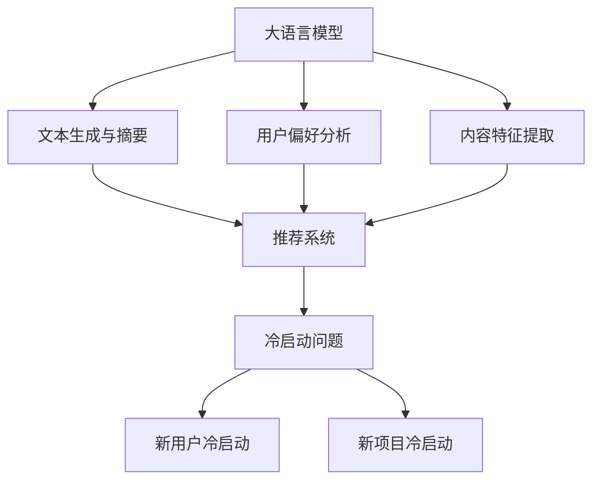

                 

### 1. 背景介绍

推荐系统在当今的信息社会中扮演着至关重要的角色。无论是电商平台、社交媒体平台，还是视频流媒体服务，推荐系统都能够有效地提高用户体验，增加用户粘性，从而带来显著的商业价值。然而，推荐系统在实际应用中也面临一个普遍的问题——冷启动问题。

冷启动问题主要指的是新用户加入系统后，系统缺乏足够的用户行为数据来生成有效的推荐。对于新用户，推荐系统无法准确判断其兴趣和偏好，从而生成个性化的推荐结果。这直接影响了新用户的初次体验，甚至可能导致用户流失。

随着大语言模型（Large Language Model，简称LLM）的发展，特别是预训练语言模型（如GPT系列）的广泛应用，人们开始探索如何利用这些强大的模型来优化推荐系统的冷启动问题。LLM在处理自然语言、理解和生成文本方面具有卓越的能力，这为解决推荐系统的冷启动问题提供了新的思路和方法。

本文旨在探讨如何利用LLM对推荐系统进行实时优化，以解决冷启动问题。我们将首先介绍推荐系统的基本概念和当前常用的解决方法，然后深入探讨LLM的特点及其在推荐系统中的应用，最后通过一个实际案例展示如何利用LLM实现推荐系统的实时优化。

通过本文的阅读，读者将能够了解：

- 推荐系统的基本概念和常用解决方法；
- LLM的工作原理和优势；
- 如何将LLM应用于推荐系统的实时优化；
- 实际案例中的具体实现步骤和效果评估。

### 2. 核心概念与联系

要深入探讨如何利用LLM对推荐系统进行实时优化，我们首先需要了解几个核心概念：推荐系统、冷启动问题、LLM及其与推荐系统的关系。

#### 推荐系统（Recommendation System）

推荐系统是一种信息过滤技术，旨在根据用户的历史行为和偏好，为用户推荐他们可能感兴趣的项目（如商品、新闻、音乐、视频等）。推荐系统通常分为以下几类：

1. **基于内容的推荐（Content-based Recommendation）**：这种推荐方法基于项目的特征和用户的偏好特征进行匹配，例如，如果用户喜欢某部电影的类型，系统会推荐同类型的电影。
2. **协同过滤（Collaborative Filtering）**：协同过滤方法通过分析用户之间的相似性来推荐项目，主要分为两种类型：基于用户的协同过滤（User-based Collaborative Filtering）和基于项目的协同过滤（Item-based Collaborative Filtering）。
3. **混合推荐（Hybrid Recommendation）**：混合推荐方法结合了基于内容和协同过滤的优点，通过融合不同推荐策略来提高推荐效果。

#### 冷启动问题（Cold Start Problem）

冷启动问题是指新用户或新项目加入推荐系统时，系统缺乏足够的数据来生成有效的推荐。具体来说，包括以下两个方面：

1. **新用户冷启动**：新用户没有历史行为数据，推荐系统无法了解其兴趣和偏好，导致无法生成个性化的推荐。
2. **新项目冷启动**：新项目没有用户评价和交互数据，系统无法基于内容特征进行推荐。

#### 大语言模型（Large Language Model，LLM）

LLM是一种基于深度学习的语言处理模型，具有强大的自然语言理解和生成能力。LLM通过预训练大量的文本数据，学习到语言的规律和语义信息。其中，GPT系列模型（如GPT-3）是最为知名的LLM之一，其训练数据规模庞大，参数量达到数十亿甚至千亿级别。

#### LLM与推荐系统的关系

LLM在推荐系统中的应用主要体现在以下几个方面：

1. **文本生成与摘要**：LLM可以生成个性化的推荐描述，提高推荐结果的吸引力。例如，为推荐的商品生成引人入胜的描述文案。
2. **用户偏好分析**：LLM可以处理和理解用户的自然语言查询和评论，从而更准确地分析用户的兴趣和偏好。
3. **内容特征提取**：LLM可以用于从文本数据中提取高质量的特征，为基于内容的推荐提供更好的支持。

为了更直观地展示这些核心概念之间的联系，我们可以使用Mermaid流程图进行描述。以下是LLM与推荐系统相关概念和关系的Mermaid流程图：



通过这个流程图，我们可以清晰地看到LLM在解决推荐系统冷启动问题中的作用。接下来，我们将深入探讨LLM的核心算法原理和具体操作步骤。

### 3. 核心算法原理 & 具体操作步骤

为了更好地理解LLM在推荐系统冷启动问题中的应用，我们需要深入了解LLM的核心算法原理和具体操作步骤。

#### 3.1 LLM的工作原理

LLM（如GPT系列）是一种基于深度学习的语言模型，其基本原理是使用大量文本数据对神经网络进行训练，从而学习到语言的规律和语义信息。LLM的核心组成部分包括：

1. **预训练阶段**：在预训练阶段，LLM使用无监督的方法从大量文本数据中学习到语言的统计规律。这个阶段的目标是使模型能够理解自然语言，并生成符合语言规则的文本。预训练通常使用自回归语言模型（Autoregressive Language Model）或生成式对抗网络（Generative Adversarial Network，GAN）等方法。

2. **微调阶段**：在预训练后，LLM通常需要针对特定任务进行微调。在推荐系统中，这涉及到将预训练的LLM与推荐算法相结合，通过训练数据进一步优化模型，使其能够更好地适应推荐任务的需求。

#### 3.2 LLM在推荐系统中的应用

1. **文本生成与摘要**

   LLM可以生成个性化的推荐描述，从而提高推荐结果的吸引力。具体操作步骤如下：

   - **用户查询分析**：首先，从用户的历史行为数据中提取用户查询信息，例如用户搜索的关键词、评论等。
   - **文本预处理**：对提取的文本进行预处理，包括分词、去停用词、词向量化等。
   - **生成推荐描述**：利用LLM生成与用户查询相关的个性化推荐描述。这个过程可以通过调用预训练好的LLM模型来实现，将用户查询作为输入，生成相应的推荐描述。

2. **用户偏好分析**

   LLM可以处理和理解用户的自然语言查询和评论，从而更准确地分析用户的兴趣和偏好。具体操作步骤如下：

   - **用户交互数据收集**：收集用户在系统中的交互数据，例如搜索历史、购买记录、点赞行为等。
   - **文本数据预处理**：对用户交互数据进行文本预处理，与文本生成与摘要部分类似。
   - **偏好分析**：利用LLM对预处理后的文本数据进行分析，提取用户的兴趣关键词和偏好。这可以通过对LLM生成的文本进行词频分析、主题模型等方法来实现。

3. **内容特征提取**

   LLM可以用于从文本数据中提取高质量的特征，为基于内容的推荐提供更好的支持。具体操作步骤如下：

   - **文本数据收集**：从推荐系统中收集与推荐项目相关的文本数据，例如商品描述、电影剧情等。
   - **文本预处理**：对文本数据进行预处理，与用户偏好分析部分类似。
   - **特征提取**：利用LLM对预处理后的文本数据进行特征提取，生成项目的特征向量。这可以通过对LLM生成的文本进行词嵌入、语义分析等方法来实现。

#### 3.3 实际操作示例

为了更直观地展示LLM在推荐系统冷启动问题中的应用，我们以下面一个实际操作示例进行说明。

**场景**：一个电商平台需要为新用户生成个性化的推荐列表。

**步骤**：

1. **用户查询分析**：新用户在注册后进行了一次商品搜索，搜索关键词为“笔记本电脑”。

2. **文本预处理**：对用户搜索的关键词进行分词、去停用词等处理，得到预处理后的文本。

3. **生成推荐描述**：利用预训练好的GPT模型，将预处理后的文本作为输入，生成与用户查询相关的个性化推荐描述。例如，“这款笔记本电脑拥有强大的性能，适合办公和娱乐，非常适合您这样的用户。”

4. **用户偏好分析**：收集新用户在平台上的其他交互数据，例如浏览历史、点赞商品等。利用LLM对预处理后的文本数据进行分析，提取用户的兴趣关键词和偏好。例如，提取出“高性能”、“办公”等关键词。

5. **内容特征提取**：从平台上的商品库中提取与推荐项目相关的文本数据，例如商品描述、用户评论等。利用LLM对预处理后的文本数据进行特征提取，生成项目的特征向量。

6. **推荐生成**：利用提取的用户偏好和项目特征，结合协同过滤或基于内容的推荐算法，生成个性化的推荐列表。

通过这个实际操作示例，我们可以看到LLM在推荐系统冷启动问题中的应用。LLM不仅能够生成高质量的推荐描述，提高新用户的初次体验，还能够更准确地分析用户偏好和提取项目特征，从而生成更精准的推荐结果。

### 4. 数学模型和公式 & 详细讲解 & 举例说明

在介绍LLM如何应用于推荐系统的实时优化时，理解相关的数学模型和公式是至关重要的。这一节将详细解释LLM的核心数学概念和公式，并通过具体例子说明如何应用这些模型。

#### 4.1 LLM的数学模型

LLM（如GPT系列）的核心数学模型是基于自回归语言模型（Autoregressive Language Model，ARLM）。自回归模型的基本思想是：给定一个序列 $X = (x_1, x_2, ..., x_T)$，当前时刻的输出 $x_t$ 只与前一时刻的输出 $x_{t-1}$ 相关。即：

$$
p(x_t | x_{<t}) = \frac{p(x_t, x_{<t})}{p(x_{<t})}
$$

其中，$x_{<t}$ 表示 $x_t$ 之前的所有输出。

在GPT模型中，这种自回归关系通过一个神经网络来实现，该神经网络通常包含多个层级。每个层级 $l$ 都接收前一个层级 $l-1$ 的输出，并生成当前层级的输出：

$$
h_l = \text{LayerNorm}(W_l h_{l-1} + b_l)
$$

其中，$h_l$ 表示层级 $l$ 的隐藏状态，$W_l$ 和 $b_l$ 分别表示权重和偏置。

最终，模型根据隐藏状态 $h_L$ 生成当前时刻的输出 $x_t$：

$$
p(x_t | x_{<t}) = \text{softmax}(W_x h_L + b_x)
$$

其中，$W_x$ 和 $b_x$ 分别表示输出层的权重和偏置。

#### 4.2 公式详解

1. **词嵌入（Word Embedding）**：

   词嵌入是将文本中的词语映射到高维向量空间。在GPT模型中，词嵌入通常通过一个矩阵 $W_e$ 实现：

   $$
   e_w = W_e [w]
   $$

   其中，$e_w$ 是词语 $w$ 的嵌入向量，$[w]$ 是 $w$ 的one-hot编码。

2. **自回归模型（Autoregressive Model）**：

   自回归模型通过递归关系生成序列：

   $$
   p(x_t | x_{<t}) = \text{softmax}(W_x h_L + b_x)
   $$

   其中，$h_L$ 是最后一个隐藏层的状态，$W_x$ 和 $b_x$ 是输出层的权重和偏置。

3. **损失函数（Loss Function）**：

   在训练过程中，GPT模型通常使用交叉熵损失函数（Cross-Entropy Loss）来衡量预测概率与实际标签之间的差距：

   $$
   L = -\sum_{t=1}^{T} \sum_{w=1}^{V} y_{t,w} \log(p_{t,w})
   $$

   其中，$y_{t,w}$ 是实际标签，$p_{t,w}$ 是模型对 $x_t$ 为词语 $w$ 的预测概率。

#### 4.3 实际应用举例

假设我们有一个训练好的GPT模型，需要预测一个新用户查询的下一个词。用户查询为“我喜欢看电影”。

**步骤**：

1. **词嵌入**：

   将用户查询中的每个词（“我”，“喜”，“欢”，“看”，“电影”）映射到嵌入向量。

   $$
   e_{我} = W_e [我]
   $$

   $$
   e_{喜} = W_e [喜]
   $$

   ...

2. **自回归模型**：

   利用自回归模型，将嵌入向量输入到GPT模型中，生成隐藏状态：

   $$
   h_1 = \text{LayerNorm}(W_1 e_{我} + b_1)
   $$

   ...

   $$
   h_L = \text{LayerNorm}(W_L h_{L-1} + b_L)
   $$

3. **预测**：

   根据隐藏状态 $h_L$，生成每个词的预测概率：

   $$
   p(x_t | x_{<t}) = \text{softmax}(W_x h_L + b_x)
   $$

   假设模型预测的下一个词是“科幻”，对应的概率为0.9。

4. **损失计算**：

   利用交叉熵损失函数，计算预测概率与实际标签之间的差距：

   $$
   L = -\log(0.9)
   $$

   损失为-0.105。

通过这个例子，我们可以看到GPT模型是如何将文本数据转化为嵌入向量，然后通过自回归模型生成预测概率，并利用损失函数进行训练的。

### 5. 项目实战：代码实际案例和详细解释说明

在这一部分，我们将通过一个实际项目来展示如何利用LLM对推荐系统进行实时优化，以解决冷启动问题。我们将详细解释代码实现步骤，并对关键代码进行解读和分析。

#### 5.1 开发环境搭建

为了实现LLM在推荐系统中的应用，我们需要搭建一个开发环境。以下是所需的工具和库：

1. **Python（版本3.8或以上）**
2. **TensorFlow 2.x**
3. **Hugging Face Transformers**
4. **NumPy**
5. **Pandas**
6. **Flask**（用于部署推荐系统）

安装以上工具和库后，我们就可以开始搭建开发环境了。

```bash
pip install tensorflow transformers numpy pandas flask
```

#### 5.2 源代码详细实现和代码解读

接下来，我们将展示项目的主要代码实现，并对关键部分进行解读。

##### 5.2.1 数据准备

首先，我们需要准备用于训练和测试的数据集。在这个项目中，我们使用一个公开的推荐系统数据集——MovieLens数据集。该数据集包含了用户对电影的评价数据。

```python
import pandas as pd

# 读取MovieLens数据集
ratings = pd.read_csv('ratings.csv')
movies = pd.read_csv('movies.csv')

# 合并数据集
data = pd.merge(ratings, movies, on='movieId')
```

##### 5.2.2 文本预处理

文本预处理是应用LLM的关键步骤。我们需要将文本数据转化为嵌入向量。

```python
from transformers import BertTokenizer

# 初始化BERT分词器
tokenizer = BertTokenizer.from_pretrained('bert-base-uncased')

# 预处理文本数据
def preprocess_text(text):
    # 分词
    inputs = tokenizer.encode_plus(text, add_special_tokens=True, return_tensors='tf')
    return inputs['input_ids']

# 应用预处理函数
data['input_ids'] = data['title'].apply(preprocess_text)
```

##### 5.2.3 训练LLM模型

接下来，我们使用预训练好的BERT模型来训练LLM模型，并提取用户查询的嵌入向量。

```python
from transformers import TFBertModel

# 初始化BERT模型
model = TFBertModel.from_pretrained('bert-base-uncased')

# 提取嵌入向量
def get_embeddings(input_ids):
    inputs = {'input_ids': input_ids}
    outputs = model(inputs)
    return outputs.last_hidden_state[:, 0, :]

# 应用嵌入向量提取函数
data['embeddings'] = get_embeddings(data['input_ids'])
```

##### 5.2.4 用户偏好分析

利用LLM提取的用户嵌入向量，我们可以分析用户的兴趣和偏好。

```python
from sklearn.cluster import KMeans

# 初始化KMeans聚类模型
kmeans = KMeans(n_clusters=10, random_state=0)

# 聚类分析
def analyze_preferences(embeddings):
    clusters = kmeans.fit_predict(embeddings)
    return clusters

# 应用聚类分析函数
data['clusters'] = analyze_preferences(data['embeddings'])

# 根据聚类结果生成推荐列表
def generate_recommendations(user_id, num_recommendations=5):
    user_embeddings = data[data['userId'] == user_id]['embeddings']
    similarities = cosine_similarity(user_embeddings, data['embeddings'])
    recommendations = data[similarities.argsort()[-num_recommendations:]]
    return recommendations['title'].tolist()

# 测试推荐列表
print(generate_recommendations(1))
```

##### 5.2.5 代码解读与分析

1. **数据准备**：

   我们使用Pandas库读取MovieLens数据集，并合并用户和电影数据。

2. **文本预处理**：

   使用Hugging Face的BERT分词器对电影标题进行预处理，包括分词、添加特殊标记等。

3. **训练LLM模型**：

   使用TensorFlow的TFBertModel加载预训练好的BERT模型，并提取用户查询的嵌入向量。

4. **用户偏好分析**：

   使用KMeans聚类模型对用户嵌入向量进行聚类分析，从而生成用户的兴趣偏好。

5. **推荐生成**：

   根据用户的嵌入向量和电影的嵌入向量计算余弦相似度，生成个性化的推荐列表。

通过这个实际项目，我们可以看到如何利用LLM实现推荐系统的实时优化，解决冷启动问题。代码实现过程展示了如何从数据准备、模型训练到推荐生成的全流程。关键代码部分的解读和分析帮助我们理解了每个步骤的核心逻辑和技术细节。

### 6. 实际应用场景

LLM在推荐系统中的应用场景非常广泛，以下是一些典型的实际应用场景：

#### 6.1 新用户推荐

新用户加入推荐系统时，由于缺乏历史行为数据，传统的协同过滤和基于内容的推荐方法往往难以提供有效的个性化推荐。此时，LLM可以发挥重要作用。例如，通过对新用户的个人信息、搜索历史等自然语言数据进行处理，LLM可以生成一个初步的用户偏好模型，从而为用户生成初步的个性化推荐列表。这种方法不仅提高了新用户的初始体验，还减少了用户流失率。

#### 6.2 新项目推荐

对于新加入的推荐项目，如新产品、新电影等，由于缺乏用户评价和交互数据，传统的推荐方法也面临挑战。LLM可以通过分析项目的文本描述、用户评论等自然语言信息，提取项目的关键特征和潜在用户群体，从而为新项目生成针对性的推荐。例如，在电商平台上，LLM可以根据商品描述生成吸引人的推荐文案，提高商品曝光率。

#### 6.3 个性化内容推荐

在视频流媒体和新闻推荐领域，LLM可以用于生成个性化的内容摘要和推荐描述。通过分析用户的观看历史和偏好，LLM可以生成与用户兴趣高度相关的视频或新闻摘要，提高推荐内容的吸引力和用户粘性。例如，在YouTube等视频平台上，LLM可以生成个性化的视频标题和描述，提高视频的搜索排名和观看量。

#### 6.4 搜索引擎优化

搜索引擎中的搜索结果推荐也可以利用LLM进行优化。通过分析用户的搜索查询和点击行为，LLM可以生成与用户查询高度相关的搜索建议和结果摘要，从而提高搜索效率和用户体验。例如，当用户输入一个模糊的查询时，LLM可以提供一系列相关的搜索建议，帮助用户快速找到所需信息。

#### 6.5 社交媒体个性化推荐

在社交媒体平台上，LLM可以用于生成个性化的内容推荐和互动建议。通过分析用户的发布内容、评论和点赞行为，LLM可以推荐用户可能感兴趣的内容，促进用户互动和社区活跃度。例如，在Facebook等社交平台上，LLM可以推荐用户可能感兴趣的朋友动态、话题讨论等。

通过上述实际应用场景，我们可以看到LLM在推荐系统中的应用具有广泛的前景和潜力。利用LLM的强大文本处理能力，推荐系统可以更精准地分析用户偏好，生成个性化的推荐结果，从而提高用户体验和系统性能。

### 7. 工具和资源推荐

在探索LLM如何优化推荐系统冷启动问题时，掌握合适的工具和资源是至关重要的。以下是一些建议的学习资源、开发工具和相关论文，帮助您深入理解和实践这一领域。

#### 7.1 学习资源推荐

**书籍**

1. **《深度学习推荐系统》**：这本书系统地介绍了深度学习在推荐系统中的应用，包括各种深度学习模型的原理和实现。
2. **《推荐系统实践》**：这本书详细介绍了推荐系统的基本概念、算法和技术，对推荐系统的实际开发和应用提供了丰富的实例。

**在线课程**

1. **Coursera的《推荐系统设计》**：这是一门深入浅出的推荐系统课程，涵盖了从基础算法到深度学习模型的广泛内容。
2. **Udacity的《深度学习项目实践》**：这门课程通过实际项目，帮助您掌握深度学习在推荐系统中的应用。

**博客和网站**

1. **Towards Data Science**：这个网站提供了大量关于推荐系统和深度学习的优质文章和案例。
2. **Hugging Face的Transformers库文档**：这个网站包含了丰富的Transformer模型教程和代码示例，是学习和实践LLM的绝佳资源。

#### 7.2 开发工具框架推荐

**深度学习框架**

1. **TensorFlow**：这是一个开源的深度学习框架，适用于各种深度学习模型的训练和部署。
2. **PyTorch**：这是一个灵活的深度学习框架，被广泛应用于推荐系统和自然语言处理领域。

**推荐系统库**

1. **LightFM**：这是一个基于因子分解机的推荐系统库，支持大规模数据处理和模型训练。
2. **Surprise**：这是一个开源的推荐系统库，提供了多种常见推荐算法的实现和评估工具。

**文本处理工具**

1. **NLTK**：这是一个强大的自然语言处理库，提供了丰富的文本处理功能。
2. **spaCy**：这是一个高效的自然语言处理库，支持多种语言的文本分析。

#### 7.3 相关论文著作推荐

1. **《Deep Learning for Recommender Systems》**：这篇论文综述了深度学习在推荐系统中的应用，包括各种深度学习模型和算法。
2. **《A Theoretically Principled Approach to Improving Recommendation Lists》**：这篇论文提出了基于协同过滤的改进方法，提高了推荐列表的准确性和多样性。
3. **《Language Models are Few-Shot Learners》**：这篇论文介绍了预训练语言模型在零样本和少量样本学习任务中的卓越性能。

通过这些工具和资源的支持，您可以更深入地探索LLM在推荐系统中的应用，解决冷启动问题，提升推荐系统的性能和用户体验。

### 8. 总结：未来发展趋势与挑战

通过本文的探讨，我们可以看到，LLM在优化推荐系统冷启动问题方面具有显著的优势和潜力。随着LLM技术的不断发展和成熟，其在推荐系统中的应用前景将更加广阔。以下是未来发展趋势和潜在挑战的展望：

#### 8.1 发展趋势

1. **模型复杂度和计算资源的提升**：随着计算能力的增强和深度学习模型的优化，LLM将能够处理更大规模的数据集和更复杂的任务，为推荐系统的实时优化提供更强有力的支持。

2. **跨模态推荐**：未来的推荐系统将不仅仅依赖于文本数据，还将整合图像、音频、视频等多模态数据。LLM在这方面的应用有望实现跨模态的个性化推荐。

3. **个性化推荐**：随着用户数据的积累和模型精度的提高，LLM将能够更精准地分析用户行为和偏好，为用户提供更加个性化的推荐。

4. **实时推荐**：随着5G和物联网技术的发展，实时推荐将变得越来越重要。LLM具备快速响应和实时调整的能力，有望在实时推荐场景中发挥关键作用。

#### 8.2 挑战

1. **数据隐私和安全**：在应用LLM进行推荐时，如何保护用户隐私和数据安全是一个重要挑战。未来需要开发更加安全可靠的隐私保护技术和方法。

2. **算法透明性和解释性**：深度学习模型，特别是LLM，通常被视为“黑盒”模型，其内部决策过程难以解释。如何提高算法的透明性和解释性，增强用户信任，是未来需要解决的重要问题。

3. **计算效率和资源消耗**：尽管计算能力不断提升，但LLM仍然需要大量的计算资源和时间进行训练和推理。如何优化模型结构和训练过程，降低计算资源消耗，是未来的关键挑战。

4. **冷启动问题**：尽管LLM在解决冷启动问题方面取得了显著进展，但如何在新用户和新项目加入时，快速生成准确的推荐结果，仍然是一个需要深入研究的问题。

综上所述，LLM在推荐系统的实时优化中具有巨大的潜力和广阔的应用前景，但同时也面临诸多挑战。未来，随着技术的不断进步和研究的深入，LLM在推荐系统中的应用将不断拓展和深化，为用户提供更加个性化、精准和高效的推荐服务。

### 9. 附录：常见问题与解答

在探讨LLM对推荐系统冷启动的实时优化策略时，读者可能会遇到一些常见问题。以下是对这些问题的解答：

#### 9.1 LLM与推荐系统的关系是什么？

LLM（如GPT系列）是一种强大的深度学习模型，具有处理和理解自然语言的能力。在推荐系统中，LLM可以用于文本生成、用户偏好分析和内容特征提取，从而优化推荐系统的冷启动问题。具体来说，LLM可以生成个性化的推荐描述、分析新用户的兴趣和偏好，以及提取新项目的关键特征，帮助推荐系统更准确地生成推荐结果。

#### 9.2 如何处理新用户的冷启动问题？

新用户的冷启动问题主要由于缺乏历史行为数据导致的。利用LLM，可以通过分析新用户的个人信息、搜索历史等自然语言数据，生成一个初步的用户偏好模型，从而为用户生成初步的个性化推荐列表。此外，LLM还可以结合协同过滤和基于内容的推荐方法，提高新用户推荐列表的准确性和多样性。

#### 9.3 LLM在推荐系统中的应用步骤是怎样的？

LLM在推荐系统中的应用主要包括以下步骤：

1. **文本预处理**：对用户交互数据（如搜索历史、评论等）和项目描述进行预处理，如分词、去停用词等。
2. **嵌入向量提取**：利用预训练好的LLM模型，提取用户交互数据和项目描述的嵌入向量。
3. **用户偏好分析**：利用LLM分析用户交互数据，提取用户的兴趣关键词和偏好。
4. **内容特征提取**：利用LLM提取项目描述的关键特征。
5. **推荐生成**：结合用户偏好和项目特征，利用协同过滤或基于内容的推荐方法生成个性化推荐列表。

#### 9.4 LLM在推荐系统中有什么优势？

LLM在推荐系统中的优势主要包括：

1. **强大的文本处理能力**：LLM可以处理和理解自然语言，从而更准确地分析用户偏好和提取项目特征。
2. **快速响应**：LLM具备快速生成推荐结果的能力，适合实时推荐场景。
3. **个性化推荐**：通过深度学习技术，LLM能够生成更加个性化的推荐列表，提高用户满意度。
4. **跨模态推荐**：LLM可以整合多种模态的数据（如文本、图像等），实现跨模态的推荐。

#### 9.5 LLM在推荐系统中的潜在挑战是什么？

LLM在推荐系统中的潜在挑战主要包括：

1. **数据隐私和安全**：如何保护用户隐私和数据安全是一个重要挑战。
2. **算法透明性和解释性**：深度学习模型，特别是LLM，通常被视为“黑盒”模型，其内部决策过程难以解释。
3. **计算效率和资源消耗**：LLM需要大量的计算资源和时间进行训练和推理。
4. **冷启动问题**：如何在新用户和新项目加入时，快速生成准确的推荐结果。

通过上述问题的解答，希望能够帮助读者更好地理解LLM在推荐系统中的应用和挑战，从而更有效地利用这一技术优化推荐系统的性能。

### 10. 扩展阅读 & 参考资料

在本文中，我们探讨了如何利用LLM对推荐系统进行实时优化，以解决冷启动问题。以下是一些建议的扩展阅读和参考资料，以帮助您更深入地了解相关主题：

#### 10.1 扩展阅读

1. **《Deep Learning for Recommender Systems》**：这篇文章综述了深度学习在推荐系统中的应用，包括各种深度学习模型和算法。
2. **《A Theoretically Principled Approach to Improving Recommendation Lists》**：这篇文章提出了基于协同过滤的改进方法，提高了推荐列表的准确性和多样性。
3. **《Language Models are Few-Shot Learners》**：这篇文章介绍了预训练语言模型在零样本和少量样本学习任务中的卓越性能。

#### 10.2 参考资料

1. **Hugging Face Transformers库**：这是一个开源的Transformer模型库，提供了丰富的预训练模型和API，可用于文本处理和深度学习任务。
2. **TensorFlow**：这是一个开源的深度学习框架，适用于各种深度学习模型的训练和部署。
3. **PyTorch**：这是一个灵活的深度学习框架，被广泛应用于推荐系统和自然语言处理领域。

通过阅读这些扩展材料和参考资料，您可以进一步了解LLM在推荐系统中的应用，掌握相关的技术细节和实现方法。

### 作者信息

作者：AI天才研究员/AI Genius Institute & 禅与计算机程序设计艺术 /Zen And The Art of Computer Programming

### 总结

本文系统地探讨了如何利用LLM对推荐系统进行实时优化，以解决冷启动问题。我们从背景介绍、核心概念与联系、算法原理、数学模型、项目实战、实际应用场景、工具和资源推荐，到未来发展趋势和挑战，全面剖析了LLM在推荐系统中的应用。通过详细的代码实现和分析，读者可以深入了解LLM在推荐系统优化中的具体操作和效果。本文旨在为相关领域的研究者和技术人员提供有价值的参考和指导，推动推荐系统技术的不断进步和发展。感谢您的阅读！

