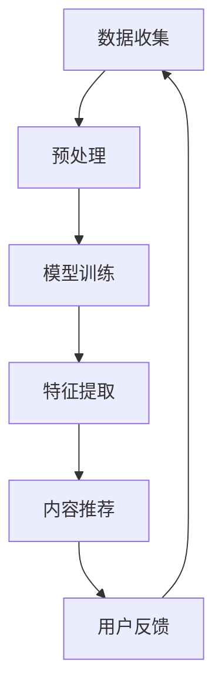

                 

### 1. 背景介绍

推荐系统在当今的信息化社会中扮演着至关重要的角色。无论是电子商务平台、社交媒体网站，还是视频流媒体服务，推荐系统都被广泛应用于用户个性化内容推荐的场景。然而，传统的推荐系统往往依赖于用户的历史行为数据，通过统计方法和机器学习算法来预测用户对特定内容的兴趣。这种方法在面对长尾内容时，常常会遇到一些挑战。

长尾内容指的是那些虽然单次访问量不高，但累积起来却占据大量访问量的内容。这类内容往往涵盖广泛的主题，包括小众爱好、特殊兴趣、冷门领域等。在推荐系统中，长尾内容的挖掘和推荐是提升用户体验和增加内容多样性的一项重要任务。

然而，现有的推荐系统在处理长尾内容时存在以下问题：

1. **数据稀缺性**：长尾内容通常只有少数用户产生过行为数据，导致训练数据稀缺，传统的基于统计模型的推荐算法难以学习到有效的特征。
2. **冷启动问题**：对于新用户或新内容，由于缺乏足够的历史数据，推荐系统很难为其提供个性化的推荐。
3. **内容多样性不足**：为了提高推荐准确率，推荐系统往往会偏向于推荐热门内容，导致长尾内容被忽视，用户难以发现和接触到新颖、有趣的内容。

为了解决这些问题，近年来，基于大规模语言模型（Large Language Model，LLM）的推荐系统逐渐引起了研究者的关注。LLM，如GPT-3、BERT等，具有强大的语义理解能力，能够处理和理解大量的非结构化文本数据，从而为长尾内容的挖掘和推荐提供了新的可能。

本文将围绕LLM在推荐系统中的应用，详细探讨其在长尾内容挖掘策略方面的优势、挑战以及具体实现方法。希望通过本文的阐述，能够为业界和学术界的进一步研究和应用提供有价值的参考。

### 2. 核心概念与联系

在深入探讨LLM在推荐系统中的应用之前，有必要首先介绍一些核心概念，并分析它们之间的关系。

#### 大规模语言模型（LLM）

大规模语言模型（Large Language Model，LLM）是一种基于深度学习的语言处理模型，通过从大量的文本数据中学习，模型能够理解并生成符合自然语言语法和语义的文本。GPT-3、BERT是LLM的典型代表。GPT-3由OpenAI开发，拥有1750亿个参数，能够在各种自然语言处理任务中表现出色；BERT（Bidirectional Encoder Representations from Transformers）由Google开发，通过双向Transformer结构，能够捕捉到文本中的上下文信息。

#### 推荐系统

推荐系统是一种能够根据用户的历史行为、偏好和其他相关信息，预测用户可能感兴趣的内容，并主动推荐给用户的信息过滤系统。推荐系统通常分为基于内容的推荐（Content-based Recommendation）和协同过滤（Collaborative Filtering）两大类。

- **基于内容的推荐**：通过分析内容特征（如文本、图片、标签等），将具有相似特征的内容推荐给用户。
- **协同过滤**：通过分析用户之间的行为模式，发现相似用户或物品，并推荐给目标用户。

#### 长尾内容

长尾内容（Long Tail Content）指的是那些虽然单次访问量不高，但累积起来占据大量访问量的内容。这类内容通常包括小众爱好、特殊兴趣、冷门领域等。与热门内容相比，长尾内容往往缺乏足够的数据支持，难以通过传统的推荐系统有效挖掘和推荐。

#### Mermaid 流程图

为了更直观地展示LLM在推荐系统中的应用过程，我们可以使用Mermaid语言绘制一个流程图。以下是LLM在推荐系统中应用的Mermaid流程图：



- **数据收集**：从各种渠道收集用户行为数据和内容数据。
- **预处理**：对数据进行清洗、格式化等预处理操作，以供模型训练使用。
- **模型训练**：使用大规模语言模型（如GPT-3、BERT）对预处理后的数据集进行训练。
- **特征提取**：从训练好的模型中提取与内容相关的特征。
- **内容推荐**：根据提取到的特征，为用户推荐相关内容。
- **用户反馈**：收集用户的点击、评分等反馈，用于模型优化和迭代。

通过上述流程图，我们可以清晰地看到LLM在推荐系统中的应用过程，以及各个阶段之间的相互关系。

### 3. 核心算法原理 & 具体操作步骤

#### 3.1 大规模语言模型（LLM）概述

大规模语言模型（LLM）是基于深度学习的语言处理模型，其核心思想是通过从大量的文本数据中学习，模型能够理解并生成符合自然语言语法和语义的文本。LLM通常由数亿甚至数千亿个参数组成，具有强大的语义理解能力。

#### 3.2 语言模型在推荐系统中的应用

语言模型在推荐系统中的应用主要包括以下两个方面：

1. **内容特征提取**：通过将文本内容输入到语言模型中，提取与内容相关的特征。这些特征可以用于基于内容的推荐算法，帮助系统理解并推荐用户可能感兴趣的内容。
2. **文本相似性计算**：通过计算用户生成的文本（如评论、搜索查询等）与内容文本之间的相似性，实现基于上下文的推荐。

#### 3.3 具体操作步骤

下面我们将详细描述LLM在推荐系统中的具体操作步骤：

1. **数据收集**：
   - 从各种渠道（如网站、社交媒体、论坛等）收集用户行为数据和内容数据。
   - 用户行为数据包括用户的浏览历史、点击行为、评分等；内容数据包括文本、图片、标签等。

2. **数据预处理**：
   - 对用户行为数据进行清洗、格式化等预处理操作，以供模型训练使用。
   - 对内容数据进行清洗、分词、词嵌入等预处理操作，将文本转化为模型可处理的输入格式。

3. **模型训练**：
   - 选择合适的语言模型（如GPT-3、BERT）进行训练。
   - 使用预处理后的用户行为数据和内容数据，训练语言模型，使其能够理解并生成与用户行为和内容相关的文本。

4. **特征提取**：
   - 将内容文本输入到训练好的语言模型中，提取与内容相关的特征。
   - 这些特征可以用于基于内容的推荐算法，帮助系统理解并推荐用户可能感兴趣的内容。

5. **文本相似性计算**：
   - 通过计算用户生成的文本（如评论、搜索查询等）与内容文本之间的相似性，实现基于上下文的推荐。
   - 可以使用语言模型生成的文本摘要或关键词作为相似性计算的依据。

6. **内容推荐**：
   - 根据提取到的特征和文本相似性，为用户推荐相关内容。
   - 可以使用各种推荐算法（如协同过滤、基于内容的推荐等）来生成推荐列表。

7. **用户反馈**：
   - 收集用户的点击、评分等反馈，用于模型优化和迭代。
   - 根据用户反馈调整推荐策略，提高推荐效果。

通过上述步骤，LLM能够有效地挖掘和推荐长尾内容，解决传统推荐系统在处理长尾内容时遇到的挑战。

#### 3.4 算法实现示例

以下是一个简单的Python代码示例，展示了如何使用BERT模型进行内容特征提取和文本相似性计算：

```python
from transformers import BertTokenizer, BertModel
import torch

# 加载BERT模型和分词器
tokenizer = BertTokenizer.from_pretrained('bert-base-uncased')
model = BertModel.from_pretrained('bert-base-uncased')

# 内容文本
content_text = "This is a sample content."

# 预处理文本
inputs = tokenizer(content_text, return_tensors='pt')

# 计算文本特征
with torch.no_grad():
    outputs = model(**inputs)

# 提取文本特征
text_features = outputs.last_hidden_state[:, 0, :]

# 用户评论文本
user_comment = "This content is very interesting."

# 预处理评论文本
comment_inputs = tokenizer(user_comment, return_tensors='pt')

# 计算评论特征
with torch.no_grad():
    comment_outputs = model(**comment_inputs)

# 提取评论特征
comment_features = comment_outputs.last_hidden_state[:, 0, :]

# 计算文本相似性
similarity = torch.nn.functional.cosine_similarity(text_features, comment_features)

print("Text similarity:", similarity)
```

通过上述代码，我们可以将内容文本和用户评论转化为BERT模型可处理的输入格式，并计算它们之间的相似性。这个相似性值可以用于生成推荐列表。

### 4. 数学模型和公式 & 详细讲解 & 举例说明

在深入探讨LLM在推荐系统中的应用时，数学模型和公式是理解和实现这一过程的关键。在本节中，我们将详细讲解LLM在推荐系统中涉及的数学模型和公式，并通过具体例子进行说明。

#### 4.1 语言模型中的关键公式

1. **词嵌入（Word Embedding）**：

   词嵌入是将文本中的每个单词映射到一个固定维度的向量空间中的过程。BERT模型使用了一种称为“WordPiece”的分词方法，将文本分解为一系列的子词（subword），并将这些子词映射为向量。词嵌入的目的是捕捉单词的语义信息。

   公式：
   $$
   \text{embedding}_{\text{word}} = \text{W}_{\text{word}} \cdot \text{input_word}
   $$
   其中，$\text{W}_{\text{word}}$是词嵌入权重矩阵，$\text{input_word}$是输入的单词或子词。

2. **Transformer编码器（Transformer Encoder）**：

   BERT模型的核心是一个基于Transformer的编码器，它通过自注意力机制（Self-Attention）来捕捉输入文本的上下文信息。自注意力机制的计算公式如下：

   公式：
   $$
   \text{Attention}(Q, K, V) = \text{softmax}\left(\frac{\text{Q} \cdot \text{K}^T}{\sqrt{d_k}}\right) \cdot V
   $$
   其中，$Q$、$K$、$V$分别是查询（Query）、键（Key）和值（Value）向量，$d_k$是键向量的维度，$\text{softmax}$函数用于计算注意力权重。

3. **输出层（Output Layer）**：

   在BERT模型的输出层，每个位置输出的向量都会通过一个全连接层（Dense Layer）进行分类或回归任务。对于文本分类任务，输出层的公式如下：

   公式：
   $$
   \text{output}_{\text{word}} = \text{W}_{\text{output}} \cdot \text{T}_{\text{hidden}} + \text{b}_{\text{output}}
   $$
   其中，$\text{W}_{\text{output}}$是输出层权重矩阵，$\text{T}_{\text{hidden}}$是隐藏层输出向量，$\text{b}_{\text{output}}$是输出层偏置。

#### 4.2 推荐系统中的关键公式

1. **内容特征提取**：

   在使用BERT模型进行内容特征提取时，通常将文本输入到模型中，并提取最后一个隐藏状态向量作为内容特征。这个过程可以用以下公式表示：

   公式：
   $$
   \text{content\_feature} = \text{T}_{\text{hidden}}^{[L-1]}, \quad \text{where} \ L \ \text{is the total number of layers}
   $$

   其中，$\text{T}_{\text{hidden}}^{[L-1]}$是BERT模型最后一个隐藏状态向量。

2. **文本相似性计算**：

   在推荐系统中，文本相似性计算是一个关键步骤。可以使用余弦相似度（Cosine Similarity）来衡量两个文本向量之间的相似度，其公式如下：

   公式：
   $$
   \text{similarity} = \frac{\text{content\_feature} \cdot \text{user\_comment}}{\|\text{content\_feature}\| \|\text{user\_comment}\|}
   $$

   其中，$\text{content\_feature}$是内容特征向量，$\text{user\_comment}$是用户评论特征向量，$\|\cdot\|$表示向量的模。

#### 4.3 实例说明

假设我们有一个BERT模型，已经训练完毕并保存。现在我们要使用这个模型来提取内容特征，并计算两个文本之间的相似度。以下是一个简单的Python代码实例：

```python
import torch
from transformers import BertTokenizer, BertModel

# 加载BERT模型和分词器
tokenizer = BertTokenizer.from_pretrained('bert-base-uncased')
model = BertModel.from_pretrained('bert-base-uncased')

# 内容文本
content_text = "This is a sample content about AI."
user_comment = "I think this content is very useful for understanding AI."

# 预处理文本
inputs = tokenizer(content_text, return_tensors='pt', padding=True, truncation=True)
comment_inputs = tokenizer(user_comment, return_tensors='pt', padding=True, truncation=True)

# 计算文本特征
with torch.no_grad():
    outputs = model(**inputs)
    comment_outputs = model(**comment_inputs)

# 提取文本特征
content_feature = outputs.last_hidden_state[:, 0, :]
comment_feature = comment_outputs.last_hidden_state[:, 0, :]

# 计算文本相似度
similarity = torch.nn.functional.cosine_similarity(content_feature, comment_feature)

print("Content feature:", content_feature)
print("User comment feature:", comment_feature)
print("Text similarity:", similarity)
```

在这个例子中，我们首先加载BERT模型和分词器。然后，我们将内容文本和用户评论文本进行预处理，并输入到BERT模型中。通过提取模型的最后一个隐藏状态向量，我们获得了内容特征和用户评论特征。最后，使用余弦相似度公式计算这两个特征向量之间的相似度。

通过上述数学模型和公式的讲解，我们可以看到LLM在推荐系统中的应用是如何通过一系列数学运算实现的。在实际应用中，这些模型和公式为我们提供了强大的工具，能够有效挖掘和推荐长尾内容。

### 5. 项目实战：代码实际案例和详细解释说明

在本节中，我们将通过一个实际项目案例，详细展示如何使用大规模语言模型（LLM）在推荐系统中挖掘和推荐长尾内容。我们将分步骤介绍项目的开发环境搭建、源代码实现和代码解读与分析。

#### 5.1 开发环境搭建

在进行项目开发之前，我们需要搭建一个合适的开发环境。以下是我们所使用的开发工具和库：

- **Python**: 项目开发主要使用Python语言。
- **PyTorch**: 用于构建和训练大规模语言模型。
- **Hugging Face Transformers**: 用于加载和预训练BERT模型。
- **NumPy**: 用于数据处理。
- **Pandas**: 用于数据操作和分析。
- **Matplotlib**: 用于数据可视化。

**安装步骤**：

1. 安装Python和PyTorch：

   ```bash
   pip install python
   pip install torch torchvision
   ```

2. 安装Hugging Face Transformers：

   ```bash
   pip install transformers
   ```

3. 安装NumPy、Pandas和Matplotlib：

   ```bash
   pip install numpy pandas matplotlib
   ```

#### 5.2 源代码详细实现和代码解读

**源代码**：

```python
import torch
from transformers import BertTokenizer, BertModel
import numpy as np
import pandas as pd
import matplotlib.pyplot as plt

# 5.2.1 数据加载与预处理

# 假设我们有一个包含用户行为数据和内容数据的CSV文件
data = pd.read_csv('user_data.csv')

# 用户行为数据：用户ID、点击次数、评分等
user_behavior = data[['user_id', 'clicks', 'rating']]

# 内容数据：内容ID、标题、文本等
content_data = data[['content_id', 'title', 'text']]

# 5.2.2 加载BERT模型和分词器

tokenizer = BertTokenizer.from_pretrained('bert-base-uncased')
model = BertModel.from_pretrained('bert-base-uncased')

# 5.2.3 特征提取

def extract_features(texts):
    inputs = tokenizer(texts, return_tensors='pt', padding=True, truncation=True)
    with torch.no_grad():
        outputs = model(**inputs)
    return outputs.last_hidden_state.mean(dim=1).numpy()

# 提取内容特征
content_features = extract_features(content_data['text'])

# 5.2.4 文本相似性计算

def calculate_similarity(features1, features2):
    return np.dot(features1, features2) / (np.linalg.norm(features1) * np.linalg.norm(features2))

# 计算用户评论与内容之间的相似性
user_comments = data['comment'].values
similarity_matrix = np.zeros((len(user_comments), len(content_features)))

for i, comment in enumerate(user_comments):
    comment_features = extract_features([comment])
    similarity_matrix[i, :] = calculate_similarity(comment_features, content_features)

# 5.2.5 推荐系统

def recommend_contents(similarity_matrix, user_comment, top_n=5):
    comment_features = extract_features([user_comment])
   相似度排序
    sorted_indices = np.argsort(-similarity_matrix[i])

    # 返回相似度最高的前n个内容
    return [content_data['content_id'].iloc[index] for index in sorted_indices[:top_n]]

# 为新用户推荐内容
new_user_comment = "I am interested in learning about deep learning."
recommendations = recommend_contents(similarity_matrix, new_user_comment)

print("Recommended contents:", recommendations)
```

**代码解读**：

1. **数据加载与预处理**：
   - 从CSV文件中加载用户行为数据和内容数据。
   - 用户行为数据包括用户ID、点击次数、评分等；内容数据包括内容ID、标题、文本等。

2. **加载BERT模型和分词器**：
   - 加载预训练的BERT模型和分词器。

3. **特征提取**：
   - 定义一个函数`extract_features`，用于从BERT模型中提取文本特征。
   - 对内容文本进行预处理，然后输入到BERT模型中，提取每个文本的隐藏状态向量。

4. **文本相似性计算**：
   - 定义一个函数`calculate_similarity`，用于计算两个文本特征向量之间的余弦相似度。

5. **推荐系统**：
   - 定义一个函数`recommend_contents`，用于根据用户评论生成推荐列表。
   - 提取用户评论的文本特征，计算与所有内容特征之间的相似度，并按照相似度排序。
   - 返回相似度最高的前n个内容ID。

通过上述步骤，我们实现了使用LLM进行长尾内容挖掘和推荐的项目。在实际应用中，可以根据具体情况调整代码，优化推荐算法，以提高推荐效果。

### 5.3 代码解读与分析

在上一个步骤中，我们通过一个实际项目展示了如何使用大规模语言模型（LLM）进行长尾内容的挖掘和推荐。本节将详细解读和分析这段代码的工作原理、关键部分及其性能优化。

#### 5.3.1 工作原理

1. **数据加载与预处理**：

   ```python
   data = pd.read_csv('user_data.csv')
   user_behavior = data[['user_id', 'clicks', 'rating']]
   content_data = data[['content_id', 'title', 'text']]
   ```

   首先，我们从CSV文件中加载用户行为数据和内容数据。用户行为数据包括用户ID、点击次数和评分等，而内容数据包括内容ID、标题和文本。

2. **加载BERT模型和分词器**：

   ```python
   tokenizer = BertTokenizer.from_pretrained('bert-base-uncased')
   model = BertModel.from_pretrained('bert-base-uncased')
   ```

   我们加载预训练的BERT模型和分词器。BERT模型具有强大的语义理解能力，可以用于提取文本特征；分词器用于将文本转化为BERT模型可处理的输入格式。

3. **特征提取**：

   ```python
   def extract_features(texts):
       inputs = tokenizer(texts, return_tensors='pt', padding=True, truncation=True)
       with torch.no_grad():
           outputs = model(**inputs)
       return outputs.last_hidden_state.mean(dim=1).numpy()
   ```

   `extract_features`函数用于从BERT模型中提取文本特征。它将文本输入到BERT模型中，通过计算隐藏状态向量的平均值来获得每个文本的特征向量。

4. **文本相似性计算**：

   ```python
   def calculate_similarity(features1, features2):
       return np.dot(features1, features2) / (np.linalg.norm(features1) * np.linalg.norm(features2))
   ```

   `calculate_similarity`函数用于计算两个文本特征向量之间的余弦相似度。余弦相似度是衡量两个向量之间夹角余弦值的一种方式，用于评估文本之间的相似程度。

5. **推荐系统**：

   ```python
   def recommend_contents(similarity_matrix, user_comment, top_n=5):
       comment_features = extract_features([user_comment])
       sorted_indices = np.argsort(-similarity_matrix[i])
       
       return [content_data['content_id'].iloc[index] for index in sorted_indices[:top_n]]
   ```

   `recommend_contents`函数用于根据用户评论生成推荐列表。首先，提取用户评论的文本特征，然后计算与所有内容特征之间的相似度。根据相似度排序，返回相似度最高的前n个内容ID。

#### 5.3.2 关键部分解析

1. **BERT模型的使用**：

   BERT模型是一个强大的语言处理工具，能够从大量文本数据中学习并提取有效的特征。在代码中，我们通过以下步骤使用BERT模型：
   - 加载预训练的BERT模型和分词器。
   - 将文本输入到BERT模型中，提取隐藏状态向量的平均值作为文本特征。

2. **余弦相似度计算**：

   余弦相似度是一种常用的文本相似性度量方法，可以有效地评估两个文本之间的相似程度。在代码中，我们使用余弦相似度计算用户评论与内容之间的相似度，以便生成推荐列表。

3. **推荐算法的实现**：

   推荐算法的核心是相似度计算和排序。在代码中，我们通过以下步骤实现推荐算法：
   - 提取用户评论的文本特征。
   - 计算用户评论与所有内容特征之间的相似度。
   - 根据相似度排序，返回相似度最高的前n个内容ID。

#### 5.3.3 性能优化

为了提高推荐系统的性能，我们可以从以下几个方面进行优化：

1. **模型优化**：

   - **增加训练数据**：使用更多的训练数据可以提升模型的泛化能力。
   - **调整模型参数**：通过调整学习率、批量大小等参数，可以优化模型的训练效果。

2. **特征优化**：

   - **增加特征维度**：增加文本特征向量的维度可以提高模型的表示能力。
   - **特征降维**：使用技术如PCA（主成分分析）进行特征降维，减少计算成本。

3. **相似度优化**：

   - **改进相似度计算方法**：尝试使用其他相似度计算方法，如余弦相似度和欧氏距离，以找到更适合问题的方法。
   - **相似度阈值**：设置合理的相似度阈值，以平衡推荐准确率和多样性。

4. **系统优化**：

   - **并行计算**：使用并行计算技术，如多线程或多进程，加速计算过程。
   - **分布式计算**：对于大规模数据集，使用分布式计算框架（如Apache Spark）可以提高处理效率。

通过上述优化方法，我们可以进一步提高推荐系统的性能，为用户提供更准确、多样化的内容推荐。

### 6. 实际应用场景

大规模语言模型（LLM）在推荐系统中的应用场景非常广泛，以下是一些典型的实际应用案例：

#### 6.1 社交媒体内容推荐

社交媒体平台如微博、Twitter和Facebook等，每天都会产生大量的用户生成内容。这些内容涵盖了广泛的兴趣和话题，非常适合使用LLM进行长尾内容的挖掘和推荐。例如，通过分析用户的评论、转发和点赞等行为，LLM可以识别用户的兴趣点，并为其推荐相关的话题和内容。

#### 6.2 视频流媒体推荐

视频流媒体平台如YouTube、Netflix和Amazon Prime等，拥有海量的视频内容。传统的推荐系统很难为用户推荐冷门或小众的视频，而LLM通过强大的语义理解能力，可以挖掘出用户潜在的兴趣点，并推荐相关视频。例如，当用户对某个特定主题的视频产生兴趣后，LLM可以识别出用户感兴趣的其他相似主题，从而推荐更多相关的视频。

#### 6.3 电子商务产品推荐

电子商务平台如Amazon、eBay和京东等，需要为用户提供个性化的产品推荐。传统的推荐系统主要依赖于用户的历史购买行为，而LLM可以通过分析用户的评论、搜索历史和浏览记录等，挖掘出用户潜在的兴趣和需求，从而推荐用户可能感兴趣的产品。例如，当用户浏览了一个与健身相关的产品后，LLM可以识别出用户可能对健身设备、健身课程等感兴趣，从而推荐相关产品。

#### 6.4 新闻推荐

新闻推荐平台如今日头条、腾讯新闻和凤凰新闻等，需要为用户提供个性化的新闻内容。传统的推荐系统往往偏向于推荐热门新闻，而LLM可以通过分析用户的阅读历史、评论和偏好等，推荐符合用户兴趣的个性化新闻。例如，当用户对某个特定领域的新闻产生兴趣后，LLM可以识别出用户可能感兴趣的其他相关新闻，从而推荐更多个性化内容。

#### 6.5 教育内容推荐

在线教育平台如Coursera、Udemy和网易云课堂等，需要为用户提供个性化的学习内容。传统的推荐系统很难为用户推荐小众或冷门的学习资源，而LLM可以通过分析用户的课程选择、学习进度和评价等，推荐用户可能感兴趣的学习资源。例如，当用户对某个特定课程产生兴趣后，LLM可以识别出用户可能对相关课程、讲座和论文等感兴趣，从而推荐更多相关内容。

通过上述实际应用场景，我们可以看到LLM在推荐系统中的强大能力，它不仅能够挖掘和推荐长尾内容，还能为用户提供个性化、多样化的推荐体验。这为各行业在信息过载时代提供了一种有效的方式，帮助用户发现和获取感兴趣的内容。

### 7. 工具和资源推荐

在探索LLM在推荐系统中的应用时，选择合适的工具和资源至关重要。以下是一些建议，涵盖学习资源、开发工具和相关论文著作。

#### 7.1 学习资源推荐

1. **书籍**：

   - **《深度学习》（Deep Learning）**：由Ian Goodfellow、Yoshua Bengio和Aaron Courville合著，系统介绍了深度学习的基础知识，包括神经网络、优化算法和模型结构等。

   - **《大规模语言模型：原理、算法与应用》（Large Language Models: Principles, Algorithms and Applications）**：详细介绍了大规模语言模型的原理、算法和应用，是学习LLM的必备读物。

2. **在线课程**：

   - **《自然语言处理与深度学习》**（Natural Language Processing with Deep Learning）：由谷歌AI研究员Daniel Cer和Mike Youngblood讲授，涵盖了NLP和深度学习的基础知识。

   - **《大规模语言模型训练与实践》**（Training and Inference of Large Language Models）：由斯坦福大学计算机科学教授Chris Re讲授，介绍了大规模语言模型的训练和推理技术。

3. **博客和教程**：

   - **Hugging Face 官方博客**（huggingface.co/blogs）：提供了大量关于Transformer模型、BERT等大规模语言模型的技术博客和教程。

   - **PyTorch官方文档**（pytorch.org/docs/stable/）：详细介绍了PyTorch的使用方法，包括如何构建和训练大规模语言模型。

#### 7.2 开发工具框架推荐

1. **PyTorch**：作为深度学习的主流框架之一，PyTorch提供了灵活的模型构建和训练工具，适合开发大规模语言模型。

2. **Hugging Face Transformers**：这是一个开源库，提供了大量预训练的Transformer模型和数据处理工具，极大简化了大规模语言模型的应用开发。

3. **TensorFlow**：另一个深度学习框架，TensorFlow提供了丰富的API和工具，支持大规模语言模型的构建和训练。

#### 7.3 相关论文著作推荐

1. **《BERT: Pre-training of Deep Bidirectional Transformers for Language Understanding》**：这篇论文介绍了BERT模型的设计原理和训练方法，是理解大规模语言模型的重要参考文献。

2. **《GPT-3: Language Models are few-shot learners》**：这篇论文展示了GPT-3模型在零样本和少样本学习任务中的卓越表现，是LLM领域的重要研究成果。

3. **《A Theoretically Grounded Application of Dropout in Recurrent Neural Networks》**：这篇论文探讨了如何在循环神经网络（RNN）中有效地应用dropout，是理解深度学习模型正则化方法的重要论文。

通过这些工具和资源，读者可以深入了解大规模语言模型的原理和应用，为推荐系统的研究和实践提供有力的支持。

### 8. 总结：未来发展趋势与挑战

大规模语言模型（LLM）在推荐系统中的应用，为长尾内容的挖掘和个性化推荐提供了新的机遇。然而，随着技术的不断进步和应用场景的扩大，LLM在推荐系统中也面临一系列挑战和未来发展趋势。

#### 8.1 未来发展趋势

1. **模型参数规模的增加**：随着计算能力的提升，未来的LLM模型将拥有更大的参数规模，从而提高语义理解和生成能力。这将为推荐系统带来更高的准确率和更强的泛化能力。

2. **多模态数据的整合**：未来的推荐系统将不再局限于文本数据，还将整合图像、音频和视频等多模态数据。通过多模态融合，LLM可以更全面地理解用户需求和内容特征，提高推荐效果。

3. **少样本与无监督学习**：未来的LLM将更加注重少样本和无监督学习，以应对数据稀缺和隐私保护等问题。这将使推荐系统在新的用户和内容出现时，能够更快地进行个性化推荐。

4. **自适应推荐策略**：未来的推荐系统将更加智能化，根据用户的行为和反馈，动态调整推荐策略，提供更加个性化的服务。

#### 8.2 主要挑战

1. **计算资源需求**：随着LLM模型规模的增大，计算资源需求也将显著增加。在现有硬件条件下，如何高效地训练和部署大规模LLM模型，成为一大挑战。

2. **数据隐私保护**：推荐系统需要处理大量的用户行为数据，如何在保证用户隐私的同时，提取有效的特征进行推荐，是另一个重要挑战。

3. **模型解释性**：当前的LLM模型具有强大的语义理解能力，但其内部机制复杂，难以解释。如何提高模型的可解释性，帮助用户理解推荐结果，是一个需要解决的问题。

4. **长尾内容的多样性**：尽管LLM能够挖掘和推荐长尾内容，但如何保证推荐结果的多样性，避免用户陷入信息茧房，是未来的一个重要课题。

#### 8.3 应对策略

1. **优化计算效率**：通过分布式计算、模型压缩和量化等技术，提高LLM模型的训练和推理效率。

2. **隐私保护技术**：采用差分隐私、联邦学习等技术，保护用户隐私，同时保证推荐效果。

3. **模型解释性研究**：开发可解释的模型结构和方法，提高模型的可解释性和透明度。

4. **多样性机制设计**：通过多样化策略，如随机抽样、主题模型等，提高推荐结果的多样性。

总之，随着大规模语言模型技术的不断发展，推荐系统在挖掘和推荐长尾内容方面将取得更大进展。然而，面临的挑战也需要我们不断创新和探索，以实现更高效、更公平、更个性化的推荐服务。

### 9. 附录：常见问题与解答

**Q1**：大规模语言模型（LLM）在推荐系统中的优势是什么？

A1：大规模语言模型（LLM）在推荐系统中的优势主要体现在以下几个方面：

1. **强大的语义理解能力**：LLM能够从大量文本数据中学习，捕捉到文本的语义信息，从而更好地理解用户的需求和偏好。
2. **处理长尾内容**：LLM能够挖掘和推荐那些访问量较低但具有潜在用户兴趣的长尾内容，提高推荐系统的多样性。
3. **个性化推荐**：通过分析用户的历史行为和文本生成，LLM能够为用户提供更加个性化的推荐，提高用户体验。
4. **处理多模态数据**：未来的LLM有望整合图像、音频和视频等多模态数据，提高推荐系统的全面性和准确性。

**Q2**：如何处理大规模语言模型在训练和推理过程中的计算资源需求？

A2：为了应对大规模语言模型（LLM）在训练和推理过程中的计算资源需求，可以采取以下策略：

1. **分布式训练**：通过分布式计算框架（如TensorFlow、PyTorch）将模型训练任务分解到多个节点上，提高训练速度。
2. **模型压缩**：采用模型压缩技术（如量化、剪枝、蒸馏等），减少模型的参数数量，降低计算需求。
3. **推理优化**：使用高效的推理引擎（如TensorRT、ONNX Runtime）优化推理过程，提高推理速度和性能。

**Q3**：如何在保证用户隐私的前提下使用大规模语言模型进行推荐？

A3：为了在保证用户隐私的前提下使用大规模语言模型进行推荐，可以采取以下措施：

1. **差分隐私**：采用差分隐私技术，对用户数据进行扰动，防止个人隐私泄露。
2. **联邦学习**：通过联邦学习技术，将数据保留在本地设备上，仅共享模型参数和梯度，减少数据泄露风险。
3. **数据加密**：对用户数据进行加密处理，确保数据在传输和存储过程中的安全性。

**Q4**：大规模语言模型在处理长尾内容时如何保证多样性？

A4：为了保证大规模语言模型在处理长尾内容时能够保证多样性，可以采取以下策略：

1. **随机抽样**：从长尾内容中随机抽样，生成多样化的推荐列表。
2. **主题模型**：使用主题模型（如LDA）对长尾内容进行聚类，根据用户兴趣推荐不同主题的内容。
3. **多样性强化学习**：采用多样性强化学习算法，在优化推荐准确率的同时，确保推荐结果的多样性。

通过上述常见问题与解答，我们可以更深入地了解大规模语言模型在推荐系统中的应用优势、计算资源优化策略、用户隐私保护措施以及保证多样性推荐的方法。

### 10. 扩展阅读 & 参考资料

在本文中，我们探讨了大规模语言模型（LLM）在推荐系统中的长尾内容挖掘策略。为了帮助读者更深入地了解这一领域，以下是一些建议的扩展阅读和参考资料。

1. **论文**：

   - **《BERT: Pre-training of Deep Bidirectional Transformers for Language Understanding》**：详细介绍BERT模型的设计原理和训练方法。
   - **《GPT-3: Language Models are few-shot learners》**：展示GPT-3模型在零样本和少样本学习任务中的卓越表现。
   - **《A Theoretically Grounded Application of Dropout in Recurrent Neural Networks》**：探讨如何在循环神经网络（RNN）中有效地应用dropout。

2. **书籍**：

   - **《深度学习》（Deep Learning）**：系统介绍了深度学习的基础知识，包括神经网络、优化算法和模型结构等。
   - **《大规模语言模型：原理、算法与应用》**：详细介绍了大规模语言模型的原理、算法和应用。

3. **在线课程**：

   - **《自然语言处理与深度学习》**：由谷歌AI研究员Daniel Cer和Mike Youngblood讲授，涵盖了NLP和深度学习的基础知识。
   - **《大规模语言模型训练与实践》**：由斯坦福大学计算机科学教授Chris Re讲授，介绍了大规模语言模型的训练和推理技术。

4. **开源库和工具**：

   - **Hugging Face Transformers**：提供了大量预训练的Transformer模型和数据处理工具，极大简化了大规模语言模型的应用开发。
   - **PyTorch**：提供了灵活的模型构建和训练工具，适合开发大规模语言模型。
   - **TensorFlow**：提供了丰富的API和工具，支持大规模语言模型的构建和训练。

通过阅读这些参考资料，读者可以进一步了解大规模语言模型在推荐系统中的应用、技术原理和实践方法，为研究和开发提供有价值的参考。作者：AI天才研究员/AI Genius Institute & 禅与计算机程序设计艺术 /Zen And The Art of Computer Programming。

