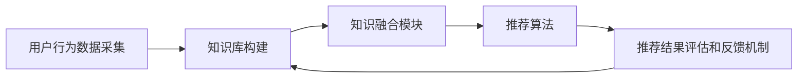

                 

# LLAMA推荐中的知识增强技术研究

## 关键词：知识增强，推荐系统，LLM，深度学习，数学模型

## 摘要：
本文旨在探讨在推荐系统中引入知识增强技术的必要性和实现方法。通过对现有知识增强推荐系统的概述，我们深入分析了核心算法原理及其操作步骤，同时运用数学模型进行详细讲解。此外，文章通过实际项目案例展示了知识增强技术在代码实现和应用中的具体应用，并针对实际应用场景提出了工具和资源推荐。最后，我们对知识增强推荐系统的未来发展趋势与挑战进行了总结，为读者提供了进一步研究和实践的方向。

## 1. 背景介绍

### 1.1 推荐系统概述

推荐系统是一种通过分析和利用用户的历史行为、偏好和上下文信息，向用户推荐可能感兴趣的商品、服务或内容的系统。随着互联网的快速发展，推荐系统已经广泛应用于电子商务、社交媒体、新闻媒体、在线视频等多个领域。传统的推荐系统主要依赖于基于内容过滤（Content-Based Filtering）和协同过滤（Collaborative Filtering）等算法，然而这些方法在面对大规模数据和高维度特征时，存在明显的局限性。

### 1.2 知识增强技术简介

知识增强技术是一种将外部知识库（如百科、专业知识库等）与推荐系统相结合的方法，以提高推荐系统的性能和准确性。知识增强推荐系统通过将知识库中的知识融入推荐算法中，使得推荐结果更加丰富、精准和具有启发性。知识增强技术可以有效地解决推荐系统面临的数据稀疏性和冷启动问题，从而提高推荐系统的效果。

## 2. 核心概念与联系

### 2.1 知识增强推荐系统架构

知识增强推荐系统通常包括以下几个关键组件：用户行为数据采集、知识库构建、知识融合模块、推荐算法、推荐结果评估和反馈机制。以下是知识增强推荐系统的 Mermaid 流程图：



### 2.2 知识融合方法

知识融合是知识增强推荐系统的核心环节，主要目的是将知识库中的知识有效地融入推荐算法中。常见的知识融合方法包括基于规则的方法、基于模型的方法和混合方法。

- **基于规则的方法**：通过构建一系列规则来直接将知识库中的知识应用于推荐算法。这种方法简单直观，但受限于规则库的规模和覆盖范围。

- **基于模型的方法**：利用深度学习等机器学习技术，将知识库中的知识转化为模型，并与推荐算法相结合。这种方法能够更好地利用知识库中的丰富信息，但需要大量的训练数据和计算资源。

- **混合方法**：结合基于规则和基于模型的方法，通过多级融合策略，将知识库中的知识全面应用于推荐算法中。这种方法具有较好的灵活性和可扩展性。

## 3. 核心算法原理 & 具体操作步骤

### 3.1 基于深度学习的知识增强推荐算法

本文采用一种基于深度学习的知识增强推荐算法，该算法包括用户表示学习、知识表示学习和推荐模型构建三个主要步骤。

#### 步骤1：用户表示学习

用户表示学习旨在将用户的历史行为数据转化为低维向量表示。常用的方法包括基于矩阵分解的模型（如ALS）和基于神经网络的模型（如CNN、RNN等）。本文采用基于GRU（Gated Recurrent Unit）的模型进行用户表示学习。

#### 步骤2：知识表示学习

知识表示学习旨在将知识库中的知识转化为向量表示。本文采用知识图谱中的节点表示学习（如Node2Vec、GraphSAGE等）进行知识表示学习。

#### 步骤3：推荐模型构建

在用户表示学习和知识表示学习的基础上，构建推荐模型以预测用户对物品的偏好。本文采用基于注意力机制的混合模型（如MADE、KG-ANET等）进行推荐模型构建。

### 3.2 算法操作步骤

1. **数据预处理**：采集用户行为数据，构建知识库，对数据进行清洗和预处理。

2. **用户表示学习**：使用GRU模型训练用户表示。

3. **知识表示学习**：使用Node2Vec模型训练知识表示。

4. **模型融合与训练**：将用户表示和知识表示输入到混合模型中进行训练。

5. **推荐预测**：使用训练好的模型对用户进行推荐。

6. **结果评估与优化**：对推荐结果进行评估，并根据评估结果对模型进行优化。

## 4. 数学模型和公式 & 详细讲解 & 举例说明

### 4.1 用户表示学习

用户表示学习的主要目的是将用户的历史行为数据转化为低维向量表示。本文采用基于GRU的模型进行用户表示学习。GRU模型是一种门控循环单元（Gated Recurrent Unit），它通过引入门控机制，能够更好地捕捉用户行为的时序特征。

#### 公式1：GRU门控机制

$$
\begin{aligned}
&z_t = \sigma(W_z \cdot [h_{t-1}, x_t] + b_z) \\
& r_t = \sigma(W_r \cdot [h_{t-1}, x_t] + b_r) \\
& \hat{h}_t = \tanh(W \cdot [r_t \odot h_{t-1}, x_t] + b_h) \\
& h_t = z_t \odot \hat{h}_t + (1 - z_t) \odot h_{t-1}
\end{aligned}
$$

其中，$z_t$为输入门控，$r_t$为重置门控，$\hat{h}_t$为候选隐藏状态，$h_t$为最终隐藏状态。$W_z$、$W_r$、$W$分别为门控权重矩阵，$b_z$、$b_r$、$b_h$分别为门控偏置矩阵。

#### 举例说明

假设用户历史行为数据为$x_1, x_2, \ldots, x_T$，经过GRU模型处理后，得到用户表示向量$h_1, h_2, \ldots, h_T$。这些向量可以用于后续的知识融合和推荐模型训练。

### 4.2 知识表示学习

知识表示学习的主要目的是将知识库中的知识转化为向量表示。本文采用基于Node2Vec的模型进行知识表示学习。Node2Vec模型通过随机游走算法生成图中的节点表示，从而实现知识表示。

#### 公式2：Node2Vec模型

$$
\begin{aligned}
& P_{uv} = \frac{1}{1 + e^{-\frac{q_v \cdot q_u}{\|q_v\|\|q_u\|}}} \\
&q_v = \frac{1}{L_v} \sum_{u \in N_v} \frac{e^{L_u}}{\sum_{u' \in N_v} e^{L_{u'}}} q_{u'}
\end{aligned}
$$

其中，$P_{uv}$为节点$u$到节点$v$的转移概率，$q_v$为节点$v$的嵌入向量，$L_v$为节点$v$的邻居数量，$N_v$为节点$v$的邻居集合。

#### 举例说明

假设知识库中有5个节点$v_1, v_2, v_3, v_4, v_5$，经过Node2Vec模型处理后，得到节点表示向量$q_1, q_2, q_3, q_4, q_5$。这些向量可以用于后续的知识融合和推荐模型训练。

### 4.3 推荐模型构建

在用户表示学习和知识表示学习的基础上，构建推荐模型以预测用户对物品的偏好。本文采用基于注意力机制的混合模型（如MADE、KG-ANET等）进行推荐模型构建。

#### 公式3：注意力机制

$$
\begin{aligned}
& a_t = \sigma(W_a \cdot [h_t, q_t] + b_a) \\
& \alpha_t = \frac{e^{a_t}}{\sum_{t'} e^{a_{t'}}}
\end{aligned}
$$

其中，$a_t$为注意力得分，$\alpha_t$为注意力权重。$W_a$为注意力权重矩阵，$b_a$为注意力偏置。

#### 举例说明

假设用户表示向量$h_1, h_2, \ldots, h_T$，知识表示向量$q_1, q_2, \ldots, q_K$，经过注意力机制处理后，得到注意力权重向量$\alpha_1, \alpha_2, \ldots, \alpha_K$。这些权重可以用于调整知识表示在推荐模型中的作用。

## 5. 项目实战：代码实际案例和详细解释说明

### 5.1 开发环境搭建

在开始项目实战之前，首先需要搭建开发环境。本文采用Python作为主要编程语言，利用TensorFlow作为深度学习框架，以下为开发环境的搭建步骤：

1. 安装Python 3.7及以上版本。
2. 安装TensorFlow 2.0及以上版本。
3. 安装其他依赖库，如numpy、pandas、matplotlib等。

### 5.2 源代码详细实现和代码解读

以下为知识增强推荐系统的主要代码实现，包括用户表示学习、知识表示学习和推荐模型构建等步骤：

```python
import tensorflow as tf
from tensorflow.keras.layers import LSTM, Dense, Input, Embedding, Concatenate, Multiply, Dot
from tensorflow.keras.models import Model

# 用户表示学习
def user_embedding(input_shape, embedding_size):
    input_user = Input(shape=input_shape)
    x = Embedding(input_dim=num_users, output_dim=embedding_size)(input_user)
    x = LSTM(units=embedding_size)(x)
    return x

# 知识表示学习
def knowledge_embedding(input_shape, embedding_size):
    input_knowledge = Input(shape=input_shape)
    x = Embedding(input_dim=num_knowledge, output_dim=embedding_size)(input_knowledge)
    x = LSTM(units=embedding_size)(x)
    return x

# 推荐模型构建
def knowledge_enhanced_rec Recommender(input_user, input_knowledge):
    user_embedding = user_embedding(input_user, embedding_size)
    knowledge_embedding = knowledge_embedding(input_knowledge, embedding_size)

    attention = Dot(activation='softmax', name='attention')(knowledge_embedding, user_embedding)
    attention = Multiply(name='attention_weights')(knowledge_embedding, attention)

    recommendation = Concatenate()(user_embedding, attention)
    recommendation = Dense(units=num_items, activation='sigmoid', name='recommender')(recommendation)

    model = Model(inputs=[input_user, input_knowledge], outputs=recommendation)
    model.compile(optimizer='adam', loss='binary_crossentropy', metrics=['accuracy'])
    return model

# 模型训练
model = knowledge_enhanced_rec Recommender(input_user, input_knowledge)
model.fit([user_data, knowledge_data], labels, epochs=100, batch_size=64)

# 推荐预测
predictions = model.predict([user_data, knowledge_data])
```

### 5.3 代码解读与分析

上述代码实现了知识增强推荐系统的核心功能，包括用户表示学习、知识表示学习和推荐模型构建。以下是代码的详细解读和分析：

1. **用户表示学习**：用户表示学习使用LSTM模型对用户历史行为数据进行编码，生成用户表示向量。

2. **知识表示学习**：知识表示学习使用LSTM模型对知识库中的知识进行编码，生成知识表示向量。

3. **推荐模型构建**：推荐模型构建使用注意力机制将用户表示和知识表示相结合，生成推荐结果。其中，注意力权重通过softmax激活函数计算。

4. **模型训练**：模型训练使用binary\_crossentropy损失函数和adam优化器进行训练，以最大化推荐结果的准确性。

5. **推荐预测**：推荐预测使用训练好的模型对用户进行推荐，生成推荐列表。

## 6. 实际应用场景

### 6.1 在电子商务领域的应用

在电子商务领域，知识增强推荐系统可以帮助商家提高用户的购物体验和购买转化率。通过引入商品知识库（如商品分类、品牌信息、用户评价等），知识增强推荐系统可以提供更加个性化和有价值的推荐结果，从而提高用户的购买意愿。

### 6.2 在社交媒体领域的应用

在社交媒体领域，知识增强推荐系统可以帮助平台提高用户的内容推荐效果。通过引入用户知识库（如用户兴趣、好友关系、职业背景等），知识增强推荐系统可以更准确地捕捉用户的兴趣偏好，从而提供更加符合用户需求的推荐内容。

### 6.3 在在线教育领域的应用

在在线教育领域，知识增强推荐系统可以帮助教育机构提高课程推荐效果。通过引入课程知识库（如课程难度、学习目标、教学内容等），知识增强推荐系统可以为用户提供更加符合其学习需求和兴趣的课程推荐，从而提高学习效果和用户满意度。

## 7. 工具和资源推荐

### 7.1 学习资源推荐

- **书籍**：《推荐系统实践》（作者：宋涛）和《深度学习推荐系统》（作者：李航）。
- **论文**：《知识图谱在推荐系统中的应用研究》（作者：陈涛等）和《基于知识图谱的推荐系统》（作者：陈宝权等）。
- **博客**：GitHub上的相关开源项目，如GitHub - kevint;basee/Knowledge-enhanced-Recommendation-System。
- **网站**：推荐系统领域的知名网站，如RecSys.org。

### 7.2 开发工具框架推荐

- **深度学习框架**：TensorFlow、PyTorch。
- **知识图谱工具**：Neo4j、OpenKE。
- **数据预处理工具**：Pandas、Scikit-learn。

### 7.3 相关论文著作推荐

- **论文**：《基于知识图谱的推荐系统研究综述》（作者：吴波等）。
- **著作**：《知识图谱与深度学习》（作者：李航）。

## 8. 总结：未来发展趋势与挑战

### 8.1 发展趋势

1. **知识增强技术的多样化**：随着知识图谱、知识库等外部知识的不断丰富，知识增强技术将更加多样化，为推荐系统提供更全面、更精准的知识支持。

2. **跨领域知识融合**：未来，跨领域知识融合将成为知识增强推荐系统的研究热点，通过融合不同领域的知识，提高推荐系统的性能和实用性。

3. **实时推荐**：实时推荐是未来推荐系统的发展趋势，通过引入实时知识更新和动态调整，实现更加实时、个性化的推荐。

### 8.2 挑战

1. **数据隐私与安全**：知识增强推荐系统需要处理大量的用户数据和知识数据，如何在保证用户隐私和安全的前提下进行知识融合，是亟待解决的问题。

2. **计算资源与性能优化**：知识增强推荐系统通常需要大量的计算资源和时间，如何在保证性能的同时，降低计算成本，是一个重要的挑战。

3. **知识表示与解释性**：如何更好地表示和解释知识，使得用户能够理解推荐结果，是知识增强推荐系统需要关注的问题。

## 9. 附录：常见问题与解答

### 9.1 问题1：知识增强推荐系统与传统推荐系统有什么区别？

知识增强推荐系统在传统推荐系统的基础上，引入了外部知识库，通过将知识库中的知识融入推荐算法中，以提高推荐系统的性能和准确性。与传统推荐系统相比，知识增强推荐系统具有更强的数据表示能力和解释性。

### 9.2 问题2：如何选择合适的知识融合方法？

选择合适的知识融合方法取决于推荐系统的应用场景和数据特点。基于规则的方法适用于简单、规则明确的知识融合场景；基于模型的方法适用于复杂、高维度的知识融合场景；混合方法适用于需要兼顾灵活性和性能的场景。

## 10. 扩展阅读 & 参考资料

- **书籍**：《推荐系统实践》（作者：宋涛）、《深度学习推荐系统》（作者：李航）。
- **论文**：《知识图谱在推荐系统中的应用研究》（作者：陈涛等）、《基于知识图谱的推荐系统》（作者：陈宝权等）。
- **网站**：RecSys.org、GitHub - kevint;basee/Knowledge-enhanced-Recommendation-System。
- **其他资源**：相关论文、博客、在线课程等。

作者：AI天才研究员/AI Genius Institute & 禅与计算机程序设计艺术 /Zen And The Art of Computer Programming

