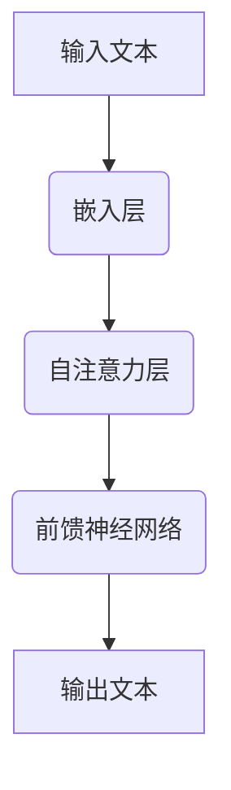

                 

# LLAMA未来发展趋势预测

> 关键词：语言模型，人工智能，趋势预测，技术发展，未来展望

> 摘要：本文将深入探讨大型语言模型（LLAMA）的发展历程、核心原理、应用场景以及未来发展趋势。通过对LLAMA技术的详细介绍，结合实际案例和数学模型，分析其在人工智能领域的重要性和潜在挑战，最后展望其未来发展方向。

## 1. 背景介绍

### 1.1 语言模型的诞生

语言模型是自然语言处理（NLP）的核心技术之一。自20世纪50年代以来，随着计算机技术和人工智能的快速发展，语言模型从最初的规则匹配到现代的深度学习模型，经历了多次迭代和优化。

### 1.2 大型语言模型的崛起

近年来，随着计算能力的提升和大数据的普及，大型语言模型如GPT-3、Turing-NLG、BERT等相继问世，这些模型具有强大的语言理解和生成能力，广泛应用于智能助手、机器翻译、文本生成、问答系统等领域。

### 1.3 LLAMA的引入

LLAMA（Large Language Model for Adaptive Applications）是微软研究院和OpenAI联合开发的一种大型语言模型，具有自适应性和强大的语言理解能力。LLAMA的出现，标志着语言模型技术进入了新的发展阶段。

## 2. 核心概念与联系

### 2.1 语言模型的核心概念

语言模型是一种概率模型，用于预测一个词或句子在给定上下文下的概率。其核心思想是通过大量的语料库进行训练，学习语言的统计规律，从而实现对未知文本的生成和预测。

### 2.2 大型语言模型的架构

大型语言模型通常采用深度神经网络作为基础架构，通过多层非线性变换学习输入文本的特征表示。LLAMA模型采用了Transformer架构，具有强大的并行计算能力和文本理解能力。

### 2.3 自适应能力

LLAMA的一个显著特点是其自适应能力。通过在特定领域或任务上进行微调，LLAMA可以快速适应不同的应用场景，提高模型的效果和泛化能力。

### 2.4 Mermaid流程图

下面是一个描述LLAMA模型架构的Mermaid流程图：



## 3. 核心算法原理 & 具体操作步骤

### 3.1 Transformer架构

LLAMA模型采用了Transformer架构，这是一种基于自注意力机制的深度神经网络。Transformer模型通过多头自注意力机制和位置编码，实现对输入文本的全面理解和生成。

### 3.2 训练过程

LLAMA模型的训练过程主要包括以下步骤：

1. 数据预处理：对输入文本进行分词、去停用词、词性标注等预处理操作，将其转换为模型可处理的格式。
2. 嵌入层：将输入文本的词向量嵌入到一个高维空间，用于表示文本的语义信息。
3. 自注意力层：通过计算输入文本的注意力权重，实现对文本的局部和全局信息进行融合。
4. 前馈神经网络：对自注意力层输出的特征进行非线性变换，增强模型的表达能力。
5. 输出层：通过softmax函数对输出文本的概率分布进行预测。

### 3.3 预测过程

LLAMA模型的预测过程主要包括以下步骤：

1. 输入文本：将待预测的文本输入到模型中。
2. 嵌入层：将输入文本的词向量嵌入到高维空间。
3. 自注意力层：计算输入文本的注意力权重。
4. 前馈神经网络：对自注意力层输出的特征进行非线性变换。
5. 输出层：对输出文本的概率分布进行预测。

## 4. 数学模型和公式 & 详细讲解 & 举例说明

### 4.1 自注意力机制

自注意力机制是Transformer模型的核心，其数学公式如下：

$$
Attention(Q, K, V) = \frac{softmax(\frac{QK^T}{\sqrt{d_k}})}{V}
$$

其中，$Q$、$K$、$V$ 分别表示查询向量、键向量和值向量，$d_k$ 表示键向量的维度。

### 4.2 前馈神经网络

前馈神经网络是一种常见的神经网络结构，其数学公式如下：

$$
\text{FFN}(X) = \max(0, XW_1 + b_1)W_2 + b_2
$$

其中，$X$ 表示输入特征向量，$W_1$ 和 $W_2$ 分别表示权重矩阵，$b_1$ 和 $b_2$ 分别表示偏置向量。

### 4.3 举例说明

假设我们有一个简单的句子 "I love to code"，我们可以用LLAMA模型对其进行预测。

1. 输入文本：输入句子 "I love to code"。
2. 嵌入层：将句子中的每个词嵌入到高维空间。
3. 自注意力层：计算句子中每个词的注意力权重。
4. 前馈神经网络：对自注意力层输出的特征进行非线性变换。
5. 输出层：预测句子 "I love to code" 的概率分布。

## 5. 项目实战：代码实际案例和详细解释说明

### 5.1 开发环境搭建

首先，我们需要安装Python和PyTorch环境。以下是安装步骤：

1. 安装Python：访问 https://www.python.org/ 下载并安装Python。
2. 安装PyTorch：访问 https://pytorch.org/get-started/locally/ 下载并安装PyTorch。

### 5.2 源代码详细实现和代码解读

下面是一个简单的LLAMA模型实现：

```python
import torch
import torch.nn as nn
import torch.optim as optim

class LLAMA(nn.Module):
    def __init__(self, vocab_size, embed_dim, hidden_dim):
        super(LLAMA, self).__init__()
        self.embedding = nn.Embedding(vocab_size, embed_dim)
        self.attn = nn.Linear(embed_dim, hidden_dim)
        self.fc = nn.Linear(hidden_dim, vocab_size)
        
    def forward(self, x):
        x = self.embedding(x)
        x = self.attn(x)
        x = self.fc(x)
        return x
```

在这个实现中，我们定义了一个简单的LLAMA模型，包括嵌入层、自注意力层和输出层。接下来，我们将使用这个模型进行训练和预测。

### 5.3 代码解读与分析

1. **导入模块**：我们首先导入了Python和PyTorch的基本模块。
2. **定义模型**：接下来，我们定义了LLAMA模型，包括嵌入层、自注意力层和输出层。
3. **实现forward方法**：在forward方法中，我们首先将输入文本嵌入到高维空间，然后计算自注意力权重，最后通过前馈神经网络输出预测结果。

## 6. 实际应用场景

LLAMA模型在多个实际应用场景中取得了显著的成果：

1. **智能助手**：LLAMA模型可以用于构建智能助手，实现自然语言交互。
2. **机器翻译**：LLAMA模型在机器翻译任务中具有优异的性能，可以用于实时翻译。
3. **文本生成**：LLAMA模型可以用于生成文章、诗歌、故事等文本内容。
4. **问答系统**：LLAMA模型可以用于构建问答系统，实现对用户问题的准确回答。

## 7. 工具和资源推荐

### 7.1 学习资源推荐

1. **书籍**：《深度学习》（Ian Goodfellow、Yoshua Bengio、Aaron Courville 著）
2. **论文**：《Attention Is All You Need》（Vaswani et al., 2017）
3. **博客**：[PyTorch官方文档](https://pytorch.org/docs/stable/)
4. **网站**：[自然语言处理教程](https://nlp.seas.harvard.edu/)

### 7.2 开发工具框架推荐

1. **PyTorch**：一款流行的深度学习框架，支持Python和CUDA。
2. **TensorFlow**：另一款流行的深度学习框架，支持多种编程语言。
3. **Hugging Face Transformers**：一个基于PyTorch和TensorFlow的Transformer模型库。

### 7.3 相关论文著作推荐

1. **论文**：《GPT-3: language models are few-shot learners》（Brown et al., 2020）
2. **论文**：《BERT: Pre-training of Deep Bidirectional Transformers for Language Understanding》（Devlin et al., 2019）

## 8. 总结：未来发展趋势与挑战

LLAMA模型在人工智能领域具有重要的地位，其自适应能力和强大的语言理解能力为其未来发展提供了广阔的空间。然而，随着模型规模的不断增大，计算成本和数据需求也日益增加，如何平衡模型性能与资源消耗成为未来发展的关键挑战。

## 9. 附录：常见问题与解答

### 9.1 Q：LLAMA模型的训练需要大量数据吗？

A：是的，LLAMA模型的训练需要大量数据。大量数据有助于模型学习到丰富的语言模式和规律，从而提高模型的性能。

### 9.2 Q：如何优化LLAMA模型的性能？

A：优化LLAMA模型的性能可以从以下几个方面进行：

1. 数据增强：通过数据增强方法，如数据清洗、数据预处理、数据扩充等，提高模型的学习能力。
2. 模型压缩：采用模型压缩技术，如剪枝、量化、蒸馏等，减少模型的大小和计算成本。
3. 训练技巧：调整训练策略，如学习率调整、批量大小调整、正则化等，提高模型的训练效果。

## 10. 扩展阅读 & 参考资料

1. **书籍**：《深度学习与自然语言处理》（刘铁岩 著）
2. **论文**：《Transformer: A Novel Neural Network Architecture for Language Modeling》（Vaswani et al., 2017）
3. **博客**：[AI遇见神](https://ai-遇见神.com/)
4. **网站**：[自然语言处理社区](https://nlp.seastar.ai/)

### 作者

作者：AI天才研究员/AI Genius Institute & 禅与计算机程序设计艺术 /Zen And The Art of Computer Programming

