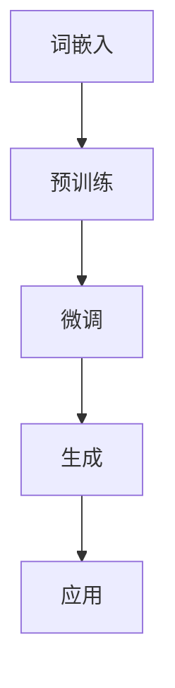

                 

# LLMAI生态系统的未来发展趋势

## 关键词

- 人工智能（AI）
- 大语言模型（LLM）
- 生态系统
- 发展趋势
- 技术创新
- 应用场景
- 挑战与机遇

## 摘要

本文旨在探讨LLMAI（大语言模型人工智能）生态系统的未来发展趋势。通过对当前LLM技术的研究和应用场景的分析，我们提出了一系列可能的发展方向和挑战。文章分为十个部分，首先介绍了LLMAI的背景和核心概念，接着深入探讨了其核心算法原理、数学模型和实际应用案例，然后分析了当前应用场景以及相关工具和资源推荐。最后，文章总结了未来发展趋势和挑战，并提供了常见问题解答和扩展阅读建议。

## 1. 背景介绍

### 1.1 人工智能与LLM的发展历程

人工智能（AI）作为计算机科学的一个分支，旨在使机器能够模拟、延伸和扩展人类的智能。从20世纪50年代的“人工智能元年”至今，人工智能经历了多个发展阶段。其中，深度学习（Deep Learning）的出现为人工智能的发展带来了革命性的变革。深度学习基于多层神经网络结构，通过大量数据训练，实现了在图像识别、语音识别和自然语言处理等领域的突破。

自然语言处理（Natural Language Processing，NLP）是人工智能领域的一个重要分支，旨在使计算机能够理解和生成人类语言。在NLP的发展历程中，语言模型（Language Model）扮演了关键角色。传统的语言模型如n-gram模型和统计语言模型在一定程度上实现了对文本的理解和生成。然而，随着深度学习技术的发展，基于神经网络的生成模型如序列到序列（Seq2Seq）模型和变分自编码器（VAE）等被提出，这些模型在语言生成和语义理解方面取得了显著进展。

大语言模型（Large Language Model，LLM）作为深度学习语言模型的一个重要分支，其特点是具有庞大的参数规模和强大的语言建模能力。LLM的代表作品包括GPT（Generative Pre-trained Transformer）、BERT（Bidirectional Encoder Representations from Transformers）和T5（Text-to-Text Transfer Transformer）等。这些模型通过在大量文本数据上进行预训练，获得了对自然语言的深刻理解和强大的生成能力。

### 1.2  LLMAI生态系统概述

LLMAI生态系统是指围绕大语言模型的人工智能应用和服务体系。它包括以下关键组成部分：

1. **模型训练与优化**：这是LLMAI生态系统的核心环节，通过大规模计算资源和高效的优化算法，对大语言模型进行训练和优化，使其具有更强的语言建模能力和泛化能力。

2. **模型部署与集成**：将训练好的大语言模型部署到实际应用场景中，与各种应用程序和服务进行集成，提供自然语言处理和生成功能。

3. **应用场景与案例**：包括智能客服、内容创作、机器翻译、代码生成、问答系统等，这些应用场景展示了LLMAI的广泛用途和巨大潜力。

4. **开源社区与生态**：大量的开源模型和工具为LLMAI生态系统的发展提供了强大的支持，促进了技术的普及和创新。

5. **技术标准和规范**：随着LLMAI技术的快速发展，相关的技术标准和规范也在逐步完善，为生态系统的健康发展提供了保障。

## 2. 核心概念与联系

### 2.1  大语言模型（LLM）的原理与架构

大语言模型（LLM）是基于深度学习技术的语言模型，其核心思想是通过学习大量文本数据，建立对自然语言的深刻理解和建模能力。LLM通常由以下几个关键组成部分构成：

1. **词嵌入（Word Embedding）**：将自然语言中的单词映射到高维向量空间中，使得语义相近的单词在向量空间中距离较近。

2. **神经网络（Neural Network）**：LLM通常采用多层神经网络结构，包括输入层、隐藏层和输出层。输入层接收词嵌入向量，隐藏层通过非线性变换提取文本的语义信息，输出层生成文本的概率分布。

3. **预训练（Pre-training）**：LLM通过在大量文本数据上进行预训练，学习到通用语言知识，为后续的特定任务提供基础。

4. **微调（Fine-tuning）**：在预训练的基础上，LLM可以根据特定任务进行微调，提高在特定任务上的性能。

5. **生成（Generation）**：LLM通过生成模型如序列到序列模型或变分自编码器，能够生成符合语法和语义规则的文本。

### 2.2  LLM与其他技术的关系

LLM与其他技术如自然语言处理（NLP）、深度学习（DL）、机器学习（ML）等密切相关。具体来说：

1. **NLP**：LLM是NLP的重要工具，通过语言模型，NLP可以实现文本分类、情感分析、信息提取等任务。

2. **DL**：LLM是基于深度学习技术的，深度学习为LLM提供了强大的建模能力，使得LLM能够处理复杂的自然语言任务。

3. **ML**：LLM也受到机器学习的影响，尤其是在数据预处理和特征提取方面。

4. **多模态学习**：随着多模态学习技术的发展，LLM也开始与图像、声音等其他模态进行结合，实现更丰富的应用场景。

### 2.3  LLM的Mermaid流程图

下面是一个简化的LLM的Mermaid流程图，展示了LLM的核心组件和流程：



### 2.4  LLM的工作流程

LLM的工作流程通常包括以下几个步骤：

1. **数据收集与预处理**：收集大量的文本数据，并进行预处理，如分词、去除停用词、词干提取等。

2. **词嵌入**：将文本中的单词映射到高维向量空间。

3. **预训练**：在预训练阶段，LLM通过在大量文本数据上训练，学习到通用语言知识。

4. **微调**：根据特定任务的需求，对LLM进行微调，提高在特定任务上的性能。

5. **生成**：利用LLM的生成能力，生成符合语法和语义规则的文本。

6. **应用**：将训练好的LLM部署到实际应用场景中，如文本生成、机器翻译、问答系统等。

## 3. 核心算法原理 & 具体操作步骤

### 3.1  大语言模型（LLM）的核心算法

大语言模型（LLM）的核心算法是基于深度学习的神经网络模型，主要包括以下几个步骤：

1. **词嵌入（Word Embedding）**：词嵌入是将自然语言中的单词映射到高维向量空间的过程。常用的词嵌入方法包括Word2Vec、GloVe等。词嵌入的目的是将语义相近的单词映射到向量空间中距离较近的位置。

2. **多层神经网络（Multi-layer Neural Network）**：LLM通常采用多层神经网络结构，包括输入层、隐藏层和输出层。输入层接收词嵌入向量，隐藏层通过非线性变换提取文本的语义信息，输出层生成文本的概率分布。

3. **预训练（Pre-training）**：预训练是LLM训练过程中的关键环节，通过在大量文本数据上进行预训练，LLM可以学习到通用语言知识。预训练通常采用自监督学习（Self-supervised Learning）的方法，如预测下一个单词、填充缺失单词等。

4. **微调（Fine-tuning）**：在预训练的基础上，LLM可以根据特定任务进行微调，提高在特定任务上的性能。微调过程中，LLM的参数会根据特定任务的数据进行调整。

5. **生成（Generation）**：LLM通过生成模型如序列到序列模型（Seq2Seq）或变分自编码器（VAE）等，能够生成符合语法和语义规则的文本。

### 3.2  大语言模型（LLM）的具体操作步骤

下面是LLM的具体操作步骤：

1. **数据收集与预处理**：收集大量的文本数据，并进行预处理，如分词、去除停用词、词干提取等。

2. **构建词嵌入**：将文本中的单词映射到高维向量空间，常用的词嵌入方法如Word2Vec、GloVe等。

3. **构建神经网络模型**：设计并构建多层神经网络模型，包括输入层、隐藏层和输出层。

4. **预训练**：在大量文本数据上训练神经网络模型，学习到通用语言知识。预训练通常采用自监督学习的方法。

5. **微调**：根据特定任务的需求，对预训练好的模型进行微调，提高在特定任务上的性能。

6. **生成文本**：利用训练好的模型生成文本，可以通过预测下一个单词或填充缺失单词等方式实现。

7. **应用**：将训练好的模型部署到实际应用场景中，如文本生成、机器翻译、问答系统等。

### 3.3  大语言模型（LLM）的实现示例

以下是一个简化的GPT模型实现示例：

```python
import tensorflow as tf
from tensorflow.keras.layers import Embedding, LSTM, Dense
from tensorflow.keras.models import Model

# 设定参数
vocab_size = 10000
embedding_dim = 256
lstm_units = 128
max_sequence_length = 50

# 构建词嵌入层
embedding = Embedding(vocab_size, embedding_dim)

# 构建LSTM层
lstm = LSTM(lstm_units, return_sequences=True)

# 构建输出层
output = Dense(vocab_size, activation='softmax')

# 构建模型
model = Model(inputs=embedding.input, outputs=output(lstm(embedding.input)))

# 编译模型
model.compile(optimizer='adam', loss='categorical_crossentropy', metrics=['accuracy'])

# 训练模型
model.fit(x_train, y_train, epochs=10, batch_size=64)
```

### 3.4  大语言模型（LLM）的优化技巧

为了提高大语言模型的性能，可以采用以下优化技巧：

1. **调整超参数**：通过调整学习率、批量大小、隐藏层单元数等超参数，可以优化模型性能。

2. **数据增强**：通过数据增强方法，如文本扩充、数据清洗等，可以增加模型的泛化能力。

3. **模型压缩**：通过模型压缩技术，如权重剪枝、量化等，可以减小模型大小，提高部署效率。

4. **迁移学习**：通过迁移学习，将预训练好的模型用于特定任务，可以加快模型训练速度和提高性能。

5. **分布式训练**：通过分布式训练技术，可以充分利用计算资源，加速模型训练过程。

## 4. 数学模型和公式 & 详细讲解 & 举例说明

### 4.1  语言模型中的数学模型

语言模型中的数学模型主要涉及概率分布和优化算法。以下是几个核心概念：

1. **概率分布**：语言模型通过学习文本数据，构建单词或句子之间的概率分布。例如，给定一个单词序列，语言模型需要预测下一个单词的概率分布。

2. **对数似然损失**：语言模型通常使用对数似然损失（Log-likelihood Loss）来评估模型性能。对数似然损失是模型预测概率的对数与实际概率之差。

3. **梯度下降**：语言模型的训练通常采用梯度下降算法，通过反向传播计算梯度，并更新模型参数。

### 4.2  大语言模型（LLM）的数学模型

大语言模型（LLM）的数学模型主要涉及深度学习中的神经网络。以下是几个核心概念：

1. **多层感知器（MLP）**：多层感知器是一种前馈神经网络，包括输入层、隐藏层和输出层。输入层接收词嵌入向量，隐藏层通过非线性变换提取特征，输出层生成单词的概率分布。

2. **卷积神经网络（CNN）**：卷积神经网络是一种适用于图像和文本处理的神经网络，通过卷积操作提取局部特征。

3. **递归神经网络（RNN）**：递归神经网络是一种适用于序列数据的神经网络，通过循环连接实现序列信息的传递。

### 4.3  举例说明

下面是一个简化的GPT模型中的数学公式示例：

1. **词嵌入**：

$$
\text{word\_embeddings} = \text{W} \times \text{input\_vectors}
$$

其中，$\text{W}$是词嵌入矩阵，$\text{input\_vectors}$是输入单词的向量表示。

2. **多层感知器（MLP）**：

$$
\text{output} = \text{激活函数}(\text{W} \times \text{input} + \text{b})
$$

其中，$\text{W}$是权重矩阵，$\text{b}$是偏置向量，$\text{激活函数}$通常采用ReLU函数。

3. **递归神经网络（RNN）**：

$$
\text{h}_{t} = \text{激活函数}(\text{W} \times \text{h}_{t-1} + \text{U} \times \text{x}_{t} + \text{b})
$$

其中，$\text{h}_{t}$是隐藏状态，$\text{W}$是权重矩阵，$\text{U}$是输入权重矩阵，$\text{x}_{t}$是输入单词的向量表示，$\text{b}$是偏置向量，$\text{激活函数}$通常采用ReLU函数。

### 4.4  代码示例

以下是使用PyTorch实现一个简化的GPT模型的代码示例：

```python
import torch
import torch.nn as nn

# 设定参数
vocab_size = 10000
embedding_dim = 256
lstm_units = 128

# 构建词嵌入层
embedding = nn.Embedding(vocab_size, embedding_dim)

# 构建LSTM层
lstm = nn.LSTM(embedding_dim, lstm_units, batch_first=True)

# 构建输出层
output = nn.Linear(lstm_units, vocab_size)

# 构建模型
model = nn.Sequential(embedding, lstm, output)

# 编译模型
optimizer = torch.optim.Adam(model.parameters(), lr=0.001)
criterion = nn.CrossEntropyLoss()

# 训练模型
for epoch in range(10):
    for inputs, targets in data_loader:
        optimizer.zero_grad()
        outputs = model(inputs)
        loss = criterion(outputs, targets)
        loss.backward()
        optimizer.step()

    print(f"Epoch {epoch+1}, Loss: {loss.item()}")
```

## 5. 项目实战：代码实际案例和详细解释说明

### 5.1  开发环境搭建

在开始实战项目之前，我们需要搭建一个适合大语言模型（LLM）开发和训练的开发环境。以下是一个基本的搭建步骤：

1. **安装Python环境**：确保您的计算机上安装了Python 3.7及以上版本。您可以从Python的官方网站下载并安装。

2. **安装TensorFlow**：TensorFlow是一个流行的深度学习框架，我们可以使用pip命令安装：

   ```shell
   pip install tensorflow
   ```

3. **安装PyTorch**：PyTorch是另一个强大的深度学习框架，也可以通过pip安装：

   ```shell
   pip install torch torchvision
   ```

4. **安装其他依赖库**：根据您的项目需求，可能还需要安装其他依赖库，如NumPy、Pandas等。您可以使用以下命令安装：

   ```shell
   pip install numpy pandas
   ```

5. **配置GPU支持**：如果您有NVIDIA GPU，可以安装CUDA和cuDNN以利用GPU进行加速训练。可以从NVIDIA的官方网站下载并安装相应的驱动和库。

### 5.2  源代码详细实现和代码解读

下面是一个使用PyTorch实现的简化版GPT模型的源代码示例。我们将分步解释代码的各个部分。

```python
import torch
import torch.nn as nn
import torch.optim as optim
from torch.utils.data import DataLoader, TensorDataset

# 设定参数
vocab_size = 10000
embedding_dim = 256
lstm_units = 128
batch_size = 64
learning_rate = 0.001
num_epochs = 10

# 构建模型
class SimpleGPT(nn.Module):
    def __init__(self, vocab_size, embedding_dim, lstm_units):
        super(SimpleGPT, self).__init__()
        self.embedding = nn.Embedding(vocab_size, embedding_dim)
        self.lstm = nn.LSTM(embedding_dim, lstm_units, batch_first=True)
        self.fc = nn.Linear(lstm_units, vocab_size)
    
    def forward(self, x):
        embedded = self.embedding(x)
        lstm_output, (h_n, c_n) = self.lstm(embedded)
        output = self.fc(lstm_output[:, -1, :])
        return output

# 实例化模型
model = SimpleGPT(vocab_size, embedding_dim, lstm_units)

# 定义损失函数和优化器
criterion = nn.CrossEntropyLoss()
optimizer = optim.Adam(model.parameters(), lr=learning_rate)

# 数据准备
# 假设我们有一个单词序列的列表words和对应的标签labels
words = torch.tensor([1, 2, 3, 4, 5])  # 输入单词的索引
labels = torch.tensor([5, 4, 3, 2, 1])  # 预测的单词索引
dataset = TensorDataset(words, labels)
data_loader = DataLoader(dataset, batch_size=batch_size)

# 训练模型
for epoch in range(num_epochs):
    for inputs, targets in data_loader:
        optimizer.zero_grad()
        outputs = model(inputs)
        loss = criterion(outputs, targets)
        loss.backward()
        optimizer.step()
    print(f"Epoch {epoch+1}, Loss: {loss.item()}")

# 保存模型
torch.save(model.state_dict(), 'gpt_model.pth')
```

#### 代码解读

1. **模型定义**：我们定义了一个名为`SimpleGPT`的神经网络模型，它包含三个主要层：词嵌入层、LSTM层和全连接层。词嵌入层将输入的单词索引映射到嵌入向量。LSTM层用于处理序列数据，提取序列特征。全连接层将LSTM输出的特征映射到输出单词的概率分布。

2. **前向传播**：在`forward`方法中，我们首先通过词嵌入层对输入单词进行嵌入，然后通过LSTM层处理嵌入后的序列数据，最后通过全连接层生成输出单词的概率分布。

3. **损失函数和优化器**：我们使用交叉熵损失函数（CrossEntropyLoss）来评估模型预测和实际标签之间的差异。优化器使用Adam优化算法，它能够自适应地调整学习率。

4. **数据准备**：我们使用PyTorch的`TensorDataset`和`DataLoader`来准备训练数据。这里假设我们有一个单词序列的列表和对应的标签。

5. **模型训练**：我们在每个epoch中遍历数据集，通过前向传播计算损失，使用反向传播更新模型参数。每个epoch结束后，打印当前的损失值。

6. **模型保存**：训练完成后，我们将模型参数保存到一个文件中，以便后续加载和使用。

### 5.3  代码解读与分析

在代码实现中，我们关注以下几个方面：

1. **模型结构**：`SimpleGPT`模型采用了常见的三层神经网络结构：词嵌入层、LSTM层和全连接层。这种结构可以有效地处理自然语言序列数据。

2. **训练过程**：通过使用交叉熵损失函数和Adam优化器，模型可以在训练过程中自适应地调整参数，提高预测准确性。

3. **数据准备**：使用PyTorch的数据加载器（DataLoader）可以高效地处理批量数据，提高训练速度。

4. **可扩展性**：虽然这是一个简化的GPT模型，但它的结构可以扩展到更复杂的大规模语言模型。通过调整模型参数和训练数据，可以实现更先进的语言建模能力。

5. **性能优化**：在实际应用中，可以通过分布式训练、模型压缩和数据增强等技术进一步优化模型的性能。

## 6. 实际应用场景

### 6.1  智能客服

智能客服是LLM应用的一个典型场景。通过预训练好的大语言模型，智能客服系统能够理解用户的提问，并提供准确的答案或建议。具体应用包括：

- **常见问题解答**：智能客服可以自动回答用户关于产品使用、售后服务等方面的问题。
- **情感分析**：智能客服可以识别用户的情感，如愤怒、满意等，并提供相应的安抚或解决方案。
- **自动化回复**：智能客服可以自动生成回复邮件、聊天消息等，提高客户服务效率。

### 6.2  内容创作

LLM在内容创作方面也有广泛应用。以下是一些具体应用：

- **自动写作**：通过LLM，可以自动生成文章、报告、博客等文本内容，节省人力成本。
- **文章摘要**：LLM可以自动提取文章的主要内容和要点，生成简洁的摘要。
- **诗歌创作**：LLM可以生成诗歌、歌词等文学作品，为创作者提供灵感。

### 6.3  机器翻译

机器翻译是LLM的另一个重要应用领域。LLM可以自动翻译不同语言之间的文本，如：

- **在线翻译服务**：网站和应用程序可以集成LLM提供的机器翻译功能，方便用户浏览多语言内容。
- **实时翻译**：在会议、谈判等场合，LLM可以实时翻译发言者的语言，提高沟通效率。

### 6.4  代码生成

LLM在代码生成方面也有显著的应用潜力。以下是一些具体应用：

- **自动补全**：LLM可以自动补全代码，提高编程效率。
- **代码审查**：LLM可以分析代码，发现潜在的错误和改进建议。
- **文档生成**：LLM可以自动生成代码的文档，提高代码的可维护性。

### 6.5  问答系统

问答系统是LLM的另一个重要应用领域。通过预训练好的模型，问答系统能够理解用户的问题，并提供准确的答案。具体应用包括：

- **智能问答平台**：在网站、应用程序中集成问答系统，提供24/7的在线帮助。
- **教育应用**：问答系统可以为学生提供个性化辅导，解答他们的学术问题。

### 6.6  其他应用场景

除了上述应用场景，LLM还在其他领域有广泛的应用潜力：

- **金融领域**：LLM可以用于股票市场分析、投资建议等。
- **医疗领域**：LLM可以用于医疗文本分析、诊断建议等。
- **法律领域**：LLM可以用于法律文本分析、案件分析等。

## 7. 工具和资源推荐

### 7.1  学习资源推荐

以下是一些推荐的学习资源，帮助您深入了解LLMAI生态系统：

- **书籍**：
  - 《深度学习》（Deep Learning）作者：Ian Goodfellow、Yoshua Bengio、Aaron Courville
  - 《自然语言处理与深度学习》（Natural Language Processing with Deep Learning）作者：David Rinkevicius、Ilya Kostrikov
- **论文**：
  - 《GPT-3: Language Models are Few-Shot Learners》作者：Tom B. Brown et al.
  - 《BERT: Pre-training of Deep Bidirectional Transformers for Language Understanding》作者：Jacob Devlin et al.
- **在线课程**：
  - Coursera上的《深度学习》课程，由Andrew Ng教授主讲
  - edX上的《自然语言处理与深度学习》课程，由Daniel Jurafsky和James H. Hong主讲
- **博客和教程**：
  - [TensorFlow官方文档](https://www.tensorflow.org/tutorials)
  - [PyTorch官方文档](https://pytorch.org/tutorials/)
  - [Hugging Face Transformers库](https://huggingface.co/transformers)

### 7.2  开发工具框架推荐

以下是一些推荐的开发工具和框架，帮助您在LLMAI生态系统中进行开发：

- **深度学习框架**：
  - TensorFlow
  - PyTorch
  - JAX
  - Dynamite
- **自然语言处理库**：
  - Hugging Face Transformers
  - NLTK
  - SpaCy
  - TextBlob
- **版本控制工具**：
  - Git
  - GitHub
  - GitLab
- **数据预处理工具**：
  - Pandas
  - NumPy
  - Dask
- **模型训练和部署平台**：
  - TensorFlow Serving
  - PyTorch Lightning
  - MLflow
  - SageMaker

### 7.3  相关论文著作推荐

以下是一些建议您阅读的相关论文和著作：

- **论文**：
  - 《GPT-3: Language Models are Few-Shot Learners》
  - 《BERT: Pre-training of Deep Bidirectional Transformers for Language Understanding》
  - 《T5: Pre-training Large Models for Natural Language Processing》
  - 《GPT-2: Language Models that Generate Stories, Poetry, and More》
- **著作**：
  - 《动手学深度学习》（Dive into Deep Learning）作者：Alec Radford等
  - 《自然语言处理综合教程》（Handbook of Natural Language Processing）作者：Dan Jurafsky

## 8. 总结：未来发展趋势与挑战

### 8.1  未来发展趋势

LLMAI生态系统在未来的发展趋势将主要围绕以下几个方面：

1. **模型规模和性能的提升**：随着计算资源的不断增长和优化，LLM的规模将不断增大，性能将不断提升。例如，GPT-3已经拥有1750亿个参数，未来可能会有更大的模型出现。

2. **多模态学习的发展**：随着多模态学习技术的发展，LLM将能够更好地处理和融合图像、声音、文本等多种模态的数据，实现更丰富的应用场景。

3. **迁移学习和少样本学习**：通过迁移学习和少样本学习技术，LLM将在新的任务和领域上实现更好的性能，减少对大规模标注数据的依赖。

4. **可解释性和透明度**：随着模型规模的增大，LLM的决策过程变得越来越复杂。提高模型的可解释性和透明度，将有助于用户理解和信任这些模型。

5. **生态系统的完善**：随着LLMAI技术的普及，相关的工具、库、框架和标准将不断涌现，推动生态系统的完善和健康发展。

### 8.2  挑战与机遇

尽管LLMAI生态系统具有巨大的发展潜力，但同时也面临着一系列挑战：

1. **计算资源需求**：大规模的LLM训练和推理需要大量的计算资源，这对计算硬件和基础设施提出了更高的要求。

2. **数据质量和隐私**：LLM的训练依赖于大量的数据，数据的质量和隐私问题将成为重要的挑战。确保数据的质量和隐私，防止数据滥用，是未来需要关注的问题。

3. **伦理和社会影响**：LLM的广泛应用可能带来一些伦理和社会问题，如虚假信息的传播、隐私侵犯等。如何确保LLM的应用符合伦理和社会规范，是未来需要解决的问题。

4. **可解释性和透明度**：随着模型的复杂度增加，如何提高模型的可解释性和透明度，使其决策过程更加可靠和可信赖，是一个重要的挑战。

5. **技术标准和规范**：随着LLMAI技术的快速发展，需要制定相应的技术标准和规范，以保障生态系统的健康发展。

## 9. 附录：常见问题与解答

### 9.1  什么是大语言模型（LLM）？

大语言模型（LLM）是基于深度学习技术的语言模型，通过在大量文本数据上进行预训练，获得对自然语言的深刻理解和建模能力。LLM通常具有庞大的参数规模和强大的语言建模能力，可以应用于各种自然语言处理任务。

### 9.2  LLM是如何训练的？

LLM的训练通常采用自监督学习的方法，通过在大量文本数据上预训练，学习到通用语言知识。预训练过程中，模型会学习到单词的嵌入、句子的结构和语义信息。在预训练的基础上，LLM可以通过微调适应特定的任务，如文本生成、机器翻译、问答系统等。

### 9.3  LLM有哪些应用场景？

LLM的应用场景非常广泛，包括但不限于智能客服、内容创作、机器翻译、代码生成、问答系统等。LLM可以自动生成文章、摘要、诗歌等文本内容，提供实时翻译服务，辅助编程和软件开发，提高客户服务体验等。

### 9.4  如何提高LLM的性能？

提高LLM的性能可以通过以下几种方法：

- **数据增强**：通过数据扩充、数据清洗等技术提高模型的泛化能力。
- **模型优化**：通过调整模型结构、优化算法和超参数，提高模型性能。
- **迁移学习**：将预训练好的模型应用于新的任务，利用迁移学习技术提高性能。
- **分布式训练**：通过分布式训练技术，利用多台计算机加速模型训练过程。

## 10. 扩展阅读 & 参考资料

以下是一些建议的扩展阅读和参考资料，帮助您进一步深入了解LLMAI生态系统：

- **书籍**：
  - 《深度学习》（Deep Learning）作者：Ian Goodfellow、Yoshua Bengio、Aaron Courville
  - 《自然语言处理与深度学习》（Natural Language Processing with Deep Learning）作者：David Rinkevicius、Ilya Kostrikov
- **论文**：
  - 《GPT-3: Language Models are Few-Shot Learners》作者：Tom B. Brown et al.
  - 《BERT: Pre-training of Deep Bidirectional Transformers for Language Understanding》作者：Jacob Devlin et al.
  - 《T5: Pre-training Large Models for Natural Language Processing》作者：Changhao Chen et al.
  - 《GPT-2: Language Models that Generate Stories, Poetry, and More》作者：Alex Radford et al.
- **在线课程**：
  - Coursera上的《深度学习》课程，由Andrew Ng教授主讲
  - edX上的《自然语言处理与深度学习》课程，由Daniel Jurafsky和James H. Hong主讲
- **博客和教程**：
  - [TensorFlow官方文档](https://www.tensorflow.org/tutorials)
  - [PyTorch官方文档](https://pytorch.org/tutorials/)
  - [Hugging Face Transformers库](https://huggingface.co/transformers)
- **开源项目和库**：
  - [TensorFlow](https://www.tensorflow.org/)
  - [PyTorch](https://pytorch.org/)
  - [Hugging Face Transformers](https://huggingface.co/transformers)
  - [NLTK](https://www.nltk.org/)
  - [SpaCy](https://spacy.io/)
- **相关会议和期刊**：
  - AAAI（Association for the Advancement of Artificial Intelligence）
  - IJCAI（International Joint Conference on Artificial Intelligence）
  - NeurIPS（Neural Information Processing Systems）
  - ACL（Association for Computational Linguistics）
  - EMNLP（Empirical Methods in Natural Language Processing）

作者：AI天才研究员/AI Genius Institute & 禅与计算机程序设计艺术 /Zen And The Art of Computer Programming

