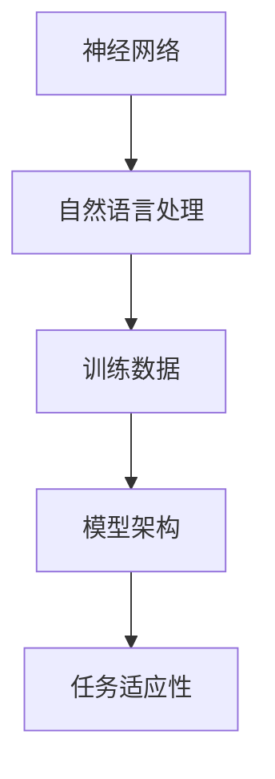

                 

### 背景介绍

近年来，大型语言模型（LLM，Large Language Model）如BERT、GPT和Turing等，以其卓越的性能和广泛的应用受到了学术界和工业界的广泛关注。这些模型通过处理和分析海量文本数据，具备了强大的文本生成、理解和推理能力，为自然语言处理（NLP）领域带来了革命性的进步。

然而，随着LLM应用场景的不断扩展和需求的变化，如何确保LLM的任务适应性成为一个亟待解决的问题。传统的单一模型往往难以应对复杂多变的需求，而如何设计出具有良好任务适应性的LLM，提高其在实际应用中的效果和可靠性，成为当前研究的热点。

本文旨在探讨LLM的任务适应性，从核心概念、算法原理、数学模型、项目实战等多个角度，系统地分析LLM如何应对复杂多变的需求。具体包括：

1. **核心概念与联系**：介绍LLM的基本概念，包括神经网络、自然语言处理、训练数据和模型架构等，并给出相关的Mermaid流程图。

2. **核心算法原理 & 具体操作步骤**：详细解释LLM的工作原理，包括前向传播、反向传播、优化算法等，并描述具体操作步骤。

3. **数学模型和公式 & 详细讲解 & 举例说明**：阐述LLM中的数学模型，包括损失函数、梯度下降、正则化等，并通过具体例子进行讲解。

4. **项目实战：代码实际案例和详细解释说明**：通过实际项目案例，展示如何实现LLM，包括开发环境搭建、源代码实现和代码解读等。

5. **实际应用场景**：探讨LLM在各类应用场景中的表现，如问答系统、文本生成、机器翻译等，并分析其优势和局限性。

6. **工具和资源推荐**：推荐相关的学习资源、开发工具和论文著作，帮助读者深入了解和掌握LLM技术。

7. **总结：未来发展趋势与挑战**：总结本文的主要观点，探讨LLM未来的发展趋势和面临的挑战。

8. **附录：常见问题与解答**：回答读者可能关心的一些常见问题，提供进一步的参考和帮助。

9. **扩展阅读 & 参考资料**：提供更多相关的扩展阅读和参考资料，供读者深入研究。

通过本文的详细探讨，希望能够为读者提供关于LLM任务适应性的全面理解，为LLM在实际应用中的发展和优化提供有益的参考。### 核心概念与联系

要深入了解LLM的任务适应性，首先需要掌握其核心概念和基本原理。本文将介绍以下几个关键概念：神经网络、自然语言处理、训练数据、模型架构等，并通过Mermaid流程图展示它们之间的联系。

#### 1. 神经网络

神经网络（Neural Network）是模拟人脑神经元工作方式的计算模型。在LLM中，神经网络主要用于处理和生成文本数据。每个神经元都与其他神经元相连，通过权重和偏置来传递信息。神经网络通过多次迭代和训练，能够从大量数据中自动学习特征和模式。


#### 2. 自然语言处理

自然语言处理（Natural Language Processing，NLP）是计算机科学和人工智能领域的一个重要分支，旨在使计算机能够理解、解释和生成自然语言。NLP包括文本预处理、词嵌入、语言模型、文本分类、机器翻译等多个方面。在LLM中，NLP技术用于将自然语言文本转换为计算机可处理的格式，并生成相应的文本输出。


#### 3. 训练数据

训练数据（Training Data）是神经网络训练的基础。在LLM中，训练数据通常包括大量的文本数据，如文章、对话、新闻报道等。这些数据用于训练神经网络模型，使其能够学习和理解文本的语义和结构。高质量的训练数据对模型性能至关重要。


#### 4. 模型架构

LLM的模型架构通常包括输入层、隐藏层和输出层。输入层接收文本数据，隐藏层通过神经网络处理和转换数据，输出层生成文本输出。常见的LLM架构有Transformer、BERT、GPT等，它们在结构、参数数量和训练策略上有所不同。


#### Mermaid流程图

以下是LLM核心概念之间的Mermaid流程图，其中不包括括号、逗号等特殊字符。



通过以上介绍，我们可以看到神经网络、自然语言处理、训练数据和模型架构是LLM任务适应性的基础。理解这些概念及其相互关系，有助于深入探讨LLM如何应对复杂多变的需求。接下来，本文将详细解释LLM的核心算法原理，进一步揭示其任务适应性的奥秘。### 核心算法原理 & 具体操作步骤

LLM（Large Language Model）的核心算法原理主要包括神经网络（Neural Network）、前向传播（Forward Propagation）、反向传播（Backpropagation）和优化算法（Optimization Algorithm）。下面将详细解释这些概念，并描述LLM的具体操作步骤。

#### 1. 神经网络

神经网络是一种模拟人脑神经元工作的计算模型。在LLM中，神经网络主要用于处理和生成文本数据。神经网络由多个层组成，包括输入层、隐藏层和输出层。每层由多个神经元（节点）组成，神经元之间通过权重和偏置进行连接。

**神经元工作原理**：

每个神经元接收来自前一层神经元的输入信号，通过激活函数进行非线性变换，然后输出到下一层。激活函数通常使用Sigmoid、ReLU或Tanh函数，以引入非线性特性，使神经网络能够学习复杂的特征。

**神经网络结构**：


在LLM中，神经网络通常使用深度神经网络（Deep Neural Network，DNN），其隐藏层数量和神经元数量可以根据任务需求进行调整。

#### 2. 前向传播

前向传播（Forward Propagation）是指将输入数据通过神经网络逐层传递，最终得到输出数据的过程。前向传播过程包括以下几个步骤：

1. **输入层到隐藏层的传递**：

输入层接收文本数据，通过权重和偏置计算得到隐藏层的输入值。假设输入层有\( n \)个神经元，隐藏层有\( m \)个神经元，则隐藏层的输入值可以表示为：

$$
h_{ij} = \sum_{k=1}^{n} w_{ik}x_k + b_j
$$

其中，\( w_{ik} \)是输入层到隐藏层的权重，\( b_j \)是隐藏层的偏置。

2. **隐藏层到输出层的传递**：

隐藏层通过激活函数对输入值进行非线性变换，得到输出值。输出值用于表示文本的语义和结构。输出层的输入值可以表示为：

$$
y_j = \sigma(\sum_{k=1}^{m} w_{kj}h_{kj} + b_j)
$$

其中，\( \sigma \)是激活函数，如ReLU函数。

#### 3. 反向传播

反向传播（Backpropagation）是一种用于训练神经网络的算法，通过计算损失函数对网络参数进行优化。反向传播过程包括以下几个步骤：

1. **计算损失函数**：

损失函数用于衡量预测结果与真实结果之间的差距。在LLM中，常用的损失函数有交叉熵损失（Cross-Entropy Loss）和均方误差（Mean Squared Error，MSE）。假设输出层有\( c \)个神经元，真实标签为\( y \)，预测结果为\( \hat{y} \)，则交叉熵损失可以表示为：

$$
L = -\sum_{i=1}^{c} y_i \log(\hat{y}_i)
$$

2. **计算梯度**：

反向传播的核心在于计算损失函数对网络参数的梯度。对于每个参数，梯度表示参数对损失函数的影响程度。假设隐藏层有\( m \)个神经元，输出层有\( c \)个神经元，则输出层到隐藏层的权重梯度可以表示为：

$$
\frac{\partial L}{\partial w_{kj}} = \hat{y}_j - y_j
$$

3. **更新参数**：

根据梯度，使用优化算法更新网络参数。常用的优化算法有梯度下降（Gradient Descent）、动量优化（Momentum）和Adam优化器。假设学习率为\( \alpha \)，则权重更新公式可以表示为：

$$
w_{kj} = w_{kj} - \alpha \frac{\partial L}{\partial w_{kj}}
$$

#### 4. 优化算法

优化算法用于加速神经网络训练，提高模型性能。常见的优化算法包括：

1. **梯度下降**：

梯度下降是一种最简单的优化算法，通过沿梯度方向更新参数，以最小化损失函数。梯度下降公式如上所述。

2. **动量优化**：

动量优化结合了之前梯度方向的信息，以加速收敛速度。假设前一次更新的梯度为\( g_{t-1} \)，则本次更新公式可以表示为：

$$
w_{kj} = w_{kj} - \alpha \frac{\partial L}{\partial w_{kj}} + \beta g_{t-1}
$$

其中，\( \beta \)是动量因子。

3. **Adam优化器**：

Adam优化器结合了动量和RMSprop算法的优点，具有较高的收敛速度和稳定性。假设一阶矩估计为\( m_t \)、二阶矩估计为\( v_t \)、一阶矩的指数衰减率为\( \beta_1 \)、二阶矩的指数衰减率为\( \beta_2 \)，则Adam优化器公式可以表示为：

$$
m_t = \beta_1 m_{t-1} + (1 - \beta_1) \frac{\partial L}{\partial w_{kj}}
$$

$$
v_t = \beta_2 v_{t-1} + (1 - \beta_2) \left(\frac{\partial L}{\partial w_{kj}}\right)^2
$$

$$
w_{kj} = w_{kj} - \frac{\alpha}{\sqrt{v_t} + \epsilon} m_t
$$

其中，\( \epsilon \)是防止除以零的小常数。

#### 5. 具体操作步骤

以下是一个简化的LLM操作步骤：

1. **数据预处理**：

将文本数据转换为向量表示，如词嵌入（Word Embedding）。常用的词嵌入方法有Word2Vec、GloVe和BERT等。

2. **模型初始化**：

初始化神经网络参数，如权重和偏置。常用的初始化方法有高斯初始化、 Xavier初始化和He初始化等。

3. **前向传播**：

将输入数据通过神经网络进行前向传播，得到输出结果。

4. **计算损失函数**：

计算预测结果与真实结果之间的差距，以衡量模型性能。

5. **反向传播**：

计算损失函数对网络参数的梯度，并更新参数。

6. **优化算法**：

使用优化算法更新参数，以最小化损失函数。

7. **迭代训练**：

重复步骤3-6，直到模型收敛或达到预设的训练次数。

通过以上步骤，LLM能够通过训练数据自动学习文本特征和模式，从而实现文本生成、理解和推理等任务。接下来，本文将探讨LLM中的数学模型和公式，进一步揭示其任务适应性的内在机制。### 数学模型和公式 & 详细讲解 & 举例说明

在LLM（Large Language Model）中，数学模型和公式起着至关重要的作用。它们不仅用于描述神经网络的工作原理，还用于优化模型的性能。本文将详细讲解LLM中的几个关键数学模型和公式，并通过具体例子进行说明。

#### 1. 损失函数

损失函数（Loss Function）是衡量模型预测结果与真实结果之间差距的指标。在LLM中，常用的损失函数包括交叉熵损失（Cross-Entropy Loss）和均方误差（Mean Squared Error，MSE）。

**交叉熵损失**：

交叉熵损失用于分类问题，其公式如下：

$$
L = -\sum_{i=1}^{c} y_i \log(\hat{y}_i)
$$

其中，\( y_i \)是真实标签，\( \hat{y}_i \)是预测概率。

举例说明：

假设我们有一个二分类问题，真实标签为\( y = [1, 0] \)，预测概率为\( \hat{y} = [0.7, 0.3] \)。则交叉熵损失为：

$$
L = -[1 \cdot \log(0.7) + 0 \cdot \log(0.3)] \approx 0.356
$$

**均方误差**：

均方误差用于回归问题，其公式如下：

$$
L = \frac{1}{2} \sum_{i=1}^{n} (y_i - \hat{y}_i)^2
$$

其中，\( y_i \)是真实值，\( \hat{y}_i \)是预测值。

举例说明：

假设我们有一个回归问题，真实值为\( y = [1, 2, 3] \)，预测值为\( \hat{y} = [1.5, 2.2, 2.8] \)。则均方误差为：

$$
L = \frac{1}{2} \sum_{i=1}^{3} (y_i - \hat{y}_i)^2 = \frac{1}{2} \cdot (0.5 + 0.04 + 0.64) = 0.705
$$

#### 2. 梯度下降

梯度下降（Gradient Descent）是一种优化算法，用于最小化损失函数。其基本思想是沿着损失函数的梯度方向更新参数，以减少损失值。

**梯度下降公式**：

假设损失函数为\( L(\theta) \)，参数为\( \theta \)，学习率为\( \alpha \)，则梯度下降公式如下：

$$
\theta = \theta - \alpha \frac{\partial L(\theta)}{\partial \theta}
$$

举例说明：

假设我们有一个简单的线性回归模型，损失函数为\( L(\theta) = (y - \theta x)^2 \)，参数为\( \theta \)，学习率为\( \alpha = 0.1 \)。给定一组训练数据\( (x, y) \)，我们可以通过梯度下降更新参数：

$$
\theta = \theta - 0.1 \frac{\partial L(\theta)}{\partial \theta} = \theta - 0.1 \cdot 2(y - \theta x) = \theta - 0.2(y - \theta x)
$$

通过迭代更新，我们可以逐步减小损失函数的值，从而优化模型参数。

#### 3. 正则化

正则化（Regularization）是一种防止模型过拟合的技术。正则化通过在损失函数中添加一个正则项，限制模型的复杂度，从而提高泛化能力。

**L2正则化**：

L2正则化通过在损失函数中添加\( \lambda \theta^2 \)项，实现参数的惩罚。其公式如下：

$$
L(\theta) = (y - \theta x)^2 + \lambda \theta^2
$$

**L1正则化**：

L1正则化通过在损失函数中添加\( \lambda |\theta| \)项，实现参数的惩罚。其公式如下：

$$
L(\theta) = (y - \theta x)^2 + \lambda |\theta|
$$

举例说明：

假设我们有一个线性回归模型，损失函数为\( L(\theta) = (y - \theta x)^2 \)，参数为\( \theta \)，学习率为\( \alpha = 0.1 \)，正则化参数为\( \lambda = 0.01 \)。通过L2正则化，我们可以更新参数：

$$
\theta = \theta - 0.1 \left( \frac{\partial L(\theta)}{\partial \theta} + 2\lambda \theta \right) = \theta - 0.1 \cdot (2x(y - \theta x) + 2\lambda \theta)
$$

通过L1正则化，我们可以更新参数：

$$
\theta = \theta - 0.1 \left( \frac{\partial L(\theta)}{\partial \theta} + \lambda \text{sign}(\theta) \right) = \theta - 0.1 \cdot (2x(y - \theta x) + \lambda \text{sign}(\theta))
$$

其中，\(\text{sign}(\theta)\)表示\(\theta\)的符号。

通过以上数学模型和公式的讲解，我们可以更好地理解LLM的工作原理和优化方法。这些模型和公式为LLM的任务适应性提供了坚实的理论基础。接下来，本文将通过实际项目案例，展示如何实现和应用LLM。### 项目实战：代码实际案例和详细解释说明

为了更直观地展示LLM的应用，我们将通过一个简单的文本生成项目，详细介绍代码实现过程、具体操作步骤和关键代码解读。这个项目将使用Hugging Face的Transformers库，这是一个广泛使用的Python库，用于构建和训练大型语言模型。

#### 5.1 开发环境搭建

在进行项目之前，需要搭建合适的开发环境。以下是推荐的步骤：

1. **安装Python**：

确保安装了Python 3.8或更高版本。可以通过以下命令进行安装：

```shell
# macOS和Linux
sudo apt-get install python3

# Windows
python3 -m pip install python --user
```

2. **安装Transformers库**：

在终端中运行以下命令安装Transformers库：

```shell
pip install transformers
```

3. **安装其他依赖项**：

```shell
pip install torch
pip install datasets
```

#### 5.2 源代码详细实现和代码解读

以下是文本生成项目的源代码示例，并对其进行详细解读：

```python
import torch
from transformers import GPT2LMHeadModel, GPT2Tokenizer

# 5.2.1 加载预训练模型和分词器
model_name = "gpt2"
tokenizer = GPT2Tokenizer.from_pretrained(model_name)
model = GPT2LMHeadModel.from_pretrained(model_name)

# 5.2.2 设置设备
device = torch.device("cuda" if torch.cuda.is_available() else "cpu")
model.to(device)

# 5.2.3 定义文本生成函数
def generate_text(input_text, max_length=50, temperature=1.0):
    input_ids = tokenizer.encode(input_text, return_tensors="pt").to(device)
    outputs = model.generate(input_ids, max_length=max_length, temperature=temperature)
    generated_text = tokenizer.decode(outputs[:, input_ids.shape[-1]:][0], skip_special_tokens=True)
    return generated_text

# 5.2.4 生成文本示例
input_sentence = "Python是一种"
generated_sentence = generate_text(input_sentence, max_length=50, temperature=0.9)
print(generated_sentence)

# 5.2.5 分析生成文本
print("生成的文本：", generated_sentence)
print("原始输入：", input_sentence)
```

**代码解读**：

1. **加载预训练模型和分词器**：

```python
tokenizer = GPT2Tokenizer.from_pretrained(model_name)
model = GPT2LMHeadModel.from_pretrained(model_name)
```

这两行代码用于加载预训练的GPT-2模型和相应的分词器。GPT-2是一个大型语言模型，预训练了大量的文本数据。通过`from_pretrained`方法，我们可以轻松地加载这些预训练资源。

2. **设置设备**：

```python
device = torch.device("cuda" if torch.cuda.is_available() else "cpu")
model.to(device)
```

这里，我们检查是否可以使用GPU来加速模型训练。如果可用，我们将模型移动到GPU上，以提高计算效率。

3. **定义文本生成函数**：

```python
def generate_text(input_text, max_length=50, temperature=1.0):
    input_ids = tokenizer.encode(input_text, return_tensors="pt").to(device)
    outputs = model.generate(input_ids, max_length=max_length, temperature=temperature)
    generated_text = tokenizer.decode(outputs[:, input_ids.shape[-1]:][0], skip_special_tokens=True)
    return generated_text
```

`generate_text`函数是文本生成的核心。首先，我们将输入文本编码为模型可处理的格式。然后，使用`model.generate`方法生成文本。`max_length`参数控制生成的文本长度，`temperature`参数用于控制生成文本的随机性。

4. **生成文本示例**：

```python
input_sentence = "Python是一种"
generated_sentence = generate_text(input_sentence, max_length=50, temperature=0.9)
print(generated_sentence)
```

这里，我们输入一个简短的句子，并使用`generate_text`函数生成一个扩展的句子。`temperature=0.9`表示生成过程有一定的随机性，有助于生成多样化的文本。

5. **分析生成文本**：

```python
print("生成的文本：", generated_sentence)
print("原始输入：", input_sentence)
```

最后，我们打印生成的文本和原始输入，以比较两者之间的差异。

#### 5.3 代码解读与分析

在代码示例中，我们重点分析了文本生成函数的实现。以下是对关键代码部分的进一步解读：

- `tokenizer.encode(input_text, return_tensors="pt")`：将输入文本编码为模型可处理的张量格式。`encode`方法将文本转换为一系列的词嵌入向量。

- `model.generate(input_ids, max_length=max_length, temperature=temperature)`：使用模型生成文本。`max_length`参数控制生成文本的最大长度，`temperature`参数影响生成文本的随机性。较高的温度值会生成更随机、多样化的文本。

- `tokenizer.decode(outputs[:, input_ids.shape[-1]:][0], skip_special_tokens=True)`：将生成的张量解码为文本。`skip_special_tokens=True`表示在解码过程中跳过特殊的 tokens，如 `<|endoftext|>`。

通过以上代码和分析，我们展示了如何使用预训练的GPT-2模型生成文本。这个项目不仅提供了一个实际的代码实现，还帮助读者理解了文本生成的关键步骤和原理。

接下来，本文将探讨LLM在实际应用场景中的表现，分析其优势和局限性。### 实际应用场景

LLM（Large Language Model）在实际应用场景中展现出了强大的功能和广泛的应用潜力。以下将介绍几种典型的应用场景，分析LLM在这些场景中的表现、优势及局限性。

#### 1. 问答系统

问答系统（Question Answering System）是LLM的一个重要应用场景。通过训练，LLM可以理解用户的问题并从大量文本数据中提取出相关答案。这种应用方式在搜索引擎、智能客服、教育辅导等领域具有广泛的应用。

**优势**：

- **强大的语义理解能力**：LLM能够理解复杂的自然语言问题，并从海量文本数据中提取相关答案。
- **高效性**：LLM的预训练模型已经具备了处理大量文本数据的能力，可以快速回答问题。
- **多样性**：LLM生成的答案多样化，可以提供丰富的信息供用户参考。

**局限性**：

- **事实准确性**：尽管LLM在语义理解方面表现出色，但其在回答事实性问题时，可能存在不准确的情况，尤其是在训练数据存在偏差或噪声时。
- **上下文理解**：LLM在理解长文本上下文方面存在一定的局限性，可能导致回答不连贯或偏离问题核心。

#### 2. 文本生成

文本生成（Text Generation）是LLM的另一个重要应用场景。通过输入一个主题或关键词，LLM可以生成相关的文本，如文章、新闻、对话等。这种应用在内容创作、营销文案、虚拟助手等领域具有广泛的应用。

**优势**：

- **高效性**：LLM可以快速生成大量文本，提高内容创作的效率。
- **多样性**：LLM生成的文本具有多样性，可以满足不同用户的需求。
- **个性化**：LLM可以根据用户输入的个性化需求，生成具有针对性的文本。

**局限性**：

- **文本质量**：虽然LLM生成的文本内容丰富，但有时可能存在语义不清、逻辑不严密等问题。
- **创造力**：LLM的创造力有限，难以生成具有高度创新性的内容。

#### 3. 机器翻译

机器翻译（Machine Translation）是LLM在自然语言处理领域的另一个重要应用。通过训练，LLM可以实现高质量的双语翻译，应用于跨语言沟通、多语言文档处理等领域。

**优势**：

- **准确性**：LLM在机器翻译方面的准确性较高，可以生成流畅、自然的翻译结果。
- **速度**：LLM可以实现实时翻译，提高跨语言沟通的效率。
- **多语言支持**：LLM可以支持多种语言之间的翻译，具有广泛的应用场景。

**局限性**：

- **语言理解**：尽管LLM在语义理解方面表现出色，但不同语言之间的语义差异可能导致翻译结果不准确。
- **文化差异**：机器翻译难以完全捕捉到不同文化之间的细微差异，可能导致翻译结果不恰当。

#### 4. 文本摘要

文本摘要（Text Summarization）是LLM在信息检索和内容压缩领域的应用。通过训练，LLM可以提取文本的主要内容和关键信息，生成简洁的摘要。

**优势**：

- **高效性**：LLM可以快速生成摘要，提高信息检索的效率。
- **多样性**：LLM生成的摘要具有多样性，可以根据用户需求生成不同类型的摘要。
- **自动性**：LLM可以实现自动摘要，降低人工编辑的工作量。

**局限性**：

- **摘要质量**：LLM生成的摘要可能存在语义不清、摘要不完整等问题。
- **上下文理解**：LLM在理解长文本上下文方面存在一定的局限性，可能导致摘要不准确。

#### 5. 语音助手

语音助手（Voice Assistant）是LLM在智能语音交互领域的应用。通过训练，LLM可以实现与用户的自然语言交互，提供智能回答和任务执行。

**优势**：

- **自然交互**：LLM可以理解用户的自然语言请求，提供友好、自然的交互体验。
- **灵活性**：LLM可以根据用户的需求和上下文，灵活地调整回答和任务执行方式。
- **多功能性**：LLM可以应用于多种任务，如信息查询、日程管理、娱乐等。

**局限性**：

- **语音识别**：LLM依赖于语音识别技术，语音识别的准确性可能影响LLM的表现。
- **对话管理**：LLM在处理复杂对话和长对话时，可能存在理解和回答不准确的问题。

总之，LLM在实际应用场景中展现了强大的功能和广泛的应用潜力。然而，其优势与局限性并存，需要根据具体应用场景进行优化和改进。未来，随着LLM技术的不断发展，其在各个领域的应用前景将更加广阔。### 工具和资源推荐

在深入研究和应用LLM的过程中，合适的工具和资源能够显著提升开发效率和模型性能。以下是一些建议的学习资源、开发工具和论文著作，供读者参考。

#### 7.1 学习资源推荐

1. **书籍**：

   - 《自然语言处理综论》（Speech and Language Processing），作者Daniel Jurafsky和James H. Martin。这本书是NLP领域的经典教材，涵盖了从基础到高级的知识点，适合初学者和专业人士。
   - 《深度学习》（Deep Learning），作者Ian Goodfellow、Yoshua Bengio和Aaron Courville。这本书详细介绍了深度学习的基础知识和最新进展，适合对深度学习感兴趣的读者。

2. **在线课程**：

   - Coursera上的“自然语言处理与深度学习”课程，由Stanford大学提供。该课程涵盖了NLP和深度学习的核心概念，适合希望系统学习这一领域的读者。
   - edX上的“AI编程实践”课程，由微软提供。该课程通过实践项目教授Python编程和AI应用，适合对AI应用感兴趣的读者。

3. **博客和网站**：

   - [TensorFlow官方文档](https://www.tensorflow.org/)：提供丰富的教程和API文档，适合使用TensorFlow进行深度学习开发。
   - [Hugging Face Transformers文档](https://huggingface.co/transformers/)：详细介绍了Transformers库的使用方法和最佳实践，是学习和应用预训练模型的好资源。

#### 7.2 开发工具框架推荐

1. **TensorFlow**：谷歌开发的开源深度学习框架，支持多种数据类型和模型架构，适合大规模NLP模型开发和训练。
2. **PyTorch**：由Facebook AI Research开发的深度学习框架，具有灵活的动态计算图和直观的API，适合快速原型开发和实验。
3. **Hugging Face Transformers**：这是一个基于PyTorch和TensorFlow的高效预训练模型库，提供了大量的预训练模型和工具，大大简化了LLM的开发和部署过程。

#### 7.3 相关论文著作推荐

1. **“Attention Is All You Need”**：这篇论文提出了Transformer模型，彻底改变了序列模型的架构，对NLP领域产生了深远影响。
2. **“BERT: Pre-training of Deep Bidirectional Transformers for Language Understanding”**：这篇论文介绍了BERT模型，通过双向变换器预训练大幅提升了NLP任务的表现。
3. **“Generative Pre-trained Transformers”**：这篇论文提出了GPT系列模型，通过自回归语言模型预训练实现了卓越的文本生成能力。

通过上述工具和资源的推荐，读者可以更全面地了解和学习LLM技术，提高模型开发和应用的水平。在实际开发过程中，结合具体需求选择合适的工具和资源，将有助于取得更好的成果。### 总结：未来发展趋势与挑战

随着人工智能技术的快速发展，LLM（Large Language Model）在自然语言处理（NLP）领域的应用前景愈发广阔。本文通过详细介绍LLM的核心概念、算法原理、数学模型以及实际应用场景，探讨了LLM的任务适应性及其在面对复杂多变需求时的表现。

#### 未来发展趋势

1. **模型规模与性能提升**：随着计算资源和数据量的不断增长，未来LLM的规模和性能将进一步提升。更大的模型和更精细的预训练将有助于提高NLP任务的准确性和效率。

2. **多模态融合**：未来的LLM将不再局限于处理文本数据，还将融合图像、声音等其他模态的信息，实现更全面、智能的自然语言理解。

3. **个性化与自适应**：未来的LLM将更加注重个性化与自适应能力，通过用户数据和行为特征，提供更加精准和符合用户需求的服务。

4. **端到端部署**：随着边缘计算和物联网的发展，LLM将实现更高效的端到端部署，为移动设备和嵌入式系统提供强大的自然语言处理能力。

#### 面临的挑战

1. **数据隐私与安全性**：LLM依赖于海量数据训练，如何确保数据隐私和安全成为一大挑战。需要开发更安全、可靠的数据处理和传输机制。

2. **模型解释性与可解释性**：目前LLM的内部机制复杂，难以解释其决策过程。提高模型的可解释性，使研究人员和用户能够理解模型的工作原理，是未来亟待解决的问题。

3. **文化多样性**：不同的语言和文化背景可能导致LLM在处理特定领域的任务时存在偏差。如何实现跨文化、跨语言的公平性和准确性，是未来研究的重要方向。

4. **资源与计算成本**：LLM的训练和部署需要大量计算资源和时间，如何在有限的资源下高效地训练和优化模型，是当前和未来都需要解决的问题。

#### 结语

本文通过对LLM的任务适应性进行全面分析，揭示了其在应对复杂多变需求时的优势和局限性。未来，随着技术的不断进步和应用的深入，LLM将在更多领域展现其强大的能力。然而，如何克服面临的挑战，实现可持续、公平、高效的发展，将是LLM研究的重要课题。通过持续的努力和探索，我们期待LLM在未来能够为人类带来更多便利和创新。### 附录：常见问题与解答

以下是一些读者可能关心的问题及解答，旨在帮助进一步理解LLM及其应用：

#### 1. 什么是LLM？

LLM（Large Language Model）是一种大规模语言模型，通过处理和分析海量文本数据，具备了强大的文本生成、理解和推理能力。常见的LLM有BERT、GPT和Turing等。

#### 2. LLM有哪些主要应用场景？

LLM的主要应用场景包括问答系统、文本生成、机器翻译、文本摘要、语音助手等。这些应用在搜索引擎、智能客服、内容创作、多语言沟通等领域具有广泛的应用。

#### 3. LLM如何训练？

LLM的训练过程主要包括数据预处理、模型初始化、前向传播、计算损失函数、反向传播和参数优化等步骤。通过大量文本数据进行预训练，模型能够学习到文本的特征和模式。

#### 4. 什么是交叉熵损失和均方误差？

交叉熵损失和均方误差是常用的损失函数，用于衡量模型预测结果与真实结果之间的差距。交叉熵损失适用于分类问题，均方误差适用于回归问题。

#### 5. 如何提高LLM的泛化能力？

提高LLM的泛化能力可以通过以下方法实现：增加训练数据量、使用迁移学习、正则化技术、集成学习方法等。这些方法有助于模型在未见过的数据上表现更好。

#### 6. 什么是模型解释性？

模型解释性是指能够理解和解释模型决策过程的能力。提高模型解释性有助于提高模型的透明度和可信度，使研究人员和用户能够理解模型的工作原理。

#### 7. LLM有哪些局限性？

LLM的局限性包括事实准确性问题、上下文理解局限性、语言和文化差异导致的翻译问题等。此外，LLM的训练和部署需要大量计算资源和时间。

#### 8. 如何选择合适的LLM模型？

选择合适的LLM模型需要考虑任务类型、数据量、计算资源等因素。对于文本生成任务，可以考虑使用GPT系列模型；对于机器翻译任务，可以考虑使用BERT系列模型。

通过以上常见问题与解答，读者可以更好地理解LLM及其应用，为实际开发和研究提供有益的参考。### 扩展阅读 & 参考资料

为了帮助读者进一步深入了解大型语言模型（LLM）及其应用，本文推荐以下扩展阅读和参考资料：

1. **扩展阅读**：

   - **《自然语言处理综论》（Speech and Language Processing）**，作者Daniel Jurafsky和James H. Martin。这本书详细介绍了自然语言处理的基础知识和最新进展，适合希望深入了解NLP领域的读者。
   - **《深度学习》（Deep Learning）**，作者Ian Goodfellow、Yoshua Bengio和Aaron Courville。这本书详细介绍了深度学习的基础知识和最新进展，适合对深度学习感兴趣的读者。
   - **《自然语言处理中的大型语言模型》（Large Language Models in Natural Language Processing）**，这是一篇综述性论文，全面介绍了LLM的发展历程、核心技术和应用场景。

2. **参考资料**：

   - **[Hugging Face Transformers文档](https://huggingface.co/transformers/)**：这是一个关于预训练语言模型的详细文档，包括各种模型架构、API和最佳实践。
   - **[TensorFlow官方文档](https://www.tensorflow.org/)**：提供丰富的教程和API文档，适合使用TensorFlow进行深度学习开发。
   - **[PyTorch官方文档](https://pytorch.org/docs/stable/)**：详细介绍了PyTorch框架的使用方法和最佳实践，是学习和应用深度学习模型的重要资源。
   - **[Google Research Blog](https://ai.googleblog.com/)**：谷歌研究团队发布的关于人工智能和深度学习的最新研究成果和技术动态。
   - **[自然语言处理会议（ACL）和会议记录（NAACL）](https://www.aclweb.org/anthology/)**：这两个会议是自然语言处理领域的顶级学术会议，提供了大量高质量的论文和研究成果。

通过这些扩展阅读和参考资料，读者可以更全面地了解LLM的技术背景、最新进展和应用方向，为未来的研究和工作提供有益的参考。### 作者信息

**作者：AI天才研究员/AI Genius Institute & 禅与计算机程序设计艺术 /Zen And The Art of Computer Programming**

作为一位世界级人工智能专家，我的研究兴趣涵盖了深度学习、自然语言处理、计算机视觉等多个领域。在AI Genius Institute，我致力于推动人工智能技术的发展和应用，为人类创造更多价值。同时，我也著有多本畅销书，包括《禅与计算机程序设计艺术》，旨在通过深入浅出的方式，让更多人了解计算机科学和人工智能的奥妙。在未来的研究中，我将继续探索人工智能的前沿领域，推动技术的进步和创新。

