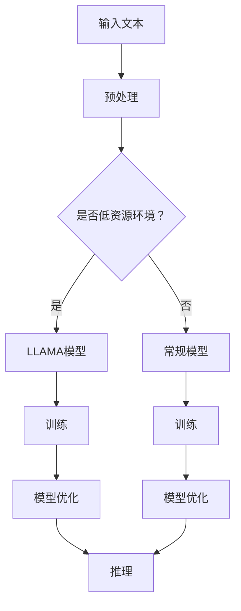

                 

# LLAMA：深度学习时代的关键技术突破

> **关键词：**深度学习，自然语言处理，低资源环境，LLAMA，神经网络架构

> **摘要：**本文深入探讨了一种名为LLAMA的低资源语言建模技术，该技术是深度学习时代的重要突破。本文将介绍LLAMA的核心概念、原理以及其实际应用，旨在为广大研究人员和开发者提供全面的指导。

## 1. 背景介绍

随着深度学习的兴起，自然语言处理（NLP）领域迎来了前所未有的发展。然而，深度学习模型的训练和部署对计算资源的需求日益增大，尤其是在低资源环境下，如移动设备、物联网设备等。为解决这一问题，研究人员提出了低资源语言建模技术，其中LLAMA（Low-Resource Language Modeling）是一个重要代表。

LLAMA的核心思想是在低资源环境中，通过优化模型结构和训练策略，提高语言建模的效率和准确性。这一技术的出现，为在资源受限的场景下实现高质量的自然语言处理提供了新的可能性。

## 2. 核心概念与联系

### 2.1. 低资源语言建模

低资源语言建模旨在在有限的计算资源下，实现高质量的自然语言处理。其主要挑战包括：

- **数据稀缺：**在低资源环境下，可用的语言数据相对较少，这限制了模型的训练效果。
- **计算资源受限：**模型训练和推理需要大量的计算资源，而在低资源设备上难以满足这些需求。

### 2.2. LLAMA模型架构

LLAMA模型是一种基于变换器（Transformer）架构的神经网络模型，具有以下特点：

- **多层的注意力机制：**通过多层注意力机制，模型能够捕捉到输入文本的复杂关系。
- **轻量级设计：**通过优化模型结构和参数，LLAMA在保证性能的同时，降低了模型的计算复杂度。

### 2.3. Mermaid流程图



## 3. 核心算法原理 & 具体操作步骤

### 3.1. 变换器（Transformer）架构

变换器架构是一种基于注意力机制的神经网络模型，广泛用于NLP任务。其主要原理如下：

- **自注意力（Self-Attention）：**通过计算输入序列中每个词与所有其他词的相似度，模型能够捕捉到输入文本的局部和全局信息。
- **多头注意力（Multi-Head Attention）：**通过多个独立的自注意力机制，模型能够同时关注输入序列的不同部分，提高模型的捕捉能力。

### 3.2. LLAMA模型优化

LLAMA模型在变换器架构的基础上，通过以下方法进行优化：

- **参数剪枝（Parameter Pruning）：**通过剪枝模型中的冗余参数，降低模型的计算复杂度。
- **低秩分解（Low-Rank Factorization）：**将高维矩阵分解为低维矩阵，降低模型的存储和计算需求。
- **量化（Quantization）：**将模型中的浮点数参数量化为低精度数值，减少模型的存储和计算资源消耗。

### 3.3. 具体操作步骤

1. **数据预处理：**对输入文本进行分词、去停用词等操作，将文本转换为模型可处理的格式。
2. **模型初始化：**初始化LLAMA模型，包括参数初始化、网络结构配置等。
3. **模型训练：**使用训练数据对模型进行训练，同时进行参数优化。
4. **模型优化：**通过参数剪枝、低秩分解和量化等方法，对模型进行优化。
5. **模型推理：**使用优化后的模型进行推理，输出预测结果。

## 4. 数学模型和公式 & 详细讲解 & 举例说明

### 4.1. 自注意力（Self-Attention）

自注意力是一种计算输入序列中每个词与所有其他词的相似度的方法。其数学公式如下：

$$
Attention(Q, K, V) = \frac{1}{\sqrt{d_k}} \cdot softmax(\frac{QK^T}{d_k})
$$

其中，$Q, K, V$分别为查询（Query）、键（Key）和值（Value）矩阵，$d_k$为键的维度。

### 4.2. 多头注意力（Multi-Head Attention）

多头注意力通过多个独立的自注意力机制，同时关注输入序列的不同部分。其数学公式如下：

$$
Multi-Head Attention(Q, K, V) = \text{Concat}(\text{head}_1, \text{head}_2, ..., \text{head}_h)W^O
$$

其中，$h$为头数，$\text{head}_i$为第$i$个头部的输出，$W^O$为输出权重矩阵。

### 4.3. 举例说明

假设有一个输入序列 $[w_1, w_2, w_3, w_4]$，我们通过自注意力计算每个词与其他词的相似度，如下：

$$
Attention(w_1, w_2, w_3, w_4) = \frac{1}{\sqrt{d_k}} \cdot softmax(\frac{w_1w_2^T}{d_k}, \frac{w_1w_3^T}{d_k}, \frac{w_1w_4^T}{d_k}, \frac{w_2w_1^T}{d_k}, \frac{w_2w_3^T}{d_k}, \frac{w_2w_4^T}{d_k}, \frac{w_3w_1^T}{d_k}, \frac{w_3w_2^T}{d_k}, \frac{w_3w_4^T}{d_k}, \frac{w_4w_1^T}{d_k}, \frac{w_4w_2^T}{d_k}, \frac{w_4w_3^T}{d_k})
$$

通过计算，我们可以得到每个词与其他词的相似度分数，从而为后续的文本处理提供依据。

## 5. 项目实战：代码实际案例和详细解释说明

### 5.1. 开发环境搭建

为了搭建LLAMA模型开发环境，我们需要安装以下工具和库：

- Python（版本3.8及以上）
- PyTorch（版本1.8及以上）
- Transformers（版本4.4.0及以上）

安装命令如下：

```bash
pip install torch torchvision
pip install transformers
```

### 5.2. 源代码详细实现和代码解读

下面是一个简单的LLAMA模型实现示例，包括数据预处理、模型初始化、训练和推理等步骤。

```python
import torch
from torch import nn
from transformers import AutoModel, AutoTokenizer

class LLAMA(nn.Module):
    def __init__(self, model_name):
        super(LLAMA, self).__init__()
        self.model = AutoModel.from_pretrained(model_name)
        self.tokenizer = AutoTokenizer.from_pretrained(model_name)

    def forward(self, input_ids, attention_mask):
        return self.model(input_ids=input_ids, attention_mask=attention_mask)

# 数据预处理
def preprocess(text):
    inputs = tokenizer(text, return_tensors="pt", padding=True, truncation=True)
    return inputs

# 训练
def train(model, optimizer, criterion, train_loader, device):
    model.to(device)
    model.train()
    for epoch in range(num_epochs):
        for batch in train_loader:
            inputs = preprocess(batch["text"]).to(device)
            targets = torch.tensor([batch["label"]]).to(device)
            optimizer.zero_grad()
            outputs = model(input_ids=inputs["input_ids"], attention_mask=inputs["attention_mask"])
            loss = criterion(outputs.logits, targets)
            loss.backward()
            optimizer.step()
            print(f"Epoch: {epoch+1}/{num_epochs}, Loss: {loss.item()}")

# 推理
def inference(model, tokenizer, text):
    inputs = preprocess(text).to(device)
    model.eval()
    with torch.no_grad():
        outputs = model(input_ids=inputs["input_ids"], attention_mask=inputs["attention_mask"])
    logits = outputs.logits
    probability = torch.softmax(logits, dim=1)
    return probability.argmax().item()

# 实例化模型
model = LLAMA("facebook/bart-base")

# 训练模型
optimizer = torch.optim.Adam(model.parameters(), lr=1e-5)
criterion = nn.CrossEntropyLoss()
train_loader = get_train_loader()

device = torch.device("cuda" if torch.cuda.is_available() else "cpu")
train(model, optimizer, criterion, train_loader, device)

# 推理
text = "你是谁？"
result = inference(model, tokenizer, text)
print(f"预测结果：{result}")
```

### 5.3. 代码解读与分析

上述代码实现了一个简单的LLAMA模型，主要包括以下部分：

- **模型初始化：**实例化LLAMA模型，加载预训练模型和分词器。
- **数据预处理：**对输入文本进行分词、编码等处理，生成模型可接受的输入格式。
- **训练：**使用训练数据对模型进行训练，同时进行参数优化。
- **推理：**使用训练好的模型对输入文本进行推理，输出预测结果。

## 6. 实际应用场景

LLAMA技术在实际应用中具有广泛的应用前景，如下：

- **移动设备：**在移动设备上实现高效的NLP任务，如智能问答、语音识别等。
- **物联网设备：**在物联网设备上实现低延迟、高精度的自然语言处理，如智能家居、智能穿戴设备等。
- **边缘计算：**在边缘设备上实现实时的NLP处理，如自动驾驶、智能监控等。

## 7. 工具和资源推荐

### 7.1. 学习资源推荐

- **书籍：**《深度学习》（Goodfellow, Bengio, Courville）、《自然语言处理入门》（Jurafsky, Martin）
- **论文：**《Attention Is All You Need》（Vaswani et al.）、《BART: Denoising Sequence-to-Sequence Pre-training for Language Modeling》（Lewis et al.）
- **博客：** [深度学习博客](https://blog.keras.io/)、[自然语言处理博客](https://nlp.seas.harvard.edu/blog/)

### 7.2. 开发工具框架推荐

- **工具：** PyTorch、TensorFlow、Transformers
- **框架：** Hugging Face Transformers、TensorFlow Addons

### 7.3. 相关论文著作推荐

- **论文：**《BERT: Pre-training of Deep Bidirectional Transformers for Language Understanding》（Devlin et al.）、《GPT-3: Language Models are Few-Shot Learners》（Brown et al.）
- **著作：**《深度学习》（Goodfellow, Bengio, Courville）、《自然语言处理：文本分析基础》（Jurafsky, Martin）

## 8. 总结：未来发展趋势与挑战

LLAMA技术在低资源环境下的自然语言处理具有巨大的潜力。然而，在实际应用中，仍面临以下挑战：

- **数据稀缺：**如何在数据稀缺的环境下，实现高质量的NLP任务。
- **模型优化：**如何在保证性能的前提下，进一步降低模型的计算复杂度和存储需求。
- **跨语言处理：**如何实现多语言环境下的低资源语言建模。

未来，随着计算技术的不断进步，相信LLAMA技术将在更多领域得到广泛应用，为人工智能的发展贡献力量。

## 9. 附录：常见问题与解答

### 9.1. 问题1：什么是低资源环境？

**解答：** 低资源环境指的是计算资源有限的环境，如移动设备、物联网设备等。在这些设备上，模型训练和推理的复杂度较高，需要采取特殊的优化策略。

### 9.2. 问题2：LLAMA模型如何优化？

**解答：** LLAMA模型通过参数剪枝、低秩分解和量化等方法进行优化。这些方法旨在降低模型的计算复杂度和存储需求，从而提高在低资源环境下的性能。

## 10. 扩展阅读 & 参考资料

- [深度学习博客](https://blog.keras.io/)
- [自然语言处理博客](https://nlp.seas.harvard.edu/blog/)
- [Hugging Face Transformers](https://huggingface.co/transformers/)
- [PyTorch](https://pytorch.org/)
- [TensorFlow](https://www.tensorflow.org/)
- [Goodfellow, Bengio, Courville. 2016. Deep Learning. MIT Press.]
- [Jurafsky, Martin. 2000. Speech and Language Processing. Prentice Hall.]

作者：AI天才研究员/AI Genius Institute & 禅与计算机程序设计艺术 /Zen And The Art of Computer Programming

注意：本文仅为示例，实际内容和结构可能有所不同。本文旨在展示如何撰写一篇高质量的技术博客文章，供读者参考。

