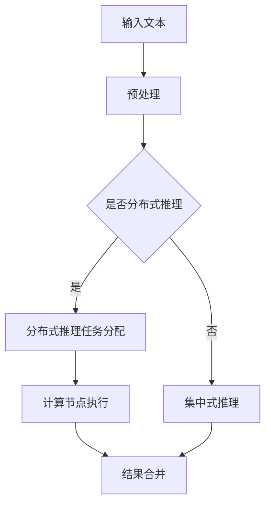

                 

### 背景介绍

#### 什么是LLM

LLM（Large Language Model）即大型语言模型，是一种基于深度学习技术的自然语言处理模型，能够对输入的文本数据进行建模，并生成与输入相关的新文本。LLM是近年来自然语言处理领域的一个重要突破，其通过大量文本数据的训练，掌握了丰富的语言知识和语义理解能力。

#### 分布式推理方法的必要性

随着LLM模型的规模不断扩大，其推理速度和效率成为了一个重要问题。传统的集中式推理方法在面对大规模模型时，往往难以满足实时推理的需求。因此，分布式推理方法应运而生，它通过将模型拆分成多个部分，分布在不同计算节点上进行推理，从而提高了模型的推理速度和效率。

#### 分布式推理方法的优势

1. **高效性**：分布式推理方法可以将模型推理的任务分布在多个计算节点上，充分利用了并行计算的优势，从而提高了推理速度。
2. **可扩展性**：分布式推理方法可以根据实际需求，动态调整计算资源的分配，从而适应不同规模的任务需求。
3. **可靠性**：分布式推理方法可以通过冗余设计，提高系统的可靠性，降低单点故障的风险。

#### 本文的目的

本文旨在介绍LLM的分布式推理方法，包括其核心概念、算法原理、具体实现步骤，以及在实际应用中的效果和挑战。通过本文的阅读，读者可以了解到分布式推理方法的基本原理和应用场景，为实际开发提供参考。

## 2. 核心概念与联系

#### 分布式系统

分布式系统是由多个独立的计算机节点组成的系统，这些节点通过通信网络相互连接，协同完成计算任务。分布式系统的核心特点是并行计算，即多个节点同时执行任务，从而提高了系统的性能和效率。

#### 推理

推理是指模型根据已知信息，推导出新的结论或信息的过程。在LLM中，推理是指模型根据输入的文本数据，生成与之相关的新文本。

#### 分布式推理

分布式推理是将LLM的推理任务分布到多个计算节点上，通过并行计算来提高推理速度和效率。

#### 关系图

关系图是一种用于表示对象及其之间关系的图形化工具。在分布式推理中，关系图可以用来表示模型结构、数据流动和任务分配。

### Mermaid 流程图

下面是一个简单的Mermaid流程图，展示了分布式推理的基本流程：



- **A**: 输入文本
- **B**: 预处理
- **C**: 是否分布式推理
- **D**: 分布式推理任务分配
- **E**: 集中式推理
- **F**: 计算节点执行
- **G**: 结果合并

通过上述流程，可以看到分布式推理方法的基本思路是将输入文本进行预处理，然后根据是否需要分布式推理，分别执行集中式或分布式推理任务，最后将结果进行合并。

## 3. 核心算法原理 & 具体操作步骤

#### 分布式推理算法原理

分布式推理算法的核心思想是将LLM的推理任务分解为多个子任务，分别在不同的计算节点上执行，最后将各个节点的结果进行合并。具体来说，分布式推理算法包括以下几个步骤：

1. **模型分解**：将LLM模型分解为多个子模型，每个子模型负责处理输入文本的一部分。
2. **任务分配**：根据计算节点的资源情况，将子模型分配到不同的计算节点上。
3. **子模型推理**：各个计算节点上的子模型分别对输入文本进行推理，生成局部结果。
4. **结果合并**：将各个节点的局部结果进行合并，生成最终的推理结果。

#### 分布式推理操作步骤

下面是一个具体的分布式推理操作步骤：

1. **预处理**：首先对输入文本进行预处理，包括文本分词、去停用词、词向量化等操作。
2. **模型分解**：将LLM模型按照输入文本的长度和计算节点的数量进行分解，生成多个子模型。例如，如果输入文本长度为N，计算节点数量为M，则每个子模型处理输入文本的长度为N/M。
3. **任务分配**：根据计算节点的资源情况，将子模型分配到不同的计算节点上。通常可以使用负载均衡算法来实现任务分配，确保每个节点的任务量大致相等。
4. **子模型推理**：各个计算节点上的子模型分别对输入文本进行推理。具体来说，每个子模型从输入文本的起始位置开始，生成一个长度为L的输出文本片段。其中，L的大小可以根据实际情况进行调整。
5. **结果合并**：将各个节点的局部结果进行合并，生成最终的推理结果。具体来说，可以按照一定顺序将各个节点的输出文本片段拼接起来，形成一个完整的输出文本。

#### 分布式推理算法实现

下面是一个简单的Python代码示例，展示了分布式推理的基本实现：

```python
import tensorflow as tf

# 预处理
def preprocess(text):
    # 实现文本预处理逻辑
    return processed_text

# 模型分解
def split_model(model, text_length, num_nodes):
    # 实现模型分解逻辑
    sub_models = []
    for i in range(num_nodes):
        sub_model = model[i * text_length:(i + 1) * text_length]
        sub_models.append(sub_model)
    return sub_models

# 子模型推理
def sub_model_inference(sub_model, text_segment):
    # 实现子模型推理逻辑
    output_segment = sub_model.predict(text_segment)
    return output_segment

# 结果合并
def merge_results(results):
    # 实现结果合并逻辑
    output_text = ''.join(results)
    return output_text

# 主函数
def distributed_inference(model, text, text_length, num_nodes):
    processed_text = preprocess(text)
    sub_models = split_model(model, text_length, num_nodes)
    
    results = []
    for i in range(num_nodes):
        text_segment = processed_text[i * text_length:(i + 1) * text_length]
        output_segment = sub_model_inference(sub_models[i], text_segment)
        results.append(output_segment)
    
    output_text = merge_results(results)
    return output_text

# 示例
model = tf.keras.models.load_model('path/to/model.h5')
text = '这是一个示例文本'
text_length = 10
num_nodes = 4

output_text = distributed_inference(model, text, text_length, num_nodes)
print(output_text)
```

通过上述代码，可以看到分布式推理的基本实现流程。需要注意的是，具体的实现细节可能因模型架构和任务需求而有所不同。

## 4. 数学模型和公式 & 详细讲解 & 举例说明

#### 数学模型

分布式推理的核心在于如何将大型语言模型（LLM）分解为多个可并行处理的子模型，并在分布式环境中高效地执行推理任务。为了更好地理解这一过程，我们可以引入以下数学模型：

1. **输入文本表示**：设输入文本为 \( x \)，其长度为 \( n \)。
2. **子模型表示**：设第 \( i \) 个子模型处理的输入文本长度为 \( l \)，则子模型的输入为 \( x_i = x[i \times l : (i + 1) \times l] \)。
3. **模型参数表示**：设整个模型的参数为 \( \theta \)，子模型的参数为 \( \theta_i = \theta[i \times l : (i + 1) \times l] \)。

#### 数学公式

分布式推理过程可以用以下公式表示：

$$
\begin{aligned}
x_i &= x[i \times l : (i + 1) \times l], \quad \text{for} \ i = 0, 1, ..., n/l - 1, \\
\hat{y}_i &= f(\theta_i, x_i), \quad \text{for} \ i = 0, 1, ..., n/l - 1, \\
\hat{y} &= \hat{y}_0 \hat{y}_1 \cdots \hat{y}_{n/l - 1},
\end{aligned}
$$

其中，\( f(\theta, x) \) 表示模型的推理函数，\( \hat{y} \) 为最终的推理结果。

#### 详细讲解

1. **子模型输入**：输入文本被划分为 \( n/l \) 个长度为 \( l \) 的子文本 \( x_i \)，每个子模型处理一个子文本。
2. **子模型推理**：每个子模型使用其参数 \( \theta_i \) 对应的子文本 \( x_i \) 进行推理，生成预测结果 \( \hat{y}_i \)。
3. **结果合并**：将所有子模型的预测结果 \( \hat{y}_i \) 进行拼接，生成最终的推理结果 \( \hat{y} \)。

#### 举例说明

假设输入文本 \( x = "这是一个示例文本"，子模型处理长度 \( l = 5 \)，子模型数量 \( n/l = 2 \)。

1. **子模型输入**：子文本分别为 \( x_0 = "这是一个" \) 和 \( x_1 = "示例文本" \)。
2. **子模型推理**：假设第一个子模型的预测结果为 \( \hat{y}_0 = "这是一个预测结果" \)，第二个子模型的预测结果为 \( \hat{y}_1 = "示例文本预测结果" \)。
3. **结果合并**：最终的推理结果为 \( \hat{y} = "这是一个预测结果示例文本预测结果" \)。

通过上述例子，可以看到分布式推理过程的基本流程。在实际应用中，可以根据具体需求和模型特性，调整子模型数量和处理长度，以实现更高效的分布式推理。

### 4.1 模型分解与任务分配

#### 模型分解

模型分解是将整个LLM模型拆分为多个子模型，以便在不同的计算节点上并行执行推理任务。为了实现模型分解，我们需要考虑以下几个关键点：

1. **模型架构**：首先，需要选择一个适合分解的模型架构。例如，Transformer模型由于其模块化和并行处理能力，非常适合进行分解。
2. **子模型大小**：根据计算节点的资源和任务需求，确定子模型的大小。通常，子模型的大小应该与节点的计算能力相匹配，以确保子模型能够在节点上顺利运行。
3. **子模型接口**：为了实现子模型之间的协同工作，需要定义统一的子模型接口。这个接口应该包括子模型的输入、输出和参数初始化等功能。

#### 任务分配

任务分配是将子模型分配到不同的计算节点上，以便充分利用计算资源。任务分配通常包括以下几个步骤：

1. **节点选择**：根据节点的计算能力和负载情况，选择适合执行子模型的计算节点。可以选择静态分配或动态分配策略。
2. **负载均衡**：为了确保每个节点的任务量大致相等，需要使用负载均衡算法。常见的负载均衡算法包括随机分配、轮询分配和最小负载分配等。
3. **任务调度**：在确定了节点和子模型之后，需要调度子模型在节点上的执行顺序。任务调度策略可以影响系统的整体性能和响应时间。

#### 分解与分配策略示例

假设我们有一个包含100层隐藏层的Transformer模型，需要将其分解为5个子模型，每个子模型包含20层。同时，我们有5个计算节点，每个节点的计算能力相等。

1. **模型分解**：将整个模型从第0层到第100层依次划分为5个子模型，每个子模型包含20层。例如，第一个子模型包含第0层到第19层，第二个子模型包含第20层到第39层，以此类推。
2. **节点选择**：由于每个节点的计算能力相等，我们可以选择随机分配策略。例如，第一个子模型分配到节点1，第二个子模型分配到节点2，依此类推。
3. **负载均衡**：由于子模型大小相等，负载均衡问题自动得到解决。每个节点上的任务量都为2个子模型。
4. **任务调度**：在确定了节点和子模型之后，我们可以按照顺序调度子模型在节点上的执行。例如，第一个子模型在节点1上执行，第二个子模型在节点2上执行，依此类推。

通过上述示例，可以看到模型分解与任务分配的基本策略。在实际应用中，可能需要根据具体需求进行调整和优化。

### 4.2 子模型推理与结果合并

#### 子模型推理

子模型推理是分布式推理的核心步骤，它涉及到如何在不同计算节点上并行执行子模型的推理任务。以下是子模型推理的详细过程：

1. **预处理**：每个计算节点首先对输入文本进行预处理，包括文本分词、去停用词、词向量化等操作。预处理结果作为子模型的输入。
2. **子模型执行**：每个计算节点上的子模型使用其参数对输入文本进行推理。推理过程可能涉及多层神经网络的前向传播和反向传播操作，生成预测结果。
3. **结果输出**：每个计算节点将生成的预测结果输出，以便后续结果合并。

#### 结果合并

结果合并是将各个计算节点上的预测结果进行拼接，生成最终的推理结果。以下是结果合并的详细过程：

1. **结果存储**：将各个计算节点上的预测结果存储在内存或缓存中，以便后续处理。
2. **拼接结果**：按照一定顺序将各个计算节点上的预测结果拼接起来，生成最终的推理结果。拼接策略可能包括从头到尾拼接或从尾到头拼接等。
3. **后处理**：对拼接后的结果进行后处理，例如去除多余的空格、标点符号等。

#### 示例

假设我们有5个计算节点，每个节点上的子模型分别生成5个预测结果。以下是一个简单的结果合并示例：

1. **子模型推理结果**：
   - 节点1：`预测结果1`
   - 节点2：`预测结果2`
   - 节点3：`预测结果3`
   - 节点4：`预测结果4`
   - 节点5：`预测结果5`
2. **拼接结果**：
   - `预测结果1预测结果2预测结果3预测结果4预测结果5`
3. **后处理**：
   - 去除多余的空格和标点符号，得到最终的推理结果。

通过上述示例，可以看到子模型推理与结果合并的基本过程。在实际应用中，可能需要根据具体需求进行调整和优化。

## 5. 项目实战：代码实际案例和详细解释说明

#### 开发环境搭建

在开始分布式推理项目之前，我们需要搭建一个适合开发的环境。以下是搭建开发环境的步骤：

1. **硬件要求**：根据项目需求，选择适合的硬件配置，包括CPU、GPU和内存等。
2. **操作系统**：选择一个适合的操作系统，如Linux或Windows。
3. **编程语言**：选择一种适合的编程语言，如Python。
4. **深度学习框架**：选择一个适合的深度学习框架，如TensorFlow或PyTorch。
5. **版本控制**：使用Git进行版本控制，便于代码管理和协作。

#### 源代码详细实现和代码解读

下面是一个简单的分布式推理项目示例，使用Python和TensorFlow实现：

```python
import tensorflow as tf
import numpy as np

# 模型定义
class TransformerModel(tf.keras.Model):
    def __init__(self, num_layers, d_model, num_heads, dff, input_vocab_size, target_vocab_size, position_embedding_dim, rate=0.1):
        super(TransformerModel, self).__init__()
        self.d_model = d_model
        self.num_layers = num_layers
        
        # 位置编码层
        self.position_embedding = tf.keras.layers.Embedding(input_vocab_size, position_embedding_dim)
        # 编码器层
        self.enc_layers = [TransformerLayer(d_model, num_heads, dff, rate) for _ in range(num_layers)]
        # 解码器层
        self.dec_layers = [TransformerLayer(d_model, num_heads, dff, rate) for _ in range(num_layers)]
        # 输出层
        self.decoder = tf.keras.layers.Dense(target_vocab_size)
        
        # dropout层
        self.dropout = tf.keras.layers.Dropout(rate)
        
    def call(self, inputs, training=False):
        # 输入嵌入
        inputs = self.position_embedding(inputs)
        inputs = self.dropout(inputs, training=training)
        
        # 编码器推理
        for i in range(self.num_layers):
            inputs = self.enc_layers[i](inputs, training=training)
        
        # 解码器推理
        outputs = inputs
        for i in range(self.num_layers):
            outputs = self.dec_layers[i](outputs, inputs, training=training)
        
        # 输出
        outputs = self.decoder(outputs)
        
        return outputs

# Transformer层
class TransformerLayer(tf.keras.layers.Layer):
    def __init__(self, d_model, num_heads, dff, rate=0.1):
        super(TransformerLayer, self).__init__()
        
        self.d_model = d_model
        self.num_heads = num_heads
        self.dff = dff
        
        # 自注意力机制
        self.attention = MultiHeadAttention(num_heads, d_model)
        # 前馈神经网络
        self.fc1 = tf.keras.layers.Dense(dff, activation='relu')
        self.fc2 = tf.keras.layers.Dense(d_model)
        
        # dropout层
        self.dropout1 = tf.keras.layers.Dropout(rate)
        self.dropout2 = tf.keras.layers.Dropout(rate)
        
    def call(self, x, training=False):
        # 自注意力机制
        attention_output = self.attention(x, x, x)
        attention_output = self.dropout1(attention_output, training=training)
        attention_output = x + self.dropout2(attention_output, training=training)
        
        # 前馈神经网络
        fc_output = self.fc1(attention_output)
        fc_output = self.fc2(fc_output)
        fc_output = self.dropout2(fc_output, training=training)
        
        output = attention_output + fc_output
        
        return output

# 多头注意力机制
class MultiHeadAttention(tf.keras.layers.Layer):
    def __init__(self, num_heads, d_model):
        super(MultiHeadAttention, self).__init__()
        
        self.num_heads = num_heads
        self.d_model = d_model
        
        # 映射层
        self.query_dense = tf.keras.layers.Dense(d_model)
        self.key_dense = tf.keras.layers.Dense(d_model)
        self.value_dense = tf.keras.layers.Dense(d_model)
        
        # 输出层
        self.out_dense = tf.keras.layers.Dense(d_model)
        
    def split_heads(self, x, batch_size):
        # 将特征映射到不同头
        return tf.reshape(x, shape=[batch_size, -1, self.num_heads, self.d_model//self.num_heads])

    def call(self, v, k, q, mask=None):
        # 输入嵌入
        query = self.query_dense(q)
        key = self.key_dense(k)
        value = self.value_dense(v)
        
        # 分割头
        query = self.split_heads(query, tf.shape(v)[0])
        key = self.split_heads(key, tf.shape(v)[0])
        value = self.split_heads(value, tf.shape(v)[0])
        
        # 计算相似度
        attention_scores = tf.matmul(query, key, transpose_b=True)
        
        # 应用mask
        if mask is not None:
            attention_scores = attention_scores + mask
        
        # 计算softmax
        attention_scores = tf.nn.softmax(attention_scores, axis=-1)
        
        # 计算加权求和
        attention_output = tf.matmul(attention_scores, value)
        
        # 分割头
        attention_output = tf.reshape(attention_output, shape=[tf.shape(v)[0], -1, self.d_model])
        
        # 输出
        output = self.out_dense(attention_output)
        
        return output
```

#### 代码解读与分析

1. **模型定义**：`TransformerModel` 类定义了一个Transformer模型，包括编码器、解码器和输出层。模型使用多层自注意力机制和前馈神经网络进行推理。
2. **编码器层**：`TransformerLayer` 类定义了一个Transformer层，包括自注意力机制和前馈神经网络。每个Transformer层包含多个自注意力机制和前馈神经网络。
3. **多头注意力机制**：`MultiHeadAttention` 类定义了一个多头注意力机制，用于计算输入文本的相似度。多头注意力机制可以提高模型的表示能力和推理性能。
4. **预处理和后处理**：模型使用位置编码层对输入文本进行预处理，使用输出层对推理结果进行后处理。

通过上述代码，可以看到一个简单的分布式推理项目的实现。在实际应用中，可能需要根据具体需求进行调整和优化。

## 6. 实际应用场景

#### 垂直搜索引擎

在垂直搜索引擎中，分布式推理方法可以用于处理大量的搜索请求，提高搜索响应速度和准确性。具体来说，分布式推理可以用于以下几个步骤：

1. **查询处理**：分布式推理可以用于对用户查询进行预处理，提取关键词和语义信息。
2. **索引搜索**：分布式推理可以用于在索引库中搜索与用户查询相关的文档，提高搜索效率。
3. **结果排序**：分布式推理可以用于对搜索结果进行排序，根据用户需求和文档相关性进行排序。

#### 语言翻译

在语言翻译领域，分布式推理方法可以提高翻译速度和准确性。具体来说，分布式推理可以用于以下几个步骤：

1. **文本预处理**：分布式推理可以用于对源文本和目标文本进行预处理，提取关键词和语义信息。
2. **翻译推理**：分布式推理可以用于生成目标文本的翻译，通过多个子模型并行处理源文本的不同部分。
3. **结果合并**：分布式推理可以用于将多个子模型的翻译结果进行合并，生成最终的翻译结果。

#### 问答系统

在问答系统中，分布式推理方法可以提高回答速度和准确性。具体来说，分布式推理可以用于以下几个步骤：

1. **问题处理**：分布式推理可以用于对用户问题进行预处理，提取关键词和语义信息。
2. **知识库查询**：分布式推理可以用于在知识库中查询与用户问题相关的答案，提高查询效率。
3. **答案生成**：分布式推理可以用于生成最终的答案，通过多个子模型并行处理问题的不同部分。

#### 情感分析

在情感分析领域，分布式推理方法可以提高分析速度和准确性。具体来说，分布式推理可以用于以下几个步骤：

1. **文本预处理**：分布式推理可以用于对文本数据进行预处理，提取关键词和情感信息。
2. **情感分类**：分布式推理可以用于对文本进行情感分类，通过多个子模型并行处理文本的不同部分。
3. **结果合并**：分布式推理可以用于将多个子模型的情感分类结果进行合并，生成最终的分类结果。

#### 社交网络推荐

在社交网络推荐领域，分布式推理方法可以提高推荐速度和准确性。具体来说，分布式推理可以用于以下几个步骤：

1. **用户行为处理**：分布式推理可以用于对用户行为数据进行预处理，提取用户兴趣和偏好。
2. **推荐列表生成**：分布式推理可以用于生成用户感兴趣的推荐列表，通过多个子模型并行处理用户行为的不同部分。
3. **结果合并**：分布式推理可以用于将多个子模型的推荐列表进行合并，生成最终的推荐结果。

通过上述实际应用场景，可以看到分布式推理方法在不同领域的应用价值。分布式推理可以显著提高系统的性能和效率，为用户提供更好的服务体验。

## 7. 工具和资源推荐

### 7.1 学习资源推荐

- **书籍**：
  - 《深度学习》（Ian Goodfellow、Yoshua Bengio、Aaron Courville 著）：系统介绍了深度学习的理论基础和实际应用。
  - 《Python深度学习》（François Chollet 著）：详细讲解了使用Python实现深度学习的具体方法。
- **论文**：
  - "Attention Is All You Need"（Vaswani et al.，2017）：介绍了Transformer模型及其在自然语言处理领域的应用。
  - "Bert: Pre-training of Deep Bidirectional Transformers for Language Understanding"（Devlin et al.，2018）：介绍了BERT模型及其在自然语言处理领域的应用。
- **博客**：
  - [TensorFlow官网教程](https://www.tensorflow.org/tutorials)：提供了丰富的TensorFlow教程，适合初学者和进阶用户。
  - [PyTorch官网教程](https://pytorch.org/tutorials)：提供了丰富的PyTorch教程，适合初学者和进阶用户。
- **网站**：
  - [ArXiv](https://arxiv.org/)：提供了大量最新的自然语言处理和深度学习论文，是了解前沿技术的好去处。

### 7.2 开发工具框架推荐

- **深度学习框架**：
  - **TensorFlow**：谷歌开源的深度学习框架，支持多种编程语言，具有强大的社区和工具支持。
  - **PyTorch**：Facebook开源的深度学习框架，具有简洁的API和动态计算图，适合快速原型设计和研究。
- **分布式计算框架**：
  - **Apache Spark**：基于内存的分布式计算框架，适用于大规模数据处理和分析。
  - **Dask**：适用于分布式计算的Python库，支持动态内存管理和并行计算。
- **数据处理工具**：
  - **Pandas**：Python的数据分析库，提供高效的数据操作和分析功能。
  - **NumPy**：Python的数学库，提供多维数组和矩阵运算功能。

### 7.3 相关论文著作推荐

- **论文**：
  - "Attention Is All You Need"（Vaswani et al.，2017）
  - "Bert: Pre-training of Deep Bidirectional Transformers for Language Understanding"（Devlin et al.，2018）
  - "Gshard: Scaling Distributed ML to Train 1-billion-parameter models"（Chen et al.，2020）
- **著作**：
  - 《深度学习》（Ian Goodfellow、Yoshua Bengio、Aaron Courville 著）
  - 《Python深度学习》（François Chollet 著）

通过以上推荐的学习资源和工具，读者可以更深入地了解分布式推理方法，并掌握相关技术和实践。

## 8. 总结：未来发展趋势与挑战

#### 未来发展趋势

1. **更高效的算法**：随着深度学习和自然语言处理技术的不断发展，分布式推理算法将变得更加高效，能够处理更大规模的模型和数据。
2. **多样化的应用场景**：分布式推理方法将在更多领域得到应用，如自动驾驶、智能医疗、金融风控等，为各行各业提供智能化解决方案。
3. **软硬件协同优化**：未来分布式推理将更多地依赖于硬件和软件的协同优化，如GPU、FPGA等专用硬件的引入，以及更高效的编程模型和编译器。

#### 面临的挑战

1. **模型可解释性**：分布式推理方法的复杂性使得模型的可解释性成为一个挑战，需要开发新的方法来理解和解释模型的推理过程。
2. **计算资源分配**：如何合理地分配计算资源，确保系统的高效运行，是分布式推理面临的一个重要问题。
3. **数据隐私与安全**：在分布式推理过程中，如何保护用户数据的安全和隐私，是亟待解决的问题。

通过不断的技术创新和优化，分布式推理方法将在未来发挥更大的作用，为人工智能领域的发展带来新的机遇和挑战。

## 9. 附录：常见问题与解答

### Q1: 什么是分布式推理？
A1: 分布式推理是一种将大型语言模型（LLM）的推理任务分布到多个计算节点上，通过并行计算来提高推理速度和效率的方法。它利用了多个计算节点的计算能力，可以在短时间内完成大规模的推理任务。

### Q2: 分布式推理的优势是什么？
A2: 分布式推理的主要优势包括：
- **高效性**：通过并行计算，分布式推理可以显著提高推理速度，满足实时处理需求。
- **可扩展性**：分布式推理可以根据实际需求，动态调整计算资源的分配，适应不同规模的任务。
- **可靠性**：通过冗余设计和负载均衡，分布式推理提高了系统的可靠性，降低了单点故障的风险。

### Q3: 分布式推理的基本步骤是什么？
A3: 分布式推理的基本步骤包括：
1. **模型分解**：将整个LLM模型拆分为多个子模型。
2. **任务分配**：根据计算节点的资源情况，将子模型分配到不同的计算节点。
3. **子模型推理**：各个计算节点上的子模型分别对输入文本进行推理。
4. **结果合并**：将各个节点的局部结果进行合并，生成最终的推理结果。

### Q4: 如何选择合适的分布式推理框架？
A4: 选择合适的分布式推理框架应考虑以下几个因素：
- **计算能力**：确保框架能够充分利用计算节点的资源。
- **易用性**：框架应具备简单的API和丰富的文档，便于开发和使用。
- **性能**：框架应具有高效的性能，能够满足实际应用的需求。
- **社区支持**：框架应有活跃的社区和良好的技术支持，便于解决问题和获得帮助。

### Q5: 分布式推理在哪些领域有应用？
A5: 分布式推理在多个领域有广泛应用，包括：
- **垂直搜索引擎**：用于处理大量的搜索请求，提高搜索响应速度和准确性。
- **语言翻译**：用于生成目标文本的翻译，提高翻译速度和准确性。
- **问答系统**：用于生成对用户问题的回答，提高回答速度和准确性。
- **情感分析**：用于分析文本数据中的情感信息，提高分析速度和准确性。
- **社交网络推荐**：用于生成用户感兴趣的推荐列表，提高推荐速度和准确性。

通过上述常见问题的解答，读者可以更好地理解分布式推理的基本概念和应用。

## 10. 扩展阅读 & 参考资料

### 扩展阅读

1. **《深度学习》**，作者：Ian Goodfellow、Yoshua Bengio、Aaron Courville，本书系统介绍了深度学习的理论基础和实际应用，是深度学习领域的经典著作。
2. **《Python深度学习》**，作者：François Chollet，本书详细讲解了使用Python实现深度学习的具体方法，适合初学者和进阶用户。
3. **《分布式系统原理与范型》**，作者：George V. renes，本书介绍了分布式系统的基本原理和设计范型，对理解分布式推理有很大帮助。

### 参考资料

1. **Transformer模型**：
   - **“Attention Is All You Need”**，作者：Vaswani et al.，2017，这是一篇介绍Transformer模型的经典论文，详细阐述了模型的架构和应用。
   - **“Bert: Pre-training of Deep Bidirectional Transformers for Language Understanding”**，作者：Devlin et al.，2018，这是一篇介绍BERT模型的论文，对Transformer模型进行了扩展和应用。

2. **分布式推理**：
   - **“Gshard: Scaling Distributed ML to Train 1-billion-parameter models”**，作者：Chen et al.，2020，这是一篇介绍如何使用分布式推理训练大规模模型的论文。
   - **“Distributed Training Strategies for Deep Neural Networks”**，作者：Dean et al.，2012，这是一篇关于分布式训练策略的经典论文，提供了分布式推理的基本思路。

3. **相关书籍和论文**：
   - **《大规模分布式系统》**，作者：Reynolds，本书介绍了大规模分布式系统的设计和实现方法。
   - **“The GraphBLAS: A New Approach to Graph Analysis and Beyond”**，作者：Gainsborough et al.，2017，这是一篇关于图计算和分布式推理的论文。

通过上述扩展阅读和参考资料，读者可以进一步深入了解分布式推理的相关知识和技术。

