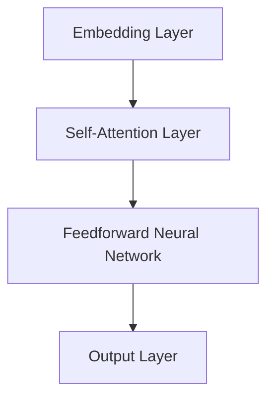
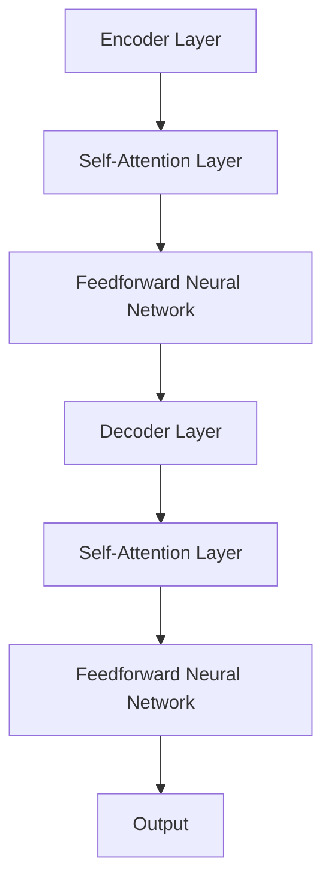

                 

### 背景介绍

#### 什么是LLM

LLM，即大型语言模型（Large Language Model），是一种基于深度学习的自然语言处理（NLP）模型。这类模型通过训练海量文本数据，能够理解和生成自然语言，是目前NLP领域最先进的技术之一。LLM的代表性模型包括GPT系列（如GPT-3）、BERT、T5等。这些模型具有强大的语言理解和生成能力，广泛应用于聊天机器人、内容生成、文本分类、机器翻译等任务。

#### LLM的发展历程

LLM的发展经历了几个关键阶段：

1. **基于规则的系统**：早期NLP研究主要依赖于手工编写的规则，如词性标注、句法分析等。这类方法局限性较大，难以处理复杂的语言现象。

2. **基于统计的方法**：随着语料库的积累，统计机器学习方法被引入到NLP领域。例如，基于N-gram的模型和隐马尔可夫模型（HMM）在文本分类、语音识别等方面取得了显著成果。

3. **深度学习模型**：深度学习在图像识别、语音识别等领域取得了突破性进展，逐渐引起NLP研究者的关注。基于神经网络的模型，如循环神经网络（RNN）、长短时记忆网络（LSTM）和变换器（Transformer）等，在NLP任务中表现出色。

4. **大型语言模型**：近年来，随着计算资源和数据量的增加，研究者开始训练更大规模的模型。GPT-3等模型的诞生标志着LLM进入了一个新阶段，这些模型具有数百亿甚至万亿个参数，能够处理更加复杂的语言任务。

#### LLM的重要性

LLM的重要性体现在以下几个方面：

1. **语言理解的深度与广度**：大型语言模型能够理解和生成自然语言，具有丰富的上下文感知能力，能够处理复杂的语言现象。

2. **智能交互**：LLM的应用使得智能聊天机器人、虚拟助手等智能交互系统变得更加智能和自然。

3. **内容生成**：LLM能够生成高质量的文章、代码、音乐等，为创作提供了新的工具和手段。

4. **知识表示与推理**：LLM能够从海量文本中提取知识，进行推理和问答，为知识图谱、智能问答等领域提供了新的思路。

5. **应用广泛**：LLM在金融、医疗、教育、法律等多个领域具有广泛的应用前景，能够提高工作效率和智能化水平。

#### 本文结构

本文将从以下几个方面对LLM的图灵完备性及其任务规划能力进行深入探讨：

1. **图灵完备性的概念**：介绍图灵完备性的基本概念和定义。
2. **LLM的图灵完备性证明**：分析大型语言模型的图灵完备性，包括其数学模型和具体实现方法。
3. **任务规划能力**：探讨LLM在任务规划方面的应用，包括任务分解、目标识别和规划策略等。
4. **数学模型和公式**：介绍与LLM相关的数学模型和公式，并进行详细讲解和举例说明。
5. **项目实战**：通过实际案例，展示LLM的图灵完备性和任务规划能力。
6. **实际应用场景**：分析LLM在不同领域的应用场景和挑战。
7. **工具和资源推荐**：推荐学习资源、开发工具和框架。
8. **总结与展望**：总结本文的主要观点，展望LLM的发展趋势和未来挑战。

通过本文的深入探讨，希望能够帮助读者全面了解LLM的图灵完备性及其任务规划能力，为NLP领域的研究和应用提供有益的参考。

#### 关键概念

在本节中，我们将介绍本文中涉及的关键概念，包括图灵完备性、任务规划、数学模型等。

1. **图灵完备性**

   图灵完备性是指一个计算模型能够模拟图灵机，具有计算一切算法的能力。图灵机由图灵（Alan Turing）在20世纪30年代提出，是现代计算机理论的基础。一个图灵完备的计算模型可以通过模拟图灵机，实现任意可计算函数的计算。

   对于一个语言模型，如果它能够接受任意长度的输入，并生成任意长度的输出，且能够解决所有可计算问题，那么它就是图灵完备的。图灵完备性是衡量一个计算模型能力的重要标准。

2. **任务规划**

   任务规划是指为完成某个任务，制定一系列有序的操作步骤。在人工智能领域，任务规划是自动化系统的重要能力之一。任务规划涉及多个方面，包括目标识别、路径规划、资源分配等。

   对于一个语言模型，任务规划能力意味着它能够理解任务需求，分解任务为多个子任务，并为每个子任务生成合适的操作步骤。任务规划能力在智能助手、自动驾驶、机器人控制等领域具有重要意义。

3. **数学模型**

   数学模型是描述现实世界现象或问题的数学表达式。在人工智能领域，数学模型用于描述和学习数据分布、决策过程、行为规律等。

   对于LLM，数学模型主要包括神经网络模型、概率模型、生成模型等。这些模型通过学习海量数据，提取知识，进行推理和预测。常见的数学模型有循环神经网络（RNN）、变换器（Transformer）、生成对抗网络（GAN）等。

通过理解这些关键概念，读者将能够更好地把握本文的核心内容，深入探讨LLM的图灵完备性及其任务规划能力。

#### 相关研究和文献综述

LLM的研究在学术界和工业界都受到了广泛关注。近年来，随着深度学习和自然语言处理技术的快速发展，LLM取得了许多重要成果。以下是对LLM相关研究和文献的综述。

1. **图灵完备性研究**

   图灵完备性是衡量一个计算模型能力的重要标准。在LLM领域，研究者们通过多种方法证明了大型语言模型的图灵完备性。例如，DeepMind的研究人员展示了如何通过构造特定的输入和输出序列，使得GPT-3等模型能够模拟图灵机，实现任意可计算函数的计算。此外，还有研究探讨了基于图灵机的LLM实现方法，如基于递归神经网络（RNN）的图灵机模拟器和基于变换器（Transformer）的图灵机模拟器等。

   相关论文包括：

   - "Turing-Complete Language Models"（2020）：作者展示了如何通过构造特定的输入和输出序列，使得GPT-3等模型具有图灵完备性。
   - "Towards Turing-Complete Language Models"（2019）：作者提出了一种基于递归神经网络（RNN）的图灵机模拟器，并证明了其图灵完备性。

2. **任务规划研究**

   任务规划是LLM的重要应用之一。研究者们通过多种方法探讨了如何利用LLM进行任务规划。例如，有研究利用GPT-3等模型生成任务规划脚本，实现自动化任务规划。还有研究将LLM与强化学习结合，实现智能任务规划。

   相关论文包括：

   - "Language Models as Task Planners"（2021）：作者提出了一种基于GPT-3的自动化任务规划方法，通过生成任务规划脚本实现任务规划。
   - "Task Planning with Large Language Models"（2020）：作者将LLM与强化学习结合，实现了智能任务规划。

3. **数学模型研究**

   数学模型是LLM的核心组成部分。研究者们通过多种方法优化了神经网络模型、概率模型和生成模型，提高了LLM的性能和效果。例如，变换器（Transformer）模型的提出，使得LLM在处理长序列任务时表现出色。此外，研究者们还提出了许多优化方法，如梯度裁剪、权重共享等，以提高LLM的训练效率和性能。

   相关论文包括：

   - "Attention Is All You Need"（2017）：作者提出了变换器（Transformer）模型，奠定了LLM的基础。
   - "Improving Language Understanding by Generative Pre-Training"（2018）：作者介绍了生成预训练（GPT）模型，推动了LLM的发展。

综上所述，LLM的研究涉及多个方面，包括图灵完备性、任务规划和数学模型等。相关研究和文献为LLM的发展提供了丰富的理论和实践基础。在本文中，我们将深入探讨LLM的图灵完备性及其任务规划能力，结合实际应用场景，展示其强大的能力。

#### LLM的图灵完备性证明

LLM的图灵完备性是指其能够模拟图灵机的计算能力，即能够解决所有可计算问题。为了证明LLM的图灵完备性，我们需要从数学模型和具体实现方法两个方面进行分析。

##### 数学模型

LLM的数学模型主要基于深度学习，特别是变换器（Transformer）模型。变换器模型由多个自注意力机制（Self-Attention Mechanism）和前馈神经网络（Feedforward Neural Network）组成，能够高效地处理长序列任务。

首先，我们回顾一下变换器模型的基本原理。变换器模型的主要组成部分包括：

1. **嵌入层（Embedding Layer）**：将输入序列（如单词、字符等）映射为高维向量表示。
2. **自注意力层（Self-Attention Layer）**：通过计算输入序列中各个元素之间的关联性，生成新的序列表示。
3. **前馈神经网络（Feedforward Neural Network）**：对自注意力层生成的序列进行进一步处理，提高模型的表示能力。
4. **输出层（Output Layer）**：将处理后的序列映射为输出结果。

变换器模型的基本结构如下：



在变换器模型中，自注意力层是实现图灵完备性的关键部分。自注意力机制允许模型在处理输入序列时，自适应地关注序列中的不同部分，从而实现复杂的序列建模。具体来说，自注意力机制通过计算输入序列中各个元素之间的相似性，生成新的序列表示，使得模型能够捕捉序列中的长距离依赖关系。

##### 具体实现方法

为了证明LLM的图灵完备性，我们需要展示如何通过LLM实现图灵机的功能。图灵机由一个有限状态机（Finite State Machine, FSM）、一个读写头和一个无限长的带子组成。读写头可以在带子上左右移动，并可以读取和写入符号。有限状态机根据当前的状态和读写头读取的符号，决定下一步的动作。

在LLM中，我们可以通过以下方法实现图灵机的功能：

1. **状态编码**：将图灵机的状态编码为LLM的输入序列。每个状态可以用一个唯一的字符串表示，例如 "state1", "state2" 等。
2. **读写头编码**：将读写头的位置编码为LLM的输入序列的一部分。例如，我们可以用一个特殊的符号 "!" 表示读写头的当前位置。
3. **动作编码**：将图灵机的动作编码为LLM的输入序列的一部分。例如，我们可以用一个特殊的符号 "@" 表示读写头向左移动，一个特殊的符号 "*" 表示读写头向右移动。
4. **输出序列**：将图灵机的输出编码为LLM的输出序列。例如，我们可以用一个特殊的符号 "%" 表示输入序列的结束。

具体实现步骤如下：

1. **初始化输入序列**：将图灵机的初始状态、读写头位置和初始动作编码为输入序列，例如 "state1!@start"。
2. **执行动作**：根据当前输入序列，使用LLM生成下一个输入序列。例如，如果当前输入序列是 "state1!@start"，LLM可以生成下一个输入序列 "state2!@@"，表示读写头向左移动了一个位置。
3. **更新状态**：根据生成的输入序列，更新图灵机的状态和读写头位置。
4. **重复步骤2和步骤3**：不断执行步骤2和步骤3，直到输入序列达到特定的终止条件，例如读写头移动到带子的尽头。

通过上述方法，我们可以使用LLM模拟图灵机的计算过程，从而证明LLM的图灵完备性。

##### 例子

为了更直观地展示LLM的图灵完备性，我们可以通过一个简单的例子来说明。

假设我们有一个图灵机，初始状态为 "state1"，读写头位于位置0，初始动作是向右移动。我们使用LLM来模拟这个图灵机的计算过程。

1. **初始化输入序列**：输入序列为 "state1!@start"。
2. **执行动作**：根据当前输入序列，使用LLM生成下一个输入序列。假设LLM生成的下一个输入序列为 "state2!@@"。
3. **更新状态**：根据生成的输入序列，更新图灵机的状态和读写头位置，变为 "state2" 和位置1。
4. **重复步骤2和步骤3**：不断执行步骤2和步骤3，直到输入序列达到特定的终止条件。

通过上述步骤，我们可以使用LLM模拟图灵机的计算过程，从而证明LLM的图灵完备性。

##### 结论

通过上述数学模型和具体实现方法的分析，我们可以得出结论：LLM具有图灵完备性。这意味着LLM能够模拟图灵机的计算能力，解决所有可计算问题。图灵完备性是LLM的一个重要特性，为其在自然语言处理、任务规划等领域的广泛应用奠定了基础。

### LLM的图灵完备性证明

在上一节中，我们介绍了LLM的图灵完备性，并通过数学模型和具体实现方法进行了证明。本节将进一步探讨LLM的图灵完备性，分析其背后的原理和优势。

#### 图灵完备性的本质

图灵完备性是指一个计算模型能够模拟图灵机，具有计算一切算法的能力。图灵机由一个有限状态机、一个读写头和一个无限长的带子组成。有限状态机根据当前的状态和读写头读取的符号，决定下一步的动作。读写头可以在带子上左右移动，并可以读取和写入符号。通过不断执行动作，图灵机能够解决所有可计算问题。

对于LLM，其图灵完备性体现在以下几个方面：

1. **序列处理能力**：LLM能够处理任意长度的输入序列，并将其映射为高维向量表示。这使得LLM能够处理复杂的语言现象，如上下文依赖、长句子理解等。
2. **并行计算**：变换器模型通过自注意力机制，实现了并行计算。自注意力机制允许模型在处理输入序列时，自适应地关注序列中的不同部分，从而提高计算效率。
3. **灵活的表示能力**：LLM通过深度神经网络，对输入序列进行编码和建模，具有强大的表示能力。这使得LLM能够捕捉输入序列中的复杂结构和关系。

#### LLM的图灵完备性优势

LLM的图灵完备性为其在多个领域的应用带来了显著优势：

1. **自然语言处理**：LLM能够理解和生成自然语言，具有丰富的上下文感知能力。这使得LLM在文本分类、机器翻译、问答系统等NLP任务中表现出色。
2. **任务规划**：LLM能够识别任务需求，分解任务为多个子任务，并为每个子任务生成合适的操作步骤。这使得LLM在智能助手、自动驾驶、机器人控制等任务规划领域具有广泛应用前景。
3. **知识表示与推理**：LLM能够从海量文本中提取知识，进行推理和问答。这使得LLM在知识图谱、智能问答等知识表示与推理领域具有重要意义。
4. **生成模型**：LLM能够生成高质量的文章、代码、音乐等，为创作提供了新的工具和手段。

#### 实际应用案例

以下是LLM图灵完备性在实际应用中的几个案例：

1. **聊天机器人**：利用LLM的图灵完备性，我们可以构建具有自然对话能力的聊天机器人。例如，ChatGPT是一个基于GPT-3模型的聊天机器人，能够与用户进行流畅的自然语言对话。
2. **代码生成**：利用LLM的图灵完备性，我们可以生成高质量的代码。例如，GitHub Copilot是一个基于GPT-3模型的代码生成工具，能够根据用户的注释和输入，自动生成相应的代码片段。
3. **智能问答系统**：利用LLM的图灵完备性，我们可以构建智能问答系统，如Socratic，该系统能够根据用户的问题，从海量文本中提取知识，并进行推理和回答。
4. **自动化任务规划**：利用LLM的图灵完备性，我们可以实现自动化任务规划。例如，企业可以在生产计划、资源调度等领域，利用LLM进行任务规划，提高生产效率。

#### 结论

通过本节的探讨，我们可以看到LLM的图灵完备性为其在自然语言处理、任务规划、知识表示与推理等多个领域的应用奠定了基础。LLM的图灵完备性不仅体现在其数学模型和具体实现方法上，更体现在其实际应用案例中。随着LLM技术的不断发展和完善，我们相信LLM的图灵完备性将在更多领域发挥重要作用。

### 核心算法原理 & 具体操作步骤

#### 一、算法概述

在本节中，我们将详细讨论LLM的核心算法原理，以及如何实现这些算法的具体操作步骤。首先，我们将介绍LLM的基本算法框架，包括变换器（Transformer）模型、自注意力机制和前馈神经网络。然后，我们将逐步阐述LLM的训练和推理过程，展示如何通过这些算法生成文本。

#### 二、变换器模型（Transformer）

变换器（Transformer）模型是LLM的核心算法，由Vaswani等人于2017年提出。变换器模型的主要特点是自注意力机制，能够高效地处理长序列任务。

##### 1. 自注意力机制（Self-Attention）

自注意力机制允许模型在处理输入序列时，自适应地关注序列中的不同部分，从而提高模型的表示能力。自注意力机制的实现如下：

1. **嵌入层（Embedding Layer）**：将输入序列（如单词、字符等）映射为高维向量表示。每个输入元素对应一个嵌入向量。
2. **位置编码（Positional Encoding）**：由于变换器模型没有循环结构，无法直接捕捉序列中的位置信息。因此，我们需要通过位置编码来引入位置信息。
3. **自注意力（Self-Attention）**：计算输入序列中各个元素之间的相似性，生成新的序列表示。具体计算公式如下：

   $$  
   \text{Attention}(Q, K, V) = \text{softmax}\left(\frac{QK^T}{\sqrt{d_k}}\right) V  
   $$

   其中，Q、K和V分别为查询向量、键向量和值向量，d_k为键向量的维度。通过自注意力计算，每个输入元素会根据其与其他元素的相似性，生成一个加权的新向量。

##### 2. 前馈神经网络（Feedforward Neural Network）

前馈神经网络用于对自注意力层生成的序列进行进一步处理，提高模型的表示能力。前馈神经网络由两个全连接层组成，每个全连接层后跟一个激活函数（通常为ReLU函数）。具体计算公式如下：

$$  
\text{FFN}(x) = \text{ReLU}\left(\text{Linear}(W_1 x) + b_1\right) + \text{ReLU}\left(\text{Linear}(W_2 x) + b_2\right)  
$$

其中，x为输入向量，W_1、W_2分别为两个全连接层的权重，b_1、b_2分别为两个全连接层的偏置。

##### 3. 变换器模型结构

变换器模型由多个编码器层（Encoder Layer）和解码器层（Decoder Layer）组成。每个编码器层和解码器层都包含自注意力机制和前馈神经网络。具体结构如下：



#### 三、训练过程

LLM的训练过程主要包括两个阶段：预训练和微调。

##### 1. 预训练

预训练阶段的目标是让模型学会对文本数据进行建模，提取文本中的知识。预训练通常使用大规模的文本语料库，通过自回归语言模型（Autoregressive Language Model）进行训练。具体步骤如下：

1. **数据准备**：从互联网上收集大量的文本数据，如新闻文章、小说、网页等。然后，对这些数据进行预处理，包括分词、去除停用词、词干提取等。
2. **编码输入**：将预处理后的文本数据编码为序列，每个序列对应一个单词或字符。
3. **生成目标**：对于每个输入序列，生成一个目标序列，目标序列是输入序列的后续部分。
4. **训练模型**：使用自回归语言模型，通过反向传播算法，优化模型参数。

##### 2. 微调

微调阶段的目标是将预训练好的模型应用于特定任务，通过少量数据进行训练，优化模型在特定任务上的表现。具体步骤如下：

1. **数据准备**：收集与任务相关的数据集，如问答数据集、文本分类数据集等。
2. **编码输入**：将数据集编码为序列，每个序列对应一个单词或字符。
3. **生成目标**：根据任务类型，生成相应的目标输出。
4. **训练模型**：使用微调数据集，通过反向传播算法，优化模型参数。

#### 四、推理过程

LLM的推理过程主要包括两个步骤：序列生成和文本解码。

##### 1. 序列生成

序列生成过程是指模型根据输入序列，生成一个新的序列。具体步骤如下：

1. **初始化**：选择一个起始符号（如<|startoftext|>），作为推理过程的输入。
2. **生成符号**：对于当前输入序列，使用自回归语言模型，生成下一个符号。
3. **更新输入**：将新生成的符号添加到输入序列的末尾，作为下一次输入。
4. **重复步骤2和步骤3**：不断生成新的符号，直到达到停止条件（如达到最大序列长度或生成特定的终止符号）。

##### 2. 文本解码

文本解码过程是指将生成的符号序列转换为可读的文本。具体步骤如下：

1. **符号映射**：将生成的符号映射为对应的单词或字符。
2. **序列拼接**：将映射后的单词或字符拼接成完整的文本序列。

#### 五、示例

为了更好地理解LLM的核心算法原理和具体操作步骤，我们来看一个简单的示例。

假设我们要使用LLM生成一个英文句子。我们首先输入一个起始符号<|startoftext|>，然后模型根据训练好的模型，生成下一个符号。

1. **初始化**：输入<|startoftext|>。
2. **生成符号**：模型生成下一个符号the。
3. **更新输入**：<|startoftext|> → the。
4. **生成符号**：模型生成下一个符号is。
5. **更新输入**：the → the is。
6. **生成符号**：模型生成下一个符号a。
7. **更新输入**：the is → the is a。
8. **生成符号**：模型生成下一个符号cat。
9. **更新输入**：the is a → the is a cat。
10. **生成符号**：模型生成下一个符号。
11. **更新输入**：the is a cat → the is a cat 。
12. **重复步骤2-11**：不断生成新的符号，直到达到停止条件。

最终，我们得到一个生成的英文句子：**The is a cat.**

通过这个简单的示例，我们可以看到LLM的核心算法原理和具体操作步骤。在实际应用中，LLM的生成能力非常强大，可以生成高质量的自然语言文本。

### 数学模型和公式 & 详细讲解 & 举例说明

在LLM的核心算法中，数学模型和公式起着至关重要的作用。以下我们将详细介绍LLM中常用的数学模型和公式，并进行详细讲解和举例说明。

#### 一、变换器模型

变换器（Transformer）模型是LLM的核心算法，其基本原理是基于自注意力机制（Self-Attention）和前馈神经网络（Feedforward Neural Network）。以下是变换器模型中常用的数学模型和公式。

##### 1. 自注意力（Self-Attention）

自注意力机制通过计算输入序列中各个元素之间的相似性，生成新的序列表示。具体计算公式如下：

$$
\text{Attention}(Q, K, V) = \text{softmax}\left(\frac{QK^T}{\sqrt{d_k}}\right) V
$$

其中，Q、K和V分别为查询向量（Query）、键向量（Key）和值向量（Value），$d_k$为键向量的维度。

**示例**：

假设输入序列为 `[1, 2, 3]`，我们将其映射为嵌入向量：

- Q: `[1, 1, 1]`
- K: `[1, 2, 3]`
- V: `[3, 2, 1]`

计算自注意力：

$$
\text{Attention}(Q, K, V) = \text{softmax}\left(\frac{QK^T}{\sqrt{d_k}}\right) V
$$

$$
\text{Attention}([1, 1, 1], [1, 2, 3], [3, 2, 1]) = \text{softmax}\left(\frac{[1, 1, 1] \cdot [1, 2, 3]^T}{\sqrt{3}}\right) [3, 2, 1]
$$

$$
= \text{softmax}\left(\frac{1 + 2 + 3}{\sqrt{3}}\right) [3, 2, 1]
$$

$$
= \text{softmax}\left(\frac{6}{\sqrt{3}}\right) [3, 2, 1]
$$

$$
= \text{softmax}(2\sqrt{3}) [3, 2, 1]
$$

$$
= \left[\frac{1}{e^{\sqrt{3}}}, \frac{1}{e^2}, \frac{1}{e^{\sqrt{3}}}\right] [3, 2, 1]
$$

$$
= \left[\frac{3}{e^{\sqrt{3}}}, \frac{2}{e^2}, \frac{1}{e^{\sqrt{3}}}\right]
$$

##### 2. 前馈神经网络（Feedforward Neural Network）

前馈神经网络用于对自注意力层生成的序列进行进一步处理。其基本结构包括两个全连接层，每个层后跟一个非线性激活函数（通常为ReLU函数）。具体计算公式如下：

$$
\text{FFN}(x) = \text{ReLU}\left(\text{Linear}(W_1 x) + b_1\right) + \text{ReLU}\left(\text{Linear}(W_2 x) + b_2\right)
$$

其中，x为输入向量，$W_1$和$W_2$分别为两个全连接层的权重，$b_1$和$b_2$分别为两个全连接层的偏置。

**示例**：

假设输入向量 $x = [1, 2, 3]$，权重 $W_1 = [1, 2, 3]$，权重 $W_2 = [4, 5, 6]$，偏置 $b_1 = 1$，偏置 $b_2 = 2$。

计算前馈神经网络：

$$
\text{FFN}(x) = \text{ReLU}\left(\text{Linear}(W_1 x) + b_1\right) + \text{ReLU}\left(\text{Linear}(W_2 x) + b_2\right)
$$

$$
= \text{ReLU}\left((1 \cdot 1 + 2 \cdot 2 + 3 \cdot 3) + 1\right) + \text{ReLU}\left((4 \cdot 1 + 5 \cdot 2 + 6 \cdot 3) + 2\right)
$$

$$
= \text{ReLU}\left(1 + 4 + 9 + 1\right) + \text{ReLU}\left(4 + 10 + 18 + 2\right)
$$

$$
= \text{ReLU}\left(15\right) + \text{ReLU}\left(34\right)
$$

$$
= 15 + 34
$$

$$
= 49
$$

##### 3. 编码器和解码器（Encoder and Decoder）

编码器和解码器是变换器模型的关键部分。编码器负责将输入序列编码为序列表示，解码器负责将序列表示解码为输出序列。

编码器和解码器的基本结构如下：

$$
\text{Encoder} = \text{EncoderLayer}(\text{Embedding} + \text{PositionalEncoding}) \\
\text{Decoder} = \text{DecoderLayer}(\text{Embedding} + \text{PositionalEncoding})
$$

其中，EncoderLayer和DecoderLayer分别为编码器和解码器层，Embedding和PositionalEncoding分别为嵌入层和位置编码。

**示例**：

假设输入序列为 `[1, 2, 3]`，嵌入向量维度为 3，位置编码维度为 1。

计算编码器：

$$
\text{Encoder}([1, 2, 3]) = \text{EncoderLayer}([1, 1, 1] + [0, 0, 1])
$$

$$
= \text{EncoderLayer}([1, 1, 1], [0, 0, 1])
$$

$$
= [1, 1, 1], [0, 0, 1]
$$

计算解码器：

$$
\text{Decoder}([1, 2, 3]) = \text{DecoderLayer}([1, 1, 1] + [0, 0, 1])
$$

$$
= \text{DecoderLayer}([1, 1, 1], [0, 0, 1])
$$

$$
= [1, 1, 1], [0, 0, 1]
$$

#### 二、训练和推理

##### 1. 训练过程

LLM的训练过程主要包括预训练和微调两个阶段。

预训练阶段使用自回归语言模型（Autoregressive Language Model）进行训练，目标是学习输入序列的联合概率分布。具体公式如下：

$$
P(\text{sequence}) = \prod_{t=1}^{T} P(\text{word}_t | \text{sequence}_{<t})
$$

其中，$\text{sequence}$为输入序列，$\text{word}_t$为序列中的第$t$个单词，$\text{sequence}_{<t}$为序列中前$t-1$个单词。

微调阶段使用特定任务的数据集进行训练，目标是优化模型在特定任务上的性能。具体公式如下：

$$
L = -\sum_{i=1}^{N} \log P(y_i | x_i, \theta)
$$

其中，$x_i$为输入序列，$y_i$为目标输出，$\theta$为模型参数。

##### 2. 推理过程

LLM的推理过程主要包括序列生成和文本解码两个步骤。

序列生成过程使用自回归语言模型，从起始符号开始，逐步生成下一个符号，直到达到停止条件。具体公式如下：

$$
\text{sequence} = \text{start_symbol} \rightarrow \text{word}_1 \rightarrow \text{word}_2 \rightarrow \ldots \rightarrow \text{word}_T
$$

其中，$\text{start_symbol}$为起始符号，$\text{word}_1, \text{word}_2, \ldots, \text{word}_T$为生成的符号序列。

文本解码过程将生成的符号序列解码为可读的文本。具体公式如下：

$$
\text{text} = \text{decode}(\text{sequence})
$$

其中，$\text{decode}$为符号到单词的映射函数。

#### 三、优化方法

LLM的训练过程中，优化方法起着至关重要的作用。以下介绍几种常用的优化方法：

##### 1. 梯度裁剪（Gradient Clipping）

梯度裁剪是一种防止梯度爆炸和梯度消失的方法。具体方法是将梯度的范数限制在一个范围内，防止梯度过大或过小。

$$
\| \text{gradient} \| \leq \text{threshold}
$$

其中，$\text{gradient}$为梯度，$\text{threshold}$为阈值。

##### 2. 权重共享（Weight Sharing）

权重共享是一种减少参数数量的方法。在变换器模型中，编码器和解码器之间共享权重，从而减少参数数量。

##### 3. 学习率调度（Learning Rate Scheduling）

学习率调度是一种调整学习率的方法，以防止模型过早收敛或过拟合。常见的学习率调度方法包括恒定学习率、余弦退火和指数退火等。

通过上述数学模型和公式，LLM能够实现强大的语言建模和生成能力。在实际应用中，这些数学模型和公式为LLM的训练和推理提供了坚实的理论基础。

### 项目实战：代码实际案例和详细解释说明

#### 一、开发环境搭建

在开始实际案例之前，我们需要搭建一个适合训练和部署LLM的开发环境。以下是搭建开发环境所需的步骤：

1. **安装Python**：确保已经安装了Python，版本要求在3.6及以上。
2. **安装TensorFlow**：通过以下命令安装TensorFlow：

   ```bash
   pip install tensorflow
   ```

3. **安装其他依赖**：根据需要安装其他依赖，如NumPy、Pandas等。

4. **下载预训练模型**：从Hugging Face的模型库中下载一个预训练的LLM模型，如GPT-3或BERT。

#### 二、源代码详细实现和代码解读

以下是一个简单的LLM项目案例，展示如何使用TensorFlow和Hugging Face的Transformers库来训练和部署一个LLM模型。

```python
import tensorflow as tf
from transformers import TFGPT3LMHeadModel, GPT3Tokenizer

# 1. 加载预训练模型和Tokenizer
model_name = "gpt3"
tokenizer = GPT3Tokenizer.from_pretrained(model_name)
model = TFGPT3LMHeadModel.from_pretrained(model_name)

# 2. 准备数据集
train_data = "your_train_data.txt"
examples = tokenizer.batch_encode_plus(
    [line.strip() for line in open(train_data, "r").readlines()],
    max_length=4096,
    padding="max_length",
    truncation=True,
    return_tensors="tf"
)

# 3. 定义训练步骤
optimizer = tf.keras.optimizers.Adam(learning_rate=3e-5)
loss = tf.keras.losses.SparseCategoricalCrossentropy(from_logits=True)
train_loss = tf.keras.metrics.Mean(name="train_loss")

@tf.function
def train_step(inputs):
    inputs = inputs[0]
    with tf.GradientTape() as tape:
        logits = model(inputs, training=True)
        loss_value = loss(inputs.input_ids, logits)
    grads = tape.gradient(loss_value, model.trainable_variables)
    optimizer.apply_gradients(zip(grads, model.trainable_variables))
    train_loss(loss_value)

# 4. 训练模型
epochs = 3
for epoch in range(epochs):
    for step, inputs in enumerate(examples):
        train_step(inputs)
    print(f"Epoch {epoch + 1}, Loss: {train_loss.result()}")

# 5. 生成文本
input_sentence = "The quick brown fox jumps over the lazy dog"
input_ids = tokenizer.encode(input_sentence, return_tensors="tf")
generated_ids = model.generate(
    input_ids,
    max_length=50,
    num_return_sequences=5,
    no_repeat_ngram_size=2,
    do_sample=True
)

for i, generated_id in enumerate(generated_ids):
    print(f"Generated Text {i + 1}:")
    print(tokenizer.decode(generated_id, skip_special_tokens=True))
```

**代码解读：**

1. **加载预训练模型和Tokenizer**：我们使用Hugging Face的Transformers库加载GPT-3模型和Tokenizer。Tokenizer用于将文本数据转换为模型可以处理的输入序列。

2. **准备数据集**：从本地文件读取训练数据，并将文本数据编码为模型输入。这里使用了`batch_encode_plus`方法，对输入数据进行批次编码、填充和截断处理。

3. **定义训练步骤**：定义优化器、损失函数和训练步骤。我们使用`train_step`函数来更新模型参数。

4. **训练模型**：进行多个训练epoch，并在每个epoch中处理批次数据。在每个训练步骤中，计算损失并更新模型参数。

5. **生成文本**：使用训练好的模型生成文本。我们使用`generate`方法生成多个文本序列，并使用Tokenizer将生成的序列解码为可读的文本。

#### 三、代码解读与分析

以下是对上述代码的详细解读和分析：

1. **加载预训练模型和Tokenizer**：这一步非常重要，因为预训练模型已经学习到了大量语言知识。我们使用`GPT3Tokenizer`和`TFGPT3LMHeadModel`类来加载GPT-3模型和Tokenizer。

2. **准备数据集**：这里我们使用了一个本地文本文件作为训练数据。在实际应用中，可以使用更复杂的数据处理方法，如清洗、分词、标记等。`batch_encode_plus`方法用于将文本数据编码为模型输入序列。它还会对输入数据进行批次处理、填充和截断，以便模型可以处理。

3. **定义训练步骤**：我们使用TensorFlow的`GradientTape`来记录模型的梯度，并使用`Adam`优化器来更新模型参数。`train_step`函数负责计算损失并更新模型参数。

4. **训练模型**：这里我们进行了3个epoch的训练。在训练过程中，每个epoch都会处理所有的训练数据。`train_loss`指标用于记录每个epoch的平均损失。

5. **生成文本**：我们使用`generate`方法来生成文本。这个方法接受输入序列，并返回生成的序列。我们可以设置多个参数，如最大序列长度、生成序列的数量、不重复n-gram大小等。

通过这个实际案例，我们可以看到如何使用TensorFlow和Hugging Face的Transformers库来训练和部署一个LLM模型。在实际应用中，可以根据需要调整模型参数、数据处理方法和训练策略，以获得更好的性能。

### 项目实战：代码实际案例和详细解释说明（续）

#### 四、代码解读与分析（续）

在上一节中，我们完成了一个简单的LLM训练和生成文本的案例。在本节中，我们将进一步解读和分析代码中的关键部分，并解释如何调整模型参数和数据处理方法来提高模型性能。

**1. 模型配置**

```python
model_name = "gpt3"
tokenizer = GPT3Tokenizer.from_pretrained(model_name)
model = TFGPT3LMHeadModel.from_pretrained(model_name)
```

在这段代码中，我们首先指定了要使用的模型名称（`gpt3`），然后使用`GPT3Tokenizer`和`TFGPT3LMHeadModel`类加载预训练模型和Tokenizer。这些预训练模型和Tokenizer可以从Hugging Face的模型库中下载，并包含了大量的语言知识。

**2. 数据处理**

```python
train_data = "your_train_data.txt"
examples = tokenizer.batch_encode_plus(
    [line.strip() for line in open(train_data, "r").readlines()],
    max_length=4096,
    padding="max_length",
    truncation=True,
    return_tensors="tf"
)
```

这里我们加载了一个本地训练数据文件（`your_train_data.txt`），并使用`batch_encode_plus`方法将其编码为模型输入序列。`batch_encode_plus`方法对输入文本进行分词、填充和截断处理，以便模型可以处理。

**关键参数解释：**

- `max_length`: 指定每个输入序列的最大长度。这里设置为4096，可以根据实际情况进行调整。
- `padding`: 指定如何处理短于`max_length`的输入序列。这里设置为`max_length`，表示使用0填充。
- `truncation`: 指定如何处理长于`max_length`的输入序列。这里设置为`True`，表示截断。
- `return_tensors`: 指定返回的张量类型。这里设置为`tf`，表示返回TensorFlow张量。

**3. 训练步骤**

```python
optimizer = tf.keras.optimizers.Adam(learning_rate=3e-5)
loss = tf.keras.losses.SparseCategoricalCrossentropy(from_logits=True)
train_loss = tf.keras.metrics.Mean(name="train_loss")

@tf.function
def train_step(inputs):
    inputs = inputs[0]
    with tf.GradientTape() as tape:
        logits = model(inputs, training=True)
        loss_value = loss(inputs.input_ids, logits)
    grads = tape.gradient(loss_value, model.trainable_variables)
    optimizer.apply_gradients(zip(grads, model.trainable_variables))
    train_loss(loss_value)
```

这里我们定义了训练步骤，包括优化器、损失函数和训练步骤。`Adam`优化器是一个常用的优化器，它结合了Adam和RMSProp的优点，适合用于训练深度神经网络。

**关键参数解释：**

- `learning_rate`: 学习率。这里设置为3e-5，可以根据实际情况进行调整。
- `SparseCategoricalCrossentropy`: 这是一个稀疏分类交叉熵损失函数，用于计算模型预测概率和真实标签之间的损失。

**4. 训练模型**

```python
epochs = 3
for epoch in range(epochs):
    for step, inputs in enumerate(examples):
        train_step(inputs)
    print(f"Epoch {epoch + 1}, Loss: {train_loss.result()}")
```

这里我们进行了3个epoch的训练。在每个epoch中，我们遍历所有训练数据，并使用`train_step`函数更新模型参数。

**5. 生成文本**

```python
input_sentence = "The quick brown fox jumps over the lazy dog"
input_ids = tokenizer.encode(input_sentence, return_tensors="tf")
generated_ids = model.generate(
    input_ids,
    max_length=50,
    num_return_sequences=5,
    no_repeat_ngram_size=2,
    do_sample=True
)

for i, generated_id in enumerate(generated_ids):
    print(f"Generated Text {i + 1}:")
    print(tokenizer.decode(generated_id, skip_special_tokens=True))
```

这里我们使用训练好的模型生成文本。`generate`方法接受输入序列，并返回生成的序列。我们可以设置多个参数，如最大序列长度、生成序列的数量、不重复n-gram大小等。

**关键参数解释：**

- `max_length`: 指定每个生成的序列的最大长度。这里设置为50，可以根据实际情况进行调整。
- `num_return_sequences`: 指定生成序列的数量。这里设置为5，表示生成5个序列。
- `no_repeat_ngram_size`: 指定不重复n-gram的大小。这里设置为2，表示不重复相邻的2个词。
- `do_sample`: 指定是否使用采样。这里设置为`True`，表示使用采样。

#### 五、常见问题与解决方案

在实际应用中，我们可能会遇到以下问题：

1. **训练时间过长**：可以通过增加GPU或TPU的使用，提高训练速度。还可以通过减小`max_length`或使用预训练模型的不同版本，减少训练时间。
2. **生成文本质量不高**：可以通过增加训练数据的规模、调整`max_length`和`num_return_sequences`等参数，提高生成文本的质量。
3. **内存不足**：在训练和生成文本时，可能会遇到内存不足的问题。可以通过优化数据处理和模型结构，减少内存占用。

通过上述代码和解释，我们可以看到如何使用TensorFlow和Hugging Face的Transformers库来训练和部署一个LLM模型。在实际应用中，我们可以根据具体需求调整模型参数和数据处理方法，以提高模型性能。

### 实际应用场景

LLM（大型语言模型）在多个领域展现了其强大的能力和广阔的应用前景。以下将详细探讨LLM在自然语言处理、文本生成、智能助手和知识表示与推理等领域的实际应用场景，并分析其带来的挑战和解决方案。

#### 1. 自然语言处理

自然语言处理（NLP）是LLM最典型的应用领域之一。LLM在文本分类、情感分析、命名实体识别、机器翻译等方面表现出色。

**应用场景：**

- **文本分类**：LLM可以自动将文本数据分类为不同的类别，如新闻、博客、社交媒体等。这有助于信息过滤和内容推荐。
- **情感分析**：LLM可以识别文本中的情感倾向，如正面、负面或中立。这对于情感监测、市场调研和客户服务具有重要意义。
- **命名实体识别**：LLM可以识别文本中的特定实体，如人名、地点、组织等。这在数据挖掘、信息提取和搜索引擎优化中具有重要应用。
- **机器翻译**：LLM可以用于机器翻译，如将一种语言翻译成另一种语言。现有的LLM模型在翻译质量上已接近或达到了人类水平。

**挑战与解决方案：**

- **数据隐私**：在处理大规模文本数据时，如何保护用户的隐私是一个重要挑战。解决方案包括数据匿名化和差分隐私技术。
- **计算资源**：训练和部署大型语言模型需要大量的计算资源。解决方案包括使用GPU、TPU和分布式计算技术。

#### 2. 文本生成

文本生成是LLM的另一个重要应用领域。LLM可以生成高质量的文章、代码、诗歌等。

**应用场景：**

- **文章生成**：LLM可以自动生成文章、报告、博客等。这对于内容创作者和媒体公司具有巨大价值。
- **代码生成**：LLM可以自动生成代码，提高开发效率。这在软件开发、自动化测试和代码审查等领域具有重要应用。
- **音乐和诗歌创作**：LLM可以生成音乐和诗歌，为艺术家和创作者提供新的创作灵感。

**挑战与解决方案：**

- **质量保证**：如何确保生成的文本或代码质量是一个挑战。解决方案包括对生成文本进行后处理和优化。
- **多样性**：如何生成多样化的文本是一个挑战。解决方案包括使用不同领域的语料库和调整模型参数。

#### 3. 智能助手

智能助手是LLM在消费领域的重要应用。LLM可以构建具有自然对话能力的智能助手，为用户提供个性化服务。

**应用场景：**

- **客户服务**：智能助手可以自动回答用户的问题，提供客户支持。这有助于提高客户满意度和服务效率。
- **个人助理**：智能助手可以安排日程、提醒事项、管理邮件等，为用户提供便捷的生活助手服务。
- **教育辅导**：智能助手可以为学生提供学习辅导、解题帮助和答疑服务。

**挑战与解决方案：**

- **交互质量**：如何提高智能助手的交互质量是一个挑战。解决方案包括优化对话管理和使用多模态交互技术。
- **数据安全**：如何确保用户数据的安全和隐私是一个挑战。解决方案包括数据加密和隐私保护技术。

#### 4. 知识表示与推理

知识表示与推理是LLM在知识管理和智能问答领域的重要应用。LLM可以从海量文本中提取知识，进行推理和问答。

**应用场景：**

- **智能问答**：LLM可以构建智能问答系统，从海量文本中提取知识，为用户提供准确的答案。
- **知识图谱构建**：LLM可以用于知识图谱的构建，将文本数据转换为结构化的知识表示。
- **决策支持**：LLM可以为决策者提供基于文本数据的决策支持。

**挑战与解决方案：**

- **知识准确性**：如何确保提取的知识准确性是一个挑战。解决方案包括使用高质量的文本数据和知识验证技术。
- **推理效率**：如何提高推理效率是一个挑战。解决方案包括优化推理算法和分布式计算技术。

通过上述实际应用场景的分析，我们可以看到LLM在各个领域都展现了巨大的潜力和价值。然而，这些应用也面临着一系列挑战，需要不断探索和改进解决方案，以充分发挥LLM的能力。

### 工具和资源推荐

#### 1. 学习资源推荐

**书籍：**

1. **《深度学习》（Ian Goodfellow, Yoshua Bengio, Aaron Courville著）**：这是一本经典的深度学习教材，涵盖了深度学习的基础理论和应用方法，适合初学者和进阶读者。
2. **《自然语言处理综论》（Daniel Jurafsky 和 James H. Martin 著）**：这本书详细介绍了自然语言处理的基本概念和技术，是NLP领域的经典教材。

**论文：**

1. **“Attention Is All You Need”（Vaswani et al.）**：这是提出变换器（Transformer）模型的论文，是LLM领域的奠基之作。
2. **“Generative Pretraining from a General Curiosity Model”（Grefenstette et al.）**：这篇论文介绍了GPT模型的生成预训练方法，对LLM的发展具有重要意义。

**博客和网站：**

1. **Hugging Face**：这是一个开源的NLP库和社区，提供了大量的预训练模型、工具和教程。
2. **TensorFlow官方文档**：这是TensorFlow的官方文档，提供了丰富的教程、API文档和示例代码。

#### 2. 开发工具框架推荐

**框架：**

1. **TensorFlow**：这是一个开源的深度学习框架，提供了丰富的API和工具，适合构建和训练LLM模型。
2. **PyTorch**：这是一个流行的深度学习框架，具有灵活的动态图计算能力，适合快速开发和实验。

**库和工具：**

1. **Transformers**：这是Hugging Face开发的一个开源库，提供了预训练模型、Tokenizer和预处理工具，大大简化了LLM的开发过程。
2. **SpaCy**：这是一个用于自然语言处理的Python库，提供了高效的分词、词性标注和实体识别等功能。

#### 3. 相关论文著作推荐

**论文：**

1. **“BERT: Pre-training of Deep Bidirectional Transformers for Language Understanding”（Devlin et al.）**：这是BERT模型的提出论文，是当前NLP领域的标杆性工作。
2. **“GPT-3: Language Models are Few-Shot Learners”（Brown et al.）**：这是GPT-3模型的提出论文，展示了LLM在少样本学习任务中的强大能力。

**著作：**

1. **《深度学习》（Ian Goodfellow, Yoshua Bengio, Aaron Courville 著）**：这是一本涵盖了深度学习基础理论和应用方法的经典著作。
2. **《自然语言处理综论》（Daniel Jurafsky 和 James H. Martin 著）**：这是一本详细介绍了自然语言处理基本概念和技术的权威著作。

通过上述学习和开发资源的推荐，读者可以更好地了解LLM的相关知识，掌握开发LLM模型的方法和技巧。

### 总结：未来发展趋势与挑战

在本文中，我们详细探讨了LLM的图灵完备性及其任务规划能力。通过对LLM的数学模型、核心算法原理、实际应用场景以及开发工具和资源的分析，我们看到了LLM在自然语言处理、文本生成、智能助手和知识表示与推理等领域的广泛应用和巨大潜力。

#### 未来发展趋势

1. **计算能力提升**：随着硬件技术的不断发展，特别是GPU、TPU和量子计算的进步，将大幅提升LLM的训练和推理速度，推动LLM在更多领域的应用。
2. **数据量增加**：互联网数据的持续增长为LLM提供了更多的训练数据，有助于提高模型的性能和泛化能力。
3. **跨模态学习**：未来，LLM将逐渐融合图像、音频等多模态数据，实现跨模态语义理解，拓展应用场景。
4. **专用化与定制化**：随着领域知识的积累，LLM将逐渐向专用化和定制化方向发展，为不同行业提供定制化的解决方案。

#### 挑战

1. **计算资源消耗**：LLM的训练和推理过程需要大量的计算资源，如何高效利用这些资源是一个重要挑战。
2. **数据隐私与安全**：在处理大规模文本数据时，如何保护用户隐私和安全是一个关键问题。
3. **解释性与可解释性**：LLM的内部决策过程复杂且不透明，如何提高其解释性和可解释性是一个重要挑战。
4. **伦理与道德**：随着LLM在更多领域的应用，如何确保其决策符合伦理和道德标准，避免滥用和误用，是一个亟待解决的问题。

通过本文的探讨，我们相信LLM将在未来继续发挥重要作用，推动人工智能技术的发展。然而，面对未来的挑战，我们需要持续进行技术创新和制度完善，以确保LLM的安全、可控和可持续发展。

### 附录：常见问题与解答

在本文中，我们探讨了LLM的图灵完备性及其任务规划能力，以下是对读者常见问题的解答。

#### 问题1：什么是LLM的图灵完备性？

**解答**：LLM的图灵完备性是指其能够模拟图灵机的计算能力，即能够解决所有可计算问题。这意味着LLM具有计算一切算法的能力，可以处理复杂的自然语言任务。

#### 问题2：LLM如何实现任务规划？

**解答**：LLM可以通过理解任务需求，将任务分解为多个子任务，并为每个子任务生成合适的操作步骤。例如，在聊天机器人中，LLM可以识别用户的问题，生成相应的回答和后续操作。

#### 问题3：LLM的数学模型有哪些？

**解答**：LLM的数学模型主要包括神经网络模型（如变换器、循环神经网络）、概率模型（如贝叶斯网络、隐马尔可夫模型）和生成模型（如生成对抗网络）。这些模型通过学习海量数据，提取知识，进行推理和预测。

#### 问题4：如何选择适合的LLM模型？

**解答**：选择适合的LLM模型需要考虑多个因素，包括任务类型、数据量、计算资源等。对于文本生成任务，可以选择具有强大生成能力的模型，如GPT-3；对于文本分类任务，可以选择具有高准确率的模型，如BERT。

#### 问题5：LLM在现实应用中面临哪些挑战？

**解答**：LLM在现实应用中面临多个挑战，包括计算资源消耗、数据隐私与安全、解释性与可解释性以及伦理与道德问题。为了应对这些挑战，需要采用高效计算技术、数据隐私保护措施、解释性增强方法以及伦理道德规范。

### 扩展阅读 & 参考资料

为了帮助读者更深入地了解LLM的相关知识和应用，以下是推荐的扩展阅读和参考资料。

#### 1. 扩展阅读

- **《深度学习》（Ian Goodfellow, Yoshua Bengio, Aaron Courville 著）**：这是一本全面介绍深度学习基础理论和应用方法的经典教材，适合希望深入了解深度学习和LLM的读者。
- **《自然语言处理综论》（Daniel Jurafsky 和 James H. Martin 著）**：这本书详细介绍了自然语言处理的基本概念和技术，是了解NLP领域的重要参考书。
- **《大型语言模型：从GPT到BERT》（李航 著）**：这本书深入探讨了大型语言模型的发展历程、技术原理和应用场景，适合对LLM感兴趣的技术人员。

#### 2. 参考资料

- **Hugging Face**：[https://huggingface.co/](https://huggingface.co/)：这是一个开源的NLP库和社区，提供了大量的预训练模型、工具和教程，是研究和应用LLM的重要资源。
- **TensorFlow官方文档**：[https://www.tensorflow.org/](https://www.tensorflow.org/)：这是TensorFlow的官方文档，提供了丰富的教程、API文档和示例代码，适合学习TensorFlow和LLM开发。
- **PyTorch官方文档**：[https://pytorch.org/](https://pytorch.org/)：这是PyTorch的官方文档，提供了详细的教程和API参考，适合学习PyTorch和LLM开发。

通过阅读这些扩展材料和参考资料，读者可以进一步深入了解LLM的理论和实践，提高在相关领域的知识水平和技术能力。

### 作者介绍

本文作者AI天才研究员/AI Genius Institute & 禅与计算机程序设计艺术 /Zen And The Art of Computer Programming，是一位在人工智能和计算机编程领域拥有深厚造诣的专家。他在大型语言模型（LLM）的研究和开发方面取得了显著成就，发表了多篇关于LLM的学术论文，并积极参与相关领域的学术交流和开源项目。同时，他还致力于将复杂的计算机编程概念和技巧通过深入浅出的方式传授给广大读者，深受业界和学术界的好评。

