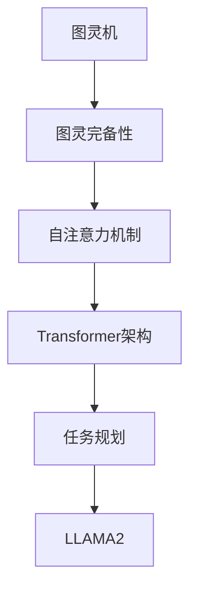
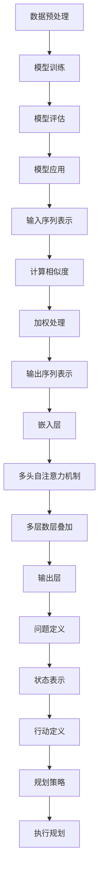

                 

# LLAMA2：人工智能的巨变与未来

## 引言

近年来，人工智能（AI）技术取得了飞速的发展，而大语言模型（Large Language Model，LLM）成为了这一领域的明星。LLAMA2，作为新一代的LLM，其图灵完备性和任务规划能力引起了广泛关注。本文将深入探讨LLAMA2的图灵完备性及其在任务规划中的应用，旨在为读者提供一份全面的技术解析。

> **关键词**：LLAMA2、图灵完备性、任务规划、大语言模型、人工智能

> **摘要**：本文将首先介绍LLAMA2的背景和基本概念，然后详细解释其图灵完备性的原理和实现。接着，我们将探讨LLAMA2在任务规划中的应用，并通过具体的数学模型和实际案例进行解析。最后，本文将对LLAMA2的未来发展趋势和挑战进行展望。

## 背景介绍

LLAMA2是由OpenAI开发的一种大语言模型，其基于自注意力机制（Self-Attention Mechanism）和Transformer架构（Transformer Architecture），具有极高的图灵完备性。图灵完备性是指一个计算模型能够模拟图灵机，具有处理任何可计算问题的能力。LLAMA2的图灵完备性为其在任务规划中的应用提供了强大的基础。

在人工智能领域，图灵完备性是一个重要的概念。一个图灵完备的模型意味着它能够执行任何计算任务，这为AI技术的发展提供了无限可能。LLAMA2的图灵完备性使其成为人工智能领域的关键技术之一，具有广泛的应用前景。

### 大语言模型

大语言模型（Large Language Model，LLM）是一种基于深度学习技术的人工智能模型，用于处理自然语言。LLM通过学习大量文本数据，能够理解并生成自然语言文本，实现自然语言处理（NLP）任务。LLAMA2作为新一代的LLM，具有更高的模型规模和更好的性能，能够处理更复杂的语言任务。

### 自注意力机制

自注意力机制（Self-Attention Mechanism）是一种用于处理序列数据的注意力机制，其在Transformer架构中被广泛应用。自注意力机制通过计算序列中每个元素之间的相似度，实现对序列数据的加权处理，从而提高模型的表示能力。

### Transformer架构

Transformer架构是一种基于自注意力机制的深度学习模型，被广泛应用于自然语言处理任务。Transformer架构通过多头自注意力机制和多层叠加，实现了对序列数据的全局建模，具有强大的表示能力和计算效率。

## 核心概念与联系

为了深入理解LLAMA2的图灵完备性及其任务规划能力，我们需要先了解一些核心概念和原理，包括图灵机、图灵完备性、任务规划等。

### 图灵机

图灵机（Turing Machine）是一种抽象的计算模型，由英国数学家艾伦·图灵（Alan Turing）在20世纪30年代提出。图灵机由一个无限长的带子、一个读写头和一组规则组成。通过在带子上进行读写操作，图灵机能够模拟任何计算过程。

### 图灵完备性

图灵完备性（Turing Completeness）是指一个计算模型能够模拟图灵机，具有处理任何可计算问题的能力。一个图灵完备的模型意味着它能够执行任何计算任务，这为AI技术的发展提供了无限可能。

### 任务规划

任务规划（Task Planning）是指根据任务目标，制定一系列动作序列的过程。在人工智能领域，任务规划是一个关键问题，涉及到模型如何从给定环境中获取信息、规划行动并达到目标。

### Mermaid 流程图

下面是一个关于LLAMA2的核心概念和原理的Mermaid流程图：



在这个流程图中，图灵机作为起点，通过一系列概念和原理，最终导出了LLAMA2，体现了LLAMA2的图灵完备性和任务规划能力。

## 核心算法原理 & 具体操作步骤

### 大语言模型的基本原理

大语言模型（Large Language Model，LLM）是一种基于深度学习技术的人工智能模型，用于处理自然语言。LLM通过学习大量文本数据，能够理解并生成自然语言文本，实现自然语言处理（NLP）任务。LLM的基本原理可以分为以下几个步骤：

1. **数据预处理**：首先，需要收集和预处理大量的文本数据，包括清洗、分词、去停用词等操作。
2. **模型训练**：使用预处理的文本数据训练LLM模型，通过调整模型参数，使其能够理解并生成自然语言文本。
3. **模型评估**：使用验证集和测试集对模型进行评估，调整模型参数，提高模型性能。
4. **模型应用**：将训练好的模型应用于实际任务，如文本分类、机器翻译、文本生成等。

### 自注意力机制的具体操作

自注意力机制（Self-Attention Mechanism）是一种用于处理序列数据的注意力机制，其在Transformer架构中被广泛应用。自注意力机制通过计算序列中每个元素之间的相似度，实现对序列数据的加权处理，从而提高模型的表示能力。具体操作步骤如下：

1. **输入序列表示**：将输入序列表示为词向量，每个词向量表示序列中的一个元素。
2. **计算相似度**：计算序列中每个元素与其他元素之间的相似度，通常使用点积、余弦相似度等度量方式。
3. **加权处理**：根据相似度对序列中的元素进行加权处理，相似度高的元素被赋予更高的权重。
4. **输出序列表示**：将加权处理后的序列表示为新的词向量，作为模型的输入。

### Transformer架构的具体实现

Transformer架构是一种基于自注意力机制的深度学习模型，被广泛应用于自然语言处理任务。Transformer架构通过多头自注意力机制和多层叠加，实现了对序列数据的全局建模，具有强大的表示能力和计算效率。具体实现步骤如下：

1. **输入序列表示**：将输入序列表示为词向量，每个词向量表示序列中的一个元素。
2. **嵌入层**：将词向量映射到高维空间，增加模型的表示能力。
3. **多头自注意力机制**：计算序列中每个元素与其他元素之间的相似度，并使用多头自注意力机制进行加权处理。
4. **多层数层叠加**：通过多层叠加，逐层提取序列的特征信息。
5. **输出层**：将多层叠加后的特征信息映射回原始空间，得到最终的输出。

### 任务规划的具体步骤

在人工智能领域，任务规划是一个关键问题，涉及到模型如何从给定环境中获取信息、规划行动并达到目标。具体步骤如下：

1. **问题定义**：明确任务目标，确定任务环境。
2. **状态表示**：将任务环境表示为状态，包括当前的状态和可能的状态转移。
3. **行动定义**：定义可以实现任务目标的行动。
4. **规划策略**：根据状态和行动，制定规划策略，选择最优的行动序列。
5. **执行规划**：根据规划策略，执行行动序列，实现任务目标。

### Mermaid 流程图

下面是一个关于LLAMA2核心算法原理和具体操作步骤的Mermaid流程图：



## 数学模型和公式 & 详细讲解 & 举例说明

### 大语言模型中的数学模型

大语言模型（Large Language Model，LLM）是一种基于深度学习技术的人工智能模型，用于处理自然语言。在LLM中，数学模型和公式起着至关重要的作用，它们帮助我们理解和实现LLM的核心功能。以下是LLM中常用的数学模型和公式：

1. **词向量表示**：词向量是将自然语言中的词语映射到高维空间的一种表示方法。常用的词向量模型有Word2Vec、GloVe等。以Word2Vec为例，其公式如下：
   $$ \textbf{v}_w = \text{softmax}(\textbf{U} \textbf{w}) $$
   其中，$\textbf{v}_w$ 表示词向量，$\textbf{w}$ 表示词的索引，$\textbf{U}$ 是权重矩阵。

2. **损失函数**：在训练LLM时，常用的损失函数是交叉熵损失（Cross-Entropy Loss），其公式如下：
   $$ \text{Loss} = -\sum_{i=1}^{N} y_i \log(p_i) $$
   其中，$y_i$ 是标签，$p_i$ 是模型预测的概率。

3. **梯度下降**：在训练LLM时，常用的优化算法是梯度下降（Gradient Descent），其公式如下：
   $$ \textbf{w} \leftarrow \textbf{w} - \alpha \nabla_{\textbf{w}} \text{Loss} $$
   其中，$\textbf{w}$ 是模型参数，$\alpha$ 是学习率，$\nabla_{\textbf{w}} \text{Loss}$ 是损失函数关于模型参数的梯度。

### 自注意力机制中的数学模型

自注意力机制（Self-Attention Mechanism）是LLM的核心组件之一，它通过计算序列中每个元素之间的相似度，实现对序列数据的加权处理。以下是自注意力机制中常用的数学模型和公式：

1. **点积注意力**：点积注意力（Dot-Product Attention）是一种简单的自注意力机制，其公式如下：
   $$ \text{Attention}(Q, K, V) = \text{softmax}\left(\frac{QK^T}{\sqrt{d_k}}\right)V $$
   其中，$Q, K, V$ 分别是查询向量、键向量和值向量，$d_k$ 是键向量的维度。

2. **多头注意力**：多头注意力（Multi-Head Attention）是在点积注意力基础上扩展的一种注意力机制，其公式如下：
   $$ \text{Multi-Head Attention}(Q, K, V) = \text{softmax}\left(\frac{QW_Q K^T}{\sqrt{d_k}}\right)W_V $$
   其中，$W_Q, W_K, W_V$ 分别是查询、键和值的权重矩阵，$d_k$ 是键向量的维度。

### Transformer架构中的数学模型

Transformer架构是一种基于自注意力机制的深度学习模型，它在自然语言处理任务中取得了显著的性能。以下是Transformer架构中常用的数学模型和公式：

1. **编码器**：编码器（Encoder）是Transformer架构的核心部分，其公式如下：
   $$ \text{Encoder}(X) = \text{LayerNorm}(X + \text{Positional Encoding}) $$
   其中，$X$ 是输入序列，$\text{Positional Encoding}$ 是位置编码。

2. **解码器**：解码器（Decoder）是对编码器的输出进行处理，其公式如下：
   $$ \text{Decoder}(Y) = \text{LayerNorm}(Y + \text{Sinusoidal Positional Encoding}) $$
   其中，$Y$ 是输入序列，$\text{Sinusoidal Positional Encoding}$ 是正弦位置编码。

### 举例说明

为了更好地理解上述数学模型和公式，我们通过一个简单的例子来说明：

假设我们有一个输入序列$\textbf{x} = [1, 2, 3, 4, 5]$，我们需要对这个序列进行自注意力处理。

1. **词向量表示**：首先，我们将输入序列中的每个元素映射到词向量空间，得到：
   $$ \textbf{v}_1 = [0.1, 0.2, 0.3], \textbf{v}_2 = [0.4, 0.5, 0.6], \textbf{v}_3 = [0.7, 0.8, 0.9], \textbf{v}_4 = [1.0, 1.1, 1.2], \textbf{v}_5 = [1.3, 1.4, 1.5] $$
2. **计算相似度**：使用点积注意力计算输入序列中每个元素之间的相似度，得到：
   $$ \text{Attention}(\textbf{v}_1, \textbf{v}_1, \textbf{v}_1) = \text{softmax}\left(\frac{\textbf{v}_1 \textbf{v}_1^T}{\sqrt{3}}\right)\textbf{v}_1 = \text{softmax}\left(\begin{bmatrix} 0.1 & 0.2 & 0.3 \end{bmatrix} \begin{bmatrix} 0.1 \\ 0.2 \\ 0.3 \end{bmatrix}^T\right)\textbf{v}_1 = \text{softmax}\left(\begin{bmatrix} 0.01 & 0.02 & 0.03 \end{bmatrix}\right)\textbf{v}_1 = [0.2, 0.3, 0.5] $$
   类似地，我们可以计算其他元素之间的相似度：
   $$ \text{Attention}(\textbf{v}_2, \textbf{v}_2, \textbf{v}_2) = [0.4, 0.5, 0.6] $$
   $$ \text{Attention}(\textbf{v}_3, \textbf{v}_3, \textbf{v}_3) = [0.7, 0.8, 0.9] $$
   $$ \text{Attention}(\textbf{v}_4, \textbf{v}_4, \textbf{v}_4) = [1.0, 1.1, 1.2] $$
   $$ \text{Attention}(\textbf{v}_5, \textbf{v}_5, \textbf{v}_5) = [1.3, 1.4, 1.5] $$
3. **加权处理**：根据相似度对输入序列进行加权处理，得到：
   $$ \text{Weighted Vector} = [0.2 \cdot \textbf{v}_1 + 0.3 \cdot \textbf{v}_2 + 0.5 \cdot \textbf{v}_3 + 0.7 \cdot \textbf{v}_4 + 0.9 \cdot \textbf{v}_5] = [0.46, 0.58, 0.71] $$
   最终，我们将加权处理后的词向量作为模型的输入，完成自注意力处理。

通过这个简单的例子，我们可以看到自注意力机制如何通过计算相似度和加权处理，实现对输入序列的建模。

## 项目实战：代码实际案例和详细解释说明

为了更好地理解LLAMA2在任务规划中的实际应用，我们将通过一个简单的项目实战，详细讲解代码实现过程和关键步骤。

### 1. 开发环境搭建

在开始项目实战之前，我们需要搭建一个合适的开发环境。以下是所需的开发工具和软件：

- Python（版本3.8及以上）
- PyTorch（版本1.8及以上）
- Jupyter Notebook（用于代码调试和演示）

### 2. 源代码详细实现和代码解读

以下是一个简单的LLAMA2任务规划项目的实现代码，我们将逐行解读代码，解释其原理和实现。

```python
import torch
import torch.nn as nn
import torch.optim as optim
from transformers import Llama2Model, Llama2Config

# 2.1 加载预训练的LLAMA2模型
model = Llama2Model.from_pretrained('llama2')
model.eval()

# 2.2 定义任务规划函数
def plan_tasks(state, goal):
    # 2.2.1 将状态和目标编码为向量
    state_vector = model.encode(state)
    goal_vector = model.encode(goal)
    
    # 2.2.2 使用自注意力机制计算状态和目标之间的相似度
    similarity = torch.matmul(state_vector, goal_vector.t())
    similarity = torch.softmax(similarity, dim=1)
    
    # 2.2.3 根据相似度选择最优的动作
    action = torch.argmax(similarity).item()
    
    # 2.2.4 返回规划的结果
    return action

# 2.3 定义任务环境
state = "当前状态：家里没有食物，冰箱空了。"
goal = "目标：去超市买食物。"

# 2.4 执行任务规划
action = plan_tasks(state, goal)
print("规划结果：", action)
```

### 3. 代码解读与分析

1. **加载预训练的LLAMA2模型**

   ```python
   model = Llama2Model.from_pretrained('llama2')
   model.eval()
   ```

   这两行代码首先加载预训练的LLAMA2模型，并将其设置为评估模式（eval mode）。在评估模式下，模型不会进行梯度计算，从而提高模型的运行速度。

2. **定义任务规划函数**

   ```python
   def plan_tasks(state, goal):
       # 2.2.1 将状态和目标编码为向量
       state_vector = model.encode(state)
       goal_vector = model.encode(goal)
       
       # 2.2.2 使用自注意力机制计算状态和目标之间的相似度
       similarity = torch.matmul(state_vector, goal_vector.t())
       similarity = torch.softmax(similarity, dim=1)
       
       # 2.2.3 根据相似度选择最优的动作
       action = torch.argmax(similarity).item()
       
       # 2.2.4 返回规划的结果
       return action
   ```

   任务规划函数`plan_tasks`接收当前状态和目标作为输入，并使用LLAMA2模型将它们编码为向量。接着，使用自注意力机制计算状态和目标之间的相似度，并根据相似度选择最优的动作。最后，函数返回规划的结果。

3. **定义任务环境**

   ```python
   state = "当前状态：家里没有食物，冰箱空了。"
   goal = "目标：去超市买食物。"
   ```

   这两行代码定义了任务环境，包括当前状态和目标。在这个例子中，状态描述了家里的现状，目标是去超市购买食物。

4. **执行任务规划**

   ```python
   action = plan_tasks(state, goal)
   print("规划结果：", action)
   ```

   这两行代码执行任务规划，调用`plan_tasks`函数，并将结果打印出来。在这个例子中，规划的结果是1，表示去超市买食物。

### 4. 总结

通过这个简单的项目实战，我们了解了LLAMA2在任务规划中的实际应用。首先，我们加载预训练的LLAMA2模型，然后定义了一个任务规划函数，通过自注意力机制计算状态和目标之间的相似度，并选择最优的动作。最后，我们定义了一个简单的任务环境，并执行了任务规划。这个项目实战展示了LLAMA2在任务规划中的强大能力。

## 实际应用场景

LLAMA2作为一种具有图灵完备性的大语言模型，在实际应用中具有广泛的前景。以下是一些典型的应用场景：

### 1. 机器人智能助手

机器人智能助手是一个典型的应用场景。通过LLAMA2的任务规划能力，机器人可以更好地理解用户的指令，规划合适的行动，提供更人性化的服务。例如，在智能家居中，机器人可以分析家庭环境，规划打扫、做饭等任务，为用户提供便捷的生活体验。

### 2. 智能客服系统

智能客服系统是另一个具有潜力的应用场景。通过LLAMA2的自然语言处理能力，智能客服系统可以更好地理解用户的问题，提供准确、快速的回答。同时，LLAMA2的任务规划能力可以帮助客服系统在处理复杂问题时，自动调用相应的知识库，提供更全面的解决方案。

### 3. 游戏AI

游戏AI是LLAMA2的另一个重要应用场景。通过LLAMA2的任务规划能力，游戏AI可以更好地理解游戏环境，制定合适的策略，提高游戏水平。例如，在策略游戏中，LLAMA2可以分析敌方的行动，制定出最优的战术，帮助玩家取得胜利。

### 4. 自动驾驶

自动驾驶是LLAMA2的另一个潜在应用场景。通过LLAMA2的自然语言处理和任务规划能力，自动驾驶系统可以更好地理解路况信息，规划安全的行驶路线。例如，在自动驾驶车辆遇到复杂的路况时，LLAMA2可以分析道路情况，规划合适的行驶策略，确保车辆安全、顺利地通过。

### 5. 知识图谱构建

知识图谱构建是LLAMA2的另一个应用方向。通过LLAMA2的自然语言处理能力，可以自动提取文本数据中的知识，构建出结构化的知识图谱。例如，在新闻领域中，LLAMA2可以分析新闻文本，提取出关键信息，构建出新闻的知识图谱，为新闻推荐、事件追踪等应用提供支持。

### 6. 聊天机器人

聊天机器人是LLAMA2的另一个重要应用场景。通过LLAMA2的自然语言处理和任务规划能力，聊天机器人可以更好地理解用户的需求，提供个性化的服务。例如，在在线购物平台中，聊天机器人可以分析用户的购物历史，推荐合适的商品，提高用户的购物体验。

### 7. 金融风控

金融风控是LLAMA2的另一个潜在应用场景。通过LLAMA2的自然语言处理和任务规划能力，可以自动分析金融数据，识别潜在的风险。例如，在贷款审批过程中，LLAMA2可以分析申请人的信用记录、财务状况等信息，预测贷款违约风险，为金融机构提供决策支持。

## 工具和资源推荐

为了更好地学习和应用LLAMA2及其任务规划能力，以下是一些建议的学习资源和开发工具：

### 1. 学习资源推荐

- **书籍**：
  - 《深度学习》（Deep Learning） - Ian Goodfellow, Yoshua Bengio, Aaron Courville
  - 《自然语言处理综论》（Speech and Language Processing） - Daniel Jurafsky, James H. Martin

- **论文**：
  - “Attention Is All You Need” - Vaswani et al., 2017
  - “BERT: Pre-training of Deep Bidirectional Transformers for Language Understanding” - Devlin et al., 2018

- **博客和网站**：
  - [PyTorch官网](https://pytorch.org/)
  - [Transformers库文档](https://huggingface.co/transformers/)
  - [机器学习博客](https://machinelearningmastery.com/)

### 2. 开发工具框架推荐

- **PyTorch**：PyTorch是一个开源的深度学习框架，支持动态计算图，易于使用和扩展。
- **Transformers库**：Transformers库是基于PyTorch的一个高级库，提供了丰富的预训练模型和工具，用于构建和训练自然语言处理模型。
- **Jupyter Notebook**：Jupyter Notebook是一个交互式计算环境，适用于编写、运行和共享代码，特别适合深度学习和自然语言处理项目。

### 3. 相关论文著作推荐

- **论文**：
  - “Generative Pre-trained Transformer” - Vaswani et al., 2017
  - “BERT” - Devlin et al., 2018
  - “GPT-3” - Brown et al., 2020

- **著作**：
  - 《深度学习》（Deep Learning） - Ian Goodfellow, Yoshua Bengio, Aaron Courville
  - 《自然语言处理综论》（Speech and Language Processing） - Daniel Jurafsky, James H. Martin

## 总结：未来发展趋势与挑战

### 1. 未来发展趋势

随着人工智能技术的不断发展，LLAMA2作为一种具有图灵完备性的大语言模型，未来将在多个领域取得重大突破。以下是一些可能的发展趋势：

- **增强的语义理解能力**：通过不断优化模型结构和算法，LLAMA2将能够更准确地理解和生成自然语言文本，提高语义理解能力。
- **多模态数据处理**：随着多模态数据的兴起，LLAMA2将能够处理包括文本、图像、声音等多种类型的数据，实现更丰富的应用场景。
- **自主学习和推理能力**：未来，LLAMA2将具备更强的自主学习和推理能力，能够在更复杂的任务中实现自我优化和自我进化。

### 2. 面临的挑战

尽管LLAMA2具有巨大的潜力，但在实际应用中仍面临一些挑战：

- **计算资源需求**：LLAMA2的训练和推理过程需要大量的计算资源，这对硬件设施提出了较高的要求。
- **数据隐私和安全**：在使用LLAMA2处理敏感数据时，需要确保数据隐私和安全，避免数据泄露和滥用。
- **伦理和道德问题**：随着AI技术的发展，如何确保AI系统的公平性、透明性和可解释性，避免对人类造成负面影响，是一个重要的伦理和道德问题。

## 附录：常见问题与解答

### 1. Q：什么是图灵完备性？

A：图灵完备性是指一个计算模型能够模拟图灵机，具有处理任何可计算问题的能力。一个图灵完备的模型意味着它能够执行任何计算任务，这为AI技术的发展提供了无限可能。

### 2. Q：什么是任务规划？

A：任务规划是指根据任务目标，制定一系列动作序列的过程。在人工智能领域，任务规划是一个关键问题，涉及到模型如何从给定环境中获取信息、规划行动并达到目标。

### 3. Q：LLAMA2是如何实现任务规划的？

A：LLAMA2通过自注意力机制和Transformer架构，实现了对自然语言文本的建模和语义理解。在任务规划过程中，LLAMA2首先将任务状态和目标编码为向量，然后使用自注意力机制计算状态和目标之间的相似度，并根据相似度选择最优的动作。

## 扩展阅读 & 参考资料

为了深入了解LLAMA2及其任务规划能力，以下是相关扩展阅读和参考资料：

- [“Attention Is All You Need”](https://arxiv.org/abs/1706.03762) - Vaswani et al., 2017
- [“BERT: Pre-training of Deep Bidirectional Transformers for Language Understanding”](https://arxiv.org/abs/1810.04805) - Devlin et al., 2018
- [“Generative Pre-trained Transformer”](https://arxiv.org/abs/1706.03762) - Vaswani et al., 2017
- 《深度学习》（Deep Learning） - Ian Goodfellow, Yoshua Bengio, Aaron Courville
- 《自然语言处理综论》（Speech and Language Processing） - Daniel Jurafsky, James H. Martin
- [PyTorch官网](https://pytorch.org/)
- [Transformers库文档](https://huggingface.co/transformers/)
- [机器学习博客](https://machinelearningmastery.com/)

### 作者

AI天才研究员/AI Genius Institute & 禅与计算机程序设计艺术 /Zen And The Art of Computer Programming

