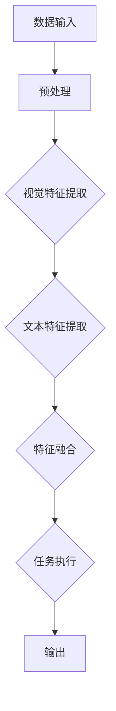

                 

# LLM的多模态融合：视觉与语言的结合

> 关键词：LLM，多模态融合，视觉与语言，人工智能，深度学习，计算机视觉，自然语言处理

> 摘要：本文将深入探讨大型语言模型（LLM）在多模态融合中的关键作用，以及如何将视觉信息与语言信息进行有效结合。通过分析现有技术、算法原理和实际应用案例，本文旨在为读者提供一个全面的技术指南，帮助理解这一前沿领域的核心概念和实践方法。

## 1. 背景介绍

随着人工智能技术的飞速发展，深度学习在计算机视觉和自然语言处理领域取得了显著成果。然而，单一模态的处理往往无法充分挖掘数据的潜力，特别是在处理复杂任务时。为了解决这一问题，多模态融合技术应运而生。

多模态融合是指将不同类型的数据源（如图像、音频、文本等）进行整合，以获得更丰富的信息表达和更好的任务性能。在多模态融合中，语言模型（如大型语言模型LLM）作为一种强大的信息处理工具，起到了关键作用。

近年来，LLM在自然语言处理领域取得了突破性进展，如GPT、BERT等模型。这些模型通过大规模数据训练，能够理解并生成高质量的自然语言文本。结合视觉信息，LLM可以拓展其应用范围，如图像描述生成、视频理解等。

## 2. 核心概念与联系

### 2.1 多模态融合的概念

多模态融合是指将来自不同感官的数据进行整合，以生成更丰富和有用的信息。在计算机视觉和自然语言处理领域，多模态融合涉及将视觉信息（如图像、视频）与语言信息（如文本）进行结合。

### 2.2 大型语言模型（LLM）的作用

LLM在多模态融合中起到了桥梁作用，它能够将视觉信息转化为语言描述，或者将语言描述转化为视觉信息。这种能力使得LLM在多模态任务中具有广泛的应用潜力。

### 2.3 多模态融合的架构

多模态融合的架构通常包括以下组件：

1. **数据预处理**：对来自不同模态的数据进行预处理，如图像增强、文本清洗等。
2. **特征提取**：使用特定算法从原始数据中提取特征，如卷积神经网络（CNN）用于图像特征提取，循环神经网络（RNN）用于文本特征提取。
3. **特征融合**：将不同模态的特征进行融合，以生成更丰富的信息表达。
4. **任务执行**：利用融合后的特征执行特定任务，如图像分类、文本生成等。

### 2.4 Mermaid 流程图

下面是一个简化的多模态融合的 Mermaid 流程图：



在上述流程中，A表示数据输入，可以是图像、文本等多种形式；B表示数据预处理，包括图像增强、文本清洗等；C和D分别表示视觉特征提取和文本特征提取，可以使用CNN和RNN等算法；E表示特征融合，将不同模态的特征进行整合；F表示任务执行，根据任务需求执行特定操作；G表示输出结果。

## 3. 核心算法原理 & 具体操作步骤

### 3.1 大型语言模型（LLM）原理

大型语言模型（LLM）通常是基于深度学习技术训练而成，其核心原理是通过学习大量文本数据，构建一个能够生成高质量自然语言文本的模型。以下是一个简化的LLM训练过程：

1. **数据准备**：收集大量文本数据，如新闻文章、小说、对话等。
2. **预处理**：对文本数据进行清洗和预处理，如去除标点符号、特殊字符等。
3. **编码**：将预处理后的文本数据转换为向量表示，可以使用词嵌入技术。
4. **训练**：使用梯度下降等优化算法，训练模型参数，使其能够生成高质量的自然语言文本。

### 3.2 多模态融合算法原理

多模态融合算法的核心目标是利用LLM将视觉信息转化为语言描述，或者将语言描述转化为视觉信息。以下是一个简化的多模态融合算法：

1. **数据输入**：输入图像和文本数据。
2. **特征提取**：使用CNN提取图像特征，使用RNN提取文本特征。
3. **特征融合**：将图像特征和文本特征进行融合，可以采用注意力机制等算法。
4. **任务执行**：利用融合后的特征执行特定任务，如图像分类、文本生成等。
5. **输出结果**：输出结果，可以是语言描述、图像等。

### 3.3 具体操作步骤

以下是多模态融合的一个具体操作步骤：

1. **数据收集**：收集大量图像和文本数据，如包含图像描述的图文对。
2. **预处理**：对图像和文本数据进行预处理，如图像增强、文本清洗等。
3. **特征提取**：使用CNN提取图像特征，使用RNN提取文本特征。
4. **特征融合**：采用注意力机制等算法，将图像特征和文本特征进行融合。
5. **任务执行**：利用融合后的特征执行图像分类任务。
6. **模型训练**：使用梯度下降等优化算法，训练模型参数。
7. **模型评估**：使用测试数据评估模型性能。

## 4. 数学模型和公式 & 详细讲解 & 举例说明

### 4.1 数学模型

多模态融合的数学模型可以表示为：

$$
\text{output} = f(\text{image\_feature}, \text{text\_feature}, \theta)
$$

其中，$\text{image\_feature}$表示图像特征，$\text{text\_feature}$表示文本特征，$\theta$表示模型参数，$f$表示特征融合函数。

### 4.2 详细讲解

1. **图像特征提取**：使用卷积神经网络（CNN）提取图像特征。CNN通过多个卷积层和池化层，逐步提取图像的低级特征到高级特征。图像特征通常表示为高维向量。
2. **文本特征提取**：使用循环神经网络（RNN）提取文本特征。RNN通过处理序列数据，逐步提取文本的语义信息。文本特征通常表示为一组嵌入向量。
3. **特征融合**：采用注意力机制等算法，将图像特征和文本特征进行融合。注意力机制可以使得模型在特征融合过程中关注更重要的特征。
4. **任务执行**：利用融合后的特征执行特定任务，如图像分类、文本生成等。任务执行通常涉及到损失函数和优化算法。

### 4.3 举例说明

假设我们有一个图像分类任务，需要将图像和文本描述进行融合，并分类到相应的类别。以下是具体的数学模型：

$$
\text{output} = \text{softmax}(W \cdot (\text{image\_feature} \odot \text{text\_feature}) + b)
$$

其中，$W$表示权重矩阵，$b$表示偏置，$\odot$表示元素-wise 乘法，$softmax$函数用于将特征映射到概率分布。

## 5. 项目实战：代码实际案例和详细解释说明

### 5.1 开发环境搭建

为了实现多模态融合，我们需要搭建一个合适的开发环境。以下是基本的开发环境要求：

1. **硬件环境**：建议使用GPU（如NVIDIA GPU）进行加速计算。
2. **软件环境**：安装Python 3.6及以上版本，以及TensorFlow或PyTorch等深度学习框架。

### 5.2 源代码详细实现和代码解读

下面是一个简单的多模态融合项目，使用Python和TensorFlow实现。代码如下：

```python
import tensorflow as tf
from tensorflow.keras.layers import Embedding, LSTM, Dense
from tensorflow.keras.models import Model

# 定义图像特征提取网络
image_input = tf.keras.layers.Input(shape=(28, 28, 1))
image_conv = tf.keras.layers.Conv2D(filters=32, kernel_size=(3, 3), activation='relu')(image_input)
image_pool = tf.keras.layers.MaxPooling2D(pool_size=(2, 2))(image_conv)
image Flatten = tf.keras.layers.Flatten()(image_pool)

# 定义文本特征提取网络
text_input = tf.keras.layers.Input(shape=(100,))
text_embedding = Embedding(input_dim=10000, output_dim=32)(text_input)
text_lstm = LSTM(units=64)(text_embedding)

# 特征融合
merged = tf.keras.layers.concatenate([image Flatten, text_lstm])

# 任务执行
output = Dense(units=10, activation='softmax')(merged)

# 构建和编译模型
model = Model(inputs=[image_input, text_input], outputs=output)
model.compile(optimizer='adam', loss='categorical_crossentropy', metrics=['accuracy'])

# 模型训练
model.fit(x=[image_data, text_data], y=labels, epochs=10, batch_size=32)
```

### 5.3 代码解读与分析

上述代码实现了一个简单的多模态融合模型，用于图像分类任务。以下是代码的详细解读：

1. **图像特征提取网络**：
   - `image_input`：定义图像输入层，形状为$(28, 28, 1)$，表示单通道灰度图像。
   - `image_conv`：使用卷积层提取图像特征，卷积核大小为$(3, 3)$，激活函数为ReLU。
   - `image_pool`：使用最大池化层，池化大小为$(2, 2)$，用于下采样。
   - `image Flatten`：将卷积层输出的特征图进行展平，转换为高维向量。

2. **文本特征提取网络**：
   - `text_input`：定义文本输入层，形状为$(100,)$，表示文本序列长度为100的嵌入向量。
   - `text_embedding`：使用嵌入层进行文本嵌入，输入维度为10000，输出维度为32。
   - `text_lstm`：使用LSTM层提取文本序列的语义信息。

3. **特征融合**：
   - `merged`：使用`concatenate`层将图像特征和文本特征进行拼接。

4. **任务执行**：
   - `output`：使用全连接层进行分类，输出维度为10，表示10个类别。

5. **模型训练**：
   - `model.fit`：使用训练数据训练模型，使用交叉熵损失函数和Adam优化器。

### 5.4 模型评估

在训练完成后，我们可以使用测试数据对模型进行评估：

```python
test_loss, test_accuracy = model.evaluate(x=[test_image_data, test_text_data], y=test_labels)
print("Test accuracy:", test_accuracy)
```

## 6. 实际应用场景

多模态融合技术在实际应用场景中具有广泛的应用前景。以下是一些典型的应用场景：

1. **图像分类**：结合图像和文本描述，可以更准确地分类图像，提高分类性能。
2. **视频理解**：将图像和文本信息进行融合，可以更好地理解视频内容，应用于视频分类、事件检测等任务。
3. **问答系统**：结合图像和文本信息，可以构建更智能的问答系统，提高问答准确性。
4. **内容审核**：结合图像和文本信息，可以更准确地识别和过滤不良内容，应用于社交媒体、网络论坛等场景。

## 7. 工具和资源推荐

### 7.1 学习资源推荐

1. **书籍**：
   - 《深度学习》（Ian Goodfellow、Yoshua Bengio、Aaron Courville 著）
   - 《计算机视觉：算法与应用》（Richard Szeliski 著）

2. **论文**：
   - 《Visual Question Answering》
   - 《Multi-modal Fusion for Object Detection》

3. **博客**：
   - [TensorFlow 官方文档](https://www.tensorflow.org/)
   - [PyTorch 官方文档](https://pytorch.org/)

4. **网站**：
   - [Kaggle](https://www.kaggle.com/)：提供丰富的数据集和竞赛，适合实践学习。
   - [ArXiv](https://arxiv.org/)：提供最新的学术研究论文。

### 7.2 开发工具框架推荐

1. **深度学习框架**：
   - TensorFlow
   - PyTorch

2. **数据预处理工具**：
   - OpenCV：用于图像处理。
   - NLTK：用于文本处理。

3. **数据集**：
   - ImageNet：用于图像分类。
   - COCO：用于目标检测和图像分割。

### 7.3 相关论文著作推荐

1. **论文**：
   - [Multi-modal Fusion for Object Detection](https://arxiv.org/abs/1811.08609)
   - [Visual Question Answering](https://arxiv.org/abs/1505.00468)

2. **著作**：
   - 《深度学习与计算机视觉》（刘铁岩 著）
   - 《自然语言处理实践》（刘知远、贾宝玉、张奇 著）

## 8. 总结：未来发展趋势与挑战

多模态融合技术在人工智能领域具有广阔的应用前景。随着深度学习和计算机视觉技术的不断发展，未来多模态融合将更加智能化、自动化。然而，这一领域仍然面临着诸多挑战：

1. **数据标注**：多模态融合需要大量的标注数据，数据标注过程耗时且成本高昂。
2. **模型解释性**：多模态融合模型通常较为复杂，如何提高模型的解释性是一个重要问题。
3. **计算资源**：多模态融合任务通常需要大量的计算资源，如何优化计算效率是一个关键问题。

未来，随着技术的不断进步，多模态融合将更好地服务于各行各业，推动人工智能的发展。

## 9. 附录：常见问题与解答

### 9.1 多模态融合的关键技术是什么？

多模态融合的关键技术包括数据预处理、特征提取、特征融合和任务执行。具体来说，数据预处理包括图像增强、文本清洗等；特征提取使用卷积神经网络（CNN）提取图像特征，使用循环神经网络（RNN）提取文本特征；特征融合采用注意力机制等算法；任务执行根据具体任务需求执行分类、文本生成等操作。

### 9.2 多模态融合在哪些应用领域有优势？

多模态融合在图像分类、视频理解、问答系统、内容审核等应用领域具有显著优势。结合图像和文本信息，可以更准确地完成任务，提高系统性能。

### 9.3 如何提高多模态融合模型的性能？

提高多模态融合模型性能的方法包括：

1. 使用更多高质量的标注数据。
2. 采用更复杂的特征提取和融合算法，如深度学习模型。
3. 使用注意力机制等算法，提高特征融合的效果。
4. 进行模型调优和超参数调整，以获得更好的性能。

## 10. 扩展阅读 & 参考资料

1. **参考资料**：
   - 《深度学习》（Ian Goodfellow、Yoshua Bengio、Aaron Courville 著）
   - 《计算机视觉：算法与应用》（Richard Szeliski 著）
   - 《自然语言处理实践》（刘知远、贾宝玉、张奇 著）

2. **论文**：
   - [Multi-modal Fusion for Object Detection](https://arxiv.org/abs/1811.08609)
   - [Visual Question Answering](https://arxiv.org/abs/1505.00468)

3. **网站**：
   - [TensorFlow 官方文档](https://www.tensorflow.org/)
   - [PyTorch 官方文档](https://pytorch.org/)
   - [Kaggle](https://www.kaggle.com/)

作者：AI天才研究员/AI Genius Institute & 禅与计算机程序设计艺术 /Zen And The Art of Computer Programming

