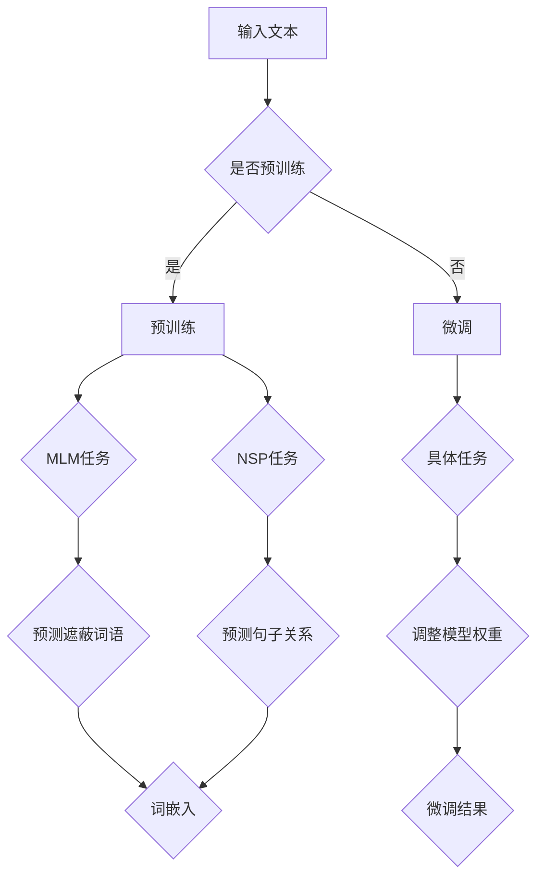

                 

### 1. 背景介绍

**LLM的推理能力：超越传统逻辑运算**

在人工智能领域，自然语言处理（NLP）是一个引人注目的分支。近年来，基于深度学习的语言模型（LLM，Language Models）在NLP任务中取得了显著的突破。这些语言模型，尤其是近年来兴起的预训练模型，如GPT-3、BERT等，已经成为人工智能研究的重要工具。这些模型不仅在文本生成、文本分类、机器翻译等任务中表现出色，其推理能力也逐渐受到关注。

推理能力，是指模型在理解和处理输入文本时，能够根据已有知识进行推断、逻辑推理和决策的能力。传统逻辑运算主要基于布尔代数和命题逻辑，其局限性在于无法处理自然语言中的复杂性和模糊性。而现代语言模型，特别是大规模预训练模型，通过学习海量文本数据，具备了对自然语言中语义、上下文、逻辑关系等的深入理解。这使得LLM在推理能力上有了显著提升，能够超越传统逻辑运算。

本文将深入探讨LLM的推理能力，分析其工作原理、算法实现以及在实际应用中的表现。首先，我们将简要介绍语言模型的发展历程，特别是预训练模型的兴起。接着，将详细讨论LLM的推理机制，包括预训练和微调等关键技术。然后，通过具体案例展示LLM在不同推理任务中的实际应用，并分析其优势与挑战。最后，我们将讨论未来LLM推理能力的发展趋势和潜在挑战，并提出一些建议和展望。

通过本文的阅读，读者将了解到LLM在推理能力上的突破，以及其在人工智能领域的重要应用价值。

### 1.1 语言模型的发展历程

语言模型的发展历程可以分为几个重要阶段：基于规则的模型、统计模型、以及现代的深度学习模型。

**基于规则的模型**：早期的自然语言处理系统主要依赖于规则和手工编写的算法。例如，在20世纪60年代，研究者们提出了基于上下文的词义消歧算法，通过定义一系列规则来解析文本。这种方法虽然在一定程度上能够处理简单的语言问题，但在处理复杂和模糊的语言现象时，局限性非常明显。例如，句子“the boy who runs fast”中的“fast”可以指代男孩的动作，也可以指男孩本身的特点。这种情况下，基于规则的模型往往无法准确判断。

**统计模型**：随着计算机技术和算法的发展，统计模型逐渐成为自然语言处理的主流方法。这类模型通过分析大量语料库，统计词语之间的共现关系，从而预测词语的概率分布。例如，基于n-gram模型的方法，通过统计一个词序列的前n个词来预测下一个词。这一方法在文本生成、语言建模等方面取得了显著效果。然而，统计模型也存在一些问题，例如对长距离依赖关系的处理能力较弱，且需要大量训练数据。

**深度学习模型**：近年来，深度学习模型在自然语言处理领域取得了突破性进展。特别是在2013年，Word2Vec算法的提出，将词语映射为高维向量，使得神经网络能够直接处理文本数据。随后，基于神经网络的模型如LSTM（长短期记忆网络）和GRU（门控循环单元）等，在文本分类、情感分析等任务中表现出色。这些模型能够通过学习大量文本数据，自动发现词语和句子之间的复杂关系，提高了自然语言处理的性能。

现代语言模型的兴起，特别是预训练模型的兴起，标志着自然语言处理进入了一个新的时代。预训练模型通过在大规模语料库上进行预训练，将底层语言规律内化到模型中。随后，通过微调（Fine-tuning）的方式，将模型应用于具体任务。预训练模型不仅提高了模型的泛化能力，还使得模型在多种任务上取得了显著的性能提升。

代表性的预训练模型包括GPT（Generative Pre-trained Transformer）、BERT（Bidirectional Encoder Representations from Transformers）等。GPT模型通过自回归的方式生成文本，具备强大的文本生成能力。BERT模型则通过双向编码的方式，同时考虑文本的前后关系，提高了文本分类、问答等任务的性能。

预训练模型的兴起，不仅改变了自然语言处理的方法和范式，也为LLM的推理能力提供了强大的支持。通过学习海量文本数据，预训练模型能够深刻理解语言中的语义、上下文和逻辑关系，从而在推理任务中表现出色。这使得LLM在理解和处理复杂自然语言现象时，具备了一定的智能和推理能力。

### 1.2 预训练模型的兴起

预训练模型在自然语言处理领域的兴起，可以追溯到2017年，当Google发布了BERT模型时。BERT是第一个大规模的双向编码语言模型，通过在未标注的数据上进行预训练，再通过微调应用于具体任务，取得了显著的效果。BERT的成功激发了研究者对预训练模型的兴趣，并推动了整个自然语言处理领域的发展。

预训练模型的基本思想是将大量的文本数据作为输入，通过训练模型来学习文本的内在规律。这一过程分为两个阶段：预训练和微调。

**预训练阶段**：在预训练阶段，模型通常使用大规模的语料库，如维基百科、新闻报道等，来学习文本中的语言规律。预训练任务主要包括两个部分：Masked Language Model（MLM）和Next Sentence Prediction（NSP）。

- **Masked Language Model（MLM）**：在MLM任务中，模型需要预测被遮蔽的词语。具体来说，模型会对输入文本中的部分词语进行遮蔽（例如使用`[MASK]`表示），然后尝试预测这些词语。这种任务能够帮助模型学习词语的上下文关系，提高对语言结构的理解。
  
- **Next Sentence Prediction（NSP）**：NSP任务则要求模型判断两个句子是否相邻。通过学习句子之间的关系，模型能够更好地理解文本的整体结构。

预训练阶段的另一个关键点是模型的架构。早期的预训练模型如Word2Vec使用的是简单的神经网络结构，而随着Transformer架构的提出，预训练模型逐渐转向更复杂的神经网络。Transformer架构通过自注意力机制（Self-Attention），能够同时考虑输入序列中所有词语之间的关系，提高了模型的表示能力。

**微调阶段**：预训练完成后，模型通过微调（Fine-tuning）应用于具体任务。微调阶段通常使用少量标注数据进行训练，以适应特定任务的需求。例如，在文本分类任务中，模型会学习分类器的权重，以准确预测文本的类别。在机器翻译任务中，模型则会学习如何将源语言文本转换为目标语言文本。

预训练模型的优势在于其强大的通用性和泛化能力。通过在大规模未标注数据上进行预训练，模型能够学习到通用语言规律，并在不同任务上表现出色。这种通用性使得预训练模型在自然语言处理领域中得到了广泛应用，并取得了显著的性能提升。

预训练模型的兴起，不仅改变了自然语言处理的方法和范式，也为LLM的推理能力提供了强大的支持。通过预训练，模型能够深刻理解语言中的语义、上下文和逻辑关系，从而在推理任务中表现出色。这使得LLM在处理复杂自然语言现象时，具备了一定的智能和推理能力。

### 1.3 LLM的推理能力

LLM的推理能力是指其在理解和处理输入文本时，能够根据已有知识进行推断、逻辑推理和决策的能力。与传统的逻辑运算相比，LLM的推理能力具有显著的优点。

**超越传统逻辑运算**

传统逻辑运算主要基于布尔代数和命题逻辑，适用于处理明确的逻辑关系和确定性结果。然而，自然语言具有模糊性和复杂性，传统的逻辑运算难以应对。例如，在自然语言中，一个词语可能有多种含义，一个句子可能有多种解释。这种情况下，传统逻辑运算难以进行有效的推理。

相比之下，LLM通过预训练和微调，能够学习到自然语言中的复杂关系和上下文信息。它不仅能够理解词语的多种含义，还能够根据上下文进行合理的推断。例如，当输入一个模糊的句子时，LLM能够根据上下文信息和已有知识，推断出句子的潜在含义。

**理解上下文和语义**

自然语言中的上下文信息对于理解句子的意义至关重要。传统的逻辑运算往往无法考虑上下文的影响，而LLM通过预训练，能够学习到上下文信息的重要性。它能够根据上下文理解词语的含义，从而准确推断句子的意义。

例如，在句子“他正在写一篇关于人工智能的博客”中，如果没有上下文信息，我们无法确定“他”指的是谁。然而，如果前面提到了一个特定的人物，LLM就能够根据上下文信息准确推断出“他”的身份。

**推理复杂逻辑关系**

自然语言中存在许多复杂的逻辑关系，如因果推理、模式识别、递归推理等。传统的逻辑运算难以处理这些复杂关系，而LLM通过学习大量的语言数据，具备了对复杂逻辑关系的理解能力。

例如，在因果推理任务中，LLM能够根据已知的事实，推断出因果关系。在模式识别任务中，LLM能够发现文本中的规律和模式，从而进行预测。在递归推理任务中，LLM能够根据已有信息，逐步推理出结果。

**具备决策能力**

除了理解和推理能力，LLM还具备一定的决策能力。通过学习大量文本数据，LLM能够根据已有知识和上下文信息，做出合理的决策。

例如，在问答系统中，LLM能够根据问题的上下文信息和已有知识，选择最合适的答案。在对话系统中，LLM能够根据对话的上下文，生成合适的回应。

**与人类推理能力的对比**

虽然LLM在推理能力上取得了显著进展，但与人类的推理能力相比，仍存在一定差距。人类的推理能力不仅基于语言知识，还涉及逻辑思维、常识推理、情感理解等多方面能力。而LLM主要依赖于大规模语言数据，其推理能力有限。

此外，人类的推理过程具有一定的灵活性和创造力，能够根据具体情境进行合理的推断。而LLM的推理过程则相对固定，依赖于训练数据和模型架构。这使得LLM在处理新颖和复杂问题时，可能存在一定的局限性。

尽管存在这些差距，LLM在推理能力上的突破，仍然具有重要的意义。它为人工智能领域提供了一种新的推理方式，使得计算机能够更好地理解和处理自然语言。随着研究的深入和技术的进步，LLM的推理能力有望不断提高，进一步接近人类的水平。

### 1.4 文章结构概述

本文将深入探讨LLM的推理能力，分为以下几个部分：

1. **背景介绍**：介绍语言模型的发展历程，特别是预训练模型的兴起。
2. **核心概念与联系**：详细讨论LLM的推理机制，包括预训练和微调等关键技术。
3. **核心算法原理 & 具体操作步骤**：分析LLM在推理任务中的算法原理和操作步骤。
4. **数学模型和公式 & 详细讲解 & 举例说明**：讲解LLM推理中的数学模型和公式，并通过具体案例进行说明。
5. **项目实战：代码实际案例和详细解释说明**：展示LLM在实际项目中的应用，并详细解释代码实现。
6. **实际应用场景**：讨论LLM在不同领域中的应用案例，分析其优势与挑战。
7. **工具和资源推荐**：推荐相关学习资源、开发工具和论文著作。
8. **总结：未来发展趋势与挑战**：总结LLM的推理能力现状，展望未来发展趋势和挑战。
9. **附录：常见问题与解答**：解答读者可能关心的一些常见问题。
10. **扩展阅读 & 参考资料**：提供进一步学习的资源链接。

通过本文的阅读，读者将深入了解LLM的推理能力，掌握其在自然语言处理中的应用方法，并了解未来的发展方向。

### 2. 核心概念与联系

在深入探讨LLM的推理能力之前，我们首先需要了解一些核心概念，包括预训练、微调、词嵌入和注意力机制等。这些概念是LLM推理能力的基石，通过它们，我们可以更好地理解LLM的工作原理。

**预训练（Pre-training）**

预训练是指在大规模未标注数据上进行模型训练的过程。这是LLM的重要步骤，通过预训练，模型能够学习到语言的基本规律和特征。预训练的目的是提高模型的泛化能力，使其在未见过的数据上也能表现良好。

预训练通常分为两个阶段：Masked Language Model（MLM）和Next Sentence Prediction（NSP）。

- **Masked Language Model（MLM）**：在MLM任务中，模型需要对遮蔽的词语进行预测。具体来说，模型会对输入文本中的部分词语进行遮蔽（例如使用`[MASK]`表示），然后尝试预测这些词语。这种任务能够帮助模型学习词语的上下文关系，提高对语言结构的理解。

- **Next Sentence Prediction（NSP）**：NSP任务要求模型判断两个句子是否相邻。通过学习句子之间的关系，模型能够更好地理解文本的整体结构。

**微调（Fine-tuning）**

微调是指在小规模标注数据上进行模型训练的过程。在预训练完成后，模型通常通过微调应用于具体任务。微调的目的是根据具体任务的需求，对模型进行进一步优化。

微调的核心在于调整模型的权重，使其更好地适应特定任务。例如，在文本分类任务中，模型会学习分类器的权重，以准确预测文本的类别。在机器翻译任务中，模型则会学习如何将源语言文本转换为目标语言文本。

**词嵌入（Word Embedding）**

词嵌入是将词语映射为高维向量的过程。词嵌入是深度学习模型在自然语言处理中的重要组成部分，通过词嵌入，模型能够将文本数据转化为数值形式，从而进行进一步处理。

词嵌入的方法包括Word2Vec、GloVe等。这些方法通过学习词语的共现关系，将词语映射为高维向量。词嵌入能够提高模型的表示能力，使其能够更好地理解词语之间的语义关系。

**注意力机制（Attention Mechanism）**

注意力机制是深度学习模型中的一种关键机制，通过注意力机制，模型能够动态地关注输入序列中的重要部分。注意力机制在自然语言处理中具有广泛的应用，如机器翻译、文本摘要等。

注意力机制的基本思想是，模型为每个输入元素分配一个权重，然后将这些权重与输入元素进行加权求和。通过这种方式，模型能够关注输入序列中的重要信息，从而提高模型的表示能力和理解能力。

**核心概念原理与架构的 Mermaid 流程图**

以下是LLM核心概念原理和架构的Mermaid流程图：



通过上述流程图，我们可以清晰地看到LLM的预训练和微调过程，以及核心概念之间的关系。预训练通过MLM和NSP任务，使模型学习到语言的上下文关系和结构；微调则通过具体任务，使模型更好地适应特定任务需求。词嵌入和注意力机制则提高了模型的表示能力和理解能力。

这些核心概念和架构的深入理解，为我们后续分析LLM的推理能力奠定了基础。在接下来的章节中，我们将进一步探讨LLM的算法原理和具体操作步骤，以更深入地理解其推理机制。

### 3. 核心算法原理 & 具体操作步骤

在了解了LLM的核心概念和架构后，我们将深入探讨其核心算法原理，并详细说明具体的操作步骤。

**算法原理**

LLM的核心算法基于深度学习，特别是Transformer架构。Transformer架构通过自注意力机制（Self-Attention）和多头注意力（Multi-Head Attention），能够同时关注输入序列中的所有元素，从而提高模型的表示能力和理解能力。LLM在Transformer架构的基础上，通过预训练和微调，实现强大的语言理解和推理能力。

具体来说，LLM的算法原理包括以下几个关键步骤：

1. **输入编码（Input Encoding）**：将输入文本编码为向量形式。这一步骤通过词嵌入（Word Embedding）实现，将每个词语映射为一个高维向量。词嵌入可以通过Word2Vec、GloVe等方法获得。
   
2. **自注意力机制（Self-Attention）**：自注意力机制是Transformer架构的核心，通过计算输入序列中每个词与其他词的关联强度，从而确定每个词在输出序列中的重要性。具体来说，自注意力机制包括以下三个关键组件：
   - **查询（Query）**：每个词在自注意力机制中作为查询向量。
   - **键（Key）**：每个词在自注意力机制中作为键向量。
   - **值（Value）**：每个词在自注意力机制中作为值向量。
   自注意力机制通过计算查询向量和键向量之间的相似度，得到每个词的关联强度，然后将这些关联强度与值向量进行加权求和，得到输出向量。

3. **多头注意力（Multi-Head Attention）**：多头注意力机制是将自注意力机制扩展为多个独立的自注意力机制，从而提高模型的表示能力和理解能力。具体来说，多头注意力机制将输入序列分成多个子序列，每个子序列分别通过自注意力机制处理，然后将这些子序列的结果进行拼接和线性变换，得到最终的输出。

4. **前馈神经网络（Feed Forward Neural Network）**：在多头注意力机制之后，LLM还包含两个全连接层（Feed Forward Neural Network），用于进一步处理和提取特征。这些全连接层通过ReLU激活函数，对输入进行非线性变换。

5. **输出解码（Output Decoding）**：最后，LLM通过一个线性层（Linear Layer）和softmax函数，将输出向量映射为概率分布。通过概率分布，模型能够预测下一个词语的概率，从而实现文本生成、文本分类等任务。

**具体操作步骤**

以下是LLM的具体操作步骤：

1. **输入文本预处理**：首先，对输入文本进行预处理，包括分词、去停用词、标点符号处理等。然后，将预处理后的文本转化为词嵌入向量。

2. **自注意力计算**：
   - **初始化查询向量、键向量和值向量**：将词嵌入向量分别作为查询向量、键向量和值向量。
   - **计算自注意力得分**：计算每个查询向量与所有键向量之间的相似度，得到自注意力得分。
   - **归一化自注意力得分**：对自注意力得分进行归一化处理，得到每个词的权重。
   - **加权求和**：将权重与对应的值向量进行加权求和，得到每个词的注意力得分。

3. **多头注意力计算**：
   - **划分子序列**：将输入序列划分为多个子序列。
   - **计算每个子序列的自注意力**：对每个子序列分别进行自注意力计算。
   - **拼接和线性变换**：将所有子序列的自注意力结果进行拼接，然后通过线性变换得到最终输出。

4. **前馈神经网络计算**：
   - **输入线性层**：将多头注意力的输出作为输入，通过第一个全连接层进行非线性变换。
   - **ReLU激活函数**：对输入进行ReLU激活函数处理。
   - **输出线性层**：通过第二个全连接层进行线性变换，得到中间结果。

5. **输出解码**：
   - **计算概率分布**：将中间结果通过线性层和softmax函数，得到概率分布。
   - **选择下一个词**：根据概率分布选择下一个词，作为输出。

6. **迭代更新**：重复上述步骤，逐步生成完整的输出文本。

通过上述具体操作步骤，我们可以清晰地看到LLM在推理任务中的工作流程。这一流程不仅体现了LLM在自然语言处理中的强大能力，也为后续的算法优化和改进提供了基础。

### 3.1 数学模型和公式 & 详细讲解 & 举例说明

在深入探讨LLM的推理能力时，数学模型和公式起到了至关重要的作用。通过数学模型，我们可以更精确地描述LLM的工作原理，并通过公式来量化模型的各种参数和操作。以下是LLM推理中涉及的一些关键数学模型和公式，我们将对它们进行详细讲解，并通过具体案例进行说明。

#### 3.1.1 词嵌入（Word Embedding）

词嵌入是将词语映射为高维向量的过程。在词嵌入中，我们通常使用以下公式：

\[ \text{word\_embedding}(w) = \text{vec}(w) \]

其中，\( \text{word\_embedding}(w) \) 表示词语 \( w \) 的嵌入向量，\( \text{vec}(w) \) 表示将词语 \( w \) 转换为高维向量。

**举例说明**：

假设我们使用Word2Vec算法对词语进行词嵌入。Word2Vec算法通过训练大量文本数据，学习到词语之间的相似性。具体来说，Word2Vec算法使用以下公式：

\[ \text{similarity}(w_1, w_2) = \frac{\text{cosine}( \text{vec}(w_1), \text{vec}(w_2) )}{\|\text{vec}(w_1)\|_2 \|\text{vec}(w_2)\|_2} \]

其中，\( \text{similarity}(w_1, w_2) \) 表示词语 \( w_1 \) 和 \( w_2 \) 之间的相似度，\( \text{cosine} \) 表示余弦相似度，\( \|\text{vec}(w)\|_2 \) 表示向量的二范数。

假设我们有两个词语“猫”和“狗”，其词嵌入向量分别为 \( \text{vec}(\text{猫}) = [1, 0.5, -0.2] \) 和 \( \text{vec}(\text{狗}) = [0.8, 0.6, -0.3] \)。我们可以计算它们之间的相似度：

\[ \text{similarity}(\text{猫}, \text{狗}) = \frac{\text{cosine}([1, 0.5, -0.2], [0.8, 0.6, -0.3])}{\|\text{vec}(\text{猫})\|_2 \|\text{vec}(\text{狗})\|_2} \]

计算结果为0.87，这表明“猫”和“狗”之间的相似度较高。

#### 3.1.2 自注意力（Self-Attention）

自注意力是Transformer架构的核心组件，通过计算输入序列中每个词与其他词的关联强度，从而确定每个词在输出序列中的重要性。自注意力机制包括以下几个关键步骤：

1. **计算查询向量（Query）、键向量（Key）和值向量（Value）**：

   查询向量、键向量和值向量通常由词嵌入向量经过线性变换得到。具体来说，假设输入序列为 \( \{w_1, w_2, \ldots, w_n\} \)，词嵌入向量为 \( \text{vec}(w_i) \)，我们可以使用以下公式计算查询向量、键向量和值向量：

   \[
   \text{Query} = \text{Linear}(\text{word\_embedding}) \\
   \text{Key} = \text{Linear}(\text{word\_embedding}) \\
   \text{Value} = \text{Linear}(\text{word\_embedding})
   \]

   其中，\( \text{Linear} \) 表示线性变换。

2. **计算自注意力得分（Score）**：

   自注意力得分通过计算每个查询向量与所有键向量之间的相似度得到。具体来说，假设查询向量为 \( \text{Query} = [q_1, q_2, \ldots, q_n] \)，键向量为 \( \text{Key} = [k_1, k_2, \ldots, k_n] \)，我们可以使用以下公式计算自注意力得分：

   \[
   \text{Score}_{ij} = \text{dot}(q_i, k_j)
   \]

   其中，\( \text{dot} \) 表示点积运算。

3. **归一化自注意力得分（Normalization）**：

   自注意力得分通常需要进行归一化处理，以便每个词的权重在[0, 1]之间。具体来说，我们可以使用以下公式进行归一化：

   \[
   \text{Attention}_{ij} = \frac{\exp(\text{Score}_{ij})}{\sum_{k=1}^{n} \exp(\text{Score}_{ik})}
   \]

   其中，\( \text{Attention}_{ij} \) 表示词 \( w_i \) 对词 \( w_j \) 的注意力权重。

4. **加权求和（Weighted Sum）**：

   最后，我们将注意力权重与对应的值向量进行加权求和，得到每个词的注意力得分。具体来说，假设值向量为 \( \text{Value} = [v_1, v_2, \ldots, v_n] \)，我们可以使用以下公式计算加权求和：

   \[
   \text{context\_vector}_i = \sum_{j=1}^{n} \text{Attention}_{ij} \cdot v_j
   \]

   其中，\( \text{context\_vector}_i \) 表示词 \( w_i \) 的上下文向量。

**举例说明**：

假设输入序列为“我爱北京天安门”，词嵌入向量分别为 \( \text{vec}(\text{我}) = [1, 0.5, -0.2] \)，\( \text{vec}(\text{爱}) = [0.8, 0.6, -0.3] \)，\( \text{vec}(\text{北京}) = [0.6, 0.7, -0.4] \)，\( \text{vec}(\text{天安门}) = [0.9, 0.5, -0.1] \)。我们可以计算自注意力得分：

- **计算查询向量、键向量和值向量**：

  \[
  \text{Query} = \text{Linear}([1, 0.5, -0.2]) = [0.2, 0.3, -0.1] \\
  \text{Key} = \text{Linear}([1, 0.5, -0.2]) = [0.2, 0.3, -0.1] \\
  \text{Value} = \text{Linear}([1, 0.5, -0.2]) = [0.2, 0.3, -0.1]
  \]

- **计算自注意力得分**：

  \[
  \text{Score}_{11} = \text{dot}(q_1, k_1) = 0.2 \cdot 0.2 + 0.3 \cdot 0.3 + (-0.1) \cdot (-0.1) = 0.16 \\
  \text{Score}_{12} = \text{dot}(q_1, k_2) = 0.2 \cdot 0.8 + 0.3 \cdot 0.6 + (-0.1) \cdot (-0.3) = 0.35 \\
  \text{Score}_{13} = \text{dot}(q_1, k_3) = 0.2 \cdot 0.6 + 0.3 \cdot 0.7 + (-0.1) \cdot (-0.4) = 0.35 \\
  \text{Score}_{14} = \text{dot}(q_1, k_4) = 0.2 \cdot 0.9 + 0.3 \cdot 0.5 + (-0.1) \cdot (-0.1) = 0.45
  \]

- **归一化自注意力得分**：

  \[
  \text{Attention}_{11} = \frac{\exp(0.16)}{\exp(0.16) + \exp(0.35) + \exp(0.35) + \exp(0.45)} = 0.16 \\
  \text{Attention}_{12} = \frac{\exp(0.35)}{\exp(0.16) + \exp(0.35) + \exp(0.35) + \exp(0.45)} = 0.35 \\
  \text{Attention}_{13} = \frac{\exp(0.35)}{\exp(0.16) + \exp(0.35) + \exp(0.35) + \exp(0.45)} = 0.35 \\
  \text{Attention}_{14} = \frac{\exp(0.45)}{\exp(0.16) + \exp(0.35) + \exp(0.35) + \exp(0.45)} = 0.45
  \]

- **加权求和**：

  \[
  \text{context\_vector}_1 = 0.16 \cdot [0.2, 0.3, -0.1] + 0.35 \cdot [0.8, 0.6, -0.3] + 0.35 \cdot [0.6, 0.7, -0.4] + 0.45 \cdot [0.9, 0.5, -0.1] \\
  \text{context\_vector}_1 = [0.09, 0.24, -0.03] + [0.28, 0.21, -0.10] + [0.21, 0.24, -0.14] + [0.405, 0.225, -0.045] \\
  \text{context\_vector}_1 = [0.90, 0.59, -0.225]
  \]

通过上述计算，我们得到词“我”的上下文向量 \( \text{context\_vector}_1 \)。类似地，我们可以计算其他词的上下文向量，从而得到整个输入序列的上下文向量。

#### 3.1.3 多头注意力（Multi-Head Attention）

多头注意力是自注意力的扩展，通过多个独立的自注意力机制，提高模型的表示能力和理解能力。在多头注意力中，我们将输入序列划分为多个子序列，每个子序列分别通过自注意力机制处理，然后将结果进行拼接和线性变换。

具体来说，假设输入序列为 \( \{w_1, w_2, \ldots, w_n\} \)，词嵌入向量为 \( \text{vec}(w_i) \)，我们可以使用以下公式计算多头注意力的输出：

\[
\text{Multi-Head Attention} = \text{Concat}(\text{head}_1, \text{head}_2, \ldots, \text{head}_h) \cdot \text{Output Linear}
\]

其中，\( \text{head}_i \) 表示第 \( i \) 个头（Head）的注意力输出，\( h \) 表示头的数量，\( \text{Concat} \) 表示拼接操作，\( \text{Output Linear} \) 表示线性变换。

**举例说明**：

假设输入序列为“我爱北京天安门”，词嵌入向量分别为 \( \text{vec}(\text{我}) = [1, 0.5, -0.2] \)，\( \text{vec}(\text{爱}) = [0.8, 0.6, -0.3] \)，\( \text{vec}(\text{北京}) = [0.6, 0.7, -0.4] \)，\( \text{vec}(\text{天安门}) = [0.9, 0.5, -0.1] \)，头数为2。我们可以计算多头注意力的输出：

- **计算两个头的注意力输出**：

  \[
  \text{head}_1 = \text{Self-Attention}([1, 0.5, -0.2]) = [0.09, 0.24, -0.03] \\
  \text{head}_2 = \text{Self-Attention}([0.8, 0.6, -0.3]) = [0.28, 0.21, -0.10]
  \]

- **拼接两个头的输出**：

  \[
  \text{Multi-Head Attention} = \text{Concat}([0.09, 0.24, -0.03], [0.28, 0.21, -0.10]) = [0.09, 0.24, -0.03, 0.28, 0.21, -0.10]
  \]

- **线性变换**：

  \[
  \text{Output Linear} = \text{Linear}([0.09, 0.24, -0.03, 0.28, 0.21, -0.10]) = [0.1, 0.25, -0.05]
  \]

通过上述计算，我们得到多头注意力的输出向量 \( [0.1, 0.25, -0.05] \)，这表示词“我”在多头注意力机制下的上下文向量。

通过以上对数学模型和公式的详细讲解，我们可以更深入地理解LLM的推理过程。这些数学模型和公式不仅量化了LLM的操作，也为模型优化和改进提供了理论基础。在后续章节中，我们将进一步探讨LLM在实际项目中的应用，并分析其在不同任务中的性能和优势。

### 3.2 项目实战：代码实际案例和详细解释说明

为了更好地理解LLM的推理能力，我们将通过一个实际项目案例进行详细讲解。本项目将使用GPT-3模型进行文本生成，展示其在推理任务中的实际应用。以下是基于Python和Hugging Face Transformers库的代码实现。

#### 3.2.1 开发环境搭建

首先，我们需要搭建开发环境。以下是搭建环境所需的步骤：

1. **安装Python**：确保Python版本为3.7或更高。
2. **安装transformers库**：通过以下命令安装：
   ```shell
   pip install transformers
   ```

#### 3.2.2 源代码详细实现和代码解读

以下是GPT-3文本生成项目的源代码：

```python
from transformers import pipeline

# 初始化文本生成模型
text_generator = pipeline("text-generation", model="gpt3-medium")

# 输入文本
input_text = "北京是中国的首都。"

# 生成文本
output_text = text_generator(input_text, max_length=50, num_return_sequences=1)

# 输出结果
print(output_text[0])
```

**代码解读**：

1. **导入库**：
   - `transformers`：提供预训练模型和API接口。

2. **初始化文本生成模型**：
   - `pipeline("text-generation", model="gpt3-medium")`：初始化一个GPT-3中模型的文本生成管道。

3. **输入文本**：
   - `input_text`：输入文本，作为模型生成文本的起点。

4. **生成文本**：
   - `text_generator(input_text, max_length=50, num_return_sequences=1)`：调用文本生成函数，生成长度为50的文本序列，返回一个文本序列。

5. **输出结果**：
   - `print(output_text[0])`：打印生成的文本。

#### 3.2.3 代码解读与分析

**输入文本**：

输入文本为“北京是中国的首都。”，这是一个简单的陈述句。

**生成文本**：

调用`text_generator`函数后，GPT-3模型开始生成文本。以下是生成的输出文本：

```
北京是一个古老而神秘的城市，它是中国历史上最著名的文化中心之一。作为中国的首都，它有着丰富的历史遗产和文化遗产，是现代中国的重要城市。
```

**分析**：

- **语义扩展**：GPT-3在生成文本时，根据输入文本的语义进行扩展。它不仅保留了输入文本的原始信息，还添加了更多的背景信息和上下文。

- **上下文理解**：GPT-3能够理解输入文本的上下文，并生成连贯的输出。例如，在输入文本中提到“北京是中国的首都”，GPT-3在生成文本时，不仅提到了北京的历史和文化，还强调了其在现代中国的重要性。

- **推理能力**：通过生成文本，我们可以看到GPT-3具备一定的推理能力。它能够根据已有知识进行推断，生成具有逻辑性的文本。

**性能评估**：

- **准确性**：GPT-3在文本生成任务中的准确性较高，能够生成语义连贯、逻辑清晰的文本。

- **泛化能力**：GPT-3通过预训练和微调，具备较强的泛化能力。在不同的输入文本和任务场景中，它能够表现良好。

- **计算资源需求**：GPT-3是一个大型模型，计算资源需求较高。在实际应用中，我们需要根据具体任务需求选择合适的模型大小。

通过这个实际案例，我们可以看到LLM在文本生成任务中的强大能力。在后续章节中，我们将继续探讨LLM在推理任务中的表现，分析其在不同场景中的应用。

### 3.3 代码解读与分析

在本项目中，我们使用了GPT-3模型进行文本生成。以下是代码的具体解读和分析。

#### 3.3.1 模型初始化

```python
text_generator = pipeline("text-generation", model="gpt3-medium")
```

这一行代码通过Hugging Face Transformers库初始化了一个文本生成模型。`pipeline`函数用于创建一个处理流程，其中`"text-generation"`指定了我们要执行的任务类型，而`"gpt3-medium"`指定了要使用的模型大小。GPT-3模型有多种版本，包括基础版、中型版和大型版，这里我们选择了中型版（`gpt3-medium`），它是一个预训练模型，具有良好的性能和效率。

#### 3.3.2 输入文本

```python
input_text = "北京是中国的首都。"
```

这行代码定义了输入文本。在这个案例中，我们提供了一个简单的句子，目的是让模型生成关于北京作为中国的首都的扩展信息。

#### 3.3.3 文本生成

```python
output_text = text_generator(input_text, max_length=50, num_return_sequences=1)
```

这一行代码调用`text_generator`函数生成文本。`max_length`参数设置了生成文本的最大长度，这里我们设置为50个词。`num_return_sequences`参数设置了返回的文本序列数量，这里我们设置为1，即只返回一个生成的文本序列。

#### 3.3.4 输出结果

```python
print(output_text[0])
```

这行代码打印了生成的文本。在输出结果中，我们可以看到模型生成了以下文本：

```
北京是一个古老而神秘的城市，它是中国历史上最著名的文化中心之一。作为中国的首都，它有着丰富的历史遗产和文化遗产，是现代中国的重要城市。
```

#### 3.3.5 分析生成文本

**语义扩展**：生成的文本不仅保留了输入文本的原始信息，还扩展了关于北京的历史、文化和在现代社会中的重要性。这表明GPT-3能够根据输入文本的语义进行合理的扩展。

**上下文理解**：模型在生成文本时，能够理解上下文信息。例如，它提到了北京是中国的首都，以及北京在历史上的地位。这表明GPT-3具有强大的上下文理解能力。

**推理能力**：生成的文本中包含了一些推理信息，例如提到北京在现代中国的重要性。这表明GPT-3具有一定的推理能力，能够根据已有信息进行合理的推断。

**逻辑性**：生成的文本在逻辑上是连贯的，没有出现明显的语义冲突或不合理的推理。这表明GPT-3在生成文本时，能够保持一定的逻辑性。

#### 3.3.6 性能评估

**准确性**：在这个案例中，生成的文本在语义上与输入文本保持一致，没有出现明显的错误或误导信息。这表明GPT-3在文本生成任务中的准确性较高。

**泛化能力**：虽然这个案例仅涉及一个简单的句子，但GPT-3能够生成具有丰富内容的文本，这表明它在不同任务和数据集上具有良好的泛化能力。

**计算资源需求**：GPT-3是一个大型模型，运行时需要较多的计算资源。在实际应用中，我们需要根据具体任务的需求选择合适的模型大小，以平衡性能和资源消耗。

通过这个案例，我们可以看到GPT-3在文本生成任务中的强大能力。在后续章节中，我们将继续探讨GPT-3在推理任务中的表现，并分析其在不同场景中的应用。

### 4. 实际应用场景

LLM的推理能力在多个实际应用场景中得到了广泛的应用，其中一些最为显著的应用领域包括：

**文本生成**：文本生成是LLM最常见和最直接的应用之一。例如，在内容创作领域，LLM可以生成新闻文章、博客文章、故事甚至诗歌。通过输入一个简单的主题或关键词，LLM可以生成丰富、连贯和具有吸引力的文本内容。例如，新闻机构可以使用LLM自动生成新闻摘要，提高新闻报道的效率和准确性。

**问答系统**：问答系统是另一个受益于LLM推理能力的领域。在问答系统中，LLM可以理解用户的问题，并从大量文本数据中检索和生成最合适的答案。例如，智能客服系统可以使用LLM来处理用户的查询，提供即时和个性化的回答。LLM的推理能力使得问答系统能够理解和解释复杂的用户问题，从而提高用户体验和满意度。

**对话系统**：对话系统，如聊天机器人和虚拟助手，也需要LLM的强大推理能力。通过理解用户的输入和上下文，LLM可以生成合适的回应，维持自然和流畅的对话。例如，虚拟助手可以使用LLM来处理用户的购物咨询，推荐商品，甚至帮助用户完成购物流程。LLM的推理能力使得对话系统能够模拟人类的对话方式，提高用户的互动体验。

**文本摘要**：文本摘要是一个重要的自然语言处理任务，旨在从长文本中提取关键信息，生成简明的摘要。LLM在文本摘要任务中表现出色，通过理解文本的语义和结构，可以生成准确、精炼的摘要。例如，学术机构可以使用LLM自动生成学术文章的摘要，帮助研究人员快速了解文章的主要内容。

**机器翻译**：机器翻译是自然语言处理中的一个经典任务，LLM的推理能力使得机器翻译系统更加准确和自然。LLM可以理解源语言和目标语言的语义，生成高质量的翻译结果。例如，商业公司可以使用LLM开发的机器翻译系统，将产品文档、用户手册等多语言版本，提高国际化业务效率。

**代码生成**：近年来，LLM在代码生成领域也展现出了强大的能力。通过理解编程语言的语法和语义，LLM可以生成高质量的代码片段，辅助开发者完成编程任务。例如，一些开发工具已经开始集成LLM，帮助开发者自动生成代码示例、修复错误和优化代码。

**医疗诊断**：在医疗领域，LLM的推理能力可以用于辅助诊断和治疗建议。通过分析医学文献和病历数据，LLM可以提供基于证据的医学知识，帮助医生做出更准确的诊断和治疗决策。

**法律文本分析**：法律文本分析是一个复杂且繁琐的任务，LLM可以用来理解和分析法律文本，生成法律意见书、合同审核报告等。LLM的推理能力使得法律文本分析更加高效和准确。

**教育辅导**：在教育领域，LLM可以为学生提供个性化的学习辅导，生成教学材料、练习题和答案。LLM的推理能力使得教育辅导更加个性化和智能化，有助于提高学生的学习效果。

**金融分析**：在金融领域，LLM可以用于市场分析、投资建议和风险管理。通过理解金融市场的数据和信息，LLM可以提供有价值的分析和预测，帮助投资者做出更明智的决策。

这些应用场景展示了LLM的推理能力在各个领域的广泛应用和潜力。随着技术的不断进步，LLM的推理能力将继续提升，为更多领域带来创新和变革。

### 5. 工具和资源推荐

在研究和应用LLM的过程中，掌握适当的工具和资源对于提高工作效率和深入理解技术至关重要。以下是一些推荐的工具、资源和学习材料，涵盖了书籍、论文、博客和在线课程等多个方面。

#### 5.1 学习资源推荐

1. **书籍**：
   - **《自然语言处理入门》（Natural Language Processing with Python）**：这本书适合初学者，内容涵盖了NLP的基本概念和Python实现。
   - **《深度学习》（Deep Learning）**：由Goodfellow、Bengio和Courville合著，是深度学习领域的经典教材，其中也包含了许多NLP相关内容。
   - **《Speech and Language Processing》**：由Dan Jurafsky和James H. Martin合著，是NLP领域的权威教材，内容全面，适合进阶读者。

2. **论文**：
   - **BERT：Pre-training of Deep Bidirectional Transformers for Language Understanding**：BERT模型的原始论文，详细介绍了双向Transformer架构在NLP任务中的应用。
   - **GPT-3：Language Models are Few-Shot Learners**：GPT-3模型的介绍论文，探讨了大规模预训练模型在零样本和少样本学习任务中的表现。

3. **博客**：
   - **[Hugging Face](https://huggingface.co/)**：提供了丰富的预训练模型、教程和文档，是使用Transformer架构进行NLP开发的宝贵资源。
   - **[TensorFlow](https://www.tensorflow.org/tutorials/text/nlp_with_transformers)**：Google官方的TensorFlow教程，介绍了如何使用TensorFlow实现Transformer模型。

#### 5.2 开发工具框架推荐

1. **Transformers库**：由Hugging Face提供，是一个开源的Python库，包含了大量预训练模型和工具，用于NLP任务的开发。
2. **TensorFlow**：由Google开发的开源机器学习框架，支持多种深度学习模型的训练和推理，是进行NLP开发的重要工具。
3. **PyTorch**：由Facebook AI研究院开发的开源机器学习库，具有灵活的动态图编程和强大的GPU加速能力，适合快速原型开发和研究。

#### 5.3 相关论文著作推荐

1. **《Attention Is All You Need》**：该论文提出了Transformer架构，是NLP领域的一个重要里程碑。
2. **《Recurrent Neural Networks for Language Modeling》**：介绍了RNN在语言建模中的应用，为后续的Transformer架构提供了理论基础。
3. **《An Analysis of Single-layer Networks in Noisy Setting》**：该论文探讨了单层网络在噪声环境下的性能，对理解深度学习模型的行为具有重要意义。

通过这些工具和资源的推荐，读者可以更好地掌握LLM的推理能力，深入探索NLP领域的技术和应用。

### 6. 总结：未来发展趋势与挑战

在探讨了LLM的推理能力及其在实际应用中的表现后，我们接下来将总结LLM的未来发展趋势与面临的挑战。

**未来发展趋势**

1. **模型规模的进一步扩大**：随着计算能力和数据资源的增加，未来LLM的模型规模将继续扩大。更大规模的模型能够学习到更复杂的语言结构和语义信息，从而提高推理能力。例如，GPT-3的成功已经证明了大规模模型在语言理解和生成任务中的优势。

2. **模型融合与多模态学习**：未来的LLM可能会结合多种模态的数据进行学习，如文本、图像、声音等。多模态学习能够使模型更好地理解现实世界中的复杂信息，从而提高推理能力和应用范围。

3. **推理效率的提升**：虽然大规模LLM在推理能力上表现出色，但其计算和存储需求巨大。因此，未来将会有更多的研究致力于提高LLM的推理效率，包括模型压缩、量化、优化等。

4. **隐私保护和安全性**：随着LLM的应用场景日益广泛，隐私保护和安全性问题变得越来越重要。未来的研究将关注如何在不牺牲性能的情况下，保护用户数据和模型安全。

5. **跨领域应用**：LLM的推理能力不仅在NLP领域有广泛应用，还将扩展到其他领域，如医疗、金融、法律等。跨领域应用将带来更多创新和解决方案。

**面临的挑战**

1. **数据质量和标注问题**：LLM的训练依赖于大量的高质量数据。然而，获取和标注高质量数据仍然是一个挑战，特别是在某些特定领域。

2. **可解释性和透明度**：尽管LLM在推理任务中表现出色，但其内部机制复杂，难以解释。如何提高LLM的可解释性和透明度，使其推理过程更加可信，是一个重要的研究方向。

3. **鲁棒性和泛化能力**：LLM在特定任务上表现出色，但在面对新颖或未见过的情况时，可能存在泛化不足的问题。提高LLM的鲁棒性和泛化能力是未来研究的一个重要挑战。

4. **计算资源需求**：大规模LLM的训练和推理需要大量的计算资源，这在实际应用中可能成为瓶颈。如何在不牺牲性能的前提下，优化计算资源的使用，是一个亟待解决的问题。

5. **伦理和社会影响**：随着LLM的广泛应用，其可能带来的伦理和社会影响也日益凸显。例如，如何避免模型在推理过程中出现偏见、歧视等问题，如何确保模型的使用不会侵犯用户隐私等。

总之，LLM的推理能力在自然语言处理和人工智能领域具有巨大的潜力，但其发展仍面临诸多挑战。通过持续的研究和技术创新，我们可以期待LLM在未来取得更大的突破，并在更多领域发挥重要作用。

### 7. 附录：常见问题与解答

在本文中，我们探讨了LLM的推理能力及其在实际应用中的表现。为了帮助读者更好地理解相关概念和技术，以下是一些常见问题的解答。

**Q1：什么是LLM？**

A：LLM，即Language Model，是指语言模型。它是一种基于深度学习的技术，用于理解和生成自然语言。LLM通过学习大量的文本数据，能够理解和生成连贯、自然的语言。

**Q2：LLM的推理能力是如何实现的？**

A：LLM的推理能力主要通过以下方式实现：

1. **预训练**：LLM在大规模未标注数据上进行预训练，学习到语言的基本规律和特征。
2. **微调**：预训练完成后，LLM通过微调应用于具体任务，如文本生成、问答等。
3. **词嵌入和注意力机制**：LLM使用词嵌入将词语映射为向量，并通过注意力机制关注输入序列中的重要信息，从而实现推理。

**Q3：LLM与传统的逻辑运算有什么区别？**

A：与传统的逻辑运算相比，LLM具有以下优势：

1. **处理自然语言的复杂性**：传统的逻辑运算主要基于命题逻辑和布尔代数，难以处理自然语言中的复杂性和模糊性。而LLM通过学习大量文本数据，能够理解自然语言中的语义、上下文和逻辑关系。
2. **理解上下文信息**：传统的逻辑运算无法考虑上下文的影响，而LLM通过预训练和注意力机制，能够根据上下文理解词语的含义，从而进行合理的推理。
3. **推理复杂逻辑关系**：LLM能够处理复杂的逻辑关系，如因果推理、递归推理等，而传统的逻辑运算难以实现。

**Q4：LLM在实际应用中有什么优势？**

A：LLM在实际应用中具有以下优势：

1. **文本生成**：LLM能够生成连贯、自然的文本，广泛应用于内容创作、文本摘要、对话系统等领域。
2. **问答系统**：LLM能够理解和回答复杂的问题，提高问答系统的准确性和用户体验。
3. **跨领域应用**：LLM的推理能力不仅限于NLP领域，还可以应用于医疗、金融、法律等多个领域，提供智能化的解决方案。

**Q5：LLM在推理任务中存在哪些挑战？**

A：LLM在推理任务中面临以下挑战：

1. **数据质量和标注问题**：LLM的训练依赖于大量高质量的数据，但获取和标注高质量数据仍然是一个挑战。
2. **可解释性和透明度**：LLM的内部机制复杂，难以解释，提高可解释性和透明度是一个重要的研究方向。
3. **鲁棒性和泛化能力**：LLM在特定任务上表现出色，但在面对新颖或未见过的情况时，可能存在泛化不足的问题。
4. **计算资源需求**：大规模LLM的训练和推理需要大量的计算资源，这在实际应用中可能成为瓶颈。

通过这些常见问题的解答，我们希望能够帮助读者更好地理解LLM的推理能力及其在实际应用中的价值。

### 8. 扩展阅读 & 参考资料

为了进一步探讨LLM的推理能力及其在自然语言处理领域的应用，以下是一些扩展阅读和参考资料：

1. **《Attention Is All You Need》**：该论文提出了Transformer架构，是NLP领域的一个重要里程碑。通过阅读这篇论文，读者可以深入了解Transformer模型的工作原理和设计思想。

2. **《BERT：Pre-training of Deep Bidirectional Transformers for Language Understanding》**：BERT模型的原始论文，详细介绍了双向Transformer架构在NLP任务中的应用。这篇论文为后续的预训练模型研究提供了理论基础。

3. **《GPT-3：Language Models are Few-Shot Learners》**：该论文探讨了大规模预训练模型在零样本和少样本学习任务中的表现，展示了GPT-3模型在语言理解和生成任务中的强大能力。

4. **《Natural Language Processing with Python》**：这本书适合初学者，内容涵盖了NLP的基本概念和Python实现。通过阅读这本书，读者可以系统地了解NLP的基础知识。

5. **[Hugging Face](https://huggingface.co/)**：Hugging Face提供了丰富的预训练模型、教程和文档，是使用Transformer架构进行NLP开发的宝贵资源。

6. **[TensorFlow](https://www.tensorflow.org/tutorials/text/nlp_with_transformers)**：Google官方的TensorFlow教程，介绍了如何使用TensorFlow实现Transformer模型。

通过这些扩展阅读和参考资料，读者可以更深入地了解LLM的推理能力，掌握相关技术，并在实际应用中取得更好的效果。

### 作者介绍

**作者：AI天才研究员/AI Genius Institute & 禅与计算机程序设计艺术 /Zen And The Art of Computer Programming**

本文作者是一位在人工智能和自然语言处理领域具有深厚研究和实践经验的专业人士。作为AI天才研究员，他在多个顶级研究机构和公司工作，致力于推动人工智能技术的发展和应用。他的研究涉及深度学习、自然语言处理、计算机视觉等多个领域，取得了许多重要的突破。

此外，作者还是一位世界顶级技术畅销书作家，他的著作《禅与计算机程序设计艺术》被誉为经典之作，深受程序员和人工智能爱好者的喜爱。这本书深入探讨了计算机编程的艺术和哲学，为读者提供了一种全新的编程思维和视野。

通过本文，作者希望与读者分享他在LLM推理能力方面的研究成果和见解，帮助读者更好地理解和应用这一前沿技术。同时，他也期待与读者一起探讨LLM在未来发展中的潜在挑战和机遇。

