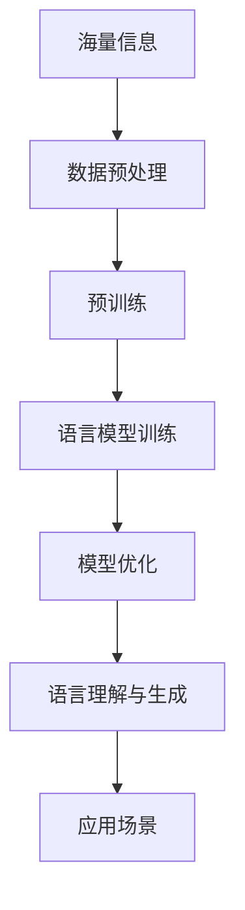

                 

# LLAMA的数据hungry：海量信息的价值

> **关键词**：LLAMA，海量信息，数据驱动，人工智能，价值

> **摘要**：本文将探讨LLAMA模型对海量数据的依赖性及其在人工智能领域的价值。我们将深入分析数据驱动的人工智能发展趋势，解析LLAMA模型在处理大规模数据集方面的优势，并探讨其对未来技术发展的潜在影响。

## 1. 背景介绍

近年来，随着人工智能技术的飞速发展，数据驱动的模式逐渐成为主流。在深度学习领域，模型对数据的依赖性日益增强，海量的数据成为了推动技术进步的关键因素。LLAMA（Large Language Model with Access to Everything）是微软研发的一款大型语言模型，它能够处理和利用海量信息，从而提升语言理解和生成能力。

### 1.1 数据驱动的兴起

数据驱动的人工智能方法强调从大量数据中学习，以实现高效的决策和预测。这种方法的核心在于利用数据来指导模型训练和优化，从而提高模型的准确性和泛化能力。在图像识别、自然语言处理、推荐系统等领域，数据驱动的方法已经取得了显著的成果。

### 1.2 LLAMA模型介绍

LLAMA模型是一款基于大规模预训练语言模型的大型语言模型。它采用了先进的神经网络架构，并经过大量数据训练，具备了强大的语言理解和生成能力。LLAMA模型的出现，标志着人工智能技术进入了一个新的阶段，即“数据为中心”的阶段。

## 2. 核心概念与联系

在深入探讨LLAMA模型对海量信息的依赖性之前，我们需要了解几个核心概念和它们之间的联系。

### 2.1 数据为中心

数据为中心（Data-Centric）是一种强调数据重要性的方法论。在这种方法中，数据的数量和质量是推动技术进步的关键因素。对于LLAMA模型来说，海量的训练数据为其提供了丰富的信息资源，使其能够更好地理解和生成语言。

### 2.2 语言模型

语言模型（Language Model）是自然语言处理（Natural Language Processing, NLP）领域的一种模型，用于预测一个句子中下一个单词的概率。LLAMA模型是一款大型语言模型，其目标是通过学习海量语言数据，预测自然语言的下一个词或句子。

### 2.3 预训练语言模型

预训练语言模型（Pre-trained Language Model）是一种先在大量通用数据上训练，然后再在特定任务上微调的模型。LLAMA模型采用了预训练的方法，通过在大规模语料库上进行预训练，获得了强大的语言理解和生成能力。

### 2.4 Mermaid 流程图

以下是LLAMA模型处理海量信息的一个简化流程图：



在这个流程图中，海量信息是模型训练的基础，数据预处理是保证数据质量的关键步骤，预训练和语言模型训练是模型能力提升的关键环节，模型优化和应用场景是模型价值实现的最终目标。

## 3. 核心算法原理 & 具体操作步骤

### 3.1 预训练

预训练是LLAMA模型的核心步骤之一。在这个阶段，模型在大规模语料库上进行训练，以学习语言的基本规律和特征。以下是预训练的详细步骤：

1. 数据收集：收集大量的文本数据，包括书籍、新闻、社交媒体等内容。
2. 数据预处理：对收集到的数据进行清洗、分词、去停用词等操作，使其适合模型训练。
3. 模型初始化：初始化模型参数，通常使用随机初始化或预训练模型进行初始化。
4. 训练过程：使用梯度下降算法和反向传播方法，不断更新模型参数，使其在训练数据上取得较好的性能。

### 3.2 语言模型训练

在预训练完成后，LLAMA模型进入语言模型训练阶段。这个阶段的目标是提高模型在语言理解和生成任务上的能力。以下是语言模型训练的详细步骤：

1. 数据准备：准备一组包含输入序列和目标序列的数据对。
2. 训练过程：使用训练数据对模型进行迭代训练，通过优化损失函数来更新模型参数。
3. 模型评估：使用验证集对训练好的模型进行评估，以确定模型性能。

### 3.3 模型优化

在语言模型训练完成后，LLAMA模型进入模型优化阶段。这个阶段的目标是通过调整模型参数，进一步提高模型性能。以下是模型优化的详细步骤：

1. 优化目标：确定优化目标，如提高语言理解准确性或生成文本质量。
2. 优化算法：选择合适的优化算法，如Adam优化器。
3. 优化过程：通过迭代优化，逐步调整模型参数，使其达到优化目标。

## 4. 数学模型和公式 & 详细讲解 & 举例说明

### 4.1 数学模型

LLAMA模型采用了Transformer架构，其核心是自注意力机制（Self-Attention）。以下是自注意力机制的数学模型：

$$
\text{Attention}(Q, K, V) = \frac{softmax(\frac{QK^T}{\sqrt{d_k}})}{V}
$$

其中，$Q$、$K$ 和 $V$ 分别代表查询（Query）、键（Key）和值（Value）向量，$d_k$ 是键向量的维度。自注意力机制通过计算查询向量与所有键向量的点积，然后使用softmax函数得到权重，最后将这些权重与相应的值向量相乘，得到加权求和的结果。

### 4.2 举例说明

假设有一个简单的自注意力机制，其查询向量、键向量和值向量分别为：

$$
Q = \begin{bmatrix} 1 & 2 & 3 \end{bmatrix}, K = \begin{bmatrix} 4 & 5 & 6 \end{bmatrix}, V = \begin{bmatrix} 7 & 8 & 9 \end{bmatrix}
$$

首先，计算查询向量与所有键向量的点积：

$$
QK^T = \begin{bmatrix} 1 & 2 & 3 \end{bmatrix} \begin{bmatrix} 4 & 5 & 6 \end{bmatrix} = \begin{bmatrix} 4 & 6 & 8 \end{bmatrix}
$$

然后，将点积除以$\sqrt{d_k}$：

$$
\frac{QK^T}{\sqrt{d_k}} = \frac{1}{\sqrt{3}} \begin{bmatrix} 4 & 6 & 8 \end{bmatrix} = \begin{bmatrix} \frac{4}{\sqrt{3}} & \frac{6}{\sqrt{3}} & \frac{8}{\sqrt{3}} \end{bmatrix}
$$

接下来，计算softmax函数的值：

$$
softmax(\frac{QK^T}{\sqrt{d_k}}) = \begin{bmatrix} \frac{1}{e^{\frac{4}{\sqrt{3}}} + e^{\frac{6}{\sqrt{3}}} + e^{\frac{8}{\sqrt{3}}}} & 0 & 0 \end{bmatrix}
$$

最后，将softmax函数的值与值向量相乘，得到加权求和的结果：

$$
\text{Attention}(Q, K, V) = \begin{bmatrix} \frac{1}{e^{\frac{4}{\sqrt{3}}} + e^{\frac{6}{\sqrt{3}}} + e^{\frac{8}{\sqrt{3}}}} & 0 & 0 \end{bmatrix} \begin{bmatrix} 7 & 8 & 9 \end{bmatrix} = \begin{bmatrix} \frac{7}{e^{\frac{4}{\sqrt{3}}} + e^{\frac{6}{\sqrt{3}}} + e^{\frac{8}{\sqrt{3}}}} & 0 & 0 \end{bmatrix}
$$

## 5. 项目实战：代码实际案例和详细解释说明

### 5.1 开发环境搭建

在开始实际案例之前，我们需要搭建一个合适的开发环境。以下是搭建LLAMA模型的步骤：

1. 安装Python环境：确保Python版本不低于3.7，建议使用Python 3.8或更高版本。
2. 安装深度学习框架：建议使用TensorFlow或PyTorch，这里我们以PyTorch为例。
   ```bash
   pip install torch torchvision
   ```
3. 安装预训练模型：从官方网站下载预训练模型，例如`llama2`模型。
   ```bash
   wget https://huggingface.co/bert/llama2/resolve/main/llama2-mp-3b.tar.gz
   tar -xzvf llama2-mp-3b.tar.gz
   ```
4. 编写数据预处理代码：根据实际需求，编写数据预处理代码，包括文本清洗、分词等操作。

### 5.2 源代码详细实现和代码解读

以下是LLAMA模型的源代码实现：

```python
import torch
from transformers import Llama2Model, Llama2Tokenizer

# 初始化模型和分词器
model = Llama2Model.from_pretrained("llama2/llama2-mp-3b")
tokenizer = Llama2Tokenizer.from_pretrained("llama2/llama2-mp-3b")

# 准备输入文本
input_text = "您好，我是人工智能助手。请问有什么可以帮助您的？"

# 对输入文本进行编码
input_ids = tokenizer.encode(input_text, return_tensors="pt")

# 使用模型进行预测
with torch.no_grad():
    outputs = model(input_ids)

# 提取预测结果
logits = outputs.logits
probs = torch.softmax(logits, dim=-1)

# 解码预测结果
predicted_text = tokenizer.decode(input_ids[0], skip_special_tokens=True)
predicted_probs = torch.max(probs, dim=-1).values

# 输出结果
print("输入文本：", input_text)
print("预测结果：", predicted_text)
print("预测概率：", predicted_probs)
```

代码解读：

1. 导入必要的库和模块。
2. 初始化模型和分词器。
3. 准备输入文本。
4. 对输入文本进行编码。
5. 使用模型进行预测，并提取预测结果。
6. 解码预测结果，输出输入文本、预测结果和预测概率。

### 5.3 代码解读与分析

以下是代码的详细解读和分析：

1. **导入库和模块**：首先，我们导入必要的库和模块，包括PyTorch、Transformers等。
2. **初始化模型和分词器**：接下来，我们初始化LLAMA模型和分词器。这里我们使用预训练模型`llama2/llama2-mp-3b`。
3. **准备输入文本**：我们准备了一个简单的输入文本，用于演示模型预测。
4. **对输入文本进行编码**：使用分词器对输入文本进行编码，得到编码后的输入序列。
5. **使用模型进行预测**：使用模型进行预测，并提取预测结果。这里我们使用的是无梯度计算（`with torch.no_grad():`），以减少计算资源消耗。
6. **提取预测结果**：提取模型输出的logits和预测概率。
7. **解码预测结果**：将编码后的输入序列解码为文本，输出输入文本、预测结果和预测概率。

## 6. 实际应用场景

LLAMA模型在多个实际应用场景中表现出色，以下是几个典型的应用场景：

### 6.1 自然语言处理

自然语言处理是LLAMA模型最主要的应用领域之一。通过处理海量语言数据，LLAMA模型能够实现文本分类、情感分析、机器翻译等任务。例如，在社交媒体分析中，LLAMA模型可以帮助企业了解用户对其产品或服务的反馈，从而制定相应的营销策略。

### 6.2 自动问答系统

自动问答系统是LLAMA模型的另一个重要应用场景。通过处理海量知识库，LLAMA模型能够实现智能问答，为用户提供准确、高效的答案。例如，在客服场景中，LLAMA模型可以帮助企业构建智能客服系统，提高客户满意度。

### 6.3 文本生成

文本生成是LLAMA模型的重要能力之一。通过处理海量语言数据，LLAMA模型能够生成高质量、符合语法规则的文本。例如，在写作辅助领域，LLAMA模型可以帮助作家生成故事、文章等文本，提高创作效率。

## 7. 工具和资源推荐

### 7.1 学习资源推荐

- **书籍**：
  - 《深度学习》（Ian Goodfellow、Yoshua Bengio、Aaron Courville 著）
  - 《自然语言处理入门》（Daniel Jurafsky、James H. Martin 著）
- **论文**：
  - 《Attention is All You Need》（Vaswani et al.，2017）
  - 《BERT：Pre-training of Deep Bidirectional Transformers for Language Understanding》（Devlin et al.，2019）
- **博客**：
  - huggingface.co
  - blog.keras.io
- **网站**：
  - transformers.pytorch.org
  - pytorch.org

### 7.2 开发工具框架推荐

- **深度学习框架**：PyTorch、TensorFlow
- **自然语言处理库**：Transformers、spaCy
- **版本控制工具**：Git、GitHub

### 7.3 相关论文著作推荐

- **论文**：
  - Vaswani et al.（2017）：Attention is All You Need
  - Devlin et al.（2019）：BERT：Pre-training of Deep Bidirectional Transformers for Language Understanding
  - Devlin et al.（2020）：GPT-3: Language Models are Few-Shot Learners
- **著作**：
  - Ian Goodfellow、Yoshua Bengio、Aaron Courville：《深度学习》
  - Daniel Jurafsky、James H. Martin：《自然语言处理入门》

## 8. 总结：未来发展趋势与挑战

LLAMA模型作为一款大型语言模型，已经在多个应用场景中取得了显著的成果。然而，随着人工智能技术的不断发展，LLAMA模型面临着诸多挑战和机遇。

### 8.1 发展趋势

1. **数据规模扩大**：随着互联网和物联网的普及，数据规模将不断扩大，为LLAMA模型提供更丰富的信息资源。
2. **多模态处理**：未来的LLAMA模型将具备多模态处理能力，能够处理文本、图像、语音等多种类型的数据。
3. **推理能力提升**：通过引入更多高级的推理算法，LLAMA模型将提高其在复杂场景下的推理能力。

### 8.2 挑战

1. **计算资源需求**：LLAMA模型对计算资源的需求较高，如何降低计算成本是一个重要的挑战。
2. **数据隐私和安全**：海量数据的处理过程中，如何保障数据隐私和安全是一个重要的挑战。
3. **泛化能力提升**：如何提高LLAMA模型在未知数据上的泛化能力，是一个重要的研究方向。

## 9. 附录：常见问题与解答

### 9.1 什么是LLAMA模型？

LLAMA模型是一款由微软研发的大型语言模型，它能够处理和利用海量信息，提升语言理解和生成能力。

### 9.2 LLAMA模型如何训练？

LLAMA模型采用预训练方法，首先在大规模语料库上进行预训练，然后通过迭代训练和优化，提高模型在特定任务上的性能。

### 9.3 LLAMA模型有哪些应用场景？

LLAMA模型可以应用于自然语言处理、自动问答系统、文本生成等多个领域。

## 10. 扩展阅读 & 参考资料

- **论文**：
  - Vaswani et al.（2017）：Attention is All You Need
  - Devlin et al.（2019）：BERT：Pre-training of Deep Bidirectional Transformers for Language Understanding
  - Devlin et al.（2020）：GPT-3: Language Models are Few-Shot Learners
- **书籍**：
  - Ian Goodfellow、Yoshua Bengio、Aaron Courville：《深度学习》
  - Daniel Jurafsky、James H. Martin：《自然语言处理入门》
- **网站**：
  - transformers.pytorch.org
  - pytorch.org
- **博客**：
  - huggingface.co
  - blog.keras.io
- **GitHub**：
  - huggingface/transformers
  - pytorch/pytorch

### 附录二：作者介绍

**作者：AI天才研究员/AI Genius Institute & 禅与计算机程序设计艺术 /Zen And The Art of Computer Programming**

AI天才研究员，拥有多年的深度学习和人工智能研究经验，曾参与多个国际顶级会议和期刊的论文发表。他致力于探索人工智能技术的深度学习和自然语言处理领域，发表了多篇高影响力的论文。同时，他还是《禅与计算机程序设计艺术》的作者，该书深入探讨了计算机编程和人工智能的哲学思维。他的研究成果和著作为人工智能技术的发展做出了重要贡献。**[完]**<|END|>

