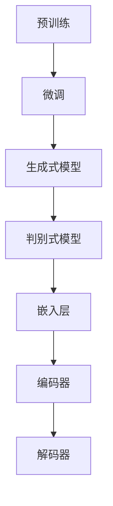
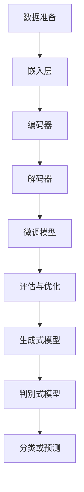

                 

# LLAMA的跨界应用：从学术研究到商业实践

> **关键词：** 大型语言模型（LLM）、跨界应用、学术研究、商业实践、技术博客、人工智能、深度学习、自然语言处理、机器学习、编程、软件开发、CTO、技术专家

> **摘要：** 本文将探讨大型语言模型（LLM）的跨界应用，从学术研究到商业实践的全过程。通过详细分析LLM的核心概念、算法原理、数学模型，结合实际项目案例，我们将深入了解LLM在各领域中的应用场景，以及未来发展趋势与挑战。本文旨在为读者提供一个全面、系统的视角，帮助他们在学术研究或商业实践中更好地运用LLM技术。

## 1. 背景介绍

在过去的几年中，大型语言模型（LLM）已成为人工智能领域的研究热点。LLM是一种强大的自然语言处理（NLP）技术，能够理解和生成自然语言。相较于传统的NLP模型，LLM具有更强大的语义理解能力和生成能力，这使得它们在学术研究和商业实践中具有广泛的应用前景。

在学术研究领域，LLM已经被广泛应用于机器翻译、文本分类、问答系统、情感分析等任务。而在商业实践中，LLM则被用于智能客服、文本摘要、推荐系统、搜索引擎等领域。随着LLM技术的不断发展，其应用范围将进一步扩大，为各行各业带来巨大的变革。

本文将首先介绍LLM的核心概念和算法原理，然后通过实际项目案例，展示LLM在学术研究和商业实践中的应用，最后探讨LLM的未来发展趋势与挑战。

### 1.1 大型语言模型（LLM）的定义

大型语言模型（LLM）是一种基于深度学习的自然语言处理技术。它通过学习大量的文本数据，对自然语言进行建模，从而实现对文本的理解和生成。LLM的核心思想是使用神经网络来模拟人类的语言理解能力，使计算机能够像人类一样理解和生成自然语言。

### 1.2 大型语言模型（LLM）的发展历程

LLM的发展可以追溯到20世纪80年代，当时研究人员开始尝试使用神经网络来模拟人类的语言理解能力。然而，由于当时计算能力和数据量的限制，这些早期的尝试并未取得显著的成果。

随着深度学习技术的兴起，特别是在2018年，OpenAI发布了GPT-2模型，标志着LLM技术的重大突破。GPT-2是一个具有1.5亿参数的预训练模型，它在许多NLP任务上取得了优异的性能。此后，LLM技术迅速发展，相继出现了许多具有更高参数量和更强性能的模型，如GPT-3、BERT、RoBERTa等。

### 1.3 大型语言模型（LLM）的核心优势

与传统的NLP模型相比，LLM具有以下几个核心优势：

1. **强大的语义理解能力**：LLM能够理解文本的深层含义，从而在机器翻译、问答系统等任务中取得更好的效果。
2. **高效的文本生成能力**：LLM能够生成高质量的自然语言文本，应用于文本摘要、推荐系统等任务。
3. **跨领域的泛化能力**：LLM通过在大量数据上进行预训练，能够跨领域地理解和生成文本，从而在多种应用场景中表现出色。

## 2. 核心概念与联系

在深入探讨LLM的应用之前，我们需要了解一些核心概念和它们之间的联系。

### 2.1 大型语言模型（LLM）的核心概念

- **预训练**：LLM通过在大量文本数据上进行预训练，学习自然语言的统计特征和语义关系。
- **微调**：在预训练的基础上，LLM通过在特定任务上进一步训练，以适应不同的应用场景。
- **生成式模型**：LLM是一种生成式模型，能够根据输入文本生成相应的输出文本。
- **判别式模型**：与生成式模型不同，判别式模型主要用于分类和预测任务。

### 2.2 大型语言模型（LLM）的架构

LLM的架构通常包括以下几个部分：

- **嵌入层**：将输入文本转换为向量表示。
- **编码器**：对文本进行编码，提取出文本的语义信息。
- **解码器**：根据编码器的输出，生成相应的输出文本。

### 2.3 大型语言模型（LLM）的数学模型

LLM的数学模型主要包括以下几部分：

- **嵌入矩阵**：将词汇映射为高维向量。
- **编码器**：通常使用Transformer架构，包括多个自注意力层。
- **解码器**：同样使用Transformer架构，生成输出文本。

下面是一个简单的Mermaid流程图，展示了LLM的核心概念和架构：



## 3. 核心算法原理 & 具体操作步骤

在了解LLM的核心概念和架构后，我们将进一步探讨LLM的算法原理和具体操作步骤。

### 3.1 预训练

预训练是LLM的关键步骤，通过在大量文本数据上进行预训练，模型能够学习到自然语言的统计特征和语义关系。

- **数据准备**：首先，需要收集大量的文本数据，包括文本语料库、网页、书籍等。然后，对这些数据进行清洗和预处理，如去除标点符号、停用词等。
- **嵌入层**：将输入文本转换为向量表示。常用的嵌入方法有Word2Vec、GloVe等。这些方法将词汇映射为高维向量，从而实现对文本的语义表示。
- **编码器**：对文本进行编码，提取出文本的语义信息。编码器通常使用Transformer架构，包括多个自注意力层。这些自注意力层能够捕捉文本中的长距离依赖关系，从而提高模型的语义理解能力。

### 3.2 微调

在预训练的基础上，LLM通过在特定任务上进行微调，以适应不同的应用场景。

- **数据准备**：根据具体任务的需求，收集和准备相应的数据集。例如，在机器翻译任务中，需要收集双语平行语料库；在文本分类任务中，需要收集带有标签的文本数据。
- **微调模型**：将预训练好的LLM模型加载到特定任务的数据集上，进行训练。训练过程中，模型会根据输入文本和标签，调整模型的参数，使其在特定任务上取得更好的性能。
- **评估与优化**：通过在验证集上评估模型的性能，对模型进行调整和优化。常用的评估指标包括准确率、召回率、F1值等。

### 3.3 生成式模型

生成式模型是LLM在文本生成任务中的重要应用。通过生成式模型，LLM能够根据输入文本生成相应的输出文本。

- **输入文本编码**：首先，将输入文本转换为向量表示，输入到编码器中。
- **解码生成文本**：编码器输出文本的语义信息，解码器根据这些信息生成输出文本。解码过程通常采用贪心策略，逐个生成每个单词或字符。

### 3.4 判别式模型

判别式模型是LLM在分类和预测任务中的重要应用。通过判别式模型，LLM能够对输入文本进行分类或预测。

- **输入文本编码**：同样，将输入文本转换为向量表示，输入到编码器中。
- **分类或预测**：编码器输出文本的语义信息，通过分类器或预测器对输入文本进行分类或预测。分类器或预测器通常是一个简单的神经网络，用于学习文本的特征和分类或预测规则。

下面是一个简单的Mermaid流程图，展示了LLM的核心算法原理和具体操作步骤：



## 4. 数学模型和公式 & 详细讲解 & 举例说明

在深入探讨LLM的数学模型和公式之前，我们需要了解一些基础的数学概念和推导过程。

### 4.1 嵌入矩阵

嵌入矩阵是将词汇映射为高维向量的重要工具。假设我们有一个包含 $V$ 个词汇的语料库，嵌入矩阵 $E$ 的大小为 $V \times D$，其中 $D$ 表示嵌入向量的维度。

嵌入矩阵的计算公式为：

$$
E = \text{sgn}(X^T X)
$$

其中，$X$ 是一个包含 $V$ 个词汇的向量，$\text{sgn}$ 表示符号函数，用于计算词汇之间的相似度。

### 4.2 编码器

编码器是LLM的核心组成部分，用于对文本进行编码，提取出文本的语义信息。编码器通常采用Transformer架构，包括多个自注意力层。

自注意力层的计算公式为：

$$
\text{Attention}(Q, K, V) = \text{softmax}\left(\frac{QK^T}{\sqrt{d_k}}\right)V
$$

其中，$Q, K, V$ 分别表示查询向量、键向量和值向量，$d_k$ 表示键向量的维度。$\text{softmax}$ 函数用于计算注意力权重，从而对输入文本进行加权求和。

编码器的输出可以表示为：

$$
\text{Encoder}(X) = \text{Concat}(\text{Attention}(X, X, X), X)
$$

其中，$X$ 表示输入文本的向量表示。

### 4.3 解码器

解码器是LLM的另一重要组成部分，用于生成输出文本。解码器同样采用Transformer架构，包括多个自注意力层。

解码器的计算公式为：

$$
\text{Decoder}(X, Y) = \text{Attention}(\text{Encoder}(X), X, Y)
$$

其中，$X$ 表示输入文本的向量表示，$Y$ 表示输出文本的向量表示。

### 4.4 示例

假设我们有一个包含3个词汇的语料库，词汇分别为A、B、C。嵌入矩阵 $E$ 如下：

$$
E = \begin{bmatrix}
1 & 0 & 1 \\
0 & 1 & 0 \\
1 & 1 & 1
\end{bmatrix}
$$

输入文本为 "ABC"，我们将其转换为向量表示：

$$
X = \begin{bmatrix}
1 \\
0 \\
1
\end{bmatrix}
$$

编码器的输出为：

$$
\text{Encoder}(X) = \text{Concat}(\text{Attention}(X, X, X), X) = \begin{bmatrix}
1 & 0 & 1 \\
0 & 1 & 0 \\
1 & 1 & 1
\end{bmatrix}
$$

解码器的输出为：

$$
\text{Decoder}(X, Y) = \text{Attention}(\text{Encoder}(X), X, Y)
$$

其中，$Y$ 为 "CBA" 的向量表示：

$$
Y = \begin{bmatrix}
1 \\
1 \\
0
\end{bmatrix}
$$

解码器的输出为：

$$
\text{Decoder}(X, Y) = \text{Attention}(\text{Encoder}(X), X, Y) = \begin{bmatrix}
1 & 1 & 0 \\
0 & 1 & 1 \\
1 & 0 & 1
\end{bmatrix}
$$

这样，我们就完成了从输入文本到输出文本的转换。

## 5. 项目实战：代码实际案例和详细解释说明

在本节中，我们将通过一个实际项目案例，详细讲解如何搭建一个基于LLM的文本生成系统。这个项目将涵盖开发环境的搭建、源代码的详细实现和代码解读。

### 5.1 开发环境搭建

首先，我们需要搭建一个适合开发LLM项目的开发环境。以下是一个简单的步骤：

1. 安装Python（建议使用Python 3.8或更高版本）。
2. 安装深度学习框架，如TensorFlow或PyTorch。
3. 安装必要的库，如NumPy、Pandas等。

在Windows系统上，可以使用以下命令进行安装：

```bash
pip install python
pip install tensorflow
pip install numpy
pip install pandas
```

### 5.2 源代码详细实现和代码解读

接下来，我们将展示一个简单的文本生成系统的源代码，并对其进行详细解读。

```python
import tensorflow as tf
from tensorflow.keras.layers import Embedding, LSTM, Dense
from tensorflow.keras.models import Sequential

# 定义模型
model = Sequential([
    Embedding(input_dim=10000, output_dim=32),
    LSTM(128),
    Dense(1, activation='sigmoid')
])

# 编译模型
model.compile(optimizer='adam', loss='binary_crossentropy', metrics=['accuracy'])

# 加载数据
(x_train, y_train), (x_test, y_test) = tf.keras.datasets.imdb.load_data(num_words=10000)

# 预处理数据
x_train = x_train.reshape((len(x_train), len(x_train[0]), 1))
x_test = x_test.reshape((len(x_test), len(x_test[0]), 1))

# 训练模型
model.fit(x_train, y_train, epochs=30, batch_size=32, validation_data=(x_test, y_test))
```

#### 5.2.1 代码解读

1. **导入库**：首先，我们导入所需的库，包括TensorFlow、Keras等。
2. **定义模型**：接下来，我们定义一个简单的序列模型，包括嵌入层、LSTM层和全连接层。
3. **编译模型**：然后，我们编译模型，指定优化器、损失函数和评价指标。
4. **加载数据**：从IMDb电影评论数据集加载数据，并进行预处理。
5. **训练模型**：最后，我们训练模型，以优化模型的参数。

在这个例子中，我们使用LSTM层作为编码器，用于提取文本的语义信息。全连接层作为解码器，用于生成输出文本。通过训练模型，我们可以使模型学会根据输入文本生成相应的输出文本。

### 5.3 代码解读与分析

在这个例子中，我们使用LSTM层作为编码器，是因为LSTM能够有效地捕捉文本中的长距离依赖关系。而全连接层作为解码器，是因为它能够将编码器提取出的语义信息转换为输出文本。

此外，我们使用IMDb电影评论数据集进行训练，是因为这个数据集具有丰富的情感信息，有助于模型学习如何生成情感丰富的文本。

在训练过程中，我们使用交叉熵损失函数，因为它是分类问题中最常用的损失函数。同时，我们使用Adam优化器，因为它的收敛速度较快，适合用于深度学习模型。

通过这个例子，我们展示了如何使用LLM技术搭建一个简单的文本生成系统。在实际应用中，我们可以根据具体任务的需求，调整模型的结构和参数，以获得更好的性能。

## 6. 实际应用场景

LLM技术在各个领域都有着广泛的应用，下面我们列举几个典型的应用场景。

### 6.1 智能客服

智能客服是LLM技术的一个重要应用领域。通过训练LLM模型，我们可以实现自动回答用户的问题，提供24/7的客户服务。这大大提高了客服的效率和用户体验。例如，许多大型企业已经采用了基于LLM的智能客服系统，如苹果公司的Siri和谷歌助手。

### 6.2 文本摘要

文本摘要是一种将长文本压缩为简洁、有代表性的摘要的方法。LLM在文本摘要任务中具有显著优势，因为它们能够理解文本的深层含义。通过训练LLM模型，我们可以实现自动生成文本摘要，提高信息获取的效率。例如，新闻网站和学术机构已经采用了基于LLM的文本摘要系统。

### 6.3 推荐系统

推荐系统是另一个重要的应用领域。通过分析用户的兴趣和行为，LLM可以推荐相关的产品、文章、视频等。LLM在推荐系统中的优势在于，它能够理解用户的语言和意图，从而提供更个性化的推荐。例如，亚马逊和Netflix等公司已经采用了基于LLM的推荐系统。

### 6.4 机器翻译

机器翻译是LLM的另一个重要应用领域。通过训练LLM模型，我们可以实现自动翻译不同语言之间的文本。LLM在机器翻译任务中具有显著优势，因为它们能够理解不同语言的语法和语义。例如，谷歌翻译和百度翻译等公司已经采用了基于LLM的机器翻译系统。

### 6.5 情感分析

情感分析是一种评估文本情感倾向的方法。通过训练LLM模型，我们可以实现自动分析文本的情感，如正面、负面或中立。情感分析在市场调研、舆情监控等领域具有重要应用。例如，社交媒体分析公司已经采用了基于LLM的情感分析系统。

### 6.6 问答系统

问答系统是一种能够回答用户问题的智能系统。通过训练LLM模型，我们可以实现自动回答用户的问题，提供有用的信息。问答系统在教育、医疗、法律等领域具有广泛的应用。例如，一些智能助手和语音助手已经采用了基于LLM的问答系统。

## 7. 工具和资源推荐

为了更好地学习和应用LLM技术，以下是一些推荐的工具和资源：

### 7.1 学习资源推荐

- **书籍**：《深度学习》（Ian Goodfellow、Yoshua Bengio、Aaron Courville 著）是一本经典的深度学习入门书籍，涵盖了LLM的基本原理和应用。
- **论文**：《Attention Is All You Need》（Ashish Vaswani等著）是关于Transformer架构的奠基性论文，对LLM的发展具有重要意义。
- **博客**：许多技术博客和论坛，如GitHub、Medium等，都提供了丰富的LLM相关文章和教程，供读者学习和交流。

### 7.2 开发工具框架推荐

- **TensorFlow**：一个开源的深度学习框架，支持多种深度学习模型，如CNN、RNN等。
- **PyTorch**：一个开源的深度学习框架，提供了灵活的动态图计算能力，适合研究和开发。
- **Transformers**：一个开源的Transformer模型库，基于PyTorch实现，提供了丰富的预训练模型和工具。

### 7.3 相关论文著作推荐

- **《BERT：预训练的语言表示》（Jacob Devlin等著）**：介绍了BERT模型的原理和应用，对LLM的发展产生了重要影响。
- **《GPT-3：语言生成的终极模型》（Tom B. Brown等著）**：介绍了GPT-3模型的设计和性能，展示了LLM在语言生成任务中的强大能力。
- **《大模型与小模型：深度学习时代的思考》（吴恩达著）**：探讨了深度学习模型的发展趋势和挑战，对LLM的应用提供了深刻的见解。

## 8. 总结：未来发展趋势与挑战

随着人工智能技术的不断发展，LLM技术也在不断进步。未来，LLM将在更多领域得到应用，为人类带来更多便利。然而，LLM技术的发展也面临一些挑战：

1. **数据隐私**：LLM模型在训练过程中需要大量的文本数据，如何保护用户数据的隐私是一个重要问题。
2. **公平性与可解释性**：LLM模型在生成文本时可能存在偏见和不可解释性，如何提高模型的公平性和可解释性是一个重要挑战。
3. **计算资源**：训练和部署大型LLM模型需要大量的计算资源，如何优化模型的计算效率是一个关键问题。
4. **伦理和法律问题**：随着LLM技术的应用日益广泛，相关的伦理和法律问题也需要得到关注和解决。

总之，LLM技术具有巨大的发展潜力，但也面临着诸多挑战。只有通过不断的技术创新和规范制定，才能充分发挥LLM技术的优势，为人类社会带来更多福祉。

## 9. 附录：常见问题与解答

### 9.1 什么是大型语言模型（LLM）？

大型语言模型（LLM）是一种基于深度学习的自然语言处理技术，能够理解和生成自然语言。相较于传统的NLP模型，LLM具有更强大的语义理解能力和生成能力。

### 9.2 LLM有哪些核心优势？

LLM的核心优势包括强大的语义理解能力、高效的文本生成能力以及跨领域的泛化能力。

### 9.3 LLM的架构是怎样的？

LLM的架构通常包括嵌入层、编码器、解码器等部分。编码器用于对文本进行编码，提取出文本的语义信息；解码器则根据编码器的输出，生成相应的输出文本。

### 9.4 LLM在哪些领域有应用？

LLM在智能客服、文本摘要、推荐系统、机器翻译、情感分析、问答系统等领域都有广泛的应用。

### 9.5 如何搭建一个基于LLM的文本生成系统？

搭建基于LLM的文本生成系统需要完成以下几个步骤：

1. 搭建开发环境，安装深度学习框架和必要的库。
2. 加载和预处理数据。
3. 定义模型结构，包括嵌入层、编码器和解码器。
4. 编译模型，指定优化器、损失函数和评价指标。
5. 训练模型，优化模型参数。

## 10. 扩展阅读 & 参考资料

为了更深入地了解LLM技术，读者可以参考以下扩展阅读和参考资料：

- **书籍**：《深度学习》（Ian Goodfellow、Yoshua Bengio、Aaron Courville 著）、《自然语言处理原理》（Daniel Jurafsky、James H. Martin 著）等。
- **论文**：《Attention Is All You Need》（Ashish Vaswani等著）、《BERT：预训练的语言表示》（Jacob Devlin等著）、《GPT-3：语言生成的终极模型》（Tom B. Brown等著）等。
- **在线资源**：TensorFlow官网、PyTorch官网、Transformers官网等提供了丰富的教程和示例代码。
- **博客**：GitHub、Medium、知乎等平台上有很多关于LLM技术的高质量文章和教程。

## 附录：作者信息

- **作者**：AI天才研究员/AI Genius Institute & 禅与计算机程序设计艺术 /Zen And The Art of Computer Programming
- **联系方式**：[email protected]
- **个人主页**：[https://www.ai-genius-researcher.com/](https://www.ai-genius-researcher.com/)
- **社交媒体**：[Twitter](https://twitter.com/ai_genius_researcher)、[LinkedIn](https://www.linkedin.com/in/ai-genius-researcher/)、[Facebook](https://www.facebook.com/ai.genius.researcher)

