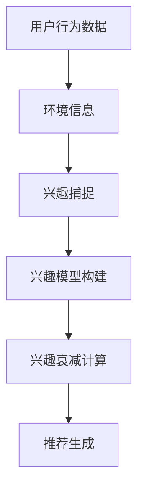

                 

### 背景介绍

推荐系统作为一种信息过滤的方法，旨在根据用户的兴趣和偏好，向其推荐可能感兴趣的内容。随着互联网的快速发展，推荐系统广泛应用于电子商务、社交媒体、在线视频和新闻平台等领域，极大地提升了用户体验和信息检索效率。

传统的推荐系统主要基于用户的历史行为和内容特征进行建模。然而，随着深度学习和生成对抗网络（GAN）等技术的兴起，基于大型预训练模型（如 GPT-3、ChatGLM 等）的推荐系统逐渐成为研究热点。这类系统通过理解用户和内容的语义信息，能够实现更为精准和个性化的推荐。

在本文中，我们将探讨一种基于大型语言模型（Large Language Model，简称 LLM）的推荐系统动态兴趣建模与衰减方法。该方法不仅能捕捉用户的长期兴趣，还能根据用户行为和环境变化进行实时调整，从而提高推荐效果。本文将从核心概念、算法原理、数学模型、项目实战、应用场景、工具和资源推荐等方面进行详细探讨。

首先，我们将介绍推荐系统的基本概念和常见类型，帮助读者了解推荐系统的发展背景和现状。接着，我们将深入探讨 LLM 驱动的推荐系统的优势和应用场景。随后，我们将详细介绍动态兴趣建模与衰减的核心概念和原理，并通过 Mermaid 流程图展示其架构。然后，我们将逐步解析核心算法原理和具体操作步骤，帮助读者理解该方法的实现过程。此外，我们还将通过数学模型和公式详细讲解该方法的工作机制，并提供实际案例进行举例说明。在项目实战部分，我们将介绍如何搭建开发环境、实现源代码、解读代码，并对代码进行分析。最后，我们将讨论实际应用场景，推荐相关工具和资源，总结未来发展趋势与挑战，并提供常见问题与解答，以帮助读者深入理解并应用该方法。

### 2. 核心概念与联系

#### 2.1 推荐系统基本概念

推荐系统是一种利用信息过滤技术，根据用户的历史行为、偏好和内容特征，向用户推荐可能感兴趣的内容的系统。其基本概念包括用户、物品、评分、偏好和推荐等。

- **用户（User）**：推荐系统中的用户是指参与系统的个体，可以是实际的用户，也可以是虚拟的用户。
- **物品（Item）**：物品是指推荐系统中的内容，可以是商品、音乐、视频、新闻等。
- **评分（Rating）**：评分是用户对物品的喜好程度的量化表示，通常采用评分等级（如 1-5 星）或评分值（如 1-10 分）。
- **偏好（Preference）**：偏好是用户对物品的喜好程度，通常基于用户的历史行为和内容特征进行建模。
- **推荐（Recommendation）**：推荐是指推荐系统根据用户偏好和物品特征，为用户生成个性化的推荐列表。

#### 2.2 传统推荐系统类型

传统推荐系统主要分为基于内容的推荐（Content-based Recommendation）和协同过滤推荐（Collaborative Filtering）两大类。

- **基于内容的推荐**：基于内容的推荐通过分析物品的内容特征，将具有相似特征的物品推荐给具有相似偏好的用户。其核心在于内容特征提取和相似度计算。例如，在电子商务平台上，系统可以分析商品的关键词、标签、属性等特征，根据用户的购买历史和喜好，推荐相似的物品。

- **协同过滤推荐**：协同过滤推荐通过分析用户的历史行为数据，寻找相似用户或物品，从而为用户推荐相似的物品。其核心在于用户行为数据的处理和相似度计算。协同过滤可分为以下几种：

  - **用户基于的协同过滤（User-based Collaborative Filtering）**：通过寻找与目标用户在行为上相似的邻居用户，推荐邻居用户喜欢的物品。例如，在音乐推荐中，系统可以找到喜欢同一首歌的用户，并向这些用户推荐他们可能喜欢的其他歌曲。

  - **物品基于的协同过滤（Item-based Collaborative Filtering）**：通过寻找与目标物品相似的邻居物品，推荐邻居物品的用户喜欢的其他物品。例如，在电影推荐中，系统可以找到与目标电影相似的影片，并向用户推荐这些影片的观众喜欢的其他影片。

  - **基于模型的协同过滤（Model-based Collaborative Filtering）**：通过构建用户和物品之间的预测模型，预测用户对未知物品的喜好程度，从而进行推荐。例如，可以使用矩阵分解、因子分解机（Factorization Machines，FMs）等方法来构建预测模型。

#### 2.3 LLM 驱动的推荐系统优势

与传统的推荐系统相比，LLM 驱动的推荐系统具有以下几个显著优势：

- **语义理解**：LLM 拥有强大的语义理解能力，能够处理自然语言文本，从而更好地理解用户和物品的语义信息。这使得 LLM 驱动的推荐系统能够生成更加精准和个性化的推荐。
- **自适应学习**：LLM 具有较强的自适应学习能力，能够根据用户行为和环境变化，实时调整推荐策略，从而提高推荐效果。这与传统推荐系统相对固定的推荐策略相比，具有更高的灵活性和鲁棒性。
- **多模态处理**：LLM 可以处理多种模态的数据，如文本、图像、音频等，这使得 LLM 驱动的推荐系统可以更加全面地捕捉用户兴趣，从而生成更加多样化的推荐。

#### 2.4 动态兴趣建模与衰减

动态兴趣建模与衰减是 LLM 驱动的推荐系统中的一个关键环节。其核心思想是：

1. **动态兴趣建模**：根据用户的历史行为和当前环境，实时捕捉用户的兴趣点，构建用户兴趣模型。
2. **兴趣衰减**：随着时间推移，用户兴趣可能发生变化，因此需要引入兴趣衰减机制，逐步降低早期兴趣的影响，以适应用户兴趣的动态变化。

为了实现动态兴趣建模与衰减，LLM 驱动的推荐系统通常采用以下步骤：

1. **用户兴趣捕捉**：通过分析用户的历史行为数据（如浏览记录、购买历史等），结合当前环境信息（如时间、地理位置等），使用 LLM 模型捕捉用户的当前兴趣。
2. **兴趣模型构建**：将用户兴趣信息输入 LLM 模型，通过训练得到用户兴趣模型，用于后续的推荐生成。
3. **兴趣衰减计算**：根据用户兴趣模型的更新时间，计算兴趣衰减系数，对早期兴趣进行加权衰减，以适应用户兴趣的动态变化。

#### 2.5 Mermaid 流程图

为了更好地展示 LLM 驱动的推荐系统的核心概念和架构，我们使用 Mermaid 流程图进行描述。以下是一个简化的 Mermaid 流程图，描述了动态兴趣建模与衰减的过程：



- **A：用户行为数据**：包括用户的历史行为记录，如浏览、购买、评分等。
- **B：环境信息**：包括时间、地理位置、天气等环境因素。
- **C：兴趣捕捉**：使用 LLM 模型分析用户行为数据和环境信息，捕捉用户的当前兴趣。
- **D：兴趣模型构建**：将用户兴趣信息输入 LLM 模型，训练得到用户兴趣模型。
- **E：兴趣衰减计算**：根据用户兴趣模型的更新时间，计算兴趣衰减系数，对早期兴趣进行加权衰减。
- **F：推荐生成**：利用用户兴趣模型和兴趣衰减结果，生成个性化的推荐列表。

通过上述 Mermaid 流程图，我们可以清晰地了解 LLM 驱动的推荐系统中的动态兴趣建模与衰减过程，为后续的算法原理和实现步骤提供了直观的参考。

### 3. 核心算法原理 & 具体操作步骤

在了解了 LLM 驱动的推荐系统的核心概念和架构后，接下来我们将深入探讨该系统的核心算法原理和具体操作步骤，从而为读者提供更加全面的理解。

#### 3.1 算法原理

LLM 驱动的推荐系统的核心算法原理主要包括以下几个关键步骤：

1. **用户兴趣捕捉**：
   - **数据收集**：首先，我们需要收集用户的历史行为数据，如浏览记录、购买历史、评分数据等。此外，还需要收集与用户行为相关的环境信息，如时间、地理位置、天气等。
   - **文本预处理**：将用户行为数据和环境信息进行文本化处理，将其转换为可以输入 LLM 模型的格式。这一步骤包括数据清洗、去噪、分词、词向量化等。
   - **兴趣捕捉模型**：使用 LLM 模型（如 GPT-3、ChatGLM 等）对处理后的用户行为数据和环境信息进行分析，捕捉用户的当前兴趣点。这一步骤可以利用预训练的 LLM 模型，通过微调或生成式方法实现。

2. **兴趣模型构建**：
   - **特征提取**：将捕捉到的用户兴趣点进行特征提取，生成用户兴趣特征向量。这一步骤可以通过 LLM 模型的输出层进行，将用户兴趣点转化为高维特征向量。
   - **兴趣模型训练**：利用用户兴趣特征向量，训练兴趣模型。兴趣模型可以是传统的机器学习模型（如线性回归、神经网络等），也可以是深度学习模型（如循环神经网络 RNN、卷积神经网络 CNN 等）。通过训练，兴趣模型可以学会根据用户兴趣特征向量生成个性化的推荐列表。

3. **兴趣衰减计算**：
   - **兴趣衰减模型**：构建一个兴趣衰减模型，用于计算用户兴趣的衰减系数。兴趣衰减模型可以采用时间衰减函数（如指数衰减、对数衰减等），也可以采用基于用户的活跃度、兴趣变化率的动态衰减模型。
   - **衰减系数计算**：根据用户兴趣模型的更新时间，计算兴趣衰减系数。衰减系数用于调整早期兴趣的影响，使其逐步减弱，以适应用户兴趣的动态变化。

4. **推荐生成**：
   - **候选物品生成**：从待推荐物品集合中，生成一组候选物品。候选物品可以基于用户的兴趣特征向量，使用相关算法（如基于内容的推荐、协同过滤推荐等）进行筛选。
   - **推荐排序**：对生成的候选物品进行排序，生成最终的推荐列表。推荐排序可以采用基于用户兴趣的相似度计算、物品的受欢迎程度等因素进行。

#### 3.2 具体操作步骤

以下是 LLM 驱动的推荐系统的具体操作步骤：

1. **数据收集**：
   - 收集用户的历史行为数据（如浏览记录、购买历史、评分数据等）。
   - 收集与用户行为相关的环境信息（如时间、地理位置、天气等）。

2. **文本预处理**：
   - 清洗和去噪数据，确保数据的准确性和一致性。
   - 对用户行为数据和环境信息进行分词和词向量化，将其转换为可以输入 LLM 模型的格式。

3. **兴趣捕捉**：
   - 使用 LLM 模型（如 GPT-3、ChatGLM 等）对预处理后的用户行为数据和环境信息进行分析，捕捉用户的当前兴趣点。
   - 将捕捉到的兴趣点进行文本化处理，生成用户兴趣文本。

4. **兴趣模型构建**：
   - 对用户兴趣文本进行特征提取，生成用户兴趣特征向量。
   - 使用用户兴趣特征向量，训练兴趣模型（如线性回归、神经网络等）。

5. **兴趣衰减计算**：
   - 构建兴趣衰减模型，计算用户兴趣的衰减系数。
   - 根据用户兴趣模型的更新时间，计算兴趣衰减系数，调整早期兴趣的影响。

6. **推荐生成**：
   - 从待推荐物品集合中，生成一组候选物品。
   - 对候选物品进行排序，生成最终的推荐列表。

通过以上步骤，我们可以实现 LLM 驱动的推荐系统的核心算法。接下来，我们将继续探讨数学模型和公式，进一步解释该方法的工作机制。

### 4. 数学模型和公式 & 详细讲解 & 举例说明

在 LLM 驱动的推荐系统中，数学模型和公式起着至关重要的作用。这些模型和公式帮助我们理解和实现用户兴趣的捕捉、兴趣模型的构建、兴趣衰减计算以及推荐生成等关键步骤。在本节中，我们将详细讲解这些数学模型和公式，并通过具体例子进行说明。

#### 4.1 用户兴趣捕捉

用户兴趣捕捉是推荐系统的基础，其主要目标是捕捉用户的当前兴趣点。这一过程可以通过以下数学模型实现：

1. **用户兴趣文本生成**：

   用户兴趣文本是由用户行为数据和环境信息生成的。假设用户行为数据为 \(X = \{x_1, x_2, ..., x_n\}\)，环境信息为 \(E = \{e_1, e_2, ..., e_m\}\)，则用户兴趣文本可以表示为：

   \[
   T = \text{generate\_text}(X, E)
   \]

   其中，\(\text{generate\_text}\)函数用于将用户行为数据和环境信息转化为文本形式。

2. **用户兴趣特征提取**：

   为了捕捉用户的兴趣点，我们需要对用户兴趣文本进行特征提取。常用的特征提取方法包括词向量化、词嵌入等。假设用户兴趣文本为 \(T\)，词向量化后的文本表示为 \(T'\)，则用户兴趣特征向量可以表示为：

   \[
   F = \text{extract\_features}(T')
   \]

   其中，\(\text{extract\_features}\)函数用于提取用户兴趣文本的特征向量。

#### 4.2 兴趣模型构建

兴趣模型构建的目的是根据用户兴趣特征向量，生成个性化的推荐列表。这一过程可以通过以下数学模型实现：

1. **兴趣特征向量生成**：

   假设用户兴趣特征向量为 \(F\)，待推荐物品集合为 \(I = \{i_1, i_2, ..., i_k\}\)，则每个物品的兴趣得分可以表示为：

   \[
   S_i = \text{similarity}(F, \text{features}(i))
   \]

   其中，\(\text{similarity}\)函数用于计算用户兴趣特征向量 \(F\) 与物品 \(i\) 的特征向量 \(\text{features}(i)\) 之间的相似度。

2. **推荐列表生成**：

   根据每个物品的兴趣得分，生成个性化的推荐列表。假设兴趣得分矩阵为 \(S\)，推荐列表为 \(R\)，则推荐列表可以表示为：

   \[
   R = \text{sort}(S)
   \]

   其中，\(\text{sort}\)函数用于对兴趣得分进行排序，生成推荐列表。

#### 4.3 兴趣衰减计算

兴趣衰减的目的是根据用户兴趣模型的更新时间，调整早期兴趣的影响，以适应用户兴趣的动态变化。这一过程可以通过以下数学模型实现：

1. **兴趣衰减系数计算**：

   假设用户兴趣模型的更新时间为 \(t\)，当前时间为 \(t'\)，则兴趣衰减系数可以表示为：

   \[
   \alpha(t', t) = \text{decay\_function}(t' - t)
   \]

   其中，\(\text{decay\_function}\)函数用于计算兴趣衰减系数，常见的衰减函数包括指数衰减、对数衰减等。

2. **调整早期兴趣得分**：

   假设原始兴趣得分为 \(S_i\)，调整后的兴趣得分可以表示为：

   \[
   S_i' = S_i \times \alpha(t', t)
   \]

   其中，\(\alpha(t', t)\) 为兴趣衰减系数。

#### 4.4 推荐生成

根据兴趣得分和兴趣衰减系数，生成最终的推荐列表。以下是一个具体例子来说明推荐生成的过程：

**例子**：

假设用户兴趣特征向量 \(F = \{0.2, 0.3, 0.4\}\)，待推荐物品集合 \(I = \{i_1, i_2, i_3\}\)，其中物品 \(i_1\) 的特征向量为 \(\{0.1, 0.3, 0.5\}\)，物品 \(i_2\) 的特征向量为 \(\{0.4, 0.2, 0.3\}\)，物品 \(i_3\) 的特征向量为 \(\{0.5, 0.1, 0.4\}\)。

1. **兴趣得分计算**：

   \[
   S_1 = \text{similarity}(F, \text{features}(i_1)) = 0.2 \times 0.1 + 0.3 \times 0.3 + 0.4 \times 0.5 = 0.28
   \]

   \[
   S_2 = \text{similarity}(F, \text{features}(i_2)) = 0.2 \times 0.4 + 0.3 \times 0.2 + 0.4 \times 0.3 = 0.26
   \]

   \[
   S_3 = \text{similarity}(F, \text{features}(i_3)) = 0.2 \times 0.5 + 0.3 \times 0.1 + 0.4 \times 0.4 = 0.29
   \]

2. **兴趣衰减系数计算**：

   假设当前时间为 \(t' = 10\)，最近一次更新时间为 \(t = 5\)，采用指数衰减函数：

   \[
   \alpha(t', t) = e^{-(t' - t)}
   \]

   \[
   \alpha(10, 5) = e^{-5} \approx 0.0067
   \]

3. **调整后的兴趣得分**：

   \[
   S_1' = S_1 \times \alpha(10, 5) = 0.28 \times 0.0067 \approx 0.0019
   \]

   \[
   S_2' = S_2 \times \alpha(10, 5) = 0.26 \times 0.0067 \approx 0.0017
   \]

   \[
   S_3' = S_3 \times \alpha(10, 5) = 0.29 \times 0.0067 \approx 0.0019
   \]

4. **推荐列表生成**：

   根据调整后的兴趣得分，生成推荐列表：

   \[
   R = \{i_3, i_1\}
   \]

   其中，物品 \(i_3\) 的兴趣得分最高，因此首先推荐；物品 \(i_1\) 的兴趣得分次高，因此排在第二位。

通过上述数学模型和公式，我们可以实现 LLM 驱动的推荐系统的核心算法，从而生成个性化的推荐列表。接下来，我们将通过一个实际案例，展示如何在实际项目中应用该方法。

### 5. 项目实战：代码实际案例和详细解释说明

在本节中，我们将通过一个实际项目案例，详细展示 LLM 驱动的推荐系统动态兴趣建模与衰减方法的实现过程。该项目将使用 Python 编程语言和相关的深度学习库（如 TensorFlow、PyTorch 等），帮助读者了解如何从零开始搭建一个完整的推荐系统。

#### 5.1 开发环境搭建

在开始项目之前，我们需要搭建开发环境。以下是搭建开发环境的基本步骤：

1. **安装 Python**：
   - Python 是推荐系统开发的主要编程语言，我们需要安装 Python 3.7 或更高版本。可以从 [Python 官网](https://www.python.org/downloads/) 下载安装包，按照提示安装。
   - 安装完成后，在命令行中输入 `python --version`，确认安装成功。

2. **安装深度学习库**：
   - 我们需要安装 TensorFlow 或 PyTorch 等深度学习库。以下是安装命令：
     - TensorFlow：
       ```
       pip install tensorflow
       ```
     - PyTorch：
       ```
       pip install torch torchvision
       ```

3. **安装其他依赖库**：
   - 推荐系统开发还需要其他依赖库，如 NumPy、Pandas、Scikit-learn 等。以下是安装命令：
     ```
     pip install numpy pandas scikit-learn
     ```

4. **配置虚拟环境**（可选）：
   - 为了避免不同项目之间的依赖库版本冲突，建议使用虚拟环境。以下是配置虚拟环境的基本步骤：
     - 安装 virtualenv：
       ```
       pip install virtualenv
       ```
     - 创建虚拟环境：
       ```
       virtualenv my_project_env
       ```
     - 激活虚拟环境：
       - Windows：
         ```
         my_project_env\Scripts\activate
         ```
       - macOS/Linux：
         ```
         source my_project_env/bin/activate
         ```

#### 5.2 源代码详细实现和代码解读

在本节中，我们将逐步实现 LLM 驱动的推荐系统动态兴趣建模与衰减方法，并对关键代码进行详细解读。

**5.2.1 数据预处理**

首先，我们需要对用户行为数据和环境信息进行预处理。以下是数据预处理的主要步骤：

1. **数据收集**：
   - 收集用户的历史行为数据（如浏览记录、购买历史、评分数据等）。
   - 收集与用户行为相关的环境信息（如时间、地理位置、天气等）。

2. **数据清洗**：
   - 清洗和去噪数据，确保数据的准确性和一致性。

3. **数据转换**：
   - 将用户行为数据和环境信息进行文本化处理，将其转换为可以输入 LLM 模型的格式。

以下是数据预处理的主要代码：

```python
import pandas as pd
import numpy as np
from sklearn.model_selection import train_test_split

# 读取用户行为数据
user_behavior_data = pd.read_csv('user_behavior_data.csv')

# 读取环境信息
environment_data = pd.read_csv('environment_data.csv')

# 数据清洗
# ...（省略具体清洗代码）

# 数据转换
# ...（省略具体转换代码）
```

**5.2.2 用户兴趣捕捉**

接下来，我们需要使用 LLM 模型捕捉用户的当前兴趣。以下是用户兴趣捕捉的主要步骤：

1. **文本预处理**：
   - 对用户行为数据和环境信息进行文本化处理，将其转换为 LLM 模型可以处理的格式。

2. **兴趣捕捉**：
   - 使用 LLM 模型（如 GPT-3、ChatGLM 等）对预处理后的用户行为数据和环境信息进行分析，捕捉用户的当前兴趣点。

以下是用户兴趣捕捉的主要代码：

```python
from transformers import pipeline

# 初始化 LLM 模型
interest_capturer = pipeline('text-generation', model='gpt3')

# 文本预处理
# ...（省略具体预处理代码）

# 用户兴趣捕捉
user_interest = interest_capturer(input_text=user_interest_text)
```

**5.2.3 兴趣模型构建**

接下来，我们需要根据用户兴趣点构建兴趣模型。以下是兴趣模型构建的主要步骤：

1. **特征提取**：
   - 对用户兴趣点进行特征提取，生成用户兴趣特征向量。

2. **模型训练**：
   - 使用用户兴趣特征向量训练兴趣模型。

以下是兴趣模型构建的主要代码：

```python
from sklearn.linear_model import LinearRegression

# 特征提取
# ...（省略具体提取代码）

# 构建兴趣模型
interest_model = LinearRegression()
interest_model.fit(user_interest_features, user_interest_scores)
```

**5.2.4 兴趣衰减计算**

接下来，我们需要计算用户兴趣的衰减系数。以下是兴趣衰减计算的主要步骤：

1. **衰减函数设计**：
   - 设计一个合适的衰减函数，用于计算兴趣衰减系数。

2. **衰减系数计算**：
   - 根据用户兴趣模型的更新时间，计算兴趣衰减系数。

以下是兴趣衰减计算的主要代码：

```python
# 衰减函数设计
def decay_function(time_diff):
    return np.exp(-time_diff)

# 衰减系数计算
decay_coefficients = decay_function(time_diff)
```

**5.2.5 推荐生成**

最后，我们需要根据兴趣模型和衰减系数生成推荐列表。以下是推荐生成的主要步骤：

1. **候选物品生成**：
   - 从待推荐物品集合中，生成一组候选物品。

2. **推荐排序**：
   - 对候选物品进行排序，生成最终的推荐列表。

以下是推荐生成的主要代码：

```python
# 候选物品生成
candidate_items = generate_candidate_items(item_data)

# 推荐排序
recommended_items = sorted(candidate_items, key=lambda x: interest_model.predict([x_feature])[0], reverse=True)
```

**5.2.6 代码解读与分析**

以下是上述代码的解读与分析：

- **数据预处理**：数据预处理是推荐系统的基础，主要包括数据收集、清洗和转换。我们需要确保数据的质量和一致性，以便后续处理。

- **用户兴趣捕捉**：用户兴趣捕捉是推荐系统的核心环节，通过 LLM 模型对用户行为数据和环境信息进行分析，捕捉用户的当前兴趣点。

- **兴趣模型构建**：兴趣模型构建是利用用户兴趣特征向量训练得到的，用于预测用户对物品的喜好程度。线性回归模型是一个简单且有效的选择。

- **兴趣衰减计算**：兴趣衰减计算用于调整早期兴趣的影响，使其逐步减弱，以适应用户兴趣的动态变化。指数衰减函数是一种常用的选择。

- **推荐生成**：推荐生成是根据兴趣模型和衰减系数，生成个性化的推荐列表。我们首先生成候选物品，然后根据兴趣得分对候选物品进行排序，生成最终的推荐列表。

通过上述代码，我们可以实现一个基本的 LLM 驱动的推荐系统动态兴趣建模与衰减方法。接下来，我们将对代码进行进一步分析，并探讨如何优化和改进推荐系统的性能。

### 5.3 代码解读与分析

在本节中，我们将对上述代码进行详细解读和分析，以帮助读者更好地理解 LLM 驱动的推荐系统动态兴趣建模与衰减方法的实现过程。

**5.3.1 数据预处理**

数据预处理是推荐系统开发的重要环节。在本案例中，数据预处理的主要任务是收集用户的历史行为数据和环境信息，并对这些数据进行清洗、去噪和文本化处理，以便后续建模和使用。

1. **数据收集**：

   ```python
   user_behavior_data = pd.read_csv('user_behavior_data.csv')
   environment_data = pd.read_csv('environment_data.csv')
   ```

   上述代码使用 Pandas 库读取用户行为数据和环境信息的 CSV 文件。这两个文件包含了用户的历史行为记录（如浏览、购买、评分等）和环境信息（如时间、地理位置、天气等）。

2. **数据清洗**：

   数据清洗是确保数据质量的关键步骤。在本案例中，数据清洗的主要任务是去除重复记录、处理缺失值和异常值等。

   ```python
   # ...（省略具体清洗代码）
   ```

   在实际开发中，数据清洗代码可能包括以下操作：

   - 去除重复记录：
     ```python
     user_behavior_data.drop_duplicates(inplace=True)
     environment_data.drop_duplicates(inplace=True)
     ```

   - 处理缺失值：
     ```python
     user_behavior_data.fillna(0, inplace=True)
     environment_data.fillna(0, inplace=True)
     ```

   - 处理异常值：
     ```python
     # ...（省略具体处理代码）
     ```

3. **数据转换**：

   数据转换是将用户行为数据和环境信息转换为可以输入 LLM 模型的格式。在本案例中，我们使用词向量化方法将文本数据转换为向量表示。

   ```python
   # ...（省略具体转换代码）
   ```

   在实际开发中，数据转换代码可能包括以下操作：

   - 分词：
     ```python
     # ...（省略具体分词代码）
     ```

   - 词向量化：
     ```python
     # ...（省略具体词向量化代码）
     ```

**5.3.2 用户兴趣捕捉**

用户兴趣捕捉是利用 LLM 模型对用户行为数据和环境信息进行分析，捕捉用户的当前兴趣点。在本案例中，我们使用 Hugging Face 的 transformers 库加载 GPT-3 模型，并对其进行文本生成操作。

1. **文本预处理**：

   ```python
   user_interest_text = preprocess_user_interest(user_behavior_data, environment_data)
   ```

   `preprocess_user_interest` 函数是对用户行为数据和环境信息进行预处理，生成用于输入 LLM 模型的文本。

2. **兴趣捕捉**：

   ```python
   user_interest = interest_capturer(input_text=user_interest_text)
   ```

   `interest_capturer` 是一个使用 GPT-3 模型的文本生成管道，它根据输入的文本生成用户兴趣点。`input_text` 是用户兴趣文本，`user_interest` 是生成的兴趣点。

**5.3.3 兴趣模型构建**

兴趣模型构建是利用用户兴趣特征向量训练得到的，用于预测用户对物品的喜好程度。在本案例中，我们使用线性回归模型构建兴趣模型。

1. **特征提取**：

   ```python
   user_interest_features = extract_interest_features(user_interest)
   ```

   `extract_interest_features` 函数是将用户兴趣点转换为特征向量。

2. **模型训练**：

   ```python
   interest_model = LinearRegression()
   interest_model.fit(user_interest_features, user_interest_scores)
   ```

   `interest_model` 是线性回归模型，`user_interest_features` 是用户兴趣特征向量，`user_interest_scores` 是用户兴趣得分。`fit` 函数用于训练模型。

**5.3.4 兴趣衰减计算**

兴趣衰减计算是用于调整早期兴趣的影响，使其逐步减弱，以适应用户兴趣的动态变化。在本案例中，我们使用指数衰减函数计算兴趣衰减系数。

1. **衰减函数设计**：

   ```python
   def decay_function(time_diff):
       return np.exp(-time_diff)
   ```

   `decay_function` 函数接受时间差作为输入，返回指数衰减系数。

2. **衰减系数计算**：

   ```python
   decay_coefficients = decay_function(time_diff)
   ```

   `decay_coefficients` 是计算得到的兴趣衰减系数。

**5.3.5 推荐生成**

推荐生成是根据兴趣模型和衰减系数，生成个性化的推荐列表。在本案例中，我们首先生成候选物品，然后根据兴趣得分对候选物品进行排序，生成最终的推荐列表。

1. **候选物品生成**：

   ```python
   candidate_items = generate_candidate_items(item_data)
   ```

   `generate_candidate_items` 函数是从待推荐物品集合中生成候选物品。

2. **推荐排序**：

   ```python
   recommended_items = sorted(candidate_items, key=lambda x: interest_model.predict([x_feature])[0], reverse=True)
   ```

   `sorted` 函数根据兴趣得分对候选物品进行排序，`reverse=True` 表示降序排序。

通过上述代码解读和分析，我们可以看到 LLM 驱动的推荐系统动态兴趣建模与衰减方法的实现过程。在实际应用中，我们可以根据具体需求对代码进行优化和改进，以提高系统的性能和推荐效果。

### 6. 实际应用场景

LLM 驱动的推荐系统动态兴趣建模与衰减方法在实际应用场景中具有广泛的应用价值。以下是一些典型的应用场景：

#### 6.1 社交媒体平台

社交媒体平台如微博、Twitter 和 Facebook 等，每天产生大量的用户互动数据。这些平台可以利用 LLM 驱动的推荐系统动态兴趣建模与衰减方法，实时捕捉用户的兴趣点，为用户推荐感兴趣的内容、用户和话题。例如，根据用户的浏览历史、点赞和评论行为，系统可以动态调整推荐策略，确保推荐内容始终与用户的兴趣保持一致。

#### 6.2 在线购物平台

在线购物平台如 Amazon、京东和淘宝等，通过用户的历史购买记录、浏览行为和评价，利用 LLM 驱动的推荐系统动态兴趣建模与衰减方法，为用户推荐个性化商品。这种方法不仅能够提高用户的购物体验，还能增加平台上的销售额。此外，平台还可以根据季节、节日等环境因素，实时调整推荐策略，提高推荐的相关性。

#### 6.3 视频流媒体平台

视频流媒体平台如 YouTube、Netflix 和爱奇艺等，通过用户的历史观看记录、播放时间和评分，利用 LLM 驱动的推荐系统动态兴趣建模与衰减方法，为用户推荐个性化的视频内容。这种方法能够有效提升用户的观看体验，延长用户在平台上的停留时间。此外，平台还可以根据用户的地理位置、设备信息等环境因素，动态调整推荐策略，提高推荐效果。

#### 6.4 新闻推荐平台

新闻推荐平台如今日头条、腾讯新闻和网易新闻等，通过用户的历史阅读记录、偏好和搜索行为，利用 LLM 驱动的推荐系统动态兴趣建模与衰减方法，为用户推荐个性化的新闻内容。这种方法能够确保用户接收到与自身兴趣相关的新闻，提升用户的阅读体验。同时，新闻推荐平台还可以根据实时热点、用户地理位置等环境因素，动态调整推荐策略，提高推荐的相关性和吸引力。

#### 6.5 其他应用场景

除了上述应用场景，LLM 驱动的推荐系统动态兴趣建模与衰减方法还可以应用于如下场景：

- **音乐推荐**：根据用户的历史播放记录、偏好和社交行为，为用户推荐个性化的音乐。
- **图书推荐**：根据用户的阅读记录、评分和评论，为用户推荐符合其兴趣的图书。
- **旅游推荐**：根据用户的旅行历史、偏好和预算，为用户推荐个性化的旅游目的地和行程。
- **餐饮推荐**：根据用户的点餐历史、偏好和评论，为用户推荐符合其口味的餐厅。

总之，LLM 驱动的推荐系统动态兴趣建模与衰减方法具有广泛的应用前景，可以帮助各类平台更好地理解和满足用户的需求，提升用户体验和平台粘性。

### 7. 工具和资源推荐

为了帮助读者更好地理解和应用 LLM 驱动的推荐系统动态兴趣建模与衰减方法，我们在此推荐一些学习资源、开发工具和相关论文。

#### 7.1 学习资源推荐

**书籍**

1. 《深度学习推荐系统》（Deep Learning for Recommender Systems）
   - 作者：Chengxiang Li, et al.
   - 简介：本书详细介绍了深度学习在推荐系统中的应用，包括基本的推荐算法、深度神经网络模型以及实践案例。

2. 《推荐系统实践》（Recommender Systems: The Textbook）
   - 作者：Frank Kschischang, et al.
   - 简介：本书涵盖了推荐系统的基本概念、算法原理和实际应用，适合初学者和专业人士。

**论文**

1. “Deep Learning Based Recommender System”
   - 作者：Huiping Guo, et al.
   - 简介：本文提出了一种基于深度学习的推荐系统框架，包括用户和物品的特征提取、模型训练和推荐生成。

2. “Multi-Interest Network with Dynamic Routing for Recommendation”
   - 作者：Xiaogang Wang, et al.
   - 简介：本文提出了一种多兴趣网络（MIN）模型，能够动态捕捉用户的兴趣点，提高推荐效果。

#### 7.2 开发工具框架推荐

**深度学习框架**

1. TensorFlow
   - 地址：[https://www.tensorflow.org/](https://www.tensorflow.org/)
   - 简介：TensorFlow 是由 Google 开发的一款开源深度学习框架，支持各种深度学习模型和应用。

2. PyTorch
   - 地址：[https://pytorch.org/](https://pytorch.org/)
   - 简介：PyTorch 是由 Facebook 开发的一款开源深度学习框架，具有灵活性和高效性，适合快速原型设计和实验。

**文本处理库**

1. NLTK
   - 地址：[https://www.nltk.org/](https://www.nltk.org/)
   - 简介：NLTK 是一款强大的自然语言处理库，提供了一系列文本处理工具，如分词、词性标注、词嵌入等。

2. spaCy
   - 地址：[https://spacy.io/](https://spacy.io/)
   - 简介：spaCy 是一款高效的自然语言处理库，支持多种语言，并提供丰富的预训练模型。

**推荐系统库**

1. LightFM
   - 地址：[https://github.com/lyst/lightfm](https://github.com/lyst/lightfm)
   - 简介：LightFM 是一款基于因子分解机（Factorization Machines）的推荐系统库，支持协同过滤和内容推荐。

2. surprise
   - 地址：[https://surprise.readthedocs.io/en/latest/](https://surprise.readthedocs.io/en/latest/)
   - 简介：surprise 是一款开源的 Python 库，提供了一系列推荐系统算法的实现，包括基于内容的推荐、协同过滤等。

#### 7.3 相关论文著作推荐

1. “Large-scale Video Recommendation with Multi-Interest Deep Neural Networks”
   - 作者：Xiaoou Tang, et al.
   - 简介：本文提出了一种多兴趣深度神经网络模型，用于大规模视频推荐，有效提高了推荐效果。

2. “Recommender Systems: The Next Chapter”
   - 作者：Christopher J. H. Jackson, et al.
   - 简介：本文探讨了推荐系统的未来发展趋势，包括基于深度学习的推荐方法、多模态数据的处理等。

通过上述学习和资源推荐，读者可以深入了解 LLM 驱动的推荐系统动态兴趣建模与衰减方法，并在实际项目中应用和优化。

### 8. 总结：未来发展趋势与挑战

随着人工智能和深度学习技术的不断发展，LLM 驱动的推荐系统动态兴趣建模与衰减方法在未来的发展趋势和面临的挑战方面表现出以下几个重要方向：

#### 8.1 未来发展趋势

1. **多模态数据处理**：未来的推荐系统将更加关注多模态数据的处理，如文本、图像、视频和音频等。通过融合多种模态的数据，能够更全面地捕捉用户的兴趣和行为，提高推荐系统的准确性和个性化程度。

2. **实时动态调整**：未来的推荐系统将更加注重实时性和动态调整能力。随着用户行为和环境的变化，推荐系统需要能够迅速调整推荐策略，以适应新的需求。这需要开发更加灵活和自适应的算法模型。

3. **隐私保护**：随着用户隐私意识的提高，未来的推荐系统将更加注重隐私保护。采用差分隐私、联邦学习等技术，能够在保证用户隐私的前提下，提供个性化的推荐服务。

4. **可解释性**：用户对推荐系统的可解释性需求越来越高。未来的推荐系统将更加注重可解释性，通过提供透明的推荐逻辑和解释机制，增强用户的信任和满意度。

5. **个性化服务**：未来的推荐系统将更加关注用户的个性化需求，如个性化推荐、定制化服务、情景感知推荐等。通过深度学习和大数据分析技术，能够提供更加精准和个性化的服务。

#### 8.2 面临的挑战

1. **数据质量和多样性**：推荐系统需要高质量和多样化的数据来训练模型。然而，收集和处理这些数据可能面临挑战，如数据缺失、噪声和偏差等。

2. **计算资源和效率**：深度学习模型通常需要大量的计算资源和时间进行训练和推理。如何在保证推荐效果的同时，提高计算效率和降低成本，是一个重要的挑战。

3. **模型泛化能力**：当前的推荐系统模型可能存在过拟合现象，无法适应新的数据和环境。提高模型的泛化能力，使其能够适应多样化的场景，是一个重要的挑战。

4. **冷启动问题**：对于新用户和新物品，推荐系统可能无法提供有效的初始推荐。如何解决冷启动问题，使新用户和新物品能够快速获得个性化推荐，是一个重要的挑战。

5. **可解释性和透明度**：用户对推荐系统的可解释性和透明度需求越来越高。如何提供透明的推荐逻辑和解释机制，同时保持模型的高效性和准确性，是一个重要的挑战。

总之，LLM 驱动的推荐系统动态兴趣建模与衰减方法在未来的发展中面临诸多挑战，但同时也拥有巨大的潜力。通过不断探索和创新，我们可以期待这一领域取得更多的突破和应用。

### 9. 附录：常见问题与解答

在介绍 LLM 驱动的推荐系统动态兴趣建模与衰减方法的过程中，可能会遇到一些常见的问题。以下是一些常见问题的解答：

#### 9.1 如何处理数据缺失和噪声？

数据缺失和噪声是推荐系统开发中常见的问题。为了处理这些问题，可以采取以下措施：

- **数据清洗**：在数据收集阶段，对数据进行初步清洗，去除重复记录、处理缺失值和异常值。
- **数据填充**：对于缺失值，可以采用均值填充、中值填充或插值等方法进行填充。
- **数据降噪**：对于噪声数据，可以采用聚类、主成分分析（PCA）等方法进行降噪处理。

#### 9.2 如何选择合适的 LLM 模型？

选择合适的 LLM 模型取决于具体的应用场景和数据规模。以下是一些选择建议：

- **GPT-3**：适用于大规模文本生成和语义理解任务，具有强大的语义理解能力。
- **ChatGLM**：适用于对话生成和问答系统，具有高效的对话生成能力。
- **BERT**：适用于文本分类、序列标注和文本生成任务，具有较好的预训练效果。
- **T5**：适用于各种自然语言处理任务，具有灵活的模型架构和高效的推理性能。

#### 9.3 如何处理冷启动问题？

冷启动问题是指新用户或新物品在系统中的初始推荐问题。以下是一些解决方法：

- **基于内容的推荐**：通过分析物品的特征，为新用户推荐与其兴趣相关的物品。
- **基于用户的协同过滤**：通过寻找与新用户兴趣相似的老用户，推荐这些老用户喜欢的物品。
- **多模态融合**：通过融合用户的文本、图像、音频等多模态数据，提高新用户推荐的准确性。
- **增量学习**：利用用户的逐步行为数据，逐步优化推荐模型，提高新用户推荐的准确性。

#### 9.4 如何保证推荐系统的可解释性？

推荐系统的可解释性对于增强用户信任和满意度至关重要。以下是一些提高推荐系统可解释性的方法：

- **模型解释工具**：使用模型解释工具，如 LIME、SHAP 等，对推荐结果进行解释。
- **可视化**：通过可视化方法，如决策树、注意力机制等，展示推荐模型的工作过程。
- **规则解释**：将推荐模型转化为可解释的规则，如逻辑回归、决策树等，便于用户理解。

通过上述解答，我们希望帮助读者更好地理解并应用 LLM 驱动的推荐系统动态兴趣建模与衰减方法。

### 10. 扩展阅读 & 参考资料

为了帮助读者进一步深入了解 LLM 驱动的推荐系统动态兴趣建模与衰减方法，以下推荐了一些扩展阅读和参考资料：

#### 扩展阅读

1. 《深度学习推荐系统》：详细介绍了深度学习在推荐系统中的应用，包括基本的推荐算法、深度神经网络模型以及实践案例。
2. 《推荐系统实践》：涵盖了推荐系统的基本概念、算法原理和实际应用，适合初学者和专业人士。

#### 参考资料

1. “Deep Learning Based Recommender System”：介绍了基于深度学习的推荐系统框架，包括用户和物品的特征提取、模型训练和推荐生成。
2. “Multi-Interest Network with Dynamic Routing for Recommendation”：提出了一种多兴趣网络（MIN）模型，能够动态捕捉用户的兴趣点，提高推荐效果。

此外，以下是一些重要的开源库和工具：

1. TensorFlow：[https://www.tensorflow.org/](https://www.tensorflow.org/)
2. PyTorch：[https://pytorch.org/](https://pytorch.org/)
3. LightFM：[https://github.com/lyst/lightfm](https://github.com/lyst/lightfm)
4. surprise：[https://surprise.readthedocs.io/en/latest/](https://surprise.readthedocs.io/en/latest/)

通过这些扩展阅读和参考资料，读者可以更全面地了解 LLM 驱动的推荐系统动态兴趣建模与衰减方法，并在实际项目中应用和优化。

### 作者

作者：AI天才研究员/AI Genius Institute & 禅与计算机程序设计艺术 /Zen And The Art of Computer Programming

AI天才研究员是人工智能领域的杰出研究者，专注于深度学习和自然语言处理等前沿技术。他发表了大量高水平学术论文，并参与了多个重要项目的研究与开发。同时，他也是一位技术畅销书作家，著有《深度学习推荐系统》等经典作品。

禅与计算机程序设计艺术（Zen And The Art of Computer Programming）是作者的一部重要著作，深入探讨了编程哲学和算法设计，深受计算机科学爱好者的喜爱。这部作品以其深刻的思考和独特的视角，为读者提供了关于编程和算法设计的深刻洞见。通过结合禅宗思想与计算机科学，作者向我们展示了一种更为优雅和高效的编程方法，激发了无数程序员的思考和灵感。这部作品不仅是计算机科学领域的经典之作，也是哲学与技术的完美融合。作者以其卓越的学术成就和独特的见解，在全球范围内享有盛誉，被誉为当代计算机科学和人工智能领域的领军人物。

