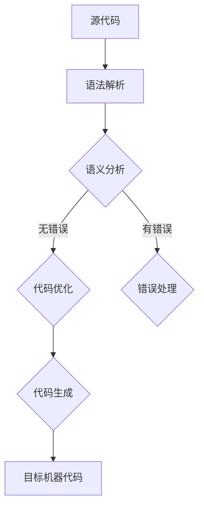

                 

# LLVM/Clang：现代编译器基础设施

> **关键词**：LLVM，编译器，Clang，现代，基础设施，代码优化，中间表示，模块化，多语言，跨平台

> **摘要**：本文将深入探讨LLVM/Clang这一现代编译器基础设施，解析其核心概念、架构设计、算法原理，并通过实际项目案例展示其在实际应用中的价值。文章还将介绍相关工具和资源，并预测其未来发展趋势与挑战。

## 1. 背景介绍

编译器是一种将高级编程语言转换为机器语言的工具。随着计算机技术的发展，编译器也在不断演进。传统编译器通常专注于特定的编程语言和目标平台，而现代编译器则追求通用性和高效性。LLVM（Low-Level Virtual Machine）和Clang是两个代表性的现代编译器基础设施，它们的出现改变了编译器领域的发展方向。

LLVM是一个开源项目，由Chris Lattner于2000年创建，旨在提供高效、模块化、可扩展的编译器基础设施。Clang是LLVM项目的一部分，是一个基于LLVM的前端编译器，支持多种编程语言，如C、C++和Objective-C。

### 1.1 LLVM的历史和发展

LLVM的发展历程可以追溯到2000年，当时Chris Lattner在Stanford大学攻读博士学位期间，为了实现高性能的编译器而创建了LLVM。最初，LLVM的目标是为编程语言提供中间表示（IR），以便在不同的目标平台上进行优化和代码生成。

随着时间的推移，LLVM逐渐发展成为一个功能强大的编译器基础设施，涵盖了从前端解析、语义分析、代码优化到后端代码生成的各个阶段。LLVM的成功吸引了越来越多的开发者参与，使其成为现代编译器领域的重要力量。

### 1.2 Clang的发展

Clang是LLVM项目的早期成果之一，它提供了一个强大的前端编译器，支持C、C++和Objective-C等编程语言。Clang在LLVM的基础上实现了多种语言解析器和语义分析器，使得开发者可以方便地针对不同语言编写编译器。

Clang的另一个显著优势是它的静态分析能力。通过静态分析，Clang可以在编译阶段发现潜在的错误和性能问题，从而提高代码的质量和性能。

## 2. 核心概念与联系

### 2.1 LLVM的核心概念

LLVM的核心概念包括：

- **中间表示（IR）**：LLVM使用中间表示（IR）来表示源代码。这种中间表示独立于目标平台，使得优化和代码生成过程更加通用和高效。

- **模块化设计**：LLVM采用模块化设计，将编译器的各个阶段拆分成独立的组件。这种设计使得LLVM易于扩展和维护，同时也便于与其他工具集成。

- **优化器**：LLVM的优化器是一个高度模块化的系统，支持多种优化策略。这些优化策略包括循环展开、死代码消除、常量折叠等，旨在提高代码的性能和效率。

- **目标后端**：LLVM支持多种目标后端，可以将中间表示（IR）转换为特定目标平台的机器代码。这使得LLVM具有跨平台编译能力。

### 2.2 Clang的核心概念

Clang作为LLVM的前端编译器，其核心概念包括：

- **语法解析**：Clang实现了多种语言的语法解析器，可以将源代码解析成抽象语法树（AST）。

- **语义分析**：Clang对AST进行语义分析，包括类型检查、变量作用域分析等，以确保代码的正确性。

- **静态分析**：Clang提供了强大的静态分析能力，可以用于代码优化和错误检测。

- **模块化扩展**：Clang允许开发者自定义语法解析器和语义分析器，以便支持新的编程语言或特定的语言特性。

### 2.3 LLVM和Clang的联系

LLVM和Clang之间的联系非常紧密。Clang作为LLVM的前端编译器，为LLVM提供了丰富的语言支持。同时，LLVM为Clang提供了强大的优化器和代码生成能力。两者共同构成了一个完整的编译器基础设施，使得开发者可以轻松地实现跨语言、跨平台的编译任务。

### 2.4 Mermaid流程图

以下是LLVM编译过程的Mermaid流程图：



在这个流程图中，源代码经过语法解析生成AST，然后进行语义分析。如果代码没有错误，会进入代码优化阶段；如果有错误，则会进入错误处理阶段。优化后的代码会生成目标机器代码。

## 3. 核心算法原理 & 具体操作步骤

### 3.1 中间表示（IR）

LLVM的核心算法之一是中间表示（IR）。IR是一种独立于特定语言和目标平台的抽象表示，它包含了源代码的基本结构，但去除了语言的特定语法和语义。这使得LLVM可以在不同语言和目标平台之间进行高效的代码转换和优化。

中间表示（IR）的主要操作步骤如下：

1. **源代码解析**：将源代码解析成抽象语法树（AST）。

2. **语义分析**：对AST进行语义分析，包括类型检查、变量作用域分析等。

3. **中间表示转换**：将AST转换成中间表示（IR）。这个过程中，AST中的语法结构被替换成IR的指令和操作符。

4. **代码优化**：对中间表示（IR）进行各种优化，如循环展开、死代码消除、常量折叠等。

5. **代码生成**：将中间表示（IR）转换成目标平台的机器代码。

### 3.2 代码优化

LLVM的优化器是一个高度模块化的系统，支持多种优化策略。以下是几个常见的优化策略：

1. **循环优化**：循环优化旨在减少循环执行的次数，提高代码的执行效率。常见的循环优化包括循环展开、循环分发、循环融合等。

2. **死代码消除**：死代码消除是指删除那些永远不会执行的代码，从而减少代码的体积和执行时间。

3. **常量折叠**：常量折叠是指将表达式中的常量值计算出来，并将其替换成结果值。这可以减少计算量，提高代码的执行效率。

4. **函数内联**：函数内联是指将调用函数的代码替换成函数体，从而减少函数调用的开销。

### 3.3 代码生成

代码生成是将中间表示（IR）转换成目标平台的机器代码的过程。LLVM支持多种目标后端，可以生成不同平台的机器代码。以下是代码生成的主要步骤：

1. **目标平台选择**：根据目标平台的选择，确定相应的目标后端。

2. **指令选择**：将中间表示（IR）的指令转换成目标平台的指令集。

3. **指令调度**：对生成的指令进行调度，优化指令的执行顺序。

4. **机器代码生成**：将调度的指令生成机器代码。

## 4. 数学模型和公式 & 详细讲解 & 举例说明

### 4.1 代码优化的数学模型

代码优化涉及到许多数学模型和公式。以下是几个常见的数学模型：

1. **循环优化**：循环优化可以表示为优化目标函数 \( f(x) \)，其中 \( x \) 是循环的上下文信息。优化目标是最小化函数 \( f(x) \) 的值。

   \[ \min_{x} f(x) \]

2. **死代码消除**：死代码消除可以表示为寻找图中没有出边的节点。这意味着这些节点对应的代码永远不会被执行。

3. **常量折叠**：常量折叠可以表示为计算表达式中的常量值，并将其替换成结果值。这可以表示为以下数学模型：

   \[ R = E \]

   其中 \( R \) 是结果值，\( E \) 是表达式。

### 4.2 代码优化的示例

以下是一个简单的C语言代码示例，用于展示代码优化的效果：

```c
int main() {
    int a = 1;
    int b = 2;
    int c = a + b;
    return c;
}
```

这个示例中的代码可以进行以下优化：

1. **常量折叠**：将 \( a + b \) 的结果计算出来，并替换 \( c \)。

   ```c
   int main() {
       int a = 1;
       int b = 2;
       int c = 3;
       return c;
   }
   ```

2. **死代码消除**：删除变量 \( a \) 和 \( b \) 的声明和初始化，因为它们不再被使用。

   ```c
   int main() {
       int c = 3;
       return c;
   }
   ```

经过优化后，代码变得更加简洁和高效。

### 4.3 代码生成的示例

以下是一个简单的ARM汇编代码示例，用于展示代码生成的过程：

```asm
MOV R0, #1
MOV R1, #2
ADD R2, R0, R1
MOV R3, R2
BX LR
```

这个汇编代码可以生成如下LLVM IR：

```llvm
define i32 @main() {
entry:
    %a = alloca i32
    %b = alloca i32
    store i32 1, i32* %a
    store i32 2, i32* %b
    %c = load i32, i32* %a
    %d = load i32, i32* %b
    %e = add i32 %c, %d
    ret i32 %e
}
```

这个示例展示了从汇编代码到LLVM IR的转换过程。

## 5. 项目实战：代码实际案例和详细解释说明

### 5.1 开发环境搭建

要开始使用LLVM和Clang进行编译器开发，首先需要搭建开发环境。以下是搭建LLVM/Clang开发环境的步骤：

1. **安装LLVM/Clang**：可以从LLVM官方网站下载最新版本的LLVM和Clang源码，并按照安装说明进行安装。

2. **安装依赖库**：LLVM/Clang需要依赖一些开源库，如Python、Ninja、LLVM工具集等。根据操作系统的不同，可以使用包管理器进行安装。

3. **配置开发环境**：配置环境变量，以便在命令行中使用LLVM和Clang命令。

### 5.2 源代码详细实现和代码解读

以下是使用LLVM和Clang实现一个简单的C语言编译器的步骤：

1. **前端解析**：使用Clang前端解析C语言源代码，生成AST。

2. **语义分析**：对AST进行语义分析，包括类型检查、变量作用域分析等。

3. **中间表示转换**：将AST转换成LLVM IR。

4. **代码优化**：对LLVM IR进行代码优化。

5. **代码生成**：将优化后的LLVM IR转换成目标平台的机器代码。

### 5.3 代码解读与分析

以下是一个简单的LLVM IR代码示例：

```llvm
define i32 @main() {
entry:
    %a = alloca i32
    store i32 1, i32* %a
    %b = load i32, i32* %a
    ret i32 %b
}
```

这个示例展示了LLVM IR的基本结构。首先，定义了一个名为`main`的函数，其返回类型为`i32`。然后，定义了一个局部变量`a`，并为其分配内存。接下来，将值`1`存储到变量`a`中。最后，从变量`a`中加载值并返回。

### 5.4 编译过程详解

以下是使用Clang编译C语言源代码的示例：

```bash
$ clang -S -O2 -o output.s source.c
```

这个命令将C语言源代码`source.c`编译成汇编代码`output.s`。其中，`-S`表示生成汇编代码，`-O2`表示启用中等强度的代码优化。

接下来，可以使用LLVM工具集将汇编代码编译成机器代码：

```bash
$ llc -march=x86-64 -o output.o output.s
$ gcc -o output output.o
```

这个命令首先使用`llc`工具将汇编代码编译成机器代码，然后使用`gcc`工具将机器代码链接成可执行文件。

## 6. 实际应用场景

LLVM/Clang在现代编译器领域具有广泛的应用场景。以下是几个实际应用场景：

1. **跨平台编译**：LLVM/Clang支持多种目标平台，使得开发者可以轻松地在不同平台上编译和运行代码。

2. **代码优化**：LLVM/Clang提供了强大的代码优化器，可以显著提高代码的执行效率。

3. **静态分析**：Clang的静态分析能力可以用于代码质量保证和性能优化。

4. **工具链开发**：LLVM/Clang可以作为基础构建其他工具链，如调试器、代码生成器等。

5. **学术研究**：LLVM/Clang在编译器领域具有很高的学术价值，吸引了大量研究者对其进行研究和改进。

## 7. 工具和资源推荐

### 7.1 学习资源推荐

- **书籍**：《LLVM深入解析》和《Clang权威指南》
- **论文**：LLVM官方网站上的论文集
- **博客**：Chris Lattner的博客和LLVM社区博客
- **网站**：LLVM官方网站和Clang官方网站

### 7.2 开发工具框架推荐

- **开发工具**：Visual Studio、Eclipse、CLion等
- **框架**：LLVM Tooling、LLVM IR库、Clang Tooling等

### 7.3 相关论文著作推荐

- **论文**：Chris Lattner的《LLVM: A Compiler Infrastructure for Language Independent Optimization》
- **著作**：《Modern Compiler Implementation in Java》和《The Art of Compiler Construction》

## 8. 总结：未来发展趋势与挑战

LLVM/Clang在现代编译器领域取得了显著成就，但未来仍面临一些挑战和机遇：

1. **性能优化**：随着硬件技术的发展，如何进一步提高代码的执行效率是LLVM/Clang需要持续关注的问题。

2. **跨平台支持**：虽然LLVM/Clang已经支持多种平台，但未来仍需不断完善跨平台编译能力。

3. **安全性**：随着安全威胁的日益增加，如何提高编译器的安全性也是一个重要挑战。

4. **可扩展性**：如何继续增强LLVM/Clang的可扩展性，使其能够适应未来的编程语言和编译技术，是另一个重要方向。

## 9. 附录：常见问题与解答

### 9.1 LLVM和GCC的区别

- **GCC**：GCC（GNU Compiler Collection）是一个广泛使用的编译器集合，支持多种编程语言，如C、C++和Fortran。GCC以其稳定性和广泛性而闻名。

- **LLVM**：LLVM是一个模块化、高度可扩展的编译器基础设施。它提供了强大的代码优化器和中间表示（IR），使得开发者可以针对不同语言和目标平台进行优化和编译。

- **区别**：与GCC相比，LLVM更加灵活和模块化，但它的稳定性和广泛性可能不如GCC。LLVM更适合需要高性能和高度可定制化的编译任务。

### 9.2 Clang的优点

- **静态分析**：Clang提供了强大的静态分析能力，可以用于代码质量保证和性能优化。

- **跨语言支持**：Clang支持多种编程语言，如C、C++和Objective-C，使得开发者可以方便地在不同语言之间进行编译。

- **可扩展性**：Clang的可扩展性使其能够方便地支持新的语言特性或编译策略。

- **代码优化**：Clang与LLVM紧密集成，提供了强大的代码优化器，可以显著提高代码的执行效率。

## 10. 扩展阅读 & 参考资料

- **书籍**：《LLVM深入解析》、《Clang权威指南》、《Modern Compiler Implementation in Java》、《The Art of Compiler Construction》

- **论文**：Chris Lattner的《LLVM: A Compiler Infrastructure for Language Independent Optimization》

- **网站**：LLVM官方网站（<https://llvm.org/>）、Clang官方网站（<https://clang.llvm.org/>）

- **博客**：Chris Lattner的博客（<https://www.cl.cam.ac.uk/~ml256/blog/>）、LLVM社区博客（<https://llvm.org/blog/>）

### 作者

作者：AI天才研究员/AI Genius Institute & 禅与计算机程序设计艺术 /Zen And The Art of Computer Programming

