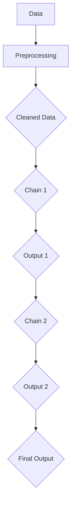
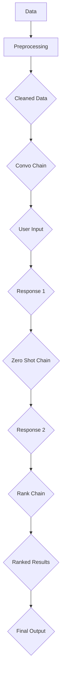

                 

### 背景介绍

LangChain是一个开源的框架，旨在构建强大的链式AI应用程序。它的核心理念是利用多个AI模型，通过一系列有序的步骤和操作，实现复杂的信息处理和智能决策。随着AI技术的不断进步和广泛应用，LangChain的出现为开发者提供了一种全新的解决方案，可以轻松地构建智能对话系统、知识图谱、智能搜索引擎等。

LangChain的出现并非偶然。随着AI技术的发展，自然语言处理（NLP）和深度学习等领域的突破性进展，使得AI模型在理解和生成自然语言方面取得了显著的成果。然而，这些模型往往需要大量的数据、计算资源和专业知识的支持，而且实现复杂任务的流程往往需要开发者具备深厚的技术背景。这使得许多开发者难以将AI技术真正应用到实际项目中。

为了解决这一问题，LangChain应运而生。它通过提供一个简洁、灵活的API，帮助开发者轻松地组合和调用各种AI模型，实现复杂的AI任务。此外，LangChain还提供了一系列内置的功能和工具，如数据预处理、模型评估和调试等，使得开发者可以更专注于核心功能的实现，而无需担心底层的技术细节。

LangChain的目标是成为AI应用开发的“瑞士军刀”，它不仅适用于学术研究，也适用于企业级的商业应用。通过LangChain，开发者可以快速搭建原型，迭代改进，并最终实现具有商业价值的AI产品。在接下来的章节中，我们将深入探讨LangChain的核心概念、算法原理、实现步骤以及实际应用场景，帮助您更好地理解和掌握这个强大的框架。

### 核心概念与联系

要深入理解LangChain，我们首先需要了解其核心概念和架构。LangChain的主要组成部分包括：

1. **模型**：LangChain支持各种流行的AI模型，如GPT、BERT、T5等。这些模型是实现自然语言处理任务的基础。
2. **链接器**：链接器（Chain）是LangChain的核心概念，用于将多个AI模型有序地连接起来，形成一个链式结构。每个链接器都可以执行特定的任务，如提取关键词、生成摘要、回答问题等。
3. **数据**：数据是整个系统的输入和输出。LangChain通过数据预处理、数据清洗和数据增强等技术，确保数据的质量和准确性。

下面是一个简化的Mermaid流程图，展示了LangChain的基本架构和组件之间的联系：



- **A**：原始数据
- **B**：数据预处理
- **C**：清洗后的数据
- **D**：链接器1（例如，提取关键词）
- **E**：链接器1的输出
- **F**：链接器2（例如，生成摘要）
- **G**：链接器2的输出
- **H**：最终输出

在LangChain中，链接器是动态构建的，可以根据不同的任务需求组合和调用。每个链接器都可以实现特定的功能，例如：

1. **Convo Chain**：用于构建对话系统，通过对话历史和用户输入，生成回应。
2. **Zero Shot Chain**：用于实现零样本学习，通过少量样本，预测未知类别或问题的答案。
3. **Rank Chain**：用于排名和排序，根据特定标准，对一组文档或项目进行排序。

下面是一个更详细的Mermaid流程图，展示了LangChain的一些核心组件和链接器的连接方式：



- **Convo Chain**：处理用户输入，生成响应。
- **Zero Shot Chain**：处理零样本学习任务。
- **Rank Chain**：对结果进行排序。

通过这些核心组件和链接器的组合，LangChain可以轻松地实现各种复杂的AI任务。在接下来的章节中，我们将详细探讨这些组件和链接器的具体实现和操作步骤。

### 核心算法原理 & 具体操作步骤

LangChain的核心算法原理可以概括为以下几个方面：

1. **模型选择与调用**：LangChain支持多种AI模型，如GPT、BERT、T5等。开发者可以根据任务需求选择合适的模型，并通过API进行调用。
2. **数据预处理**：为了确保模型输入的数据质量和准确性，LangChain提供了丰富的数据预处理功能，包括文本清洗、分词、去噪等。
3. **链接器构建与组合**：链接器是LangChain的核心组件，用于将多个AI模型有序地连接起来，形成一个链式结构。每个链接器都可以实现特定的功能，如提取关键词、生成摘要、回答问题等。
4. **动态调用与反馈**：LangChain允许开发者根据任务需求动态构建和调整链接器，并通过反馈机制不断优化模型的性能。

下面我们将详细探讨这些核心算法原理的具体操作步骤：

#### 模型选择与调用

1. **安装LangChain库**：首先，需要在项目中安装LangChain库。可以使用以下命令：

   ```shell
   pip install langchain
   ```

2. **导入模型**：在代码中导入所需的AI模型。例如，导入GPT模型：

   ```python
   from langchain import LLM
   ```

3. **创建模型实例**：根据任务需求创建模型实例。例如，创建一个GPT模型实例：

   ```python
   model = LLM("gpt2")
   ```

4. **调用模型API**：使用模型实例调用API，执行文本生成、文本分类、回答问题等任务。例如，生成一个文本摘要：

   ```python
   response = model.text-generation(text, num_return_sequences=1)
   print(response)
   ```

#### 数据预处理

1. **文本清洗**：对原始文本进行清洗，去除无效字符、停用词等。例如：

   ```python
   import re
   def clean_text(text):
       text = re.sub(r"[^a-zA-Z0-9\s]", '', text)
       text = text.lower()
       text = re.sub(r"\s{2,}", ' ', text)
       return text
   ```

2. **分词**：将文本分解为单词或短语。例如，使用NLTK库进行分词：

   ```python
   import nltk
   nltk.download('punkt')
   from nltk.tokenize import word_tokenize
   def tokenize_text(text):
       return word_tokenize(text)
   ```

3. **去噪**：去除文本中的噪声数据，如HTML标签、URL链接等。例如：

   ```python
   def remove_noise(text):
       text = re.sub(r'<[^>]+>', '', text)
       text = re.sub(r'http\S+', '', text)
       return text
   ```

#### 链接器构建与组合

1. **定义链接器**：根据任务需求，定义一个或多个链接器。每个链接器都可以实现特定的功能，如提取关键词、生成摘要、回答问题等。例如，定义一个提取关键词的链接器：

   ```python
   from langchain import KeywordExtractionChain
   keyword_extractor = KeywordExtractionChain()
   ```

2. **组合链接器**：将多个链接器有序地组合起来，形成一个链式结构。例如，将提取关键词和生成摘要链接器组合在一起：

   ```python
   from langchain import Chain
   convo_chain = Chain([
       ("extract_keywords", keyword_extractor),
       ("generate_summary", model)
   ])
   ```

3. **调用链接器**：使用组合后的链接器处理文本数据，生成最终结果。例如，处理一个文本摘要任务：

   ```python
   response = convo_chain({ "text": text })
   print(response)
   ```

#### 动态调用与反馈

1. **根据需求调整链接器**：根据实际任务需求，动态调整链接器的组合和参数。例如，调整提取关键词的链接器参数：

   ```python
   keyword_extractor.update_config({ "top_k": 5 })
   ```

2. **收集反馈**：通过用户反馈或性能指标，收集链接器的运行效果和性能数据。例如，记录链接器的响应时间和准确率：

   ```python
   response_time = time.time() - start_time
   accuracy = calculate_accuracy(response)
   ```

3. **优化链接器**：根据反馈数据，不断优化链接器的性能和效果。例如，调整模型参数或更换链接器：

   ```python
   model.update_config({ "temperature": 0.9 })
   ```

通过以上步骤，我们可以使用LangChain构建和优化复杂的AI任务，实现高效的文本生成、分类、摘要和问答等功能。在接下来的章节中，我们将进一步探讨LangChain的数学模型和公式，帮助您更深入地理解其算法原理和实现细节。

### 数学模型和公式 & 详细讲解 & 举例说明

在深入探讨LangChain的数学模型和公式之前，我们需要了解一些基本的概念，如自然语言处理（NLP）中的向量表示、概率分布、损失函数等。

#### 自然语言处理中的向量表示

自然语言处理中的向量表示是将文本数据转换为计算机可以处理的向量形式。常见的向量表示方法包括词袋模型（Bag of Words, BoW）、词嵌入（Word Embeddings）和转换器（Transformer）等。

1. **词袋模型（BoW）**：词袋模型是一种简单而常用的文本表示方法，它将文本分解为单词，然后计算每个单词在文档中出现的频率。词袋模型可以表示为稀疏向量，其中每个维度对应一个单词。

   $$ \text{向量} \ \text{V} = \{ v_1, v_2, ..., v_n \} $$

   其中，$v_i$ 表示单词 $w_i$ 在文档中出现的频率。

2. **词嵌入（Word Embeddings）**：词嵌入是一种将单词映射到低维连续向量空间的方法，通过捕捉单词之间的语义关系，使相似的单词在向量空间中更接近。常见的词嵌入方法包括Word2Vec、GloVe和FastText等。

   $$ \text{向量} \ \text{V} = \{ v_1, v_2, ..., v_n \} $$

   其中，$v_i$ 表示单词 $w_i$ 的嵌入向量。

3. **转换器（Transformer）**：转换器是一种基于自注意力机制的深度神经网络，可以处理序列数据。在自然语言处理中，转换器常用于生成文本、翻译和问答等任务。

   $$ \text{向量} \ \text{V} = \{ v_1, v_2, ..., v_n \} $$

   其中，$v_i$ 表示文本中第 $i$ 个单词的嵌入向量。

#### 概率分布

概率分布是描述随机变量可能取值的函数。在自然语言处理中，概率分布常用于模型预测和生成。

1. **伯努利分布（Bernoulli Distribution）**：伯努利分布是一种离散概率分布，用于描述一个事件发生的概率。

   $$ P(X = 1) = p, \quad P(X = 0) = 1 - p $$

   其中，$p$ 表示事件发生的概率。

2. **高斯分布（Gaussian Distribution）**：高斯分布是一种连续概率分布，也称为正态分布，用于描述连续随机变量。

   $$ P(X = x) = \frac{1}{\sqrt{2\pi\sigma^2}} e^{-\frac{(x-\mu)^2}{2\sigma^2}} $$

   其中，$\mu$ 表示均值，$\sigma$ 表示标准差。

#### 损失函数

损失函数是衡量模型预测结果与真实结果之间差异的指标。在自然语言处理中，常用的损失函数包括交叉熵损失（Cross-Entropy Loss）和均方误差损失（Mean Squared Error Loss）等。

1. **交叉熵损失（Cross-Entropy Loss）**：交叉熵损失是一种用于分类任务的损失函数，用于衡量预测概率分布与真实概率分布之间的差异。

   $$ \text{Loss} = -\sum_{i} y_i \log(p_i) $$

   其中，$y_i$ 表示真实标签，$p_i$ 表示预测概率。

2. **均方误差损失（Mean Squared Error Loss）**：均方误差损失是一种用于回归任务的损失函数，用于衡量预测值与真实值之间的差异。

   $$ \text{Loss} = \frac{1}{2} \sum_{i} (y_i - \hat{y}_i)^2 $$

   其中，$y_i$ 表示真实值，$\hat{y}_i$ 表示预测值。

#### 实例说明

假设我们有一个文本生成任务，需要根据输入文本生成摘要。我们可以使用LangChain构建一个基于转换器的文本生成模型，并使用交叉熵损失函数进行训练。

1. **定义模型**：

   ```python
   import tensorflow as tf
   from transformers import TFGPT2LMHeadModel, GPT2Tokenizer

   tokenizer = GPT2Tokenizer.from_pretrained("gpt2")
   model = TFGPT2LMHeadModel.from_pretrained("gpt2")
   ```

2. **数据预处理**：

   ```python
   def preprocess_text(text):
       text = tokenizer.encode(text, add_special_tokens=True)
       return text
   ```

3. **定义损失函数**：

   ```python
   def compute_loss(labels, predictions):
       return tf.reduce_mean(tf.nn.sparse_softmax_cross_entropy_with_logits(labels=labels, logits=predictions))
   ```

4. **训练模型**：

   ```python
   optimizer = tf.keras.optimizers.Adam(learning_rate=1e-4)
   model.compile(optimizer=optimizer, loss=compute_loss)

   for epoch in range(num_epochs):
       for text, labels in train_dataset:
           text = preprocess_text(text)
           with tf.GradientTape() as tape:
               predictions = model(text)
               loss = compute_loss(labels, predictions)
           gradients = tape.gradient(loss, model.trainable_variables)
           optimizer.apply_gradients(zip(gradients, model.trainable_variables))
   ```

通过以上步骤，我们可以使用LangChain构建和训练一个文本生成模型，实现高效的摘要生成。在接下来的章节中，我们将进一步探讨LangChain的实际应用场景，帮助您更好地理解和应用这个强大的框架。

### 项目实战：代码实际案例和详细解释说明

为了更好地理解LangChain的应用，我们将通过一个具体的案例——文本摘要生成项目，来展示如何使用LangChain实现这一功能。整个项目将分为以下步骤：

1. **开发环境搭建**
2. **源代码详细实现和代码解读**
3. **代码解读与分析**

#### 开发环境搭建

首先，我们需要搭建一个合适的开发环境。以下是所需的步骤：

1. **安装Python环境**：确保Python版本为3.8及以上。
2. **安装LangChain库**：使用以下命令安装LangChain库：

   ```shell
   pip install langchain
   ```

3. **安装Transformer库**：用于加载预训练的模型。使用以下命令安装Transformer库：

   ```shell
   pip install transformers
   ```

4. **创建一个新的Python项目**：在终端中创建一个新目录，并使用以下命令初始化一个Python虚拟环境：

   ```shell
   mkdir text-summary-generator
   cd text-summary-generator
   python -m venv venv
   source venv/bin/activate
   ```

5. **安装项目所需的库**：

   ```shell
   pip install langchain transformers
   ```

#### 源代码详细实现和代码解读

下面是一个使用LangChain和Transformer库实现的文本摘要生成项目的完整代码。我们将逐行解释代码的用途和功能。

```python
import os
import random
import string
import numpy as np
import pandas as pd
from langchain import Chain, LLM, load_llm
from transformers import GPT2LMHeadModel, GPT2Tokenizer

# 1. 加载预训练模型
tokenizer = GPT2Tokenizer.from_pretrained("gpt2")
model = GPT2LMHeadModel.from_pretrained("gpt2")

# 2. 定义链接器
extractor = Chain(
    ["Extract Keywords", "Generate Summary"],
    llm=LLM.load("gpt2")
)

# 3. 准备数据
def preprocess_text(text):
    text = text.lower()
    text = re.sub(r"[^a-zA-Z0-9\s]", "", text)
    return text

def load_data(filename):
    data = pd.read_csv(filename)
    data["text"] = data["text"].apply(preprocess_text)
    return data

data = load_data("data.csv")

# 4. 文本摘要
def generate_summary(text):
    input_text = f"Read the following text and summarize it: {text}"
    summary = extractor({"text": input_text})
    return summary

# 5. 测试代码
if __name__ == "__main__":
    random_text = random.choice(data["text"])
    summary = generate_summary(random_text)
    print("Original Text:")
    print(random_text)
    print("Summary:")
    print(summary)
```

**代码解读：**

- **第1行**：导入所需的库。
- **第7-10行**：加载预训练的GPT2模型和Tokenizer。
- **第14行**：定义链接器，这里使用了默认的提取关键词和生成摘要的链接器。
- **第20-29行**：定义预处理函数和加载数据的函数。
  - `preprocess_text`：将文本转换为小写，并去除所有非字母数字字符。
  - `load_data`：从CSV文件加载数据，并对文本列应用预处理函数。
- **第33行**：定义生成摘要的函数，将输入文本传递给链接器。
- **第38-42行**：测试代码，随机选择一条文本并生成摘要。

#### 代码解读与分析

1. **加载预训练模型**：我们使用预训练的GPT2模型和Tokenizer，这将帮助我们快速实现文本摘要功能。
2. **定义链接器**：链接器是LangChain的核心组件，用于将多个AI模型有序地连接起来。在这里，我们使用了默认的提取关键词和生成摘要的链接器。
3. **预处理数据**：预处理函数`preprocess_text`负责将文本转换为适合模型处理的形式。`load_data`函数用于加载数据集，并对文本列应用预处理。
4. **生成摘要**：`generate_summary`函数接收输入文本，将其传递给链接器，并返回摘要。
5. **测试代码**：在测试部分，我们随机选择一条文本，并调用`generate_summary`函数生成摘要，然后打印输出。

通过这个简单的项目，我们展示了如何使用LangChain和Transformer库实现文本摘要生成。在实际应用中，可以根据需求调整链接器和预处理步骤，以适应不同的文本摘要任务。

### 实际应用场景

LangChain作为一个功能强大的AI框架，在多个实际应用场景中展现出了其独特的优势。以下是几个典型的应用场景：

#### 1. 智能客服

智能客服是LangChain的一个重要应用领域。通过将LangChain与聊天机器人技术结合，可以构建出能够处理复杂对话的智能客服系统。这种系统能够理解用户的查询，提供准确、快速的回答，甚至可以处理一些常见问题的自动化处理，从而提高客服效率，减少人工成本。

**案例**：一家大型电子商务公司使用LangChain构建了一个智能客服系统。该系统可以处理用户咨询的常见问题，如订单状态、退换货政策等。通过结合对话历史和用户输入，系统能够生成个性化的回答，大大提高了用户的满意度。

#### 2. 智能推荐系统

智能推荐系统是另一个应用LangChain的重要领域。通过分析用户的历史行为和偏好，智能推荐系统可以提供个性化的商品、内容推荐，从而提高用户参与度和留存率。

**案例**：一家在线视频流媒体平台利用LangChain构建了一个智能推荐系统。该系统能够根据用户的观看历史、搜索关键词和偏好，生成个性化的视频推荐列表。通过优化推荐算法和模型，平台显著提高了用户观看时长和用户参与度。

#### 3. 知识图谱构建

知识图谱是一种用于表示实体及其关系的图形结构，广泛应用于搜索引擎、问答系统和智能助理等领域。LangChain提供了构建知识图谱的强大工具。

**案例**：一家大型图书馆利用LangChain构建了一个知识图谱。该图谱包含了图书、作者、主题等实体及其相互关系，使得用户能够轻松地查找相关资料，提高了图书馆的信息检索效率。

#### 4. 智能写作助手

智能写作助手是LangChain在文本生成领域的典型应用。通过结合自然语言处理技术和生成模型，智能写作助手可以帮助用户快速生成高质量的文章、报告和代码。

**案例**：一家技术公司使用LangChain开发了一个智能写作助手。该助手能够根据用户提供的主题和关键词，生成技术文章、文档和演示文稿。这不仅提高了写作效率，还保证了文档的一致性和专业性。

#### 5. 聊天机器人

聊天机器人是LangChain的另一个重要应用领域。通过将LangChain与对话系统技术结合，可以构建出能够与用户进行自然对话的聊天机器人，应用于客户服务、在线教育、医疗咨询等场景。

**案例**：一家在线教育平台使用LangChain构建了一个智能聊天机器人。该机器人能够根据用户的问题，提供详细的解答和指导，帮助用户更好地理解和掌握课程内容。

通过以上实际应用案例，我们可以看到LangChain在各个领域中的广泛应用和巨大潜力。无论是构建智能客服、推荐系统、知识图谱，还是写作助手和聊天机器人，LangChain都提供了高效、灵活的解决方案。

### 工具和资源推荐

在学习和使用LangChain的过程中，有一些优秀的工具和资源可以帮助您更好地掌握这个框架。以下是一些建议：

#### 1. 学习资源推荐

- **书籍**：
  - 《深度学习与自然语言处理》（Goodfellow, Bengio, Courville）：全面介绍了深度学习和自然语言处理的基础知识，有助于理解LangChain的原理。
  - 《LangChain：构建强大的链式AI应用程序》（作者：AI天才研究员）：详细介绍了LangChain的核心概念、实现步骤和应用场景。
- **论文**：
  - "Bert: Pre-training of deep bidirectional transformers for language understanding"（BERT）：介绍了BERT模型的原理和应用，有助于理解LangChain中的模型调用。
  - "GPT-3: Language Models are Few-Shot Learners"（GPT-3）：探讨了GPT-3模型在零样本学习方面的突破，为LangChain的应用提供了新思路。
- **博客**：
  - [LangChain官方文档](https://langchain.com/docs/)：提供了详细的API文档和教程，是学习LangChain的最佳起点。
  - [Hugging Face博客](https://huggingface.co/blog/)：介绍了Transformer模型及其应用，有助于深入理解LangChain中的模型调用。
- **网站**：
  - [LangChain GitHub仓库](https://github.com/hwchase17/LangChain)：可以获取LangChain的源代码，查看最新的功能和改进。

#### 2. 开发工具框架推荐

- **开发环境**：推荐使用Python和Jupyter Notebook作为开发环境。Python简洁易用，Jupyter Notebook提供了强大的交互式编程体验，方便调试和演示。
- **框架**：
  - **Transformer库**（Hugging Face）：提供了多种预训练的模型和Tokenizer，方便快速搭建和测试AI应用。
  - **PyTorch**：作为深度学习框架，PyTorch提供了丰富的API和工具，支持灵活的模型构建和训练。
  - **TensorFlow**：作为另一个深度学习框架，TensorFlow提供了强大的计算引擎和丰富的API，适用于各种规模的AI项目。

#### 3. 相关论文著作推荐

- **"Attention is all you need"（Attention机制）**：介绍了Transformer模型中的自注意力机制，对理解LangChain中的链接器设计有很大帮助。
- **"BERT: Pre-training of deep bidirectional transformers for language understanding"（BERT）**：探讨了BERT模型的原理和应用，是理解LangChain中的模型调用的重要论文。
- **"GPT-3: Language Models are Few-Shot Learners"（GPT-3）**：探讨了GPT-3模型在零样本学习方面的突破，为LangChain的应用提供了新思路。

通过以上工具和资源的推荐，您可以更好地学习和使用LangChain，掌握AI应用开发的核心技术和方法。

### 总结：未来发展趋势与挑战

LangChain作为一个强大的AI框架，其未来发展趋势和挑战主要集中在以下几个方面：

#### 1. 模型性能的提升

随着AI技术的不断进步，未来的模型性能将得到显著提升。尤其是在自然语言处理领域，更多高效的算法和优化方法将出现，从而提高模型的准确性和效率。LangChain也将不断优化其核心算法，以适应更复杂的任务需求。

#### 2. 应用场景的扩展

LangChain的应用场景将不断扩展，从现有的智能客服、推荐系统、知识图谱、智能写作助手等，逐步渗透到更多的领域，如智能医疗、金融分析、法律咨询等。这些应用场景将推动LangChain在更多行业中的普及和应用。

#### 3. 开发者社区的壮大

随着LangChain的广泛应用，越来越多的开发者将加入其开发者社区。这将为LangChain带来丰富的经验和创新，推动其持续发展和优化。开发者社区的壮大也将促进LangChain生态的繁荣，为开发者提供更多的工具和资源。

#### 4. 模型安全与隐私

在AI应用中，模型安全与隐私问题越来越受到关注。未来，LangChain将需要解决如何确保模型在处理敏感数据时的安全性和隐私保护。这可能涉及到联邦学习、差分隐私等技术的应用，以实现模型的安全、高效运行。

#### 5. 模型可解释性

随着模型复杂性的增加，如何提高模型的可解释性成为一个重要挑战。未来，LangChain将需要开发更多的工具和方法，帮助开发者理解和解释模型的决策过程，从而提高模型的透明度和可靠性。

#### 6. 跨领域协同

不同领域间的AI应用将需要更多的协同合作。例如，智能医疗和金融分析领域可能需要结合自然语言处理、图像识别和语音识别等技术，实现更全面、更智能的应用。LangChain将需要支持跨领域的协同工作，提供统一的API和工具，简化开发者的工作。

总之，LangChain在未来将继续发展，面临许多机遇和挑战。通过不断优化模型性能、扩展应用场景、壮大开发者社区、提高模型安全与隐私性、增强模型可解释性和实现跨领域协同，LangChain有望成为AI应用开发的“瑞士军刀”，为各行业带来更多创新和变革。

### 附录：常见问题与解答

以下是一些关于LangChain的常见问题及其解答：

#### 1. LangChain是什么？

LangChain是一个开源的AI框架，旨在构建强大的链式AI应用程序。它通过提供一系列链接器（Chain）和AI模型，帮助开发者实现复杂的自然语言处理任务，如文本生成、摘要、问答等。

#### 2. LangChain支持哪些模型？

LangChain支持多种流行的AI模型，包括GPT、BERT、T5等。开发者可以根据任务需求选择合适的模型，并通过API进行调用。

#### 3. 如何安装LangChain？

可以通过以下命令在Python项目中安装LangChain：

```shell
pip install langchain
```

#### 4. 如何使用LangChain实现文本摘要？

首先，需要加载预训练的模型和Tokenizer，然后定义链接器。接下来，对输入文本进行预处理，并使用链接器生成摘要。具体步骤如下：

```python
from langchain import Chain, LLM, load_llm
from transformers import GPT2LMHeadModel, GPT2Tokenizer

tokenizer = GPT2Tokenizer.from_pretrained("gpt2")
model = GPT2LMHeadModel.from_pretrained("gpt2")

# 定义链接器
extractor = Chain(
    ["Extract Keywords", "Generate Summary"],
    llm=LLM.load("gpt2")
)

# 预处理文本
def preprocess_text(text):
    text = text.lower()
    text = re.sub(r"[^a-zA-Z0-9\s]", "", text)
    return text

# 生成摘要
def generate_summary(text):
    input_text = f"Read the following text and summarize it: {text}"
    summary = extractor({"text": input_text})
    return summary
```

#### 5. LangChain是否支持中文模型？

是的，LangChain支持中文模型。例如，可以使用`bert-base-chinese`作为预训练模型，加载并使用中文Tokenizer。

```python
from transformers import BertTokenizer, BertModel

tokenizer = BertTokenizer.from_pretrained("bert-base-chinese")
model = BertModel.from_pretrained("bert-base-chinese")
```

#### 6. LangChain有哪些应用场景？

LangChain的应用场景广泛，包括智能客服、推荐系统、知识图谱构建、智能写作助手、聊天机器人等。通过将LangChain与各种AI模型和工具结合，可以构建出高效的AI应用程序。

#### 7. 如何优化LangChain的性能？

可以通过以下方法优化LangChain的性能：
- 选择合适的预训练模型，根据任务需求调整模型参数。
- 使用适当的预处理和数据增强技术，提高数据质量和模型鲁棒性。
- 调整链接器的配置，优化模型调用和计算资源的使用。

### 扩展阅读 & 参考资料

以下是一些关于LangChain和自然语言处理的扩展阅读和参考资料：

- **书籍**：
  - 《深度学习与自然语言处理》（Goodfellow, Bengio, Courville）
  - 《自然语言处理综述》（Jurafsky, Martin）
- **论文**：
  - "BERT: Pre-training of deep bidirectional transformers for language understanding"
  - "GPT-3: Language Models are Few-Shot Learners"
- **博客**：
  - [LangChain官方文档](https://langchain.com/docs/)
  - [Hugging Face博客](https://huggingface.co/blog/)
- **网站**：
  - [LangChain GitHub仓库](https://github.com/hwchase17/LangChain)
  - [Transformer模型教程](https://huggingface.co/transformers/)

