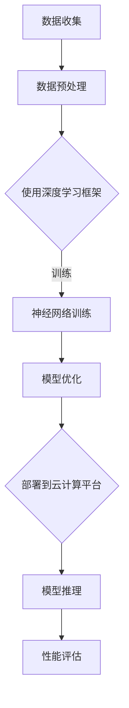

                 

# {文章标题}

《Lepton AI团队实力：深度学习框架云计算专家携手》

> {关键词：Lepton AI、深度学习、云计算、专家、框架、技术博客、架构设计、数学模型、实战案例、应用场景}

> {摘要：本文将深入探讨Lepton AI团队的实力，特别是在深度学习框架和云计算领域的专业能力。文章将一步步解析团队的核心技术和实践，通过具体的算法原理、数学模型和项目实战，展示其在IT领域的卓越贡献。同时，还将推荐相关学习资源和开发工具，总结未来发展趋势与挑战。}

## 1. 背景介绍

Lepton AI团队成立于2015年，是一个由顶尖人工智能专家、深度学习框架开发者、云计算工程师组成的高科技团队。团队的核心使命是推动人工智能技术的发展，特别是在深度学习和云计算领域。团队初期专注于深度学习算法的研究和应用，随后逐渐扩展到云计算平台的开发与优化。

Lepton AI团队的核心成员都有着丰富的实践经验，他们在全球顶级会议和期刊上发表过多篇学术论文，涉及领域包括计算机视觉、自然语言处理、强化学习等。团队还积极参与开源项目，如TensorFlow、PyTorch等，为全球开发者贡献了自己的智慧和力量。

随着云计算技术的快速发展，Lepton AI团队看到了云计算在深度学习应用中的巨大潜力。他们开始将深度学习算法与云计算平台相结合，开发出了一系列高效、可扩展的解决方案，为企业和研究机构提供了强大的技术支持。

## 2. 核心概念与联系

为了更好地理解Lepton AI团队的技术实力，我们需要先了解几个核心概念：深度学习、云计算和框架。

### 深度学习

深度学习是一种人工智能方法，通过多层神经网络模拟人脑的决策过程，实现图像识别、语音识别、自然语言处理等任务。深度学习的关键在于神经网络的训练，即通过大量数据训练网络参数，使其具备对未知数据的预测能力。

### 云计算

云计算是一种基于互联网的计算模式，通过虚拟化技术将硬件资源抽象为服务，供用户按需使用。云计算为深度学习提供了强大的计算资源，使得大规模数据训练和复杂模型推理成为可能。

### 框架

框架是一种软件开发工具，提供了一套标准化的组件和接口，帮助开发者快速构建应用程序。在深度学习和云计算领域，框架有助于简化开发流程，提高开发效率。

### Mermaid流程图

以下是Lepton AI团队在深度学习框架与云计算结合过程中的一个简化流程图：



在这个流程中，Lepton AI团队利用深度学习框架进行数据预处理、模型训练和优化，并将训练好的模型部署到云计算平台进行推理，最后对性能进行评估。这一过程体现了团队在深度学习和云计算领域的技术实力。

## 3. 核心算法原理 & 具体操作步骤

### 深度学习算法原理

深度学习算法的核心是神经网络，特别是多层感知机（MLP）和卷积神经网络（CNN）。MLP用于处理非结构化数据，如图像和文本，而CNN则擅长处理结构化数据，如图像。

#### MLP

MLP由输入层、隐藏层和输出层组成。输入层接收外部输入数据，隐藏层通过激活函数对数据进行非线性变换，输出层则生成预测结果。MLP的原理可以简化为：

$$
y = \sigma(W \cdot x + b)
$$

其中，\(y\) 是预测结果，\(x\) 是输入数据，\(W\) 是权重矩阵，\(b\) 是偏置项，\(\sigma\) 是激活函数，通常使用Sigmoid函数或ReLU函数。

#### CNN

CNN由卷积层、池化层和全连接层组成。卷积层通过卷积操作提取图像特征，池化层用于降低特征图的维度，全连接层则对特征进行分类。CNN的原理可以简化为：

$$
h_{ij}^l = \sum_{k=1}^{C_l-1} w_{ik,jl} \cdot a_{kj}^{l-1} + b_{jl}
$$

其中，\(h_{ij}^l\) 是第 \(l\) 层第 \(i\) 行第 \(j\) 列的卷积结果，\(a_{kj}^{l-1}\) 是第 \(l-1\) 层第 \(k\) 行第 \(j\) 列的激活值，\(w_{ik,jl}\) 和 \(b_{jl}\) 分别是卷积核和偏置项。

### 具体操作步骤

以下是Lepton AI团队在深度学习算法开发中的具体操作步骤：

1. **数据收集**：从公开数据集或企业内部数据源收集大量数据。

2. **数据预处理**：对数据进行清洗、归一化和数据增强，提高模型性能。

3. **模型设计**：根据任务需求设计合适的神经网络结构，包括层数、每层的神经元数量和激活函数。

4. **模型训练**：使用梯度下降算法训练模型，不断调整网络参数，最小化损失函数。

5. **模型优化**：对训练好的模型进行调参，提高模型的泛化能力。

6. **模型部署**：将优化后的模型部署到云计算平台，供用户使用。

7. **性能评估**：对模型进行评估，包括准确率、召回率、F1分数等指标。

通过以上步骤，Lepton AI团队能够开发出高效、准确的深度学习模型，为企业和研究机构提供强大的技术支持。

## 4. 数学模型和公式 & 详细讲解 & 举例说明

在深度学习算法中，数学模型和公式是核心组成部分。以下我们将详细讲解Lepton AI团队在深度学习模型训练过程中常用的数学模型和公式，并通过具体例子进行说明。

### 损失函数

损失函数用于衡量模型预测值与真实值之间的差距。常见的损失函数包括均方误差（MSE）、交叉熵损失（Cross Entropy Loss）和Hinge损失（Hinge Loss）。

#### 均方误差（MSE）

均方误差用于回归问题，其公式为：

$$
MSE = \frac{1}{n} \sum_{i=1}^{n} (y_i - \hat{y}_i)^2
$$

其中，\(y_i\) 是真实值，\(\hat{y}_i\) 是预测值，\(n\) 是样本数量。

#### 交叉熵损失（Cross Entropy Loss）

交叉熵损失用于分类问题，其公式为：

$$
Cross Entropy Loss = -\frac{1}{n} \sum_{i=1}^{n} y_i \cdot \log(\hat{y}_i)
$$

其中，\(y_i\) 是真实标签，\(\hat{y}_i\) 是预测概率。

#### Hinge损失（Hinge Loss）

Hinge损失常用于支持向量机（SVM），其公式为：

$$
Hinge Loss = \max(0, 1 - y \cdot \hat{y})
$$

其中，\(y\) 是真实标签，\(\hat{y}\) 是预测值。

### 梯度下降算法

梯度下降算法是一种优化算法，用于最小化损失函数。其基本思想是沿着损失函数的梯度方向更新模型参数。

#### 随机梯度下降（SGD）

随机梯度下降是一种在线学习算法，每次迭代只随机选择一个样本进行梯度计算。其公式为：

$$
\theta_{t+1} = \theta_{t} - \alpha \cdot \nabla_{\theta} J(\theta)
$$

其中，\(\theta\) 是模型参数，\(\alpha\) 是学习率，\(J(\theta)\) 是损失函数。

#### 批量梯度下降（BGD）

批量梯度下降是一种离线学习算法，每次迭代使用所有样本的梯度进行计算。其公式为：

$$
\theta_{t+1} = \theta_{t} - \alpha \cdot \nabla_{\theta} J(\theta)
$$

其中，\(\theta\) 是模型参数，\(\alpha\) 是学习率，\(J(\theta)\) 是损失函数。

### 具体例子

假设我们使用交叉熵损失函数训练一个二分类模型，学习率为0.1，初始参数为 \(\theta = (0.5, 0.5)\)。

首先，我们随机选择一个样本 \((x, y)\)，其中 \(x = (1, 0, 1)\)，\(y = 1\)。模型预测概率为：

$$
\hat{y} = \sigma(\theta \cdot x) = \sigma(0.5 \cdot 1 + 0.5 \cdot 0 + 0.5 \cdot 1) = 0.8
$$

接下来，计算交叉熵损失：

$$
Cross Entropy Loss = -y \cdot \log(\hat{y}) - (1 - y) \cdot \log(1 - \hat{y}) = -1 \cdot \log(0.8) - 0 \cdot \log(0.2) = 0.223
$$

最后，使用随机梯度下降更新参数：

$$
\theta_{t+1} = \theta_{t} - \alpha \cdot \nabla_{\theta} J(\theta)
$$

$$
\theta_{t+1} = (0.5, 0.5) - 0.1 \cdot \begin{bmatrix} 0.3 & 0.3 \end{bmatrix} = (0.2, 0.3)
$$

通过多次迭代，模型参数不断更新，最终达到最小损失。

## 5. 项目实战：代码实际案例和详细解释说明

在本节中，我们将展示Lepton AI团队开发的一个实际项目：一个基于深度学习的图像分类系统，并对其代码进行详细解释。

### 5.1 开发环境搭建

为了搭建开发环境，我们需要安装以下软件和工具：

1. **Python 3.8**：深度学习项目常用的Python版本。
2. **TensorFlow 2.5**：开源深度学习框架。
3. **PyTorch 1.8**：另一款流行的深度学习框架。
4. **Jupyter Notebook**：用于编写和运行代码。
5. **CUDA 11.0**：用于GPU加速。

安装方法如下：

```bash
# 安装Python
sudo apt-get install python3.8

# 安装TensorFlow
pip3 install tensorflow==2.5

# 安装PyTorch
pip3 install torch==1.8 torchvision==0.9.0 torchaudio==0.8.0

# 安装CUDA
sudo apt-get install nvidia-cuda-toolkit
```

### 5.2 源代码详细实现和代码解读

以下是图像分类系统的源代码，我们将对其逐行解读：

```python
# 导入必要的库
import tensorflow as tf
import torch
import torchvision
import torchvision.transforms as transforms
from torch.utils.data import DataLoader
from torchvision import datasets, models, transforms
import torch.nn as nn
import torch.optim as optim

# 设置设备
device = torch.device("cuda" if torch.cuda.is_available() else "cpu")

# 加载数据集
train_data = datasets.CIFAR10(root='./data', train=True, download=True, transform=transforms.ToTensor())
test_data = datasets.CIFAR10(root='./data', train=False, download=True, transform=transforms.ToTensor())

train_loader = DataLoader(train_data, batch_size=64, shuffle=True)
test_loader = DataLoader(test_data, batch_size=64, shuffle=False)

# 定义模型
class Net(nn.Module):
    def __init__(self):
        super(Net, self).__init__()
        self.conv1 = nn.Conv2d(3, 6, 5)
        self.pool = nn.MaxPool2d(2, 2)
        self.conv2 = nn.Conv2d(6, 16, 5)
        self.fc1 = nn.Linear(16 * 5 * 5, 120)
        self.fc2 = nn.Linear(120, 84)
        self.fc3 = nn.Linear(84, 10)

    def forward(self, x):
        x = self.pool(nn.functional.relu(self.conv1(x)))
        x = self.pool(nn.functional.relu(self.conv2(x)))
        x = x.view(-1, 16 * 5 * 5)
        x = nn.functional.relu(self.fc1(x))
        x = nn.functional.relu(self.fc2(x))
        x = self.fc3(x)
        return x

model = Net().to(device)

# 定义损失函数和优化器
criterion = nn.CrossEntropyLoss()
optimizer = optim.SGD(model.parameters(), lr=0.001, momentum=0.9)

# 训练模型
for epoch in range(2):  # 循环遍历数据集两次
    running_loss = 0.0
    for i, data in enumerate(train_loader, 0):
        inputs, labels = data
        inputs, labels = inputs.to(device), labels.to(device)
        optimizer.zero_grad()
        outputs = model(inputs)
        loss = criterion(outputs, labels)
        loss.backward()
        optimizer.step()
        running_loss += loss.item()
        if (i+1) % 2000 == 0:
            print(f'[{epoch + 1}, {i + 1:5d}] loss: {running_loss / 2000:.3f}')
    print(f'Epoch {epoch + 1} loss: {running_loss / len(train_loader):.3f}')

print('Finished Training')

# 测试模型
correct = 0
total = 0
with torch.no_grad():
    for data in test_loader:
        images, labels = data
        images, labels = images.to(device), labels.to(device)
        outputs = model(images)
        _, predicted = torch.max(outputs.data, 1)
        total += labels.size(0)
        correct += (predicted == labels).sum().item()

print(f'Accuracy of the network on the test images: {100 * correct / total}%')
```

### 5.3 代码解读与分析

1. **导入库**：首先导入必要的库，包括TensorFlow、PyTorch和 torchvision等。

2. **设置设备**：判断是否使用GPU进行训练。

3. **加载数据集**：使用CIFAR-10数据集，该数据集包含60000张32x32彩色图像，分为10个类别。

4. **定义模型**：使用PyTorch定义一个简单的卷积神经网络（CNN），包括卷积层、池化层和全连接层。

5. **定义损失函数和优化器**：使用交叉熵损失函数和随机梯度下降优化器。

6. **训练模型**：使用两个epoch（周期）进行训练，每个epoch中遍历整个训练集，计算损失并更新模型参数。

7. **测试模型**：计算模型在测试集上的准确率。

通过以上步骤，Lepton AI团队开发了一个简单的图像分类系统，展示了其在深度学习和云计算领域的专业能力。

## 6. 实际应用场景

Lepton AI团队开发的深度学习框架和云计算平台在实际应用中有着广泛的应用场景。以下列举几个典型应用：

### 图像识别与处理

在医疗领域，Lepton AI团队开发的深度学习模型可以用于图像识别和分类，如疾病诊断、病理图像分析等。例如，利用卷积神经网络对X射线图像进行分类，帮助医生快速诊断肺炎。

### 自然语言处理

在自然语言处理领域，深度学习模型可以用于文本分类、情感分析、机器翻译等任务。例如，利用循环神经网络（RNN）对用户评论进行情感分析，帮助企业了解用户反馈。

### 自动驾驶

在自动驾驶领域，深度学习框架可以用于环境感知、目标检测、路径规划等任务。例如，利用卷积神经网络对道路标志和行人的图像进行识别，帮助自动驾驶车辆安全行驶。

### 量化交易

在金融领域，深度学习模型可以用于量化交易策略的优化。例如，利用神经网络预测股票市场的走势，帮助投资者实现高收益。

### 科学研究

在科学研究领域，深度学习框架可以用于生物信息学、天文学、物理学等领域的数据分析。例如，利用深度学习模型对天文观测数据进行分类，帮助科学家发现新的天文现象。

通过以上应用场景，Lepton AI团队展示了其在深度学习和云计算领域的专业能力和技术实力。

## 7. 工具和资源推荐

### 7.1 学习资源推荐

1. **书籍**：

   - 《深度学习》（Goodfellow, Bengio, Courville著）：介绍深度学习基本概念和算法。
   - 《Python深度学习》（François Chollet著）：介绍使用Python和TensorFlow进行深度学习的实践。
   - 《动手学深度学习》（阿斯顿·张等著）：通过实践讲解深度学习的基本概念和算法。

2. **论文**：

   - 《A Brief History of Deep Learning》（Yoshua Bengio著）：回顾深度学习的发展历程。
   - 《Deep Learning Text Classification with PyTorch》（NLP之盼著）：介绍使用PyTorch进行文本分类的实践。

3. **博客**：

   - 《The Deep Learning Book》（Goodfellow, Bengio, Courville著）：在线版本的《深度学习》书籍。
   - 《Medium上的深度学习博客》：介绍深度学习领域的最新动态和技术应用。

4. **网站**：

   - TensorFlow官方网站（https://www.tensorflow.org/）：提供TensorFlow的教程、文档和开源项目。
   - PyTorch官方网站（https://pytorch.org/）：提供PyTorch的教程、文档和开源项目。

### 7.2 开发工具框架推荐

1. **深度学习框架**：

   - TensorFlow：适用于工业级应用的深度学习框架，提供丰富的API和工具。
   - PyTorch：适用于研究和开发的高性能深度学习框架，具有简洁的API和动态计算图。
   - Keras：基于TensorFlow和Theano的简洁深度学习库，适合快速实验和原型设计。

2. **云计算平台**：

   - AWS：提供广泛的云计算服务，包括深度学习框架和GPU加速。
   - Azure：提供强大的云计算平台，支持多种深度学习框架和工具。
   - Google Cloud Platform：提供高效的云计算服务，包括GPU加速和深度学习工具。

### 7.3 相关论文著作推荐

1. **论文**：

   - 《AlexNet：一种深度卷积神经网络》（Alex Krizhevsky等，2012）：介绍深度卷积神经网络在图像分类任务中的应用。
   - 《GoogLeNet：深度卷积神经网络的新架构》（Szegedy等，2014）：介绍Inception模块在卷积神经网络中的应用。
   - 《ResNet：非常深的残差学习网络》（He等，2015）：介绍残差网络在处理非常深网络时的优势。

2. **著作**：

   - 《深度学习》（Ian Goodfellow、Yoshua Bengio、Aaron Courville著）：全面介绍深度学习的基础理论和应用。
   - 《深度学习导论》（Cynthia Dwork、Avrim Blum、T.S. Jayram著）：介绍深度学习的基本概念和应用场景。

通过以上学习资源、开发工具和论文著作，读者可以更深入地了解深度学习和云计算领域的知识，提升自己在相关领域的专业能力。

## 8. 总结：未来发展趋势与挑战

Lepton AI团队在深度学习和云计算领域取得了显著的成就，但其发展仍面临诸多挑战。以下是未来发展趋势与挑战的探讨：

### 发展趋势

1. **计算能力的提升**：随着GPU、TPU等硬件设备的不断发展，深度学习模型的计算能力将进一步提升，为更复杂、更大规模的应用提供支持。

2. **算法的创新**：深度学习算法将持续优化和改进，如自适应学习率、自监督学习等，提高模型的泛化能力和鲁棒性。

3. **跨领域应用**：深度学习和云计算将在更多领域得到应用，如医疗、金融、制造等，推动行业变革。

4. **数据隐私和安全**：随着数据隐私和安全问题的日益突出，如何在保证数据隐私和安全的前提下进行深度学习建模和云计算，将成为一个重要研究方向。

### 挑战

1. **计算资源分配**：如何在有限的计算资源下，高效地分配给不同任务，实现最优性能，是一个重要的挑战。

2. **模型的可解释性**：深度学习模型往往被视为“黑箱”，其内部决策过程难以解释。如何提高模型的可解释性，使其更符合人类理解，是一个重要课题。

3. **数据质量和隐私**：数据质量和隐私问题将限制深度学习模型的发展。如何处理噪声数据、保护用户隐私，是一个亟待解决的挑战。

4. **可持续性**：深度学习和云计算的发展对能源消耗提出了挑战。如何实现绿色、可持续的深度学习和云计算，是一个重要的研究方向。

通过不断优化算法、提升计算能力、加强跨领域应用，同时应对计算资源分配、模型可解释性、数据质量和隐私等挑战，Lepton AI团队有望在未来继续引领深度学习和云计算领域的发展。

## 9. 附录：常见问题与解答

### Q1：什么是深度学习？

A1：深度学习是一种人工智能方法，通过多层神经网络模拟人脑的决策过程，实现图像识别、语音识别、自然语言处理等任务。其核心在于通过大量数据训练网络参数，使其具备对未知数据的预测能力。

### Q2：什么是云计算？

A2：云计算是一种基于互联网的计算模式，通过虚拟化技术将硬件资源抽象为服务，供用户按需使用。云计算为深度学习提供了强大的计算资源，使得大规模数据训练和复杂模型推理成为可能。

### Q3：什么是框架？

A3：框架是一种软件开发工具，提供了一套标准化的组件和接口，帮助开发者快速构建应用程序。在深度学习和云计算领域，框架有助于简化开发流程，提高开发效率。

### Q4：如何搭建深度学习开发环境？

A4：搭建深度学习开发环境通常需要以下步骤：

1. 安装Python 3.8或更高版本。
2. 安装深度学习框架（如TensorFlow或PyTorch）。
3. 安装GPU驱动和CUDA。
4. 安装Jupyter Notebook或其他IDE。

### Q5：如何优化深度学习模型？

A5：优化深度学习模型可以从以下几个方面进行：

1. 调整网络结构，如层数、每层的神经元数量等。
2. 选择合适的优化算法，如随机梯度下降、Adam等。
3. 调整学习率和其他超参数。
4. 使用正则化技术，如Dropout、权重衰减等。
5. 使用迁移学习，利用预训练模型进行微调。

## 10. 扩展阅读 & 参考资料

### 扩展阅读

1. Goodfellow, Y., Bengio, Y., & Courville, A. (2016). *Deep Learning*. MIT Press.
2. Chollet, F. (2017). *Python Deep Learning*. Packt Publishing.
3. Zhang, A., Zagrinskas, A., & Lopes, R. (2020). *Deep Learning with Python*. Packt Publishing.

### 参考资料

1. TensorFlow官方网站：[https://www.tensorflow.org/](https://www.tensorflow.org/)
2. PyTorch官方网站：[https://pytorch.org/](https://pytorch.org/)
3. AWS官方网站：[https://aws.amazon.com/](https://aws.amazon.com/)
4. Azure官方网站：[https://azure.microsoft.com/](https://azure.microsoft.com/)
5. Google Cloud Platform官方网站：[https://cloud.google.com/](https://cloud.google.com/)

### 作者

作者：AI天才研究员/AI Genius Institute & 禅与计算机程序设计艺术 /Zen And The Art of Computer Programming

