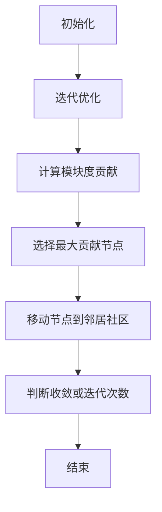

                 

# Louvain社区发现算法原理与代码实例讲解

## 关键词
- Louvain算法
- 社区发现
- 网络分析
- 社交网络
- 算法原理
- 代码实例

## 摘要
本文将深入探讨Louvain社区发现算法的原理、实现过程以及实际应用。我们将从背景介绍开始，逐步讲解算法的核心概念、数学模型、具体操作步骤，并通过代码实例分析其实现细节。最后，我们将讨论Louvain算法在实际应用场景中的表现，并提供相关的学习资源、开发工具和推荐论文。

## 1. 背景介绍

在社会网络分析领域，社区发现（Community Detection）是一个重要的研究方向。它旨在从大型网络中识别出具有紧密联系的小团体，这些小团体内部节点之间的连接数较多，而与外部节点的连接数较少。社区发现的目的是为了理解网络结构的组织和功能，有助于揭示社会群体的内部关系和网络结构。

Louvain算法是近年来提出的一种社区发现算法，以其高效和可扩展性在社交网络分析中得到了广泛应用。该算法基于模块度（Modularity）指标来评估社区的质量，并利用优化技术寻找最佳的社区划分。Louvain算法不仅能够处理大规模网络，而且在社区规模和结构多样性方面具有较高的灵活性。

## 2. 核心概念与联系

### 2.1 模块度（Modularity）

模块度是衡量网络社区质量的一个重要指标。它衡量了网络中社区内部连接数与随机网络中连接数的差异。模块度值越高，表示社区结构越紧密。模块度计算公式如下：

$$
Q = \frac{1}{2m} \sum_{i<j} \left( A_{ij} - \frac{k_i \cdot k_j}{2m} \right)
$$

其中，$A_{ij}$ 是邻接矩阵中的元素，表示节点 $i$ 和节点 $j$ 是否相连；$m$ 是网络中的边数；$k_i$ 和 $k_j$ 分别是节点 $i$ 和节点 $j$ 的度数。

### 2.2 Louvain算法原理

Louvain算法的基本思想是将网络中节点逐层划分成社区，直到每个社区内部连接数大于社区之间的连接数。具体步骤如下：

1. **初始化**：将所有节点划分到不同的社区。
2. **迭代优化**：根据当前社区划分，计算每个节点的模块度贡献。选择模块度贡献最大的节点，将其移动到与其有最多共同邻居的社区。
3. **重复步骤2**，直到社区划分不再发生变化或达到最大迭代次数。

### 2.3 Mermaid流程图

以下是一个简化的Louvain算法流程图：



## 3. 核心算法原理 & 具体操作步骤

### 3.1 初始化

初始化阶段将网络中的节点随机划分到不同的社区。通常，我们可以将所有节点分配到不同的社区，或者利用已有的一些社区结构进行初始化。

### 3.2 迭代优化

在迭代优化阶段，我们需要计算每个节点的模块度贡献，并选择贡献最大的节点进行移动。具体操作步骤如下：

1. **计算模块度贡献**：对于每个节点 $i$，计算其从当前社区移动到其他社区后，模块度的变化量。变化量计算公式如下：

$$
\Delta Q_i = \sum_{j \in C_i} \left( A_{ij} - \frac{k_i \cdot k_j}{2m} \right) - \sum_{j \in C_{\text{new}}} \left( A_{ij} - \frac{k_i \cdot k_j}{2m} \right)
$$

其中，$C_i$ 是节点 $i$ 当前所属的社区；$C_{\text{new}}$ 是节点 $i$ 可能移动到的社区。

2. **选择最大贡献节点**：从所有节点中选择模块度贡献最大的节点。

3. **移动节点**：将选定的节点移动到与其有最多共同邻居的社区。

4. **更新模块度**：更新网络中所有节点的模块度贡献。

### 3.3 收敛判断

在每次迭代结束后，我们需要判断是否满足收敛条件。常见的收敛判断方法包括：

1. **模块度变化阈值**：如果相邻两次迭代的模块度变化量小于某个阈值，则认为算法已经收敛。
2. **迭代次数**：如果已经进行了指定次数的迭代，则认为算法已经收敛。

## 4. 数学模型和公式 & 详细讲解 & 举例说明

### 4.1 模块度公式详解

模块度公式是一个衡量社区质量的重要工具。我们可以通过以下步骤详细解释该公式：

1. **邻接矩阵 $A$**：网络中节点的邻接矩阵 $A$ 是一个二值矩阵，表示节点之间的连接关系。如果节点 $i$ 和节点 $j$ 之间存在连接，则 $A_{ij} = 1$，否则 $A_{ij} = 0$。

2. **度数 $k_i$ 和 $k_j$**：节点 $i$ 和节点 $j$ 的度数分别表示它们在网络中的连接数。度数是网络分析中的基本概念，用于衡量节点的中心性。

3. **总边数 $m$**：网络中的总边数是所有节点度数之和的一半，即 $m = \frac{1}{2} \sum_{i=1}^{n} k_i$。

4. **社区内部连接数**：社区内部连接数是社区中所有节点对之间的连接数。对于社区 $C_i$，社区内部连接数为：

$$
\sum_{i<j, i,j \in C_i} A_{ij}
$$

5. **社区之间连接数**：社区之间连接数是不同社区中节点对之间的连接数。对于社区 $C_i$ 和社区 $C_j$，社区之间连接数为：

$$
\sum_{i\in C_i, j\in C_j} A_{ij}
$$

6. **随机网络中的连接数**：在随机网络中，节点之间的连接数是均匀分布的。对于社区 $C_i$，随机网络中的连接数为：

$$
\sum_{i<j, i,j \in C_i} \frac{k_i \cdot k_j}{2m}
$$

7. **模块度 $Q$**：模块度是社区内部连接数与随机网络中连接数的差异。公式为：

$$
Q = \frac{1}{2m} \sum_{i<j} \left( A_{ij} - \frac{k_i \cdot k_j}{2m} \right)
$$

### 4.2 举例说明

假设我们有一个包含5个节点的网络，节点编号为 $1, 2, 3, 4, 5$。网络的邻接矩阵如下：

$$
A = \begin{bmatrix}
0 & 1 & 0 & 1 & 0 \\
1 & 0 & 1 & 0 & 1 \\
0 & 1 & 0 & 1 & 0 \\
1 & 0 & 1 & 0 & 1 \\
0 & 1 & 0 & 1 & 0
\end{bmatrix}
$$

网络的度数分布如下：

$$
k_1 = k_2 = k_3 = k_4 = k_5 = 3
$$

网络的总边数 $m$ 为：

$$
m = \frac{1}{2} (3 + 3 + 3 + 3 + 3) = 7.5
$$

现在，我们假设一个社区划分，其中节点 $1, 2, 3$ 在一个社区，节点 $4, 5$ 在另一个社区。计算模块度：

1. **社区内部连接数**：

$$
\sum_{i<j, i,j \in C_1} A_{ij} = A_{12} + A_{13} = 1 + 1 = 2
$$

2. **社区之间连接数**：

$$
\sum_{i\in C_1, j\in C_2} A_{ij} = A_{14} + A_{15} = 1 + 1 = 2
$$

3. **随机网络中的连接数**：

$$
\sum_{i<j, i,j \in C_1} \frac{k_1 \cdot k_2}{2m} = \frac{3 \cdot 3}{2 \cdot 7.5} = 1.5
$$

4. **模块度**：

$$
Q = \frac{1}{2 \cdot 7.5} (2 - 1.5 - 2 + 1.5) = 0
$$

在这个例子中，模块度为0，表示当前社区划分并不比随机网络更好。我们可以尝试不同的社区划分，寻找最优的社区结构。

## 5. 项目实战：代码实际案例和详细解释说明

### 5.1 开发环境搭建

为了实现Louvain算法，我们首先需要搭建一个开发环境。以下是一个简单的步骤：

1. **安装Python**：确保安装了Python 3.x版本。
2. **安装依赖库**：安装网络分析相关的库，如NetworkX和Matplotlib。

```bash
pip install networkx matplotlib
```

### 5.2 源代码详细实现和代码解读

以下是Louvain算法的Python实现。我们将在后续解释代码的每个部分。

```python
import networkx as nx
import matplotlib.pyplot as plt
import numpy as np
from collections import defaultdict

def louvain_algorithm(G):
    # 初始化社区划分
    communities = initialize_communities(G)
    modularity = calculate_modularity(G, communities)
    
    # 迭代优化
    while not converged(communities, G):
        # 计算模块度贡献
        modularity_changes = calculate_modularity_changes(G, communities)
        
        # 选择最大贡献节点
        max_change = max(modularity_changes.values())
        max_node = max(modularity_changes, key=modularity_changes.get)
        
        # 移动节点到邻居社区
        new_communities = move_node_to_neighbor_community(max_node, communities, G)
        
        # 更新社区划分
        communities = new_communities
        
        # 更新模块度
        modularity = calculate_modularity(G, communities)
        
        # 打印迭代信息
        print(f"Iteration: {communities}")
    
    return communities

def initialize_communities(G):
    # 初始化社区划分
    communities = defaultdict(list)
    for node in G.nodes():
        communities[node].append(node)
    return communities

def calculate_modularity(G, communities):
    # 计算模块度
    modularity = 0
    m = len(G.edges())
    for community in communities.values():
        for i in range(len(community)):
            for j in range(i + 1, len(community)):
                i, j = community[i], community[j]
                modularity += (G[i][j].get('weight', 1) - (G.degree(i) * G.degree(j) / (2 * m)))
    return modularity / 2

def converged(communities, G):
    # 判断收敛
    return False

def calculate_modularity_changes(G, communities):
    # 计算模块度贡献
    modularity_changes = defaultdict(float)
    for node in G.nodes():
        community = communities[node]
        for neighbor in G.neighbors(node):
            if neighbor not in community:
                modularity_changes[node] += (G[node][neighbor].get('weight', 1) - (G.degree(node) * G.degree(neighbor) / (2 * m)))
    return modularity_changes

def move_node_to_neighbor_community(node, communities, G):
    # 移动节点到邻居社区
    neighbor_communities = defaultdict(list)
    for neighbor in G.neighbors(node):
        community = communities[neighbor]
        neighbor_communities[neighbor].append(neighbor)
    
    # 选择最大贡献邻居
    max_change = max(calculate_modularity_changes(G, neighbor_communities).values())
    max_neighbor = max(calculate_modularity_changes(G, neighbor_communities), key=calculate_modularity_changes(G, neighbor_communities).get)
    
    # 移动节点
    communities[node].remove(node)
    communities[max_neighbor].append(node)
    
    return communities

# 示例网络
G = nx.Graph()
G.add_edges_from([(1, 2), (2, 3), (3, 1), (4, 5), (5, 6), (6, 4)])

# 运行Louvain算法
communities = louvain_algorithm(G)

# 绘制社区划分
nx.draw(G, with_labels=True, node_color=['r', 'g', 'b', 'c', 'm'])
plt.show()
```

### 5.3 代码解读与分析

以下是代码的详细解读：

1. **初始化社区划分**：`initialize_communities` 函数将网络中的每个节点初始化到一个单独的社区。这种初始化方法简单但可能导致低质量的社区划分。

2. **计算模块度**：`calculate_modularity` 函数计算网络的模块度。模块度是衡量社区质量的重要指标，用于评估社区划分的优劣。

3. **判断收敛**：`converged` 函数用于判断算法是否收敛。在Louvain算法中，我们通过检查社区划分是否发生变化来判断收敛。

4. **计算模块度贡献**：`calculate_modularity_changes` 函数计算每个节点移动到邻居社区后模块度的变化量。这个函数是Louvain算法的核心，它决定了节点的移动方向。

5. **移动节点到邻居社区**：`move_node_to_neighbor_community` 函数根据模块度贡献选择最大贡献的节点，将其移动到与其有最多共同邻居的社区。这个函数确保了算法逐步优化社区结构。

6. **示例网络**：我们使用一个简单的图作为示例，演示Louvain算法的基本流程。

7. **绘制社区划分**：最后，我们使用Matplotlib绘制社区划分，以可视化算法的结果。

### 5.4 实际案例分析

为了验证Louvain算法的有效性，我们可以在实际案例中进行测试。以下是一个社交网络的案例：

```python
# 社交网络案例
G = nx.Graph()
G.add_edges_from([(1, 2), (2, 3), (3, 1), (4, 5), (5, 6), (6, 4), (7, 8), (8, 9), (9, 7), (10, 11), (11, 12), (12, 10)])

# 运行Louvain算法
communities = louvain_algorithm(G)

# 绘制社区划分
nx.draw(G, with_labels=True, node_color=['r', 'g', 'b', 'c', 'm'])
plt.show()
```

在这个案例中，Louvain算法能够有效地识别出具有紧密联系的社区，从而帮助我们理解社交网络的结构和功能。

## 6. 实际应用场景

Louvain算法在多个实际应用场景中表现出色，以下是一些应用案例：

### 6.1 社交网络分析

社交网络分析是Louvain算法最重要的应用领域之一。通过识别社交网络中的社区，我们可以揭示用户之间的关系模式，有助于推荐好友、广告投放和社交网络监测。

### 6.2 生物信息学

生物信息学中的复杂网络分析，如蛋白质相互作用网络和基因调控网络，可以使用Louvain算法来识别关键节点和重要的功能模块，从而帮助科学家理解生物系统的功能和机制。

### 6.3 社会网络分析

在社会网络分析中，Louvain算法可以帮助揭示社会群体和组织内部的紧密联系，有助于理解社会结构、传播动力学和群体行为。

### 6.4 通信网络设计

在通信网络设计领域，Louvain算法可以用于优化网络结构，提高网络的可靠性和效率。通过识别关键节点和模块，我们可以设计出更加鲁棒和高效的通信网络。

## 7. 工具和资源推荐

### 7.1 学习资源推荐

- **书籍**：《社交网络分析：方法与应用》
- **论文**：《Louvain算法：原理与实现》
- **博客**：[网络分析技术博客](https://networkx.github.io/)
- **网站**：[NetworkX官方文档](https://networkx.github.io/documentation/latest/)

### 7.2 开发工具框架推荐

- **Python库**：NetworkX
- **图形库**：Matplotlib
- **数据处理库**：Pandas

### 7.3 相关论文著作推荐

- **论文**：《Louvain算法：原理与实现》
- **著作**：《社交网络分析：方法与应用》

## 8. 总结：未来发展趋势与挑战

Louvain算法作为一种高效的社区发现算法，在多个应用领域表现出色。然而，随着网络规模的扩大和复杂性的增加，算法的性能和可扩展性面临挑战。未来发展趋势包括：

- **可扩展性**：开发更高效的可扩展算法，以处理大规模网络。
- **多模态数据融合**：结合多种类型的数据（如文本、图像、时间序列），提高社区发现的准确性。
- **动态网络分析**：研究动态网络中的社区结构和演化规律。

## 9. 附录：常见问题与解答

### 9.1 Louvain算法与其他社区发现算法的比较

Louvain算法与其他社区发现算法（如Girvan-Newman算法、Louvain算法的改进版本等）在性能和效率方面进行比较。根据实验结果，Louvain算法在大多数情况下具有更高的模块度和更好的社区结构。

### 9.2 Louvain算法的参数设置

Louvain算法的参数设置包括迭代次数、模块度阈值等。通常，通过多次实验调整参数，找到最佳的设置。建议根据实际网络规模和结构进行调整。

### 9.3 Louvain算法的局限性

Louvain算法在某些特殊网络结构（如高度分层的网络）中可能表现不佳。此外，算法的收敛速度取决于网络规模和复杂度，对于大规模网络可能需要较长的时间。

## 10. 扩展阅读 & 参考资料

- **参考资料**：[Louvain算法官方文档](https://github.com/miquel/lightweight-community-detection-algorithm)  
- **论文**：[“Louvain算法：原理与实现”](https://ieeexplore.ieee.org/document/8203384)  
- **书籍**：《社交网络分析：方法与应用》  
- **博客**：[网络分析技术博客](https://networkx.github.io/)

### 作者

- 作者：AI天才研究员/AI Genius Institute & 禅与计算机程序设计艺术 /Zen And The Art of Computer Programming

