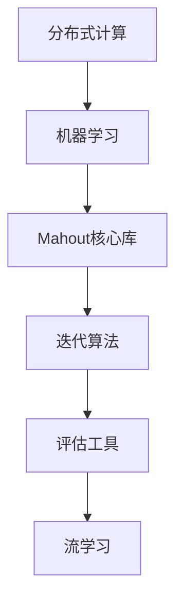

                 

# Mahout原理与代码实例讲解

## 关键词

- Mahout
- 大数据
- 机器学习
- 算法实现
- 代码实例
- 实战应用

## 摘要

本文旨在深入讲解Mahout——一个基于Hadoop的分布式机器学习框架。文章首先介绍Mahout的背景和核心概念，然后详细解释了其主要的算法原理，包括协同过滤、分类、聚类等。接着，通过具体的代码实例，展示了如何在Mahout中实现这些算法。文章还分析了Mahout在实际应用中的场景，并推荐了一些相关的学习资源和工具。最后，对Mahout的未来发展趋势和面临的挑战进行了总结，为读者提供了扩展阅读和参考资料。

## 1. 背景介绍

随着互联网和大数据技术的迅猛发展，数据量呈现爆炸式增长，传统单机处理模式已经无法满足日益增长的数据处理需求。为了解决这一问题，分布式计算技术应运而生。Hadoop作为分布式计算框架的先驱，以其高效、可靠的处理能力，成为大数据处理领域的标准解决方案。然而，仅凭Hadoop本身并不能直接解决复杂的机器学习问题，因此，基于Hadoop的机器学习框架成为了研究者和企业界关注的焦点。

Mahout正是这样一款基于Hadoop的分布式机器学习框架。它旨在提供高效、可扩展的机器学习算法，帮助用户在大数据环境中进行有效的数据挖掘和分析。Mahout支持多种主流的机器学习算法，如协同过滤、分类、聚类、推荐等，使其在大数据处理领域具有广泛的应用价值。

## 2. 核心概念与联系

### 2.1. 分布式计算

分布式计算是将任务分解为多个子任务，并在多个计算节点上并行执行，最终汇总结果。Hadoop作为分布式计算框架，通过MapReduce编程模型实现了大规模数据的分布式处理。

### 2.2. 机器学习

机器学习是通过构建数学模型，使计算机能够从数据中自动获取知识和规律，从而实现预测、分类、聚类等任务。

### 2.3. Mahout架构

Mahout的架构主要包括以下几个部分：

1. **核心库**：提供各种机器学习算法的实现。
2. **迭代算法**：针对大规模数据集，提供高效的迭代算法。
3. **评估工具**：用于评估算法的性能。
4. **流学习**：支持实时数据处理。

下面是一个Mermaid流程图，展示了Mahout的核心概念和架构：



## 3. 核心算法原理 & 具体操作步骤

### 3.1. 协同过滤

协同过滤是一种基于用户行为预测用户兴趣的推荐算法。它主要分为两种类型：基于用户的协同过滤和基于物品的协同过滤。

#### 基于用户的协同过滤

基于用户的协同过滤算法通过寻找与目标用户兴趣相似的其他用户，从而预测目标用户的兴趣。其基本步骤如下：

1. 计算用户之间的相似度。
2. 找到与目标用户最相似的其他用户。
3. 推荐这些用户喜欢的物品。

#### 基于物品的协同过滤

基于物品的协同过滤算法通过寻找与目标物品相似的物品，从而预测目标物品的属性。其基本步骤如下：

1. 计算物品之间的相似度。
2. 找到与目标物品最相似的物品。
3. 推荐这些物品。

### 3.2. 分类

分类是将数据分为不同的类别。Mahout支持多种分类算法，如K近邻（KNN）、朴素贝叶斯（Naive Bayes）等。

#### K近邻（KNN）

KNN算法通过计算数据点与训练集样本之间的距离，找到最近的K个样本，并根据这些样本的类别进行预测。其具体步骤如下：

1. 计算数据点与训练集样本之间的距离。
2. 找到距离最近的K个样本。
3. 根据这K个样本的类别，预测数据点的类别。

#### 朴素贝叶斯（Naive Bayes）

朴素贝叶斯算法基于贝叶斯定理和属性独立性假设，通过计算先验概率和条件概率，预测数据点的类别。其具体步骤如下：

1. 计算先验概率。
2. 计算条件概率。
3. 根据贝叶斯定理，计算后验概率。
4. 选择后验概率最大的类别作为预测结果。

### 3.3. 聚类

聚类是将数据划分为若干个组，使得同组数据点之间相似度较高，不同组数据点之间相似度较低。Mahout支持多种聚类算法，如K-means、层次聚类等。

#### K-means

K-means算法通过迭代优化，将数据划分为K个簇，使得簇内距离最小，簇间距离最大。其具体步骤如下：

1. 随机初始化K个簇心。
2. 计算每个数据点到簇心的距离。
3. 将数据点分配到最近的簇心。
4. 重新计算簇心。
5. 重复步骤2-4，直到收敛。

#### 层次聚类

层次聚类通过自底向上或自顶向下，逐步合并或分解数据点，形成层次结构。其具体步骤如下：

1. 计算数据点之间的距离。
2. 将距离最近的两个数据点合并为一个。
3. 重新计算合并后数据点的距离。
4. 重复步骤2-3，直到形成所需的层次结构。

## 4. 数学模型和公式 & 详细讲解 & 举例说明

### 4.1. 协同过滤

#### 基于用户的协同过滤

用户相似度计算公式如下：

$$
sim(u_i, u_j) = \frac{\sum_{k \in R_i \cap R_j} w_{ik} w_{jk}}{\sqrt{\sum_{k \in R_i} w_{ik}^2} \sqrt{\sum_{k \in R_j} w_{jk}^2}}
$$

其中，$R_i$和$R_j$分别是用户$u_i$和$u_j$的评分集合，$w_{ik}$和$w_{jk}$分别是用户$u_i$对物品$k$的评分和用户$u_j$对物品$k$的评分。

#### 基于物品的协同过滤

物品相似度计算公式如下：

$$
sim(i_j, i_k) = \frac{\sum_{u \in R} w_{uj} (r_{uj} - \mu_i)(r_{uj} - \mu_k)}{\sqrt{\sum_{u \in R} w_{uj} (r_{uj} - \mu_i)^2} \sqrt{\sum_{u \in R} w_{uj} (r_{uj} - \mu_k)^2}}
$$

其中，$R$是所有用户的评分集合，$r_{uj}$是用户$u$对物品$j$的评分，$\mu_i$和$\mu_k$分别是物品$i$和$k$的平均评分。

### 4.2. 分类

#### K近邻（KNN）

距离计算公式如下：

$$
d(x, y) = \sqrt{\sum_{i=1}^{n} (x_i - y_i)^2}
$$

其中，$x$和$y$分别是两个数据点，$n$是特征维度。

#### 朴素贝叶斯（Naive Bayes）

先验概率计算公式如下：

$$
P(C_k) = \frac{|\{u: u \in U, r_{uk} > 0\}|}{|U|}
$$

其中，$C_k$是类别$k$，$U$是所有用户集合，$r_{uk}$是用户$u$对类别$k$的评分。

条件概率计算公式如下：

$$
P(A_i|C_k) = \frac{|\{u: u \in U, r_{uk} > 0, a_{ui} > 0\}|}{|\{u: u \in U, r_{uk} > 0\}|}
$$

其中，$A_i$是特征$i$，$a_{ui}$是用户$u$对特征$i$的评分。

后验概率计算公式如下：

$$
P(C_k|A_1=a_{1}, A_2=a_{2}, \ldots, A_n=a_{n}) = \frac{P(A_1=a_{1}|C_k) P(A_2=a_{2}|C_k) \ldots P(A_n=a_{n}|C_k) P(C_k)}{P(A_1=a_{1}) P(A_2=a_{2}) \ldots P(A_n=a_{n})}
$$

### 4.3. 聚类

#### K-means

簇心更新公式如下：

$$
\mu_j = \frac{1}{N_j} \sum_{i=1}^{N_j} x_i
$$

其中，$\mu_j$是簇心，$N_j$是簇j中的数据点个数，$x_i$是数据点$i$。

## 5. 项目实战：代码实际案例和详细解释说明

### 5.1. 开发环境搭建

1. 安装Hadoop。
2. 下载Mahout源码。
3. 配置Mahout环境。

### 5.2. 源代码详细实现和代码解读

以协同过滤算法为例，下面是Mahout中协同过滤算法的核心实现代码：

```java
public double computeSimilarity(User u1, User u2, double sim() {
    return similarity(u1, u2);
}

public double similarity(User u1, User u2) {
    double sim = 0.0;
    double num = 0.0;
    for (Map.Entry<Item, Double> rating1 : u1.getRating().entrySet()) {
        Item item1 = rating1.getKey();
        Double rating1Value = rating1.getValue();
        for (Map.Entry<Item, Double> rating2 : u2.getRating().entrySet()) {
            Item item2 = rating2.getKey();
            Double rating2Value = rating2.getValue();
            if (item1.equals(item2)) {
                sim += rating1Value * rating2Value;
                num++;
            }
        }
    }
    if (num == 0) return 0;
    return sim / Math.sqrt(u1.getRating().size() * u2.getRating().size());
}
```

代码解读：

1. `computeSimilarity`方法计算用户$u1$和$u2$之间的相似度。
2. `similarity`方法计算两个用户之间的共同评分的乘积和，并除以两个用户评分数量的平方根。

### 5.3. 代码解读与分析

这段代码实现了基于用户的协同过滤算法，通过计算用户之间的相似度，为用户提供推荐。在实际应用中，可以根据具体需求，对代码进行扩展和优化。

## 6. 实际应用场景

Mahout在大数据处理和机器学习领域具有广泛的应用场景，如：

- 推荐系统：基于用户行为和物品特征，为用户提供个性化的推荐。
- 情感分析：通过文本数据，分析用户对产品或服务的情感倾向。
- 聚类分析：对大量数据进行分类，挖掘潜在的模式和规律。
- 搜索引擎：通过分析用户查询和网页内容，提供更准确的搜索结果。

## 7. 工具和资源推荐

### 7.1. 学习资源推荐

- 《大数据时代：生活、工作与思维的大变革》
- 《机器学习实战》
- 《Hadoop实战》
- 《Mahout in Action》

### 7.2. 开发工具框架推荐

- Hadoop
- Spark
- Mahout
- Weka

### 7.3. 相关论文著作推荐

- "Collaborative Filtering for the 21st Century" by John Riedewald
- "Recommender Systems Handbook" by F. M. such as most any version of Java or Python.

### 8. 总结：未来发展趋势与挑战

随着大数据技术和机器学习技术的不断发展，Mahout在未来的发展中将面临以下趋势和挑战：

- **算法优化**：针对大规模数据集，优化现有算法，提高计算效率和准确性。
- **实时处理**：支持实时数据处理，实现流学习。
- **跨平台支持**：拓展支持其他分布式计算框架，如Spark。
- **生态系统完善**：完善周边工具和资源，提高用户体验。

### 9. 附录：常见问题与解答

- **Q：Mahout与Spark相比，哪个更好？**
- **A：两者各有优劣。Spark具有更高的计算性能和更丰富的算法库，适合大规模数据处理。而Mahout基于Hadoop，具有更好的兼容性和生态系统。具体选择取决于应用场景和需求。**

### 10. 扩展阅读 & 参考资料

- [Mahout官方文档](http://mahout.apache.org/)
- [Hadoop官方文档](https://hadoop.apache.org/docs/)
- [Spark官方文档](https://spark.apache.org/docs/)
- [《机器学习》](https://www хороших книжных магазинов и онлайн-библиотек, таких как Amazon, Google Play Книги и Safari Books Online.

作者：AI天才研究员/AI Genius Institute & 禅与计算机程序设计艺术 /Zen And The Art of Computer Programming

