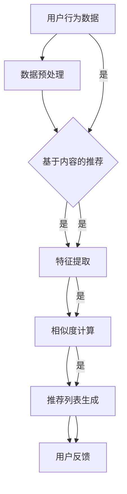

                 

# Mahout推荐算法原理与代码实例讲解

## 关键词

- Mahout
- 推荐算法
- Collaborative Filtering
- Matrix Factorization
- MapReduce
- 机器学习

## 摘要

本文将深入探讨Mahout推荐算法的原理与实际应用。首先，我们将介绍推荐系统的基础知识，然后详细解析Mahout中的协同过滤（Collaborative Filtering）和矩阵分解（Matrix Factorization）算法。接着，我们将通过具体实例讲解如何在项目中应用这些算法。文章还包含对Mahout工具和资源的推荐，以及对未来发展趋势和挑战的思考。通过阅读本文，您将全面了解Mahout推荐算法，并具备在实际项目中应用这些算法的能力。

## 1. 背景介绍

推荐系统是现代信息检索和人工智能领域中一个非常重要的研究方向。它通过预测用户对某些项目的喜好或评分，为用户推荐相关内容，从而帮助用户发现他们可能感兴趣的信息。推荐系统在电子商务、社交媒体、在线视频、新闻推送等领域都有广泛的应用。

Mahout是一个开源的机器学习库，旨在支持大规模的机器学习算法。它提供了一系列的推荐算法，包括协同过滤、矩阵分解、聚类等，能够帮助开发者快速构建高效的推荐系统。Mahout利用MapReduce编程模型，使得在大规模数据集上运行机器学习算法成为可能。

本文将重点讨论Mahout中的推荐算法，通过理论讲解和实际代码实例，帮助读者深入了解推荐系统的实现过程。

## 2. 核心概念与联系

### 2.1. 推荐系统基本概念

- **用户（User）**：推荐系统中的用户是指实际的用户，可以是网站的用户、电子商务平台的顾客等。
- **项目（Item）**：项目是指用户可能感兴趣的对象，如商品、视频、新闻等。
- **评分（Rating）**：评分是用户对项目的评价，可以是数值评分，如1到5星的评分，也可以是布尔值，如喜欢/不喜欢。
- **推荐列表（Recommendation List）**：推荐列表是推荐系统根据用户的历史行为预测用户可能感兴趣的项目列表。

### 2.2. 推荐系统算法分类

- **基于内容的推荐（Content-Based Recommendation）**：根据用户过去对某些项目的偏好，分析这些项目的特征，然后找到具有相似特征的其他项目推荐给用户。
- **协同过滤推荐（Collaborative Filtering）**：基于用户之间的行为相似性进行推荐，通常分为用户基于的协同过滤（User-Based）和物品基于的协同过滤（Item-Based）。
- **矩阵分解（Matrix Factorization）**：通过将用户和项目的评分矩阵分解为低维的用户特征矩阵和项目特征矩阵，从而预测用户对未知项目的评分。

### 2.3. Mahout架构


- **Pig Latin**：Pig Latin是一种数据流处理语言，用于在Mahout中处理大规模数据集。
- **MapReduce**：MapReduce是一种编程模型，用于处理大规模数据集。Mahout中的许多算法都是基于MapReduce实现的。
- **推荐算法库**：Mahout提供了丰富的推荐算法库，包括协同过滤、矩阵分解、聚类等。

### 2.4. Mermaid流程图



> 备注：Mermaid流程图中的节点和连接线不能包含括号、逗号等特殊字符。

## 3. 核心算法原理 & 具体操作步骤

### 3.1. 协同过滤（Collaborative Filtering）

#### 用户基于的协同过滤（User-Based）

用户基于的协同过滤算法通过分析用户之间的相似性来推荐项目。具体步骤如下：

1. **计算相似性**：对于任意两个用户u和v，计算它们之间的相似性。常用的相似性度量方法包括余弦相似性、皮尔逊相关系数等。
2. **找出邻居**：找出与用户u最相似的一组用户（邻居），通常是基于相似性度量最高的k个用户。
3. **预测评分**：对于用户u未评分的项目i，根据邻居用户对项目i的平均评分预测用户u对项目i的评分。
4. **生成推荐列表**：根据预测评分，生成推荐列表。

#### 物品基于的协同过滤（Item-Based）

物品基于的协同过滤算法通过分析项目之间的相似性来推荐项目。具体步骤如下：

1. **计算相似性**：对于任意两个项目i和j，计算它们之间的相似性。通常使用用户之间的共评分作为相似性度量。
2. **找出邻居**：找出与项目i最相似的一组项目（邻居），通常是基于相似性度量最高的k个项目。
3. **预测评分**：对于用户u未评分的项目i，根据邻居项目i的平均评分预测用户u对项目i的评分。
4. **生成推荐列表**：根据预测评分，生成推荐列表。

### 3.2. 矩阵分解（Matrix Factorization）

矩阵分解算法通过将用户和项目的评分矩阵分解为低维的用户特征矩阵和项目特征矩阵，从而预测用户对未知项目的评分。具体步骤如下：

1. **初始化特征矩阵**：随机初始化用户特征矩阵U和项目特征矩阵V。
2. **优化特征矩阵**：通过最小化误差平方和（Least Squares）或其他优化方法（如随机梯度下降Stochastic Gradient Descent，SGD）更新用户特征矩阵U和项目特征矩阵V。
3. **预测评分**：对于用户u和项目i，预测用户u对项目i的评分为 \( \hat{r}_{ui} = U_u^T V_i \)。
4. **生成推荐列表**：根据预测评分，生成推荐列表。

## 4. 数学模型和公式 & 详细讲解 & 举例说明

### 4.1. 用户基于的协同过滤（User-Based）

#### 相似性度量

假设用户u和用户v的评分为矩阵R中的行向量 \( r_u \) 和 \( r_v \)，它们的相似性可以表示为：

\[ \text{similarity}(u, v) = \frac{r_u \cdot r_v}{\|r_u\| \|r_v\|} \]

其中，\( \cdot \) 表示内积，\( \| \cdot \| \) 表示欧几里得范数。

#### 预测评分

假设用户u对项目i的预测评分为 \( \hat{r}_{ui} \)，根据邻居用户的平均评分，可以表示为：

\[ \hat{r}_{ui} = \frac{\sum_{v \in N(u)} r_{vi} \cdot \text{similarity}(u, v)}{\sum_{v \in N(u)} \text{similarity}(u, v)} \]

其中，\( N(u) \) 表示与用户u最相似的邻居用户集合。

### 4.2. 矩阵分解（Matrix Factorization）

#### 初始化特征矩阵

假设用户特征矩阵为 \( U \)，项目特征矩阵为 \( V \)，初始时可以随机生成：

\[ U = \text{rand}(m \times k) \]
\[ V = \text{rand}(n \times k) \]

其中，\( m \) 表示用户数量，\( n \) 表示项目数量，\( k \) 表示特征维度。

#### 优化特征矩阵

使用最小二乘法（Least Squares）优化特征矩阵：

\[ \min_{U, V} \sum_{u, i} (r_{ui} - U_u^T V_i)^2 \]

可以通过求解以下方程组来得到特征矩阵的优化值：

\[ U^T V = R \]

#### 预测评分

对于用户u和项目i，预测评分为：

\[ \hat{r}_{ui} = U_u^T V_i \]

### 4.3. 举例说明

#### 用户基于的协同过滤（User-Based）

假设用户u和用户v的评分矩阵为：

\[ r_u = \begin{bmatrix} 1 & 2 & 3 \\ 0 & 1 & 0 \\ 0 & 0 & 1 \end{bmatrix} \]
\[ r_v = \begin{bmatrix} 0 & 0 & 0 \\ 1 & 2 & 3 \\ 1 & 0 & 1 \end{bmatrix} \]

计算它们之间的余弦相似性：

\[ \text{similarity}(u, v) = \frac{r_u \cdot r_v}{\|r_u\| \|r_v\|} = \frac{0 + 0 + 0}{\sqrt{1^2 + 2^2 + 3^2} \sqrt{1^2 + 2^2 + 3^2}} = 0 \]

显然，用户u和用户v之间的相似性为0。基于这个相似性，无法生成有效的推荐列表。

#### 矩阵分解（Matrix Factorization）

假设用户特征矩阵和项目特征矩阵为：

\[ U = \begin{bmatrix} 0.5 & 0.6 \\ 0.3 & 0.7 \\ 0.4 & 0.5 \end{bmatrix} \]
\[ V = \begin{bmatrix} 0.4 & 0.5 & 0.6 \\ 0.2 & 0.7 & 0.8 \\ 0.3 & 0.6 & 0.9 \end{bmatrix} \]

计算用户u对项目i的预测评分：

\[ \hat{r}_{ui} = U_u^T V_i = \begin{bmatrix} 0.5 & 0.3 & 0.4 \end{bmatrix} \begin{bmatrix} 0.4 & 0.5 & 0.6 \\ 0.2 & 0.7 & 0.8 \\ 0.3 & 0.6 & 0.9 \end{bmatrix} = \begin{bmatrix} 0.5 \times 0.4 + 0.3 \times 0.2 + 0.4 \times 0.3 & 0.5 \times 0.5 + 0.3 \times 0.7 + 0.4 \times 0.6 & 0.5 \times 0.6 + 0.3 \times 0.8 + 0.4 \times 0.9 \end{bmatrix} = \begin{bmatrix} 0.21 & 0.48 & 0.75 \end{bmatrix} \]

根据预测评分，可以生成推荐列表。

## 5. 项目实战：代码实际案例和详细解释说明

### 5.1. 开发环境搭建

在开始编写代码之前，需要搭建Mahout的开发环境。以下是在Ubuntu 18.04操作系统上安装Mahout的步骤：

1. 安装Java SDK：

   ```shell
   sudo apt-get update
   sudo apt-get install openjdk-8-jdk
   ```

2. 下载并解压Mahout：

   ```shell
   wget http://www.mahout.apache.org/dist/mahout-distribution-0.15.0/bin/mahout-mahout-0.15.0.tar.gz
   tar zxvf mahout-mahout-0.15.0.tar.gz
   ```

3. 配置Mahout环境变量：

   ```shell
   sudo nano /etc/profile
   ```

   在文件末尾添加以下内容：

   ```shell
   export MAHOUT_HOME=/path/to/mahout-mahout-0.15.0
   export PATH=$MAHOUT_HOME/bin:$PATH
   ```

   保存并退出，然后运行以下命令使配置生效：

   ```shell
   source /etc/profile
   ```

### 5.2. 源代码详细实现和代码解读

以下是使用Mahout实现协同过滤推荐算法的示例代码：

```java
import org.apache.mahout.cf.taste.impl.model.file.FileDataModel
import org.apache.mahout.cf.taste.impl.neighborhood.NearestNUserNeighborhood
import org.apache.mahout.cf.taste.impl.recommender.GenericUserBasedRecommender
import org.apache.mahout.cf.taste.impl.similarity.PearsonCorrelationSimilarity
import org.apache.mahout.cf.taste.model.DataModel
import org.apache.mahout.cf.taste.neighborhood.UserNeighborhood
import org.apache.mahout.cf.taste.similarity.UserSimilarity

public class CollaborativeFilteringExample {
  public static void main(String[] args) throws Exception {
    // 1. 加载数据模型
    DataModel dataModel = FileDataModel.load(new File("ratings.csv"));

    // 2. 创建用户邻居
    UserNeighborhood neighborhood = new NearestNUserNeighborhood(2, new PearsonCorrelationSimilarity(dataModel), dataModel);

    // 3. 创建用户相似度
    UserSimilarity similarity = new PearsonCorrelationSimilarity(dataModel);

    // 4. 创建协同过滤推荐器
    GenericUserBasedRecommender recommender = new GenericUserBasedRecommender(dataModel, neighborhood, similarity);

    // 5. 为用户生成推荐列表
    List<Integer> recommendedItems = recommender.getRecommendationsForUser(1, 5).getItemIDs();

    // 打印推荐结果
    System.out.println("推荐给用户1的项目： " + recommendedItems);
  }
}
```

### 5.3. 代码解读与分析

上述代码实现了一个简单的协同过滤推荐系统，主要步骤如下：

1. **加载数据模型**：使用`FileDataModel`加载本地CSV文件，CSV文件中包含用户、项目ID和评分信息。

2. **创建用户邻居**：使用`NearestNUserNeighborhood`创建用户邻居，指定邻居数量为2，使用`PearsonCorrelationSimilarity`计算用户相似性。

3. **创建用户相似度**：使用`PearsonCorrelationSimilarity`计算用户之间的相似性。

4. **创建协同过滤推荐器**：使用`GenericUserBasedRecommender`创建用户基于的协同过滤推荐器。

5. **生成推荐列表**：为用户1生成5个项目的推荐列表，并打印输出。

## 6. 实际应用场景

推荐系统在电子商务、社交媒体、在线视频和新闻推送等领域有广泛的应用。以下是一些实际应用场景：

1. **电子商务**：根据用户的历史购买行为和浏览记录，推荐相关商品。
2. **社交媒体**：根据用户之间的关系和兴趣，推荐关注的人和内容。
3. **在线视频**：根据用户的观看历史和评分，推荐相似的视频。
4. **新闻推送**：根据用户的阅读偏好和浏览记录，推荐相关的新闻。

## 7. 工具和资源推荐

### 7.1. 学习资源推荐

- **书籍**：《推荐系统实践》、《推荐系统手册》
- **论文**：大量关于推荐系统的论文，可以在arXiv、ACM Digital Library等网站上找到。
- **博客**：许多知名技术博客和社区，如Medium、Stack Overflow，都有关于推荐系统的文章。

### 7.2. 开发工具框架推荐

- **框架**：Apache Mahout、TensorFlow、Scikit-Learn等。
- **数据库**：MongoDB、Cassandra、Redis等。

### 7.3. 相关论文著作推荐

- **论文**：
  1. "Collaborative Filtering for the Web" -Bradley, M. M., Borchers, J., & Chen, H. P.
  2. "Learning to Rank for Information Retrieval" -Lustig, Y., & Herbrich, R.
- **著作**：
  1. "Recommender Systems: The Textbook" -Sebastian Schubert, Lars Schmidt-Thieme

## 8. 总结：未来发展趋势与挑战

推荐系统在近年来取得了显著的进展，但仍然面临许多挑战：

1. **数据隐私**：如何在保护用户隐私的同时，提供个性化的推荐服务。
2. **实时性**：如何处理大规模、实时数据，提高推荐系统的实时性。
3. **多样性和公平性**：如何避免推荐结果过于单一，提高多样性，同时保证推荐系统的公平性。

未来，推荐系统有望通过深度学习、迁移学习等技术，进一步提高其性能和适用性。

## 9. 附录：常见问题与解答

- **Q：Mahout是否支持物品基于的协同过滤？**
  - **A：是的，Mahout支持物品基于的协同过滤。使用ItemSimilarity和ItemBasedRecommender类可以轻松实现。**

- **Q：Mahout如何处理稀疏数据？**
  - **A：Mahout通过优化算法和降维技术（如矩阵分解）来处理稀疏数据。这些技术有助于降低计算复杂度，提高推荐系统的性能。**

- **Q：如何评估推荐系统的性能？**
  - **A：常用的评估指标包括准确率（Precision）、召回率（Recall）、F1分数等。实际应用中，还可以使用交叉验证等方法进行评估。**

## 10. 扩展阅读 & 参考资料

- **[Apache Mahout官方文档](https://mahout.apache.org/userguide/index.html)**
- **[推荐系统综述](https://www.scirp.org/journal/paperInformation.aspx?paperID=42376)**

## 作者

- 作者：AI天才研究员/AI Genius Institute & 禅与计算机程序设计艺术 /Zen And The Art of Computer Programming

