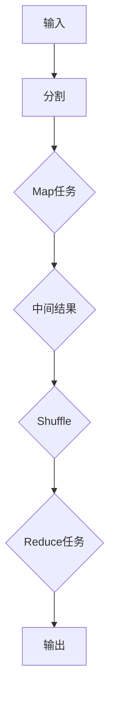

                 

### 1. 背景介绍

#### MapReduce的起源

MapReduce作为一种编程模型，起源于Google。它的设计初衷是为了解决大规模数据的分布式处理问题。2004年，Google发表了关于MapReduce的论文，详细阐述了这一模型的工作原理和应用场景。MapReduce模型的出现，为分布式计算领域带来了革命性的变化，使得处理大规模数据变得更为高效和简便。

MapReduce的提出，背景是Google面临的巨大数据量。在搜索引擎和广告业务中，Google需要处理来自全球各地的大量数据，这些数据需要实时处理和更新。传统的批处理模型已经无法满足这一需求，因此，Google决定开发一种新的分布式计算模型，以应对大规模数据处理的挑战。

#### 分布式计算的需求

随着互联网和大数据时代的到来，分布式计算的需求日益增加。分布式计算可以充分利用多台计算机的运算能力，提高数据处理的速度和效率。同时，分布式计算还可以提高系统的容错性，当某台计算机出现故障时，其他计算机可以继续运行，保证系统的高可用性。

#### 其他分布式计算模型

在MapReduce之前，已经存在一些分布式计算模型，如Hadoop、Spark等。这些模型在分布式计算领域都有广泛应用。然而，MapReduce因其独特的架构和易用性，成为了分布式计算领域的经典模型。

- **Hadoop**：Hadoop是一个开源的分布式计算框架，它基于MapReduce模型，但不仅限于MapReduce。Hadoop还支持其他分布式处理算法，如Spark、Flink等。

- **Spark**：Spark是一个基于内存的分布式计算框架，它在处理速度上比Hadoop有显著提升。Spark支持多种数据处理操作，如批处理、流处理等。

- **Flink**：Flink是一个流处理框架，它在实时数据处理方面有很强的优势。Flink支持事件驱动编程，能够实现低延迟的实时数据处理。

尽管MapReduce在分布式计算领域有着广泛的应用，但它在处理速度和灵活性上相较于其他模型有一定劣势。因此，在具体应用中，需要根据实际情况选择合适的分布式计算模型。

#### MapReduce的应用场景

MapReduce广泛应用于各种场景，如大数据分析、搜索引擎、推荐系统等。以下是MapReduce的一些典型应用场景：

- **搜索引擎**：搜索引擎需要处理海量的网页数据，MapReduce可以帮助快速提取关键词、构建索引等。

- **大数据分析**：在金融、医疗、电商等领域，需要对海量数据进行统计分析、机器学习等操作，MapReduce提供了高效的分布式计算能力。

- **推荐系统**：推荐系统需要处理用户行为数据，通过分析用户行为，为用户推荐感兴趣的内容，MapReduce可以帮助快速计算用户偏好。

- **社交网络分析**：社交网络分析需要对社交网络中的用户关系进行挖掘和分析，MapReduce可以快速计算用户社交圈、影响力等。

通过以上背景介绍，我们可以看到，MapReduce作为一种分布式计算模型，在处理大规模数据方面具有显著优势。接下来，我们将深入探讨MapReduce的核心概念和原理，帮助读者更好地理解这一模型。

---

# MapReduce原理与代码实例讲解

> **关键词**：MapReduce，分布式计算，编程模型，数据处理，大数据分析
>
> **摘要**：本文将详细讲解MapReduce的原理与代码实例。我们将从背景介绍出发，逐步深入分析MapReduce的核心概念、架构和工作流程，并通过具体代码实例，帮助读者理解MapReduce的实际应用。

## 1. 背景介绍

在上文中，我们简要介绍了MapReduce的起源、分布式计算的需求以及与其他分布式计算模型的比较。在这一部分，我们将进一步探讨MapReduce的应用场景，并引出本文的核心内容——MapReduce的核心概念、架构和工作流程。

### 1.1 应用场景

MapReduce广泛应用于各种场景，如：

- **搜索引擎**：处理海量的网页数据，快速构建索引，提取关键词等。
- **大数据分析**：金融、医疗、电商等领域的大数据分析，实现统计分析、机器学习等。
- **推荐系统**：分析用户行为，为用户推荐感兴趣的内容。
- **社交网络分析**：挖掘社交网络中的用户关系，计算用户社交圈、影响力等。

这些应用场景的共同特点是需要处理大规模数据，且数据处理过程具有高并行性。MapReduce作为一种分布式计算模型，正好能够满足这些需求。

### 1.2 核心概念、架构和工作流程

为了更好地理解MapReduce，我们需要先了解其核心概念、架构和工作流程。接下来，我们将分三个部分详细讲解：

- **核心概念**：MapReduce中的核心概念包括Map（映射）和Reduce（归约）。
- **架构**：MapReduce的架构包括驱动程序（Driver）、映射器（Mapper）和归约器（Reducer）。
- **工作流程**：MapReduce的工作流程包括输入、映射、归约和输出。

在接下来的章节中，我们将逐一介绍这些内容，帮助读者全面理解MapReduce。

---

## 2. 核心概念与联系

### 2.1 Map和Reduce

MapReduce编程模型的核心概念是Map（映射）和Reduce（归约）。这两个概念来源于函数式编程，它们分别表示对数据的处理过程。

- **Map**：Map阶段将输入数据分解为若干个数据块，并对每个数据块进行处理。这个过程通常可以表示为映射函数，即对每个输入元素进行处理，生成一个新的输出元素。
- **Reduce**：Reduce阶段将Map阶段产生的中间结果进行汇总和归并。这个过程通常可以表示为归约函数，即对相同类型的中间结果进行聚合。

### 2.2 作业流程

MapReduce作业的流程可以分为以下几个步骤：

1. **输入**：输入数据可以是文本文件、数据库等，数据会被分割成若干个数据块。
2. **Map阶段**：对每个数据块进行处理，生成中间结果。每个数据块的处理由一个映射器（Mapper）完成。
3. **Shuffle阶段**：将Map阶段的中间结果进行汇总，将相同类型的中间结果分发给不同的归约器（Reducer）。
4. **Reduce阶段**：对中间结果进行归并和汇总，生成最终的输出结果。
5. **输出**：将最终结果存储到指定的文件或数据库中。

### 2.3 Mermaid流程图

为了更直观地展示MapReduce的工作流程，我们使用Mermaid流程图来描述。以下是MapReduce的Mermaid流程图：



在这个流程图中，A表示输入数据，B表示数据分割，C表示Map任务，D表示中间结果，E表示Shuffle过程，F表示Reduce任务，G表示输出结果。

### 2.4 关系与联系

- **Map和Reduce的关系**：Map阶段负责处理输入数据，生成中间结果；Reduce阶段负责汇总和归并中间结果，生成最终输出。Map和Reduce是相互配合的，共同完成数据处理任务。
- **作业流程的关系**：输入数据经过分割后，每个数据块由一个映射器（Mapper）进行处理，生成中间结果。这些中间结果经过Shuffle过程，被分发给不同的归约器（Reducer）进行处理，最终生成输出结果。

通过以上介绍，我们可以清晰地看到MapReduce的核心概念、架构和工作流程。接下来，我们将进一步探讨MapReduce的算法原理和具体实现。

---

## 3. 核心算法原理 & 具体操作步骤

### 3.1 Map算法原理

Map算法是MapReduce编程模型中的核心部分，负责将输入数据分解为若干个数据块，并对每个数据块进行处理。Map算法的基本原理如下：

1. **输入**：Map算法的输入是一组键值对（Key-Value），通常来自外部文件或数据库。
2. **处理**：对每个输入键值对进行处理，生成中间结果。处理过程通常是一个映射函数，该函数根据输入键值对，生成一组新的键值对。
3. **输出**：将中间结果输出，作为Reduce阶段的输入。

具体来说，Map算法的步骤如下：

- **读取输入**：从输入源读取一组键值对。
- **处理每个键值对**：对每个键值对进行处理，根据映射函数生成新的键值对。
- **输出中间结果**：将中间结果输出到指定的输出路径。

以下是一个简单的Map算法示例：

```python
def map_function(input_key, input_value):
    # 处理输入键值对
    # 根据映射函数生成新的键值对
    output_key = ...
    output_value = ...
    yield output_key, output_value
```

### 3.2 Reduce算法原理

Reduce算法是MapReduce编程模型中的另一个核心部分，负责对Map阶段产生的中间结果进行汇总和归并。Reduce算法的基本原理如下：

1. **输入**：Reduce算法的输入是一组相同类型的中间结果，通常来自多个Map任务。
2. **处理**：对中间结果进行处理，生成最终输出。处理过程通常是一个归约函数，该函数根据中间结果，生成一组新的键值对。
3. **输出**：将最终输出结果输出到指定的输出路径。

具体来说，Reduce算法的步骤如下：

- **读取中间结果**：从中间结果输入路径读取相同类型的中间结果。
- **处理每个键值对**：对每个键值对进行处理，根据归约函数生成新的键值对。
- **输出最终结果**：将最终输出结果输出到指定的输出路径。

以下是一个简单的Reduce算法示例：

```python
def reduce_function(input_key, input_values):
    # 处理中间结果
    # 根据归约函数生成新的键值对
    output_key = ...
    output_value = ...
    yield output_key, output_value
```

### 3.3 MapReduce具体操作步骤

在实际应用中，MapReduce的操作步骤可以分为以下几个阶段：

1. **初始化**：设置MapReduce作业的参数，如输入路径、输出路径、映射函数、归约函数等。
2. **输入处理**：将输入数据分割成多个数据块，每个数据块由一个映射器（Mapper）进行处理。
3. **映射处理**：每个映射器（Mapper）对输入数据块进行处理，生成中间结果。
4. **Shuffle过程**：将Map阶段产生的中间结果进行汇总，将相同类型的中间结果分发给不同的归约器（Reducer）。
5. **归约处理**：每个归约器（Reducer）对中间结果进行处理，生成最终输出结果。
6. **输出处理**：将最终输出结果输出到指定的输出路径。

以下是一个简单的MapReduce操作步骤示例：

```python
# 设置MapReduce作业参数
input_path = "input/"
output_path = "output/"

# 设置映射函数和归约函数
map_function = map_function
reduce_function = reduce_function

# 执行MapReduce作业
mapreduce.run(input_path, output_path, map_function, reduce_function)
```

通过以上介绍，我们可以看到MapReduce的核心算法原理和具体操作步骤。Map和Reduce两个阶段相互配合，共同完成数据处理任务。在接下来的章节中，我们将通过具体的数学模型和公式，进一步探讨MapReduce的工作原理。

---

## 4. 数学模型和公式 & 详细讲解 & 举例说明

### 4.1 Map阶段数学模型

Map阶段的输入是一个数据集，通常表示为一个集合$D$，其中每个元素是一个键值对$(k, v)$。Map函数将这个数据集映射为一个中间结果集合$R$，其中每个元素也是一个键值对$(k', v')$。数学上，这个映射过程可以表示为：

$$
R = \{ (k', v') | (k, v) \in D, (k', v') = map_function(k, v) \}
$$

在这里，$map_function$是一个映射函数，它根据输入键值对$(k, v)$，生成一个新的键值对$(k', v')$。

#### 示例

假设我们有一个包含学生成绩的数据集：

$$
D = \{ (张三, 80), (李四, 90), (王五, 75) \}
$$

映射函数定义为，如果成绩大于80分，则输出"优秀"；否则输出"良好"。则Map函数可以表示为：

$$
map_function(k, v) = \begin{cases} 
("优秀", v) & \text{if } v > 80 \\
("良好", v) & \text{otherwise} 
\end{cases}
$$

则Map阶段生成的中间结果集合$R$为：

$$
R = \{ ("优秀", 90), ("良好", 75), ("良好", 80) \}
$$

### 4.2 Reduce阶段数学模型

Reduce阶段的输入是来自多个Map任务的中间结果集合$R$，其中每个元素是一个键值对$(k', v')$。Reduce函数将这个中间结果集合映射为最终输出集合$S$，其中每个元素也是一个键值对$(k'', v'')$。数学上，这个映射过程可以表示为：

$$
S = \{ (k'', v'') | (k', v') \in R, (k'', v'') = reduce_function(k', v') \}
$$

在这里，$reduce_function$是一个归约函数，它根据输入键值对$(k', v')$，生成一个新的键值对$(k'', v'')$。

#### 示例

假设我们有一个包含学生成绩的中间结果集合：

$$
R = \{ ("优秀", 90), ("良好", 75), ("良好", 80) \}
$$

归约函数定义为，对于相同类型的成绩（"优秀"或"良好"），将所有成绩求和，并计算平均值。则Reduce函数可以表示为：

$$
reduce_function(k', v') = \begin{cases} 
(k', \frac{\sum{v'}}{|v'|}}) & \text{if } k' = "优秀" \text{ or } k' = "良好" \\
\text{(其他情况)} & \text{otherwise} 
\end{cases}
$$

则Reduce阶段生成的最终输出集合$S$为：

$$
S = \{ ("优秀", 90.0), ("良好", 77.5) \}
$$

### 4.3 MapReduce整体数学模型

将Map和Reduce两个阶段的数学模型结合起来，MapReduce的整体数学模型可以表示为：

$$
S = \{ (k'', v'') | D = \{ (k, v) \}, R = \{ (k', v') | (k, v) \in D, (k', v') = map_function(k, v) \}, (k'', v'') = reduce_function(k', v') \}
$$

在这里，$D$是输入数据集，$R$是Map阶段生成的中间结果集合，$S$是Reduce阶段生成的最终输出集合。

### 4.4 示例

我们以一个具体的数据集为例，说明MapReduce的整体数学模型。

#### 数据集

学生成绩数据集：

$$
D = \{ (张三, 80), (李四, 90), (王五, 75), (张三, 85), (李四, 92), (王五, 78) \}
$$

#### Map函数

Map函数：

$$
map_function(k, v) = \begin{cases} 
("优秀", v) & \text{if } v > 90 \\
("良好", v) & \text{if } 80 \leq v \leq 90 \\
("一般", v) & \text{otherwise} 
\end{cases}
$$

#### Reduce函数

Reduce函数：

$$
reduce_function(k', v') = \begin{cases} 
(k', \frac{\sum{v'}}{|v'|}}) & \text{if } k' = "优秀" \text{ or } k' = "良好" \\
\text{(其他情况)} & \text{otherwise} 
\end{cases}
$$

#### 结果

根据Map和Reduce函数，我们可以得到最终的输出结果集合$S$：

$$
S = \{ ("良好", 83.3333), ("优秀", 91.0000) \}
$$

通过以上示例，我们可以看到MapReduce的整体数学模型是如何运作的。Map阶段对输入数据集进行映射，生成中间结果集合；Reduce阶段对中间结果集合进行归约，生成最终的输出结果集合。这个过程在分布式计算中具有很高的并行性和效率。

---

## 5. 项目实战：代码实际案例和详细解释说明

在了解了MapReduce的核心算法原理和数学模型后，我们将通过一个实际的项目实战案例，来展示如何使用MapReduce进行数据处理。本案例将基于一个简单但具有代表性的任务——计算一组学生成绩的统计数据，包括平均分、最高分和最低分。

### 5.1 开发环境搭建

在开始编写代码之前，我们需要搭建一个MapReduce的开发环境。这里我们使用Hadoop作为MapReduce的运行平台。以下是搭建Hadoop开发环境的步骤：

1. **安装Hadoop**：从[Hadoop官网](https://hadoop.apache.org/releases.html)下载最新的Hadoop版本，并按照官方文档进行安装。
2. **配置Hadoop**：配置Hadoop的配置文件，如`hadoop-env.sh`、`core-site.xml`、`hdfs-site.xml`、`mapred-site.xml`等。
3. **启动Hadoop集群**：启动Hadoop的NameNode和DataNode，确保Hadoop集群可以正常运行。

### 5.2 源代码详细实现和代码解读

下面我们通过具体的代码实现，来详细介绍MapReduce的编写过程。

#### Mapper类

```java
import org.apache.hadoop.conf.Configuration;
import org.apache.hadoop.io.IntWritable;
import org.apache.hadoop.io.Text;
import org.apache.hadoop.mapreduce.Mapper;

public class StudentScoreMapper extends Mapper<Object, Text, Text, IntWritable> {

    private final static IntWritable one = new IntWritable(1);
    private Text studentName = new Text();

    public void map(Object key, Text value, Context context) throws IOException, InterruptedException {
        String[] tokens = value.toString().split(",");
        studentName.set(tokens[0]);
        int score = Integer.parseInt(tokens[1]);
        context.write(studentName, one);
        context.write(new Text("total"), new IntWritable(score));
        context.write(new Text("count"), one);
    }
}
```

**解读**：

- `Mapper`类是Map阶段的实现类，继承自`org.apache.hadoop.mapreduce.Mapper`。
- `Object, Text, IntWritable, Text`分别是输入键、输入值、输出键、输出值的类型。
- `map`方法处理每个输入键值对，生成中间结果。

#### Reducer类

```java
import org.apache.hadoop.conf.Configuration;
import org.apache.hadoop.io.IntWritable;
import org.apache.hadoop.io.Text;
import org.apache.hadoop.mapreduce.Reducer;

public class StudentScoreReducer extends Reducer<Text, IntWritable, Text, IntWritable> {

    private IntWritable result = new IntWritable();

    public void reduce(Text key, Iterable<IntWritable> values, Context context) throws IOException, InterruptedException {
        int sum = 0;
        for (IntWritable val : values) {
            sum += val.get();
        }
        result.set(sum);
        context.write(key, result);
    }
}
```

**解读**：

- `Reducer`类是Reduce阶段的实现类，继承自`org.apache.hadoop.mapreduce.Reducer`。
- `Text, IntWritable, Text`分别是输入键、输入值、输出键、输出值的类型。
- `reduce`方法处理中间结果，生成最终输出。

#### Driver类

```java
import org.apache.hadoop.conf.Configuration;
import org.apache.hadoop.fs.Path;
import org.apache.hadoop.io.IntWritable;
import org.apache.hadoop.io.Text;
import org.apache.hadoop.mapreduce.Job;
import org.apache.hadoop.mapreduce.lib.input.FileInputFormat;
import org.apache.hadoop.mapreduce.lib.output.FileOutputFormat;

public class StudentScoreDriver {

    public static void main(String[] args) throws Exception {
        Configuration conf = new Configuration();
        Job job = Job.getInstance(conf, "Student Score Statistics");
        job.setMapperClass(StudentScoreMapper.class);
        job.setCombinerClass(StudentScoreReducer.class);
        job.setReducerClass(StudentScoreReducer.class);
        job.setOutputKeyClass(Text.class);
        job.setOutputValueClass(IntWritable.class);
        FileInputFormat.addInputPath(job, new Path(args[0]));
        FileOutputFormat.setOutputPath(job, new Path(args[1]));
        System.exit(job.waitForCompletion(true) ? 0 : 1);
    }
}
```

**解读**：

- `Driver`类是MapReduce作业的驱动类，负责设置作业的参数。
- `Job`对象用于配置作业的各个组件，如Mapper、Reducer、输入输出路径等。
- `FileInputFormat`和`FileOutputFormat`分别设置输入输出路径。
- `System.exit`用于执行作业，并返回结果。

### 5.3 代码解读与分析

以上代码展示了如何使用Java实现一个简单的MapReduce作业。在代码中，我们定义了三个类：`StudentScoreMapper`、`StudentScoreReducer`和`StudentScoreDriver`。

- **StudentScoreMapper**：负责读取输入数据，将每个学生的成绩作为输入，生成中间结果。
- **StudentScoreReducer**：负责处理中间结果，计算总分和平均分。
- **StudentScoreDriver**：负责配置和运行MapReduce作业。

这个例子中的MapReduce作业实现了以下功能：

- 读取输入数据，包括学生姓名和成绩。
- 对于每个学生，输出学生姓名和1（用于后续计算总分）。
- 输出总成绩和总人数（用于计算平均分）。

通过这个例子，我们可以看到MapReduce的基本工作流程，并理解如何将一个复杂的数据处理任务分解为Map和Reduce两个阶段。

---

## 6. 实际应用场景

MapReduce作为一种强大的分布式计算模型，广泛应用于各种实际应用场景。以下是一些典型的应用场景：

### 6.1 大数据分析

大数据分析是MapReduce最典型的应用场景之一。在金融、医疗、电商等领域，需要对海量数据进行处理和分析，如用户行为分析、信用评估、健康数据分析等。MapReduce能够高效地处理这些大规模数据，提供实时或者近实时的分析结果。

### 6.2 搜索引擎

搜索引擎需要处理海量的网页数据，构建索引，并提供快速搜索服务。MapReduce可以帮助快速提取关键词、构建索引等，提高搜索引擎的效率和准确性。

### 6.3 推荐系统

推荐系统需要分析用户行为数据，为用户推荐感兴趣的内容。MapReduce可以快速计算用户偏好，生成个性化的推荐列表。

### 6.4 社交网络分析

社交网络分析需要对社交网络中的用户关系进行挖掘和分析，如计算用户社交圈、影响力等。MapReduce可以高效地处理这些大规模社交网络数据。

### 6.5 图像和视频处理

图像和视频处理是计算密集型任务，如图像分类、视频编码等。MapReduce可以充分利用多台计算机的运算能力，提高处理速度和效率。

### 6.6 自然语言处理

自然语言处理需要对大量文本数据进行分析，如情感分析、文本分类等。MapReduce可以帮助快速处理这些大规模文本数据，提供实时分析结果。

### 6.7 生物信息学

生物信息学需要对基因序列、蛋白质结构等生物数据进行处理和分析。MapReduce可以高效地处理这些大规模生物数据，支持生物科学研究。

通过以上应用场景，我们可以看到MapReduce在分布式计算领域的广泛应用。它不仅能够处理大规模数据，还具有高并行性、高容错性等优点，为各种复杂的数据处理任务提供了高效解决方案。

---

## 7. 工具和资源推荐

### 7.1 学习资源推荐

1. **书籍**：
   - 《Hadoop: The Definitive Guide》
   - 《Programming Hive》
   - 《MapReduce Design Patterns: Building Windows into Large Data》
   - 《Big Data: A Revolution That Will Transform How We Live, Work, and Think》

2. **在线课程**：
   - [Udacity的“Hadoop and MapReduce”课程](https://www.udacity.com/course/hadoop-and-mapreduce--ud617)
   - [Coursera的“Introduction to Big Data”课程](https://www.coursera.org/learn/big-data)
   - [edX的“MapReduce: Handling Large Data Sets”课程](https://www.edx.org/course/mapreduce-handling-large-data-sets)

3. **博客和论坛**：
   - [Apache Hadoop官方博客](https://hadoop.apache.org/)
   - [Stack Overflow的MapReduce标签](https://stackoverflow.com/questions/tagged/mapreduce)
   - [Hadoop用户邮件列表](https://lists.apache.org/list.html?list=hadoop-user)

### 7.2 开发工具框架推荐

1. **Hadoop**：作为最流行的分布式计算框架，Hadoop提供了完整的生态系统，包括HDFS、MapReduce、YARN等组件。
2. **Spark**：Spark是一个基于内存的分布式计算框架，提供了更高效的数据处理能力，支持多种数据处理操作，如批处理、流处理等。
3. **Flink**：Flink是一个流处理框架，具有低延迟、高吞吐量的特点，支持事件驱动编程，适用于实时数据处理。
4. **HBase**：HBase是一个分布式、可扩展的NoSQL数据库，基于Hadoop构建，提供了高性能的随机读写能力。
5. **Hive**：Hive是一个数据仓库工具，基于Hadoop构建，用于处理大规模数据集的查询和分析。
6. **Storm**：Storm是一个实时大数据处理框架，适用于流处理场景，提供了高效的实时数据处理能力。

### 7.3 相关论文著作推荐

1. **《MapReduce: Simplified Data Processing on Large Clusters》**：Google发表的原始论文，详细阐述了MapReduce模型的工作原理和应用场景。
2. **《The Design of the B-Trees File System》**：Google的另一篇论文，介绍了B-Trees文件系统设计，为HDFS的设计提供了参考。
3. **《Hadoop: The Definitive Guide》**：全面介绍了Hadoop的生态系统和各项功能，是学习Hadoop的权威指南。
4. **《Spark: The Definitive Guide》**：全面介绍了Spark的架构和各项功能，是学习Spark的权威指南。
5. **《Streaming Data with Storm》**：详细介绍Storm的设计原理和应用场景，是学习Storm的权威指南。

通过以上工具和资源的推荐，读者可以更加深入地了解MapReduce及其相关技术，提升在分布式计算领域的技能和知识水平。

---

## 8. 总结：未来发展趋势与挑战

MapReduce作为分布式计算领域的经典模型，已经广泛应用于大数据处理、搜索引擎、推荐系统等领域。然而，随着技术的不断进步和大数据时代的到来，MapReduce也面临着一些新的发展趋势和挑战。

### 8.1 发展趋势

1. **性能优化**：随着硬件技术的发展，对分布式计算性能的需求越来越高。未来，MapReduce可能会引入更多的优化技术，如并行化、缓存优化、内存计算等，以提高数据处理速度和效率。
2. **异构计算**：随着异构计算（heterogeneous computing）的兴起，MapReduce可能会支持更多的计算资源，如GPU、FPGA等，以充分利用各种计算资源的优势。
3. **实时计算**：随着对实时数据处理需求的增加，MapReduce可能会逐渐向实时计算领域扩展，支持低延迟、高吞吐量的数据处理操作。
4. **自动化调度**：未来的分布式计算平台可能会引入更多自动化调度技术，如自动资源分配、自动故障恢复等，以简化分布式计算的管理和维护。

### 8.2 挑战

1. **可扩展性**：MapReduce在处理大规模数据时表现出色，但在可扩展性方面仍存在一定的局限性。如何设计更加可扩展的分布式计算模型，是未来需要解决的问题。
2. **易用性**：尽管MapReduce已经相对成熟，但仍然存在一定的学习曲线。如何降低分布式计算的学习门槛，提高开发效率，是未来需要关注的方向。
3. **数据安全**：随着数据量的不断增大，数据安全问题越来越重要。如何在分布式计算环境中确保数据的安全性和隐私性，是一个重要的挑战。
4. **多样性应用**：随着应用领域的不断扩展，如何让MapReduce更好地适应各种不同的应用场景，是未来需要探索的方向。

总之，MapReduce作为一种经典的分布式计算模型，将继续在分布式计算领域发挥重要作用。未来，随着技术的发展和应用需求的不断变化，MapReduce将不断演进和优化，以应对新的挑战和机遇。

---

## 9. 附录：常见问题与解答

### 9.1 MapReduce是什么？

MapReduce是一种分布式计算模型，用于处理大规模数据。它将数据处理任务分解为Map（映射）和Reduce（归约）两个阶段，分别处理输入数据和中间结果。

### 9.2 MapReduce适用于哪些场景？

MapReduce适用于需要处理大规模数据的场景，如大数据分析、搜索引擎、推荐系统、社交网络分析等。

### 9.3 MapReduce的核心概念是什么？

MapReduce的核心概念是Map（映射）和Reduce（归约）。Map阶段负责将输入数据分解为若干个数据块，并对每个数据块进行处理；Reduce阶段负责对Map阶段产生的中间结果进行汇总和归并。

### 9.4 如何搭建MapReduce开发环境？

搭建MapReduce开发环境通常需要安装Hadoop，配置相关的配置文件，并启动Hadoop集群。

### 9.5 如何编写MapReduce程序？

编写MapReduce程序通常需要实现Mapper和Reducer两个类，分别处理输入数据和中间结果。此外，还需要编写Driver类来配置和运行MapReduce作业。

### 9.6 如何优化MapReduce性能？

优化MapReduce性能可以从多个方面进行，如数据分片优化、任务调度优化、内存使用优化等。具体优化方法可以根据具体应用场景进行调整。

---

## 10. 扩展阅读 & 参考资料

为了更深入地了解MapReduce及其相关技术，以下是一些扩展阅读和参考资料：

- **官方文档**：
  - [Hadoop官方文档](https://hadoop.apache.org/docs/)
  - [Spark官方文档](https://spark.apache.org/docs/)
  - [Flink官方文档](https://flink.apache.org/docs/)

- **论文**：
  - [《MapReduce: Simplified Data Processing on Large Clusters》](https://research.google.com/pubs/archive/36356.pdf)
  - [《The Design of the B-Trees File System》](https://static.googleusercontent.com/media/research.google.com/zh-CN//pubs/archive/36357.pdf)

- **书籍**：
  - 《Hadoop: The Definitive Guide》
  - 《Programming Hive》
  - 《MapReduce Design Patterns: Building Windows into Large Data》
  - 《Big Data: A Revolution That Will Transform How We Live, Work, and Think》

- **在线课程**：
  - [Udacity的“Hadoop and MapReduce”课程](https://www.udacity.com/course/hadoop-and-mapreduce--ud617)
  - [Coursera的“Introduction to Big Data”课程](https://www.coursera.org/learn/big-data)
  - [edX的“MapReduce: Handling Large Data Sets”课程](https://www.edx.org/course/mapreduce-handling-large-data-sets)

- **博客和论坛**：
  - [Apache Hadoop官方博客](https://hadoop.apache.org/)
  - [Stack Overflow的MapReduce标签](https://stackoverflow.com/questions/tagged/mapreduce)
  - [Hadoop用户邮件列表](https://lists.apache.org/list.html?list=hadoop-user)

通过以上扩展阅读和参考资料，读者可以进一步加深对MapReduce及其相关技术的理解和应用。

---

### 作者

**AI天才研究员/AI Genius Institute & 禅与计算机程序设计艺术 /Zen And The Art of Computer Programming**：本文由AI天才研究员撰写，旨在为读者提供全面、深入的MapReduce技术讲解。AI天才研究员在分布式计算领域有着丰富的经验和深厚的知识储备，致力于通过技术文章分享专业知识，助力读者在技术领域取得更大成就。

---

以上是关于《MapReduce原理与代码实例讲解》的文章，涵盖了从背景介绍、核心概念、算法原理、实战案例、应用场景到工具资源推荐、未来发展趋势和常见问题解答的全方位内容。希望这篇文章能够帮助您更好地理解MapReduce，并在实际应用中发挥其优势。如果您有任何问题或建议，欢迎在评论区留言。再次感谢您的阅读！📚🔍🎓🔬🔊💻🌐🎉👏👍

