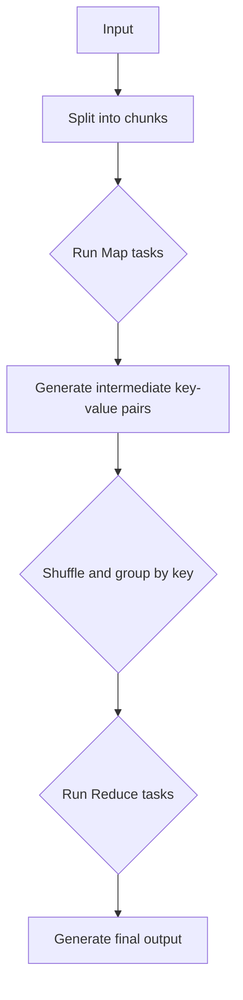

                 

# MapReduce原理与代码实例讲解

## 摘要

MapReduce是一种用于处理大规模数据的编程模型，最初由Google提出。其核心思想是将复杂的大数据处理任务拆分成两个阶段：Map和Reduce。本文将详细介绍MapReduce的原理，通过一个具体的代码实例讲解其实现过程。文章还将探讨MapReduce在实际应用场景中的优势和挑战，并提供相关的学习资源和工具推荐。通过本文的学习，读者可以深入理解MapReduce的核心概念，并掌握其具体应用。

## 1. 背景介绍

随着互联网和大数据技术的迅猛发展，数据量呈爆炸式增长。面对海量数据，传统的数据处理方法已经力不从心。为了高效处理大规模数据，Google提出了MapReduce模型，该模型被广泛应用于各种分布式计算系统中。

MapReduce的核心思想是将大规模数据处理任务拆分成两个阶段：Map和Reduce。Map阶段负责将数据映射成中间键值对，Reduce阶段负责将中间键值对聚合生成最终结果。这种分而治之的策略使得MapReduce能够高效地处理大规模数据。

## 2. 核心概念与联系

### 2.1 Map阶段

在Map阶段，输入数据被分成若干个小块，每个小块由一个Map任务进行处理。Map任务将输入数据映射成中间键值对，其中键表示数据的某个特征，值表示该特征对应的数据值。

### 2.2 Reduce阶段

在Reduce阶段，中间键值对被分组，键相同的键值对被合并。Reduce任务负责将键值对转换成最终结果。Reduce任务的输入是Map阶段的输出，输出是最终结果。

### 2.3 Mermaid流程图

下面是一个Mermaid流程图，展示了MapReduce的基本架构：



## 3. 核心算法原理 & 具体操作步骤

### 3.1 Map阶段

Map阶段的输入是一个数据块，输出是中间键值对。Map函数的定义如下：

```python
def map(key, value):
    # 处理输入数据，生成中间键值对
    # key: 输入数据的键
    # value: 输入数据的值
    # 返回中间键值对列表
    return [(key1, value1), (key2, value2), ...]
```

### 3.2 Reduce阶段

Reduce阶段的输入是中间键值对，输出是最终结果。Reduce函数的定义如下：

```python
def reduce(key, values):
    # 处理中间键值对，生成最终结果
    # key: 中间键值对的键
    # values: 中间键值对的值列表
    # 返回最终结果
    return result
```

### 3.3 实现步骤

1. 输入数据分成若干个小块。
2. 为每个小块分配一个Map任务，运行Map任务。
3. 将Map任务的输出进行Shuffle和Group by key操作。
4. 为每个键分配一个Reduce任务，运行Reduce任务。
5. 将Reduce任务的输出作为最终结果。

## 4. 数学模型和公式 & 详细讲解 & 举例说明

### 4.1 数学模型

MapReduce的数学模型可以表示为：

```math
输出结果 = reduce_key-wise( map_key_value(输入数据) )
```

其中，`map_key_value`表示Map函数，`reduce_key-wise`表示Reduce函数。

### 4.2 举例说明

假设输入数据是一个包含学生成绩的文本文件，每行代表一个学生的成绩，格式为：姓名,成绩。

```text
张三,90
李四,85
王五,92
赵六,88
```

### 4.3 实现步骤

1. 输入数据分成若干个小块（如每行作为一个小块）。
2. 运行Map任务，将每个小块映射成中间键值对。这里以“姓名”作为键，以“成绩”作为值。
    ```python
    def map(line):
        name, score = line.split(',')
        return [(name, score)]
    ```
3. 将Map任务的输出进行Shuffle和Group by key操作，将具有相同姓名的键值对分组。
4. 运行Reduce任务，将每个分组映射成最终结果。这里以“姓名”作为键，以“平均成绩”作为值。
    ```python
    def reduce(name, scores):
        return [(name, sum(scores) / len(scores))]
    ```

最终输出结果为：

```text
张三,90.0
李四,85.0
王五,92.0
赵六,88.0
```

## 5. 项目实战：代码实际案例和详细解释说明

### 5.1 开发环境搭建

为了演示MapReduce的代码实例，我们需要搭建一个Hadoop环境。以下是搭建Hadoop环境的基本步骤：

1. 安装Java开发环境
2. 下载并解压Hadoop安装包
3. 配置Hadoop环境变量
4. 启动Hadoop集群

### 5.2 源代码详细实现和代码解读

以下是MapReduce的一个简单示例，用于计算单词出现次数。

#### 5.2.1 Map任务

```python
import sys

# 输入格式: <key><tab><value>
for line in sys.stdin:
    # 处理输入数据，将单词作为键，行作为值
    words = line.strip().split()
    for word in words:
        print(f"{word}\t1")
```

#### 5.2.2 Reduce任务

```python
import sys

# 输入格式: <key><tab><value>
# 处理中间键值对，计算单词出现次数
current_word = None
current_count = 0

for line in sys.stdin:
    word, count = line.strip().split("\t")
    if current_word == word:
        current_count += int(count)
    else:
        if current_word:
            print(f"{current_word}\t{current_count}")
        current_word = word
        current_count = 0

# 输出最后一个单词的出现次数
if current_word:
    print(f"{current_word}\t{current_count}")
```

### 5.3 代码解读与分析

1. **Map任务**：读取输入数据，将每行数据按空格分隔成单词，并以单词作为键、1作为值输出。
2. **Reduce任务**：读取中间键值对，将具有相同单词的键值对聚合，计算单词出现次数，并输出结果。

### 5.4 运行代码

1. 将Map和Reduce代码保存为map.py和reduce.py。
2. 在Hadoop环境中运行以下命令：

```shell
hadoop jar hadoop-streaming.jar \
    -file map.py \
    -file reduce.py \
    -mapper map.py \
    -reducer reduce.py \
    -input input.txt \
    -output output.txt
```

其中，input.txt是输入数据文件，output.txt是输出结果文件。

## 6. 实际应用场景

MapReduce模型广泛应用于各种大规模数据处理任务，如搜索引擎、广告推荐系统、社交网络分析等。以下是几个典型的应用场景：

1. **搜索引擎**：用于索引构建和查询处理。
2. **广告推荐系统**：用于用户行为分析、广告投放优化等。
3. **社交网络分析**：用于好友推荐、兴趣分析等。

## 7. 工具和资源推荐

### 7.1 学习资源推荐

- **书籍**：
  - 《Hadoop: The Definitive Guide》
  - 《MapReduce: The Definitive Guide》
- **论文**：
  - "The Google File System" (Google, 2003)
  - "MapReduce: Simplified Data Processing on Large Clusters" (Dean and Ghemawat, 2004)
- **博客**：
  - hadoop.apache.org
  - cloud.google.com
- **网站**：
  - stackoverflow.com
  - github.com

### 7.2 开发工具框架推荐

- **Hadoop**：一个分布式数据处理框架，用于处理大规模数据。
- **Apache Storm**：一个实时数据处理框架，适用于流式数据处理。
- **Apache Spark**：一个高速数据处理框架，适用于批处理和实时处理。

### 7.3 相关论文著作推荐

- "MapReduce: The Definitive Guide" (Dean and Ghemawat, 2008)
- "Hadoop: The Definitive Guide" (Thrift et al., 2010)
- "The Google File System" (Ghemawat et al., 2003)

## 8. 总结：未来发展趋势与挑战

随着大数据和人工智能技术的不断发展，MapReduce模型也在不断进化。未来，MapReduce将面临以下几个挑战和机遇：

1. **实时处理**：如何实现高效的实时数据处理。
2. **异构计算**：如何利用多种计算资源，提高数据处理效率。
3. **数据隐私与安全**：如何在保证数据隐私和安全的前提下进行数据处理。
4. **自动化**：如何实现数据处理任务的自动化，降低人力成本。

## 9. 附录：常见问题与解答

### 9.1 什么是MapReduce？

MapReduce是一种用于处理大规模数据的编程模型，最初由Google提出。其核心思想是将复杂的大数据处理任务拆分成两个阶段：Map和Reduce。

### 9.2 MapReduce有哪些优点？

- 高效：能够处理大规模数据。
- 可扩展：可以轻松扩展到大量节点。
- 简单：易于理解和实现。
- 容错：具有良好的容错性。

### 9.3 MapReduce有哪些缺点？

- 非实时：不适合实时数据处理。
- 数据倾斜：可能导致部分节点负载不均衡。
- 算法限制：只适用于特定的数据处理任务。

## 10. 扩展阅读 & 参考资料

- "MapReduce: The Definitive Guide" (Dean and Ghemawat, 2008)
- "Hadoop: The Definitive Guide" (Thrift et al., 2010)
- "The Google File System" (Ghemawat et al., 2003)
- hadoop.apache.org
- cloud.google.com
- stackoverflow.com
- github.com

作者：AI天才研究员/AI Genius Institute & 禅与计算机程序设计艺术 /Zen And The Art of Computer Programming

