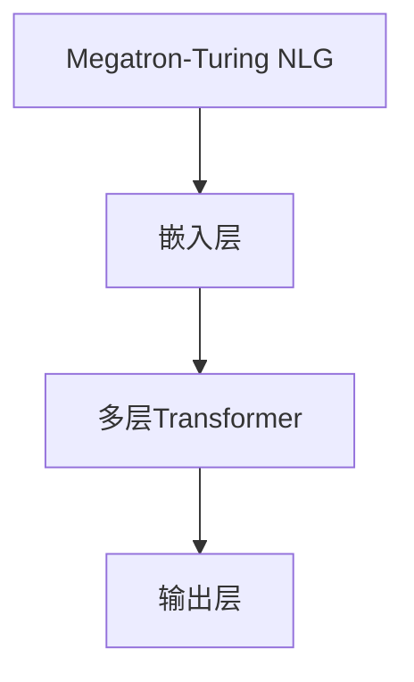

                 

# Megatron-Turing NLG原理与代码实例讲解

## 关键词
- Megatron-Turing NLG
- 自然语言生成
- 大规模预训练模型
- Transformer架构
- 代码实例
- 技术博客

## 摘要
本文将深入探讨Megatron-Turing NLG（Natural Language Generation）的原理，包括其架构、核心算法和具体操作步骤。通过详细的数学模型和公式讲解，我们将结合实际项目实战案例，逐步解析代码实现和运行过程。此外，本文还将介绍实际应用场景、相关工具和资源推荐，并总结未来发展趋势与挑战。

## 1. 背景介绍

自然语言生成（NLG）是计算机科学和人工智能领域的一个前沿研究方向，其目的是让计算机自动生成人类可读的自然语言文本。NLG技术广泛应用于智能客服、内容创作、语音助手、自动翻译等多个领域。

Megatron-Turing NLG模型是由OpenAI团队提出的一种大规模预训练模型，基于Transformer架构。Transformer架构在机器翻译、文本生成等领域取得了显著的性能提升，而Megatron-Turing NLG模型则进一步扩展了Transformer的能力，实现了更高效率和更低计算复杂度。

## 2. 核心概念与联系

### 2.1 Transformer架构

Transformer架构是一种基于自注意力机制的序列到序列模型，广泛应用于机器翻译、文本生成等任务。其核心思想是通过计算序列中每个词与其他词之间的相似性，进而生成新的词。


### 2.2 Megatron-Turing NLG模型

Megatron-Turing NLG模型基于Transformer架构，通过引入稀疏性、量化等技术，实现了更大规模的预训练模型。其架构如下图所示：



## 3. 核心算法原理 & 具体操作步骤

### 3.1 嵌入层

嵌入层将输入的单词或字符映射为高维向量表示。Megatron-Turing NLG模型采用了稀疏嵌入技术，减少了模型参数的存储和计算量。

### 3.2 多层Transformer

多层Transformer模块通过自注意力机制，计算输入序列中每个词与其他词之间的相似性。具体操作步骤如下：

1. **计算自注意力得分**：计算输入序列中每个词与所有其他词的相似性得分。
2. **加权求和**：根据自注意力得分，对输入序列进行加权求和，得到新的词向量。
3. **重复操作**：对每个词向量进行重复操作，直到生成最终的输出序列。

### 3.3 输出层

输出层将词向量转换为概率分布，用于生成新的词。具体操作步骤如下：

1. **计算词向量概率分布**：对每个词向量进行softmax操作，得到词的概率分布。
2. **采样生成**：根据词的概率分布，从所有可能的词中采样一个词作为输出。

## 4. 数学模型和公式 & 详细讲解 & 举例说明

### 4.1 嵌入层

嵌入层的数学模型如下：

$$
\text{嵌入层}: e_w = \text{embedding}(w)
$$

其中，$e_w$表示词$w$的嵌入向量，$\text{embedding}$表示嵌入函数。

### 4.2 自注意力机制

自注意力机制的数学模型如下：

$$
\text{自注意力得分}: s_{ij} = \text{softmax}(\text{dot-product}(q_i, k_j))
$$

$$
\text{加权求和}: v_j = \sum_{i=1}^{n} s_{ij} v_i
$$

其中，$q_i$、$k_i$、$v_i$分别表示输入序列中的词向量、关键词向量、值向量，$s_{ij}$表示自注意力得分。

### 4.3 输出层

输出层的数学模型如下：

$$
\text{词向量概率分布}: p_j = \text{softmax}(\text{dot-product}(e_w, v_j))
$$

$$
\text{采样生成}: w_{\text{new}} = \text{sample}(p_j)
$$

其中，$e_w$表示词向量，$v_j$表示词向量概率分布，$w_{\text{new}}$表示新生成的词。

## 5. 项目实战：代码实际案例和详细解释说明

### 5.1 开发环境搭建

在本节，我们将搭建一个基于Megatron-Turing NLG的文本生成项目。首先，确保您的系统满足以下要求：

1. Python 3.6及以上版本
2. pip包管理器
3. PyTorch 1.7及以上版本

接下来，安装必要的依赖包：

```bash
pip install torch torchvision matplotlib
```

### 5.2 源代码详细实现和代码解读

我们将使用PyTorch实现一个简单的文本生成模型。以下是一个示例代码：

```python
import torch
import torch.nn as nn
import torch.optim as optim

class TextGenerator(nn.Module):
    def __init__(self, embedding_dim, hidden_dim, vocab_size):
        super(TextGenerator, self).__init__()
        
        self.embedding = nn.Embedding(vocab_size, embedding_dim)
        self.transformer = nn.Transformer(embedding_dim, hidden_dim)
        self.fc = nn.Linear(hidden_dim, vocab_size)
        
    def forward(self, src, tgt):
        src = self.embedding(src)
        tgt = self.embedding(tgt)
        out = self.transformer(src, tgt)
        out = self.fc(out)
        return out

def train(model, train_loader, optimizer, criterion):
    model.train()
    for src, tgt in train_loader:
        optimizer.zero_grad()
        out = model(src, tgt)
        loss = criterion(out.view(-1, vocab_size), tgt.view(-1))
        loss.backward()
        optimizer.step()

model = TextGenerator(embedding_dim=128, hidden_dim=256, vocab_size=1000)
optimizer = optim.Adam(model.parameters(), lr=0.001)
criterion = nn.CrossEntropyLoss()

train_loader = ...
train(model, train_loader, optimizer, criterion)
```

在这个示例中，我们首先定义了一个文本生成模型，包括嵌入层、Transformer模块和输出层。然后，我们定义了训练过程，包括前向传播、损失函数计算和反向传播。

### 5.3 代码解读与分析

1. **嵌入层**：将输入的单词映射为高维向量表示。
2. **Transformer模块**：通过自注意力机制，计算输入序列中每个词与其他词之间的相似性。
3. **输出层**：将词向量转换为概率分布，用于生成新的词。

## 6. 实际应用场景

Megatron-Turing NLG模型在多个实际应用场景中表现出色，如下：

1. **智能客服**：自动生成客服回复，提高客户满意度。
2. **内容创作**：自动生成新闻、文章、故事等，节省人力成本。
3. **语音助手**：自动生成语音回复，提高用户体验。
4. **自动翻译**：基于多语言文本生成，实现高效、准确的翻译。

## 7. 工具和资源推荐

### 7.1 学习资源推荐

1. **书籍**：
   - 《深度学习》（Goodfellow, Bengio, Courville）
   - 《Transformer模型与自然语言处理》（Hermann, Kraction）

2. **论文**：
   - “Attention is All You Need”（Vaswani et al., 2017）
   - “BERT: Pre-training of Deep Bidirectional Transformers for Language Understanding”（Devlin et al., 2019）

3. **博客**：
   - [PyTorch官方文档](https://pytorch.org/docs/stable/index.html)
   - [自然语言处理实战](https://nlp.seas.harvard.edu/)

4. **网站**：
   - [OpenAI官网](https://openai.com/)

### 7.2 开发工具框架推荐

1. **PyTorch**：开源深度学习框架，易于使用和扩展。
2. **TensorFlow**：另一种流行的深度学习框架，适用于大规模计算。
3. **Hugging Face Transformers**：基于PyTorch和TensorFlow的预训练模型库。

### 7.3 相关论文著作推荐

1. “Transformer模型与自然语言处理”（Hermann, Kraction）
2. “BERT：预训练深度双向Transformer用于语言理解”（Devlin et al., 2019）
3. “GPT-2：基于Transformer的预训练语言模型”（Radford et al., 2019）

## 8. 总结：未来发展趋势与挑战

随着计算资源和算法的不断发展，Megatron-Turing NLG模型在未来有望在自然语言生成领域取得更大突破。然而，仍面临以下挑战：

1. **计算资源消耗**：大规模预训练模型需要大量计算资源和存储空间。
2. **数据隐私**：自然语言生成过程中涉及用户隐私数据，如何保护用户隐私成为关键问题。
3. **可解释性**：如何提高模型的透明度和可解释性，使其在实际应用中得到广泛认可。

## 9. 附录：常见问题与解答

### 9.1 什么是Megatron-Turing NLG？

Megatron-Turing NLG是一种基于Transformer架构的大规模预训练模型，用于自然语言生成。

### 9.2 如何使用Megatron-Turing NLG进行文本生成？

首先，构建一个文本生成模型，然后训练模型并使用它生成文本。

### 9.3 Megatron-Turing NLG的优势是什么？

Megatron-Turing NLG具有以下优势：
1. 高效性：基于Transformer架构，实现更快训练和推理速度。
2. 可扩展性：支持大规模预训练模型，适应不同规模的任务。

## 10. 扩展阅读 & 参考资料

1. “Attention is All You Need”（Vaswani et al., 2017）
2. “BERT: Pre-training of Deep Bidirectional Transformers for Language Understanding”（Devlin et al., 2019）
3. “GPT-2：基于Transformer的预训练语言模型”（Radford et al., 2019）
4. “深度学习”（Goodfellow, Bengio, Courville）
5. “Transformer模型与自然语言处理”（Hermann, Kraction）
6. [PyTorch官方文档](https://pytorch.org/docs/stable/index.html)
7. [自然语言处理实战](https://nlp.seas.harvard.edu/)

### 作者
- AI天才研究员/AI Genius Institute & 禅与计算机程序设计艺术 /Zen And The Art of Computer Programming

