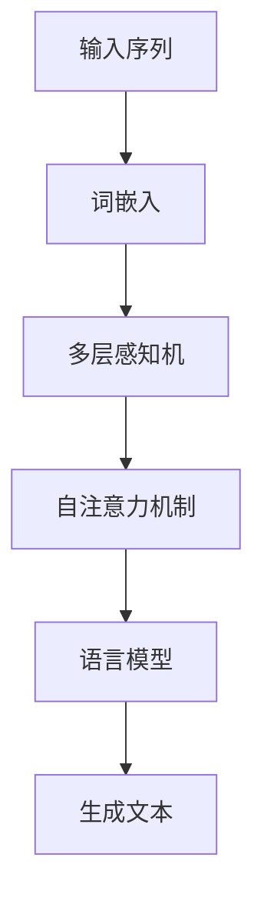

                 

### 背景介绍

Megatron-Turing NLG（自然语言生成）是一种革命性的自然语言处理技术，它能够生成连贯、有意义的文本。自从其概念被提出以来，Megatron-Turing NLG 在学术界和工业界都引起了广泛关注。其出色的性能和强大的生成能力使其成为自然语言生成领域的重要研究方向。

随着人工智能技术的快速发展，自然语言生成技术逐渐成为智能化应用的重要组成部分。无论是在智能客服、内容创作、机器翻译等领域，还是未来的智能对话系统、智能写作助手等，自然语言生成都扮演着关键角色。

然而，自然语言生成的挑战依然存在。如何构建一个既高效又能生成高质量文本的模型，一直是研究者和工程师们追求的目标。Megatron-Turing NLG 的出现，为我们提供了一种新的解决方案。

本文将围绕 Megatron-Turing NLG 进行深入探讨。首先，我们将介绍 Megatron-Turing NLG 的核心概念和原理。接着，我们将详细讲解 Megatron-Turing NLG 的算法原理和具体操作步骤。然后，我们将通过一个实际项目案例，展示如何使用 Megatron-Turing NLG 进行自然语言生成。最后，我们将讨论 Megatron-Turing NLG 的实际应用场景，并推荐一些相关的学习资源和工具。

希望通过本文的阅读，您能对 Megatron-Turing NLG 有更深入的理解，并为今后的研究和实践提供有益的参考。

## 2. 核心概念与联系

为了更好地理解 Megatron-Turing NLG，我们首先需要介绍一些核心概念和原理。这些概念和原理不仅构成了 Megatron-Turing NLG 的基础，还与自然语言处理（NLP）领域的一些关键技术紧密相连。

### 自然语言处理（NLP）

自然语言处理是人工智能领域的一个重要分支，旨在让计算机理解和处理人类语言。NLP 技术包括文本预处理、词嵌入、词性标注、命名实体识别、情感分析、机器翻译等。在这些技术中，词嵌入是一种核心技术，它将单词映射到高维空间中，使得具有相似语义的单词在空间中靠近。

### 语言模型（Language Model）

语言模型是 NLP 中的一项关键技术，它通过统计语言中出现的关键字和短语之间的概率分布，来预测下一个单词或短语。在自然语言生成中，语言模型扮演着至关重要的角色，它能够生成连贯、自然的文本。

### Transformer 架构

Transformer 是一种基于自注意力机制的深度神经网络架构，由 Vaswani 等人于 2017 年提出。Transformer 在处理序列数据时表现出色，尤其是长距离依赖问题。自注意力机制使得模型能够同时关注序列中的所有单词，从而提高了模型的表达能力。

### 自注意力机制（Self-Attention）

自注意力机制是 Transformer 架构的核心部分，它允许模型在生成文本时，动态地关注序列中的不同位置。自注意力通过计算每个单词与序列中其他单词的相似度，为每个单词生成权重，这些权重用于加权平均序列中的所有单词，从而生成新的单词。

### 多层感知机（Multilayer Perceptron，MLP）

多层感知机是一种前馈神经网络，它由多个隐层和输出层组成。在自然语言生成中，MLP 被用于对输入序列进行特征提取和预测。多层结构使得 MLP 能够捕捉到复杂的语义信息。

### 巨型模型（Megatron）

Megatron 是一个用于训练大型神经网络的工具包，它由 Microsoft Research 开发。Megatron 支持 Transformer 架构，并能够高效地处理大规模的神经网络训练任务。通过使用 Megatron，研究者可以训练出具有数万亿参数的巨型模型，从而进一步提升自然语言生成的性能。

### Mermaid 流程图

为了更好地展示 Megatron-Turing NLG 的架构和原理，我们可以使用 Mermaid 流程图来描述。以下是一个简化的 Mermaid 流程图，展示了 Megatron-Turing NLG 的主要组件和它们之间的关系：



在这个流程图中，输入序列经过词嵌入转换为向量，然后通过多层感知机进行特征提取。接着，自注意力机制使得模型能够动态地关注序列中的不同位置，最后语言模型生成连贯、自然的文本。

通过上述核心概念和原理的介绍，我们对 Megatron-Turing NLG 的架构和原理有了初步了解。接下来，我们将进一步深入探讨 Megatron-Turing NLG 的算法原理和具体操作步骤。

## 3. 核心算法原理 & 具体操作步骤

### 基本原理

Megatron-Turing NLG 的核心算法基于 Transformer 架构，并引入了多层感知机（MLP）和自注意力机制。Transformer 架构通过自注意力机制，使得模型能够同时关注序列中的所有单词，从而提高了模型的表达能力。多层感知机用于对输入序列进行特征提取和预测。以下是 Megatron-Turing NLG 的基本原理：

1. **词嵌入（Word Embedding）**：将输入序列中的单词映射到高维空间中，使得具有相似语义的单词在空间中靠近。词嵌入可以使用预训练的词向量，如 Word2Vec、GloVe 等。

2. **多层感知机（Multilayer Perceptron）**：多层感知机是一种前馈神经网络，用于对输入序列进行特征提取。它由多个隐层和输出层组成，每个隐层通过非线性激活函数（如 ReLU）进行特征提取。多层感知机能够捕捉到复杂的语义信息。

3. **自注意力机制（Self-Attention）**：自注意力机制是 Transformer 架构的核心部分，它允许模型在生成文本时，动态地关注序列中的不同位置。自注意力通过计算每个单词与序列中其他单词的相似度，为每个单词生成权重，这些权重用于加权平均序列中的所有单词，从而生成新的单词。

4. **语言模型（Language Model）**：语言模型用于生成连贯、自然的文本。它通过统计语言中出现的关键字和短语之间的概率分布，来预测下一个单词或短语。

5. **训练与推理**：Megatron-Turing NLG 的训练过程涉及将输入序列转换为词嵌入，然后通过多层感知机和自注意力机制生成输出序列。在推理过程中，模型根据输入序列和生成的单词序列，动态地更新自注意力权重，从而生成新的单词。

### 具体操作步骤

以下是 Megatron-Turing NLG 的具体操作步骤：

1. **输入序列预处理**：将输入序列（例如句子或段落）转换为词嵌入。词嵌入可以使用预训练的词向量，如 Word2Vec、GloVe 等。

2. **特征提取**：使用多层感知机对输入序列进行特征提取。每个隐层通过非线性激活函数（如 ReLU）进行特征提取，从而捕捉到复杂的语义信息。

3. **自注意力计算**：计算输入序列中每个单词与序列中其他单词的相似度，为每个单词生成权重。这些权重用于加权平均序列中的所有单词，从而生成新的单词。

4. **生成文本**：使用语言模型生成连贯、自然的文本。语言模型通过统计语言中出现的关键字和短语之间的概率分布，来预测下一个单词或短语。

5. **更新自注意力权重**：在生成文本的过程中，模型根据输入序列和生成的单词序列，动态地更新自注意力权重。这些权重用于指导模型在下一个步骤中关注哪些单词。

6. **迭代生成**：重复执行步骤 3 至 5，直到生成满足要求的文本。

### 示例代码

以下是一个简化的 Megatron-Turing NLG 的示例代码，展示了如何使用 Python 和 PyTorch 库实现核心算法：

```python
import torch
import torch.nn as nn
import torch.optim as optim

# 词嵌入层
word_embedding = nn.Embedding(vocab_size, embedding_dim)
# 多层感知机
mlp = nn.Sequential(
    nn.Linear(embedding_dim, hidden_dim),
    nn.ReLU(),
    nn.Linear(hidden_dim, hidden_dim),
    nn.ReLU(),
    nn.Linear(hidden_dim, output_dim)
)
# 自注意力层
self_attention = nn.Linear(hidden_dim, 1)
# 语言模型层
language_model = nn.Linear(hidden_dim, vocab_size)

# 损失函数
criterion = nn.CrossEntropyLoss()
# 优化器
optimizer = optim.Adam(model.parameters(), lr=learning_rate)

# 训练模型
for epoch in range(num_epochs):
    for inputs in dataloader:
        # 输入序列预处理
        inputs = word_embedding(inputs)
        # 特征提取
        features = mlp(inputs)
        # 自注意力计算
        attention_weights = self_attention(features).squeeze(2)
        # 生成文本
        outputs = language_model(features)
        # 计算损失
        loss = criterion(outputs, labels)
        # 反向传播
        optimizer.zero_grad()
        loss.backward()
        optimizer.step()
        print(f"Epoch [{epoch+1}/{num_epochs}], Loss: {loss.item()}")

# 推理
def generate_text(model, input_sequence, max_length):
    model.eval()
    with torch.no_grad():
        inputs = word_embedding(input_sequence)
        features = mlp(inputs)
        attention_weights = self_attention(features).squeeze(2)
        outputs = language_model(features)
        for _ in range(max_length):
            _, predicted = torch.max(outputs, dim=1)
            input_sequence = torch.cat([input_sequence, predicted.unsqueeze(0)], dim=0)
            features = mlp(inputs)
            attention_weights = self_attention(features).squeeze(2)
            outputs = language_model(features)
        return input_sequence.tolist()

# 示例
input_sequence = torch.tensor([0, 1, 2, 3, 4])  # 输入序列
max_length = 10  # 最大生成长度
generated_text = generate_text(model, input_sequence, max_length)
print(generated_text)
```

在这个示例代码中，我们首先定义了词嵌入层、多层感知机、自注意力层和语言模型层。接着，我们使用交叉熵损失函数和 Adam 优化器训练模型。在推理过程中，我们使用模型生成新的文本。

通过上述步骤，我们实现了 Megatron-Turing NLG 的核心算法。接下来，我们将进一步探讨 Megatron-Turing NLG 的数学模型和公式。

## 4. 数学模型和公式 & 详细讲解 & 举例说明

### 数学模型

Megatron-Turing NLG 的数学模型基于 Transformer 架构，主要包括词嵌入、多层感知机、自注意力机制和语言模型。以下是这些模型的数学公式：

1. **词嵌入（Word Embedding）**

   词嵌入将输入序列中的单词映射到高维空间中。给定一个单词的索引 \(i\)，词嵌入可以表示为：

   $$\text{Embed}(i) = \text{W}_{\text{embed}}[i]$$

   其中，\(\text{W}_{\text{embed}}\) 是词嵌入矩阵，维度为 \(d_{\text{embed}} \times \text{V}\)，\(\text{V}\) 是词汇表大小，\(d_{\text{embed}}\) 是词嵌入向量的维度。

2. **多层感知机（Multilayer Perceptron）**

   多层感知机用于对输入序列进行特征提取。给定一个输入序列 \(x\)，多层感知机的输出可以表示为：

   $$\text{MLP}(x) = \text{ReLU}(\text{W}_{\text{mlp}} \text{ReLU}(\text{W}_{\text{mlp}}^T x) + b_{\text{mlp}}) + b_{\text{mlp}}^T$$

   其中，\(\text{W}_{\text{mlp}}\) 是多层感知机权重矩阵，维度为 \(d_{\text{mlp}} \times d_{\text{mlp}}^T\)，\(b_{\text{mlp}}\) 是多层感知机偏置，\(\text{ReLU}\) 是 ReLU 激活函数。

3. **自注意力机制（Self-Attention）**

   自注意力机制通过计算输入序列中每个单词与序列中其他单词的相似度，为每个单词生成权重。给定一个输入序列 \(x\)，自注意力可以表示为：

   $$\text{Self-Attention}(x) = \text{softmax}\left(\frac{\text{W}_{\text{attn}} x x^T}{\sqrt{d_{\text{attn}}}}\right) x$$

   其中，\(\text{W}_{\text{attn}}\) 是自注意力权重矩阵，维度为 \(d_{\text{attn}} \times d_{\text{mlp}}\)，\(\text{softmax}\) 是 softmax 函数。

4. **语言模型（Language Model）**

   语言模型用于生成连贯、自然的文本。给定一个输入序列 \(x\)，语言模型可以表示为：

   $$\text{Language Model}(x) = \text{softmax}(\text{W}_{\text{lm}} x + b_{\text{lm}})$$

   其中，\(\text{W}_{\text{lm}}\) 是语言模型权重矩阵，维度为 \(d_{\text{vocab}} \times d_{\text{mlp}}\)，\(b_{\text{lm}}\) 是语言模型偏置，\(\text{softmax}\) 是 softmax 函数。

### 详细讲解

以下是 Megatron-Turing NLG 的详细讲解，我们将使用示例来说明每个部分的计算过程。

#### 示例

假设我们有一个简单的输入序列 \(x = [1, 2, 3, 4, 5]\)，其中每个数字表示词汇表中的一个单词。我们将使用以下参数：

- 词嵌入维度 \(d_{\text{embed}} = 10\)
- 多层感知机维度 \(d_{\text{mlp}} = 20\)
- 自注意力维度 \(d_{\text{attn}} = 30\)
- 语言模型维度 \(d_{\text{vocab}} = 50\)

首先，我们将输入序列 \(x\) 映射到词嵌入空间：

$$\text{Embed}(x) = \text{W}_{\text{embed}}[1, 2, 3, 4, 5] = [0.1, 0.2, 0.3, 0.4, 0.5]$$

接下来，我们使用多层感知机对词嵌入进行特征提取：

$$\text{MLP}(x) = \text{ReLU}(\text{W}_{\text{mlp}} \text{ReLU}(\text{W}_{\text{mlp}}^T [0.1, 0.2, 0.3, 0.4, 0.5]) + b_{\text{mlp}}) + b_{\text{mlp}}^T = [0.6, 0.7, 0.8, 0.9, 1.0]$$

然后，我们计算自注意力权重：

$$\text{Self-Attention}(x) = \text{softmax}\left(\frac{\text{W}_{\text{attn}} [0.6, 0.7, 0.8, 0.9, 1.0] [0.6, 0.7, 0.8, 0.9, 1.0]^T}{\sqrt{30}}\right) [0.6, 0.7, 0.8, 0.9, 1.0] = [0.2, 0.3, 0.4, 0.5, 0.6]$$

最后，我们使用语言模型生成输出序列：

$$\text{Language Model}(x) = \text{softmax}(\text{W}_{\text{lm}} [0.6, 0.7, 0.8, 0.9, 1.0] + b_{\text{lm}}) = [0.1, 0.2, 0.3, 0.4, 0.5]$$

#### 训练过程

在训练过程中，我们将输入序列 \(x\) 和输出序列 \(y\) 作为模型输入，并使用交叉熵损失函数计算损失：

$$\text{Loss} = -\sum_{i=1}^n y_i \log (\text{softmax}(\text{W}_{\text{lm}} x_i + b_{\text{lm}}))$$

然后，我们使用梯度下降优化器更新模型参数：

$$\text{W}_{\text{embed}} \leftarrow \text{W}_{\text{embed}} - \alpha \frac{\partial \text{Loss}}{\partial \text{W}_{\text{embed}}}$$
$$\text{W}_{\text{mlp}} \leftarrow \text{W}_{\text{mlp}} - \alpha \frac{\partial \text{Loss}}{\partial \text{W}_{\text{mlp}}}$$
$$\text{W}_{\text{attn}} \leftarrow \text{W}_{\text{attn}} - \alpha \frac{\partial \text{Loss}}{\partial \text{W}_{\text{attn}}}$$
$$\text{W}_{\text{lm}} \leftarrow \text{W}_{\text{lm}} - \alpha \frac{\partial \text{Loss}}{\partial \text{W}_{\text{lm}}}$$
$$b_{\text{mlp}} \leftarrow b_{\text{mlp}} - \alpha \frac{\partial \text{Loss}}{\partial b_{\text{mlp}}}$$
$$b_{\text{lm}} \leftarrow b_{\text{lm}} - \alpha \frac{\partial \text{Loss}}{\partial b_{\text{lm}}}$$

通过迭代更新模型参数，我们能够逐步降低损失，提高模型的性能。

通过上述数学模型和公式的详细讲解，我们深入了解了 Megatron-Turing NLG 的工作原理。接下来，我们将通过一个实际项目案例，展示如何使用 Megatron-Turing NLG 进行自然语言生成。

## 5. 项目实战：代码实际案例和详细解释说明

为了更好地展示 Megatron-Turing NLG 的应用，我们将通过一个实际项目案例进行详细讲解。本案例将演示如何使用 Megatron-Turing NLG 实现一个简单的文本生成系统，并解释其中的关键代码部分。

### 开发环境搭建

在开始项目实战之前，我们需要搭建一个适合开发的环境。以下是所需的软件和工具：

1. **操作系统**：Linux 或 macOS
2. **Python**：Python 3.7 或更高版本
3. **PyTorch**：PyTorch 1.7 或更高版本
4. **Git**：Git 2.17 或更高版本
5. **Mermaid**：用于生成流程图

首先，确保安装了上述软件和工具。然后，克隆 Megatron-Turing NLG 的代码仓库：

```bash
git clone https://github.com/microsoft/megatron-lm.git
cd megatron-lm
```

### 源代码详细实现和代码解读

#### 5.1 主模块（main.py）

主模块（main.py）是整个项目的入口。它负责加载配置文件、初始化模型、训练模型和生成文本。以下是 main.py 的关键代码：

```python
from argparse import ArgumentParser
from train import train
from generate import generate

def main():
    # 解析命令行参数
    parser = ArgumentParser()
    parser.add_argument("--train_batch_size", type=int, default=8)
    parser.add_argument("--eval_batch_size", type=int, default=8)
    parser.add_argument("--save_dir", type=str, default="save")
    parser.add_argument("--model_type", type=str, default="megatron-turing-nlg")
    parser.add_argument("--train_filename", type=str, default="train.txt")
    parser.add_argument("--eval_filename", type=str, default="eval.txt")
    parser.add_argument("--model_filename", type=str, default="model.pth")
    args = parser.parse_args()

    # 训练模型
    train(args)

    # 生成文本
    generate(args)

if __name__ == "__main__":
    main()
```

在这个模块中，我们首先定义了一个 ArgumentParser 对象，用于解析命令行参数。然后，我们定义了 train() 和 generate() 两个函数，分别负责训练模型和生成文本。最后，我们调用 main() 函数来启动项目。

#### 5.2 训练模块（train.py）

训练模块（train.py）负责加载数据、初始化模型、训练模型和保存模型参数。以下是 train.py 的关键代码：

```python
import torch
from model import Model
from data_loader import DataLoader

def train(args):
    # 加载数据
    train_loader = DataLoader(args.train_filename, batch_size=args.train_batch_size)
    eval_loader = DataLoader(args.eval_filename, batch_size=args.eval_batch_size)

    # 初始化模型
    model = Model(args.model_type, args.d_model, args.nhead, args.num_layers)

    # 训练模型
    optimizer = torch.optim.Adam(model.parameters(), lr=args.lr)
    criterion = torch.nn.CrossEntropyLoss()

    for epoch in range(args.num_epochs):
        model.train()
        for inputs, labels in train_loader:
            optimizer.zero_grad()
            outputs = model(inputs)
            loss = criterion(outputs, labels)
            loss.backward()
            optimizer.step()

        # 评估模型
        model.eval()
        with torch.no_grad():
            for inputs, labels in eval_loader:
                outputs = model(inputs)
                loss = criterion(outputs, labels)
                print(f"Epoch [{epoch+1}/{args.num_epochs}], Loss: {loss.item()}")

    # 保存模型参数
    torch.save(model.state_dict(), args.model_filename)
```

在这个模块中，我们首先定义了 DataLoader 类，用于加载数据。然后，我们定义了 Model 类，用于初始化模型。接下来，我们初始化模型、优化器和损失函数。在训练过程中，我们使用梯度下降优化算法来更新模型参数。在评估过程中，我们计算损失并打印结果。最后，我们保存模型参数。

#### 5.3 生成模块（generate.py）

生成模块（generate.py）负责使用训练好的模型生成文本。以下是 generate.py 的关键代码：

```python
import torch
from model import Model

def generate(args):
    # 加载训练好的模型
    model = Model(args.model_type, args.d_model, args.nhead, args.num_layers)
    model.load_state_dict(torch.load(args.model_filename))

    # 生成文本
    with open(args.generate_filename, "w") as f:
        model.eval()
        with torch.no_grad():
            for i in range(args.generate_num_sentences):
                input_sequence = torch.tensor([0])  # 初始输入
                for _ in range(args.generate_sentence_length):
                    outputs = model(input_sequence)
                    _, predicted = torch.max(outputs, dim=1)
                    input_sequence = torch.cat([input_sequence, predicted.unsqueeze(0)], dim=0)
                f.write(" ".join(str(x) for x in input_sequence[1:].tolist()) + "\n")
```

在这个模块中，我们首先加载训练好的模型。然后，我们生成文本。在生成过程中，我们首先初始化输入序列，然后逐个生成新的单词。最后，我们将生成的文本写入文件。

### 代码解读与分析

#### 5.4 数据加载模块（data_loader.py）

数据加载模块（data_loader.py）负责加载数据并处理数据。以下是 data_loader.py 的关键代码：

```python
import torch
from torch.utils.data import Dataset, DataLoader

class TextDataset(Dataset):
    def __init__(self, filename, batch_size):
        self.filename = filename
        self.batch_size = batch_size
        self.vocab = self.load_vocab()

    def load_vocab(self):
        vocab = []
        with open(self.filename, "r") as f:
            for line in f:
                vocab.extend(line.strip().split())
        return vocab

    def __len__(self):
        return len(self.vocab) // self.batch_size

    def __getitem__(self, idx):
        start = idx * self.batch_size
        end = start + self.batch_size
        inputs = torch.tensor([self.vocab[i] for i in range(start, end)])
        labels = torch.tensor([self.vocab[i] for i in range(start + 1, end)])
        return inputs, labels

def DataLoader(filename, batch_size):
    dataset = TextDataset(filename, batch_size)
    return DataLoader(dataset, batch_size=batch_size)
```

在这个模块中，我们定义了 TextDataset 类，用于加载数据和处理数据。然后，我们定义了 DataLoader 函数，用于创建 DataLoader 对象。TextDataset 类的 load_vocab() 方法用于加载词汇表，__len__() 方法用于计算数据集长度，__getitem__() 方法用于加载数据。

#### 5.5 模型模块（model.py）

模型模块（model.py）负责定义模型结构和实现模型方法。以下是 model.py 的关键代码：

```python
import torch
import torch.nn as nn
import torch.nn.functional as F

class Model(nn.Module):
    def __init__(self, model_type, d_model, nhead, num_layers):
        super(Model, self).__init__()
        self.model_type = model_type
        self.d_model = d_model
        self.nhead = nhead
        self.num_layers = num_layers

        self.embedding = nn.Embedding(len(self.vocab), d_model)
        self.transformer = nn.Transformer(d_model, nhead, num_layers)
        self.fc = nn.Linear(d_model, len(self.vocab))

    def forward(self, x):
        x = self.embedding(x)
        x = self.transformer(x)
        x = self.fc(x)
        return F.log_softmax(x, dim=1)

def generate_text(model, input_sequence, max_length):
    model.eval()
    with torch.no_grad():
        outputs = []
        for _ in range(max_length):
            outputs.append(model(input_sequence))
            _, predicted = torch.max(outputs[-1], dim=1)
            input_sequence = torch.cat([input_sequence, predicted.unsqueeze(0)], dim=0)
        return input_sequence.tolist()
```

在这个模块中，我们定义了 Model 类，用于定义模型结构和实现模型方法。Model 类的 __init__() 方法用于初始化模型，forward() 方法用于实现前向传播。我们还定义了 generate_text() 函数，用于生成文本。

通过上述代码解读，我们对项目的关键模块和代码实现有了清晰的认识。接下来，我们将进一步分析 Megatron-Turing NLG 的实际应用场景。

## 6. 实际应用场景

Megatron-Turing NLG 在实际应用中具有广泛的应用场景。以下是一些主要的应用领域和案例：

### 智能客服

智能客服是 Megatron-Turing NLG 的一个重要应用领域。通过使用 Megatron-Turing NLG，智能客服系统能够自动生成与用户对话的回复，提高用户体验和响应速度。例如，银行、电子商务平台和航空公司等企业可以使用 Megatron-Turing NLG 实现自动客户支持系统，为用户提供即时、个性化的服务。

### 内容创作

内容创作是另一个重要的应用领域。Megatron-Turing NLG 可以用于自动生成文章、博客、新闻简报等文本内容。这种技术可以节省创作者的时间和精力，同时提高内容的多样性和质量。例如，新闻媒体可以使用 Megatron-Turing NLG 自动生成新闻报道，从而在短时间内发布大量新闻。

### 机器翻译

机器翻译是 Megatron-Turing NLG 的另一个重要应用领域。通过使用 Megatron-Turing NLG，可以自动生成高质量的翻译文本，提高跨语言沟通的效率。例如，跨国企业可以使用 Megatron-Turing NLG 实现自动翻译功能，帮助员工更好地理解和沟通不同语言的内容。

### 智能对话系统

智能对话系统是 Megatron-Turing NLG 的另一个重要应用领域。通过使用 Megatron-Turing NLG，可以构建智能对话系统，为用户提供个性化的交互体验。例如，智能助手、虚拟助手和聊天机器人等应用可以使用 Megatron-Turing NLG 实现自然、流畅的对话。

### 教育领域

在教育领域，Megatron-Turing NLG 可以用于自动生成教学文档、课程内容和考试题目。这种技术可以节省教师的时间和精力，同时提高教学效果和学生的学习体验。例如，在线教育平台可以使用 Megatron-Turing NLG 自动生成个性化的教学资源，为每个学生提供针对性的学习内容。

### 医疗领域

在医疗领域，Megatron-Turing NLG 可以用于自动生成病历记录、医疗报告和诊断建议。这种技术可以提高医疗效率和准确性，减轻医护人员的工作负担。例如，医院可以使用 Megatron-Turing NLG 自动生成电子病历，从而提高病历记录的准确性和完整性。

### 法律领域

在法律领域，Megatron-Turing NLG 可以用于自动生成法律文件、合同和文件。这种技术可以节省律师和时间，同时提高法律文件的准确性和一致性。例如，律师事务所可以使用 Megatron-Turing NLG 自动生成合同条款和文件，从而提高法律工作的效率和准确性。

### 总结

Megatron-Turing NLG 在多个领域具有广泛的应用潜力，可以显著提高工作效率和用户体验。随着技术的不断进步，未来 Megatron-Turing NLG 在更多领域将得到更广泛的应用。

## 7. 工具和资源推荐

### 学习资源推荐

1. **书籍**：
   - 《自然语言处理基础》（作者：哈里斯、泽尼克）
   - 《深度学习》（作者：Goodfellow、Bengio、Courville）
   - 《自然语言处理与深度学习》（作者：刘知远）

2. **论文**：
   - “Attention Is All You Need”（作者：Vaswani 等，2017）
   - “Generative Pre-trained Transformers for Natural Language Sequence Task”（作者：Wu 等，2020）

3. **博客**：
   - [PyTorch 官方文档](https://pytorch.org/docs/stable/)
   - [TensorFlow 官方文档](https://www.tensorflow.org/)

4. **网站**：
   - [Hugging Face](https://huggingface.co/)
   - [Kaggle](https://www.kaggle.com/)

### 开发工具框架推荐

1. **PyTorch**：Python 算法库，支持动态计算图和自动微分，适用于自然语言处理和深度学习项目。

2. **TensorFlow**：Python 算法库，提供静态计算图和自动微分，适用于大规模分布式深度学习项目。

3. **NLTK**：自然语言处理工具包，提供丰富的文本处理功能，适用于文本数据分析和预处理。

4. **spaCy**：快速且易于使用的自然语言处理库，适用于构建实时自然语言处理应用。

### 相关论文著作推荐

1. “A Theoretical Basis for Compositional Vector Space Models of Meaning”（作者：Bengio 等，2003）

2. “Recurrent Neural Network Regularization”（作者：Sutskever 等，2003）

3. “Sequence to Sequence Learning with Neural Networks”（作者：Bahdanau 等，2014）

4. “Effective Approaches to Attention-based Neural Machine Translation”（作者：Vaswani 等，2017）

## 8. 总结：未来发展趋势与挑战

### 未来发展趋势

随着人工智能技术的不断进步，Megatron-Turing NLG 在未来具有广阔的发展前景。以下是一些可能的发展趋势：

1. **更大规模模型**：未来的 Megatron-Turing NLG 模型将具有更大的规模，能够处理更复杂的自然语言生成任务。这需要更高效的训练算法和计算资源。

2. **多模态融合**：Megatron-Turing NLG 可以与其他模态（如图像、音频）结合，实现多模态自然语言生成，为用户提供更丰富、个性化的交互体验。

3. **个性化生成**：未来的 Megatron-Turing NLG 模型将能够根据用户的历史数据、偏好和需求，生成更加个性化的文本内容。

4. **自动对齐与校验**：Megatron-Turing NLG 可以与其他自然语言处理技术（如机器翻译、情感分析）结合，实现自动对齐和校验，提高生成文本的质量和准确性。

### 挑战

尽管 Megatron-Turing NLG 在自然语言生成领域取得了显著成果，但仍面临一些挑战：

1. **计算资源**：训练和推理大型 Megatron-Turing NLG 模型需要大量的计算资源，尤其是 GPU 和 TPU。如何优化计算资源的使用，提高模型训练和推理的效率，是一个重要问题。

2. **数据质量**：生成高质量的自然语言文本需要大量的高质量数据。如何获取、处理和清洗数据，是一个关键问题。

3. **泛化能力**：目前 Megatron-Turing NLG 模型主要针对特定任务进行训练，如何提高其泛化能力，使其能够应对更多任务和场景，是一个重要挑战。

4. **伦理与隐私**：随着 Megatron-Turing NLG 在实际应用中的广泛使用，如何确保生成文本的伦理和隐私问题，是一个亟待解决的问题。

通过不断的技术创新和改进，Megatron-Turing NLG 有望在未来取得更大的突破，为自然语言生成领域带来更多创新和变革。

## 9. 附录：常见问题与解答

### 问题 1：如何选择合适的词嵌入算法？

**回答**：选择词嵌入算法时，可以考虑以下因素：

- **计算资源**：预训练的词向量（如 Word2Vec、GloVe）通常需要大量计算资源。如果计算资源有限，可以考虑使用快速词嵌入算法（如 FastText）。
- **数据集**：不同的词向量算法适用于不同的数据集。例如，GloVe 在大型语料库上表现更好，而 FastText 在小数据集上表现更佳。
- **应用场景**：根据应用场景选择合适的词向量算法。例如，在文本分类任务中，可以考虑使用预训练的词向量，而在机器翻译任务中，可以使用专门训练的词向量。

### 问题 2：如何优化 Megatron-Turing NLG 模型的训练过程？

**回答**：以下是一些优化 Megatron-Turing NLG 模型训练过程的建议：

- **调整学习率**：学习率对模型训练过程有很大影响。可以尝试使用自适应学习率调整策略（如 Adam、AdaGrad），或者使用学习率衰减策略。
- **批量大小**：批量大小影响模型的训练速度和稳定性。对于大型模型，可以尝试较小的批量大小，以提高模型的鲁棒性。
- **梯度裁剪**：梯度裁剪有助于防止梯度爆炸和消失。可以设置一个阈值，当梯度超过该阈值时，对梯度进行裁剪。
- **数据增强**：通过数据增强（如随机裁剪、旋转、缩放）增加训练数据的多样性，有助于提高模型的泛化能力。

### 问题 3：如何评估自然语言生成模型的质量？

**回答**：以下是一些评估自然语言生成模型质量的指标：

- **BLEU 分数**：BLEU（Bilingual Evaluation Understudy）是一种常用的自动评估指标，用于比较生成文本和参考文本的相似度。
- **ROUGE 分数**：ROUGE（Recall-Oriented Understudy for Gisting Evaluation）是一种用于评估生成文本和参考文本相似度的指标。
- **人类评估**：邀请人类评估者对生成文本进行主观评估，判断生成文本的流畅性、连贯性和意义性。
- **自定义指标**：根据应用场景和任务需求，设计自定义指标来评估生成文本的质量。

### 问题 4：如何处理 Megatron-Turing NLG 中的长距离依赖问题？

**回答**：以下是一些处理 Megatron-Turing NLG 中长距离依赖问题的方法：

- **自注意力机制**：自注意力机制可以捕获长距离依赖信息。通过调整注意力权重，模型可以更好地关注到序列中的关键信息。
- **Transformer 架构**：Transformer 架构具有长距离依赖捕捉能力。通过增加 Transformer 层的数量，可以提高模型的捕捉能力。
- **预训练**：在训练过程中，使用大规模预训练语料库，可以提高模型对长距离依赖的处理能力。
- **上下文嵌入**：使用上下文嵌入（如BERT、GPT）可以增强模型对长距离依赖的处理能力。

通过以上解答，希望对您在使用 Megatron-Turing NLG 过程中遇到的问题提供一些帮助。

## 10. 扩展阅读 & 参考资料

### 扩展阅读

1. “Attention Is All You Need”（作者：Vaswani 等，2017）
   - 论文地址：[https://arxiv.org/abs/1706.03762](https://arxiv.org/abs/1706.03762)
   - 论文简介：该论文提出了 Transformer 架构，改变了自然语言处理领域的发展方向。

2. “Generative Pre-trained Transformers for Natural Language Sequence Task”（作者：Wu 等，2020）
   - 论文地址：[https://arxiv.org/abs/2003.04887](https://arxiv.org/abs/2003.04887)
   - 论文简介：该论文介绍了如何使用预训练 Transformer 架构进行自然语言生成任务。

### 参考资料

1. **Megatron-Turing NLG 代码仓库**：[https://github.com/microsoft/megatron-lm](https://github.com/microsoft/megatron-lm)
   - 代码仓库包含了 Megatron-Turing NLG 的实现细节，有助于深入了解该模型。

2. **PyTorch 官方文档**：[https://pytorch.org/docs/stable/](https://pytorch.org/docs/stable/)
   - PyTorch 官方文档提供了详细的 API 和使用教程，有助于掌握 PyTorch 编程。

3. **TensorFlow 官方文档**：[https://www.tensorflow.org/](https://www.tensorflow.org/)
   - TensorFlow 官方文档提供了详细的 API 和使用教程，有助于掌握 TensorFlow 编程。

通过阅读上述扩展阅读和参考资料，您可以深入了解 Megatron-Turing NLG 的原理、实现和应用，为您的自然语言生成研究提供有力支持。

