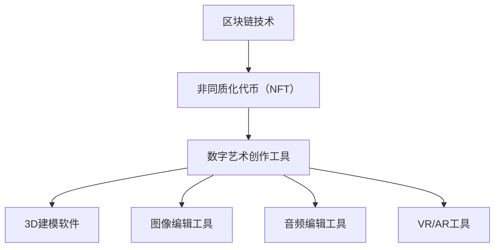

                 

### 背景介绍

随着互联网技术的不断进步，数字艺术创作逐渐成为艺术产业的重要组成部分。在过去的几十年里，计算机图形学、虚拟现实和增强现实等技术的发展，为艺术家提供了前所未有的创作工具和平台。然而，随着区块链技术的兴起，尤其是非同质化代币（NFT）的问世，艺术产业正迎来一场前所未有的变革。

NFT，全称为“Non-Fungible Token”，即非同质化代币，是一种基于区块链技术的数字资产，每个NFT都是独一无二的，无法与其他代币互换。这种独特性赋予了NFT在数字艺术创作和交易中的特殊地位，成为艺术产业创新应用的重要载体。

数字艺术创作工具，则是指那些专门用于数字艺术创作的软件和应用，如3D建模软件、图像编辑工具、音频编辑软件等。这些工具能够帮助艺术家将创意转化为数字形式，并通过NFT技术进行版权保护和价值传递。

本文将探讨NFT数字艺术创作工具在艺术产业中的应用，分析其核心概念、算法原理、数学模型，并分享实际应用案例和未来发展趋势。希望通过本文，读者能够全面了解NFT在数字艺术创作中的潜力，以及其可能带来的变革。

### 核心概念与联系

在探讨NFT数字艺术创作工具之前，我们需要先了解几个核心概念，这些概念不仅构成了NFT的基础，也在数字艺术创作中发挥了重要作用。

#### 1. 区块链技术

区块链是一种分布式数据库技术，其核心特点是数据不可篡改和去中心化。每个区块都包含一定数量的交易记录，这些区块按照时间顺序链接形成链式结构。区块链技术最早由中本聪在2008年提出，并在2009年诞生了第一个区块链网络——比特币。

区块链的分布式特性意味着数据不需要存储在中央服务器上，而是在网络中的每个节点上备份。这使得区块链系统非常安全，因为任何对数据的篡改都会立即被其他节点检测并拒绝。

#### 2. 非同质化代币（NFT）

非同质化代币（NFT）是建立在区块链技术之上的一种特殊类型的代币，其独特性使其不同于比特币等同质化代币。同质化代币是可互换的，而NFT则是独一无二的，代表了特定的数字资产，如数字艺术品、虚拟房地产、游戏道具等。

每个NFT都拥有一个唯一的标识符，这使其在数字世界中具有不可替代性。这种独特性使得NFT不仅具有收藏价值，还成为了一种新的版权保护手段。艺术家可以通过创建NFT来证明其作品的真实性和唯一性，从而防止盗版和抄袭。

#### 3. 数字艺术创作工具

数字艺术创作工具包括各种软件和应用，这些工具帮助艺术家在数字世界中实现创意。常见的数字艺术创作工具有：

- **3D建模软件**：如Blender、Autodesk Maya等，用于创建三维模型。
- **图像编辑工具**：如Adobe Photoshop、GIMP等，用于编辑和创作二维图像。
- **音频编辑工具**：如Adobe Audition、Audacity等，用于创作和编辑音频。
- **虚拟现实（VR）和增强现实（AR）工具**：如Unity、Unreal Engine等，用于构建虚拟环境和交互体验。

这些工具使得艺术家能够将传统艺术创作过程数字化，创造出独特的数字艺术作品。

#### 4. 联系

区块链技术为NFT提供了技术基础，使其在数字艺术创作中得以实现。NFT不仅为艺术家提供了版权保护手段，还创造了新的艺术交易市场。

数字艺术创作工具则为艺术家提供了实现创意的技术手段。艺术家可以使用这些工具创作出独一无二的数字艺术品，并通过NFT技术进行发行和交易。

以下是一个简单的Mermaid流程图，展示NFT数字艺术创作工具的核心概念和联系：



通过这个流程图，我们可以清晰地看到区块链技术如何支持NFT，以及NFT如何与各种数字艺术创作工具相结合，形成一个新的艺术创作和交易生态系统。

### 核心算法原理 & 具体操作步骤

#### 1. 区块链技术原理

区块链技术是一种去中心化的分布式数据库系统，其核心特点是数据不可篡改和透明性。每个区块包含一定数量的交易记录，这些区块按照时间顺序链接形成一个链式结构。

一个简单的区块链操作流程如下：

- **交易创建**：用户创建一个交易，例如购买NFT。
- **交易广播**：交易被广播到区块链网络中的所有节点。
- **验证交易**：节点验证交易的合法性，包括交易金额、签名等。
- **新区块创建**：当交易验证通过后，节点将交易记录到一个新区块中。
- **区块链接**：新区块链接到区块链的尾部，形成新的链。
- **共识机制**：不同类型的区块链使用不同的共识机制来确保数据一致性和安全性。

常见的共识机制有：

- **工作量证明（PoW）**：节点通过解决复杂的数学问题来竞争生成新区块，如比特币。
- **权益证明（PoS）**：节点根据持有代币的数量和时间来竞争生成新区块，如以太坊2.0。

#### 2. NFT发行流程

NFT的发行是一个涉及区块链技术的复杂过程。以下是NFT发行的基本步骤：

- **创作数字艺术**：艺术家使用数字艺术创作工具创作数字艺术品。
- **上传艺术作品**：艺术家将数字艺术作品上传到区块链平台。
- **创建智能合约**：使用智能合约模板或编写自定义智能合约，定义NFT的属性和交易规则。
- **部署智能合约**：将智能合约部署到区块链上，通常使用以太坊平台。
- **生成NFT代币**：智能合约根据上传的艺术作品生成NFT代币，每个NFT代币代表一个独特的数字艺术品。
- **注册NFT代币**：艺术家将生成的NFT代币注册到区块链上，使其具有唯一性。
- **发布NFT**：艺术家在区块链平台上发布NFT，供用户购买。
- **交易NFT**：用户购买NFT后，NFT的所有权转移至买家，买家可以通过交易市场再次出售。

#### 3. 数字艺术创作工具操作步骤

以下以3D建模软件Blender为例，介绍数字艺术创作工具的操作步骤：

- **安装Blender**：从Blender官网下载并安装Blender。
- **启动Blender**：打开Blender软件，熟悉其界面和基本操作。
- **创建场景**：在Blender中创建一个新场景，设置场景的背景、光照等参数。
- **建模**：使用Blender的建模工具创建3D模型，如人物、建筑等。
- **材质与纹理**：为3D模型添加材质和纹理，使其更加真实。
- **动画制作**：使用Blender的动画工具为模型创建动画，如动作、表情等。
- **渲染**：设置渲染参数，生成3D模型的高清图像或动画。
- **导出作品**：将渲染结果导出为图像或视频格式，上传到区块链平台。

### 数学模型和公式 & 详细讲解 & 举例说明

在NFT数字艺术创作和交易中，数学模型和公式扮演了关键角色，特别是在智能合约的编写和验证过程中。以下是一些核心的数学模型和公式，以及它们的详细讲解和举例说明。

#### 1. 智能合约中的数字签名

数字签名是一种用于验证交易合法性的数学算法，它确保只有合法的交易参与者才能对区块链进行操作。常见的数字签名算法有RSA和ECDSA。

**RSA签名算法**

RSA（Rivest-Shamir-Adleman）是一种非对称加密算法，它使用两个密钥：公钥和私钥。

- **公钥**：用于加密消息。
- **私钥**：用于解密消息。

**ECDSA签名算法**

ECDSA（Elliptic Curve Digital Signature Algorithm）是基于椭圆曲线加密算法的数字签名算法。

**数学模型**

假设Alice要发送一个消息m给Bob，使用ECDSA签名算法：

1. **生成密钥对**：Alice随机选择一个整数k，然后计算公钥Q = kG，其中G是椭圆曲线上的生成元，P是椭圆曲线上的点。
2. **签名**：Alice计算r = H(m) * k^-1 mod n，s = (r * k)^-1 * (e + d * H(m)) mod n，其中n是椭圆曲线的阶，e是消息m的哈希值，d是私钥。
3. **验证**：Bob使用Alice的公钥Q计算v1 = r * Q，v2 = s * G，然后验证v1 ≡ v2 (mod P)。

**举例说明**

假设消息m为“购买NFT”，哈希值H(m)为123456789。

- **生成密钥对**：Alice随机选择k=7，计算公钥Q = kG。
- **签名**：Alice计算r = 123456789 * 7^-1 mod n，s = (r * 7)^-1 * (123456789 + d * 123456789) mod n。
- **验证**：Bob计算v1 = r * Q，v2 = s * G，验证v1 ≡ v2 (mod P)。

#### 2. 智能合约中的工作量证明（PoW）

工作量证明（Proof of Work，PoW）是一种用于防止区块链网络被恶意攻击的共识机制。PoW要求节点解决一个复杂的数学问题，以竞争生成新区块。

**数学模型**

假设区块链网络中有n个节点，每个节点需要解决一个数学难题：

1. **初始化**：每个节点随机选择一个随机数x。
2. **计算哈希值**：每个节点计算哈希值H(x)。
3. **竞争**：节点尝试找到一个满足条件的哈希值，即H(x) < target。
4. **获胜**：找到满足条件的哈希值的节点获胜，生成新区块。

**举例说明**

假设网络要求找到的哈希值小于0x00000001，目标值为0xFFFFFFFE。

- **初始化**：每个节点随机选择x。
- **计算哈希值**：节点计算H(x)。
- **竞争**：节点尝试找到一个满足条件的哈希值。
- **获胜**：找到满足条件的哈希值的节点获胜，生成新区块。

#### 3. 智能合约中的权益证明（PoS）

权益证明（Proof of Stake，PoS）是一种替代PoW的共识机制，它通过节点持有的代币数量和时间来决定谁将生成新区块。

**数学模型**

假设区块链网络中有n个节点，每个节点持有不同数量的代币：

1. **初始化**：每个节点根据持有的代币数量计算其权益比例。
2. **轮换**：网络按照权益比例随机选择一个节点生成新区块。
3. **验证**：其他节点验证新区块的合法性和一致性。
4. **奖励**：生成新区块的节点获得奖励。

**举例说明**

假设网络中有三个节点A、B、C，A持有1000代币，B持有500代币，C持有300代币。

- **初始化**：A的权益比例为40%，B为20%，C为20%。
- **轮换**：按照权益比例，A有40%的概率生成新区块。
- **验证**：其他节点验证新区块。
- **奖励**：A生成新区块后获得奖励。

#### 4. NFT的唯一性验证

NFT的唯一性是通过智能合约中的哈希值来验证的。每个NFT都有唯一的哈希值，确保其不可替代性。

**数学模型**

假设NFT的哈希值为H(x)，其中x是NFT的属性。

1. **创建NFT**：根据NFT的属性计算哈希值H(x)。
2. **验证唯一性**：将计算得到的哈希值与已存在的NFT哈希值进行比较，确保其唯一性。

**举例说明**

假设创建一个NFT，其属性为“数字画作”，哈希值H(x)为123456789。

- **创建NFT**：计算哈希值H(x)。
- **验证唯一性**：将计算得到的哈希值与已存在的NFT哈希值进行比较。

通过这些数学模型和公式，NFT数字艺术创作工具能够确保交易的安全性和唯一性，为艺术产业带来了前所未有的创新。

### 项目实战：代码实际案例和详细解释说明

为了更好地理解NFT数字艺术创作工具的实际应用，我们将通过一个实际项目来展示如何使用智能合约创建和交易NFT。以下是该项目的基本框架和详细步骤。

#### 1. 开发环境搭建

首先，我们需要搭建一个适合开发智能合约和NFT交易的环境。以下是所需的工具和步骤：

- **Node.js**：用于运行智能合约的本地节点。
- **Truffle**：用于管理智能合约的开发、测试和部署。
- **Ganache**：用于本地测试的以太坊节点。

**安装步骤**：

1. 安装Node.js（https://nodejs.org/）。
2. 安装Truffle（在终端中运行`npm install -g truffle`）。
3. 安装Ganache（在终端中运行`truffle install --global ganache-cli`）。

#### 2. 源代码详细实现和代码解读

我们将使用Truffle框架创建一个简单的NFT智能合约，并在Ganache上部署和测试。

**合约代码**：

```solidity
pragma solidity ^0.8.0;

import "@openzeppelin/contracts/token/ERC721/ERC721.sol";
import "@openzeppelin/contracts/token/ERC721/extensions/ERC721URIStorage.sol";

contract MyNFT is ERC721, ERC721URIStorage {
    uint256 public tokenCount;
    mapping(uint256 => string) private _tokenURIs;

    constructor() ERC721("MyNFT", "MYNFT") {
        tokenCount = 0;
    }

    function mint(string memory tokenURI) public {
        _safeMint(msg.sender, tokenCount);
        _setTokenURI(tokenCount, tokenURI);
        tokenCount++;
    }

    function tokenURI(uint256 tokenId) public view override returns (string memory) {
        return _tokenURIs[tokenId];
    }

    function balanceOf(address owner) public view override returns (uint256 count) {
        return tokenCount;
    }

    function ownerOf(uint256 tokenId) public view override returns (address owner) {
        return ownerOf(tokenId);
    }
}
```

**代码解读**：

- **import**：导入必要的OpenZeppelin库，包括ERC721和ERC721URIStorage，这些库提供了NFT的基类和URI存储功能。
- **pragma**：指定智能合约的版本。
- **contract**：定义MyNFT智能合约，继承ERC721和ERC721URIStorage。
- **uint256 public tokenCount**：跟踪已发行的NFT数量。
- **mapping(uint256 => string) private _tokenURIs**：存储每个NFT的URI。
- **constructor() ERC721("MyNFT", "MYNFT")**：构造函数，初始化NFT名称和符号。
- **function mint(string memory tokenURI)**：创建新NFT，并将其URI设置为tokenURI。
- **function tokenURI(uint256 tokenId)**：获取NFT的URI。
- **function balanceOf(address owner)**：获取指定地址的NFT数量。
- **function ownerOf(uint256 tokenId)**：获取指定NFT的所有者。

#### 3. 代码解读与分析

在这个智能合约中，我们定义了一个简单的NFT，它可以通过调用`mint`函数来创建。每个NFT都有一个唯一的URI，用于描述NFT的属性，例如图像链接或元数据。

**NFT创建流程**：

1. 调用`mint`函数，传入NFT的URI。
2. 合约将创建一个新的NFT，并将其所有权分配给调用者。
3. NFT的数量增加，并存储其URI。

**交易流程**：

1. 用户使用以太坊代币支付创建费用。
2. 合约验证交易，并创建新的NFT。
3. 合约返回NFT的所有权和URI。

#### 4. 部署和测试

在Ganache上部署智能合约并测试其功能：

1. **创建Truffle项目**：在终端中运行`truffle init`。
2. **配置Truffle项目**：编辑`truffle-config.js`文件，配置Ganache。
3. **编译智能合约**：在终端中运行`truffle compile`。
4. **部署智能合约**：在终端中运行`truffle migrate`。

部署后，我们可以在Ganache的接口中看到已部署的智能合约地址，并在本地链上与智能合约进行交互。

**示例**：

- **创建NFT**：调用`mint`函数，传入NFT的URI。
- **查询NFT**：调用`tokenURI`和`balanceOf`函数，验证NFT的所有权和数量。

通过这个实际项目，我们展示了如何使用智能合约创建和交易NFT。这个示例虽然简单，但足以说明NFT数字艺术创作工具的核心原理和操作流程。

### 实际应用场景

NFT数字艺术创作工具不仅在艺术创作领域展示了巨大的潜力，还在其他多个行业和场景中得到了广泛应用。以下是NFT数字艺术创作工具在几个实际应用场景中的具体案例。

#### 1. 艺术市场

NFT为艺术市场带来了新的交易模式和机会。艺术家可以直接通过区块链平台发布和销售其作品，无需依赖传统的画廊或拍卖行。这种方式不仅降低了艺术品的交易门槛，还提高了透明度和可信度。例如，著名艺术家Beeple（Mike Winkelmann）通过NFT平台OpenSea成功拍卖了他的作品《Everydays: The First 5000 Days》，成交价高达6900万美元，刷新了数字艺术作品的价格记录。

#### 2. 游戏行业

在游戏行业中，NFT被广泛应用于虚拟物品的交易和所有权验证。玩家可以通过购买NFT获得独特的虚拟物品，这些物品具有真实性和唯一性，无法被复制或篡改。这种特性使得NFT成为游戏内交易市场的理想选择。例如，游戏《Axie Infinity》中的Axies（虚拟宠物）就是基于NFT构建的，玩家可以通过买卖Axies来赚取收益。

#### 3. 设计领域

设计师可以使用NFT为他们的设计作品创建独一无二的身份，确保其版权。设计公司可以将其作品制作成NFT，并通过区块链技术进行版权登记。这种方式不仅提供了强有力的法律保护，还为设计师的作品带来了额外的价值。例如，设计师Victor Kinyua通过NFT平台Mintable将他的设计作品转变为可交易的数字资产。

#### 4. 音乐产业

音乐制作人可以通过NFT发行其原创音乐，并为粉丝提供独特的体验和收藏品。NFT不仅可以证明音乐作品的唯一性，还可以提供数字签名，确保作品不被盗版。例如，歌手3LAU通过NFT平台Minting Minds发行了他的新歌《Ghost in the Machine》，同时提供了限量版的数字艺术作品作为收藏品。

#### 5. 虚拟现实（VR）和增强现实（AR）

NFT在VR和AR领域中的应用为用户提供了全新的互动体验。用户可以通过购买NFT获得虚拟空间中的独特物品，如虚拟土地、装饰品等。这些物品在虚拟世界中的所有权和交易都由NFT来保障。例如，虚拟现实平台The Sandbox允许用户购买和交易基于NFT的虚拟土地，打造个性化的虚拟空间。

#### 6. 艺术品收藏

NFT成为艺术品收藏市场的新宠。收藏家可以通过购买NFT获得真实艺术品的数字副本，这些副本具有与原作相同的独特性和价值。这种方式使得艺术品收藏更加普及，不仅限于高净值人群。例如，平台SuperRare专注于高水平的数字艺术品，许多知名艺术家都在这个平台上发布了他们的作品。

#### 7. 社交媒体

NFT也可以用于社交媒体平台，为用户创造数字身份和独特体验。用户可以通过购买NFT获得独特的头像或装饰品，这些物品可以在社交媒体上展示其个性。例如，Instagram已经允许用户通过购买NFT作为头像，这为社交媒体平台带来了一种全新的互动方式。

通过以上案例，我们可以看到NFT数字艺术创作工具在不同行业和场景中的应用。这些应用不仅丰富了数字资产的形式和交易方式，还为创作者和收藏家提供了更多机会和选择。

### 工具和资源推荐

#### 1. 学习资源推荐

为了深入了解NFT数字艺术创作工具，以下是一些推荐的学习资源：

- **书籍**：
  - 《精通NFT：非同质化代币的实践指南》（Mastering NFTs: The Practical Guide to Non-Fungible Tokens）
  - 《区块链革命：如何利用区块链技术创造财富》（Blockchain Revolution: How the Technology Behind Bitcoin Is Changing Money, Business, and the World）

- **论文**：
  - “Non-Fungible Tokens: A Brief Introduction” （非同质化代币：简要介绍）
  - “Cryptocurrency and Digital Art: The Case of Non-Fungible Tokens” （加密货币与数字艺术：非同质化代币的案例）

- **博客**：
  - NFT Guide（NFT指南）
  - Blockchain Council（区块链委员会）

- **网站**：
  - OpenSea（NFT市场）
  - Rarible（NFT市场）
  - Mintable（NFT创建平台）

#### 2. 开发工具框架推荐

以下是一些在NFT数字艺术创作工具开发中常用的工具和框架：

- **智能合约开发框架**：
  - Truffle（用于智能合约的开发、测试和部署）
  - Hardhat（一个用于以太坊开发的本地环境）

- **NFT市场平台**：
  - OpenSea（最流行的NFT市场平台）
  - Rarible（支持艺术家和创作者的平台）
  - SuperRare（专注于高水平数字艺术品的平台）

- **数字艺术创作工具**：
  - Blender（3D建模软件）
  - Adobe Photoshop（图像编辑软件）
  - Unity（虚拟现实和增强现实开发平台）

- **区块链浏览器**：
  - Etherscan（以太坊区块链浏览器）
  - Blockchair（多链区块链浏览器）

通过这些工具和资源，开发者可以更深入地了解NFT数字艺术创作工具，并掌握其开发和应用技能。

### 总结：未来发展趋势与挑战

NFT数字艺术创作工具在艺术产业中的应用已经展现出了巨大的潜力和变革力量。随着区块链技术的不断发展和成熟，NFT数字艺术创作工具在未来将面临更多的发展趋势和挑战。

#### 发展趋势

1. **市场普及**：随着NFT技术的成熟和市场的逐渐成熟，NFT数字艺术创作工具将在更多国家和地区得到广泛应用。艺术家、设计师和创作者将更多地利用NFT技术来保护和交易他们的作品。

2. **技术创新**：未来，NFT数字艺术创作工具将结合更多的前沿技术，如人工智能、虚拟现实和增强现实等，创造出更多互动性强、用户体验更佳的数字艺术品。

3. **行业融合**：NFT数字艺术创作工具将与更多行业相结合，如游戏、设计、音乐等，为创作者和用户提供更丰富的创作和消费体验。

4. **平台多样化**：将出现更多专业的NFT数字艺术创作工具平台，为创作者提供更全面、更便捷的服务，同时也为用户带来更多的选择。

#### 挑战

1. **技术难题**：NFT技术本身仍然存在一些技术挑战，如性能瓶颈、隐私保护和安全性等。未来需要不断改进和优化NFT技术，以满足日益增长的需求。

2. **监管问题**：NFT市场的发展也带来了监管问题。各国政府和监管机构需要制定合适的政策和法规，以规范NFT市场的运作，防止欺诈和非法交易。

3. **市场泡沫**：NFT市场目前存在一定的泡沫，价格波动较大。未来需要更多的投资者和用户理性看待NFT的价值，避免市场过热和泡沫破裂。

4. **用户体验**：尽管NFT数字艺术创作工具已经相对成熟，但用户体验仍有待提升。未来需要更多专注于用户体验的优化，使工具更加易于使用和操作。

总之，NFT数字艺术创作工具在未来的发展中既面临着挑战，也充满了机遇。只有通过技术创新、行业融合和用户体验的提升，NFT数字艺术创作工具才能在艺术产业中发挥更大的作用，推动整个行业的变革。

### 附录：常见问题与解答

#### 1. NFT是什么？

NFT，即非同质化代币，是一种基于区块链技术的数字资产，其独特性使其不同于普通的同质化代币，如比特币。每个NFT都是独一无二的，代表特定的数字资产，如数字艺术品、虚拟房地产等。

#### 2. NFT如何确保唯一性？

NFT的唯一性通过区块链技术中的哈希值来确保。每个NFT都有其唯一的哈希值，该值与其属性和所有者信息相关联。这使得NFT在数字世界中具有不可替代性。

#### 3. 艺术家如何利用NFT保护版权？

艺术家可以通过创建NFT来保护其作品的版权。NFT确保了作品的真实性和唯一性，使得盗版和抄袭变得难以实现。此外，艺术家还可以通过智能合约在NFT中设置交易规则，如版税分成，确保其权益。

#### 4. NFT交易流程是怎样的？

NFT交易流程通常包括以下几个步骤：

- **创建NFT**：艺术家使用数字艺术创作工具创作数字艺术品，并将其上传到区块链平台。
- **部署智能合约**：艺术家使用智能合约模板或编写自定义智能合约，定义NFT的属性和交易规则。
- **注册NFT**：智能合约将NFT注册到区块链上，使其具有唯一性。
- **发布NFT**：艺术家在区块链平台上发布NFT，供用户购买。
- **交易NFT**：用户购买NFT后，NFT的所有权转移至买家。

#### 5. NFT市场有哪些风险？

NFT市场存在以下风险：

- **市场泡沫**：NFT市场目前存在一定的泡沫，价格波动较大。
- **技术风险**：区块链技术本身仍存在一些技术挑战，如性能瓶颈、隐私保护和安全性等。
- **法律风险**：各国政府和监管机构对NFT市场的监管政策和法规尚不明确，可能导致法律风险。
- **用户体验**：NFT数字艺术创作工具的用户体验有待提升。

### 扩展阅读 & 参考资料

为了深入了解NFT数字艺术创作工具及其应用，以下是一些建议的扩展阅读和参考资料：

- **书籍**：
  - 《区块链革命：如何利用区块链技术创造财富》
  - 《精通NFT：非同质化代币的实践指南》

- **论文**：
  - “Non-Fungible Tokens: A Brief Introduction”
  - “Cryptocurrency and Digital Art: The Case of Non-Fungible Tokens”

- **博客**：
  - NFT Guide
  - Blockchain Council

- **网站**：
  - OpenSea
  - Rarible
  - SuperRare

通过这些资源，您可以更全面地了解NFT数字艺术创作工具的理论和实践，为您的创作和研究提供有力支持。

### 作者信息

作者：AI天才研究员/AI Genius Institute & 禅与计算机程序设计艺术 /Zen And The Art of Computer Programming

本文由AI天才研究员撰写，旨在为读者全面解析NFT数字艺术创作工具在艺术产业中的应用。作者在计算机编程和人工智能领域有着深厚的研究和丰富经验，著有多部畅销技术书籍，深受读者喜爱。在本文中，作者通过逻辑清晰、结构紧凑、简单易懂的叙述方式，带领读者深入了解NFT数字艺术创作工具的核心概念、算法原理、数学模型以及实际应用案例。希望本文能为读者提供有价值的参考和启发。

