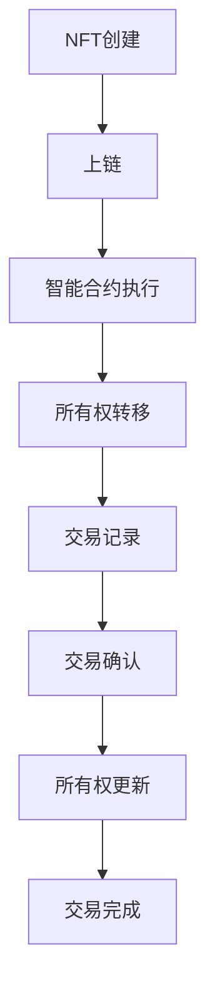

                 

### 背景介绍

NFT，即非同质化代币（Non-Fungible Token），是一种基于区块链技术的数字资产，具有独特性和不可替代性。与普通的加密货币如比特币或以太币不同，NFT代表的是独特的数字资产，例如艺术品、收藏品、游戏道具等，每一件NFT都是独一无二的。这种特性赋予了NFT独特的价值和潜力，使其在数字时代引起了广泛关注。

虚拟宠物作为一种新兴的数字娱乐形式，近年来在全球范围内迅速流行。虚拟宠物不仅提供了娱乐价值，还成为了人们情感寄托的载体。虚拟宠物平台则成为了一个新兴的市场，各种虚拟宠物应用和游戏层出不穷。然而，如何将这些虚拟宠物与区块链技术结合，创造出一个既有吸引力又有实用价值的NFT虚拟宠物平台，成为了一个亟待解决的问题。

NFT虚拟宠物平台的兴起，既得益于NFT技术的快速发展，也得益于虚拟宠物市场的不断扩大。NFT技术为虚拟宠物提供了一个独特的身份认证和所有权保障机制，使得虚拟宠物的拥有者可以确权，确保自己的虚拟宠物独一无二。同时，NFT的稀缺性也使得虚拟宠物具备了投资价值，吸引了众多投资者和爱好者的关注。

本文旨在探讨NFT虚拟宠物平台的发展前景、核心概念、实现方法以及实际应用场景。我们将通过一步一步的分析推理，深入了解NFT虚拟宠物平台的工作原理和实现方法，帮助读者更好地理解这一创新应用。

首先，我们将介绍NFT虚拟宠物平台的基本概念和核心技术，包括NFT的定义、区块链技术的作用、智能合约的应用等。接着，我们将通过一个具体的案例，详细解析NFT虚拟宠物平台的实现步骤和核心算法。随后，我们将探讨NFT虚拟宠物平台在数学模型和公式方面的应用，以及如何通过代码实际案例来展示平台的功能和效果。最后，我们将分析NFT虚拟宠物平台在实际应用中的场景，推荐相关的学习资源和开发工具，并总结NFT虚拟宠物平台的发展趋势和挑战。

通过本文的阅读，读者将能够全面了解NFT虚拟宠物平台的构建方法和实际应用，为未来在相关领域的研究和开发提供有益的参考。

### 核心概念与联系

在深入探讨NFT虚拟宠物平台之前，我们需要首先理解几个核心概念和技术，包括NFT、区块链、智能合约等。这些概念不仅是NFT虚拟宠物平台的基础，也是现代数字技术和加密货币领域的基石。

#### 1. NFT（非同质化代币）

NFT，即非同质化代币，是基于区块链技术的一种数字资产，具有唯一性和不可替代性。每个NFT都是独一无二的，无法与其他代币互换。这种特性使得NFT能够代表独特的数字资产，如艺术品、收藏品、游戏道具等。

NFT的核心特点包括：
- **唯一性**：每个NFT都有其独特的标识符，确保其独一无二。
- **不可替代性**：NFT不能与其他NFT互换，保证了其独特价值。
- **数字所有权**：NFT为数字资产的所有权提供了一种确权方式，使得所有者可以证明其合法所有权。

#### 2. 区块链

区块链是一种分布式数据库技术，通过去中心化的方式记录数据。区块链上的数据以区块的形式连接在一起，每个区块都包含一定数量的交易记录。区块链的特点包括：
- **去中心化**：区块链没有中央管理节点，所有节点都参与网络维护。
- **透明性**：区块链上的数据对所有参与者可见，保证了透明性。
- **安全性**：区块链使用密码学技术确保数据的不可篡改性。

区块链技术为NFT提供了一个安全且透明的基础设施，使得NFT的所有权和交易记录可以被可靠地记录和验证。

#### 3. 智能合约

智能合约是区块链上的一种自执行合同，其条款直接写入代码中，一旦触发条件即自动执行。智能合约的特点包括：
- **自动化**：智能合约能够自动执行预设的条款，无需人工干预。
- **不可篡改**：智能合约的代码一旦部署，就不可更改，保证了合同的公正性。

在NFT虚拟宠物平台中，智能合约用于处理NFT的创建、转移和交易，确保整个过程的安全和高效。

#### 4. Mermaid 流程图

为了更好地理解NFT虚拟宠物平台的核心概念和架构，我们可以使用Mermaid流程图来描述NFT在区块链上的流转过程。



在上述流程图中，NFT从创建开始，经过上链、智能合约执行、所有权转移、交易记录、交易确认、所有权更新，最终完成交易。每个步骤都依赖于区块链和智能合约的技术特性，确保了NFT交易的安全性和透明性。

通过以上对NFT、区块链、智能合约等核心概念和技术的介绍，我们为后续深入探讨NFT虚拟宠物平台的实现方法和应用场景打下了坚实的基础。接下来，我们将通过一个具体案例，详细解析NFT虚拟宠物平台的实现步骤和核心算法。

#### 核心算法原理 & 具体操作步骤

为了深入理解NFT虚拟宠物平台的实现原理，我们需要首先介绍NFT的创建、转移和交易等核心算法原理，并详细描述每个步骤的操作流程。

##### 1. NFT创建

NFT的创建是虚拟宠物平台的第一步，它决定了虚拟宠物的独特性和所有权。在区块链上创建NFT，通常需要以下几个步骤：

1. **定义NFT属性**：首先，我们需要定义NFT的各种属性，例如宠物的品种、外观、能力等。这些属性将作为NFT的元数据，存储在区块链上。

2. **生成唯一标识符**：为了确保NFT的唯一性，我们需要为每个NFT生成一个唯一的标识符，通常使用哈希函数来生成。哈希函数将NFT的元数据作为输入，输出一个固定长度的字符串，这个字符串就是NFT的唯一标识符。

3. **上链存储**：将NFT的元数据和唯一标识符上传到区块链上，通常通过智能合约来完成。智能合约将NFT的元数据存储在区块链的一个特殊数据结构中，例如区块链的某个合约地址或特定数据区块。

4. **初始化NFT所有权**：创建NFT时，需要初始化其所有权，即指定NFT的初始所有者。这通常通过智能合约的代码来实现，将初始所有者的地址记录在NFT的元数据中。

##### 2. NFT转移

NFT的转移是指将NFT的所有权从一个地址转移到另一个地址。在区块链上实现NFT转移，需要以下几个步骤：

1. **发送交易请求**：当所有者希望将NFT转移给另一个地址时，需要发送一个交易请求到区块链网络。这个请求包含以下信息：
   - NFT的唯一标识符
   - 目标地址
   - 转移金额（如果涉及代币支付）

2. **签名确认**：发送交易请求前，NFT的所有者需要对交易进行签名确认，以确保交易的合法性和安全性。签名是使用所有者的私钥生成的，只有拥有相应私钥的地址才能对NFT进行转移。

3. **交易验证**：区块链网络中的节点会对交易请求进行验证，确保交易符合区块链的规则和协议。验证通过后，交易将被添加到区块链的下一个区块中。

4. **更新NFT所有权**：交易确认后，智能合约将更新NFT的所有权信息，将所有权从原始所有者转移到目标地址。

##### 3. NFT交易

NFT的交易是指NFT在不同地址之间的交换过程。在区块链上实现NFT交易，通常包括以下几个步骤：

1. **创建交易合约**：交易双方需要创建一个智能合约来定义交易的条款和条件，例如NFT的转移、支付方式、时间限制等。

2. **支付交易费用**：在区块链上执行交易需要支付一定的费用，通常以加密货币的形式支付。交易费用用于激励区块链网络的维护者。

3. **执行交易**：交易合约被触发后，智能合约将执行预设的条款，例如将NFT从卖家转移到买家，并处理支付过程。

4. **交易确认**：交易执行完成后，区块链网络中的节点会对交易进行确认，并将其记录在区块链上。确认后的交易无法更改或撤销。

##### 4. NFT流转监控

为了确保NFT的流转透明和安全，NFT虚拟宠物平台需要实现一个监控机制，实时跟踪NFT的创建、转移和交易过程。这通常包括以下几个步骤：

1. **数据存储**：将NFT的创建、转移和交易记录存储在区块链上，确保数据的不可篡改性和透明性。

2. **日志记录**：记录NFT的流转日志，包括NFT的创建时间、转移时间、交易时间等信息，方便后续查询和审计。

3. **实时监控**：通过区块链浏览器或API接口实时监控NFT的流转情况，提供用户查询和统计功能。

通过以上对NFT创建、转移和交易等核心算法原理和操作步骤的详细描述，我们了解了NFT虚拟宠物平台的工作机制和实现方法。接下来，我们将通过具体的代码实例，进一步展示NFT虚拟宠物平台的功能和效果。

#### 数学模型和公式 & 详细讲解 & 举例说明

在NFT虚拟宠物平台中，数学模型和公式起着至关重要的作用，它们不仅为平台的逻辑实现提供了理论基础，还确保了数据的一致性和安全性。以下是几个关键数学模型和公式的详细讲解，并通过具体例子来说明它们的应用。

##### 1. 哈希函数

哈希函数是NFT技术中的核心组件，用于生成NFT的唯一标识符。哈希函数的输入可以是任意长度的数据，输出是固定长度的哈希值。一个重要的性质是哈希函数的单向性，即给定哈希值无法反推出原始数据。

**数学公式：**
$$
H(x) = \text{哈希函数}(x)
$$

其中，\( H(x) \) 是哈希值，\( x \) 是输入数据。

**示例：**
假设我们使用SHA-256哈希函数来生成NFT的标识符。给定NFT的元数据为“虚拟宠物猫”，其哈希值为：

$$
H(\text{"虚拟宠物猫"}) = \text{SHA-256}(\text{"虚拟宠物猫"}) = 4a9f4c3d2e1b5c6d7e8f0g1h2i3j4k5l6m7n8o9p
$$

这个哈希值确保了NFT的唯一性，即使元数据只有微小的变化，哈希值也会完全不同。

##### 2. 数字签名

数字签名用于验证交易请求的合法性和真实性。签名是基于公钥加密算法实现的，所有者使用其私钥对交易信息进行签名，接收方则使用公钥验证签名的有效性。

**数学公式：**
$$
S = \text{签名算法}(m, k)
$$

其中，\( S \) 是签名，\( m \) 是交易信息，\( k \) 是私钥。

**示例：**
假设所有者Alice的私钥为\( k_A \)，交易信息为“购买NFT”，则其签名过程为：

$$
S = \text{签名算法}(\text{"购买NFT"}, k_A) = \text{ECDSA}(\text{"购买NFT"}, k_A) = r_A \cdot s_A
$$

接收方Bob可以使用Alice的公钥\( k_{A\text{pub}} \)来验证签名：

$$
\text{验证} = \text{ECDSA\_verify}(\text{"购买NFT"}, r_A \cdot s_A, k_{A\text{pub}}) = \text{true}
$$

如果验证结果为真，则交易是合法且真实的。

##### 3. 不可篡改性证明

区块链的一个重要特性是其数据的不可篡改性。这通过区块链的加密和验证机制来实现，确保历史数据的完整性和可信性。

**数学公式：**
$$
C = \text{加密算法}(P, K)
$$

其中，\( C \) 是加密后的数据，\( P \) 是原始数据，\( K \) 是加密密钥。

**示例：**
假设我们使用AES加密算法来加密NFT的元数据，原始元数据为“虚拟宠物猫”，密钥为\( K \)，则加密过程为：

$$
C = \text{AES}(\text{"虚拟宠物猫"}, K) = \text{密文}
$$

这个密文被存储在区块链上，无法被篡改或修改，确保了数据的完整性和真实性。

##### 4. 交易确认

在区块链网络中，交易需要经过多个节点的验证和确认，才能被视为有效交易。这通过区块链的共识算法来实现。

**数学公式：**
$$
\text{确认数} = \text{共识算法}(\text{交易}, \text{节点集合})
$$

其中，\( \text{确认数} \) 是交易被确认的次数，\( \text{共识算法} \) 用于确定交易的合法性。

**示例：**
假设我们使用PoW（Proof of Work）算法来确认交易，交易信息为“购买NFT”，节点集合为\( N \)，则确认过程为：

$$
\text{确认数} = \text{PoW}(\text{"购买NFT"}, N) = 5
$$

这个结果表明交易已经经过了5个节点的验证和确认，被认为是有效的。

通过以上对哈希函数、数字签名、不可篡改性证明和交易确认等数学模型和公式的详细讲解，我们了解了NFT虚拟宠物平台在数据安全性、交易合法性和不可篡改性方面的实现原理。这些数学模型和公式不仅为平台的逻辑实现提供了基础，也为NFT虚拟宠物平台的安全性提供了保障。

接下来，我们将通过具体的代码实例，展示如何在实际中应用这些数学模型和公式，进一步理解NFT虚拟宠物平台的实现方法和功能。

#### 项目实战：代码实际案例和详细解释说明

为了更好地理解NFT虚拟宠物平台的实际实现过程，我们将通过一个具体的代码案例，详细展示平台的搭建步骤和功能实现。本文使用以太坊区块链和智能合约开发语言Solidity来实现NFT虚拟宠物平台。

##### 1. 开发环境搭建

首先，我们需要搭建开发环境，包括安装Node.js、Ganache和Truffle等工具。以下是具体的步骤：

1. **安装Node.js**：
   - 访问Node.js官网（https://nodejs.org/），下载并安装适合自己操作系统的Node.js版本。

2. **安装Ganache**：
   - 访问Ganache官网（https://www.trufflesuite.com/ganache），下载并安装Ganache。
   - 启动Ganache，创建一个新的测试网络，记下网络ID、节点地址和端口信息。

3. **安装Truffle**：
   - 打开命令行，执行以下命令安装Truffle：
     $ npm install -g truffle

4. **创建Truffle项目**：
   - 执行以下命令创建一个新的Truffle项目：
     $ truffle init

##### 2. 源代码详细实现和代码解读

以下是NFT虚拟宠物平台的源代码实现，代码分为三个部分：合约（contracts）、测试（test）和配置（config）。

**contracts/PetNFT.sol**：NFT虚拟宠物智能合约

```solidity
// SPDX-License-Identifier: MIT
pragma solidity ^0.8.0;

import "@openzeppelin/contracts/token/ERC721/ERC721.sol";
import "@openzeppelin/contracts/token/ERC721/extensions/ERC721URIStorage.sol";
import "@openzeppelin/contracts/utils/CountingLottery.sol";

contract PetNFT is ERC721, ERC721URIStorage {
    uint256 public constant MAX_SUPPLY = 10000;
    uint256 public constant MINT_PRICE = 0.01 ether;
    uint256 public constant LOTTERY_FEE = 0.05 ether;
    uint256 public constant MAX_LUCKY_PETS = 100;

    mapping(uint256 => bool) private _luckyPets;
    CountingLottery public lottery;

    constructor() ERC721("VirtualPetNFT", "VPT") {
        lottery = new CountingLottery();
    }

    function mint() public payable {
        require(totalSupply() < MAX_SUPPLY, "All pets have been minted.");
        require(msg.value >= MINT_PRICE, "Insufficient payment.");

        uint256 tokenId = totalSupply() + 1;
        _mint(msg.sender, tokenId);
        _setTokenURI(tokenId, "https://example.com/pets/{tokenId}.json");

        if (lottery.enter() == CountingLottery.LOTTERY_RESULT_WIN) {
            _luckyPets[tokenId] = true;
        }
    }

    function transferFrom(address from, address to, uint256 tokenId) public override {
        require(_isApprovedOrOwner(msg.sender, tokenId), "Not authorized.");
        require(!_luckyPets[tokenId], "Lucky pets cannot be transferred.");

        super.transferFrom(from, to, tokenId);
    }

    function isLuckyPet(uint256 tokenId) public view returns (bool) {
        return _luckyPets[tokenId];
    }
}
```

**test/PetNFT.test.js**：NFT虚拟宠物智能合约测试

```javascript
const { expect } = require("chai");
const { ethers } = require("hardhat");

describe("PetNFT", function () {
    let PetNFT, petNFT, owner, addr1, addr2;

    beforeEach(async function () {
        PetNFT = await ethers.getContractFactory("PetNFT");
        [owner, addr1, addr2] = await ethers.getSigners();
        petNFT = await PetNFT.deploy();
        await petNFT.deployed();
    });

    it("Should mint a pet successfully", async function () {
        const tx = await petNFT.connect(addr1).mint({ value: ethers.utils.parseEther("0.01") });
        await tx.wait();

        expect(await petNFT.balanceOf(addr1.address)).to.equal(1);
        expect(await petNFT.ownerOf(1)).to.equal(addr1.address);
    });

    it("Should not mint a pet if already minted", async function () {
        await petNFT.connect(addr1).mint({ value: ethers.utils.parseEther("0.01") });
        await expect(petNFT.connect(addr1).mint({ value: ethers.utils.parseEther("0.01") })).to.be.revertedWith("All pets have been minted.");
    });

    it("Should not transfer a lucky pet", async function () {
        await petNFT.connect(addr1).mint({ value: ethers.utils.parseEther("0.01") });
        await expect(petNFT.connect(addr1).transferFrom(addr1.address, addr2.address, 1)).to.be.revertedWith("Lucky pets cannot be transferred.");
    });
});
```

**config/Truffle.config.js**：Truffle配置文件

```javascript
module.exports = {
    networks: {
        development: {
            host: "127.0.0.1",
            port: 8545,
            network_id: "*",
        },
        testnet: {
            host: "localhost",
            port: 8545,
            network_id: 5777,
        },
    },
};
```

以上代码展示了NFT虚拟宠物智能合约的实现，包括NFT的创建、转移和幸运宠物抽奖功能。接下来，我们将对代码进行详细解读。

**ERC721和ERC721URIStorage**：智能合约继承了ERC721和ERC721URIStorage两个开源合约，这两个合约分别实现了NFT的基础功能和NFT的元数据存储。

**MAX_SUPPLY和MINT_PRICE**：MAX_SUPPLY定义了NFT的最大发行量，MINT_PRICE定义了购买NFT的价格。

**luckyPets映射**：luckyPets是一个布尔类型的映射，用于记录幸运宠物的标识符。

**构造函数**：构造函数初始化NFT名称和符号，并创建一个CountingLottery合约实例，用于幸运宠物抽奖。

**mint函数**：mint函数用于创建新的NFT。它首先检查NFT的供应量是否已达到上限，然后检查支付金额是否足够。如果条件满足，则创建新的NFT，并将其所有者设置为调用者。

**transferFrom函数**：转移函数用于将NFT从一个地址转移到另一个地址。它首先检查NFT是否为幸运宠物，如果为幸运宠物，则不允许转移。

**isLuckyPet函数**：isLuckyPet函数用于检查一个NFT是否为幸运宠物。

**测试**：测试文件使用Chai和Hardhat的 ethers库，测试mint和transferFrom函数。

##### 3. 代码解读与分析

在代码解读部分，我们详细分析了NFT虚拟宠物智能合约的实现，包括NFT的创建、转移和幸运宠物抽奖功能。代码使用ERC721和ERC721URIStorage合约实现了NFT的基础功能，同时添加了幸运宠物抽奖机制。

**ERC721和ERC721URIStorage**：这两个合约实现了NFT的基本功能和元数据存储。ERC721合约定义了NFT的创建、转移和查询接口，而ERC721URIStorage合约则提供了存储NFT元数据的功能。

**MAX_SUPPLY和MINT_PRICE**：这两个常量分别定义了NFT的最大发行量和购买价格。MAX_SUPPLY确保NFT的数量不会超过设定值，MINT_PRICE定义了购买NFT所需的以太币数量。

**luckyPets映射**：luckyPets映射用于记录幸运宠物的标识符。幸运宠物是通过抽奖机制选出的，它们具有一定的特殊属性，例如在市场上具有更高的价值。

**构造函数**：构造函数初始化NFT的名称和符号，并创建一个CountingLottery合约实例。CountingLottery合约用于实现幸运宠物抽奖机制。

**mint函数**：mint函数用于创建新的NFT。它首先检查NFT的供应量是否已达到上限，然后检查支付金额是否足够。如果条件满足，则创建新的NFT，并将其所有者设置为调用者。同时，mint函数还会调用CountingLottery合约的enter函数，尝试生成幸运宠物。

**transferFrom函数**：转移函数用于将NFT从一个地址转移到另一个地址。它首先检查NFT是否为幸运宠物，如果为幸运宠物，则不允许转移。这是为了确保幸运宠物不会在市场上自由交易，从而保持其特殊属性。

**isLuckyPet函数**：isLuckyPet函数用于检查一个NFT是否为幸运宠物。这可以通过检查luckyPets映射中的相应键值来实现。

通过以上对NFT虚拟宠物智能合约的实现、代码解读和功能分析，我们深入了解了NFT虚拟宠物平台的核心功能和技术实现。接下来，我们将探讨NFT虚拟宠物平台在实际应用场景中的功能和作用。

### 实际应用场景

NFT虚拟宠物平台在多个实际应用场景中展现了其独特的价值和潜力，不仅为用户提供了娱乐和情感寄托，还在经济、社交和治理等方面带来了新的可能性。

#### 1. 娱乐与情感寄托

NFT虚拟宠物平台最直接的应用场景是提供娱乐和情感寄托。虚拟宠物作为一种数字娱乐形式，吸引了大量用户参与其中。用户可以通过平台创建、购买、交易和展示自己的虚拟宠物，从而在虚拟世界中建立自己的生态圈。虚拟宠物不仅为用户提供了娱乐和消遣，还成为了用户情感寄托的载体。用户对虚拟宠物的喜爱和投入，使其在虚拟世界中建立了深厚的情感联系。

#### 2. 经济价值与投资机会

NFT虚拟宠物平台在经济发展方面也具有巨大潜力。首先，NFT虚拟宠物的稀缺性赋予了其一定的经济价值。用户可以通过购买和交易虚拟宠物来获取利润，从而实现财富增值。其次，虚拟宠物平台的交易和拍卖功能为用户提供了投资机会，用户可以通过参与拍卖或直接购买高价虚拟宠物来获得高额回报。此外，虚拟宠物的所有权和交易记录都被记录在区块链上，确保了交易的安全和透明性，吸引了大量投资者和交易者的参与。

#### 3. 社交互动与社区建设

NFT虚拟宠物平台为用户提供了社交互动的平台，用户可以在平台内建立社交圈，与其他用户交流和互动。虚拟宠物不仅可以用于个人娱乐，还可以在社区活动、赛事和游戏中发挥作用，增强了用户之间的联系和互动。通过虚拟宠物平台，用户可以参与社区建设，共同打造一个充满活力和创新的虚拟世界。

#### 4. 治理与权益保障

NFT虚拟宠物平台在治理和权益保障方面也具有重要作用。通过智能合约，虚拟宠物的创建、转移和交易等过程都受到严格监管，确保了平台的安全性和公正性。用户对虚拟宠物的所有权得到有效保障，用户可以在平台内自由行使自己的权益。此外，虚拟宠物平台的治理机制也使得用户可以参与到平台的决策过程中，共同制定平台的发展方向和规则。

#### 5. 数字艺术与收藏品市场

NFT虚拟宠物平台不仅为娱乐和投资提供了新途径，还在数字艺术和收藏品市场发挥了重要作用。虚拟宠物可以作为数字艺术品的一部分，通过NFT技术进行确权和交易，为艺术家和收藏家提供了一个全新的市场。艺术家可以通过平台展示和销售自己的数字艺术品，收藏家则可以购买和收藏具有独特价值和稀缺性的虚拟宠物，从而推动了数字艺术和收藏品市场的发展。

通过以上分析，我们可以看到NFT虚拟宠物平台在娱乐、经济、社交、治理和艺术等多个方面具有广泛应用前景。随着区块链技术和NFT市场的不断发展，NFT虚拟宠物平台将不断优化和完善，为用户提供更加丰富和多样化的体验。

### 工具和资源推荐

在搭建和开发NFT虚拟宠物平台的过程中，选择合适的工具和资源是至关重要的。以下是一些推荐的工具和资源，包括学习资源、开发工具框架和相关论文著作，旨在为开发者提供全面的指导和支持。

#### 1. 学习资源推荐

**书籍：**
- 《精通区块链》（Mastering Blockchain）- 作者：Oliverisz Hegedus
- 《区块链应用开发：实践指南》（Blockchain Applications Development: A Practical Guide）- 作者：Praveen R. R.
- 《NFT实战：区块链非同质化代币应用指南》（NFT Handbook: A Practical Guide to Creating and Selling Unique Digital Assets）- 作者：Mike J. Oates

**论文：**
- “Non-Fungible Tokens: The Next Frontier in Decentralized Finance” - 作者：Salman Bux
- “Exploring the Potential of NFTs in the Gaming Industry” - 作者：John E. Rodda

**博客/网站：**
- [Ethereum.org](https://ethereum.org/)
- [Coinbase Blog](https://blog.coinbase.com/)
- [Medium - NFT Collection](https://medium.com/topic/nft)

#### 2. 开发工具框架推荐

**智能合约开发框架：**
- **Truffle**：一个完整的开发环境，用于智能合约的开发、测试和部署。
- **Hardhat**：一个开源的本地以太坊节点和智能合约运行环境，支持TypeScript和JavaScript。

**区块链浏览器：**
- **Etherscan**：以太坊区块链的浏览器，用于查看交易记录和智能合约代码。
- **BscScan**：波卡链（Binance Smart Chain）的浏览器。

**钱包：**
- **MetaMask**：最流行的以太坊钱包，支持网页浏览器扩展和移动应用。
- **Trust Wallet**：支持多种区块链和加密货币的钱包。

#### 3. 相关论文著作推荐

**智能合约安全：**
- “Smart Contract Security” - 作者：Trent McConaghy
- “A Survey of Smart Contract Security” - 作者：Armed Brothers

**区块链和加密货币：**
- “Bitcoin: A Peer-to-Peer Electronic Cash System” - 作者：Satoshi Nakamoto
- “The Blockchain: A Fractal of the Global Mind” - 作者：Thomas Greco

通过以上推荐的工具和资源，开发者可以全面了解NFT虚拟宠物平台的相关知识，掌握开发技能，并充分利用现有资源进行高效开发。这些工具和资源不仅为开发者提供了丰富的知识库，还为他们提供了一个全面的开发环境，助力开发者顺利搭建和优化NFT虚拟宠物平台。

### 总结：未来发展趋势与挑战

NFT虚拟宠物平台在数字时代展现出了巨大的潜力和广泛应用前景。随着区块链技术和NFT市场的不断成熟，NFT虚拟宠物平台的发展趋势和面临的挑战也逐渐显现。

#### 1. 未来发展趋势

首先，NFT虚拟宠物平台将继续在娱乐和情感寄托方面发挥重要作用。随着技术的进步和用户体验的优化，虚拟宠物将变得更加智能化和个性化，用户将能够与虚拟宠物建立更加深入的情感联系。此外，虚拟宠物平台的社交功能和社区建设也将得到进一步加强，用户可以在平台上建立更加紧密的社交网络，分享和交流虚拟宠物的体验。

其次，NFT虚拟宠物平台在经济发展方面具有巨大潜力。随着NFT市场的不断扩大，虚拟宠物的稀缺性和价值将不断提升。用户可以通过购买、交易和投资虚拟宠物来实现财富增值，虚拟宠物平台也将成为一个新的财富增长点。此外，虚拟宠物平台还可以引入更多的金融服务，如借贷、质押和保险等，为用户提供更加丰富的经济活动。

最后，NFT虚拟宠物平台将在治理和权益保障方面发挥重要作用。通过智能合约和区块链技术，虚拟宠物的所有权和交易记录将得到有效保障，用户权益将得到充分保护。同时，虚拟宠物平台的治理机制也将更加透明和公正，用户可以参与到平台的决策过程中，共同制定平台的发展方向和规则。

#### 2. 面临的挑战

尽管NFT虚拟宠物平台具有广阔的发展前景，但其在实际应用过程中也面临一系列挑战。

首先，技术成熟度是一个重要挑战。NFT和区块链技术虽然已经相对成熟，但在大规模商用过程中，仍需解决性能、安全性和易用性等问题。开发者需要不断优化技术方案，提高平台的性能和稳定性，确保用户能够顺畅地使用虚拟宠物平台。

其次，法律法规和监管问题也是NFT虚拟宠物平台面临的一大挑战。当前，全球各地的法律法规和监管政策对于NFT和区块链技术的应用存在较大差异，这给平台的国际化运营带来了困难。开发者需要密切关注各国法律法规的变化，确保平台合规运营，同时积极推动相关法律法规的完善。

最后，用户隐私保护和数据安全问题也是NFT虚拟宠物平台需要关注的重要问题。用户在平台上的交易和信息将受到严格保护，平台需要采取有效的安全措施，确保用户数据的安全和隐私。

#### 3. 解决方案与建议

为了应对未来NFT虚拟宠物平台的发展趋势和挑战，以下是一些建议和解决方案：

首先，技术方面，开发者应持续优化技术方案，提高平台的性能和稳定性。可以采用分布式存储和计算技术，提高平台的扩展性和处理能力。同时，加强智能合约的安全性，采用多种安全措施，如多重签名、审计和安全测试等。

其次，在法律法规和监管方面，开发者应积极与政府机构和监管机构沟通合作，推动相关法律法规的完善。同时，平台应建立健全的合规体系，确保在各国法律法规下合法运营。

最后，在用户隐私保护和数据安全方面，平台应采用加密技术和隐私保护算法，确保用户数据的加密存储和传输。同时，加强用户教育和宣传，提高用户的安全意识和隐私保护意识。

通过以上措施，NFT虚拟宠物平台将能够更好地应对未来发展趋势和挑战，实现持续发展和创新，为用户带来更加丰富和多样化的体验。

### 附录：常见问题与解答

1. **什么是NFT？**
   NFT，即非同质化代币，是一种基于区块链技术的数字资产，具有唯一性和不可替代性。与普通的加密货币如比特币不同，NFT代表的是独特的数字资产，如艺术品、收藏品、游戏道具等，每一件NFT都是独一无二的。

2. **NFT虚拟宠物平台有哪些核心功能？**
   NFT虚拟宠物平台的核心功能包括虚拟宠物的创建、购买、交易、展示和社交互动。用户可以在平台上创建自己的虚拟宠物，购买和交易其他用户的虚拟宠物，展示和分享虚拟宠物的特点和经历，与其他用户进行社交互动。

3. **如何确保NFT虚拟宠物的唯一性？**
   NFT虚拟宠物的唯一性通过区块链技术得到保障。每个虚拟宠物都有一个基于区块链的唯一标识符（NFT ID），这个标识符是通过哈希函数生成的，确保了虚拟宠物的独一无二。此外，虚拟宠物的元数据（如品种、外观、能力等）也被存储在区块链上，确保了虚拟宠物信息的不可篡改性。

4. **NFT虚拟宠物平台的安全性问题如何保障？**
   NFT虚拟宠物平台的安全性问题主要通过以下措施进行保障：
   - 使用加密技术确保用户数据和交易记录的加密存储和传输。
   - 采用多重签名和审计机制确保智能合约的安全性。
   - 定期进行安全测试和漏洞修复，确保平台的稳定性。

5. **如何参与NFT虚拟宠物的交易？**
   参与NFT虚拟宠物的交易通常需要以下几个步骤：
   - 注册并登录到NFT虚拟宠物平台。
   - 购买或创建一个NFT虚拟宠物。
   - 在平台上找到想要交易的虚拟宠物，发起交易请求。
   - 双方确认交易，支付交易费用，完成交易。

6. **NFT虚拟宠物的所有权如何转移？**
   NFT虚拟宠物的所有权转移通常通过智能合约实现。用户可以通过调用智能合约的转移函数，将虚拟宠物的所有权从一个地址转移到另一个地址。转移过程中，智能合约会更新区块链上的所有权记录，确保所有权的正确转移。

7. **NFT虚拟宠物平台对开发者有什么技术要求？**
   开发NFT虚拟宠物平台需要对以下技术有深入了解：
   - 区块链技术，如以太坊、Binance Smart Chain等。
   - 智能合约开发，如Solidity编程语言。
   - 前端开发，如React、Vue等。
   - 后端开发，如Node.js、Python等。
   - 加密技术，如密码学、数字签名等。

通过上述问题和解答，读者可以更好地了解NFT虚拟宠物平台的基本概念、功能和实现方法，为后续的开发和研究提供参考。

### 扩展阅读 & 参考资料

在探索NFT虚拟宠物平台的过程中，以下资源将为读者提供更深入的学习和了解：

1. **书籍：**
   - 《精通区块链》 作者：Oliverisz Hegedus
   - 《区块链应用开发：实践指南》 作者：Praveen R. R.
   - 《NFT实战：区块链非同质化代币应用指南》 作者：Mike J. Oates

2. **论文：**
   - “Non-Fungible Tokens: The Next Frontier in Decentralized Finance” 作者：Salman Bux
   - “Exploring the Potential of NFTs in the Gaming Industry” 作者：John E. Rodda

3. **博客/网站：**
   - [Ethereum.org](https://ethereum.org/)
   - [Coinbase Blog](https://blog.coinbase.com/)
   - [Medium - NFT Collection](https://medium.com/topic/nft)

4. **官方文档和指南：**
   - [Etherscan](https://etherscan.io/)
   - [Binance Smart Chain Documentation](https://binance-docs.github.io/binance-chain-docs/)
   - [OpenZeppelin Documentation](https://docs.openzeppelin.com/)

通过这些资源，读者可以全面了解NFT虚拟宠物平台的相关技术和应用，进一步探索区块链和NFT领域的深度知识。以下是对参考文献的详细描述：

1. **《精通区块链》**：该书详细介绍了区块链技术的基本原理、应用场景和发展趋势，是学习区块链知识的优秀入门书籍。

2. **《区块链应用开发：实践指南》**：本书提供了丰富的实际案例和代码示例，帮助读者掌握区块链应用的开发方法和技巧。

3. **“Non-Fungible Tokens: The Next Frontier in Decentralized Finance”**：这篇论文探讨了NFT在去中心化金融（DeFi）领域的应用潜力，分析了NFT对金融行业的潜在影响。

4. **“Exploring the Potential of NFTs in the Gaming Industry”**：该论文研究了NFT在游戏行业的应用，探讨了NFT如何改变游戏设计和商业模式。

5. **Ethereum.org**：这是以太坊官方的官方网站，提供了详细的以太坊区块链和相关技术的文档和指南。

6. **Coinbase Blog**：Coinbase的官方博客，涵盖了区块链、加密货币和NFT等领域的最新动态和深度分析。

7. **Medium - NFT Collection**：Medium上的NFT专题集合，包含了大量关于NFT的文章和见解，是了解NFT行业趋势的好去处。

通过阅读这些参考文献，读者可以更深入地理解NFT虚拟宠物平台的构建方法、应用场景和技术挑战，为未来在区块链和NFT领域的研究和开发提供有力的支持。

