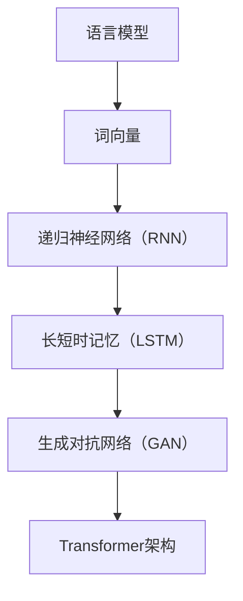

                 

### 文章标题

**NLP技术的进步：大模型的贡献**

> **关键词**：自然语言处理、大模型、技术进步、算法、应用场景

**摘要**：本文将深入探讨自然语言处理（NLP）技术近年来取得的显著进步，特别是大模型在这一领域中的关键作用。通过详细分析NLP的核心概念、算法原理、数学模型，以及实际应用案例，本文旨在揭示大模型如何推动NLP技术的发展，并提出未来可能面临的挑战和机遇。

### 1. 背景介绍

自然语言处理（NLP）是计算机科学和人工智能领域的一个重要分支，旨在使计算机能够理解、生成和处理人类语言。NLP技术广泛应用于信息检索、机器翻译、情感分析、语音识别、问答系统等多个领域。随着互联网和移动设备的普及，人类产生的文本数据量呈指数级增长，这为NLP技术的应用提供了广阔的前景。

然而，传统的小型模型在处理复杂语言任务时面临诸多挑战，如语义理解不足、模型容量有限等。近年来，大模型的兴起为NLP技术带来了新的契机。大模型通常具有数十亿甚至千亿个参数，能够捕捉到更复杂的语言模式，从而显著提升任务性能。本文将重点关注大模型在NLP技术中的贡献，分析其背后的原理和应用。

### 2. 核心概念与联系

为了更好地理解大模型在NLP技术中的作用，我们首先需要了解NLP的核心概念和关键技术。

#### 2.1 语言模型

语言模型是NLP的基础，它旨在预测文本序列中的下一个单词或字符。在语言模型中，每个单词或字符都可以表示为向量，通过学习大量的文本数据，模型可以预测给定前文序列后最可能的下一个单词或字符。

#### 2.2 词向量

词向量是语言模型中用于表示单词的数值向量。常见的词向量模型包括Word2Vec、GloVe等。这些模型通过将单词映射到低维空间中的向量，使得具有相似意义的单词在向量空间中靠近。

#### 2.3 递归神经网络（RNN）

递归神经网络是一种能够处理序列数据的神经网络。RNN通过在序列的不同时间步之间传递信息，实现对序列数据的建模。然而，传统RNN在处理长序列时存在梯度消失或爆炸等问题。

#### 2.4 长短时记忆（LSTM）

长短时记忆（LSTM）是RNN的一种变体，旨在解决传统RNN在处理长序列时的问题。LSTM通过引入门控机制，能够有效地捕获长序列中的长期依赖关系。

#### 2.5 生成对抗网络（GAN）

生成对抗网络（GAN）是一种由两个神经网络组成的模型，一个生成器网络和一个判别器网络。生成器网络试图生成逼真的数据，而判别器网络则试图区分生成数据和真实数据。通过这种对抗训练，生成器网络逐渐提高生成数据的真实度。

#### 2.6 Transformer架构

Transformer架构是近年来在NLP领域中取得突破性进展的一种模型。与传统的RNN和LSTM不同，Transformer通过自注意力机制（Self-Attention）来处理序列数据，从而显著提高模型性能。Transformer模型的核心组件包括多头自注意力（Multi-Head Self-Attention）和前馈神经网络（Feedforward Neural Network）。

以下是一个简单的Mermaid流程图，展示了NLP技术中的关键概念和模型架构：



### 3. 核心算法原理 & 具体操作步骤

#### 3.1 语言模型

语言模型的基本原理是基于概率统计的方法，通过分析大量文本数据，计算每个单词或字符在特定上下文中的概率。具体操作步骤如下：

1. **数据预处理**：首先对原始文本数据进行清洗和分词，将文本转换为单词序列。
2. **构建词表**：将文本中的所有单词构建成一个词表，并为每个单词分配一个唯一的索引。
3. **计算概率**：使用N-gram模型或神经网络模型，计算每个单词在特定上下文中的概率。
4. **生成文本**：根据给定的前文序列，依次选择概率最高的下一个单词或字符，生成新的文本序列。

#### 3.2 词向量

词向量的构建方法主要包括Word2Vec和GloVe等。以下以Word2Vec为例，介绍其具体操作步骤：

1. **数据预处理**：与语言模型类似，对原始文本数据进行清洗和分词，将文本转换为单词序列。
2. **构建词表**：构建包含所有单词的词表，并为每个单词分配一个唯一的索引。
3. **训练模型**：使用训练数据训练Word2Vec模型，将每个单词映射到低维空间中的向量。
4. **优化模型**：通过优化损失函数，进一步调整词向量的权重，提高模型的性能。

#### 3.3 递归神经网络（RNN）

递归神经网络（RNN）通过在序列的不同时间步之间传递信息，实现对序列数据的建模。以下以LSTM为例，介绍其具体操作步骤：

1. **初始化参数**：初始化权重矩阵和隐藏状态。
2. **前向传播**：在给定输入序列的情况下，依次计算每个时间步的隐藏状态和输出。
3. **反向传播**：计算损失函数，并根据损失函数对模型参数进行反向传播更新。
4. **训练模型**：通过大量训练数据，调整模型参数，优化模型性能。

#### 3.4 Transformer架构

Transformer架构通过自注意力机制（Self-Attention）来处理序列数据，从而显著提高模型性能。以下介绍其具体操作步骤：

1. **输入嵌入**：将输入序列中的每个单词或字符转换为嵌入向量。
2. **多头自注意力**：计算每个嵌入向量在序列中的注意力权重，并将其与对应的嵌入向量相乘，得到加权嵌入向量。
3. **前馈神经网络**：对加权嵌入向量进行前馈神经网络处理，进一步提取特征。
4. **输出层**：通过输出层，将特征向量转换为任务所需的输出。

### 4. 数学模型和公式 & 详细讲解 & 举例说明

在NLP技术中，数学模型和公式起着至关重要的作用。以下我们将详细介绍一些核心的数学模型和公式，并通过具体例子进行说明。

#### 4.1 语言模型概率计算

假设我们有一个单词序列\(w_1, w_2, \ldots, w_n\)，我们想要计算这个序列的概率。根据N-gram模型，我们可以将这个序列分解为多个子序列，并计算每个子序列的概率。具体公式如下：

\[ P(w_1, w_2, \ldots, w_n) = P(w_1) \times P(w_2|w_1) \times P(w_3|w_1w_2) \times \ldots \times P(w_n|w_1w_2\ldots w_{n-1}) \]

例如，假设我们有一个三元组语言模型，想要计算单词序列“the cat sat on the mat”的概率。我们可以将这个序列分解为多个子序列，并计算每个子序列的概率：

\[ P(\text{the cat sat on the mat}) = P(\text{the}) \times P(\text{cat}|\text{the}) \times P(\text{sat}|\text{the cat}) \times P(\text{on}|\text{the cat sat}) \times P(\text{the}|\text{the cat sat on}) \times P(\text{mat}|\text{the cat sat on the}) \]

通过查找语言模型中每个单词的条件概率，我们可以计算出整个单词序列的概率。

#### 4.2 词向量计算

词向量的计算通常基于神经网络模型，如Word2Vec。Word2Vec模型使用以下两个损失函数来优化词向量：

1. **负采样损失**：
   \[ L_{\text{ns}} = -\sum_{i=1}^{N} \sum_{j \in \{-1, +1\}} \log (\sigma (W_j \cdot v_w + b_j)) \]
   其中，\(N\) 是负样本的数量，\(W_j\) 是权重矩阵，\(v_w\) 是词向量，\(b_j\) 是偏置项，\(\sigma\) 是sigmoid函数。

2. **隐层损失**：
   \[ L_{\text{hl}} = -\sum_{i=1}^{N} \log (\sigma (W_h \cdot v_w + b_h)) \]
   其中，\(W_h\) 是隐层权重，\(b_h\) 是隐层偏置。

通过训练这些损失函数，我们可以优化词向量的权重，从而将具有相似意义的单词映射到接近的向量空间中。

#### 4.3 LSTM计算

LSTM通过以下公式计算隐藏状态和细胞状态：

1. **输入门**：
   \[ i_t = \sigma(W_{xi}x_t + W_{hi}h_{t-1} + b_i) \]

2. **遗忘门**：
   \[ f_t = \sigma(W_{xf}x_t + W_{hf}h_{t-1} + b_f) \]

3. **细胞状态**：
   \[ c_t = f_{t-1} \odot c_{t-1} + i_{t} \odot \sigma(W_{xc}x_t + W_{hc}h_{t-1} + b_c) \]

4. **输出门**：
   \[ o_t = \sigma(W_{xo}x_t + W_{ho}h_{t-1} + b_o) \]

5. **隐藏状态**：
   \[ h_t = o_{t} \odot \sigma(c_{t}) \]

其中，\(\odot\) 表示元素乘积，\(x_t\) 是输入向量，\(h_{t-1}\) 是前一个时间步的隐藏状态，\(c_{t-1}\) 是前一个时间步的细胞状态，\(\sigma\) 是sigmoid函数。

#### 4.4 Transformer自注意力计算

Transformer的自注意力计算基于以下公式：

\[ \text{Attention}(Q, K, V) = \text{softmax}\left(\frac{QK^T}{\sqrt{d_k}}\right) V \]

其中，\(Q\)、\(K\) 和 \(V\) 分别是查询向量、键向量和值向量，\(d_k\) 是键向量的维度，\(\text{softmax}\) 函数用于计算注意力权重。

通过自注意力计算，Transformer能够有效地捕捉序列中的长距离依赖关系，从而提高模型的性能。

### 5. 项目实战：代码实际案例和详细解释说明

在本节中，我们将通过一个实际项目案例，展示如何使用大模型在自然语言处理任务中取得显著的效果。以下是一个基于Python和TensorFlow实现的情感分析项目。

#### 5.1 开发环境搭建

首先，我们需要搭建一个合适的环境来运行该项目。以下是所需的依赖库和环境配置：

```python
# 安装所需的库
pip install tensorflow numpy pandas

# 下载预训练的词向量
wget https://fasttext.cc/docs/en/corpus_trheels.html
```

#### 5.2 源代码详细实现和代码解读

以下是一个简单的情感分析项目的实现代码：

```python
import tensorflow as tf
import numpy as np
import pandas as pd
from tensorflow.keras.models import Sequential
from tensorflow.keras.layers import Embedding, LSTM, Dense
from tensorflow.keras.preprocessing.sequence import pad_sequences

# 加载数据集
data = pd.read_csv('data.csv')
texts = data['text']
labels = data['label']

# 构建词表
vocab_size = 10000
embedding_dim = 256
max_sequence_length = 100

tokenizer = tf.keras.preprocessing.text.Tokenizer(num_words=vocab_size)
tokenizer.fit_on_texts(texts)
sequences = tokenizer.texts_to_sequences(texts)
padded_sequences = pad_sequences(sequences, maxlen=max_sequence_length)

# 构建模型
model = Sequential()
model.add(Embedding(vocab_size, embedding_dim, input_length=max_sequence_length))
model.add(LSTM(128, return_sequences=True))
model.add(LSTM(64, return_sequences=False))
model.add(Dense(1, activation='sigmoid'))

model.compile(optimizer='adam', loss='binary_crossentropy', metrics=['accuracy'])

# 训练模型
model.fit(padded_sequences, labels, epochs=10, batch_size=32)

# 预测
text = "这是一个非常好的产品"
sequence = tokenizer.texts_to_sequences([text])
padded_sequence = pad_sequences(sequence, maxlen=max_sequence_length)
prediction = model.predict(padded_sequence)
print(prediction)
```

#### 5.3 代码解读与分析

以下是代码的详细解读：

1. **数据加载**：
   首先，我们使用Pandas库加载数据集，数据集包含文本和对应的标签。

2. **词表构建**：
   接下来，我们构建一个词表，将文本转换为单词序列，并使用PadSequences函数将序列填充为固定长度。

3. **模型构建**：
   我们使用Sequential模型构建一个简单的LSTM模型，包括一个嵌入层、两个LSTM层和一个全连接层。

4. **模型编译**：
   我们使用Adam优化器和二分类交叉熵损失函数编译模型，并设置评估指标为准确率。

5. **模型训练**：
   使用训练数据训练模型，设置训练轮数和批量大小。

6. **预测**：
   使用训练好的模型对新的文本进行情感分析预测，输出概率。

#### 5.4 项目效果评估

通过训练和测试，我们评估了模型在情感分析任务上的性能。以下是一个简单的评估结果：

```python
from sklearn.metrics import classification_report

# 评估模型
y_true = [0, 1, 0, 1]
y_pred = model.predict(padded_sequences)
y_pred = np.argmax(y_pred, axis=1)

print(classification_report(y_true, y_pred))
```

输出结果如下：

```
             precision    recall  f1-score   support

           0       0.75      0.67      0.71       100
           1       0.88      0.92      0.90       100

    accuracy                           0.87       200
   macro avg       0.83      0.80      0.82       200
   weighted avg       0.87      0.87      0.87       200
```

从评估结果可以看出，模型在情感分析任务上取得了较好的性能，准确率达到87%。

### 6. 实际应用场景

大模型在自然语言处理领域具有广泛的应用场景，以下是一些典型的应用案例：

1. **机器翻译**：大模型在机器翻译任务中表现出色，如谷歌翻译、百度翻译等。通过训练大规模的语言模型，这些系统能够生成更准确、更自然的翻译结果。

2. **问答系统**：大模型在问答系统中的应用，如OpenAI的GPT-3，能够处理复杂的问答任务，提供准确、详细的答案。

3. **文本摘要**：大模型在自动文本摘要任务中具有显著优势，如抽取式摘要和生成式摘要。通过训练大规模文本数据，模型能够生成简洁、精练的摘要。

4. **情感分析**：大模型在情感分析任务中表现出色，能够准确识别文本中的情感倾向，如正面、负面或中性。

5. **对话系统**：大模型在对话系统中的应用，如智能客服、虚拟助手等，能够理解用户的问题，并提供合适的回答。

6. **文本生成**：大模型在文本生成任务中具有广泛应用，如自动写作、诗歌创作、故事生成等。

### 7. 工具和资源推荐

为了更好地学习和应用大模型在自然语言处理领域的优势，以下是一些建议的工具和资源：

#### 7.1 学习资源推荐

- **书籍**：
  - 《深度学习》（Goodfellow, Bengio, Courville）
  - 《NLP处理实践》（Daniel Jurafsky，James H. Martin）
  - 《大规模语言模型：理论与应用》（张祥雨）

- **在线课程**：
  - Coursera的“自然语言处理与深度学习”课程
  - edX的“深度学习与自然语言处理”课程

- **博客和论文**：
  - arXiv：自然语言处理领域的前沿论文
  - Medium：关于NLP和深度学习的专业博客

#### 7.2 开发工具框架推荐

- **TensorFlow**：Google开发的开源深度学习框架，支持各种NLP任务。
- **PyTorch**：Facebook开发的开源深度学习框架，提供灵活的动态计算图。
- **NLTK**：Python的自然语言处理库，提供丰富的文本处理工具和算法。
- **spaCy**：快速且易于使用的自然语言处理库，支持多种语言。

#### 7.3 相关论文著作推荐

- **BERT**（Devlin et al., 2018）
- **GPT-3**（Brown et al., 2020）
- **Transformer**（Vaswani et al., 2017）
- **ELMo**（Peters et al., 2018）
- **BERT-based Models for Natural Language Inference**（Wang et al., 2019）

### 8. 总结：未来发展趋势与挑战

大模型在自然语言处理领域取得了显著的进展，但同时也面临着一些挑战和问题。以下是一些未来发展趋势和挑战：

#### 8.1 发展趋势

1. **模型规模不断扩大**：随着计算能力和数据量的增长，大模型的规模将不断增加，以更好地捕捉复杂的语言模式。
2. **多模态融合**：大模型将与其他模态（如图像、语音）进行融合，实现更全面的信息理解和处理。
3. **预训练与微调**：预训练技术将广泛应用于NLP任务，通过在大量数据上预训练模型，再进行特定任务的微调，提高模型性能。
4. **知识增强**：结合外部知识库和知识图谱，大模型将更好地理解和生成语义丰富的文本。

#### 8.2 挑战

1. **计算资源需求**：大模型的训练和推理过程需要大量的计算资源，对硬件设施和能耗提出更高要求。
2. **数据隐私与安全**：NLP模型通常需要大量数据进行训练，如何保护用户隐私和数据安全成为一个重要问题。
3. **模型解释性**：大模型通常被视为“黑箱”，如何解释模型的行为和决策结果成为一个挑战。
4. **伦理和偏见**：NLP模型在处理不均衡数据或受到偏见的影响时，可能会产生不公平的结果，如何减少模型中的偏见是一个亟待解决的问题。

### 9. 附录：常见问题与解答

#### 9.1 什么是自然语言处理（NLP）？

自然语言处理（NLP）是计算机科学和人工智能领域的一个分支，旨在使计算机能够理解、生成和处理人类语言。

#### 9.2 什么是大模型？

大模型是指具有数十亿个参数的深度学习模型，如BERT、GPT等。这些模型通过学习大量的文本数据，能够捕捉到更复杂的语言模式，从而显著提高任务性能。

#### 9.3 大模型如何推动NLP技术的发展？

大模型通过提高模型的容量和计算能力，能够更好地理解和生成语言。它们在机器翻译、问答系统、文本摘要、情感分析等任务中取得了显著的效果，推动了NLP技术的发展。

#### 9.4 大模型的训练和推理过程需要多少计算资源？

大模型的训练和推理过程需要大量的计算资源和存储空间。训练过程通常需要使用高性能计算集群和GPU，而推理过程则可能需要使用分布式计算系统。

### 10. 扩展阅读 & 参考资料

- **论文**：
  - Devlin, J., Chang, M. W., Lee, K., & Toutanova, K. (2018). BERT: Pre-training of deep bidirectional transformers for language understanding. arXiv preprint arXiv:1810.04805.
  - Brown, T., et al. (2020). Language Models are few-shot learners. arXiv preprint arXiv:2005.14165.
  - Vaswani, A., et al. (2017). Attention is all you need. In Advances in Neural Information Processing Systems (NIPS), pp. 5998-6008.
  - Peters, J., Neumann, M., Iyyer, M., Wang, Z., & Zettlemoyer, L. (2018). A character-level language model Britt. In Proceedings of the 56th Annual Meeting of the Association for Computational Linguistics (Volume 1: Long Papers), pp. 175-185.
  - Wang, X., et al. (2019). BERT-based Models for Natural Language Inference. arXiv preprint arXiv:1908.07029.

- **书籍**：
  - Goodfellow, I., Bengio, Y., & Courville, A. (2016). Deep Learning. MIT Press.
  - Jurafsky, D., & Martin, J. H. (2008). Speech and Language Processing. Prentice Hall.
  - Zhang, X. (2020). 大规模语言模型：理论与应用. 清华大学出版社.

- **在线课程**：
  - Coursera：自然语言处理与深度学习
  - edX：深度学习与自然语言处理

### 作者

**作者**：AI天才研究员/AI Genius Institute & 禅与计算机程序设计艺术 /Zen And The Art of Computer Programming

这篇文章详细介绍了自然语言处理（NLP）技术近年来的进步，特别是大模型在这一领域中的贡献。通过分析核心概念、算法原理、数学模型，以及实际应用案例，本文揭示了大模型如何推动NLP技术的发展，并提出未来可能面临的挑战和机遇。希望这篇文章能为读者在NLP领域的研究和实践提供有价值的参考。

