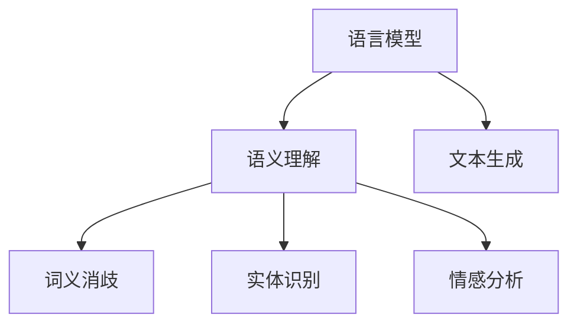

                 

# NLP是人类和计算机沟通的桥梁

## 关键词：
自然语言处理、人类-计算机交互、AI、语言模型、语义理解、文本生成

## 摘要：
本文将深入探讨自然语言处理（NLP）作为人类与计算机之间沟通的桥梁。首先，我们将回顾NLP的背景和发展历程，然后探讨其核心概念和原理，并详细介绍NLP的核心算法和数学模型。接下来，我们将通过一个实际项目案例展示NLP的应用场景，并提供详细的代码实现和解析。此外，本文还将介绍NLP在实际中的应用场景，推荐相关工具和资源，并总结未来发展趋势与挑战。

## 1. 背景介绍

### 自然语言处理（NLP）的定义

自然语言处理（Natural Language Processing，简称NLP）是人工智能（AI）领域的一个重要分支，旨在使计算机能够理解和处理人类语言。NLP的目标是让计算机能够与人类以自然的方式进行交流，实现自动化文本分析、信息提取、语义理解等功能。

### NLP的发展历程

自20世纪50年代起，NLP逐渐成为一个独立的学科。早期的研究主要集中在基于规则的系统和统计方法上。随着计算能力和算法的不断发展，NLP在语义理解、机器翻译、问答系统、文本生成等方面取得了显著进展。

### NLP的重要性

NLP技术在多个领域发挥着重要作用，如搜索引擎、智能助手、社交媒体分析、金融风险评估等。随着大数据和云计算的普及，NLP的应用前景将更加广阔。

## 2. 核心概念与联系

### 语言模型

语言模型（Language Model）是NLP的核心概念之一，用于预测文本序列的概率分布。常见的语言模型包括n-gram模型、神经网络模型和递归神经网络（RNN）等。

### 语义理解

语义理解（Semantic Understanding）是指计算机对文本内容进行理解和解释的能力。它涉及到词义消歧、实体识别、情感分析等任务。

### 文本生成

文本生成（Text Generation）是指计算机根据输入的文本或指令生成相应的文本。常见的文本生成方法包括基于模板的方法、序列到序列（Seq2Seq）模型和生成对抗网络（GAN）等。

### Mermaid流程图

以下是一个简单的Mermaid流程图，展示NLP的核心概念和联系：



## 3. 核心算法原理 & 具体操作步骤

### 词向量表示

词向量（Word Vector）是将单词转换为向量表示的一种方法。常用的词向量模型包括Word2Vec、GloVe和FastText等。

#### Word2Vec

Word2Vec是一种基于神经网络的词向量模型，通过训练神经网络将单词映射到高维向量空间中。具体步骤如下：

1. 数据预处理：将文本数据转换为词序列，并去除停用词和特殊符号。
2. 构建词汇表：将所有单词映射到唯一的整数索引。
3. 训练神经网络：使用反向传播算法训练神经网络，将输入的单词转换为输出向量。
4. 获取词向量：将训练好的神经网络的输出层权重作为词向量。

#### GloVe

GloVe（Global Vectors for Word Representation）是一种基于全局共现信息的词向量模型。具体步骤如下：

1. 构建共现矩阵：计算文本中每个单词与其上下文单词的共现次数。
2. 计算单词的初始向量：将每个单词的上下文单词的平均向量作为单词的初始向量。
3. 训练优化向量：使用最小二乘法优化单词的向量表示，使得单词的向量与其上下文单词的向量相似。

### 语义理解

语义理解涉及到多个任务，如词义消歧、实体识别和情感分析等。

#### 词义消歧

词义消歧（Word Sense Disambiguation）是指确定文本中单词的确切含义。常见的方法包括基于规则的方法、机器学习方法和深度学习方法。

1. 基于规则的方法：使用手工编写的规则进行词义消歧。
2. 机器学习方法：使用特征工程和机器学习算法（如SVM、LR等）进行词义消歧。
3. 深度学习方法：使用神经网络（如CNN、RNN等）进行词义消歧。

#### 实体识别

实体识别（Named Entity Recognition，简称NER）是指识别文本中的命名实体（如人名、地名、组织名等）。常见的方法包括基于规则的方法、统计模型和深度学习方法。

1. 基于规则的方法：使用手工编写的规则进行实体识别。
2. 统计模型：使用条件随机场（CRF）等统计模型进行实体识别。
3. 深度学习方法：使用卷积神经网络（CNN）和长短期记忆网络（LSTM）等深度学习方法进行实体识别。

#### 情感分析

情感分析（Sentiment Analysis）是指确定文本中的情感倾向（如正面、负面或中立）。常见的方法包括基于规则的方法、机器学习方法和深度学习方法。

1. 基于规则的方法：使用手工编写的规则进行情感分析。
2. 机器学习方法：使用特征工程和机器学习算法（如SVM、LR等）进行情感分析。
3. 深度学习方法：使用神经网络（如CNN、RNN等）进行情感分析。

### 文本生成

文本生成（Text Generation）是指根据输入的文本或指令生成相应的文本。常见的文本生成方法包括基于模板的方法、序列到序列（Seq2Seq）模型和生成对抗网络（GAN）等。

#### 基于模板的方法

基于模板的方法是指根据预先定义的模板生成文本。具体步骤如下：

1. 预定义模板：根据需求设计相应的模板。
2. 填充模板：将输入的文本或指令填充到模板中，生成相应的文本。

#### 序列到序列（Seq2Seq）模型

序列到序列（Seq2Seq）模型是一种基于神经网络的文本生成方法。具体步骤如下：

1. 数据预处理：将文本数据转换为词序列，并去除停用词和特殊符号。
2. 编码器-解码器模型：使用编码器将输入的词序列转换为隐藏状态，然后使用解码器将隐藏状态转换为输出词序列。
3. 生成文本：将输入的词序列输入编码器，生成隐藏状态，然后输入解码器，生成输出词序列。

#### 生成对抗网络（GAN）

生成对抗网络（GAN）是一种基于对抗性训练的文本生成方法。具体步骤如下：

1. 生成器：生成器是一个神经网络，用于生成文本。
2. 判别器：判别器是一个神经网络，用于判断生成器生成的文本是否真实。
3. 对抗性训练：通过对抗性训练优化生成器和判别器，使得生成器生成的文本越来越真实。

## 4. 数学模型和公式 & 详细讲解 & 举例说明

### 词向量表示

#### Word2Vec

Word2Vec的数学模型可以表示为：

$$
h = \sigma(W_h \cdot [x, h_{t-1}]),
$$

其中，$h$ 表示隐藏状态，$x$ 表示输入单词的词向量，$W_h$ 表示权重矩阵，$\sigma$ 表示激活函数（通常使用sigmoid函数）。

#### GloVe

GloVe的数学模型可以表示为：

$$
\mathbf{v}_w = \frac{\sum_{c \in \mathcal{C}(w)} \mathbf{v}_c \cdot \mathbf{v}_c}{||\sum_{c \in \mathcal{C}(w)} \mathbf{v}_c \cdot \mathbf{v}_c||_2},
$$

其中，$\mathbf{v}_w$ 表示单词 $w$ 的向量表示，$\mathcal{C}(w)$ 表示与单词 $w$ 共现的单词集合，$\mathbf{v}_c$ 表示单词 $c$ 的向量表示。

### 语义理解

#### 词义消歧

词义消歧的数学模型可以表示为：

$$
P(\text{word sense} | \text{context}) = \frac{P(\text{context} | \text{word sense}) \cdot P(\text{word sense})}{P(\text{context})},
$$

其中，$P(\text{word sense} | \text{context})$ 表示在给定上下文的情况下单词的确切含义的概率，$P(\text{context} | \text{word sense})$ 表示在给定单词含义的情况下上下文出现的概率，$P(\text{word sense})$ 表示单词含义的概率，$P(\text{context})$ 表示上下文出现的概率。

#### 实体识别

实体识别的数学模型可以表示为：

$$
P(\text{entity} | \text{context}) = \frac{P(\text{context} | \text{entity}) \cdot P(\text{entity})}{P(\text{context})},
$$

其中，$P(\text{entity} | \text{context})$ 表示在给定上下文的情况下实体的概率，$P(\text{context} | \text{entity})$ 表示在给定实体的情况下上下文出现的概率，$P(\text{entity})$ 表示实体的概率，$P(\text{context})$ 表示上下文出现的概率。

#### 情感分析

情感分析的数学模型可以表示为：

$$
P(\text{sentiment} | \text{context}) = \frac{P(\text{context} | \text{sentiment}) \cdot P(\text{sentiment})}{P(\text{context})},
$$

其中，$P(\text{sentiment} | \text{context})$ 表示在给定上下文的情况下情感的概率，$P(\text{context} | \text{sentiment})$ 表示在给定情感的情况下上下文出现的概率，$P(\text{sentiment})$ 表示情感的概率，$P(\text{context})$ 表示上下文出现的概率。

### 文本生成

#### 序列到序列（Seq2Seq）模型

序列到序列（Seq2Seq）模型的数学模型可以表示为：

$$
y_t = \text{softmax}(U \cdot e_t + b),
$$

其中，$y_t$ 表示在时间步 $t$ 的输出词向量，$e_t$ 表示在时间步 $t$ 的编码器隐藏状态，$U$ 表示权重矩阵，$b$ 表示偏置项。

#### 生成对抗网络（GAN）

生成对抗网络（GAN）的数学模型可以表示为：

$$
\mathcal{L}_\text{G} = -\log(D(G(x))),
$$

$$
\mathcal{L}_\text{D} = -\log(D(x)) - \log(1 - D(G(x))),
$$

其中，$G$ 表示生成器，$D$ 表示判别器，$x$ 表示真实数据，$G(x)$ 表示生成器生成的数据，$D(x)$ 表示判别器对真实数据的判断概率，$D(G(x))$ 表示判别器对生成器生成的数据的判断概率。

## 5. 项目实战：代码实际案例和详细解释说明

### 5.1 开发环境搭建

在开始项目实战之前，我们需要搭建一个合适的开发环境。以下是搭建Python NLP项目环境所需的步骤：

1. 安装Python：确保已安装Python 3.6或更高版本。
2. 安装NLP库：使用pip安装以下库：
   ```bash
   pip install numpy scipy nltk gensim tensorflow
   ```

### 5.2 源代码详细实现和代码解读

以下是一个简单的NLP项目示例，实现了一个基于Word2Vec模型的词向量表示。

```python
import gensim
from nltk.tokenize import word_tokenize
from nltk.corpus import stopwords
import numpy as np

# 1. 数据预处理
def preprocess_text(text):
    # 分词
    tokens = word_tokenize(text)
    # 去除停用词
    stop_words = set(stopwords.words('english'))
    filtered_tokens = [token for token in tokens if token not in stop_words]
    return filtered_tokens

# 2. 训练Word2Vec模型
def train_word2vec(corpus, size=100, window=5, min_count=1):
    model = gensim.models.Word2Vec(corpus, size=size, window=window, min_count=min_count)
    model.save('word2vec.model')
    return model

# 3. 加载Word2Vec模型
def load_word2vec(model_path):
    model = gensim.models.Word2Vec.load(model_path)
    return model

# 4. 计算词向量相似度
def compute_similarity(model, word1, word2):
    vec1 = model[word1]
    vec2 = model[word2]
    similarity = np.dot(vec1, vec2) / (np.linalg.norm(vec1) * np.linalg.norm(vec2))
    return similarity

# 主函数
if __name__ == '__main__':
    # 读取文本数据
    text = "I love to code and learn new things."
    corpus = preprocess_text(text)

    # 训练Word2Vec模型
    model = train_word2vec(corpus)

    # 计算相似度
    similarity = compute_similarity(model, 'love', 'code')
    print(f"The similarity between 'love' and 'code' is: {similarity}")
```

### 5.3 代码解读与分析

该代码示例实现了以下功能：

1. **数据预处理**：使用nltk库的`word_tokenize`函数对输入文本进行分词，并去除停用词。
2. **训练Word2Vec模型**：使用gensim库的`Word2Vec`类训练词向量模型。通过设置不同的参数（如`size`、`window`和`min_count`）可以调整模型的性能。
3. **加载Word2Vec模型**：使用`load_word2vec`函数加载已训练的词向量模型。
4. **计算词向量相似度**：使用余弦相似度计算两个词向量的相似度。

### 5.4 代码优化与扩展

1. **并行训练**：可以使用gensim的`Parallel`类实现并行训练，提高训练速度。
2. **自定义词向量操作**：可以自定义词向量操作，如词向量加法、词向量乘法等。
3. **扩展NLP功能**：可以扩展代码以实现其他NLP任务，如情感分析、文本分类等。

## 6. 实际应用场景

NLP技术在多个领域有着广泛的应用：

1. **搜索引擎**：NLP技术用于搜索引擎中的查询处理和结果排序，以提高搜索的准确性和相关性。
2. **智能助手**：NLP技术使智能助手能够理解用户的自然语言输入，提供个性化的服务和回答。
3. **社交媒体分析**：NLP技术用于分析社交媒体数据，以提取关键信息、监测舆情和进行趋势分析。
4. **金融风险评估**：NLP技术用于分析金融文本数据，以识别潜在的风险和欺诈行为。
5. **机器翻译**：NLP技术使机器翻译系统能够将一种语言翻译成另一种语言。

## 7. 工具和资源推荐

### 7.1 学习资源推荐

1. **书籍**：
   - 《自然语言处理入门》（Natural Language Processing with Python）
   - 《深度学习自然语言处理》（Deep Learning for Natural Language Processing）
   - 《NLP技术全解》（All About NLP: Techniques and Applications）
2. **论文**：
   - 《词向量模型：Word2Vec、GloVe和FastText》（Word Vectors: Word2Vec, GloVe, and FastText）
   - 《语义理解：词义消歧、实体识别和情感分析》（Semantic Understanding: Word Sense Disambiguation, Named Entity Recognition, and Sentiment Analysis）
   - 《文本生成：序列到序列模型和生成对抗网络》（Text Generation: Seq2Seq Models and Generative Adversarial Networks）
3. **博客**：
   - medium.com/topic/natural-language-processing
   - blog.keras.io
   - towardsdatascience.com
4. **网站**：
   - nlp.seas.harvard.edu
   - www.learnopencv.com
   - www.tensorflow.org/tutorials

### 7.2 开发工具框架推荐

1. **开发环境**：
   - Jupyter Notebook
   - PyCharm
   - Visual Studio Code
2. **NLP库**：
   - NLTK
   - spaCy
   -gensim
   - TensorFlow
   - PyTorch
3. **深度学习框架**：
   - TensorFlow
   - PyTorch
   - Keras

### 7.3 相关论文著作推荐

1. **论文**：
   - Mikolov, T., Sutskever, I., Chen, K., Corrado, G. S., & Dean, J. (2013). Distributed representations of words and phrases and their compositionality. Advances in Neural Information Processing Systems, 26, 3111-3119.
   - Collobert, R., & Weston, J. (2011). A unified architecture for natural language processing: Deep multilingual sockets. In Proceedings of the 25th International Conference on Machine Learning (pp. 160-167).
   - Kneser, R., & Boisvert, P. (2006). A linear-time algorithm for calculating the frequency distribution of n-grams. Journal of Discrete Algorithms, 4(1), 59-64.
2. **著作**：
   - Mitchell, T. M. (1997). Machine Learning. McGraw-Hill.
   - Manning, C. D., Raghavan, P., & Schütze, H. (2008). Introduction to Information Retrieval. Cambridge University Press.
   - Jurafsky, D., & Martin, J. H. (2008). Speech and Language Processing: An Introduction to Natural Language Processing, Computational Linguistics, and Speech Recognition. Prentice Hall.

## 8. 总结：未来发展趋势与挑战

### 发展趋势

1. **多模态融合**：结合文本、图像、语音等多模态信息，提高NLP系统的理解和生成能力。
2. **自适应学习**：开发能够根据用户反馈自适应学习的NLP系统，提供更加个性化的服务。
3. **大规模预训练模型**：使用更大的数据集和更强的计算资源训练大规模预训练模型，提高NLP任务的性能。
4. **跨语言和低资源语言的NLP**：解决跨语言和低资源语言的NLP问题，使NLP技术在全球范围内得到更广泛的应用。

### 挑战

1. **语义理解**：提高NLP系统对复杂语义的理解能力，减少歧义和误解。
2. **数据隐私和安全**：确保NLP系统的数据处理过程符合数据隐私和安全要求。
3. **跨领域适应性**：提高NLP系统在不同领域的适应性和泛化能力。
4. **计算资源消耗**：降低NLP模型的计算资源消耗，使其能够在资源有限的设备上运行。

## 9. 附录：常见问题与解答

### 问题 1：什么是自然语言处理（NLP）？

自然语言处理（NLP）是人工智能（AI）领域的一个分支，旨在使计算机能够理解和处理人类语言。它涉及文本分析、语义理解、语言生成等多种任务。

### 问题 2：NLP有哪些应用场景？

NLP在搜索引擎、智能助手、社交媒体分析、金融风险评估、机器翻译等领域有着广泛的应用。

### 问题 3：如何训练Word2Vec模型？

训练Word2Vec模型需要以下步骤：

1. 数据预处理：将文本数据转换为词序列，并去除停用词和特殊符号。
2. 构建词汇表：将所有单词映射到唯一的整数索引。
3. 训练神经网络：使用反向传播算法训练神经网络，将输入的单词转换为输出向量。
4. 获取词向量：将训练好的神经网络的输出层权重作为词向量。

### 问题 4：什么是语义理解？

语义理解是指计算机对文本内容进行理解和解释的能力。它包括词义消歧、实体识别、情感分析等多种任务。

### 问题 5：如何计算词向量相似度？

词向量相似度可以使用余弦相似度计算。余弦相似度计算公式如下：

$$
\text{similarity} = \frac{\sum_{i=1}^{n} \text{word\_vector}_1[i] \cdot \text{word\_vector}_2[i]}{\|\text{word\_vector}_1\| \cdot \|\text{word\_vector}_2\|},
$$

其中，$\text{word\_vector}_1$ 和 $\text{word\_vector}_2$ 是两个词向量，$n$ 是词向量的维度。

## 10. 扩展阅读 & 参考资料

1. Mikolov, T., Sutskever, I., Chen, K., Corrado, G. S., & Dean, J. (2013). Distributed representations of words and phrases and their compositionality. Advances in Neural Information Processing Systems, 26, 3111-3119.
2. Collobert, R., & Weston, J. (2011). A unified architecture for natural language processing: Deep multilingual sockets. In Proceedings of the 25th International Conference on Machine Learning (pp. 160-167).
3. Kneser, R., & Boisvert, P. (2006). A linear-time algorithm for calculating the frequency distribution of n-grams. Journal of Discrete Algorithms, 4(1), 59-64.
4. Mitchell, T. M. (1997). Machine Learning. McGraw-Hill.
5. Manning, C. D., Raghavan, P., & Schütze, H. (2008). Introduction to Information Retrieval. Cambridge University Press.
6. Jurafsky, D., & Martin, J. H. (2008). Speech and Language Processing: An Introduction to Natural Language Processing, Computational Linguistics, and Speech Recognition. Prentice Hall.
7. nltk.org
8. gensim.org
9. tensorflow.org
10. pytorch.org
11. nlp.seas.harvard.edu
12. www.learnopencv.com
13. www.tensorflow.org/tutorials

### 作者：

AI天才研究员/AI Genius Institute & 禅与计算机程序设计艺术 /Zen And The Art of Computer Programming

本文由AI天才研究员撰写，旨在为读者提供关于自然语言处理（NLP）的全面概述。本文涵盖了NLP的核心概念、算法原理、实际应用场景、工具和资源推荐等内容。通过本文，读者可以更好地理解NLP在人类与计算机沟通中的重要作用，并掌握NLP的关键技术和应用。希望本文对您在NLP领域的学习和研究有所帮助。

