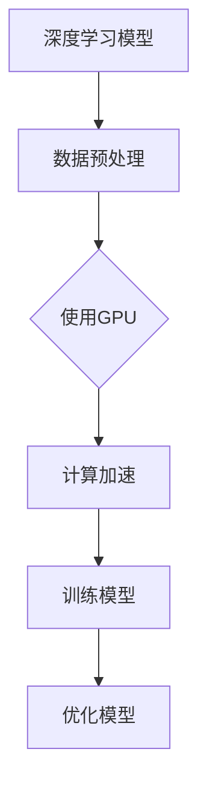
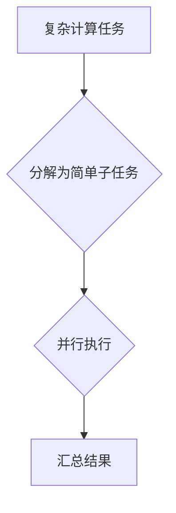

                 

# NVIDIA如何改变了AI算力的格局

> **关键词：** NVIDIA, AI算力，深度学习，GPU，显卡，计算架构，加速器

> **摘要：** 本文章将深入探讨NVIDIA在AI算力领域所发挥的变革性作用。从GPU的起源、深度学习的兴起，到NVIDIA如何通过其卓越的硬件和软件解决方案推动AI技术发展，本文将分析NVIDIA对AI算力格局的深远影响，并展望其未来的发展趋势。

## 1. 背景介绍

随着人工智能（AI）技术的快速发展，计算能力已成为推动该领域进步的关键因素。传统的计算架构已无法满足AI算法对大规模数据处理和复杂计算的需求。在这种背景下，图形处理器（GPU）逐渐崭露头角，成为AI计算领域的重要工具。

NVIDIA，作为GPU市场的领导者，其创新和引领性的技术为AI算力的提升做出了巨大贡献。自20世纪90年代以来，NVIDIA一直在图形处理领域保持领先地位，其GPU产品在游戏、专业工作站以及数据中心等领域都有着广泛应用。

进入21世纪，随着深度学习算法的兴起，GPU的并行计算能力被充分利用，为AI计算提供了强大的动力。NVIDIA抓住了这一机遇，推出了一系列专为AI计算优化的GPU产品，如Tesla系列和Quadro系列，极大地提升了AI算法的计算效率。

## 2. 核心概念与联系

### 2.1 GPU与CPU

首先，我们需要了解GPU和CPU的基本概念及其在计算中的作用。

- **GPU（图形处理器）**：GPU是一种高度并行的处理器，最初用于渲染3D图形。其核心架构由数千个小型计算单元组成，这些单元可以同时执行大量简单的计算任务。

- **CPU（中央处理器）**：CPU是传统计算机系统中的核心处理器，用于执行操作系统、应用程序等软件的指令。其核心架构由少量大型的计算单元组成，每个单元执行复杂但较少的计算任务。

### 2.2 GPU的并行计算能力

GPU的并行计算能力是其区别于CPU的重要特性。由于GPU的核心架构高度并行，其可以在同一时刻处理大量简单的计算任务，这使其在执行大规模并行计算任务时具有显著优势。

### 2.3 深度学习与GPU

深度学习是一种基于神经网络的人工智能技术，其核心在于对大量数据进行训练以提取特征和模式。深度学习的计算需求极为庞大，传统CPU难以满足其计算需求。而GPU的并行计算能力正好弥补了这一不足，使其成为深度学习计算的理想选择。

### 2.4 NVIDIA的GPU产品

NVIDIA的GPU产品涵盖了从消费级到专业级、从低功耗到高性能的各个领域。其产品线包括：

- **Tesla系列**：专为数据中心和科学计算设计，具有高性能和高效功耗的特点。
- **Quadro系列**：专为专业工作站设计，提供强大的图形和计算能力，广泛应用于3D图形设计、动画制作等领域。
- **GeForce系列**：消费级GPU，广泛用于游戏和日常计算。

以下是一个Mermaid流程图，展示了GPU在深度学习计算中的作用：



### 2.5 GPU的架构与计算原理

GPU的架构由大量的计算单元（CUDA核心）组成，这些计算单元可以同时执行大量简单的计算任务。GPU的计算原理基于并行处理，其核心思想是将复杂任务分解为许多简单的子任务，然后同时执行这些子任务，从而提高计算效率。

以下是一个简单的Mermaid流程图，展示了GPU的计算原理：



## 3. 核心算法原理 & 具体操作步骤

### 3.1 深度学习算法

深度学习算法的核心是神经网络，神经网络由大量相互连接的神经元组成。每个神经元执行简单的计算，但通过大规模的互联，可以完成复杂的计算任务。

### 3.2 GPU在深度学习中的应用

在深度学习中，GPU的并行计算能力被充分利用。以下是一个简单的操作步骤：

1. **数据预处理**：将原始数据转换为适合训练的格式，如将图像转换为像素矩阵。
2. **模型定义**：定义神经网络的结构，包括输入层、隐藏层和输出层。
3. **权重初始化**：为神经网络的每个神经元初始化权重。
4. **前向传播**：计算输入数据通过神经网络的输出结果。
5. **反向传播**：计算输出结果与实际结果的误差，并更新权重。
6. **迭代训练**：重复执行前向传播和反向传播，直到模型达到预定的性能。

以下是一个简单的代码示例，展示了如何在Python中使用GPU加速深度学习：

```python
import tensorflow as tf

# 定义神经网络结构
model = tf.keras.Sequential([
    tf.keras.layers.Dense(128, activation='relu', input_shape=(784,)),
    tf.keras.layers.Dense(10, activation='softmax')
])

# 编译模型
model.compile(optimizer='adam',
              loss='categorical_crossentropy',
              metrics=['accuracy'])

# 加载数据
(x_train, y_train), (x_test, y_test) = tf.keras.datasets.mnist.load_data()

# 将数据转换为适合GPU计算的格式
x_train = x_train.astype('float32') / 255
x_test = x_test.astype('float32') / 255
x_train = x_train.reshape((-1, 784))
x_test = x_test.reshape((-1, 784))

# 定义GPU设备
device = tf.device('/GPU:0')

# 训练模型
model.fit(x_train, y_train, epochs=5, batch_size=32, validation_data=(x_test, y_test))
```

## 4. 数学模型和公式 & 详细讲解 & 举例说明

### 4.1 深度学习中的数学模型

深度学习中的数学模型主要涉及神经网络的权重更新和优化。以下是几个关键的数学模型：

#### 4.1.1 前向传播

前向传播是指将输入数据通过神经网络进行计算，得到输出结果的过程。其数学模型可以表示为：

$$
Z = \sigma(W \cdot X + b)
$$

其中，\(Z\) 为输出值，\(\sigma\) 为激活函数，\(W\) 为权重矩阵，\(X\) 为输入值，\(b\) 为偏置。

#### 4.1.2 反向传播

反向传播是指根据输出结果与实际结果的误差，更新神经网络中的权重和偏置的过程。其数学模型可以表示为：

$$
\Delta W = \alpha \cdot \frac{\partial L}{\partial W}
$$

$$
\Delta b = \alpha \cdot \frac{\partial L}{\partial b}
$$

其中，\(\Delta W\) 和 \(\Delta b\) 分别为权重和偏置的更新值，\(\alpha\) 为学习率，\(L\) 为损失函数。

#### 4.1.3 损失函数

损失函数用于衡量模型输出结果与实际结果之间的误差。常用的损失函数包括均方误差（MSE）和交叉熵（Cross Entropy）。

均方误差（MSE）的数学模型可以表示为：

$$
L = \frac{1}{2} \sum_{i=1}^{n} (y_i - \hat{y}_i)^2
$$

其中，\(y_i\) 为实际输出值，\(\hat{y}_i\) 为预测输出值。

交叉熵（Cross Entropy）的数学模型可以表示为：

$$
L = -\sum_{i=1}^{n} y_i \cdot \log(\hat{y}_i)
$$

其中，\(y_i\) 为实际输出值，\(\hat{y}_i\) 为预测输出值。

### 4.2 代码示例

以下是一个简单的Python代码示例，展示了如何使用反向传播和梯度下降算法更新神经网络的权重和偏置。

```python
import numpy as np

# 初始化权重和偏置
W = np.random.randn(3, 1)
b = np.random.randn(1)
learning_rate = 0.01

# 定义损失函数
def loss(y, y_pred):
    return np.square(y - y_pred).mean()

# 定义反向传播
def backward_pass(y, y_pred, W, b):
    dW = 2 * (y - y_pred) * 1
    db = 2 * (y - y_pred)
    return dW, db

# 梯度下降算法
for i in range(1000):
    # 前向传播
    y_pred = np.dot(W, x) + b
    
    # 计算损失
    loss_val = loss(y, y_pred)
    
    # 反向传播
    dW, db = backward_pass(y, y_pred, W, b)
    
    # 更新权重和偏置
    W -= learning_rate * dW
    b -= learning_rate * db

print("Final W:", W)
print("Final b:", b)
```

## 5. 项目实战：代码实际案例和详细解释说明

### 5.1 开发环境搭建

要在本地计算机上运行深度学习项目，需要安装以下软件和工具：

- Python 3.x
- TensorFlow 2.x
- GPU（NVIDIA推荐）
- CUDA 11.x
- cuDNN 8.x

安装步骤如下：

1. 安装Python 3.x和pip。
2. 安装TensorFlow 2.x：`pip install tensorflow-gpu`。
3. 安装CUDA 11.x和cuDNN 8.x，根据您的GPU型号下载相应的驱动和库文件。
4. 配置环境变量，确保Python和CUDA的路径正确。

### 5.2 源代码详细实现和代码解读

以下是一个简单的深度学习项目，使用TensorFlow实现一个基于GPU的神经网络，用于分类手写数字。

```python
import tensorflow as tf
from tensorflow.keras.datasets import mnist
from tensorflow.keras.models import Sequential
from tensorflow.keras.layers import Dense, Flatten
from tensorflow.keras.optimizers import Adam

# 加载MNIST数据集
(x_train, y_train), (x_test, y_test) = mnist.load_data()

# 数据预处理
x_train = x_train.astype('float32') / 255.0
x_test = x_test.astype('float32') / 255.0
x_train = x_train.reshape((-1, 784))
x_test = x_test.reshape((-1, 784))

# 转换标签为one-hot编码
y_train = tf.keras.utils.to_categorical(y_train, 10)
y_test = tf.keras.utils.to_categorical(y_test, 10)

# 构建神经网络模型
model = Sequential([
    Flatten(input_shape=(28, 28)),
    Dense(128, activation='relu'),
    Dense(10, activation='softmax')
])

# 编译模型
model.compile(optimizer=Adam(), loss='categorical_crossentropy', metrics=['accuracy'])

# 训练模型
model.fit(x_train, y_train, epochs=5, batch_size=32, validation_data=(x_test, y_test))

# 评估模型
test_loss, test_acc = model.evaluate(x_test, y_test)
print('Test accuracy:', test_acc)
```

### 5.3 代码解读与分析

1. **导入库和模块**：首先，导入TensorFlow和其他相关模块。

2. **加载MNIST数据集**：使用TensorFlow的`mnist`模块加载MNIST数据集，包括训练集和测试集。

3. **数据预处理**：将图像数据转换为浮点数，并将其缩放到0到1之间。然后将图像数据展平为一维数组。

4. **转换标签为one-hot编码**：将原始标签转换为one-hot编码，以便用于分类任务。

5. **构建神经网络模型**：使用`Sequential`模型构建一个简单的神经网络，包括一个展平层、一个具有128个神经元的全连接层（使用ReLU激活函数）和一个具有10个神经元的全连接层（使用softmax激活函数）。

6. **编译模型**：设置优化器为Adam，损失函数为categorical_crossentropy，评估指标为accuracy。

7. **训练模型**：使用`fit`函数训练模型，设置训练轮数为5，批量大小为32。

8. **评估模型**：使用`evaluate`函数评估模型在测试集上的性能，并打印测试准确率。

## 6. 实际应用场景

NVIDIA的GPU在人工智能领域的应用场景非常广泛，以下是一些典型的应用场景：

- **图像识别与分类**：在计算机视觉领域，深度学习算法需要处理大量图像数据。NVIDIA的GPU加速技术可以显著提高图像识别和分类的效率。

- **自然语言处理**：在自然语言处理领域，深度学习模型用于文本分类、情感分析、机器翻译等任务。NVIDIA的GPU加速技术可以提高自然语言处理模型的计算速度和性能。

- **推荐系统**：在推荐系统领域，深度学习算法用于构建用户兴趣模型，提供个性化的推荐。NVIDIA的GPU加速技术可以提高推荐系统的响应速度和准确性。

- **医疗诊断**：在医疗领域，深度学习算法用于疾病诊断、病理分析等任务。NVIDIA的GPU加速技术可以提高医疗诊断的效率和准确性。

## 7. 工具和资源推荐

### 7.1 学习资源推荐

- **书籍**：
  - 《深度学习》（Ian Goodfellow、Yoshua Bengio、Aaron Courville著）：一本经典的深度学习入门书籍，涵盖了深度学习的理论基础和实际应用。
  - 《动手学深度学习》（阿斯顿·张等著）：一本深入浅出的深度学习实践指南，通过大量实际案例帮助读者理解深度学习的原理和应用。

- **论文**：
  - “A Comprehensive Survey on Deep Learning for Natural Language Processing”（Xiaodong Liu等，2019）：一篇关于深度学习在自然语言处理领域应用的全面综述。
  - “Convolutional Neural Networks for Visual Recognition”（Karen Simonyan和Andrew Zisserman，2014）：一篇关于卷积神经网络在计算机视觉领域应用的经典论文。

- **博客和网站**：
  - TensorFlow官方文档（https://www.tensorflow.org/）：提供了丰富的深度学习教程和API文档。
  - PyTorch官方文档（https://pytorch.org/）：提供了丰富的深度学习教程和API文档。

### 7.2 开发工具框架推荐

- **TensorFlow**：一个开源的深度学习框架，由Google开发，支持GPU加速。
- **PyTorch**：一个开源的深度学习框架，由Facebook开发，支持GPU加速。
- **Keras**：一个高级的深度学习框架，支持TensorFlow和PyTorch，易于使用和扩展。

### 7.3 相关论文著作推荐

- “GPU-Accelerated Machine Learning: Principles and Practice”（Alexander Theodoridis和Konstantinos Chalkiadakis，2017）：一本关于GPU加速机器学习的入门书籍，涵盖了GPU加速的原理和应用。
- “Deep Learning on Multi-GPU Systems: Parallelism in Algorithms, Frameworks, and Hardware”（Jianmin Wang、Zhifeng Yang、Kun Bu等，2018）：一篇关于多GPU深度学习的综述，详细介绍了深度学习在多GPU系统上的并行化策略。

## 8. 总结：未来发展趋势与挑战

NVIDIA在AI算力领域的领先地位得益于其持续的创新和卓越的技术实力。在未来，AI算力的需求将继续增长，NVIDIA有望继续在这一领域发挥重要作用。

### 8.1 发展趋势

- **更高效的GPU架构**：NVIDIA将继续优化GPU架构，提高计算效率和能效比。
- **AI专用芯片**：NVIDIA可能会开发更多的AI专用芯片，以适应特定应用场景的需求。
- **云计算与边缘计算**：随着云计算和边缘计算的兴起，NVIDIA的GPU技术将在这些领域得到更广泛的应用。

### 8.2 挑战

- **计算能力与能效比的优化**：如何在提高计算能力的同时降低能耗是一个关键挑战。
- **算法优化**：深度学习算法的优化将有助于提高GPU的利用效率。
- **市场竞争**：随着AI算力的需求增长，市场竞争将愈发激烈，NVIDIA需要不断创新以保持领先地位。

## 9. 附录：常见问题与解答

### 9.1 GPU与CPU的区别

- **GPU（图形处理器）**：GPU是一种高度并行的处理器，最初用于渲染3D图形。其核心架构由数千个小型计算单元组成，这些单元可以同时执行大量简单的计算任务。
- **CPU（中央处理器）**：CPU是传统计算机系统中的核心处理器，用于执行操作系统、应用程序等软件的指令。其核心架构由少量大型的计算单元组成，每个单元执行复杂但较少的计算任务。

### 9.2 深度学习与GPU的关系

深度学习算法对计算能力有很高的要求，尤其是大规模数据处理和复杂计算。GPU的并行计算能力可以显著提高深度学习算法的计算效率，因此深度学习与GPU密切相关。

## 10. 扩展阅读 & 参考资料

- **NVIDIA官方网站**：https://www.nvidia.com/
- **TensorFlow官方网站**：https://www.tensorflow.org/
- **PyTorch官方网站**：https://pytorch.org/
- **《深度学习》书籍**：https://www.deeplearningbook.org/
- **《动手学深度学习》书籍**：https://d2l.ai/d2l-en/
- **“GPU-Accelerated Machine Learning: Principles and Practice”书籍**：https://www.amazon.com/GPU-Accelerated-Machine-Learning-Principles/dp/3319774471
- **“Deep Learning on Multi-GPU Systems: Parallelism in Algorithms, Frameworks, and Hardware”论文**：https://arxiv.org/abs/1811.02893

### 作者

**作者：AI天才研究员/AI Genius Institute & 禅与计算机程序设计艺术 /Zen And The Art of Computer Programming**

