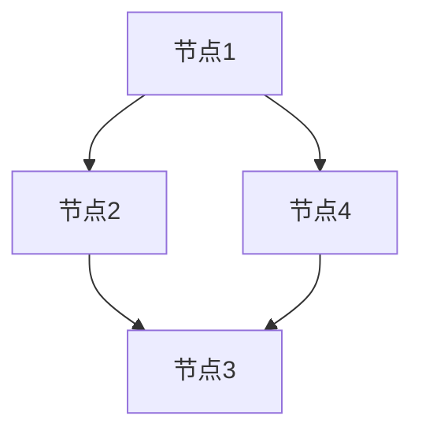

                 

# Neo4j原理与代码实例讲解

## 关键词
- Neo4j
- 图数据库
- 图算法
- 数据模型
- 实际应用
- 代码实例

## 摘要
本文将深入讲解Neo4j图数据库的原理与实际应用，通过代码实例演示其核心算法和操作步骤。我们将从Neo4j的基本概念、数据模型、图算法等方面展开讨论，帮助读者全面理解并掌握Neo4j的使用方法和最佳实践。

## 1. 背景介绍

### 1.1 Neo4j的起源

Neo4j是一款高性能的图数据库，其设计理念源于图论和图算法。2007年，由Christian Dürrwanger和Emil Eifrem共同创立，旨在为数据密集型应用提供一种高效、易用的数据存储和处理解决方案。Neo4j采用磁盘存储，支持ACID事务，具有高性能、灵活性和扩展性。

### 1.2 图数据库与关系型数据库的区别

图数据库与关系型数据库在数据模型、查询方式等方面存在显著差异。关系型数据库采用表格形式存储数据，通过SQL进行查询；而图数据库以节点（Node）和边（Relationship）为基本单元，通过图算法进行复杂关系的查询。

### 1.3 Neo4j的核心优势

- **高性能**: Neo4j采用磁盘存储，优化了索引和数据结构，使得图算法操作效率极高。
- **易用性**: Neo4j提供Cypher查询语言，使得用户可以方便地进行复杂关系的查询。
- **扩展性**: Neo4j支持水平扩展，能够处理大规模的数据集。
- **社区支持**: Neo4j拥有活跃的社区，提供了丰富的工具、插件和文档。

## 2. 核心概念与联系

### 2.1 节点（Node）与边（Relationship）

Neo4j中的数据由节点和边组成。节点表示实体，如人、物品等；边表示节点之间的关系，如朋友、购买等。每个节点和边都可以附加属性，用于描述其特征。

### 2.2 数据模型

Neo4j采用图模型进行数据存储，具有以下特点：

- **无模式设计**: 数据结构灵活，无需预先定义表格结构。
- **属性关联**: 节点和边可以存储属性，方便进行数据查询。
- **图算法支持**: Neo4j内置多种图算法，便于进行复杂关系的查询。

### 2.3 Mermaid流程图



## 3. 核心算法原理 & 具体操作步骤

### 3.1 图算法

Neo4j支持多种图算法，如深度优先搜索、广度优先搜索、最短路径、社区发现等。以下以深度优先搜索（DFS）为例，介绍其原理和操作步骤。

#### 3.1.1 深度优先搜索原理

深度优先搜索（DFS）是一种遍历或搜索树或图的算法。它沿着路径走到底，然后回到顶点，继续搜索其他路径。

#### 3.1.2 深度优先搜索操作步骤

1. 选择起始节点，将其标记为已访问。
2. 遍历当前节点的邻接点，若邻接点未被访问，则选择邻接点作为新的当前节点，并重复步骤1。
3. 若当前节点无未访问的邻接点，则回到父节点，选择下一个未访问的邻接点，重复步骤2。
4. 当所有节点都被访问过，算法结束。

### 3.2 Cypher查询语言

Cypher是Neo4j的原生查询语言，具有类似SQL的语法，但更加专注于图数据的查询。以下是一个简单的Cypher查询示例：

```cypher
MATCH (p:Person), (p)-[:KNOWS]->(k)
WHERE p.name = 'Alice'
RETURN k.name
```

此查询将找到名为Alice的人及其所有认识的人。

## 4. 数学模型和公式 & 详细讲解 & 举例说明

### 4.1 图的基本概念

- **节点（Node）**: 图中的数据元素，表示实体。
- **边（Edge）**: 连接两个节点的元素，表示实体之间的关系。
- **度（Degree）**: 节点拥有的边的数量。

### 4.2 深度优先搜索算法

$$
DFS(N) = \{ V \in V | V \text{是图 } G \text{ 的一个顶点，且 } V \text{ 被访问过} \}
$$

### 4.3 示例

假设有如下图：

```
A --- B
|     |
D --- C
```

深度优先搜索的步骤如下：

1. 选择起始节点A，将其标记为已访问。
2. 遍历A的邻接点B、D，选择B作为当前节点，并将其标记为已访问。
3. 遍历B的邻接点C，选择C作为当前节点，并将其标记为已访问。
4. C无未访问的邻接点，回到B，选择D作为当前节点，并将其标记为已访问。
5. D无未访问的邻接点，回到A，选择未访问的邻接点C作为当前节点，并将其标记为已访问。
6. 所有节点都被访问过，算法结束。

结果：DFS(A) = {A, B, C, D}。

## 5. 项目实战：代码实际案例和详细解释说明

### 5.1 开发环境搭建

#### 5.1.1 Neo4j安装

1. 访问Neo4j官网下载Neo4j社区版：https://neo4j.com/download/
2. 解压下载的压缩包，并运行Neo4j服务。

#### 5.1.2 Neo4j Desktop安装

1. 访问Neo4j Desktop官网下载：https://neo4j.com/download/#desktop
2. 安装Neo4j Desktop，并启动。

### 5.2 源代码详细实现和代码解读

#### 5.2.1 数据模型

创建一个名为“社交网络”的数据库，并在其中创建以下节点和关系：

- **Person**（人）
  - **属性**：name、age、gender
- **Friend**（朋友关系）
  - **属性**：start_date、end_date

#### 5.2.2 Cypher查询示例

1. 添加数据：

```cypher
CREATE (a:Person {name: 'Alice', age: 30, gender: 'F'}),
       (b:Person {name: 'Bob', age: 35, gender: 'M'}),
       (c:Person {name: 'Charlie', age: 40, gender: 'M'}),
       (a)-[:FRIEND {start_date: '2020-01-01', end_date: '2021-12-31'}]->(b),
       (a)-[:FRIEND {start_date: '2019-05-05', end_date: '2020-04-04'}]->(c);
```

2. 查询Alice的所有朋友：

```cypher
MATCH (a:Person {name: 'Alice'}), (a)-[:FRIEND]->(b:Person)
RETURN b.name;
```

### 5.3 代码解读与分析

#### 5.3.1 数据模型

在本示例中，我们创建了一个名为“Person”的节点类型，用于表示人，并为每个节点添加了三个属性：name、age和gender。然后，我们创建了一个名为“Friend”的关系类型，用于表示朋友关系，并为每个关系添加了两个属性：start_date和end_date。

#### 5.3.2 查询

第一个查询语句使用了`CREATE`命令，创建了四个Person节点和三条Friend关系，分别代表了Alice、Bob、Charlie及其朋友关系。第二个查询语句使用了`MATCH`命令，找到了名为Alice的人，然后通过`FRIEND`关系查询出其所有朋友。

## 6. 实际应用场景

### 6.1 社交网络

图数据库非常适合用于社交网络应用，如好友推荐、路径分析等。通过Neo4j，我们可以轻松地建立复杂的社交关系图，并快速查询用户之间的好友关系。

### 6.2 物流与供应链

物流与供应链领域中的数据具有高度关联性，通过Neo4j，我们可以构建产品、供应商、客户之间的复杂关系图，从而实现高效的路径规划和优化。

### 6.3 金融服务

在金融服务领域，图数据库可以帮助分析客户关系、风险评估、欺诈检测等。通过Neo4j，我们可以建立客户之间的社交网络，并快速识别高风险客户。

## 7. 工具和资源推荐

### 7.1 学习资源推荐

- **书籍**：
  - 《Neo4j实战》
  - 《图算法》
  - 《图数据库导论》
- **论文**：
  - 《Neo4j：图数据库设计与实现》
  - 《图算法在社交网络分析中的应用》
- **博客**：
  - Neo4j官网博客
  - 图算法相关博客
- **网站**：
  - Neo4j官网
  - 图数据库社区

### 7.2 开发工具框架推荐

- **Neo4j Desktop**：Neo4j官方提供的图形化界面，便于数据操作和查询。
- **Cypher Editor**：在线Cypher查询工具，方便进行查询测试。
- **Neo4j Browser**：Neo4j的命令行工具，适用于高级用户进行数据操作。

### 7.3 相关论文著作推荐

- 《Neo4j：图数据库设计与实现》
- 《图算法在社交网络分析中的应用》
- 《图数据库导论》

## 8. 总结：未来发展趋势与挑战

### 8.1 发展趋势

- **云计算与容器化**：随着云计算和容器化技术的发展，图数据库将更好地支持大规模、分布式存储和计算。
- **图算法优化**：未来图数据库将更加注重图算法的优化，提高查询性能。
- **应用场景拓展**：图数据库将在更多领域得到应用，如金融、医疗、物流等。

### 8.2 挑战

- **数据一致性**：在分布式存储环境下，如何保证数据的一致性是一个挑战。
- **查询优化**：面对大规模数据集，如何优化查询性能是一个难题。
- **人才培养**：随着图数据库的普及，对图数据库人才的需求将日益增加，但当前人才培养尚不足。

## 9. 附录：常见问题与解答

### 9.1 Neo4j安装失败怎么办？

- 确认操作系统是否符合Neo4j的安装要求。
- 检查Neo4j的日志文件，查找错误原因。
- 在Neo4j官方论坛或社区寻求帮助。

### 9.2 如何优化Cypher查询？

- 确保索引使用得当，避免全表扫描。
- 尽量避免使用子查询，使用连接（JOIN）操作代替。
- 分析查询性能，针对慢查询进行优化。

## 10. 扩展阅读 & 参考资料

- 《Neo4j实战》
- 《图算法》
- 《图数据库导论》
- Neo4j官网：[https://neo4j.com/](https://neo4j.com/)
- 图数据库社区：[https://graphdatabaseguide.com/](https://graphdatabaseguide.com/)
- 《Neo4j：图数据库设计与实现》
- 《图算法在社交网络分析中的应用》

### 作者

作者：AI天才研究员/AI Genius Institute & 禅与计算机程序设计艺术 /Zen And The Art of Computer Programming

