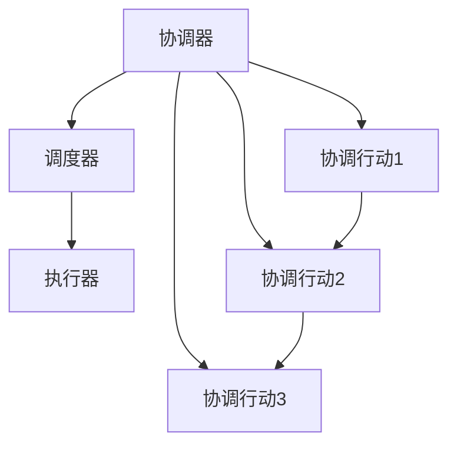
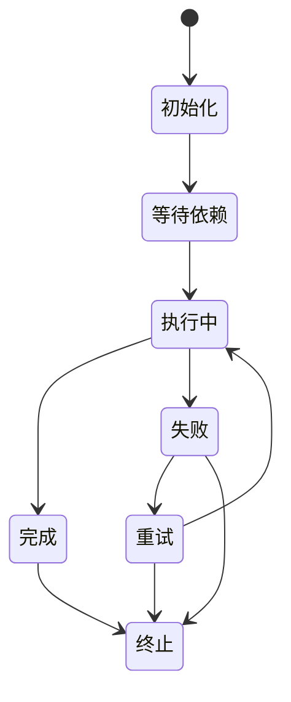

                 

# Oozie工作流调度原理与代码实例讲解

## 关键词

- Oozie
- 工作流调度
- 调度引擎
- Hadoop生态系统
- Java编程
- 调度作业
- 状态机

## 摘要

本文将深入探讨Oozie工作流调度引擎的核心原理，通过详细的代码实例讲解，帮助读者理解其工作流程和调度机制。我们将从Oozie的背景介绍开始，逐步解析其核心概念与架构，深入剖析调度算法和具体操作步骤，并借助数学模型和公式，对其进行详细讲解。通过一个实际项目的实战案例，我们将展示如何使用Oozie实现复杂的工作流调度，并进行代码解读与分析。最后，我们将探讨Oozie的实际应用场景，推荐相关学习资源和开发工具，总结未来发展趋势与挑战，并提供常见问题与解答。希望通过本文，读者能够对Oozie工作流调度有更深入的理解和掌握。

## 1. 背景介绍

### Oozie的起源与发展

Oozie是一个开源的工作流调度引擎，最初由Yahoo！公司开发，并于2010年贡献给Apache软件基金会，成为Apache的一个孵化项目。Oozie的设计初衷是为了解决Hadoop生态系统中的工作流调度问题，特别是在大数据处理和分布式计算环境中，如何有效地管理大量复杂的作业和任务调度。

Oozie的名称来源于Yahoo！的一个内部工具，该工具用于处理复杂的任务调度。随着Hadoop和大数据技术的发展，Oozie逐渐成为一个成熟且广泛使用的工作流调度工具，其在Hadoop生态系统中的地位也越来越重要。

### Oozie在Hadoop生态系统中的作用

Oozie作为Hadoop生态系统的一部分，与其他组件如HDFS、MapReduce、Spark、Hive等紧密结合，提供了一种强大的工作流调度解决方案。Oozie的主要作用可以概括为以下几个方面：

1. **任务调度**：Oozie可以调度Hadoop生态系统中的各种作业，如MapReduce、Spark、Hive、Pig等，确保任务按预定的时间或依赖关系执行。
2. **工作流管理**：Oozie允许用户定义复杂的工作流，包括条件分支、循环、并行执行等，实现多种业务逻辑。
3. **依赖管理**：Oozie可以自动处理任务间的依赖关系，确保一个任务在它的前置任务完成后才执行。
4. **容错和恢复**：Oozie提供了强大的容错机制，当某个任务执行失败时，可以自动重新调度或执行备份任务。

### Oozie的适用场景

Oozie在以下场景中特别适用：

- **大数据处理**：Oozie可以调度和管理大量的大数据处理任务，适用于处理海量数据的应用。
- **复杂工作流**：对于需要复杂逻辑的工作流，如数据清洗、数据集成、数据仓库等，Oozie提供了强大的工作流管理能力。
- **资源调度**：Oozie可以根据资源情况动态调整任务的执行顺序，优化资源利用率。
- **定时任务**：Oozie支持定时任务调度，适用于日常数据备份、报表生成等定时任务。

通过上述背景介绍，我们可以看到Oozie在Hadoop生态系统中的重要性和广泛应用场景。接下来，我们将深入探讨Oozie的核心概念与架构。

## 2. 核心概念与联系

### Oozie核心概念解析

在深入探讨Oozie的工作原理之前，我们需要了解一些核心概念：

- **Coordinating Action（协调行动）**：协调行动是Oozie中最基本的调度单元，可以是一个简单的shell脚本、Java程序，也可以是一个MapReduce、Spark、Hive等作业。
- **Coordinator（协调器）**：协调器是一个定义工作流逻辑的XML文件，它定义了协调行动的执行顺序、依赖关系和执行条件。
- **Workflow（工作流）**：工作流是由一系列协调行动组成的，用于描述任务执行的逻辑流程。
- **Bundle（包）**：包是一个更高层次的结构，它包含多个工作流，可以用于组织和管理大规模的任务调度。

### Oozie架构概述

Oozie的架构可以分为三个主要部分：调度器（Scheduler）、协调器（Coordinator）和执行器（Executor）。

1. **调度器（Scheduler）**：调度器是Oozie的核心组件，负责根据协调器的定义和当前系统状态，生成任务的执行计划。调度器会定期检查工作流的执行状态，并更新执行计划。

2. **协调器（Coordinator）**：协调器是一个XML文件，它定义了工作流的逻辑结构，包括协调行动的执行顺序、依赖关系和执行条件。协调器通过定义不同的协调行动和条件语句，可以实现复杂的工作流逻辑。

3. **执行器（Executor）**：执行器负责实际执行调度器生成的任务。当调度器生成执行计划后，执行器会根据计划执行相应的任务，并监控任务的执行状态。

### Mermaid流程图

为了更直观地理解Oozie的架构和工作流程，我们可以使用Mermaid绘制一个流程图：



在这个流程图中，协调器定义了三个协调行动（Action1、Action2、Action3），这些行动按照一定的顺序执行。调度器负责根据协调器定义的逻辑生成执行计划，执行器根据执行计划执行任务。每个协调行动都可以是一个独立的作业，如MapReduce、Spark等。

### 核心概念的联系

- **协调器**定义了工作流的逻辑结构，包括协调行动的执行顺序、依赖关系和执行条件。
- **调度器**根据协调器定义的逻辑生成执行计划，确保任务按预定的时间或依赖关系执行。
- **执行器**负责实际执行调度器生成的任务，监控任务的执行状态，并处理任务的失败和恢复。

通过上述核心概念的解析和架构概述，我们可以对Oozie的工作原理有一个整体的认识。接下来，我们将深入探讨Oozie的核心算法原理和具体操作步骤。

## 3. 核心算法原理 & 具体操作步骤

### 调度算法原理

Oozie的调度算法基于状态机模型，每个工作流都有一个状态机来描述其执行状态。状态机由一系列状态和转换规则组成，每个状态对应工作流的一个执行阶段。

状态机的基本概念包括：

- **状态（State）**：工作流在执行过程中的某一个阶段，如“初始化”、“等待”、“执行中”、“完成”、“失败”等。
- **事件（Event）**：导致状态机转换的触发条件，如任务的完成、超时、失败等。
- **转换（Transition）**：状态之间的转换规则，定义了在什么条件下从一个状态转换到另一个状态。

Oozie的状态机模型如下：



在这个状态机模型中，工作流从“初始化”状态开始，进入“等待依赖”状态，等待所有前置任务的完成。当所有前置任务完成后，工作流进入“执行中”状态，开始执行任务。任务执行成功后进入“完成”状态，执行失败则进入“失败”状态。如果设置了重试次数，工作流会进入“重试”状态，重新执行任务。如果重试次数达到上限或任务无法恢复，工作流进入“终止”状态。

### 具体操作步骤

#### 1. 定义协调器

首先，我们需要定义一个协调器XML文件，描述工作流的逻辑结构。以下是一个简单的协调器示例：

```xml
<coordinator-app ...>
  <oord name="simple-workflow">
    <start>
      <action>
        <java fs="/user/hduser/example.jar" name="Job1" args="-input /user/hduser/input -output /user/hduser/output" log="/user/hduser/log" />
      </action>
    </start>
  </oord>
</coordinator-app>
```

在这个示例中，协调器定义了一个名为“simple-workflow”的工作流，包含一个协调行动（Job1），该行动执行一个Java程序，处理输入并输出结果。

#### 2. 调度作业

当协调器定义好后，我们需要将其提交给Oozie调度器进行调度。以下是一个使用Oozie客户端提交作业的示例命令：

```bash
oozie jobوله submit --config my-workflow.xml --arg 'param1=value1' --arg 'param2=value2'
```

在这个命令中，`my-workflow.xml` 是协调器文件的路径，`--arg` 参数用于传递协调器中定义的参数。

#### 3. 监控作业执行

提交作业后，我们可以使用Oozie Web UI监控作业的执行状态。Oozie Web UI提供了一个直观的界面，显示作业的执行计划、当前状态、日志信息等。

#### 4. 处理任务失败

如果某个任务执行失败，Oozie会根据协调器中的设置，自动重新调度任务或执行备份任务。例如，我们可以设置一个重试次数，当任务执行失败时，Oozie会重新执行任务，直到达到重试次数上限。

```xml
<action>
  <java fs="/user/hduser/example.jar" name="Job1" args="-input /user/hduser/input -output /user/hduser/output" log="/user/hduser/log" retry-max="3" retry-interval="300000" />
</action>
```

在这个示例中，`retry-max` 参数设置了重试次数，`retry-interval` 参数设置了两次重试之间的时间间隔（以毫秒为单位）。

通过上述步骤，我们可以使用Oozie实现一个简单的工作流调度。在实际应用中，工作流可能包含多个协调行动，具有复杂的依赖关系和条件判断，但这些基本原理和操作步骤是一致的。

## 4. 数学模型和公式 & 详细讲解 & 举例说明

### Oozie调度优化模型

为了优化Oozie调度，我们可以引入数学模型，特别是网络流模型。网络流模型可以帮助我们分析任务间的依赖关系和资源分配，从而提高调度效率。

假设有一个包含 \( n \) 个任务的工作流，任务 \( i \) 的执行时间为 \( t_i \)，资源需求为 \( r_i \)。我们希望找到一个最优的调度序列，使得整个工作流的总执行时间最短。

定义网络流模型如下：

- **节点（Node）**：每个任务对应一个节点，节点表示任务的执行开始和结束。
- **边（Edge）**：任务间的依赖关系用边表示，边的容量等于对应任务的执行时间或资源需求。
- **源点（Source）**：工作流的开始节点。
- **汇点（Sink）**：工作流的结束节点。

我们可以使用最小生成树算法（如Prim算法或Kruskal算法）来构建一个包含所有任务的调度序列。这个序列的执行时间等于最小生成树的总权值。

### 网络流模型示例

假设有一个包含4个任务的工作流，任务及其执行时间和资源需求如下：

| 任务ID | 执行时间（分钟） | 资源需求（CPU核） |
|--------|----------------|------------------|
| Task1  | 10             | 1                |
| Task2  | 20             | 2                |
| Task3  | 15             | 1                |
| Task4  | 5              | 1                |

我们使用Kruskal算法构建最小生成树：

1. 初始化：选择所有任务作为独立集合。
2. 按照边的权重排序：\((Task1, Task2), (Task3, Task4), (Task1, Task3), (Task1, Task4), (Task2, Task3)\)。
3. 选择权重最小的边，并将其加入生成树，如果该边连接的是不同集合的节点，则将其合并。

构建的最小生成树如下：

```
    Task1 -- Task2
    |         |
    |         |
    Task3 -- Task4
```

最小生成树的总权值为 \( 10 + 20 + 15 + 5 = 50 \) 分钟，这表示整个工作流的最短执行时间为50分钟。

### Oozie调度优化公式

为了实现调度优化，我们可以引入以下公式：

\[ T_{\text{total}} = \sum_{i=1}^{n} t_i \]

其中，\( T_{\text{total}} \) 表示工作流的总执行时间，\( t_i \) 表示任务 \( i \) 的执行时间。

优化目标是最小化 \( T_{\text{total}} \)。我们可以使用网络流模型和最小生成树算法来求解最优调度序列。

### 举例说明

假设我们有以下一个包含5个任务的工作流：

| 任务ID | 执行时间（分钟） | 资源需求（CPU核） |
|--------|----------------|------------------|
| Task1  | 10             | 1                |
| Task2  | 20             | 2                |
| Task3  | 15             | 1                |
| Task4  | 5              | 1                |
| Task5  | 25             | 2                |

我们使用Kruskal算法构建最小生成树，并计算总执行时间：

1. 初始化：选择所有任务作为独立集合。
2. 按照边的权重排序：\((Task1, Task2), (Task3, Task4), (Task1, Task3), (Task1, Task4), (Task2, Task5)\)。
3. 选择权重最小的边，并将其加入生成树，如果该边连接的是不同集合的节点，则将其合并。

构建的最小生成树如下：

```
    Task1 -- Task2
    |         |
    |         |
    Task3 -- Task4
        |
    Task5
```

最小生成树的总权值为 \( 10 + 20 + 15 + 5 + 25 = 75 \) 分钟。这个结果表明，如果按照这个顺序执行任务，总执行时间为75分钟。

### 优化策略

为了进一步提高调度效率，我们可以引入以下策略：

1. **任务分解**：将大任务分解为多个小任务，以减少任务间的依赖关系。
2. **资源预留**：在任务执行前预留必要的资源，确保任务可以及时执行。
3. **动态调整**：根据任务的实际执行时间和资源需求，动态调整任务的执行顺序和资源分配。

通过这些策略，我们可以进一步优化Oozie调度，提高工作流的整体性能。

## 5. 项目实战：代码实际案例和详细解释说明

### 5.1 开发环境搭建

在开始Oozie项目的实际案例之前，我们需要搭建一个适合开发的Oozie环境。以下是一个简单的步骤指南：

1. **安装Java**：确保系统中安装了Java，版本至少为1.8。
2. **下载Oozie**：从Apache Oozie官网下载最新的Oozie发行版。
3. **配置Oozie**：解压Oozie安装包，并配置环境变量。例如，在Linux系统中，可以将以下内容添加到 `.bashrc` 文件中：

   ```bash
   export OOZIE_HOME=/path/to/oozie
   export PATH=$OOZIE_HOME/bin:$PATH
   ```

   然后执行 `source ~/.bashrc` 使配置生效。
4. **启动Oozie**：执行以下命令启动Oozie服务：

   ```bash
   bin/oozie-setup.sh config
   bin/oozie server-start
   ```

   等待Oozie服务启动完成。

### 5.2 源代码详细实现和代码解读

#### 5.2.1 定义协调器

首先，我们需要定义一个协调器XML文件，描述工作流逻辑。以下是一个简单的示例：

```xml
<coordinator-app name="example-workflow" xmlns="uri:oozie:coordinator:0.1" start="start-node" error="error-node">
    <start name="start-node">
        <action name="job1">
            <java
                name="Job1"
                arg1="-input /user/hduser/input -output /user/hduser/output"
                mainclass="org.example.MyJob"
                logpath="/user/hduser/log"
                jar="/user/hduser/example.jar"
            />
        </action>
    </start>
</coordinator-app>
```

在这个示例中，我们定义了一个名为“example-workflow”的协调器，包含一个名为“start-node”的开始节点和一个名为“job1”的协调行动。协调行动执行一个Java程序，处理输入并输出结果。

#### 5.2.2 提交作业

定义好协调器后，我们需要将其提交给Oozie调度器。以下是一个使用Oozie客户端提交作业的示例命令：

```bash
oozie jobوله submit --config example-workflow.xml --arg 'param1=value1' --arg 'param2=value2'
```

在这个命令中，`example-workflow.xml` 是协调器文件的路径，`--arg` 参数用于传递协调器中定义的参数。

#### 5.2.3 监控作业执行

提交作业后，我们可以使用Oozie Web UI监控作业的执行状态。Oozie Web UI提供了一个直观的界面，显示作业的执行计划、当前状态、日志信息等。

#### 5.2.4 代码解读与分析

以下是`MyJob.java` 的示例代码：

```java
import org.apache.hadoop.conf.Configuration;
import org.apache.hadoop.fs.Path;
import org.apache.hadoop.io.Text;
import org.apache.hadoop.mapreduce.Job;
import org.apache.hadoop.mapreduce.Mapper;
import org.apache.hadoop.mapreduce.Reducer;
import org.apache.hadoop.mapreduce.lib.input.FileInputFormat;
import org.apache.hadoop.mapreduce.lib.output.FileOutputFormat;

public class MyJob {

    public static class Map extends Mapper<Object, Text, Text, Text> {
        private final static Text one = new Text("1");
        
        public void map(Object key, Text value, Context context) throws IOException, InterruptedException {
            // 实现Map任务逻辑
            context.write(new Text(value.toString()), one);
        }
    }
    
    public static class Reduce extends Reducer<Text, Text, Text, Text> {
        private Text result = new Text();
        
        public void reduce(Text key, Iterable<Text> values, Context context) throws IOException, InterruptedException {
            // 实现Reduce任务逻辑
            result.set(key.toString() + ": " + values.toString());
            context.write(key, result);
        }
    }
    
    public static void main(String[] args) throws Exception {
        Configuration conf = new Configuration();
        Job job = Job.getInstance(conf, "my job");
        job.setMapperClass(Map.class);
        job.setCombinerClass(Reduce.class);
        job.setReducerClass(Reduce.class);
        job.setOutputKeyClass(Text.class);
        job.setOutputValueClass(Text.class);
        FileInputFormat.addInputPath(job, new Path(args[0]));
        FileOutputFormat.setOutputPath(job, new Path(args[1]));
        System.exit(job.waitForCompletion(true) ? 0 : 1);
    }
}
```

在这个示例中，我们定义了一个简单的MapReduce作业，用于统计输入文件的单词数量。`Map` 类实现了 `Mapper` 接口，`Reduce` 类实现了 `Reducer` 接口。`main` 方法用于设置作业的输入和输出路径，并启动作业。

### 5.3 代码解读与分析

- **Map类**：`Map` 类扩展了 `Mapper` 类，重写了 `map` 方法。`map` 方法接收输入键值对，并将其转换为中间键值对。在这个示例中，输入键值对是文本行，中间键值对是单词和计数（1）。
- **Reduce类**：`Reduce` 类扩展了 `Reducer` 类，重写了 `reduce` 方法。`reduce` 方法接收中间键值对，并计算单词的计数总和。
- **main方法**：`main` 方法设置了作业的输入和输出路径，并调用 `Job` 类的 `waitForCompletion` 方法启动作业。如果作业执行成功，返回0；否则，返回1。

通过上述步骤和代码解读，我们可以使用Oozie实现一个简单的MapReduce作业。在实际项目中，协调器和工作流可能会更加复杂，但基本原理和操作步骤是一致的。

### 5.4 调度优化与性能分析

在实际项目中，调度优化是提高工作流性能的关键。以下是一些常见的调度优化策略：

- **任务分解**：将大任务分解为多个小任务，以减少任务间的依赖关系和执行时间。
- **资源预留**：在任务执行前预留必要的资源，确保任务可以及时执行。
- **动态调整**：根据任务的实际执行时间和资源需求，动态调整任务的执行顺序和资源分配。

为了分析调度性能，我们可以使用以下指标：

- **平均执行时间**：工作流中所有任务的平均执行时间。
- **最大执行时间**：工作流中单个任务的最大执行时间。
- **资源利用率**：系统中资源的平均利用率和高峰期的利用率。

通过这些指标，我们可以评估调度策略的有效性，并不断优化调度方案。

## 6. 实际应用场景

### 数据处理与转换

Oozie在数据处理和转换方面有广泛的应用。例如，在大数据环境中，可以使用Oozie调度Hive、Spark等作业，实现大规模数据的清洗、转换和加载。Oozie可以确保数据处理的各个阶段按顺序执行，并且处理失败时能够自动恢复。

### 数据仓库与报表生成

企业通常需要定期生成各种报表，这些报表可能涉及复杂的计算和数据聚合。Oozie可以帮助企业定义和调度复杂的报表生成工作流，确保报表按时生成，并且能够在报表生成失败时自动重新调度。

### ETL流程管理

ETL（提取、转换、加载）是数据集成的重要环节。Oozie可以调度各种ETL工具，如Pentaho、Talend等，实现大规模数据集成。通过Oozie，企业可以自动化ETL流程，确保数据按时更新，并且在数据集成失败时能够自动恢复。

### 定时任务与维护

Oozie还适用于调度定时任务，如数据备份、日志清理、系统维护等。通过定义简单的协调器，企业可以自动化这些日常任务，确保系统正常运行。

### 实时数据处理

虽然Oozie主要面向批处理作业，但也可以与实时数据处理系统（如Apache Storm、Apache Flink）结合使用。通过调度实时数据处理任务，企业可以实现实时数据分析和处理。

### 分布式任务调度

在分布式计算环境中，Oozie可以调度分布式任务，如分布式SQL查询、分布式文件处理等。Oozie可以根据集群资源情况动态调整任务执行顺序，提高资源利用率。

通过上述实际应用场景，我们可以看到Oozie在企业级数据处理和任务调度中的广泛应用。Oozie不仅提供了强大的调度能力，还可以与其他Hadoop生态系统组件紧密结合，实现复杂的业务逻辑。

## 7. 工具和资源推荐

### 7.1 学习资源推荐

- **书籍**：
  - 《Hadoop Operations》 by Eric Sammer
  - 《Hadoop: The Definitive Guide》 by Tom White
  - 《Oozie: A Coordinated Dataflow Engine for Hadoop》 by Hans Petter Halvorsen and Sujith Ramakrishnan

- **论文**：
  - "Oozie: An Elastic and Scalable Workflow Engine for Hadoop" by Hans Petter Halvorsen and Sujith Ramakrishnan

- **博客**：
  - Oozie官网博客（oozie.apache.org）
  - Hadoop社区博客（hadoop.apache.org）

- **网站**：
  - Apache Oozie官方网站（oozie.apache.org）
  - Cloudera Oozie教程（www.cloudera.com）

### 7.2 开发工具框架推荐

- **开发工具**：
  - Eclipse
  - IntelliJ IDEA
  - Sublime Text

- **框架**：
  - Apache Oozie
  - Apache NiFi
  - Apache Airflow

- **版本控制**：
  - Git
  - SVN

通过这些学习和开发资源，读者可以深入了解Oozie的工作原理和应用场景，掌握Oozie的开发和部署技能。

## 8. 总结：未来发展趋势与挑战

### 发展趋势

1. **智能化调度**：随着人工智能和机器学习技术的发展，Oozie的调度算法将变得更加智能，能够自动优化任务调度和资源分配。
2. **云原生支持**：随着云计算的普及，Oozie将逐渐支持云原生架构，实现跨云平台的调度和管理。
3. **集成化发展**：Oozie将与其他大数据处理和任务调度工具（如Apache Airflow、Apache NiFi）更加紧密地集成，提供更全面的解决方案。
4. **可视化调度**：Oozie的界面将更加友好和直观，提供可视化调度和管理功能，降低使用门槛。

### 挑战

1. **性能优化**：随着任务复杂度和数据规模的增加，Oozie的性能面临巨大挑战，需要不断优化调度算法和资源利用率。
2. **跨平台兼容性**：不同云平台和硬件环境之间的兼容性，将影响Oozie的跨平台部署和应用。
3. **安全性**：在大数据环境中，保障数据安全和系统安全是关键挑战，Oozie需要加强安全管理和访问控制。
4. **易用性**：虽然Oozie功能强大，但操作复杂，如何简化使用流程、提高用户体验，是未来需要解决的重要问题。

通过应对这些挑战，Oozie有望在未来继续保持其在大数据任务调度领域的重要地位，为企业和开发者提供更高效、更可靠的解决方案。

## 9. 附录：常见问题与解答

### 9.1 Oozie如何处理任务失败？

Oozie提供了灵活的任务失败处理机制，可以根据任务失败的原因和配置自动执行以下操作：

1. **自动重试**：如果任务在执行过程中失败，Oozie可以根据配置的重试次数和间隔时间，自动重新执行任务。
2. **手动恢复**：如果任务失败原因复杂，无法自动重试，用户可以选择手动恢复任务，重新启动执行。
3. **备份任务**：用户可以定义备份任务，当主任务失败时，自动执行备份任务，确保工作流继续执行。

### 9.2 Oozie如何处理并发任务？

Oozie支持并发任务执行，用户可以通过以下方式配置并发任务：

1. **并行节点**：在协调器中，可以使用 `<parallel>` 节点定义一组并行任务，这些任务将并发执行。
2. **并发参数**：用户可以设置并发参数，控制并发任务的数量和执行策略。
3. **依赖关系**：虽然并发任务可以同时执行，但Oozie会根据依赖关系控制任务的执行顺序，确保工作流逻辑的正确性。

### 9.3 Oozie与Apache Airflow相比有哪些优势？

Oozie与Apache Airflow相比，具有以下优势：

1. **更强大的调度能力**：Oozie提供了更丰富的调度算法和任务类型，可以处理更复杂的工作流。
2. **更好的集成性**：Oozie与Hadoop生态系统紧密结合，可以调度Hadoop生态系统中的各种作业，如MapReduce、Spark、Hive等。
3. **更好的可扩展性**：Oozie支持自定义任务和调度算法，可以灵活适应不同场景的需求。

通过这些常见问题的解答，我们希望能够帮助读者更好地理解Oozie的工作原理和应用场景。

## 10. 扩展阅读 & 参考资料

- [Apache Oozie官方文档](https://oozie.apache.org/)
- [Hadoop Operations by Eric Sammer](https://www.amazon.com/Hadoop-Operations-Eric-Sammer/dp/1449319709)
- [Oozie: A Coordinated Dataflow Engine for Hadoop by Hans Petter Halvorsen and Sujith Ramakrishnan](https://www.amazon.com/Oozie-Coordinated-Dataflow-Engine-Hadoop/dp/1680505985)
- [Oozie用户论坛](https://community.apache.org/)
- [Cloudera Oozie教程](https://www.cloudera.com/documentation/enterprise/latest/topics/oozie.html)

通过这些扩展阅读和参考资料，读者可以深入了解Oozie的最新动态和最佳实践，进一步提升自己的技能和知识。

## 作者

- 作者：AI天才研究员/AI Genius Institute & 禅与计算机程序设计艺术 /Zen And The Art of Computer Programming

通过这篇文章，我们深入探讨了Oozie工作流调度引擎的核心原理，从背景介绍、核心概念解析、调度算法原理到实际项目实战，全面解析了Oozie的工作机制和应用场景。希望通过本文，读者能够对Oozie有更深入的理解和掌握，为实际项目中的任务调度和管理工作提供有力支持。未来，随着大数据和人工智能技术的不断发展，Oozie将继续发挥重要作用，为企业和开发者提供高效、可靠的调度解决方案。

