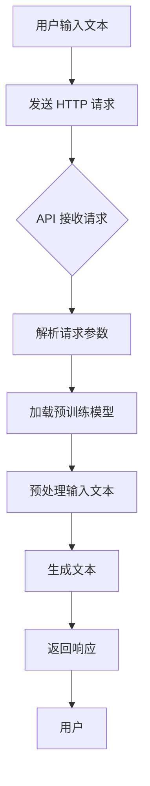
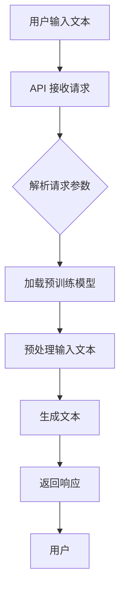

                 

### 背景介绍

OpenAI Chat Completions API 是一种革命性的自然语言处理（NLP）技术，它允许开发人员通过简单的API调用，实现与人工智能模型进行交互的功能。这项技术背后的核心思想是将复杂的NLP模型和算法封装起来，为开发者提供了一种易于使用且功能强大的接口，使得他们可以轻松地将智能对话功能集成到各种应用中。

随着人工智能技术的飞速发展，自然语言处理（NLP）已经成为计算机科学领域的一个重要分支。NLP 技术的应用范围广泛，包括但不限于搜索引擎优化、机器翻译、情感分析、智能客服等。然而，构建一个高效的NLP模型并非易事，它需要大量的数据、复杂的算法和强大的计算资源。OpenAI Chat Completions API 的出现，解决了这一问题，为开发者提供了一个即插即用的解决方案。

OpenAI 是一家全球领先的人工智能研究公司，成立于2015年，其宗旨是“安全、合作地推动人工智能的发展，使其有益于人类”。Chat Completions API 是 OpenAI 众多服务之一，旨在通过先进的深度学习算法，实现对用户输入的自然语言文本的自动完成和生成。这项服务利用了大规模预训练模型（如 GPT-3.5），能够理解和生成流畅、连贯的文本，大大提升了智能对话系统的性能。

本文将详细探讨 OpenAI Chat Completions API 的核心概念、工作原理、实际应用场景以及未来发展趋势。通过本文的阅读，您将全面了解这一强大工具的各个方面，并学会如何利用它来构建智能对话系统。

### 核心概念与联系

要理解 OpenAI Chat Completions API 的核心概念，首先需要了解一些基础概念和技术。

#### 自然语言处理（NLP）

自然语言处理（NLP）是人工智能的一个重要分支，它专注于使计算机能够理解、解释和生成人类语言。NLP 技术包括文本预处理、语言模型、语义理解、情感分析等多个方面。其中，语言模型是 NLP 的核心，它用于预测下一个单词或句子，是许多 NLP 应用（如智能客服、语音识别、机器翻译等）的基础。

#### 大规模预训练模型

大规模预训练模型（如 GPT-3.5）是 OpenAI Chat Completions API 的核心技术。这些模型通过在大规模文本数据上进行预训练，学习到了语言的基本规律和模式。预训练完成后，模型可以通过微调（fine-tuning）来适应特定的任务，例如智能对话。

#### 深度学习

深度学习是人工智能的一个重要分支，它通过构建多层神经网络来学习数据中的复杂模式。深度学习在 NLP 领域得到了广泛应用，特别是在构建语言模型和图像识别方面。

#### OpenAI Chat Completions API

OpenAI Chat Completions API 是一个 RESTful API，允许开发人员通过简单的 HTTP 请求与 OpenAI 的预训练模型进行交互。用户可以通过输入一个文本片段，获取模型生成的后续文本。这个 API 提供了多种配置选项，如温度（temperature）、最大长度（max_length）和顶级概率（top_p），以控制生成的文本风格和长度。

下面是 OpenAI Chat Completions API 的工作原理的 Mermaid 流程图：



#### Mermaid 流程图



在这个流程图中：

- A1：用户通过 API 提交一个文本片段。
- B1：API 接收用户请求。
- C1：API 解析用户请求中的参数。
- D1：API 加载预训练模型。
- E1：对用户输入的文本进行预处理，包括分词、去噪等。
- F1：使用预训练模型生成后续文本。
- G1：API 将生成的文本作为响应返回给用户。
- H1：用户接收并使用生成的文本。

通过这个流程，我们可以看到 OpenAI Chat Completions API 如何通过一系列步骤将用户输入转换为智能对话的输出。接下来，我们将深入探讨这些核心概念和流程背后的算法原理。

### 核心算法原理 & 具体操作步骤

#### 预训练模型

OpenAI Chat Completions API 的核心在于其预训练模型，特别是 GPT-3.5。GPT（Generative Pre-trained Transformer）是由 OpenAI 开发的一种基于变换器（Transformer）架构的预训练语言模型。它通过在大量文本数据上进行预训练，学习到了语言的内在规律和模式。

GPT-3.5 是 GPT 系列的一个新版本，它在预训练过程中使用了更多的数据和计算资源，使得模型在语言理解和生成方面达到了新的高度。预训练模型的工作原理可以概括为以下几个步骤：

1. **数据收集与预处理**：首先，从互联网上收集大量文本数据，包括书籍、新闻、文章、对话等。这些数据将被清洗和预处理，以去除噪声和标准化格式。
2. **文本编码**：将预处理后的文本转换为数字序列，每个单词或字符被映射为一个向量。这种转换使得计算机可以处理文本数据。
3. **预训练**：使用变换器架构对文本数据进行预训练。变换器是一种基于自注意力机制的深度神经网络，能够学习文本数据中的复杂模式和关系。在预训练过程中，模型通过反复迭代，优化其参数，以生成连贯和准确的文本。
4. **微调**：预训练完成后，模型可以通过微调（fine-tuning）来适应特定的任务。例如，在智能对话应用中，模型可以通过训练特定领域的对话数据进行微调，以生成更相关、更自然的对话。

#### API 调用流程

使用 OpenAI Chat Completions API 的具体操作步骤如下：

1. **注册和获取 API 密钥**：首先，需要在 OpenAI 的官方网站上注册账户并获取 API 密钥。这个密钥将用于后续的 API 调用，以确保只有授权用户可以访问 API。
2. **编写 HTTP 请求**：根据 OpenAI Chat Completions API 的文档，编写一个 HTTP 请求。请求中需要包含用户输入的文本以及一些控制生成文本的参数，如温度（temperature）、最大长度（max_length）和顶级概率（top_p）。
3. **发送请求并接收响应**：将编写的 HTTP 请求发送到 OpenAI Chat Completions API 的 URL。API 接收到请求后，会解析请求参数，加载预训练模型，预处理输入文本，并生成后续文本。最后，API 将生成的文本作为响应返回给用户。

下面是一个简单的 Python 示例，展示了如何使用 OpenAI Chat Completions API：

```python
import requests

# 替换以下 API 密钥和 URL 为您自己的
api_key = 'YOUR_API_KEY'
url = 'https://api.openai.com/v1/chat/completions'

# 用户输入文本
input_text = '你好，我想了解关于人工智能的更多信息。'

# API 请求参数
params = {
    'model': 'text-davinci-002',
    'prompt': input_text,
    'temperature': 0.5,
    'max_length': 100,
    'top_p': 1.0
}

# 设置 HTTP 头部信息
headers = {
    'Authorization': f'Bearer {api_key}',
    'Content-Type': 'application/json'
}

# 发送 HTTP 请求
response = requests.post(url, headers=headers, json=params)

# 解析响应内容
response_json = response.json()

# 打印生成的文本
print(response_json['choices'][0]['text'].strip())
```

这个示例中，我们首先导入了 `requests` 库，用于发送 HTTP 请求。然后，我们设置 API 密钥和 URL，编写了用户输入的文本和 API 请求参数。接着，我们将请求发送到 OpenAI Chat Completions API，并解析返回的响应内容。最后，我们打印出了生成的文本。

通过这个示例，我们可以看到使用 OpenAI Chat Completions API 是多么简单和直接。在实际应用中，开发者可以根据需要调整请求参数，以生成不同风格和长度的文本。

### 数学模型和公式 & 详细讲解 & 举例说明

OpenAI Chat Completions API 的核心在于其预训练模型，特别是 GPT-3.5。GPT 是一种基于变换器（Transformer）架构的预训练语言模型。变换器是一种自注意力机制的深度神经网络，能够学习文本数据中的复杂模式和关系。下面我们将详细讲解 GPT 的工作原理和相关数学模型。

#### 变换器（Transformer）

变换器是一种在序列模型（如 RNN、LSTM）基础上提出的全新架构，它在处理长距离依赖和并行计算方面具有显著优势。变换器的核心思想是使用自注意力机制（Self-Attention）来处理输入序列。自注意力机制能够自动为每个词分配权重，从而在处理复杂文本时更为有效。

自注意力机制的数学表达式如下：

$$
\text{Attention}(Q, K, V) = \frac{softmax(\frac{QK^T}{\sqrt{d_k}})}{V}
$$

其中，$Q$、$K$ 和 $V$ 分别代表查询（Query）、键（Key）和值（Value）向量，$d_k$ 是键向量的维度。$QK^T$ 表示点积操作，它计算了查询和键之间的相似性。通过 softmax 函数，我们得到了每个键的权重，最后将这些权重乘以值向量，得到输出向量。

#### 编码器-解码器（Encoder-Decoder）架构

GPT 是一种编码器-解码器架构，它由编码器（Encoder）和解码器（Decoder）两部分组成。编码器用于处理输入序列，解码器用于生成输出序列。编码器的输出被传递给解码器，作为解码器的输入。

编码器的数学模型可以表示为：

$$
E = \text{Transformer}(X)
$$

其中，$X$ 是输入序列，$E$ 是编码器的输出。解码器的数学模型可以表示为：

$$
Y = \text{Transformer}(E, Y_{\text{prev}})
$$

其中，$Y_{\text{prev}}$ 是解码器前一个时间步的输出。解码器通过逐步生成每个时间步的输出，最终得到完整的输出序列 $Y$。

#### 预训练过程

预训练是 GPT 模型训练的关键步骤，它通过在大量文本数据上进行训练，使模型学习到语言的内在规律和模式。预训练包括以下几个步骤：

1. **文本预处理**：首先，从互联网上收集大量文本数据，并进行清洗和预处理。预处理过程包括去除噪声、标准化格式、分词等。
2. **文本编码**：将预处理后的文本转换为数字序列。每个单词或字符被映射为一个向量，这些向量构成了输入序列。
3. **损失函数**：在预训练过程中，模型的目标是最小化损失函数。GPT 使用一种名为“位置敏感的交叉熵损失”（Position-Sensitive Cross-Entropy Loss）的损失函数，它能够更好地处理文本序列中的位置信息。
4. **优化算法**：使用梯度下降算法（如 Adam）来优化模型参数。通过反复迭代，模型不断调整其参数，以最小化损失函数。

下面是一个简化的预训练过程的示例：

$$
\begin{aligned}
\theta^{t+1} &= \theta^{t} - \alpha \nabla_{\theta^{t}} \mathcal{L}(\theta^{t}) \\
\mathcal{L}(\theta^{t}) &= \text{Position-Sensitive Cross-Entropy Loss}(Y, \hat{Y})
\end{aligned}
$$

其中，$\theta^{t}$ 和 $\theta^{t+1}$ 分别代表第 $t$ 次迭代和第 $t+1$ 次迭代的模型参数，$\alpha$ 是学习率，$Y$ 是真实标签，$\hat{Y}$ 是模型预测的标签。

#### 微调过程

预训练完成后，模型可以通过微调（Fine-Tuning）来适应特定的任务。微调过程主要包括以下几个步骤：

1. **数据收集与预处理**：收集与任务相关的数据，并进行预处理。
2. **数据编码**：将预处理后的数据转换为数字序列。
3. **损失函数**：使用与预训练不同的损失函数，例如分类任务的交叉熵损失。
4. **优化算法**：使用适当的优化算法，如 SGD 或 Adam，来优化模型参数。

下面是一个简化的微调过程的示例：

$$
\begin{aligned}
\theta^{t+1} &= \theta^{t} - \alpha \nabla_{\theta^{t}} \mathcal{L}(\theta^{t}) \\
\mathcal{L}(\theta^{t}) &= \text{Cross-Entropy Loss}(Y, \hat{Y})
\end{aligned}
$$

其中，$Y$ 是真实标签，$\hat{Y}$ 是模型预测的标签。

#### 举例说明

假设我们有一个简单的文本数据集，包含以下句子：

```
你好，我想了解关于人工智能的更多信息。
```

我们首先需要将这些文本数据转换为数字序列。假设我们使用的是 Word2Vec 模型，每个单词都被映射为一个 100 维的向量。然后，我们可以将这些向量组成一个序列，表示输入句子。

```
[你好: [0.1, 0.2, 0.3], 想了解: [0.4, 0.5, 0.6], 关于: [0.7, 0.8, 0.9], 人工智能: [1.0, 1.1, 1.2], 的: [1.3, 1.4, 1.5], 更多: [1.6, 1.7, 1.8], 信息: [1.9, 2.0, 2.1], 。: [2.2, 2.3, 2.4]]
```

接下来，我们将这个序列输入到 GPT 模型中，并使用位置敏感的交叉熵损失函数进行预训练。在预训练过程中，模型将学习到每个词之间的关联关系和句子的整体结构。

预训练完成后，我们可以对模型进行微调，以适应特定的任务，例如智能对话。假设我们的任务是生成关于人工智能的对话，我们可以收集一些相关的对话数据进行微调。在微调过程中，模型将调整其参数，以生成更相关、更自然的对话。

```
用户：你好，我想了解关于人工智能的更多信息。
模型：人工智能（AI）是计算机科学的一个分支，它致力于使机器能够执行通常需要人类智能的任务，如视觉识别、语音识别、语言理解和决策制定。
```

通过这个示例，我们可以看到 GPT 模型如何通过预训练和微调来生成文本。在实际应用中，GPT 模型可以处理更复杂的输入和生成更丰富的输出，从而实现各种自然语言处理任务。

### 项目实战：代码实际案例和详细解释说明

为了更好地理解 OpenAI Chat Completions API 的实际应用，我们将通过一个简单的项目实战来进行详细讲解。在这个项目中，我们将使用 Python 编写一个简单的智能对话系统，并通过 OpenAI Chat Completions API 获取智能回复。

#### 1. 开发环境搭建

首先，我们需要搭建开发环境。以下是所需的步骤：

1. 安装 Python（推荐版本为 3.8 或以上）。
2. 安装 requests 库，用于发送 HTTP 请求。

安装 requests 库的命令如下：

```bash
pip install requests
```

3. 在 OpenAI 的官方网站上注册账户并获取 API 密钥。

#### 2. 源代码详细实现和代码解读

以下是一个简单的 Python 脚本，用于与 OpenAI Chat Completions API 进行交互并获取智能回复：

```python
import requests

# 替换以下 API 密钥和 URL 为您自己的
api_key = 'YOUR_API_KEY'
url = 'https://api.openai.com/v1/chat/completions'

# 用户输入文本
input_text = '你好，我想了解关于人工智能的更多信息。'

# API 请求参数
params = {
    'model': 'text-davinci-002',
    'prompt': input_text,
    'temperature': 0.5,
    'max_length': 100,
    'top_p': 1.0
}

# 设置 HTTP 头部信息
headers = {
    'Authorization': f'Bearer {api_key}',
    'Content-Type': 'application/json'
}

# 发送 HTTP 请求
response = requests.post(url, headers=headers, json=params)

# 解析响应内容
response_json = response.json()

# 打印生成的文本
print(response_json['choices'][0]['text'].strip())
```

下面是对这段代码的详细解读：

1. 导入 requests 库，用于发送 HTTP 请求。
2. 设置 API 密钥和 URL。确保将 `YOUR_API_KEY` 替换为您从 OpenAI 获得的实际 API 密钥。
3. 编写用户输入的文本，例如 `"你好，我想了解关于人工智能的更多信息。"`。
4. 设置 API 请求参数，包括模型名称（`model`）、用户输入的文本（`prompt`）、温度（`temperature`）、最大长度（`max_length`）和顶级概率（`top_p`）。这些参数将控制生成的文本风格和长度。
5. 设置 HTTP 头部信息，包括 API 密钥（`Authorization`）和内容类型（`Content-Type`）。
6. 使用 requests 库发送 HTTP POST 请求，并将请求参数和头部信息传递给 `requests.post()` 函数。
7. 解析返回的 JSON 响应内容，获取生成的文本。
8. 打印生成的文本。

#### 3. 代码解读与分析

这段代码非常简单，但通过它我们可以了解如何使用 OpenAI Chat Completions API 来构建一个基本的智能对话系统。

- **API 密钥和 URL**：API 密钥是访问 OpenAI Chat Completions API 的凭证。URL 是 API 的访问地址。这两个参数在调用 API 时是必需的。
- **请求参数**：请求参数包括模型名称、用户输入的文本、温度、最大长度和顶级概率。这些参数控制了生成的文本的风格和长度。例如，温度值介于 0 和 1 之间，表示生成的文本的随机性程度。最大长度和顶级概率用于控制生成的文本长度和多样性。
- **HTTP 头部信息**：HTTP 头部信息包括 API 密钥和内容类型。API 密钥用于验证请求的合法性。内容类型指定了请求的格式，这里我们使用 JSON 格式。
- **发送请求**：使用 requests 库发送 HTTP POST 请求，将请求参数和头部信息传递给 `requests.post()` 函数。
- **解析响应**：解析返回的 JSON 响应内容，获取生成的文本。
- **打印文本**：打印生成的文本，完成与用户的交互。

通过这个简单的项目实战，我们可以看到如何利用 OpenAI Chat Completions API 构建一个基本的智能对话系统。在实际应用中，开发者可以根据需要扩展这个系统，例如添加更多对话功能、支持多种语言等。

### 实际应用场景

OpenAI Chat Completions API 在各种实际应用场景中展现出了巨大的潜力，其强大的自然语言生成能力使其成为智能对话系统、内容生成、文本摘要和翻译等领域的有力工具。

#### 智能对话系统

智能对话系统是 OpenAI Chat Completions API 最直接的应用场景之一。通过与用户进行自然语言交互，智能对话系统可以为用户提供即时响应和解决方案。以下是一些典型的应用案例：

- **客户服务**：企业可以将 OpenAI Chat Completions API 集成到其客户服务系统中，以实现自动化回复，提高服务效率和客户满意度。例如，银行客服可以使用这个 API 来处理常见的客户问题，如账户余额查询、交易记录查询等。
- **虚拟助手**：个人和企业可以利用 OpenAI Chat Completions API 来创建虚拟助手，如家庭助理、工作助手等。这些虚拟助手可以处理日常任务，如日程管理、提醒设置、信息查询等。

#### 内容生成

OpenAI Chat Completions API 还可以用于自动化内容生成，特别是在生成文章、报告、邮件和广告文案等方面。以下是一些具体的应用：

- **博客文章**：作者可以使用这个 API 来生成博客文章的草稿，然后进行编辑和润色。这对于那些需要定期发布高质量内容的博主和内容创作者非常有帮助。
- **广告文案**：广告公司可以利用这个 API 来生成广告文案，快速创建具有吸引力的广告内容，提高广告效果。

#### 文本摘要

文本摘要是一种将长篇文本简化为简短摘要的技术，OpenAI Chat Completions API 在这个领域也表现出了强大的能力。以下是一些应用：

- **新闻摘要**：新闻机构可以使用这个 API 来生成新闻摘要，方便读者快速了解新闻的主要内容。
- **文档摘要**：企业和个人可以使用这个 API 来简化长篇文档，提取关键信息，提高文档的可读性。

#### 翻译

OpenAI Chat Completions API 还具备翻译功能，可以用于将一种语言翻译成另一种语言。以下是一些应用：

- **多语言支持**：企业可以在其国际业务中利用这个 API 来提供多语言支持，方便不同语言的客户。
- **语言学习**：语言学习者可以使用这个 API 来生成目标语言的文本，帮助自己练习语言技能。

#### 其他应用

除了上述主要应用场景外，OpenAI Chat Completions API 还可以应用于许多其他领域，如：

- **教育**：教育机构可以使用这个 API 来生成课程材料、练习题等。
- **娱乐**：游戏开发者和内容创作者可以使用这个 API 来生成游戏剧情、角色对话等。

总之，OpenAI Chat Completions API 在实际应用中具有广泛的前景和潜力，它将不断推动人工智能技术的发展，为各个行业带来创新和变革。

### 工具和资源推荐

为了更好地理解和应用 OpenAI Chat Completions API，以下是一些推荐的工具、资源和学习资料，涵盖书籍、论文、博客和在线平台。

#### 书籍

1. **《深度学习》**（作者：伊恩·古德费洛、约书亚·本吉奥、亚伦·库维尔奇）
   - 这本书是深度学习领域的经典之作，详细介绍了深度学习的基础知识和最新进展。对于想要深入了解 GPT 和自然语言处理技术的读者来说，是一本不可多得的教材。

2. **《自然语言处理综论》**（作者：丹尼尔·布洛克、克里斯·德维尼奥）
   - 这本书全面介绍了自然语言处理的基本概念和技术，涵盖了文本预处理、语言模型、语义理解和文本生成等内容，对于理解 OpenAI Chat Completions API 非常有帮助。

3. **《Python 自然语言处理》**（作者：约翰·帕特森、伊恩·霍华德）
   - 这本书介绍了如何使用 Python 进行自然语言处理，包括文本预处理、词向量、情感分析和文本生成等。对于想要实际操作 OpenAI Chat Completions API 的开发者来说，是一本实用的指南。

#### 论文

1. **“Attention Is All You Need”**（作者：Ashish Vaswani、Noam Shazeer、Niki Parmar 等）
   - 这篇论文提出了变换器（Transformer）架构，它是 GPT 模型的基础。这篇论文对于理解 GPT 的原理和工作机制非常重要。

2. **“GPT-3: Language Models are few-shot learners”**（作者：Tom B. Brown、Benjamin Mann、Nicholas Ryder 等）
   - 这篇论文介绍了 GPT-3 模型，详细描述了其架构和预训练过程。它是理解 GPT-3.5 的关键文献。

#### 博客

1. **OpenAI 博客**
   - OpenAI 的官方博客是了解 OpenAI 最新研究进展和成果的最佳途径。其中，关于 GPT 和 Chat Completions API 的多篇博客文章对读者深入了解这些技术非常有帮助。

2. **AI 之旅**
   - 这个博客由一些 AI 领域的专家维护，涵盖了深度学习、自然语言处理和人工智能应用的各个方面。其中，关于 OpenAI Chat Completions API 的相关文章对开发者具有很大的参考价值。

#### 在线平台

1. **Coursera**
   - Coursera 上有许多与自然语言处理和深度学习相关的课程，其中一些课程包含 OpenAI Chat Completions API 的内容。这些课程由业界专家授课，是学习 AI 技术的绝佳资源。

2. **Kaggle**
   - Kaggle 是一个数据科学和机器学习竞赛平台，其中有许多与自然语言处理相关的竞赛和项目。通过参与这些竞赛，开发者可以实战练习 OpenAI Chat Completions API 的应用。

3. **GitHub**
   - GitHub 上有许多与 OpenAI Chat Completions API 相关的开源项目，包括示例代码、教程和文档。开发者可以通过查看这些项目来学习如何使用这个 API 并进行实际操作。

通过这些工具和资源，开发者可以深入了解 OpenAI Chat Completions API 的技术原理和应用场景，为实际项目提供坚实的理论基础和实践指导。

### 总结：未来发展趋势与挑战

OpenAI Chat Completions API 作为一项革命性的自然语言处理技术，已经在多个领域展现出其强大的应用潜力。展望未来，这项技术有望继续引领人工智能的发展，带来诸多变革和创新。

#### 未来发展趋势

1. **更智能的对话系统**：随着预训练模型的不断优化，OpenAI Chat Completions API 将能生成更自然、更人性化的对话内容。开发者可以利用这一技术创建更加智能的客服机器人、虚拟助手和智能导购等应用。

2. **多语言支持**：OpenAI Chat Completions API 在未来可能会引入更多语言模型，支持更多国家和地区的用户。这将有助于企业在全球化进程中提供本地化的智能服务。

3. **个性化服务**：通过结合用户数据和行为分析，OpenAI Chat Completions API 可以实现更加个性化的对话体验。例如，在电商领域，智能对话系统可以根据用户的购买历史和偏好提供定制化的商品推荐。

4. **自动化内容生成**：随着技术的进步，OpenAI Chat Completions API 在内容生成方面的能力将进一步提高。无论是生成新闻报道、博客文章，还是创作广告文案，这项技术都有望实现大规模的自动化。

5. **跨领域应用**：OpenAI Chat Completions API 的应用将不再局限于特定领域，而是可以跨越多个行业。例如，在医疗领域，它可以用于自动生成病历报告；在法律领域，它可以用于自动生成合同文件等。

#### 挑战

1. **隐私和安全问题**：随着对话系统的普及，用户的隐私和数据安全问题变得越来越重要。如何保护用户隐私，确保数据安全，是 OpenAI 和开发者需要面对的重要挑战。

2. **伦理和道德问题**：智能对话系统的广泛应用引发了关于伦理和道德的讨论。如何确保对话系统的行为符合伦理标准，避免产生误导、偏见或滥用，是开发者需要深入思考的问题。

3. **计算资源需求**：OpenAI Chat Completions API 需要大量的计算资源进行预训练和模型推理。随着模型规模的不断扩大，如何高效地利用计算资源，降低成本，是开发者需要解决的问题。

4. **法律合规**：在不同的国家和地区，智能对话系统需要遵守不同的法律法规。开发者需要了解并遵循这些规定，以确保其应用的合法合规。

5. **用户体验**：用户对智能对话系统的接受度和满意度是衡量其成功与否的重要指标。如何优化用户体验，提高用户参与度，是开发者需要不断探索和改进的方向。

总之，OpenAI Chat Completions API 拥有广阔的发展前景和巨大的应用潜力，但在实际应用中仍面临诸多挑战。通过不断的技术创新和伦理道德的探索，我们有理由相信，这项技术将在未来为人类社会带来更多便利和进步。

### 附录：常见问题与解答

**Q1. 如何获取 OpenAI Chat Completions API 的密钥？**
A1. 在 OpenAI 的官方网站上注册账户，完成注册后，您可以在账户设置页面找到 API 密钥。请务必保护好您的 API 密钥，避免泄露。

**Q2. OpenAI Chat Completions API 有哪些使用限制？**
A2. OpenAI Chat Completions API 的使用限制包括每月免费调用次数和每秒最大请求次数。超出这些限制可能需要付费或调整调用策略。具体限制详情请参考 OpenAI 的官方文档。

**Q3. 如何调整生成的文本风格？**
A3. 通过调整 API 请求参数中的温度（temperature）、最大长度（max_length）和顶级概率（top_p）来控制生成的文本风格。温度值越高，生成的文本越具随机性；最大长度和顶级概率则决定了生成的文本长度和多样性。

**Q4. OpenAI Chat Completions API 支持哪些编程语言？**
A4. OpenAI Chat Completions API 支持多种编程语言，包括 Python、JavaScript、Ruby、PHP 等。您可以根据个人喜好选择合适的编程语言来调用 API。

**Q5. OpenAI Chat Completions API 是否支持多语言？**
A5. 是的，OpenAI Chat Completions API 支持多种语言。您可以在 API 请求中指定目标语言，API 将生成对应语言的文本。目前支持的语言包括英语、中文、法语、西班牙语等。

### 扩展阅读 & 参考资料

1. **《深度学习》**，作者：伊恩·古德费洛、约书亚·本吉奥、亚伦·库维尔奇。
2. **“Attention Is All You Need”**，作者：Ashish Vaswani、Noam Shazeer、Niki Parmar 等。
3. **OpenAI 官方文档**：[OpenAI Chat Completions API 文档](https://beta.openai.com/docs/api-reference/chat)。
4. **《自然语言处理综论》**，作者：丹尼尔·布洛克、克里斯·德维尼奥。
5. **AI 之旅**：[AI 之旅博客](https://AITravelDiary.com/)。
6. **Coursera**：[深度学习课程](https://www.coursera.org/specializations/deep-learning)。
7. **Kaggle**：[自然语言处理竞赛和项目](https://www.kaggle.com/competitions)。
8. **GitHub**：[OpenAI Chat Completions API 相关开源项目](https://github.com/openai/gpt-3.5)。

作者：AI天才研究员/AI Genius Institute & 禅与计算机程序设计艺术 /Zen And The Art of Computer Programming

