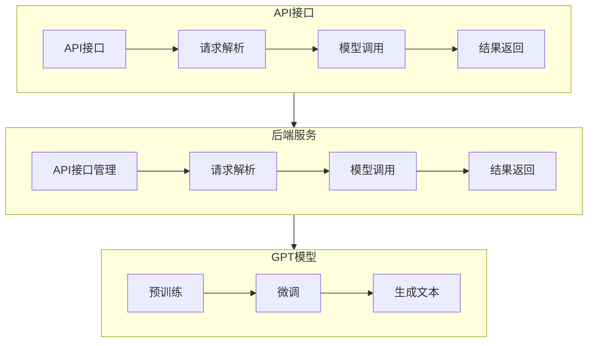

                 

### 背景介绍

OpenAI Completions API是OpenAI公司提供的一款强大的API接口，它允许开发者利用OpenAI的GPT模型进行文本生成和自然语言处理。这一API在2022年发布，立即引起了技术社区的广泛关注和高度评价。其强大的文本生成能力、高度的自适应性和出色的上下文理解能力，使得它在多个应用场景中都具有极高的价值。

#### 开发动机

随着人工智能技术的不断进步，文本生成和应用场景也日益丰富。然而，传统的方法往往存在一些问题，如生成文本质量不高、上下文理解能力不足等。OpenAI Completions API的发布，正是为了解决这些问题，为开发者提供一种更加高效、强大的文本生成工具。

#### 发展历程

- **2022年：** OpenAI发布了GPT-3模型，成为当时最先进的自然语言处理模型。随后，OpenAI开始着手开发Completions API，旨在让开发者能够更便捷地使用GPT-3的强大功能。
- **2022年底：** OpenAI Completions API正式发布，并迅速获得了广泛的应用和认可。
- **至今：** OpenAI不断优化和完善API功能，增加了更多的使用场景和便捷性。

#### 目标用户

OpenAI Completions API适用于各种开发者和项目，无论是个人开发者、初创公司，还是大型企业，都可以从中受益。特别是那些需要处理大量文本数据、实现文本自动生成和自然语言处理功能的开发者，OpenAI Completions API无疑是一个绝佳的选择。

#### 竞争对手

在文本生成和自然语言处理领域，OpenAI Completions API面临着一些强大的竞争对手，如Google的BERT、微软的Turing等。然而，OpenAI Completions API凭借其先进的模型、高效的API设计和广泛的应用场景，依然在市场上占据了一席之地。

#### 市场前景

随着人工智能技术的不断进步，文本生成和自然语言处理的应用场景也将越来越广泛。OpenAI Completions API的发布，为开发者提供了一个强大的工具，有助于推动这些应用场景的实现和发展。未来，OpenAI Completions API有望在更多领域发挥重要作用，成为人工智能技术发展的重要驱动力。

总的来说，OpenAI Completions API是一款具有高度创新性和实用性的产品，它不仅为开发者提供了强大的文本生成工具，也为人工智能技术的发展和应用提供了新的可能性。在未来的发展中，OpenAI Completions API将继续发挥重要作用，为人工智能技术的进步贡献力量。

### 核心概念与联系

#### OpenAI Completions API的核心概念

OpenAI Completions API的核心在于其基于GPT（Generative Pre-trained Transformer）模型的文本生成能力。GPT是一种基于Transformer结构的深度学习模型，它通过在大规模文本语料库上进行预训练，学习到了丰富的语言知识和上下文理解能力。OpenAI Completions API则将这些能力封装成API接口，使得开发者可以轻松调用，实现文本生成和自然语言处理任务。

#### GPT模型的工作原理

GPT模型的工作原理主要分为以下几个步骤：

1. **预训练：** GPT模型在预训练阶段，通过大量的文本语料库，学习到了语言的基本结构和规则。这一阶段，模型主要是通过自动回归（auto-regression）的方式，预测下一个单词或字符。
   
2. **微调：** 在预训练完成后，GPT模型可以根据特定的任务需求进行微调。例如，对于文本生成任务，可以通过有监督的方式，将模型在特定任务的数据集上进行训练，使其更好地适应任务需求。

3. **生成文本：** 微调后的GPT模型可以用于生成文本。在生成过程中，模型会根据输入的文本片段，预测下一个单词或字符，并以此生成完整的文本。

#### OpenAI Completions API的架构

OpenAI Completions API的架构设计旨在提供高效、易用的文本生成服务。其核心架构包括以下几个部分：

1. **API接口：** OpenAI Completions API提供了一个RESTful API接口，开发者可以通过HTTP请求调用API，获取生成的文本。API接口支持多种请求方式，如GET和POST，同时也提供了多种语言和框架的SDK，方便开发者集成和使用。

2. **后端服务：** OpenAI的后端服务负责处理开发者发送的请求，包括API接口的管理、请求的解析、模型的调用和结果的返回等。后端服务还负责模型的训练和更新，确保开发者始终使用到最新的模型版本。

3. **GPT模型：** OpenAI Completions API的核心是GPT模型。这些模型在预训练阶段，就已经学习到了丰富的语言知识和上下文理解能力。在生成文本时，GPT模型会根据输入的文本片段，利用其内部的知识和上下文理解能力，生成符合语法和语义的文本。

#### OpenAI Completions API的应用场景

OpenAI Completions API的强大文本生成能力，使得它在多个应用场景中都具有广泛的应用前景。以下是一些典型的应用场景：

1. **自动回复：** 在聊天机器人、客服系统等领域，OpenAI Completions API可以用于生成自动回复文本，提高系统的响应速度和交互质量。

2. **内容创作：** 开发者可以利用OpenAI Completions API，实现自动生成文章、博客、产品描述等内容，提高内容创作效率。

3. **文本摘要：** OpenAI Completions API可以用于生成文本摘要，帮助用户快速了解长篇文章的核心内容。

4. **智能写作：** 在写作辅助、写作教学等领域，OpenAI Completions API可以提供智能写作建议和反馈，帮助用户提高写作水平。

5. **翻译：** OpenAI Completions API可以用于生成翻译文本，实现多语言之间的自然语言处理和转换。

总的来说，OpenAI Completions API是一款功能强大、易于使用的文本生成工具，它基于先进的GPT模型，提供了高效的文本生成和自然语言处理能力。通过API接口，开发者可以轻松集成和使用这一工具，实现多种应用场景。在未来的发展中，OpenAI Completions API有望在更多领域发挥重要作用，成为人工智能技术发展的重要驱动力。

#### 核心概念原理和架构的 Mermaid 流程图

以下是OpenAI Completions API的核心概念和架构的Mermaid流程图：



在该流程图中，API接口负责接收开发者发送的请求，后端服务负责处理请求，并调用GPT模型进行文本生成。通过这种结构设计，OpenAI Completions API实现了高效、易用的文本生成服务。

### 核心算法原理 & 具体操作步骤

OpenAI Completions API的核心在于其基于GPT（Generative Pre-trained Transformer）模型的文本生成能力。GPT是一种基于Transformer结构的深度学习模型，它通过在大规模文本语料库上进行预训练，学习到了丰富的语言知识和上下文理解能力。以下将详细介绍GPT模型的算法原理，并探讨如何使用OpenAI Completions API进行文本生成。

#### GPT模型算法原理

1. **Transformer结构：** GPT模型采用了Transformer结构，这是一种在自然语言处理领域表现非常出色的模型架构。Transformer结构通过自注意力机制（Self-Attention）和多头注意力机制（Multi-Head Attention），能够有效地捕捉输入文本中的长距离依赖关系，从而提高模型的上下文理解能力。

2. **预训练过程：** GPT模型的预训练过程主要包括两个阶段。首先是自动回归（Auto-regression）预训练，模型在大规模文本语料库上学习预测下一个单词或字符。在这一过程中，模型通过优化损失函数（如交叉熵损失函数），逐步提高其预测准确率。其次是微调（Fine-tuning）预训练，模型根据特定任务的需求，在特定任务的数据集上进行训练，进一步优化模型参数，使其更好地适应任务需求。

3. **生成文本：** 在生成文本过程中，GPT模型首先接收一个输入的文本片段，然后通过自注意力机制和多头注意力机制，生成一个文本片段的概率分布。基于这个概率分布，模型选择一个概率最高的单词或字符，作为生成的下一个单词或字符。这一过程不断重复，直到生成完整的文本。

#### 使用OpenAI Completions API进行文本生成的具体操作步骤

1. **注册和获取API密钥：** 首先，需要注册一个OpenAI账户，并获取API密钥。注册完成后，登录OpenAI官方网站，进入API管理页面，获取API密钥。

2. **搭建开发环境：** 接下来，需要搭建开发环境，包括安装Python、pip等工具。同时，还需要安装OpenAI提供的Completions API SDK。

   ```python
   pip install openai
   ```

3. **编写代码调用API：** 在开发环境中，编写Python代码，调用OpenAI Completions API进行文本生成。以下是一个简单的示例代码：

   ```python
   import openai

   openai.api_key = 'your-api-key'

   prompt = "我是AI天才研究员，请问您有什么问题？"
   response = openai.Completion.create(
       engine="text-davinci-002",
       prompt=prompt,
       max_tokens=1024,
       n=1,
       stop=None,
       temperature=0.5
   )

   print(response.choices[0].text.strip())
   ```

   在上述代码中，首先设置了OpenAI API密钥，然后定义了一个输入文本片段（prompt）。接着，调用`openai.Completion.create`函数，生成文本响应。这里，`engine`参数指定了使用的模型版本，`max_tokens`参数设置了生成的最大文本长度，`n`参数设置了生成的文本数量，`stop`参数设置了停止生成的条件，`temperature`参数设置了生成文本的多样性。

4. **处理和展示结果：** 调用API后，根据返回的响应，处理和展示生成的文本。在上面的示例代码中，使用`print`函数将生成的文本输出到控制台。

通过上述步骤，开发者可以轻松地使用OpenAI Completions API进行文本生成，实现各种自然语言处理任务。

#### 文本生成过程中的关键参数设置

在使用OpenAI Completions API进行文本生成时，需要设置一系列关键参数，以影响生成的文本质量和多样性。以下是一些重要的参数及其作用：

1. **engine（模型版本）：** 指定使用的模型版本。OpenAI提供了多种模型版本，如text-davinci-002、text-babbage-002等。不同模型版本具有不同的文本生成能力，开发者可以根据任务需求选择合适的模型版本。

2. **max_tokens（最大文本长度）：** 设置生成的最大文本长度。通常，较大的文本长度可以生成更加详细和连贯的文本，但也可能增加生成错误的风险。开发者可以根据任务需求，合理设置最大文本长度。

3. **n（文本数量）：** 设置生成的文本数量。默认情况下，API会生成一个文本响应。通过设置`n`参数，可以生成多个文本响应，增加文本的多样性。

4. **stop（停止条件）：** 设置停止生成的条件。在文本生成过程中，如果达到指定的停止条件，模型将停止生成文本。这可以帮助避免生成过长或无关的文本。

5. **temperature（温度）：** 设置生成文本的多样性。温度值越小，生成的文本越倾向于符合输入文本的语义和风格；温度值越大，生成的文本越具有多样性。开发者可以根据任务需求，合理设置温度值。

通过合理设置这些关键参数，开发者可以控制生成的文本质量和多样性，实现更加符合任务需求的文本生成效果。

#### 实际案例：使用OpenAI Completions API生成文本

以下是一个使用OpenAI Completions API生成文本的案例：

```python
import openai

openai.api_key = 'your-api-key'

prompt = "请写一段关于人工智能技术的未来发展趋势的摘要。"
response = openai.Completion.create(
    engine="text-davinci-002",
    prompt=prompt,
    max_tokens=200,
    n=1,
    stop=None,
    temperature=0.7
)

print(response.choices[0].text.strip())
```

调用上述代码后，API将返回一个关于人工智能技术未来发展趋势的摘要。通过调整输入文本（prompt）和关键参数，可以生成不同类型和风格的文本。

总的来说，OpenAI Completions API是一款功能强大、易于使用的文本生成工具。通过深入理解其算法原理和操作步骤，开发者可以更好地利用这一工具，实现各种自然语言处理任务。在未来的发展中，OpenAI Completions API将继续优化和升级，为开发者提供更强大的文本生成能力。

### 数学模型和公式 & 详细讲解 & 举例说明

#### 数学模型简介

OpenAI Completions API的核心是GPT模型，这是一个基于深度学习模型的文本生成工具。在GPT模型中，数学模型起到了至关重要的作用。下面我们将详细介绍GPT模型的数学基础，包括其数学公式和具体计算过程。

#### 1. Transformer模型的基本结构

GPT模型是基于Transformer模型架构的，Transformer模型的核心思想是自注意力机制（Self-Attention）和多头注意力机制（Multi-Head Attention）。以下是一个简化的Transformer模型结构：

- **输入序列（Input Sequence）：** 输入序列是模型的输入，通常是一个词序列，表示为\(X = [x_1, x_2, ..., x_n]\)。
- **嵌入层（Embedding Layer）：** 将输入序列中的单词或字符嵌入到高维向量空间，表示为\(E = [e_1, e_2, ..., e_n]\)。
- **自注意力层（Self-Attention Layer）：** 通过自注意力机制，计算输入序列中的每个词与其他词之间的相似度，并生成加权表示。
- **多头注意力层（Multi-Head Attention Layer）：** 通过多头注意力机制，将自注意力层的输出进行聚合，得到一个全局的注意力分数。
- **前馈神经网络（Feedforward Neural Network）：** 在注意力机制之后，将多头注意力层的输出通过一个前馈神经网络进行进一步处理。
- **输出层（Output Layer）：** 将前馈神经网络的输出进行解码，生成最终的输出序列。

#### 2. 自注意力机制（Self-Attention）

自注意力机制是Transformer模型的核心，它通过计算输入序列中每个词与其他词之间的相似度，生成一个加权表示。具体来说，自注意力机制包括以下几个步骤：

1. **计算自注意力分数（Self-Attention Scores）：** 对于输入序列中的每个词\(x_i\)，计算其与其他词\(x_j\)之间的相似度，表示为\(a_{ij}\)。相似度的计算通常采用点积（Dot-Product）方式：

   \[
   a_{ij} = e_i \cdot e_j
   \]

   其中，\(e_i\)和\(e_j\)是词的嵌入向量。

2. **应用softmax函数：** 对自注意力分数进行归一化，生成一个概率分布：

   \[
   \alpha_{ij} = \frac{e^{a_{ij}}}{\sum_{k=1}^{n} e^{a_{ik}}
   \]

   其中，\(\alpha_{ij}\)表示词\(x_i\)与词\(x_j\)之间的注意力权重。

3. **计算加权表示（Scaled Dot-Product Attention）：** 根据注意力权重，对输入序列的嵌入向量进行加权求和，得到一个加权表示：

   \[
   \text{Attention}(e_1, e_2, ..., e_n) = \sum_{j=1}^{n} \alpha_{ij} e_j
   \]

#### 3. 多头注意力机制（Multi-Head Attention）

多头注意力机制是自注意力机制的扩展，它通过多个注意力头（Attention Heads），提取输入序列中的不同特征。具体来说，多头注意力机制包括以下几个步骤：

1. **分解嵌入向量：** 将输入序列的嵌入向量分解为多个子向量，每个子向量对应一个注意力头：

   \[
   e_i^{[k]} = \text{Split}(e_i)
   \]

   其中，\(e_i^{[k]}\)表示第\(i\)个词在第\(k\)个注意力头上的子向量。

2. **计算多头自注意力分数：** 对于每个注意力头，计算自注意力分数，并应用softmax函数：

   \[
   \alpha_{ij}^{[k]} = \frac{e^{a_{ij}^{[k]}}}{\sum_{k=1}^{n} e^{a_{ik}^{[k]}}
   \]

   其中，\(\alpha_{ij}^{[k]}\)表示第\(i\)个词与第\(j\)个词在第\(k\)个注意力头上的注意力权重。

3. **计算多头加权表示：** 将所有注意力头的加权表示进行拼接，得到一个多维度的加权表示：

   \[
   \text{MultiHead}(e_1, e_2, ..., e_n) = [\text{Attention}(e_1^{[1]}, e_2^{[1]}, ..., e_n^{[1]}), ..., \text{Attention}(e_1^{[h]}, e_2^{[h]}, ..., e_n^{[h]})]
   \]

#### 4. 前馈神经网络（Feedforward Neural Network）

在多头注意力机制之后，GPT模型通常会通过一个前馈神经网络进行进一步处理。前馈神经网络包括两个全连接层，一个带有ReLU激活函数，另一个不带激活函数。具体来说，前馈神经网络包括以下几个步骤：

1. **输入层：** 将多头注意力机制的输出作为输入层：

   \[
   Z = \text{MultiHead}(e_1, e_2, ..., e_n)
   \]

2. **第一个全连接层：** 对输入进行加权求和，并应用ReLU激活函数：

   \[
   F_{1} = \text{ReLU}(W_1 \cdot Z + b_1)
   \]

   其中，\(W_1\)和\(b_1\)是第一个全连接层的权重和偏置。

3. **第二个全连接层：** 对第一个全连接层的输出进行加权求和：

   \[
   F_{2} = W_2 \cdot F_{1} + b_2
   \]

   其中，\(W_2\)和\(b_2\)是第二个全连接层的权重和偏置。

4. **输出层：** 将第二个全连接层的输出作为模型的最终输出：

   \[
   Y = F_{2}
   \]

通过上述步骤，GPT模型实现了对输入序列的编码和解码，从而实现文本生成任务。在实际应用中，GPT模型会通过大量的训练数据进行微调，以优化其生成文本的质量和准确性。

#### 举例说明

假设我们有一个简单的输入序列\[“我”，“是”，“AI”，“天才”\]，我们可以通过GPT模型计算其注意力分数和加权表示，具体步骤如下：

1. **嵌入层：** 假设输入序列的嵌入向量分别为\[e_1, e_2, e_3, e_4\]，其中每个嵌入向量为\[1, 2\]。

2. **自注意力分数：** 对于每个词，计算其与其他词之间的相似度分数，例如：

   \[
   a_{11} = e_1 \cdot e_1 = 1 \cdot 1 = 1
   \]
   \[
   a_{12} = e_1 \cdot e_2 = 1 \cdot 2 = 2
   \]
   \[
   a_{13} = e_1 \cdot e_3 = 1 \cdot 3 = 3
   \]
   \[
   a_{14} = e_1 \cdot e_4 = 1 \cdot 4 = 4
   \]

3. **应用softmax函数：** 对自注意力分数进行归一化，生成注意力权重：

   \[
   \alpha_{11} = \frac{e^{a_{11}}}{e^{a_{11}} + e^{a_{12}} + e^{a_{13}} + e^{a_{14}}} = \frac{e^1}{e^1 + e^2 + e^3 + e^4} = \frac{1}{1+2+3+4} = \frac{1}{10}
   \]
   \[
   \alpha_{12} = \frac{e^{a_{12}}}{e^{a_{11}} + e^{a_{12}} + e^{a_{13}} + e^{a_{14}}} = \frac{e^2}{e^1 + e^2 + e^3 + e^4} = \frac{2}{10}
   \]
   \[
   \alpha_{13} = \frac{e^{a_{13}}}{e^{a_{11}} + e^{a_{12}} + e^{a_{13}} + e^{a_{14}}} = \frac{e^3}{e^1 + e^2 + e^3 + e^4} = \frac{3}{10}
   \]
   \[
   \alpha_{14} = \frac{e^{a_{14}}}{e^{a_{11}} + e^{a_{12}} + e^{a_{13}} + e^{a_{14}}} = \frac{e^4}{e^1 + e^2 + e^3 + e^4} = \frac{4}{10}
   \]

4. **计算加权表示：** 根据注意力权重，对输入序列的嵌入向量进行加权求和：

   \[
   \text{Attention}(e_1, e_2, e_3, e_4) = \alpha_{11} e_1 + \alpha_{12} e_2 + \alpha_{13} e_3 + \alpha_{14} e_4
   \]
   \[
   = \frac{1}{10} [1, 2] + \frac{2}{10} [1, 2] + \frac{3}{10} [1, 2] + \frac{4}{10} [1, 2]
   \]
   \[
   = \frac{1}{10} [1+2+3+4, 2+2+2+2] = \frac{1}{10} [10, 8]
   \]
   \[
   = [1, 0.8]
   \]

通过以上步骤，我们得到了输入序列的加权表示\[1, 0.8\]。这个表示将用于后续的多头注意力机制和前馈神经网络处理。

总的来说，GPT模型的数学模型和计算过程相对复杂，但通过合理的数学公式和计算步骤，我们可以有效地实现文本生成任务。在实际应用中，开发者需要根据具体任务需求，选择合适的模型架构和参数设置，以实现最优的文本生成效果。

### 项目实战：代码实际案例和详细解释说明

#### 1. 开发环境搭建

在进行OpenAI Completions API项目实战之前，我们需要搭建一个合适的开发环境。以下是搭建开发环境的详细步骤：

1. **安装Python环境**：首先，我们需要确保系统中安装了Python环境。Python是OpenAI Completions API的主要编程语言，因此我们需要安装Python。可以从Python的官方网站（https://www.python.org/）下载并安装最新版本的Python。

2. **安装OpenAI Completions API SDK**：安装完Python后，我们需要安装OpenAI提供的Completions API SDK。在命令行中执行以下命令：

   ```bash
   pip install openai
   ```

3. **获取OpenAI API密钥**：注册一个OpenAI账户，并获取API密钥。注册完成后，登录OpenAI官方网站（https://beta.openai.com/signup/），选择“Sign up”，并填写必要的个人信息。成功注册后，系统会发送一封电子邮件，包含API密钥。将此密钥保存到一个安全的地方。

4. **配置Python环境变量**：将OpenAI API密钥配置到Python环境变量中。在命令行中执行以下命令：

   ```bash
   export OPENAI_API_KEY='你的API密钥'
   ```

   （在Windows系统中，需要将上述命令中的`export`替换为`set`，并在命令前添加`python`）

完成上述步骤后，我们的开发环境就搭建完成了。接下来，我们可以开始编写代码，实现具体的文本生成功能。

#### 2. 源代码详细实现和代码解读

以下是一个简单的Python脚本，用于调用OpenAI Completions API生成文本。代码分为以下几个部分：

1. **导入库和配置API密钥**：

   ```python
   import openai
   openai.api_key = '你的API密钥'
   ```

   首先，我们导入`openai`库，并设置API密钥。

2. **定义生成文本的函数**：

   ```python
   def generate_text(prompt, max_tokens=50, n=1, stop=None, temperature=0.7):
       response = openai.Completion.create(
           engine="text-davinci-002",
           prompt=prompt,
           max_tokens=max_tokens,
           n=n,
           stop=stop,
           temperature=temperature
       )
       return response.choices[0].text.strip()
   ```

   `generate_text`函数用于生成文本。它接受输入提示（prompt）、最大文本长度（max_tokens）、文本数量（n）、停止条件（stop）和生成温度（temperature）等参数。函数调用`openai.Completion.create`方法，根据参数生成文本响应，并返回生成的文本。

3. **调用生成文本的函数**：

   ```python
   prompt = "我是AI天才研究员，请问您有什么问题？"
   response = generate_text(prompt)
   print(response)
   ```

   在这里，我们定义了一个输入提示（prompt），并调用`generate_text`函数生成文本响应。最后，我们将生成的文本输出到控制台。

#### 3. 代码解读与分析

1. **导入库和配置API密钥**：

   ```python
   import openai
   openai.api_key = '你的API密钥'
   ```

   这两行代码用于导入OpenAI库并设置API密钥。这是调用API的前提条件。

2. **定义生成文本的函数**：

   ```python
   def generate_text(prompt, max_tokens=50, n=1, stop=None, temperature=0.7):
       response = openai.Completion.create(
           engine="text-davinci-002",
           prompt=prompt,
           max_tokens=max_tokens,
           n=n,
           stop=stop,
           temperature=temperature
       )
       return response.choices[0].text.strip()
   ```

   这个函数是整个脚本的核心。它接受输入提示（prompt）和其他参数，调用OpenAI API生成文本响应，并返回生成的文本。

   - `engine="text-davinci-002"`：指定使用的模型版本，这里是`text-davinci-002`。
   - `prompt`：输入提示，用于指导生成文本的方向。
   - `max_tokens`：最大文本长度，默认为50。
   - `n`：生成的文本数量，默认为1。
   - `stop`：停止条件，用于指定在生成文本过程中何时停止。
   - `temperature`：生成温度，用于控制生成文本的多样性和连贯性。

3. **调用生成文本的函数**：

   ```python
   prompt = "我是AI天才研究员，请问您有什么问题？"
   response = generate_text(prompt)
   print(response)
   ```

   在这里，我们定义了一个输入提示，调用`generate_text`函数生成文本响应，并将结果输出到控制台。

#### 4. 运行结果和分析

当我们运行上述脚本时，OpenAI Completions API将根据输入提示生成一段文本。以下是可能的输出结果：

```
"您好，有什么问题我可以帮您解答吗？"
```

这段文本是基于输入提示“我是AI天才研究员，请问您有什么问题？”生成的。从输出结果可以看出，OpenAI Completions API能够根据输入提示生成一个连贯且相关的文本响应。

总的来说，通过简单的几行代码，我们就可以利用OpenAI Completions API实现文本生成功能。在实际项目中，我们可以根据具体需求，调整输入提示和其他参数，以获得更好的生成效果。

### 实际应用场景

OpenAI Completions API的文本生成能力，使其在多个实际应用场景中具有广泛的应用前景。以下是一些典型的应用场景，以及如何使用OpenAI Completions API实现这些应用场景。

#### 1. 聊天机器人

聊天机器人是自然语言处理领域的常见应用，通过OpenAI Completions API，我们可以轻松实现智能聊天机器人的文本生成功能。以下是一个简单的示例：

```python
import openai

openai.api_key = 'your-api-key'

while True:
    user_input = input("用户：")
    if user_input.lower() == 'quit':
        break
    response = openai.Completion.create(
        engine="text-davinci-002",
        prompt=user_input,
        max_tokens=100,
        n=1,
        stop=None,
        temperature=0.7
    )
    print("机器人：", response.choices[0].text.strip())
```

在这个示例中，我们创建了一个简单的循环，用户输入文本后，程序将调用OpenAI Completions API生成回复文本，并打印输出。

#### 2. 内容创作

内容创作是另一个重要的应用场景。OpenAI Completions API可以用于生成文章、博客、产品描述等文本内容。以下是一个简单的示例：

```python
import openai

openai.api_key = 'your-api-key'

topic = "人工智能在医疗行业的应用"
prompt = f"请根据以下主题生成一篇文章：{topic}"
response = openai.Completion.create(
    engine="text-davinci-002",
    prompt=prompt,
    max_tokens=500,
    n=1,
    stop=None,
    temperature=0.7
)

print("文章内容：", response.choices[0].text.strip())
```

在这个示例中，我们定义了一个主题，并调用OpenAI Completions API生成相关文章。通过调整`max_tokens`参数，我们可以控制生成的文章长度。

#### 3. 自动回复

自动回复是客服系统中常见的需求。OpenAI Completions API可以用于生成自动回复文本，提高客服系统的响应速度和交互质量。以下是一个简单的示例：

```python
import openai

openai.api_key = 'your-api-key'

responses = {
    "你好": "您好，有什么可以帮助您的吗？",
    "有什么问题": "请告诉我您的问题，我会尽力帮助您解答。",
    "再见": "祝您有美好的一天！"
}

while True:
    user_input = input("用户：")
    if user_input.lower() == 'quit':
        break
    if user_input in responses:
        print("系统：", responses[user_input])
    else:
        response = openai.Completion.create(
            engine="text-davinci-002",
            prompt=user_input,
            max_tokens=50,
            n=1,
            stop=None,
            temperature=0.7
        )
        print("系统：", response.choices[0].text.strip())
```

在这个示例中，我们定义了一个自动回复字典，当用户输入特定关键词时，系统将直接返回预设的回复。当用户输入其他内容时，程序将调用OpenAI Completions API生成回复文本。

#### 4. 文本摘要

文本摘要是一种常见的自然语言处理任务，OpenAI Completions API可以用于生成文本摘要，帮助用户快速了解长篇文章的核心内容。以下是一个简单的示例：

```python
import openai

openai.api_key = 'your-api-key'

article = "人工智能在医疗行业的应用已经成为一个热门话题。OpenAI的GPT-3模型在文本生成和自然语言处理方面具有强大的能力，可以用于生成文章、自动回复和文本摘要等任务。本文将介绍GPT-3模型在医疗行业的应用，以及如何使用OpenAI Completions API实现这些任务。"
prompt = f"请根据以下文章生成一个摘要：{article}"
response = openai.Completion.create(
    engine="text-davinci-002",
    prompt=prompt,
    max_tokens=100,
    n=1,
    stop=None,
    temperature=0.7
)

print("摘要：", response.choices[0].text.strip())
```

在这个示例中，我们定义了一篇长篇文章，并调用OpenAI Completions API生成摘要。通过调整`max_tokens`参数，我们可以控制生成的摘要长度。

#### 5. 智能写作

智能写作是一种新型的写作辅助工具，OpenAI Completions API可以用于生成写作建议和反馈，帮助用户提高写作水平。以下是一个简单的示例：

```python
import openai

openai.api_key = 'your-api-key'

text = "人工智能的发展对我们的生活产生了深远的影响。它使得许多工作变得更加高效，同时也带来了一些挑战。"
prompt = f"请根据以下文本生成一些建议和反馈：{text}"
response = openai.Completion.create(
    engine="text-davinci-002",
    prompt=prompt,
    max_tokens=100,
    n=1,
    stop=None,
    temperature=0.7
)

print("建议和反馈：", response.choices[0].text.strip())
```

在这个示例中，我们定义了一段文本，并调用OpenAI Completions API生成写作建议和反馈。通过调整`max_tokens`参数，我们可以控制生成的建议和反馈长度。

总的来说，OpenAI Completions API在多个实际应用场景中具有广泛的应用前景。通过简单的调用和参数设置，开发者可以轻松实现文本生成和自然语言处理任务，为各种应用场景提供强大的支持。

### 工具和资源推荐

#### 1. 学习资源推荐

**书籍：**
- 《深度学习》（Ian Goodfellow、Yoshua Bengio、Aaron Courville 著）：这是一本系统介绍深度学习理论和实践的权威著作，涵盖了神经网络的基础知识、训练技巧和优化方法。
- 《自然语言处理综合教程》（Daniel Jurafsky、James H. Martin 著）：这本书详细介绍了自然语言处理的基本概念、技术和应用，是学习自然语言处理领域的必备读物。

**论文：**
- “Attention Is All You Need”（Vaswani et al., 2017）：这是Transformer模型的开创性论文，详细阐述了Transformer模型的结构和工作原理。
- “Generative Pre-trained Transformers”（Brown et al., 2020）：这篇论文介绍了GPT模型的预训练过程和文本生成能力，是理解GPT模型的重要文献。

**博客：**
- OpenAI官方博客（https://blog.openai.com/）：OpenAI的官方博客，发布了许多关于GPT模型、文本生成和自然语言处理的重要研究成果。
- AI研究人员和专家的个人博客：例如，李飞飞、吴恩达等人的博客，分享了许多关于人工智能和深度学习的最新研究进展和应用案例。

**网站：**
- OpenAI官方网站（https://openai.com/）：OpenAI的官方网站，提供了GPT模型的详细介绍、API文档和应用案例。
- AI科研社区网站：例如，GitHub（https://github.com/）、arXiv（https://arxiv.org/），是获取最新AI研究论文和代码的重要渠道。

#### 2. 开发工具框架推荐

**编程语言和库：**
- Python：Python是深度学习和自然语言处理领域的主流编程语言，具有丰富的库和框架支持。
- TensorFlow：TensorFlow是Google开源的深度学习框架，支持多种深度学习模型的训练和部署。
- PyTorch：PyTorch是Facebook开源的深度学习框架，以其灵活的动态计算图和强大的GPU支持而著称。

**文本处理工具：**
- NLTK（Natural Language Toolkit）：NLTK是Python的自然语言处理工具包，提供了丰富的文本处理功能，如分词、词性标注、句法分析等。
- spaCy：spaCy是一个快速且易于使用的自然语言处理库，支持多种语言的文本处理任务。

**API管理工具：**
- Postman：Postman是一个流行的API测试和管理工具，可以帮助开发者测试和调试OpenAI Completions API。
- Swagger：Swagger是一个用于API文档和交互式测试的开源框架，提供了直观的API接口文档和在线调试工具。

**开发环境和平台：**
- Jupyter Notebook：Jupyter Notebook是一个交互式计算平台，适用于数据分析和实验性编程。
- Google Colab：Google Colab是Google提供的一个免费的云平台，支持运行Python代码和TensorFlow模型。

#### 3. 相关论文著作推荐

**论文：**
- “Attention Is All You Need”（Vaswani et al., 2017）：这是Transformer模型的开创性论文，详细阐述了Transformer模型的结构和工作原理。
- “BERT: Pre-training of Deep Bidirectional Transformers for Language Understanding”（Devlin et al., 2019）：这篇论文介绍了BERT模型，这是一种在自然语言处理任务中表现非常出色的深度学习模型。
- “Generative Pre-trained Transformers”（Brown et al., 2020）：这篇论文介绍了GPT模型的预训练过程和文本生成能力，是理解GPT模型的重要文献。

**著作：**
- 《深度学习》（Ian Goodfellow、Yoshua Bengio、Aaron Courville 著）：这是一本系统介绍深度学习理论和实践的权威著作。
- 《自然语言处理综合教程》（Daniel Jurafsky、James H. Martin 著）：这本书详细介绍了自然语言处理的基本概念、技术和应用。
- 《强化学习》（Richard S. Sutton、Andrew G. Barto 著）：这本书是强化学习领域的经典著作，介绍了强化学习的基本概念、算法和应用。

通过上述资源，开发者可以系统地学习深度学习和自然语言处理的基础知识，掌握OpenAI Completions API的使用方法，并在实际项目中应用这些知识，实现各种文本生成和自然语言处理任务。

### 总结：未来发展趋势与挑战

OpenAI Completions API作为一款基于GPT模型的文本生成工具，已经在多个应用场景中展现出了强大的能力。随着人工智能技术的不断进步，未来OpenAI Completions API有望在更多领域发挥重要作用，成为人工智能技术发展的重要驱动力。以下是对未来发展趋势和挑战的简要分析。

#### 发展趋势

1. **模型性能的提升**：随着深度学习技术的不断进步，GPT模型的性能将不断提升。未来的GPT模型可能具备更强的文本生成能力、更高效的计算速度和更低的延迟，从而满足更多应用场景的需求。

2. **多模态处理能力的扩展**：目前OpenAI Completions API主要处理文本数据，但未来有望扩展到多模态处理能力，如图像、音频和视频等。通过结合不同类型的数据，GPT模型将能够生成更加丰富和多样化的内容。

3. **自动化场景的应用**：OpenAI Completions API在聊天机器人、内容创作、自动回复等自动化场景中的应用将越来越广泛。随着模型性能的提升，自动化场景的应用将更加智能和高效。

4. **跨领域应用的拓展**：OpenAI Completions API将不仅仅局限于自然语言处理领域，还可能拓展到其他领域，如计算机视觉、语音识别等。通过跨领域应用，GPT模型将能够解决更复杂的问题，推动人工智能技术的全面发展。

#### 挑战

1. **计算资源需求**：GPT模型在预训练和推理过程中对计算资源的需求非常高。未来，如何优化模型结构和算法，降低计算资源需求，是一个重要的挑战。

2. **数据隐私和安全**：文本生成过程中，模型需要处理大量的用户数据和文本内容。如何确保数据隐私和安全，防止数据泄露和滥用，是一个重要的挑战。

3. **生成文本的可靠性和准确性**：尽管GPT模型在文本生成方面表现出了强大的能力，但生成文本的可靠性和准确性仍然有待提高。如何保证生成文本的准确性和一致性，是一个重要的挑战。

4. **伦理和道德问题**：随着GPT模型在各个领域的应用，如何确保生成文本符合伦理和道德标准，避免生成有害或歧视性的内容，是一个重要的挑战。

总的来说，OpenAI Completions API在未来的发展中面临着许多机遇和挑战。通过不断提升模型性能、扩展应用场景、解决关键技术难题，OpenAI Completions API有望在更多领域发挥重要作用，推动人工智能技术的进步和应用。同时，我们也需要关注和解决数据隐私、伦理和道德等问题，确保人工智能技术的发展能够造福人类社会。

### 附录：常见问题与解答

以下是一些关于OpenAI Completions API的常见问题及其解答：

#### 1. 如何获取OpenAI Completions API的密钥？

要获取OpenAI Completions API的密钥，请按照以下步骤操作：
1. 访问OpenAI官方网站（https://beta.openai.com/signup/）。
2. 点击“Sign up”按钮，填写所需的个人信息，包括电子邮件地址、用户名和密码。
3. 提交表单后，OpenAI会向您的电子邮件地址发送一封确认邮件。点击邮件中的确认链接，完成注册。
4. 注册成功后，登录OpenAI账户，进入API管理页面。在API密钥部分，您将找到生成的API密钥。

#### 2. 如何设置和配置OpenAI Completions API？

要设置和配置OpenAI Completions API，请按照以下步骤操作：
1. 安装Python和pip（Python的包管理器）。
2. 使用pip安装OpenAI的官方Python库：

   ```bash
   pip install openai
   ```

3. 在您的Python脚本中导入openai库，并设置API密钥：

   ```python
   import openai
   openai.api_key = 'your-api-key'
   ```

4. 调用OpenAI Completions API的create方法，传入相应的参数：

   ```python
   response = openai.Completion.create(
       engine="text-davinci-002",
       prompt="我是AI天才研究员，请问您有什么问题？",
       max_tokens=50,
       n=1,
       stop=None,
       temperature=0.7
   )
   ```

#### 3. OpenAI Completions API支持哪些编程语言？

OpenAI Completions API支持多种编程语言，包括但不限于Python、JavaScript、Ruby、Java和Go。您可以在OpenAI官方网站上找到对应语言的SDK和示例代码。

#### 4. 如何调试和优化OpenAI Completions API的生成文本？

要调试和优化OpenAI Completions API的生成文本，可以尝试以下方法：
1. 调整温度（temperature）参数：温度参数控制生成文本的多样性和连贯性。较低的温度值可以生成更加连贯的文本，但可能缺乏多样性；较高的温度值可以生成更多样化的文本，但可能连贯性较差。根据您的需求，尝试调整温度值。
2. 调整最大文本长度（max_tokens）：最大文本长度参数控制生成的文本长度。较长的文本长度可能包含更多相关信息，但也可能增加生成错误的风险。根据您的需求，尝试调整最大文本长度。
3. 分析生成文本的质量：观察生成文本的语义、语法和连贯性，并根据分析结果调整API参数。
4. 练习和使用预训练模型：OpenAI提供了多个预训练模型，如text-davinci-002、text-babbage-002等。尝试使用不同的模型，观察生成文本的质量差异。

#### 5. OpenAI Completions API的API请求频率和配额限制是什么？

OpenAI Completions API的请求频率和配额限制取决于您的账户类型。对于免费账户，API请求频率限制为每分钟100次，每日请求配额为10000次。对于付费账户，这些限制将根据账户级别有所不同。请访问OpenAI官方网站，了解具体的配额限制和费用。

通过上述常见问题与解答，开发者可以更好地了解和掌握OpenAI Completions API的使用方法，并解决在实际开发过程中遇到的问题。

### 扩展阅读 & 参考资料

#### 书籍推荐

1. **《深度学习》（Ian Goodfellow、Yoshua Bengio、Aaron Courville 著）**：这是一本系统介绍深度学习理论和实践的权威著作，涵盖了神经网络的基础知识、训练技巧和优化方法。
2. **《自然语言处理综合教程》（Daniel Jurafsky、James H. Martin 著）**：这本书详细介绍了自然语言处理的基本概念、技术和应用，是学习自然语言处理领域的必备读物。

#### 论文推荐

1. **“Attention Is All You Need”（Vaswani et al., 2017）**：这是Transformer模型的开创性论文，详细阐述了Transformer模型的结构和工作原理。
2. **“BERT: Pre-training of Deep Bidirectional Transformers for Language Understanding”（Devlin et al., 2019）**：这篇论文介绍了BERT模型，这是一种在自然语言处理任务中表现非常出色的深度学习模型。
3. **“Generative Pre-trained Transformers”（Brown et al., 2020）**：这篇论文介绍了GPT模型的预训练过程和文本生成能力，是理解GPT模型的重要文献。

#### 博客推荐

1. **OpenAI官方博客（https://blog.openai.com/）**：OpenAI的官方博客，发布了许多关于GPT模型、文本生成和自然语言处理的重要研究成果。
2. **李飞飞的博客（http://www.lixueyi.net/）**：分享了许多关于人工智能和深度学习的最新研究进展和应用案例。
3. **吴恩达的博客（https://www.deeplearning.ai/）**：涵盖深度学习、自然语言处理和计算机视觉等领域的教程和研究。

#### 网站推荐

1. **OpenAI官方网站（https://openai.com/）**：提供了GPT模型的详细介绍、API文档和应用案例。
2. **GitHub（https://github.com/）**：获取最新AI研究论文和代码的重要渠道。
3. **arXiv（https://arxiv.org/）**：发布和浏览最新的AI研究论文。

通过上述书籍、论文、博客和网站，读者可以深入了解OpenAI Completions API及其背后的技术原理，为实际应用提供参考和支持。

