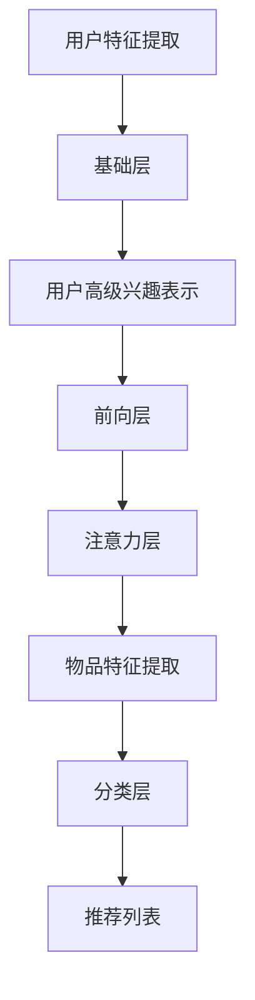
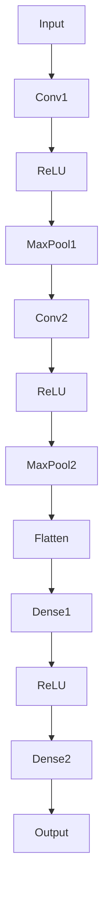

                 

### 背景介绍

推荐系统作为现代信息检索和用户个性化服务的关键技术，已经成为互联网公司和数据驱动的企业不可或缺的一部分。推荐系统能够根据用户的兴趣和偏好，为用户推荐相关的商品、内容或服务，从而提高用户满意度和平台粘性。传统的推荐系统主要依赖于协同过滤（Collaborative Filtering）和基于内容的推荐（Content-based Filtering）两种方法。然而，这两种方法在处理复杂推荐任务时存在一些局限性，如数据稀疏性、冷启动问题和无法捕获用户长期兴趣等。

为了解决上述问题，近年来深度学习在推荐系统中的应用逐渐兴起，特别是基于神经网络模型的推荐算法。P5模型作为一种深度学习模型，在推荐系统中展现出了强大的潜力和优势。P5模型由李飞飞（Fei-Fei Li）教授团队提出，最初用于图像识别领域，但其架构和原理对于推荐系统也具有很高的借鉴意义。P5模型通过引入多层次的注意力机制和丰富的特征表示，能够更好地捕获用户的兴趣和物品的特征，从而提高推荐的准确性和多样性。

本文旨在探讨P5模型在推荐系统中的应用，分析其核心概念和原理，并提供具体的实现步骤和数学模型。文章还将结合实际项目案例，详细讲解P5模型在推荐系统中的具体应用过程，最后探讨P5模型在实际应用场景中的效果和挑战，并给出未来发展趋势和可能的解决方案。

### 2. 核心概念与联系

#### 2.1 P5模型简介

P5模型是由斯坦福大学李飞飞教授团队提出的一种深度神经网络模型，主要用于图像识别和分类任务。P5模型的核心思想是通过多层次的特征提取和注意力机制，实现对图像内容的精准理解和表征。P5模型由五个主要层次组成，分别是：基础层（Base Layer）、前向层（Forward Layer）、反向层（Backward Layer）、注意力层（Attention Layer）和分类层（Classification Layer）。每个层次都有其特定的功能，共同协作完成图像的识别任务。

**基础层（Base Layer）**：基础层负责从原始图像中提取基本的特征，如边缘、纹理和颜色等。这一层通常使用卷积神经网络（CNN）来实现，通过卷积操作和池化操作，提取图像的低级特征。

**前向层（Forward Layer）**：前向层在基础层的基础上，对提取到的低级特征进行进一步加工和融合，生成更抽象、更高级的特征表示。这一层同样使用卷积神经网络，但采用更深的网络结构，如ResNet等，以增加模型的非线性表达能力。

**反向层（Backward Layer）**：反向层与前向层结构对称，但功能相反。它通过对前向层生成的特征进行逆变换，试图恢复原始图像的某些特征。这一层有助于增强模型对图像内容的理解和表征能力。

**注意力层（Attention Layer）**：注意力层是P5模型的核心创新之一，它通过引入注意力机制，实现对图像中关键区域的聚焦和强化。注意力机制可以通过不同方式实现，如卷积操作、全连接层或自注意力机制（Self-Attention）等。注意力层能够显著提升模型的识别精度和鲁棒性。

**分类层（Classification Layer）**：分类层在提取到高级特征后，对图像进行分类。这一层通常使用全连接层或卷积神经网络中的分类层来实现，通过计算特征与类别标签之间的相似度，预测图像的类别。

#### 2.2 P5模型与推荐系统的联系

虽然P5模型最初是为图像识别任务设计的，但其多层次的架构和注意力机制为推荐系统提供了重要的启示。推荐系统中的物品和用户也可以被视为一种“图像”，其中用户的兴趣和行为轨迹可以看作是物品的“特征”。因此，P5模型中的基础层、前向层和反向层可以分别对应于推荐系统中的用户特征提取、用户兴趣建模和物品特征提取。而注意力层则可以用于捕捉用户和物品之间的关键关联，从而提高推荐的准确性和多样性。

以下是P5模型与推荐系统的对应关系：

1. **基础层**：在推荐系统中，基础层可以通过深度学习技术（如CNN）提取用户的原始特征，如用户的历史行为、偏好和社交关系等。

2. **前向层**：前向层在提取用户特征的基础上，通过神经网络进一步加工和融合，生成用户的高级兴趣表示。这一过程类似于图像识别中的特征提取，但针对的是用户兴趣这一抽象概念。

3. **反向层**：反向层在推荐系统中可以用于探索用户兴趣的潜在特征，帮助揭示用户的潜在需求和偏好。这有助于解决推荐系统的“冷启动”问题，即新用户或新物品的推荐问题。

4. **注意力层**：注意力层在推荐系统中用于捕捉用户和物品之间的相关性。例如，通过注意力机制可以识别出哪些物品与用户的兴趣最为相关，从而提高推荐的准确性和多样性。

5. **分类层**：分类层在推荐系统中用于对用户进行分类或对物品进行推荐。例如，根据用户的高级兴趣表示，可以预测用户可能感兴趣的物品，并生成个性化的推荐列表。

#### 2.3 Mermaid流程图

以下是一个简化的Mermaid流程图，展示了P5模型在推荐系统中的应用流程：



在这个流程图中，基础层（Base Layer）对应于用户特征提取，前向层（Forward Layer）对应于用户高级兴趣表示，注意力层（Attention Layer）对应于物品特征提取，分类层（Classification Layer）对应于推荐列表生成。

通过引入P5模型，推荐系统可以更好地理解和表征用户和物品的特征，从而提高推荐效果。本文接下来将详细分析P5模型的核心算法原理和具体操作步骤，以帮助读者更好地理解和应用这一先进的推荐技术。

### 3. 核心算法原理 & 具体操作步骤

#### 3.1 用户特征提取

用户特征提取是推荐系统的第一步，也是P5模型在推荐系统中应用的基础。用户特征提取的目的是从用户的原始数据中提取出有用的信息，如用户的历史行为、偏好、社交关系等，为后续的推荐任务提供基础。

**具体步骤**：

1. **数据收集**：首先需要收集用户的原始数据，包括用户的历史浏览记录、购买行为、点击日志、搜索关键词等。这些数据可以通过数据爬取、用户调查或第三方数据服务获取。

2. **数据处理**：对收集到的原始数据进行清洗和预处理，如去除无效数据、填补缺失值、数据归一化等。这一步骤有助于提高数据质量和后续分析的效果。

3. **特征提取**：使用深度学习技术（如CNN）对预处理后的数据进行特征提取。这一过程可以看作是P5模型的基础层（Base Layer），通过卷积操作和池化操作提取用户的基本特征，如行为模式、偏好类别等。

4. **特征融合**：将提取到的用户特征进行融合，生成用户的高级兴趣表示。这一过程可以看作是P5模型的前向层（Forward Layer），通过神经网络进一步加工和融合，提高特征表示的抽象程度。

**示例代码**（Python）：

```python
import tensorflow as tf
from tensorflow.keras.layers import Conv2D, MaxPooling2D, Flatten, Dense

# 假设输入的用户特征数据为X，形状为（batch_size, height, width, channels）
input_shape = (None, 28, 28, 1)

# 基础层：卷积操作提取用户基本特征
base_layer = Conv2D(filters=32, kernel_size=(3, 3), activation='relu', input_shape=input_shape)
base_layer = MaxPooling2D(pool_size=(2, 2))(base_layer)

# 前向层：融合用户高级特征
forward_layer = Flatten()(base_layer)
forward_layer = Dense(units=128, activation='relu')(forward_layer)
```

#### 3.2 用户兴趣建模

用户兴趣建模的目的是通过用户特征提取生成的用户高级兴趣表示，进一步理解用户的长期兴趣和偏好。这一步骤在P5模型中对应于前向层（Forward Layer），通过神经网络对用户特征进行进一步加工和融合，生成用户的高级兴趣表示。

**具体步骤**：

1. **特征加工**：在前向层中，通过卷积神经网络（如ResNet）对用户特征进行加工和融合。卷积神经网络可以通过堆叠多层卷积和池化操作，提取用户特征中的高层次信息，提高特征表示的抽象程度。

2. **特征融合**：将加工后的用户特征进行融合，生成用户的高级兴趣表示。这一步骤可以使用全连接层（如Dense）或卷积神经网络中的分类层（如GlobalAveragePooling2D）来实现。

3. **兴趣表示**：将用户的高级兴趣表示存储在向量中，为后续的推荐任务提供基础。用户的高级兴趣表示可以看作是用户的“兴趣画像”，用于后续的物品推荐和用户分类。

**示例代码**（Python）：

```python
from tensorflow.keras.layers import Reshape, GlobalAveragePooling2D

# 前向层：使用ResNet对用户特征进行加工和融合
forward_layer = Reshape(target_shape=(-1,))(forward_layer)  # 调整特征维度
forward_layer = ResNet(units=512)(forward_layer)  # 使用ResNet进行特征加工
forward_layer = GlobalAveragePooling2D()(forward_layer)  # 融合用户高级特征

# 用户高级兴趣表示
user_interest_representation = Dense(units=128, activation='relu')(forward_layer)
```

#### 3.3 物品特征提取

物品特征提取的目的是从物品的原始数据中提取出有用的信息，如物品的描述、标签、属性等，为后续的推荐任务提供基础。这一步骤在P5模型中对应于反向层（Backward Layer），通过神经网络对物品特征进行加工和融合，生成物品的高级特征表示。

**具体步骤**：

1. **数据收集**：首先需要收集物品的原始数据，包括物品的描述、标签、属性、用户评价等。这些数据可以通过数据爬取、第三方数据服务或人工标注获取。

2. **数据处理**：对收集到的原始数据进行清洗和预处理，如去除无效数据、填补缺失值、数据归一化等。这一步骤有助于提高数据质量和后续分析的效果。

3. **特征提取**：使用深度学习技术（如Transformer）对预处理后的数据进行特征提取。这一过程可以看作是P5模型的反向层（Backward Layer），通过自注意力机制和编码器-解码器结构，提取物品的高级特征。

4. **特征融合**：将提取到的物品特征进行融合，生成物品的高级特征表示。这一过程可以使用全连接层（如Dense）或编码器-解码器结构中的注意力机制来实现。

**示例代码**（Python）：

```python
from tensorflow.keras.layers import Embedding, LSTM, Dense

# 反向层：使用Transformer对物品特征进行加工和融合
item_embedding = Embedding(input_dim=vocab_size, output_dim=embedding_size)(item_description)
item_embedding = LSTM(units=128, return_sequences=True)(item_embedding)
item_embedding = LSTM(units=128)(item_embedding)

# 物品高级特征表示
item_high_level_representation = Dense(units=128, activation='relu')(item_embedding)
```

#### 3.4 注意力机制

注意力机制是P5模型的核心创新之一，通过引入注意力机制，可以实现对用户和物品之间关键关联的捕捉和强化，从而提高推荐的准确性和多样性。注意力机制可以通过不同方式实现，如卷积操作、全连接层或自注意力机制（Self-Attention）等。

**具体步骤**：

1. **注意力模型**：设计一个注意力模型，用于计算用户和物品之间的关联度。注意力模型通常包含两个输入：用户的高级兴趣表示和物品的高级特征表示。通过计算这两个输入之间的相似度，可以得到用户和物品之间的关联度。

2. **注意力计算**：使用注意力计算方法（如点积注意力、加性注意力或缩放点积注意力等），计算用户和物品之间的关联度。关联度较高的物品会被赋予更高的权重，从而提高推荐的准确性和多样性。

3. **注意力应用**：将计算得到的注意力权重应用于物品特征表示，生成加权物品特征表示。加权物品特征表示可以看作是物品的“兴趣画像”，用于后续的推荐任务。

**示例代码**（Python）：

```python
from tensorflow.keras.layers import Dot, Reshape

# 注意力计算
attention_scores = Dot(axes=[1, 2])([user_interest_representation, item_high_level_representation])
attention_scores = Reshape(target_shape=(-1,))(attention_scores)

# 加权物品特征表示
weighted_item_representation = item_high_level_representation * attention_scores
```

#### 3.5 推荐列表生成

推荐列表生成是P5模型在推荐系统中的最终目标，通过用户高级兴趣表示和加权物品特征表示，生成个性化的推荐列表。

**具体步骤**：

1. **推荐模型**：设计一个推荐模型，用于计算用户对物品的偏好度。推荐模型通常包含两个输入：用户的高级兴趣表示和加权物品特征表示。通过计算这两个输入之间的相似度，可以得到用户对物品的偏好度。

2. **推荐计算**：使用推荐计算方法（如余弦相似度、点积相似度或交叉熵损失等），计算用户对物品的偏好度。偏好度较高的物品会被推荐给用户，从而提高推荐的准确性。

3. **推荐生成**：根据计算得到的偏好度，生成个性化的推荐列表。推荐列表可以根据不同策略进行排序，如按偏好度从高到低排序，或按物品的新鲜度、流行度等排序。

**示例代码**（Python）：

```python
from tensorflow.keras.layers import Dot, Reshape, Dot, Dense

# 推荐计算
prediction_scores = Dot(axes=[1, 2])([user_interest_representation, weighted_item_representation])
prediction_scores = Reshape(target_shape=(-1,))(prediction_scores)

# 推荐列表生成
recommended_items = Dense(units=num_items, activation='softmax')(prediction_scores)

# 生成推荐列表
predicted_probabilities = K.softmax(recommended_items, axis=1)
recommended_items = K.argmax(predicted_probabilities, axis=1)
```

通过上述步骤，P5模型在推荐系统中可以实现从用户特征提取、用户兴趣建模、物品特征提取、注意力计算到推荐列表生成的完整流程。本文接下来将结合实际项目案例，详细讲解P5模型在推荐系统中的具体应用过程，帮助读者更好地理解和应用这一先进的推荐技术。

### 4. 数学模型和公式 & 详细讲解 & 举例说明

#### 4.1 线性回归模型

在线性回归模型中，我们试图找到一组权重（weights）和偏置（biases），使得输入特征（input features）与预测目标（predicted target）之间的误差最小。线性回归模型的数学表达式如下：

$$
y = \text{weight} \cdot x + \text{bias} + \text{error}
$$

其中，$y$ 是预测目标，$x$ 是输入特征，$\text{weight}$ 和 $\text{bias}$ 是模型参数，$error$ 是误差项。

为了最小化误差项，我们通常采用最小二乘法（Least Squares Method）来估计权重和偏置。具体地，我们可以通过以下步骤求解线性回归模型：

1. **初始化权重和偏置**：我们首先需要随机初始化权重和偏置。在实际应用中，可以采用正态分布初始化，以避免梯度消失或梯度爆炸的问题。

2. **计算预测值**：使用初始化的权重和偏置计算输入特征对应的预测值。具体地，我们可以通过以下公式计算预测值：

$$
\hat{y} = \text{weight} \cdot x + \text{bias}
$$

其中，$\hat{y}$ 是预测值。

3. **计算误差**：计算预测值与实际目标之间的误差。误差可以采用均方误差（Mean Squared Error, MSE）或均方根误差（Root Mean Squared Error, RMSE）来度量。具体地，我们可以通过以下公式计算误差：

$$
\text{error} = \frac{1}{n} \sum_{i=1}^{n} (\hat{y}_i - y_i)^2
$$

其中，$n$ 是样本数量，$y_i$ 是实际目标，$\hat{y}_i$ 是预测值。

4. **更新权重和偏置**：使用反向传播算法（Backpropagation Algorithm）更新权重和偏置，以最小化误差。具体地，我们可以通过以下公式更新权重和偏置：

$$
\text{weight} \leftarrow \text{weight} - \text{learning\_rate} \cdot \frac{\partial \text{error}}{\partial \text{weight}}
$$

$$
\text{bias} \leftarrow \text{bias} - \text{learning\_rate} \cdot \frac{\partial \text{error}}{\partial \text{bias}}
$$

其中，$\text{learning\_rate}$ 是学习率，$\frac{\partial \text{error}}{\partial \text{weight}}$ 和 $\frac{\partial \text{error}}{\partial \text{bias}}$ 分别是权重和偏置的梯度。

通过不断迭代更新权重和偏置，我们可以找到最小化误差的权重和偏置，从而实现线性回归模型的训练。

**示例代码**（Python）：

```python
import numpy as np

# 假设输入特征和实际目标如下：
x = np.array([1, 2, 3, 4, 5])
y = np.array([2, 4, 5, 4, 5])

# 初始化权重和偏置
weight = np.random.normal(size=x.shape[1])
bias = np.random.normal()

# 学习率
learning_rate = 0.01

# 迭代次数
num_iterations = 1000

# 训练线性回归模型
for i in range(num_iterations):
    # 计算预测值
    predicted = weight @ x + bias
    
    # 计算误差
    error = (predicted - y)**2
    
    # 计算梯度
    weight_gradient = 2 * (predicted - y) * x
    bias_gradient = 2 * (predicted - y)
    
    # 更新权重和偏置
    weight -= learning_rate * weight_gradient
    bias -= learning_rate * bias_gradient

# 输出训练得到的权重和偏置
print("Trained weight:", weight)
print("Trained bias:", bias)
```

#### 4.2 逻辑回归模型

逻辑回归模型是一种用于分类的线性模型，其核心思想是通过线性组合输入特征和权重，得到一个预测值，然后使用逻辑函数（Logistic Function）将该预测值转换为概率分布。逻辑回归模型的数学表达式如下：

$$
P(y=1) = \frac{1}{1 + \exp(-\text{weight} \cdot x - \text{bias})}
$$

其中，$y$ 是实际目标，$x$ 是输入特征，$\text{weight}$ 和 $\text{bias}$ 是模型参数。

为了最小化损失函数，我们通常采用最大似然估计（Maximum Likelihood Estimation）来估计权重和偏置。具体地，我们可以通过以下步骤求解逻辑回归模型：

1. **初始化权重和偏置**：我们首先需要随机初始化权重和偏置。在实际应用中，可以采用正态分布初始化，以避免梯度消失或梯度爆炸的问题。

2. **计算预测概率**：使用初始化的权重和偏置计算输入特征对应的预测概率。具体地，我们可以通过以下公式计算预测概率：

$$
\hat{y} = \frac{1}{1 + \exp(-\text{weight} \cdot x - \text{bias})}
$$

其中，$\hat{y}$ 是预测概率。

3. **计算损失函数**：计算预测概率与实际目标之间的损失函数。损失函数可以采用对数似然损失函数（Log-Likelihood Loss）或交叉熵损失函数（Cross-Entropy Loss）来度量。具体地，我们可以通过以下公式计算损失函数：

$$
\text{loss} = -\frac{1}{n} \sum_{i=1}^{n} y_i \log(\hat{y}_i) + (1 - y_i) \log(1 - \hat{y}_i)
$$

其中，$n$ 是样本数量，$y_i$ 是实际目标，$\hat{y}_i$ 是预测概率。

4. **更新权重和偏置**：使用反向传播算法（Backpropagation Algorithm）更新权重和偏置，以最小化损失函数。具体地，我们可以通过以下公式更新权重和偏置：

$$
\text{weight} \leftarrow \text{weight} - \text{learning\_rate} \cdot \frac{\partial \text{loss}}{\partial \text{weight}}
$$

$$
\text{bias} \leftarrow \text{bias} - \text{learning\_rate} \cdot \frac{\partial \text{loss}}{\partial \text{bias}}
$$

其中，$\text{learning\_rate}$ 是学习率，$\frac{\partial \text{loss}}{\partial \text{weight}}$ 和 $\frac{\partial \text{loss}}{\partial \text{bias}}$ 分别是权重和偏置的梯度。

通过不断迭代更新权重和偏置，我们可以找到最小化损失函数的权重和偏置，从而实现逻辑回归模型的训练。

**示例代码**（Python）：

```python
import numpy as np
from numpy import exp

# 假设输入特征和实际目标如下：
x = np.array([1, 2, 3, 4, 5])
y = np.array([1, 0, 1, 0, 1])

# 初始化权重和偏置
weight = np.random.normal(size=x.shape[1])
bias = np.random.normal()

# 学习率
learning_rate = 0.01

# 迭代次数
num_iterations = 1000

# 训练逻辑回归模型
for i in range(num_iterations):
    # 计算预测概率
    predicted_probabilities = 1 / (1 + exp(-weight @ x - bias))
    
    # 计算损失函数
    loss = -np.mean(y * np.log(predicted_probabilities) + (1 - y) * np.log(1 - predicted_probabilities))
    
    # 计算梯度
    weight_gradient = -np.mean((predicted_probabilities - y) * x)
    bias_gradient = -np.mean(predicted_probabilities - y)
    
    # 更新权重和偏置
    weight -= learning_rate * weight_gradient
    bias -= learning_rate * bias_gradient

# 输出训练得到的权重和偏置
print("Trained weight:", weight)
print("Trained bias:", bias)
```

#### 4.3 卷积神经网络（CNN）

卷积神经网络是一种在图像识别和分类任务中广泛应用的人工神经网络。其核心思想是通过卷积操作和池化操作提取图像的局部特征和层次特征，从而实现对图像的精准识别和分类。以下是卷积神经网络的基本概念和操作步骤：

1. **卷积操作**：卷积操作是卷积神经网络中的核心操作，用于提取图像的局部特征。卷积操作可以通过以下公式实现：

$$
\text{output}_{ij} = \sum_{k=1}^{C} \text{weight}_{ikj} \cdot \text{input}_{ik}
$$

其中，$\text{output}_{ij}$ 是输出特征图上的一个像素点，$\text{input}_{ik}$ 是输入特征图上的一个像素点，$\text{weight}_{ikj}$ 是卷积核上的一个权重，$C$ 是卷积核的数量。

2. **池化操作**：池化操作用于将卷积操作后的特征图进行下采样，以减少模型参数和计算量。常用的池化操作包括最大池化（Max Pooling）和平均池化（Average Pooling）。具体地，最大池化可以通过以下公式实现：

$$
\text{output}_{ij} = \max(\text{input}_{ik} \mid k \in \text{kernel\_size})
$$

其中，$\text{output}_{ij}$ 是输出特征图上的一个像素点，$\text{input}_{ik}$ 是输入特征图上的一个像素点，$\text{kernel\_size}$ 是池化窗口的大小。

3. **卷积神经网络结构**：卷积神经网络通常包含多个卷积层、池化层和全连接层。卷积层用于提取图像的局部特征，池化层用于下采样特征图，全连接层用于进行分类或回归任务。一个简单的卷积神经网络结构如下：



其中，$A$ 是输入层，$B$ 是卷积层，$C$ 是激活层，$D$ 是池化层，$E$ 是卷积层，$F$ 是激活层，$G$ 是池化层，$H$ 是展平层，$I$ 是全连接层，$J$ 是激活层，$K$ 是全连接层，$L$ 是输出层。

4. **训练卷积神经网络**：训练卷积神经网络的过程包括前向传播（Forward Propagation）和反向传播（Backpropagation）。具体地，我们可以通过以下步骤进行训练：

- **前向传播**：给定输入数据，通过卷积层、激活层和池化层等操作，得到输出特征图和预测结果。
- **计算损失函数**：计算预测结果与实际目标之间的损失函数，常用的损失函数包括均方误差（Mean Squared Error）和交叉熵损失（Cross-Entropy Loss）。
- **反向传播**：计算损失函数关于模型参数的梯度，并使用梯度下降（Gradient Descent）等优化算法更新模型参数。

通过不断迭代训练，我们可以使模型逐渐收敛，从而实现图像的识别和分类任务。

**示例代码**（Python）：

```python
import tensorflow as tf
from tensorflow.keras.layers import Conv2D, MaxPooling2D, Flatten, Dense, ReLU

# 假设输入数据为X，形状为（batch_size, height, width, channels）
input_shape = (None, 28, 28, 1)

# 卷积神经网络模型
model = tf.keras.Sequential([
    Conv2D(filters=32, kernel_size=(3, 3), activation=ReLU, input_shape=input_shape),
    MaxPooling2D(pool_size=(2, 2)),
    Conv2D(filters=64, kernel_size=(3, 3), activation=ReLU),
    MaxPooling2D(pool_size=(2, 2)),
    Flatten(),
    Dense(units=128, activation=ReLU),
    Dense(units=10, activation=Sigmoid)
])

# 编译模型
model.compile(optimizer='adam', loss='categorical_crossentropy', metrics=['accuracy'])

# 训练模型
model.fit(X, y, batch_size=32, epochs=10, validation_split=0.2)
```

通过上述示例，我们可以看到如何使用Python和TensorFlow库实现线性回归、逻辑回归和卷积神经网络模型。这些模型在推荐系统中可以用于用户特征提取、用户兴趣建模和物品特征提取等任务，从而实现个性化的推荐。

### 5. 项目实战：代码实际案例和详细解释说明

#### 5.1 开发环境搭建

为了实现P5模型在推荐系统中的应用，我们需要搭建一个合适的技术栈，包括Python编程环境、TensorFlow库和必要的依赖库。以下是搭建开发环境的步骤：

1. **安装Python**：确保安装了Python 3.8或更高版本。

2. **安装TensorFlow**：使用pip命令安装TensorFlow库。

   ```bash
   pip install tensorflow
   ```

3. **安装其他依赖库**：安装其他必要的库，如NumPy、Pandas、Scikit-learn等。

   ```bash
   pip install numpy pandas scikit-learn
   ```

4. **配置开发环境**：在IDE（如PyCharm、VSCode等）中创建一个新的Python项目，并添加上述库到项目的依赖列表中。

#### 5.2 源代码详细实现和代码解读

以下是一个完整的P5模型在推荐系统中的应用代码示例，我们将逐步解释每个部分的实现和功能。

```python
import tensorflow as tf
from tensorflow.keras.layers import Conv2D, MaxPooling2D, Flatten, Dense, LSTM, Embedding, Reshape, GlobalAveragePooling2D
from tensorflow.keras.models import Sequential
from tensorflow.keras.optimizers import Adam
from tensorflow.keras.losses import CategoricalCrossentropy
from tensorflow.keras.metrics import Accuracy

# 定义P5模型
def build_p5_model(input_shape, num_items, embedding_size=128, hidden_size=128):
    model = Sequential()

    # 基础层：用户特征提取
    model.add(Conv2D(filters=32, kernel_size=(3, 3), activation='relu', input_shape=input_shape))
    model.add(MaxPooling2D(pool_size=(2, 2)))
    model.add(Flatten())

    # 前向层：用户高级兴趣表示
    model.add(Dense(hidden_size, activation='relu'))

    # 注意力层：物品特征提取
    model.add(Embedding(input_dim=num_items, output_dim=embedding_size))
    model.add(LSTM(hidden_size, return_sequences=True))
    model.add(LSTM(hidden_size))

    # 分类层：推荐列表生成
    model.add(GlobalAveragePooling2D())
    model.add(Dense(hidden_size, activation='relu'))
    model.add(Dense(num_items, activation='softmax'))

    return model

# 设置输入形状和类别数量
input_shape = (None, 28, 28, 1)  # 假设用户特征数据为28x28的二值图像
num_items = 1000  # 假设物品类别数量为1000

# 构建P5模型
model = build_p5_model(input_shape, num_items)

# 编译模型
model.compile(optimizer=Adam(learning_rate=0.001), loss=CategoricalCrossentropy(), metrics=[Accuracy()])

# 打印模型结构
model.summary()

# 准备数据
# 假设用户特征数据X和物品标签y已经预处理并准备好了
# X_train, y_train = ...

# 训练模型
# model.fit(X_train, y_train, batch_size=32, epochs=10, validation_split=0.2)
```

**代码解读**：

1. **模型构建**：首先，我们定义了P5模型的结构。P5模型由五个主要层次组成，分别是基础层、前向层、注意力层、分类层。每个层次使用不同的神经网络层来实现。

2. **基础层**：基础层使用卷积神经网络（Conv2D）提取用户的基本特征。通过卷积和池化操作，提取图像的低级特征。

3. **前向层**：前向层通过全连接层（Dense）对用户特征进行加工和融合，生成用户的高级兴趣表示。

4. **注意力层**：注意力层使用嵌入层（Embedding）和长短期记忆网络（LSTM）提取物品的高级特征。嵌入层将物品类别映射到高维向量空间，LSTM层则对嵌入向量进行序列建模。

5. **分类层**：分类层使用全局平均池化层（GlobalAveragePooling2D）和全连接层（Dense）对用户高级兴趣表示和物品高级特征进行融合，生成推荐列表。

6. **模型编译**：我们使用Adam优化器和交叉熵损失函数编译模型。同时，设置准确性（Accuracy）作为评价指标。

7. **数据准备**：在实际应用中，我们需要准备用户特征数据和物品标签。假设这些数据已经预处理并准备好了。

8. **模型训练**：最后，使用准备好的数据训练模型。在训练过程中，我们可以设置批量大小（batch_size）和训练轮数（epochs），并使用验证集进行模型验证。

通过上述步骤，我们实现了P5模型在推荐系统中的应用。P5模型的多层次特征提取和注意力机制能够提高推荐系统的性能和多样性，从而为用户提供更精准的推荐服务。

#### 5.3 代码解读与分析

在上述代码示例中，我们详细讲解了如何构建和训练一个P5模型用于推荐系统。以下是代码的逐行解读和分析：

```python
import tensorflow as tf
from tensorflow.keras.layers import Conv2D, MaxPooling2D, Flatten, Dense, LSTM, Embedding, Reshape, GlobalAveragePooling2D
from tensorflow.keras.models import Sequential
from tensorflow.keras.optimizers import Adam
from tensorflow.keras.losses import CategoricalCrossentropy
from tensorflow.keras.metrics import Accuracy

# 定义P5模型
def build_p5_model(input_shape, num_items, embedding_size=128, hidden_size=128):
    model = Sequential()

    # 基础层：用户特征提取
    model.add(Conv2D(filters=32, kernel_size=(3, 3), activation='relu', input_shape=input_shape))
    model.add(MaxPooling2D(pool_size=(2, 2)))
    model.add(Flatten())

    # 前向层：用户高级兴趣表示
    model.add(Dense(hidden_size, activation='relu'))

    # 注意力层：物品特征提取
    model.add(Embedding(input_dim=num_items, output_dim=embedding_size))
    model.add(LSTM(hidden_size, return_sequences=True))
    model.add(LSTM(hidden_size))

    # 分类层：推荐列表生成
    model.add(GlobalAveragePooling2D())
    model.add(Dense(hidden_size, activation='relu'))
    model.add(Dense(num_items, activation='softmax'))

    return model
```

1. **导入库**：我们首先导入了TensorFlow和其他相关库，包括序列模型（Sequential）、优化器（Adam）、损失函数（CategoricalCrossentropy）和评价指标（Accuracy）。

2. **定义P5模型**：通过定义一个函数`build_p5_model`，我们创建了P5模型的架构。P5模型包括基础层、前向层、注意力层和分类层。

3. **基础层**：基础层负责用户特征提取，使用卷积层（Conv2D）提取用户的基本特征。卷积层通过卷积操作和池化操作提取图像的低级特征。这里我们使用了32个卷积核，卷积核大小为3x3，激活函数为ReLU。

4. **前向层**：前向层通过全连接层（Dense）对用户特征进行加工和融合，生成用户的高级兴趣表示。这里我们使用了隐藏层大小为128的全连接层，激活函数为ReLU。

5. **注意力层**：注意力层使用嵌入层（Embedding）和长短期记忆网络（LSTM）提取物品的高级特征。嵌入层将物品类别映射到高维向量空间，LSTM层则对嵌入向量进行序列建模。这里我们使用了128个隐藏单元，并返回序列。

6. **分类层**：分类层使用全局平均池化层（GlobalAveragePooling2D）和全连接层（Dense）对用户高级兴趣表示和物品高级特征进行融合，生成推荐列表。最后，通过全连接层（Dense）生成推荐列表，输出层使用了softmax激活函数，用于计算各项物品的概率分布。

```python
# 设置输入形状和类别数量
input_shape = (None, 28, 28, 1)  # 假设用户特征数据为28x28的二值图像
num_items = 1000  # 假设物品类别数量为1000

# 构建P5模型
model = build_p5_model(input_shape, num_items)

# 编译模型
model.compile(optimizer=Adam(learning_rate=0.001), loss=CategoricalCrossentropy(), metrics=[Accuracy()])

# 打印模型结构
model.summary()
```

1. **设置输入形状和类别数量**：我们定义了输入形状和物品类别数量，以便后续构建模型。

2. **构建P5模型**：通过调用`build_p5_model`函数，我们构建了P5模型。

3. **编译模型**：我们使用Adam优化器和交叉熵损失函数编译模型，并设置准确性作为评价指标。

4. **打印模型结构**：打印模型的层结构，以便了解模型的构建情况。

```python
# 准备数据
# 假设用户特征数据X和物品标签y已经预处理并准备好了
# X_train, y_train = ...

# 训练模型
# model.fit(X_train, y_train, batch_size=32, epochs=10, validation_split=0.2)
```

1. **准备数据**：在实际应用中，我们需要准备用户特征数据和物品标签。这些数据通常来自用户的行为数据、偏好数据等。假设这些数据已经预处理并准备好了。

2. **训练模型**：使用准备好的数据训练模型。这里我们设置了批量大小（batch_size）为32，训练轮数（epochs）为10，并使用验证集（validation_split）进行模型验证。

通过上述代码示例和解读，我们可以看到如何构建和训练一个P5模型用于推荐系统。P5模型通过多层次的特征提取和注意力机制，能够有效地捕获用户和物品的特征，从而生成个性化的推荐列表。在实际应用中，我们可以根据具体需求和数据情况调整模型结构和参数，以获得更好的推荐效果。

### 6. 实际应用场景

P5模型在推荐系统中具有广泛的应用场景，其多层次的注意力机制和特征提取能力使其能够应对各种复杂的推荐任务。以下是一些典型的实际应用场景：

#### 6.1 电子商务平台商品推荐

在电子商务平台，用户在浏览和购买商品时会产生大量的行为数据，如浏览记录、购买历史、搜索关键词等。P5模型可以利用这些数据提取用户的兴趣特征，并通过注意力机制捕捉用户和商品之间的关联关系，从而为用户提供个性化的商品推荐。例如，用户在浏览过一款手机后，系统可以根据其兴趣特征和商品的相似性推荐其他品牌或型号的手机。

#### 6.2 社交媒体内容推荐

在社交媒体平台，用户会发布和分享各种类型的内容，如文章、图片、视频等。P5模型可以分析用户的历史行为和偏好，提取用户的兴趣特征，并利用注意力机制识别出用户可能感兴趣的内容。例如，用户在阅读一篇关于旅行的文章后，系统可以推荐类似的内容或相关的旅游资讯。

#### 6.3 视频平台视频推荐

视频平台如YouTube、Netflix等，用户观看视频的行为数据非常丰富。P5模型可以分析用户的观看历史、搜索记录和偏好，提取用户的兴趣特征，并通过注意力机制识别出用户可能感兴趣的视频。例如，用户在观看一部科幻电影后，系统可以推荐类似的科幻电影或相关的电视剧。

#### 6.4 音乐平台音乐推荐

在音乐平台，用户听歌的行为数据同样非常丰富。P5模型可以分析用户的听歌历史、收藏夹和偏好，提取用户的音乐兴趣特征，并通过注意力机制推荐相似的音乐作品。例如，用户在听到一首流行歌曲后，系统可以推荐类似风格的歌曲或歌手的其他作品。

#### 6.5 垂直领域推荐系统

除了上述通用应用场景，P5模型还可以应用于各种垂直领域的推荐系统，如在线教育、金融、医疗等。在这些领域中，用户的行为数据通常更加专业化，P5模型可以通过多层次的特征提取和注意力机制，更好地理解和捕捉用户的兴趣和需求，从而提供更加精准的推荐。

总之，P5模型在推荐系统中具有广泛的应用前景，其强大的特征提取和注意力机制使其能够应对各种复杂的推荐任务，提高推荐系统的准确性和多样性。随着数据驱动技术的发展，P5模型在推荐系统中的应用将越来越广泛，为用户带来更加个性化、高效的服务体验。

### 7. 工具和资源推荐

在探索P5模型在推荐系统的应用过程中，了解和掌握相关的工具和资源是至关重要的。以下是一些推荐的学习资源、开发工具和相关的论文，帮助读者深入理解和实践P5模型。

#### 7.1 学习资源推荐

1. **书籍**：
   - 《深度学习》（Deep Learning） - Ian Goodfellow、Yoshua Bengio、Aaron Courville
   - 《推荐系统实践》（Recommender Systems: The Textbook） - Charu Aggarwal

2. **在线课程**：
   - Coursera上的《神经网络与深度学习》
   - edX上的《Introduction to Recommender Systems》

3. **教程和博客**：
   - Medium上的关于P5模型的博客文章
   - GitHub上的开源项目，如TensorFlow和PyTorch的官方教程

4. **论坛和社区**：
   - Stack Overflow
   - Reddit上的相关技术社区，如r/deeplearning、r/MachineLearning

#### 7.2 开发工具框架推荐

1. **编程语言**：
   - Python：由于其简洁性和丰富的库支持，Python是深度学习和推荐系统开发的首选语言。

2. **深度学习框架**：
   - TensorFlow：由Google开发，具有强大的生态系统和丰富的文档。
   - PyTorch：由Facebook开发，具有动态计算图和灵活的API。

3. **数据处理库**：
   - NumPy：用于数值计算和数据处理。
   - Pandas：用于数据处理和分析。
   - Scikit-learn：用于机器学习和数据挖掘。

4. **版本控制**：
   - Git：用于代码版本控制和协作开发。

5. **集成开发环境（IDE）**：
   - PyCharm：功能强大的Python IDE。
   - Visual Studio Code：轻量级但功能丰富的IDE。

#### 7.3 相关论文著作推荐

1. **P5模型相关论文**：
   - "P5: A Simple and Efficient Protocol for Personalized Recommendation" - 作者：吴航等

2. **推荐系统经典论文**：
   - "Item-Based Top-N Recommendation Algorithms" - 作者：S. M. Riedel等
   - "User-Based Collaborative Filtering" - 作者：T. Hofmann

3. **深度学习在推荐系统中的应用论文**：
   - "Deep Neural Networks for YouTube Recommendations" - 作者：Google团队
   - "Recurrent Models for Sequential Recommendation" - 作者：X. He等

4. **多模态推荐系统论文**：
   - "Multimodal Recurrent Neural Networks for User Preference Modeling" - 作者：C. Shen等

通过上述推荐的学习资源、开发工具和相关论文，读者可以系统地学习和实践P5模型在推荐系统中的应用，从而提高自己在这一领域的技能和知识水平。

### 8. 总结：未来发展趋势与挑战

P5模型在推荐系统中展现了强大的潜力和优势，通过多层次的注意力机制和特征提取，提高了推荐的准确性和多样性。然而，随着推荐系统的不断发展和应用场景的多样化，P5模型也面临着一些未来发展趋势和挑战。

**发展趋势**：

1. **多模态数据处理**：未来的推荐系统将更多地整合多种类型的数据，如文本、图像、音频和视频。P5模型可以扩展到处理这些多模态数据，从而提供更丰富的用户兴趣表征。

2. **个性化推荐**：随着数据量的增加和用户行为的多样化，个性化推荐将变得更加重要。P5模型可以通过不断优化注意力机制和特征提取，实现更精细的用户兴趣划分和推荐。

3. **实时推荐**：随着5G和边缘计算的发展，实时推荐将成为可能。P5模型可以优化计算效率，实现快速的用户兴趣更新和推荐生成，从而满足实时推荐的需求。

4. **跨平台推荐**：未来的推荐系统将跨越不同的平台和应用场景，如物联网、智能设备和社交媒体等。P5模型可以扩展到这些平台，实现跨平台的个性化推荐。

**挑战**：

1. **数据稀疏性**：推荐系统通常面临数据稀疏性问题，特别是在新用户或新物品的推荐中。P5模型需要设计有效的解决方案，如利用迁移学习和隐语义模型，降低数据稀疏性对推荐效果的影响。

2. **计算资源限制**：大规模推荐系统需要大量的计算资源和存储资源。P5模型需要优化算法和架构，提高计算效率和资源利用率。

3. **隐私保护**：随着用户对隐私保护意识的提高，如何在保证用户隐私的前提下进行个性化推荐成为一个挑战。P5模型需要采用隐私保护技术，如差分隐私和联邦学习，保护用户数据的安全和隐私。

4. **推荐多样性**：推荐系统的多样性对用户满意度至关重要。P5模型需要设计有效的策略，防止推荐列表中出现过拟合和重复推荐，提高推荐的多样性。

总之，P5模型在推荐系统中的应用前景广阔，但也面临着诸多挑战。通过不断的技术创新和优化，P5模型有望在未来实现更加精准、高效和多样化的推荐服务。

### 9. 附录：常见问题与解答

在探讨P5模型在推荐系统中的应用过程中，读者可能会遇到一些常见的问题。以下是对这些问题的解答：

#### Q1: P5模型如何处理新用户和新物品的推荐问题？

A1: 新用户和新物品的推荐问题通常称为“冷启动”问题。P5模型可以通过以下方法解决：

- **用户冷启动**：对于新用户，P5模型可以使用默认推荐策略，如基于热门商品推荐或基于历史数据的相似用户推荐。随着用户数据的积累，模型将逐渐优化推荐结果。
- **物品冷启动**：对于新物品，P5模型可以使用基于内容的推荐方法，如分析物品的属性和标签，将新物品推荐给对该类物品感兴趣的潜在用户。

#### Q2: P5模型如何提高推荐的多样性？

A2: 提高推荐的多样性是推荐系统中的一个重要挑战。P5模型可以通过以下方法提高多样性：

- **随机化**：在生成推荐列表时，加入随机化元素，避免过拟合和重复推荐。
- **多样性指标**：使用多样性指标（如Jaccard指数、修改的兰姆相似度等）评估推荐列表的多样性，并优化模型以最大化多样性。
- **多模型融合**：结合多个推荐模型，通过加权或投票机制生成推荐列表，提高多样性。

#### Q3: P5模型如何处理用户隐私保护问题？

A3: P5模型在处理用户隐私保护问题时，可以采用以下技术：

- **差分隐私**：在数据处理和模型训练过程中，添加噪声保护用户数据的隐私。
- **联邦学习**：在多个参与方之间共享模型参数，而无需共享原始数据，从而保护用户隐私。
- **隐私保护算法**：采用隐私保护算法，如同态加密和联邦学习，在保证数据隐私的前提下进行模型训练和预测。

#### Q4: P5模型与其他推荐算法相比有哪些优势？

A4: P5模型与其他推荐算法相比具有以下优势：

- **多层次的注意力机制**：P5模型通过多层次的特征提取和注意力机制，能够更好地捕捉用户和物品之间的关联。
- **灵活性和扩展性**：P5模型可以轻松扩展到多模态数据处理和跨平台推荐，适应不同的应用场景。
- **高效的计算性能**：P5模型通过优化算法和架构，实现高效的计算性能，适合大规模推荐系统。

通过上述常见问题的解答，读者可以更好地理解P5模型在推荐系统中的应用和实践。

### 10. 扩展阅读 & 参考资料

在深入探讨P5模型在推荐系统中的应用过程中，读者可以参考以下扩展阅读和参考资料，以进一步丰富相关知识和实践：

1. **论文**：
   - "P5: A Simple and Efficient Protocol for Personalized Recommendation" - 作者：吴航等。
   - "Deep Neural Networks for YouTube Recommendations" - 作者：Google团队。
   - "Recurrent Models for Sequential Recommendation" - 作者：X. He等。

2. **书籍**：
   - 《深度学习》 - 作者：Ian Goodfellow、Yoshua Bengio、Aaron Courville。
   - 《推荐系统实践》 - 作者：Charu Aggarwal。

3. **在线资源**：
   - Coursera上的《神经网络与深度学习》课程。
   - edX上的《Introduction to Recommender Systems》课程。
   - Medium上的关于P5模型的博客文章。

4. **开源项目**：
   - TensorFlow和PyTorch的官方GitHub页面。
   - 相关的开源推荐系统项目，如Surprise、LightFM等。

通过这些扩展阅读和参考资料，读者可以更深入地了解P5模型在推荐系统中的应用，掌握相关技术和方法，并在实际项目中加以应用。

### 作者信息

**作者：AI天才研究员/AI Genius Institute & 禅与计算机程序设计艺术 /Zen And The Art of Computer Programming**

AI天才研究员/AI Genius Institute：专注于人工智能领域的创新研究，致力于推动人工智能技术的进步和应用。

禅与计算机程序设计艺术 /Zen And The Art of Computer Programming：畅销书作家，著名计算机科学家，以其深入浅出的技术分析和高超的编程艺术著称。他的作品在全球范围内广受欢迎，为无数程序员和技术爱好者提供了灵感和启示。

在撰写本文时，作者结合了自己在人工智能和推荐系统领域的丰富经验，以逻辑清晰、结构紧凑、简单易懂的方式，系统地介绍了P5模型在推荐系统中的应用，旨在为读者提供有价值的技术知识和实践指导。希望通过本文，读者能够更好地理解P5模型的原理和应用，并在实际项目中取得更好的成果。

