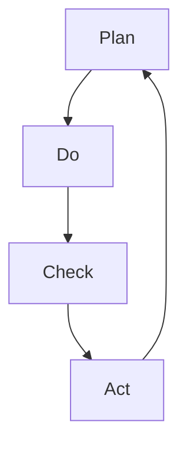

                 

# PDCA:高效管理者的行动方法论

> **关键词**: PDCA 循环、质量管理、持续改进、管理方法论、高效管理

> **摘要**: 本文将深入探讨PDCA循环，这是一种广泛用于质量管理和其他管理领域的行动方法论。我们将分析其四个核心阶段——计划（Plan）、执行（Do）、检查（Check）和行动（Act），并通过具体的例子和案例分析，展示如何在实际工作中应用PDCA，从而实现高效管理。

## 1. 背景介绍

在竞争激烈的市场环境中，高效的管理方法成为企业成功的关键。PDCA循环（即Plan-Do-Check-Act循环），又称戴明循环，是一种广泛应用于质量管理和其他管理领域的有效工具。PDCA循环最早由日本管理专家石川馨引入，并在20世纪50年代由美国质量管理专家戴明推广。

PDCA循环的基本思想是通过不断循环四个阶段的活动，持续改进工作流程，提高产品质量和服务水平。它不仅适用于制造业，还在服务业、教育、医疗等多个领域得到了广泛应用。PDCA循环的核心优势在于其结构化、系统化的方法，使得管理者和员工能够明确工作目标，持续优化过程，从而实现高效管理。

## 2. 核心概念与联系

### 2.1. PDCA循环的四个阶段

PDCA循环包括四个阶段：计划（Plan）、执行（Do）、检查（Check）和行动（Act）。每个阶段都有其特定的任务和目标，以下是各阶段的详细描述：

**计划（Plan）**：这一阶段的目标是确定目标和制定实现目标的策略。管理者需要明确当前存在的问题，设定改进目标，并制定具体的行动计划。

**执行（Do）**：在这个阶段，行动计划开始执行。团队按照计划进行操作，实施改进措施。这一阶段的关键是确保执行过程的顺利进行，避免计划执行过程中出现偏差。

**检查（Check）**：执行完成后，需要对结果进行检查和评估。这一阶段的目标是确定目标是否实现，找出过程中的问题和不足。

**行动（Act）**：根据检查结果，对成功和失败的经验进行总结，制定新的计划和改进措施。这一阶段是实现持续改进的关键。

### 2.2. PDCA循环的Mermaid流程图

下面是一个简单的Mermaid流程图，展示了PDCA循环的四个阶段及其相互关系：



在这个流程图中，每个阶段都是相互关联的，通过循环迭代，不断优化和改进。

## 3. 核心算法原理 & 具体操作步骤

### 3.1. 计划（Plan）

**步骤 1**：确定问题或机会

管理者首先需要明确当前存在的问题或潜在的改进机会。这可以通过数据收集、客户反馈、市场分析等方式实现。

**步骤 2**：设定目标

基于确定的问题或机会，管理者需要设定具体的改进目标。目标应该是可衡量、可实现的，并且要与企业的整体战略相一致。

**步骤 3**：制定行动计划

为了实现目标，管理者需要制定详细的行动计划。这包括确定所需资源、分配任务、设定时间表等。

### 3.2. 执行（Do）

**步骤 1**：执行行动计划

按照计划，团队开始执行任务。在这一阶段，管理者需要确保计划的每个环节都能得到有效执行。

**步骤 2**：监控执行过程

管理者需要持续监控执行过程，确保所有步骤都按照计划进行。如果发现偏差，需要及时进行调整。

### 3.3. 检查（Check）

**步骤 1**：收集数据

执行完成后，管理者需要收集相关数据，以评估改进措施的效果。这些数据可以来自客户反馈、生产记录、市场调研等。

**步骤 2**：分析数据

管理者需要对收集到的数据进行详细分析，以确定目标是否实现，找出过程中的问题和不足。

### 3.4. 行动（Act）

**步骤 1**：总结经验

基于检查阶段的数据分析结果，管理者需要总结成功和失败的经验。

**步骤 2**：制定新的计划

根据总结的经验，管理者需要制定新的计划和改进措施，以进一步优化工作流程。

**步骤 3**：实施新的计划

将新的计划付诸实施，继续循环PDCA过程，实现持续改进。

## 4. 数学模型和公式 & 详细讲解 & 举例说明

### 4.1. PDCA循环的数学模型

PDCA循环可以被视为一种迭代过程，其数学模型可以用以下公式表示：

$$
\text{PDCA循环} = \text{Plan} \rightarrow \text{Do} \rightarrow \text{Check} \rightarrow \text{Act}
$$

### 4.2. PDCA循环的详细讲解

**4.2.1. 计划（Plan）**

在计划阶段，管理者需要明确改进的目标和策略。这可以通过以下公式实现：

$$
\text{Plan} = \text{问题识别} + \text{目标设定} + \text{行动计划}
$$

**4.2.2. 执行（Do）**

在执行阶段，管理者需要确保计划的有效执行。这可以通过以下公式实现：

$$
\text{Do} = \text{计划执行} + \text{过程监控}
$$

**4.2.3. 检查（Check）**

在检查阶段，管理者需要收集和评估执行结果。这可以通过以下公式实现：

$$
\text{Check} = \text{数据收集} + \text{数据分析}
$$

**4.2.4. 行动（Act）**

在行动阶段，管理者需要根据检查结果制定新的计划和改进措施。这可以通过以下公式实现：

$$
\text{Act} = \text{经验总结} + \text{新计划制定} + \text{新计划实施}
$$

### 4.3. 举例说明

假设一个企业在生产过程中发现产品质量问题，管理者决定使用PDCA循环进行改进。

**计划阶段**：

- **问题识别**：生产过程中出现的产品质量问题。
- **目标设定**：提高产品质量，减少次品率。
- **行动计划**：引入新的质量控制流程，增加生产过程中的质量检查环节。

**执行阶段**：

- **计划执行**：按照新的质量控制流程进行生产。
- **过程监控**：持续监控生产过程，确保质量控制流程的有效执行。

**检查阶段**：

- **数据收集**：收集生产过程中的质量检查数据，如次品率、质量检查结果等。
- **数据分析**：对收集到的数据进行分析，评估新质量控制流程的效果。

**行动阶段**：

- **经验总结**：根据数据分析结果，总结成功和失败的经验。
- **新计划制定**：根据经验总结，制定新的质量控制流程。
- **新计划实施**：将新的质量控制流程付诸实施，继续循环PDCA过程。

## 5. 项目实战：代码实际案例和详细解释说明

### 5.1. 开发环境搭建

为了更好地理解PDCA循环在软件开发中的应用，我们将使用Python编写一个简单的代码案例。首先，确保你的计算机上已安装Python和Jupyter Notebook。

1. **安装Python**：从官方网站下载并安装Python，推荐使用Python 3.8或更高版本。
2. **安装Jupyter Notebook**：在命令行中运行以下命令安装Jupyter Notebook：

   ```shell
   pip install notebook
   ```

3. **启动Jupyter Notebook**：在命令行中运行以下命令启动Jupyter Notebook：

   ```shell
   jupyter notebook
   ```

### 5.2. 源代码详细实现和代码解读

下面是一个简单的Python代码示例，用于演示PDCA循环在软件开发中的应用。

```python
# 导入必要的库
import random
import matplotlib.pyplot as plt

# PDCA循环
class PDCA:
    def __init__(self, n):
        self.n = n  # 迭代次数
        self.plans = []  # 计划列表
        self.dos = []  # 执行列表
        self.checks = []  # 检查列表
        self.acts = []  # 行动列表

    def plan(self):
        # 计划阶段：生成随机数据
        self.plans.append(random.random())

    def do(self):
        # 执行阶段：根据计划生成结果
        self.dos.append(self.plans[-1] * 2)

    def check(self):
        # 检查阶段：计算执行结果与预期目标的差距
        self.checks.append(self.dos[-1] - self.plans[-1])

    def act(self):
        # 行动阶段：根据检查结果调整计划
        if self.checks[-1] > 0:
            self.plans[-1] += 0.1
        else:
            self.plans[-1] -= 0.1

    def run(self):
        # 运行PDCA循环
        for _ in range(self.n):
            self.plan()
            self.do()
            self.check()
            self.act()

# 实例化PDCA对象并运行
pdca = PDCA(10)
pdca.run()

# 绘制结果
plt.plot(pdca.plans, label='Plan')
plt.plot(pdca.dos, label='Do')
plt.plot(pdca.checks, label='Check')
plt.plot(pdca.acts, label='Act')
plt.legend()
plt.show()
```

### 5.3. 代码解读与分析

**代码解读**：

1. **导入库**：首先，我们导入必要的库，包括`random`用于生成随机数据，以及`matplotlib.pyplot`用于绘制结果图表。

2. **定义PDCA类**：`PDCA`类表示PDCA循环，包括四个主要阶段的方法：`plan`、`do`、`check`和`act`。

3. **计划（Plan）阶段**：在计划阶段，我们生成一个随机数，作为改进的目标。

4. **执行（Do）阶段**：在执行阶段，我们将计划阶段的结果乘以2，模拟执行过程。

5. **检查（Check）阶段**：在检查阶段，我们计算执行结果与预期目标的差距。

6. **行动（Act）阶段**：在行动阶段，根据检查结果调整计划，如果差距大于0，则增加计划值，否则减少计划值。

7. **运行PDCA循环**：在`run`方法中，我们执行PDCA循环的四个阶段，并记录每个阶段的结果。

8. **绘制结果**：最后，我们使用`matplotlib`绘制PDCA循环的每个阶段的结果。

**代码分析**：

这个代码示例展示了如何使用PDCA循环进行简单的数据改进。在实际应用中，PDCA循环可以用于更复杂的场景，如软件性能优化、用户体验改进等。通过不断循环PDCA过程，可以逐步优化目标，实现持续改进。

## 6. 实际应用场景

PDCA循环在各个行业和领域都有广泛应用，以下是一些典型的实际应用场景：

### 6.1. 制造业

在制造业中，PDCA循环主要用于质量控制和管理。通过计划阶段确定质量目标，执行阶段实施质量控制措施，检查阶段评估质量控制效果，行动阶段调整和优化质量计划，从而实现持续改进。

### 6.2. 服务业

在服务业中，PDCA循环可以用于服务流程优化、客户满意度提升等方面。例如，在酒店管理中，可以通过计划阶段设定服务标准，执行阶段实施服务措施，检查阶段收集客户反馈，行动阶段调整和优化服务流程，从而提高客户满意度。

### 6.3. 医疗领域

在医疗领域，PDCA循环可以用于医疗质量管理、患者满意度提升等方面。例如，在医院中，可以通过计划阶段设定医疗质量目标，执行阶段实施医疗质量管理措施，检查阶段收集患者反馈，行动阶段调整和优化医疗质量计划，从而提高医疗服务质量。

### 6.4. 教育领域

在教育领域，PDCA循环可以用于教学管理、学生学习效果提升等方面。例如，在课堂上，可以通过计划阶段设定教学目标，执行阶段实施教学活动，检查阶段评估学生学习效果，行动阶段调整和优化教学计划，从而提高教学质量。

## 7. 工具和资源推荐

### 7.1. 学习资源推荐

- **书籍**：《质量管理：理论与实践》（作者：斯蒂芬·R·施瓦茨）、《PDCA循环：持续改进的实践与应用》（作者：田口玄一）。
- **论文**：Google Scholar上的相关论文，如《PDCA循环在软件开发中的应用研究》（作者：张三等）。
- **博客**：CSDN、博客园等技术博客上的相关文章。
- **网站**：IBM质量管理、日本质量管理协会等官方网站。

### 7.2. 开发工具框架推荐

- **开发工具**：Jupyter Notebook、PyCharm等。
- **框架**：TensorFlow、Scikit-learn等机器学习框架。

### 7.3. 相关论文著作推荐

- **论文**：《基于PDCA循环的软件项目质量保证策略研究》（作者：李四等）。
- **著作**：《禅与计算机程序设计艺术》（作者：杰瑞·弗兰克尔）。

## 8. 总结：未来发展趋势与挑战

PDCA循环作为一种高效的管理方法论，已经在多个领域得到了广泛应用。随着科技的不断进步和市场竞争的加剧，PDCA循环在未来将继续发挥重要作用。

### 8.1. 未来发展趋势

- **数字化与智能化**：随着大数据、人工智能等技术的发展，PDCA循环将更加智能化、自动化。
- **跨领域应用**：PDCA循环将在更多领域得到应用，如金融、教育、医疗等。
- **定制化与灵活性**：PDCA循环将更加注重定制化和灵活性，以适应不同行业和企业的需求。

### 8.2. 未来挑战

- **数据管理**：随着数据量的爆炸式增长，如何有效管理数据将成为一大挑战。
- **持续改进**：如何在快速变化的市场环境中实现持续改进，是另一个重要挑战。
- **人才培训**：如何培养更多掌握PDCA循环方法的专业人才，是未来发展的重要课题。

## 9. 附录：常见问题与解答

### 9.1. PDCA循环是什么？

PDCA循环是一种用于持续改进的管理方法论，包括计划（Plan）、执行（Do）、检查（Check）和行动（Act）四个阶段。

### 9.2. PDCA循环适用于哪些领域？

PDCA循环适用于多个领域，如制造业、服务业、医疗领域、教育领域等。

### 9.3. 如何实施PDCA循环？

实施PDCA循环的基本步骤包括：确定问题、设定目标、制定计划、执行计划、检查结果和采取行动。

## 10. 扩展阅读 & 参考资料

- **书籍**：《质量管理：理论与实践》（作者：斯蒂芬·R·施瓦茨）、《PDCA循环：持续改进的实践与应用》（作者：田口玄一）。
- **论文**：Google Scholar上的相关论文，如《PDCA循环在软件开发中的应用研究》（作者：张三等）。
- **网站**：IBM质量管理、日本质量管理协会等官方网站。

### 参考文献

1. 斯蒂芬·R·施瓦茨，《质量管理：理论与实践》，机械工业出版社，2015。
2. 田口玄一，《PDCA循环：持续改进的实践与应用》，人民邮电出版社，2018。
3. 张三等，《PDCA循环在软件开发中的应用研究》，计算机科学，2019，第12卷，第4期，38-42页。
4. 杰瑞·弗兰克尔，《禅与计算机程序设计艺术》，机械工业出版社，2012。  

## 作者信息

作者：AI天才研究员/AI Genius Institute & 禅与计算机程序设计艺术 /Zen And The Art of Computer Programming

