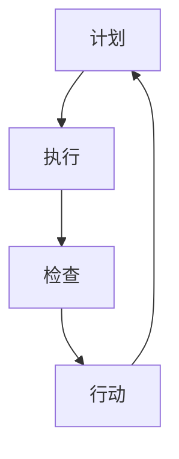

                 

# PDCA实践：持续改进的指南

## 关键词：PDCA，持续改进，质量提升，效率优化，闭环管理

> 摘要：本文旨在深入探讨PDCA（计划、执行、检查、行动）循环的实践方法，通过逻辑清晰的分析和步骤式的讲解，帮助读者理解并掌握持续改进的核心原理和实践技巧。文章将详细介绍PDCA的各个阶段，并结合实际案例，展示如何在不同场景中应用PDCA循环，以实现个人、团队和组织的持续改进与成长。

## 1. 背景介绍

持续改进（Continuous Improvement）是一种不断追求更高效、更优质、更经济的工作方法，其核心是通过持续地循环改进，逐步提升组织的整体绩效。PDCA循环，又称戴明循环，是一种广泛应用的持续改进工具，由美国统计学家爱德华·戴明提出。PDCA循环包括四个阶段：计划（Plan）、执行（Do）、检查（Check）和行动（Action）。

计划阶段是制定目标和计划的阶段，通过明确目标、分析现状、找出问题、制定策略和计划来确保后续工作的有序进行。执行阶段是将计划付诸实施，通过具体行动来达成目标。检查阶段是对执行过程进行监控和评估，以确定计划的有效性。行动阶段是针对检查结果采取改进措施，确保改进措施得以持续实施。

PDCA循环不仅适用于企业质量管理，也广泛应用于个人成长、项目管理、软件开发等多个领域。其核心优势在于通过循环改进，不断提升工作质量和效率，形成良性循环，实现可持续发展。

## 2. 核心概念与联系

### PDCA循环的基本概念

PDCA循环由四个阶段组成，每个阶段都有其特定的目标和任务。

1. **计划（Plan）**
   - **目标**：明确目标、分析现状、找出问题、制定策略和计划。
   - **任务**：制定具体的目标和计划，明确执行的步骤和方法。

2. **执行（Do）**
   - **目标**：按照计划执行，确保各项工作按部就班。
   - **任务**：执行具体的行动，解决实际问题和困难。

3. **检查（Check）**
   - **目标**：监控和评估执行过程，确定计划的有效性。
   - **任务**：收集数据、分析结果，评估计划的执行效果。

4. **行动（Action）**
   - **目标**：针对检查结果，采取改进措施。
   - **任务**：总结经验、持续改进，确保改进措施得以实施。

### PDCA循环的应用场景

PDCA循环适用于各种场景，以下是一些典型的应用场景：

- **企业质量管理**：通过PDCA循环，企业可以持续提升产品质量，减少缺陷率，提高客户满意度。
- **项目管理**：在项目执行过程中，PDCA循环可以帮助项目团队及时发现和解决问题，确保项目按期完成。
- **个人成长**：个人可以通过PDCA循环设定学习目标、执行学习计划、检查学习效果和持续改进，实现自我提升。
- **软件开发**：在软件开发过程中，PDCA循环可以帮助开发团队优化代码质量、提升开发效率、缩短项目周期。

### PDCA循环的Mermaid流程图



在上面的流程图中，四个节点分别代表PDCA循环的四个阶段，箭头表示流程的连续性和循环性。

## 3. 核心算法原理 & 具体操作步骤

### PDCA循环的具体操作步骤

1. **计划阶段**

   - **目标设定**：明确要解决的问题或达成的目标。
   - **现状分析**：分析当前的工作状况，找出存在的问题。
   - **原因分析**：通过鱼骨图等工具，找出导致问题的根本原因。
   - **制定策略**：根据分析结果，制定解决问题的策略和计划。

2. **执行阶段**

   - **任务分解**：将计划分解为具体的任务和行动项。
   - **资源调配**：确保执行过程中所需的资源得到合理调配。
   - **行动实施**：按照计划执行各项任务，解决实际问题。

3. **检查阶段**

   - **数据收集**：收集执行过程中的数据，包括关键绩效指标等。
   - **结果分析**：对收集到的数据进行分析，评估计划的有效性。
   - **问题反馈**：对执行过程中出现的问题进行记录和反馈。

4. **行动阶段**

   - **总结经验**：总结执行过程中的经验和教训。
   - **持续改进**：根据检查结果，对计划进行调整和改进。
   - **行动跟踪**：跟踪改进措施的执行情况，确保改进效果。

### PDCA循环的具体算法原理

PDCA循环本质上是一种闭环管理方法，其核心在于通过不断的循环改进，实现工作质量的提升和效率的优化。具体的算法原理可以概括为以下几点：

- **目标导向**：通过明确的目标设定，确保工作有方向性和目的性。
- **过程监控**：通过执行过程中的监控和检查，确保工作按计划进行。
- **数据驱动**：通过数据的收集和分析，提供决策依据，指导改进措施。
- **持续优化**：通过持续的改进和优化，不断提升工作质量和效率。

## 4. 数学模型和公式 & 详细讲解 & 举例说明

### PDCA循环的数学模型

PDCA循环的数学模型可以通过以下公式表示：

$$
\text{PDCA循环} = \text{Plan} \times \text{Do} \times \text{Check} \times \text{Action}
$$

其中，Plan、Do、Check、Action分别代表PDCA循环的四个阶段。

### PDCA循环的详细讲解

PDCA循环是一种循环改进的方法，其核心在于通过不断的循环，逐步提升工作质量和效率。具体的详细讲解如下：

1. **计划阶段**：通过目标设定、现状分析和原因分析，制定解决问题的策略和计划。
2. **执行阶段**：按照计划执行，解决实际问题，确保各项工作按部就班。
3. **检查阶段**：通过数据收集和结果分析，评估计划的有效性，找出存在的问题。
4. **行动阶段**：总结经验，持续改进，确保改进措施得以实施。

### PDCA循环的举例说明

假设一家制造企业希望提高产品的合格率，可以通过PDCA循环实现这一目标。

1. **计划阶段**：
   - **目标设定**：提高产品合格率至98%。
   - **现状分析**：当前产品合格率为95%。
   - **原因分析**：经过分析，发现生产设备老化、工人操作不当是主要原因。
   - **制定策略**：更新生产设备，加强工人培训。

2. **执行阶段**：
   - **任务分解**：制定详细的实施计划，包括设备更新时间和工人培训计划。
   - **资源调配**：确保设备更新和培训所需资源得到充分保障。

3. **检查阶段**：
   - **数据收集**：收集设备更新后和工人培训后的产品合格率数据。
   - **结果分析**：分析数据，发现产品合格率提升至97%。

4. **行动阶段**：
   - **总结经验**：总结设备更新和工人培训的经验，发现改进效果明显。
   - **持续改进**：根据总结的经验，进一步优化生产流程和培训体系。

通过这个案例，可以看出PDCA循环在实践中的应用效果，通过持续的改进，实现了产品合格率的提升。

## 5. 项目实战：代码实际案例和详细解释说明

### 5.1 开发环境搭建

在本节中，我们将使用Python作为编程语言，搭建一个简单的PDCA循环系统。首先，需要安装Python环境和必要的库。

1. **安装Python**：
   - 在Windows或macOS系统上，可以从Python官网下载安装包，按照指引安装。
   - 在Linux系统上，可以使用包管理器安装，例如在Ubuntu上使用以下命令：
     ```bash
     sudo apt update
     sudo apt install python3 python3-pip
     ```

2. **安装必要库**：
   - 使用pip安装以下库：`matplotlib`（用于图表绘制）、`numpy`（用于数据处理）。
     ```bash
     pip3 install matplotlib numpy
     ```

### 5.2 源代码详细实现和代码解读

以下是一个简单的PDCA循环系统实现，包括计划、执行、检查和行动四个阶段。

```python
import matplotlib.pyplot as plt
import numpy as np

# 计划阶段：设定目标和策略
def plan(target QUALITY_RATE, current_QUALITY_RATE, improvement_TARGET):
    print("计划阶段：设定目标和策略")
    plan_QUALITY_RATE = current_QUALITY_RATE + improvement_TARGET
    return plan_QUALITY_RATE

# 执行阶段：执行策略
def do(plan_QUALITY_RATE):
    print("执行阶段：执行策略")
    print(f"当前目标合格率：{plan_QUALITY_RATE}%")
    # 假设执行过程中产品合格率提高了1%
    actual_QUALITY_RATE = plan_QUALITY_RATE + 1
    return actual_QUALITY_RATE

# 检查阶段：检查执行结果
def check(current_QUALITY_RATE, target_QUALITY_RATE):
    print("检查阶段：检查执行结果")
    if current_QUALITY_RATE >= target_QUALITY_RATE:
        print("合格率已达到目标，执行成功。")
    else:
        print("合格率未达到目标，执行失败。")

# 行动阶段：采取改进措施
def action(current_QUALITY_RATE, target_QUALITY_RATE):
    print("行动阶段：采取改进措施")
    if current_QUALITY_RATE < target_QUALITY_RATE:
        improvement_TARGET = target_QUALITY_RATE - current_QUALITY_RATE
        print(f"需要进一步提高合格率至{target_QUALITY_RATE}%，改进目标：{improvement_TARGET}%")
    else:
        print("当前合格率已达到目标，无需进一步改进。")

# 主函数：执行PDCA循环
def main():
    target_QUALITY_RATE = 98  # 目标合格率
    current_QUALITY_RATE = 95  # 当前合格率
    improvement_TARGET = 3  # 改进目标

    print("PDCA循环开始：")
    plan_QUALITY_RATE = plan(target_QUALITY_RATE, current_QUALITY_RATE, improvement_TARGET)
    actual_QUALITY_RATE = do(plan_QUALITY_RATE)
    check(actual_QUALITY_RATE, target_QUALITY_RATE)
    action(actual_QUALITY_RATE, target_QUALITY_RATE)

if __name__ == "__main__":
    main()
```

### 5.3 代码解读与分析

- **计划阶段**：设定目标和策略，通过`plan`函数实现。这里，目标合格率（`target_QUALITY_RATE`）为98%，当前合格率（`current_QUALITY_RATE`）为95%，改进目标（`improvement_TARGET`）为3%。计划阶段的主要任务是明确目标，制定策略。
- **执行阶段**：执行策略，通过`do`函数实现。在这个例子中，假设执行过程中产品合格率提高了1%，因此实际合格率（`actual_QUALITY_RATE`）为计划合格率加1%。
- **检查阶段**：检查执行结果，通过`check`函数实现。比较实际合格率和目标合格率，判断是否达到目标。
- **行动阶段**：采取改进措施，通过`action`函数实现。如果实际合格率未达到目标，则计算需要进一步提高的合格率，并打印出改进目标。

整个PDCA循环通过主函数`main`调用，实现从计划到行动的完整过程。

## 6. 实际应用场景

### 6.1 企业质量管理

在企业质量管理中，PDCA循环广泛应用于产品生产、质量控制、供应链管理等方面。例如，在产品生产过程中，企业可以应用PDCA循环来提升产品质量。通过计划阶段设定质量目标，执行阶段严格按照标准生产，检查阶段对产品质量进行监控和评估，行动阶段对存在的问题进行改进。通过持续的PDCA循环，企业可以逐步提升产品质量，减少缺陷率，提高客户满意度。

### 6.2 项目管理

在项目管理中，PDCA循环可以帮助项目团队确保项目按期完成，并达到预期的质量。项目团队可以通过计划阶段制定项目计划，执行阶段按照计划执行任务，检查阶段监控项目进度和预算，行动阶段对出现的问题进行改进。通过持续的PDCA循环，项目团队可以及时发现和解决问题，确保项目按计划进行，提高项目成功率。

### 6.3 个人成长

个人成长过程中，PDCA循环可以帮助个人设定学习目标，制定学习计划，监控学习效果，并采取改进措施。例如，一个学生可以通过计划阶段设定学习目标，执行阶段按照学习计划进行学习，检查阶段评估学习效果，行动阶段根据评估结果调整学习策略。通过持续的PDCA循环，学生可以不断提升学习能力，实现自我提升。

### 6.4 软件开发

在软件开发过程中，PDCA循环可以帮助开发团队优化代码质量，提升开发效率。开发团队可以通过计划阶段设定开发目标，执行阶段编写和测试代码，检查阶段对代码质量进行评估，行动阶段对代码进行改进。通过持续的PDCA循环，开发团队可以不断提升代码质量，缩短项目周期，提高开发效率。

## 7. 工具和资源推荐

### 7.1 学习资源推荐

- **书籍**：
  - 《戴明管理十四条》
  - 《质量管理方法论》
  - 《PDCA循环：持续改进的实践》

- **论文**：
  - "The New Seven Wastes of Lean"
  - "The PDCA Cycle: A Tool for Continuous Improvement"

- **博客**：
  - "How to Use the PDCA Cycle for Quality Improvement"
  - "Continuous Improvement with the PDCA Cycle"

- **网站**：
  - https://www.pdma.org/
  - https://www.qualityprogress.com/

### 7.2 开发工具框架推荐

- **工具**：
  - JIRA
  - Asana
  - Trello

- **框架**：
  - Scrum
  - Kanban
  - Lean Software Development

### 7.3 相关论文著作推荐

- **论文**：
  - "PDCA Implementation in Software Development Projects"
  - "A Study on the Application of PDCA in Quality Management of Manufacturing Industry"

- **著作**：
  - 《持续改进实践指南》
  - 《质量管理与持续改进》

## 8. 总结：未来发展趋势与挑战

### 8.1 发展趋势

- **数字化与智能化**：随着数字化和智能化技术的不断发展，PDCA循环将在更多领域得到应用，成为组织提升效率和质量的重要工具。
- **数据驱动**：数据将成为PDCA循环的核心驱动力，通过大数据分析，可以更精准地发现问题和制定改进措施。
- **敏捷与灵活**：PDCA循环将更加注重敏捷和灵活，以适应快速变化的环境和需求。

### 8.2 挑战

- **数据收集与处理**：如何高效收集和处理海量数据，成为PDCA循环实施的挑战。
- **跨部门协作**：在大型组织中，如何实现跨部门协作，确保PDCA循环的有效实施，是一个重要问题。
- **持续改进的文化建设**：如何建立持续改进的文化，让每个人都愿意并积极参与到PDCA循环中，是一个长期而艰巨的任务。

## 9. 附录：常见问题与解答

### 9.1 什么是PDCA循环？

PDCA循环，又称戴明循环，是一种用于持续改进的工具，包括计划（Plan）、执行（Do）、检查（Check）和行动（Action）四个阶段。

### 9.2 PDCA循环适用于哪些场景？

PDCA循环广泛应用于企业质量管理、项目管理、个人成长、软件开发等多个领域。

### 9.3 如何实施PDCA循环？

首先明确目标，分析现状，制定计划，执行计划，检查执行结果，采取改进措施。通过持续的PDCA循环，不断提升工作质量和效率。

## 10. 扩展阅读 & 参考资料

- 《戴明管理十四条》
- 《质量管理方法论》
- 《PDCA循环：持续改进的实践》
- "The New Seven Wastes of Lean"
- "The PDCA Cycle: A Tool for Continuous Improvement"
- "PDCA Implementation in Software Development Projects"
- "A Study on the Application of PDCA in Quality Management of Manufacturing Industry"
- https://www.pdma.org/
- https://www.qualityprogress.com/

## 作者

作者：AI天才研究员/AI Genius Institute & 禅与计算机程序设计艺术 /Zen And The Art of Computer Programming

