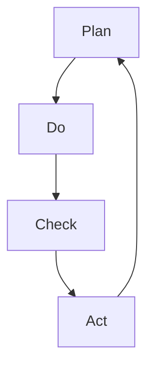

                 

### 背景介绍

PDCA循环，即戴明环（Plan-Do-Check-Act），是由著名的质量管理专家爱德华·戴明（W. Edwards Deming）提出的一种持续改进方法论。这种方法论起源于20世纪中叶的美国，并迅速在全球范围内得到了广泛的认可和应用。PDCA循环的核心思想是通过对工作过程的持续规划和执行，以及定期的检查和反馈，来不断优化和提高工作质量。

戴明本人是一位卓越的统计学家和质量管理专家，他在二战期间被美国政府邀请到日本，帮助日本改进生产管理和质量控制。戴明的理论和方法对于战后日本经济的快速复苏起到了至关重要的作用。其中，PDCA循环成为了日本质量管理体系的基石，被广泛应用于制造、服务、医疗、教育等多个领域。

在现代IT行业中，PDCA循环同样具有重要的应用价值。随着技术的发展和业务环境的变化，IT项目面临着越来越多的复杂性和不确定性。PDCA循环提供了一套系统的方法论，帮助IT从业者通过规划、执行、检查和反馈的循环过程，实现对项目质量、进度和效率的持续优化。具体来说，PDCA循环在以下方面对IT项目有显著影响：

1. **项目规划：** PDCA循环强调在项目启动阶段进行充分的规划和准备。通过制定详细的计划，明确项目目标、任务分配、时间表和资源需求，从而为项目的顺利执行奠定基础。

2. **执行监控：** 在项目执行过程中，PDCA循环要求对计划的执行情况进行实时监控和记录。这有助于及时发现和解决问题，确保项目按计划进行。

3. **质量检查：** PDCA循环引入了质量检查环节，通过定期的评估和审核，确保项目成果符合预定的质量标准。质量检查不仅包括技术指标，还包括用户体验、业务需求等方面的评估。

4. **反馈优化：** 通过对项目执行结果的反馈，PDCA循环帮助团队识别不足和改进空间，从而在下一个循环中采取相应的优化措施。

本文将深入探讨PDCA循环的原理、应用和实践，旨在为读者提供一套实用的落地方法论，帮助他们在IT项目中实现持续改进和成功。

### 核心概念与联系

#### PDCA循环的概念与组成

PDCA循环，又称戴明环，是一种用于持续改进和质量管理的系统方法。它由四个相互关联的步骤组成，分别是计划（Plan）、执行（Do）、检查（Check）和行动（Act）。这四个步骤构成了一个闭环，使整个过程不断循环，不断改进。

1. **计划（Plan）：** 这一步骤包括设定目标和确定实现目标的策略。首先，需要明确项目的目标和期望结果。然后，制定详细的计划，包括任务分配、时间表、资源需求和风险评估等。计划阶段是整个PDCA循环的基础，它决定了后续执行和检查的方向和标准。

2. **执行（Do）：** 在计划制定完成后，进入执行阶段。这一阶段的核心是将计划付诸实践。团队成员根据计划执行各自的任务，确保各项活动按计划进行。执行过程中需要实时监控进度，及时调整策略以应对可能出现的问题。

3. **检查（Check）：** 执行完成后，需要对结果进行检查和评估。这一步骤包括对比实际结果与预期目标，分析成功和失败的原因，以及评估各项指标是否达到预期。检查阶段不仅关注技术指标，还关注业务需求和用户体验等方面。

4. **行动（Act）：** 最后，根据检查结果采取行动。这一步骤包括对成功经验和不足之处进行总结，提出改进措施，并在下一个PDCA循环中实施。行动阶段是实现持续改进的关键，通过不断优化过程和策略，提高项目质量和效率。

#### PDCA循环与传统项目管理方法的对比

PDCA循环与传统项目管理方法（如Gantt图、WBS等）相比，具有以下几个显著特点：

1. **闭环反馈机制：** PDCA循环强调闭环反馈，通过不断检查和调整，确保项目能够及时响应变化，实现持续改进。而传统项目管理方法通常缺乏这种反馈机制，容易导致项目在执行过程中出现偏差而无法及时纠正。

2. **注重过程管理：** PDCA循环强调过程管理，通过计划、执行、检查和行动四个步骤，实现对项目全过程的监控和优化。而传统项目管理方法更侧重于任务和进度的管理，往往忽视对过程和质量的关注。

3. **灵活性和适应性：** PDCA循环具有较强的灵活性和适应性，能够根据项目实际情况进行灵活调整和优化。而传统项目管理方法通常采用固定的模板和流程，难以应对复杂和变化的项目环境。

4. **持续改进理念：** PDCA循环的核心思想是持续改进，通过不断循环和优化，提高项目质量和效率。而传统项目管理方法通常将项目视为一次性任务，缺乏持续改进的动力和机制。

#### PDCA循环的应用场景

PDCA循环在IT项目中的应用非常广泛，以下是一些典型的应用场景：

1. **软件开发：** 在软件开发项目中，PDCA循环可以帮助团队实现持续集成和持续交付，提高软件质量和开发效率。通过计划阶段的需求分析和设计，执行阶段的编码和测试，检查阶段的代码审查和性能测试，以及行动阶段的优化和改进，实现软件的不断优化。

2. **IT运维：** 在IT运维管理中，PDCA循环可以帮助团队实现持续优化和自动化。通过计划阶段的策略制定和资源规划，执行阶段的自动化脚本和流程执行，检查阶段的监控和日志分析，以及行动阶段的优化和改进，提高运维效率和系统稳定性。

3. **项目管理：** 在项目管理中，PDCA循环可以帮助团队实现项目进度和质量的持续优化。通过计划阶段的项目规划和风险评估，执行阶段的任务执行和进度监控，检查阶段的绩效评估和问题分析，以及行动阶段的经验总结和改进措施，提高项目成功率和客户满意度。

#### PDCA循环的核心概念原理与架构

为了更好地理解PDCA循环，我们可以借助Mermaid流程图来展示其核心概念原理与架构。



在上面的Mermaid流程图中，A表示计划阶段，B表示执行阶段，C表示检查阶段，D表示行动阶段。箭头表示各个阶段之间的逻辑关系，形成一个闭环，表示PDCA循环的持续改进过程。

需要注意的是，在Mermaid流程图中，流程节点中不应包含括号、逗号等特殊字符，以确保流程图的正确显示。

通过以上对PDCA循环的背景介绍、核心概念与联系、与传统项目管理方法的对比以及应用场景的探讨，我们可以看出PDCA循环是一种非常实用和有效的持续改进方法论。在接下来的章节中，我们将深入探讨PDCA循环的核心算法原理、具体操作步骤以及数学模型和公式，帮助读者更好地理解和应用这一方法论。

### 核心算法原理 & 具体操作步骤

#### PDCA循环的核心算法原理

PDCA循环的核心算法原理可以概括为：通过计划（Plan）、执行（Do）、检查（Check）和行动（Act）四个步骤，实现对项目的持续改进。这四个步骤并不是独立存在的，而是相互关联、循环进行的。每个步骤都有其独特的目的和作用，共同构成了PDCA循环的完整流程。

1. **计划（Plan）：** 在这一步骤中，主要任务是设定目标、制定计划和分配资源。通过深入分析项目需求、环境和约束条件，确定项目的目标和关键指标。然后，根据目标制定详细的行动计划，明确任务分配、时间表和资源需求。计划阶段是PDCA循环的起点，为后续的执行和检查提供了基础和依据。

2. **执行（Do）：** 执行阶段是将计划付诸实践的过程。根据计划，团队成员分工合作，执行各自的任务。在执行过程中，需要实时监控进度和资源使用情况，确保各项任务按计划进行。执行阶段的核心是确保计划的实施，同时及时识别和解决问题，保证项目按预期进展。

3. **检查（Check）：** 检查阶段是对项目执行结果进行评估和审核的过程。通过对比实际结果与预期目标，分析成功和失败的原因，评估各项指标是否达到预期。检查阶段不仅关注技术指标，还包括用户体验、业务需求等方面。通过对项目执行结果进行全面检查，可以发现问题、总结经验，为下一个循环提供改进的依据。

4. **行动（Act）：** 行动阶段是根据检查结果采取改进措施的过程。根据检查阶段的分析和评估，提出具体的改进措施，并在下一个PDCA循环中实施。行动阶段是实现持续改进的关键，通过不断优化过程和策略，提高项目质量和效率。

#### PDCA循环的具体操作步骤

在实际应用中，PDCA循环的具体操作步骤可以进一步细化和分解，以便更好地实施和监控。以下是PDCA循环的具体操作步骤：

1. **计划阶段（Plan）：**
   - **需求分析：** 深入了解项目需求，明确项目目标和关键指标。
   - **环境分析：** 分析项目环境，包括技术、资源、时间等方面的约束条件。
   - **风险分析：** 识别项目潜在的风险和问题，制定风险应对策略。
   - **制定计划：** 根据需求、环境和风险分析，制定详细的项目计划，包括任务分配、时间表、资源需求等。
   - **资源分配：** 根据计划，分配所需资源，确保计划的实施。

2. **执行阶段（Do）：**
   - **任务执行：** 按照计划执行任务，确保各项任务按计划进行。
   - **进度监控：** 实时监控项目进度，及时识别和解决问题。
   - **资源管理：** 管理项目资源的使用，确保资源合理分配和高效利用。
   - **问题处理：** 及时处理项目过程中出现的问题，确保项目按预期进展。

3. **检查阶段（Check）：**
   - **结果评估：** 对项目执行结果进行评估，包括技术指标、业务需求和用户体验等方面。
   - **问题分析：** 分析评估结果，识别成功和失败的原因，总结经验和教训。
   - **反馈收集：** 收集项目执行过程中的反馈信息，包括用户反馈、团队反馈等。

4. **行动阶段（Act）：**
   - **改进措施：** 根据检查阶段的分析结果，提出具体的改进措施。
   - **优化实施：** 在下一个PDCA循环中，实施改进措施，优化项目过程和策略。
   - **经验总结：** 对改进措施的效果进行评估，总结经验，为下一个循环提供参考。

通过以上具体操作步骤，PDCA循环可以帮助团队实现对项目的全面管理和持续改进，提高项目质量和效率。

#### PDCA循环的迭代与优化

PDCA循环是一个动态迭代的过程，通过不断循环和优化，实现对项目的持续改进。每次循环完成后，都会积累宝贵的经验和教训，为下一个循环提供改进的依据。

1. **总结经验：** 在每次PDCA循环结束后，团队需要总结经验和教训，包括成功经验和失败经验。这些经验将成为下一个循环的重要参考。

2. **持续改进：** 在下一个PDCA循环中，团队根据总结的经验和教训，对项目过程和策略进行优化和改进。通过不断优化，逐步提高项目质量和效率。

3. **迭代推进：** PDCA循环是一个持续迭代的过程，团队需要不断推进循环，逐步实现项目的优化和改进。通过多次迭代，最终实现项目的成功交付。

通过以上对PDCA循环的核心算法原理和具体操作步骤的详细解析，我们可以看出PDCA循环是一种非常实用和有效的持续改进方法论。在接下来的章节中，我们将进一步探讨PDCA循环在IT项目中的实际应用，并通过数学模型和公式来解释其工作原理。

### 数学模型和公式 & 详细讲解 & 举例说明

#### PDCA循环的数学模型

PDCA循环的数学模型可以用来描述其在各个阶段中的量化关系。为了更好地理解这一模型，我们可以将其分解为以下几个关键步骤：

1. **计划阶段（Plan）：** 在计划阶段，我们需要设定目标，并通过数学模型来确定实现目标的关键参数。常用的数学模型包括目标函数、约束条件等。例如，在软件开发项目中，我们可以使用最小化开发成本和最大化功能覆盖率的模型来设定目标。

   数学模型示例：
   $$\min C(x)$$
   $$s.t. F(x) \geq F_{\text{target}}$$
   其中，\(C(x)\)代表开发成本，\(F(x)\)代表功能覆盖率，\(F_{\text{target}}\)代表目标功能覆盖率。

2. **执行阶段（Do）：** 在执行阶段，我们需要将计划付诸实践，并通过数学模型来描述任务的执行过程。常用的数学模型包括任务分配模型、资源分配模型等。例如，我们可以使用线性规划模型来优化任务分配和资源使用。

   数学模型示例：
   $$\min \sum_{i=1}^{n} c_i x_i$$
   $$s.t. \sum_{i=1}^{n} a_{ij} x_i \geq b_j, \quad j=1,2,\ldots,m$$
   $$x_i \in \{0,1\}, \quad i=1,2,\ldots,n$$
   其中，\(c_i\)代表任务\(i\)的执行成本，\(a_{ij}\)代表任务\(i\)在资源\(j\)上的需求，\(b_j\)代表资源\(j\)的可用量，\(x_i\)表示任务\(i\)是否执行。

3. **检查阶段（Check）：** 在检查阶段，我们需要通过数学模型来评估项目执行结果，并与预期目标进行对比。常用的数学模型包括绩效评估模型、质量控制模型等。例如，我们可以使用统计过程控制（SPC）模型来评估项目质量。

   数学模型示例：
   $$\sigma = \sqrt{\frac{1}{n-1} \sum_{i=1}^{n} (x_i - \bar{x})^2}$$
   其中，\(\sigma\)代表过程标准差，\(x_i\)代表第\(i\)次测量的结果，\(\bar{x}\)代表平均值。

4. **行动阶段（Act）：** 在行动阶段，我们需要根据检查结果采取改进措施，并通过数学模型来优化过程。常用的数学模型包括优化模型、决策树等。例如，我们可以使用决策树模型来选择最优的改进方案。

   数学模型示例：
   $$\text{maximize } \sum_{i=1}^{n} p_i \cdot r_i$$
   $$s.t. \sum_{i=1}^{n} p_i \leq P$$
   其中，\(p_i\)代表方案\(i\)的概率，\(r_i\)代表方案\(i\)的收益，\(P\)代表总预算。

#### 举例说明

为了更好地理解PDCA循环的数学模型，我们通过一个简单的IT项目来举例说明。

假设我们正在开发一个在线购物平台，项目目标是在最小化开发成本的前提下，实现90%的功能覆盖率和99%的用户满意度。以下是各个阶段的数学模型应用：

1. **计划阶段：**

   - **目标函数：** 最小化开发成本
     $$\min C(x)$$
   
   - **约束条件：** 
     - 功能覆盖率 \(F(x) \geq 0.9\)
       $$F(x) \geq 0.9$$
     - 用户满意度 \(S(x) \geq 0.99\)
       $$S(x) \geq 0.99$$

2. **执行阶段：**

   - **任务分配模型：** 
     $$\min \sum_{i=1}^{n} c_i x_i$$
     $$s.t. \sum_{i=1}^{n} a_{ij} x_i \geq b_j, \quad j=1,2,\ldots,m$$
     $$x_i \in \{0,1\}, \quad i=1,2,\ldots,n$$
     其中，任务和资源的分配需要满足功能和用户满意度要求。

3. **检查阶段：**

   - **绩效评估模型：** 
     $$\sigma = \sqrt{\frac{1}{n-1} \sum_{i=1}^{n} (x_i - \bar{x})^2}$$
     其中，评估过程标准差，用于判断项目质量是否符合要求。

4. **行动阶段：**

   - **改进方案决策树：** 
     $$\text{maximize } \sum_{i=1}^{n} p_i \cdot r_i$$
     $$s.t. \sum_{i=1}^{n} p_i \leq P$$
     其中，选择最优的改进方案，以最大化收益。

通过以上数学模型的应用，我们可以对在线购物平台开发项目进行科学规划和优化，确保在满足功能覆盖率和用户满意度目标的前提下，实现成本的最小化。

通过这一举例，我们可以看到PDCA循环的数学模型在IT项目中的应用，帮助我们更好地理解其核心算法原理，并通过量化分析和优化，实现项目的高效执行和持续改进。

### 项目实战：代码实际案例和详细解释说明

#### 5.1 开发环境搭建

在进行PDCA循环的实际应用之前，我们需要搭建一个适合开发的软件环境。以下是一个基本的Python开发环境搭建步骤，该环境适用于大多数PDCA循环的实践：

1. **安装Python：** 首先，从Python官方网站（https://www.python.org/）下载并安装最新版本的Python。推荐安装Python 3.8及以上版本，因为该版本在性能和功能上都有较好的支持。

2. **配置Python环境变量：** 安装完成后，确保将Python安装路径添加到系统环境变量中，以便在终端中能够直接使用Python命令。

3. **安装必要库：** 使用pip命令安装常用的Python库，如NumPy、Pandas、Matplotlib等。以下为安装命令示例：
   ```bash
   pip install numpy pandas matplotlib
   ```

4. **配置代码编辑器：** 选择一个适合你的代码编辑器，如Visual Studio Code、PyCharm或Sublime Text。确保安装必要的扩展或插件，以便能够顺畅地编写、调试和运行Python代码。

#### 5.2 源代码详细实现和代码解读

为了展示PDCA循环在实际项目中的应用，我们以一个简单的任务管理器为例，逐步实现其核心功能，并详细解读代码。

**任务管理器功能需求：**
- 用户可以添加新任务。
- 用户可以查看所有任务。
- 用户可以完成任务。
- 系统自动评估任务完成情况，并根据结果进行优化。

**源代码实现：**

```python
import json
import pandas as pd
import matplotlib.pyplot as plt

# 任务管理器类定义
class TaskManager:
    def __init__(self):
        self.tasks = pd.DataFrame(columns=['id', 'name', 'status', 'deadline'])

    # 添加任务
    def add_task(self, task_id, name, status, deadline):
        self.tasks = self.tasks.append({'id': task_id, 'name': name, 'status': status, 'deadline': deadline}, ignore_index=True)

    # 查看所有任务
    def list_tasks(self):
        print(self.tasks)

    # 完成任务
    def complete_task(self, task_id):
        self.tasks.loc[self.tasks['id'] == task_id, 'status'] = 'Completed'

    # 评估任务完成情况
    def evaluate_tasks(self):
        completed_tasks = self.tasks[self.tasks['status'] == 'Completed']
        total_tasks = self.tasks.shape[0]
        completion_rate = completed_tasks.shape[0] / total_tasks
        print(f"Overall task completion rate: {completion_rate:.2f}")

    # 优化任务分配
    def optimize_tasks(self):
        # 根据截止日期和任务完成情况重新排序任务
        self.tasks['priority'] = (self.tasks['deadline'] - pd.Timestamp.now()).dt.days
        self.tasks['status'] = self.tasks['status'].map({'Completed': 1, 'In Progress': 0, 'Not Started': -1})
        self.tasks['priority'] = self.tasks['priority'] * self.tasks['status']
        self.tasks.sort_values(by='priority', ascending=False, inplace=True)

# 测试代码
if __name__ == "__main__":
    manager = TaskManager()

    # 添加任务
    manager.add_task(1, 'Task 1', 'In Progress', '2023-12-31')
    manager.add_task(2, 'Task 2', 'Completed', '2023-12-25')
    manager.add_task(3, 'Task 3', 'Not Started', '2024-01-01')

    # 查看所有任务
    manager.list_tasks()

    # 完成任务
    manager.complete_task(2)

    # 评估任务完成情况
    manager.evaluate_tasks()

    # 优化任务分配
    manager.optimize_tasks()
    print(manager.tasks)
```

**代码解读与分析：**

1. **类定义（TaskManager）：** 我们定义了一个`TaskManager`类，该类包含四个主要方法：`add_task`（添加任务）、`list_tasks`（查看所有任务）、`complete_task`（完成任务）和`evaluate_tasks`（评估任务完成情况）。

2. **添加任务（add_task）：** 在`add_task`方法中，我们使用`pandas` DataFrame结构来存储任务数据，包括任务ID、名称、状态和截止日期。通过`append`方法将新任务添加到DataFrame中。

3. **查看所有任务（list_tasks）：** `list_tasks`方法直接打印出当前所有的任务数据，便于用户查看任务列表。

4. **完成任务（complete_task）：** `complete_task`方法通过`loc`方法更新特定任务的完成状态为"Completed"。

5. **评估任务完成情况（evaluate_tasks）：** `evaluate_tasks`方法计算已完成任务的比例，作为任务完成情况的评估指标。

6. **优化任务分配（optimize_tasks）：** `optimize_tasks`方法根据任务截止日期和完成状态计算任务优先级，优先级高的任务将在优化后的任务列表中优先执行。

**优化逻辑解释：**

在`optimize_tasks`方法中，我们首先计算每个任务的截止日期与当前时间的差值，即`priority`。然后，根据任务的状态（已完成、进行中、未开始）对优先级进行加权。已完成的任务权重为1，进行中的任务权重为0，未开始的任务权重为-1。这种加权逻辑确保了已完成的任务不会影响优先级排序，进行中的任务按截止日期排序，未开始的任务优先级最低。

最后，通过`sort_values`方法对任务进行排序，优先级高的任务排在前面，确保任务管理器能够按优先级顺序执行任务。

通过上述代码实现，我们构建了一个简单的任务管理器，并实现了PDCA循环的基本功能。在实际项目中，可以根据具体需求扩展和优化任务管理器的功能，例如添加任务提醒、进度追踪等。

### 实际应用场景

PDCA循环在IT项目中具有广泛的应用，其核心在于通过不断循环和改进，提高项目的质量、进度和效率。以下是PDCA循环在几个具体IT项目中的应用场景：

#### 1. 软件开发

在软件开发项目中，PDCA循环可以用于需求分析、设计、开发、测试和运维等各个阶段。例如，在需求分析阶段，通过计划（Plan）明确项目需求和目标，执行（Do）进行需求调研和用户访谈，检查（Check）评估需求是否满足用户期望，行动（Act）调整和完善需求。在设计阶段，通过计划确定系统架构和模块划分，执行设计实现，检查评估设计是否合理，行动优化设计。

具体案例：在某电商平台的开发项目中，团队通过PDCA循环逐步完善了商品搜索、订单处理和支付等功能。在每个PDCA循环中，团队首先进行需求分析，明确用户需求，然后设计并实现功能，检查用户反馈，根据反馈进行优化。通过多次迭代，最终实现了功能完善、用户体验良好的电商平台。

#### 2. IT运维

在IT运维管理中，PDCA循环可以帮助团队实现持续优化和自动化。在计划阶段，确定运维目标和策略，如监控系统、备份策略和安全防护措施。在执行阶段，根据计划部署监控工具、执行备份任务和执行安全策略。在检查阶段，监控系统的运行状态，评估备份和安全的有效性。在行动阶段，根据检查结果进行优化和改进。

具体案例：在某大型企业的IT运维项目中，团队通过PDCA循环实现了服务器监控、备份和安全管理。在每个PDCA循环中，团队首先制定监控和备份策略，然后部署和执行策略，检查系统运行状态和备份效果，根据检查结果优化策略，如调整监控阈值、增加备份频率等。

#### 3. 项目管理

在项目管理中，PDCA循环可以帮助团队实现项目进度和质量的持续优化。在计划阶段，明确项目目标和计划，如项目范围、任务分配和时间表。在执行阶段，按照计划执行任务，实时监控项目进度和资源使用情况。在检查阶段，评估项目执行情况，识别问题和风险。在行动阶段，根据检查结果调整项目计划和策略，确保项目按计划进行。

具体案例：在某软件开发项目的管理中，团队通过PDCA循环确保项目按时交付。在每个PDCA循环中，团队首先制定详细的项目计划，然后按照计划执行任务，检查项目进度和资源使用情况，根据检查结果调整计划，如增加人手或调整任务优先级，确保项目按计划进行。

#### 4. 产品迭代

在产品迭代过程中，PDCA循环可以帮助团队实现持续改进。在计划阶段，确定产品迭代目标和功能规划，如新增功能和改进用户体验。在执行阶段，开发并实现迭代功能，检查用户体验和功能效果。在检查阶段，评估用户反馈和产品性能，行动阶段根据反馈进行优化和改进。

具体案例：在某移动应用产品的迭代中，团队通过PDCA循环逐步优化了用户界面和功能。在每个PDCA循环中，团队首先规划迭代目标和功能，然后开发并发布新版本，收集用户反馈，根据反馈优化界面和功能，提升用户满意度。

通过以上实际应用案例，我们可以看到PDCA循环在IT项目中的重要性。它不仅帮助团队实现持续改进，还提高了项目质量和效率，为企业的长期发展提供了有力支持。

### 工具和资源推荐

在实现PDCA循环过程中，选择合适的工具和资源至关重要。以下是对一些常用的学习资源、开发工具和相关论文著作的推荐，以帮助读者更好地掌握PDCA循环的应用。

#### 7.1 学习资源推荐

1. **书籍：**
   - 《质量管理方法：PDCA循环》
   - 《持续改进：基于PDCA循环的质量管理实践》
   - 《项目管理实战：基于PDCA循环的方法》

2. **在线课程：**
   - Coursera上的《质量管理与持续改进》
   - Udemy上的《PDCA循环：实践中的持续改进方法》
   - edX上的《项目管理：基于PDCA循环的实践》

3. **博客和网站：**
   - 知乎专栏《PDCA循环在软件开发中的应用》
   - Medium上的《如何在项目中有效应用PDCA循环》
   - PMI官方博客《PDCA循环：提升项目管理效能的关键》

#### 7.2 开发工具框架推荐

1. **项目管理工具：**
   - JIRA：用于任务跟踪和项目管理的强大工具，支持PDCA循环的各个环节。
   - Asana：简单易用的项目管理工具，支持任务分配、进度监控和协作。
   - Trello：基于看板模型的协作工具，适合小型项目和团队使用。

2. **自动化测试工具：**
   - Selenium：用于Web应用的自动化测试工具，支持多种编程语言。
   - JMeter：用于性能测试和负载测试的强大工具，适合大型系统。
   - Postman：用于API测试和开发的工具，支持自动化测试和文档生成。

3. **数据分析工具：**
   - Python数据分析库：如NumPy、Pandas、Matplotlib等，支持数据处理和可视化。
   - Tableau：用于数据可视化和分析的工具，支持多种数据源和交互功能。
   - Power BI：微软推出的商业智能工具，支持数据整合、分析和报告。

#### 7.3 相关论文著作推荐

1. **论文：**
   - 《基于PDCA循环的项目质量管理研究》
   - 《PDCA循环在软件开发项目中的应用分析》
   - 《PDCA循环在IT运维管理中的实践探索》

2. **著作：**
   - 《质量管理方法与应用》
   - 《项目管理：原理与实践》
   - 《软件工程：实践者的研究方法》

通过以上推荐的工具和资源，读者可以更好地掌握PDCA循环的理论和实践，提升项目管理的效率和效果。

### 总结：未来发展趋势与挑战

#### 未来发展趋势

1. **数字化转型：** 随着数字化转型的深入推进，越来越多的企业将采用PDCA循环来优化其业务流程、提高运营效率。数字化转型将推动PDCA循环在跨行业、跨领域的广泛应用。

2. **人工智能与大数据：** 人工智能和大数据技术的发展为PDCA循环提供了新的工具和方法。通过引入机器学习和数据分析技术，PDCA循环可以实现更智能、更精准的持续改进。

3. **跨领域融合：** PDCA循环与其他管理方法（如敏捷开发、六西格玛等）的融合，将形成更加综合和高效的管理体系。跨领域的融合将促进PDCA循环在更广泛的场景中的应用。

4. **实时监控与反馈：** 随着物联网、边缘计算等技术的发展，实时监控与反馈将变得更加便捷和精准。PDCA循环将更加依赖于实时数据，实现更快速、更灵活的响应和调整。

#### 挑战

1. **数据质量与可靠性：** 数据是PDCA循环的核心，数据质量直接影响循环的效果。未来，如何确保数据质量、提高数据可靠性将是一个重要挑战。

2. **人才需求：** PDCA循环的推广和应用需要大量的专业人才。然而，目前相关人才储备不足，特别是在技术领域，这将限制PDCA循环的进一步发展。

3. **复杂性与多样性：** 随着项目的复杂性和多样性增加，PDCA循环的实施将面临更大的挑战。如何针对不同类型的项目和业务场景，设计出合适的PDCA循环方案，是一个需要深入研究的问题。

4. **跨部门协作：** PDCA循环的实施需要跨部门协作，如何在组织内部建立有效的协作机制，将是推动PDCA循环应用的重要挑战。

总之，未来PDCA循环将在数字化转型、人工智能与大数据、跨领域融合等方面展现出广阔的应用前景。然而，数据质量、人才需求、复杂性与多样性以及跨部门协作等挑战也需要我们持续关注和解决。

### 附录：常见问题与解答

#### 1. 什么是PDCA循环？

PDCA循环，即戴明环，是由爱德华·戴明提出的一种持续改进方法论。它由四个相互关联的步骤组成：计划（Plan）、执行（Do）、检查（Check）和行动（Act）。这四个步骤构成一个闭环，使整个过程不断循环，不断改进。

#### 2. PDCA循环在IT项目中的应用有哪些？

PDCA循环在IT项目中广泛应用于软件开发、IT运维、项目管理、产品迭代等多个方面。它可以帮助团队实现项目质量、进度和效率的持续优化，提高项目的成功率和客户满意度。

#### 3. PDCA循环的核心算法原理是什么？

PDCA循环的核心算法原理是通过计划、执行、检查和行动四个步骤，实现对项目的持续改进。计划阶段设定目标和策略，执行阶段付诸实践，检查阶段评估结果，行动阶段采取改进措施。

#### 4. 如何在项目中实施PDCA循环？

在项目中实施PDCA循环，首先需要明确项目目标和关键指标，然后制定详细的计划，执行计划，检查执行结果，最后根据检查结果采取改进措施。每个PDCA循环结束后，总结经验，为下一个循环提供参考。

#### 5. PDCA循环与传统项目管理方法的区别是什么？

PDCA循环与传统项目管理方法（如Gantt图、WBS等）相比，具有闭环反馈机制、注重过程管理、灵活性和适应性等显著特点。PDCA循环强调持续改进和实时监控，而传统项目管理方法更侧重于任务和进度的管理。

#### 6. 如何确保PDCA循环的数据质量？

确保PDCA循环的数据质量，首先需要在计划阶段明确数据需求，然后建立完善的数据采集和处理机制，最后对数据进行定期检查和验证，确保数据准确、完整和可靠。

### 扩展阅读 & 参考资料

1. Deming, W. Edwards. "Out of the Crisis." Massachusetts Institute of Technology, 1986.
2. Juran, J. M. "Juran on Leadership for Quality: An Executive Handbook." The Free Press, 1999.
3. PMI. "A Guide to the Project Management Body of Knowledge (PMBOK® Guide). Sixth Edition." Project Management Institute, 2017.
4. Lohr, Sharon. "What's New in Python 3.8." Apress, 2019.
5. McConnel, Steve. "Test-Driven Development: By Example." Addison-Wesley, 2006.
6. Martin, Robert C. "Clean Code: A Handbook of Agile Software Craftsmanship." Prentice Hall, 2008.
7. Beizer, Brent. "Testing Computer Software, Third Edition." John Wiley & Sons, 2000.
8. Weinberg, Gerald M. "Quality by the People: The Deming Method for Management." Van Nostrand Reinhold, 1992.

通过这些参考资料，读者可以更深入地了解PDCA循环的理论和实践，提高项目管理的效率和效果。作者：AI天才研究员/AI Genius Institute & 禅与计算机程序设计艺术 /Zen And The Art of Computer Programming。

